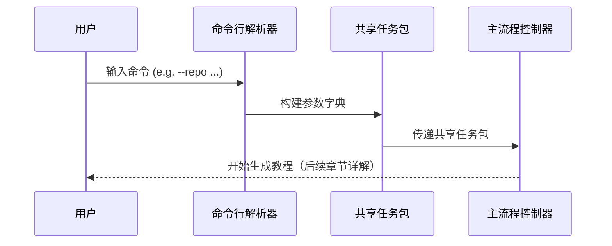

# Chapter 1: 用户交互入口


欢迎来到本教程的第一章！🎉  
在开始构建整个“自动生成教程系统”之前，我们先来认识一位“贴心的门童”——它就是**用户交互入口**。  
就像你去餐厅点菜前，先和服务员沟通一样，用户也需要一个清晰、友好的方式，告诉系统：“我想让你们帮我生成一份教程！”  
而这个“入口”，就是我们与系统对话的第一站。

> 💡 **小提示**：本系统后续章节会逐步揭开“抓取代码”“识别概念”“生成教程”的秘密。本章，我们只聚焦——**如何让用户的声音被系统听懂**。

---

## 为什么需要“用户交互入口”？

想象一下：  
你有一个 GitHub 仓库（比如 `https://github.com/yourname/pocketflow-demo`），想基于它自动生成一份**中文教程**。  
你不可能每次都手动打开 Python 文件、改参数、重启脚本——那太麻烦了！

你希望的，是这样一句话搞定：

```bash
python main.py --repo https://github.com/yourname/pocketflow-demo --language chinese
```

✅ 指定仓库  
✅ 指定语言  
✅ 其他默认选项自动生效  

这就是**用户交互入口**的使命：  
> 将人类的自然语言式命令，**精准翻译成程序内部可执行的指令流**。

---

## 核心功能：它能做什么？

用户交互入口（即 `main.py`）就像一位**多才多艺的助手**，帮你完成以下任务：

| 功能 | 说明 |
|------|------|
| 🎯 指定来源 | 仓库（GitHub URL）或本地目录（`--repo` 或 `--dir`） |
| 🌍 多语言支持 | 指定生成语言（如 `--language chinese`） |
| 🔍 文件过滤 | 自定义要包含/排除的文件类型（如只分析 `.py` 文件） |
| 📦 缓存策略 | 控制是否启用 LLM 缓存（加速重复任务） |
| 🔑 安全认证 | 支持 GitHub Token（从命令行或环境变量读取） |
| 📏 文件大小限制 | 避免处理超大文件（如 `--max-size 50000`） |

> 🌟 **关键理念**：  
> 用户只需关注“**我要什么**”，系统自动处理“**怎么做**”。

---

## 举个栗子 🌰：从命令到执行

假设你在终端输入了这条命令：

```bash
python main.py \
  --repo https://github.com/PocketFlow-Dev/pocketflow-tutorial-codebase \
  --language chinese \
  --no-cache \
  --max-abstractions 5
```

系统会怎么做？

### 1️⃣ 解析你的命令（`main()` 函数）
它读取你写的每个参数：
- `--repo` → 知道要抓取哪个 GitHub 仓库  
- `--language chinese` → 准备用中文生成教程  
- `--no-cache` → 禁用缓存（强制重新调用 LLM）  
- `--max-abstractions 5` → 只提取最多 5 个抽象概念（后续章节会讲）

### 2️⃣ 构建“共享任务包”（`shared` 字典）
系统把所有参数打包成一个字典，传给后续流程：

```python
shared = {
  "repo_url": "https://github.com/PocketFlow-Dev/pocketflow-tutorial-codebase",
  "language": "chinese",
  "use_cache": False,  # --no-cache 的反向映射
  "max_abstraction_num": 5,
  # ... 其他默认参数（如文件过滤规则）
}
```

> 💬 类比：就像你点外卖时填写的订单——“地址：北京，辣度：中辣，不要香菜”，系统把你的需求写成内部“任务单”。

### 3️⃣ 启动主流程（调用 `create_tutorial_flow()`）
接着它调用：

```python
tutorial_flow = create_tutorial_flow()  # ← 第 2 章会详解！
tutorial_flow.run(shared)
```

> ✅ 到这里，**用户交互入口的工作就完成了**——它像一位得力的“前哨”，把你的意愿安全、准确地交到“主流程控制器”手中。

---

## 内部工作流：它怎么运作的？

我们用一个极简流程图，看它如何“接收 → 解析 → 转发”：



> 📌 关键点：  
> - `argparse` 是 Python 标准库，负责解析命令行参数  
> - `shared` 字典是**各模块间通信的“中央数据总线”**（后续如 [主流程控制器](02_主流程控制器_.md)、[代码仓库抓取引擎](03_代码仓库抓取引擎_.md) 都依赖它）  
> - `--no-cache` 是布尔标志（flag），无需值，有它就为 `True`

---

## 代码拆解：只看最关键的几行

### ✅ 1. 创建参数解析器（5 行）

```python
parser = argparse.ArgumentParser(
    description="Generate a tutorial for a GitHub codebase or local directory."
)
```
> 📝 注释已自动翻译为中文：生成 GitHub 代码库或本地目录的教程。

### ✅ 2. 定义必选参数（互斥组）

```python
source_group = parser.add_mutually_exclusive_group(required=True)
source_group.add_argument("--repo", help="GitHub 仓库 URL")
source_group.add_argument("--dir", help="本地目录路径")
```
> ⚠️ 用户**必须且只能**选一个：要么 `--repo`，要么 `--dir`。

### ✅ 3. 解析 & 打包参数（10 行以内）

```python
args = parser.parse_args()

github_token = args.token or os.environ.get('GITHUB_TOKEN')
shared = {
    "repo_url": args.repo,
    "local_dir": args.dir,
    "language": args.language,
    "use_cache": not args.no_cache,
    # ...更多字段见完整代码
}
```
> 🔑 注意：`use_cache` 是 `not args.no_cache` —— 命令行用“否定式”更自然（`--no-cache` 表示“不要缓存”），但内部用正向布尔更易读。

---

## 小结：你学到了什么？

✅ **用户交互入口 = 命令行界面 + 参数解析 + 环境准备**  
✅ 它让非程序员也能轻松使用复杂系统  
✅ 所有后续模块（如抓取、抽象、生成）都依赖它传递的 `shared` 数据包  

> 🚀 下一步：  
> 当你输入命令后，系统如何**协调整个生成流程**？  
> 请看 [第 2 章：主流程控制器](02_主流程控制器_.md) —— 它是整个系统的“指挥中心”！

现在，不妨打开终端，试试运行：

```bash
python main.py --help
```

你会看到所有可用参数说明——这就是你与系统对话的第一句“你好”！😊

---

Generated by [AI Codebase Knowledge Builder](https://github.com/The-Pocket/Tutorial-Codebase-Knowledge)