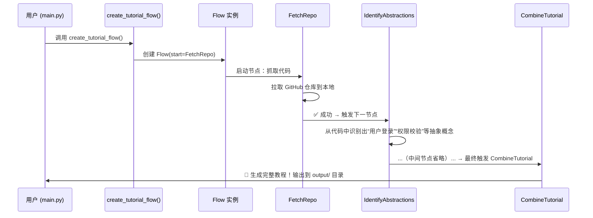

# Chapter 2: 主流程控制器


上一章我们认识了系统的“贴心门童”——[用户交互入口](01_用户交互入口_.md)。它听懂了你的话（比如 `--repo https://github.com/...`），打包成一份清晰的“任务单”，然后——**交给谁执行呢？**

别急！  
这位“任务单”的接收者，就是本章的主角：**主流程控制器** 🎼

---

## 为什么需要“主流程控制器”？

想象你要组织一场**音乐会**：

- 小提琴手要先调音 ✅  
- 钢琴师要等小提琴定调后再加入 ✅  
- 指挥不能让鼓手在小提琴没开始时就敲鼓 ❌  

如果没有指挥——所有乐手各自为战，音乐就会变成噪音 🎻🎹🥁

而你的教程生成任务，也是一场“知识协奏曲”：

| 步骤 | 负责角色 | 类比 |
|------|----------|------|
| 1️⃣ 抓取代码 | 代码仓库抓取引擎 | 🎻 小提琴手：先准备素材 |
| 2️⃣ 提炼概念 | 抽象概念识别器 | 🎹 钢琴师：从素材中找出主旋律 |
| 3️⃣ 建关系图谱 | 关系图谱构建器 | 🥁 鼓手：确定节奏与结构 |
| 4️⃣ 编排章节 | 教程章节编排师 | 🎼 指挥：安排乐章顺序 |
| 5️⃣ 写教程章节 | 分步教程生成器 | 🎼 各声部演奏 |
| 6️⃣ 合并发布 | 教程整合发布器 | 📀 录音成碟 |

👉 **主流程控制器**，就是那位**交响乐指挥家**——它不亲自演奏，却精准调度每一位“乐手”，确保：
- 顺序对（先抓代码，再抽象）
- 出错能重试（某个乐手跑调了？指挥喊“再来一遍！”）
- 错误不中断（鼓手摔鼓槌了？指挥改用钢琴补位）

> 💡 **一句话定义**：  
> **主流程控制器 = 用 Pocket Flow 框架编排各节点的执行顺序 + 自动管理重试与错误的调度中枢**

---

## 核心思想：像拼乐高一样组装流程

在 Pocket Flow 框架中，每个功能模块（比如“抓代码”“识别概念”）都是一个**节点（Node）**。  
主流程控制器的任务，就是把这些节点按逻辑顺序“串”起来，形成一条**工作流（Flow）**。

我们来看一个真实例子 🌰：

假设你运行了这条命令（还记得吧？）：

```bash
python main.py --repo https://github.com/PocketFlow-Dev/pocketflow-tutorial-codebase --language chinese
```

主流程控制器会自动做这些事：

1. **创建节点实例**  
   - `FetchRepo()`：负责拉取代码  
   - `IdentifyAbstractions()`：负责识别抽象概念  
   - `AnalyzeRelationships()`：负责画关系图  
   - ……（其他节点同理）

2. **连接节点顺序**  
   ```python
   抓取代码 → 识别抽象 → 分析关系 → 编排章节 → 写章节 → 合并输出
   ```

3. **启动执行**  
   当你调用 `tutorial_flow.run(shared)`，整个流程自动启动！

> ✅ **关键理念**：  
> 你**不用写任何循环或条件判断**——Pocket Flow 自动处理依赖、重试、失败回滚。

---

## 举个栗子 🌰：主流程控制器怎么“指挥”？

下面是一段简化版的主流程创建代码（来自 [`flow.py`](flow.py)）：

```python
from pocketflow import Flow
from nodes import (
    FetchRepo,
    IdentifyAbstractions,
    AnalyzeRelationships,
    OrderChapters,
    WriteChapters,
    CombineTutorial
)

def create_tutorial_flow():
    # 创建6个节点（就像准备6个乐手）
    fetch_repo = FetchRepo()
    identify_abstractions = IdentifyAbstractions(max_retries=5, wait=20)
    analyze_relationships = AnalyzeRelationships(max_retries=5, wait=20)
    order_chapters = OrderChapters(max_retries=5, wait=20)
    write_chapters = WriteChapters(max_retries=5, wait=20)
    combine_tutorial = CombineTutorial()

    # 用 ">>" 符号连接节点（像拉琴弓一样连成一条线）
    fetch_repo >> identify_abstractions
    identify_abstractions >> analyze_relationships
    analyze_relationships >> order_chapters
    order_chapters >> write_chapters
    write_chapters >> combine_tutorial

    # 创建流程，指定起点（就像指挥举起指挥棒）
    tutorial_flow = Flow(start=fetch_repo)

    return tutorial_flow
```

### 🔍 逐行解读（超简单版）

| 行号 | 代码 | 说明 |
|------|------|------|
| 1 | `from pocketflow import Flow` | 导入“指挥棒”工具包 |
| 2–8 | `from nodes import ...` | 把6个“乐手”（节点类）请进排练厅 |
| 10–15 | `fetch_repo = ...` | 实例化每个节点（乐手就位） |
| 16–20 | `>>` 连接 | **定义执行顺序**：`A >> B` 表示“A 完成后自动触发 B” |
| 22–23 | `Flow(start=...)` | **启动指令**：告诉系统“从 `fetch_repo` 开始” |
| 24 | `return tutorial_flow` | 返回整套“乐谱” |

> 💡 **注意**：  
> - `max_retries=5` 表示：如果某个节点失败，最多重试 5 次  
> - `wait=20` 表示：每次重试前等待 20 秒（避免频繁请求 GitHub）  
> - `WriteChapters` 是 `BatchNode`（批量节点），会一次性处理多个任务（后续章节详解）

---

## 内部工作流：指挥棒动起来！

我们用一个极简的时序图，看看主流程控制器**启动后发生了什么**：



### 📌 关键细节（新手必读）

- **数据怎么流动？**  
  每个节点**读写同一个 `shared` 字典**（你在 `main.py` 里创建的那个！）  
  例如：
  ```python
  shared["files"] = [...]   # FetchRepo 写入
  shared["abstractions"] = [...]  # IdentifyAbstractions 读取后追加
  shared["final_output_dir"] = "/app/output/tutorial"  # CombineTutorial 最终写入
  ```

- **出错怎么办？**  
  - 如果 `FetchRepo` 失败（比如网络断了），系统自动重试 5 次  
  - 若仍失败 → 抛出异常，流程停止（但不会影响已生成的部分）  
  - 所有重试逻辑由 Pocket Flow **自动处理**，你无需写 `try...except`

- **为什么不用 `if-else`？**  
  因为节点间是**数据驱动的依赖关系**——只要前一个节点输出了 `shared["files"]`，后一个节点就自动触发。  
  这就像多米诺骨牌：推倒第一块，后面的自然倒下 🎯

---

## 代码拆解：主流程控制器怎么被调用？

还记得 `main.py` 中的最后一行吗？  
👉 就是这句：

```python
tutorial_flow = create_tutorial_flow()  # ← 创建指挥棒
tutorial_flow.run(shared)               # ← 开始演出！
```

我们把它展开成 3 步，更清晰：

### ✅ 步骤 1：准备“任务单”（`shared` 字典）

```python
shared = {
    "repo_url": "https://github.com/PocketFlow-Dev/...",
    "language": "chinese",
    "files": [],  # 留空，等 FetchRepo 填充
    "abstractions": [],  # 等 IdentifyAbstractions 填充
    # ...
}
```
> 📝 这份“任务单”会**贯穿整个流程**，像接力棒一样在节点间传递。

### ✅ 步骤 2：创建流程（`create_tutorial_flow()`）

调用后返回一个 `Flow` 对象，它内部已预设好：
- 节点顺序  
- 重试策略  
- 数据流向  

### ✅ 步骤 3：启动执行（`run(shared)`）

```python
tutorial_flow.run(shared)
```
- 系统**自动调用 `fetch_repo.run(shared)`**
- 成功后 → 自动调用 `identify_abstractions.run(shared)`
- 如此依次执行，直到 `combine_tutorial`

> 🌟 **你不需要写任何循环！**  
> 就像按下 CD 播放器的“播放”键——整张专辑会自动顺序播放。

---

## 小结：你学到了什么？

✅ **主流程控制器 = 调度中枢 + 自动重试机制 + 数据流编排器**  
✅ 它让复杂任务（抓代码→识别→生成）变得像搭积木一样简单  
✅ 所有节点共享 `shared` 字典，像一个“中央黑板”记录进度  
✅ Pocket Flow 框架接管了重试、错误处理等脏活累活

> 🚀 下一步：  
> 既然指挥棒已举起，第一个“乐手”——**代码仓库抓取引擎**——该登场了！  
> 请看 [第 3 章：代码仓库抓取引擎](03_代码仓库抓取引擎_.md) —— 它负责把 GitHub 仓库“搬”到本地，是整个流程的起点！

现在，不妨打开 [`flow.py`](flow.py) 文件，试着画一画节点之间的连接线——  
就像给交响乐团排练时画出声部顺序图，你会更清楚“指挥”的智慧！ 🎼

---

Generated by [AI Codebase Knowledge Builder](https://github.com/The-Pocket/Tutorial-Codebase-Knowledge)