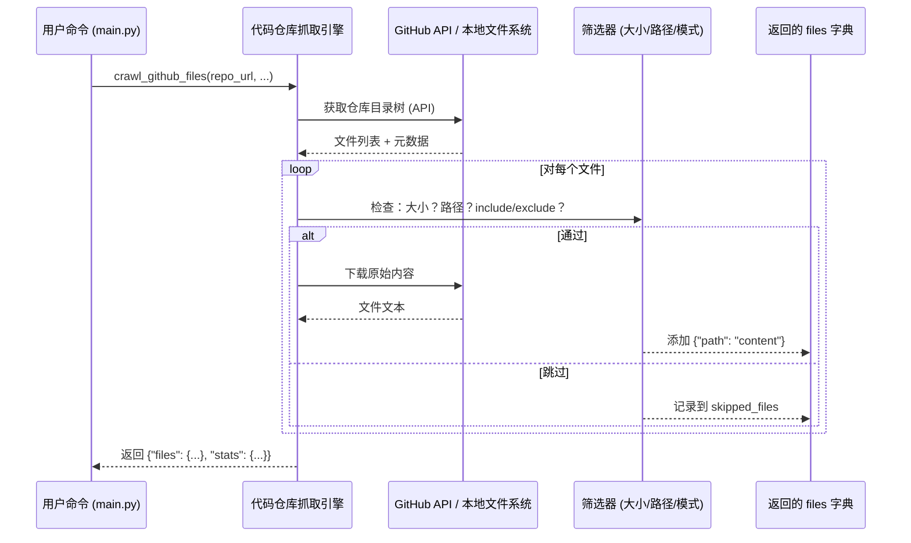

# Chapter 3: 代码仓库抓取引擎


上一章我们认识了系统的“指挥中心”——[主流程控制器](02_主流程控制器_.md)。它像一位沉着的交响乐指挥家，把整个教程生成任务拆解成多个“乐手”（节点），并安排它们**按顺序协作**。  
那么——**第一个乐手要演奏什么？**

答案是：  
> 🎵 **把远程 GitHub 仓库或本地代码“搬”到系统里，变成可读的文本文件！**

这就是本章的主角：**代码仓库抓取引擎** 📁

---

## 为什么需要“代码仓库抓取引擎”？

想象你要写一本《如何搭建一个机器人》的教程。  
但你**没有机器人零件**——你需要先从仓库里“借”来机器人的图纸和代码。

问题来了：
- 🌐 GitHub 上的文件不能直接打开（它藏在服务器上）
- 📄 有些文件是测试脚本（如 `test_xxx.py`），与核心逻辑无关
- 📉 有些文件太大（如 50MB 的模型文件），读入会卡死
- 📁 你想只分析 `.py` 和 `.md` 文件，忽略 `.md.bak` 或 `.git/`

> 💡 **一句话使命**：  
> **代码仓库抓取引擎 = 一位勤勉的图书管理员 + 一位严格的筛选员**  
> 它主动访问仓库（GitHub 或本地），按规则筛选出**真正重要的代码文件**，并整理成清晰的“文件列表 + 内容”结构，为后续“抽象提炼”打下坚实基础。

---

## 举个栗子 🌰：你想生成教程，系统该怎么做？

你运行了这条命令（还记得吧？）：

```bash
python main.py --repo https://github.com/PocketFlow-Dev/pocketflow-tutorial-codebase --language chinese
```

**代码仓库抓取引擎**立刻行动：

| 步骤 | 它做了什么？ | 类比 |
|------|-------------|------|
| 🚪 出发 | 连接到 GitHub 仓库 URL | 🚶‍♂️ 图书管理员走向书架 |
| 🔍 扫描 | 遍历所有文件（递归子目录） | 👀 翻看每一本书的封面 |
| ✂️ 筛选 | 排除测试文件、大文件、无关扩展名 | 🧹 把杂志、过期报纸挑出来 |
| 📦 打包 | 把每个文件变成 `路径 → 内容` 键值对 | 📁 把精选书籍按书架位置编号归档 |
| 📤 上交 | 返回给主流程控制器：`{"files": {"src/main.py": "#!/usr/bin/env python\n...", ...}}` | 📬 把整理好的书单交给下一位工作人员 |

> ✅ **最终交付物**：一个字典，键是**文件相对路径**，值是**文件完整文本内容**  
> （例如：`"src/handler.py": "def login(user, pwd): ..."`）

---

## 核心功能：它能做什么？

代码仓库抓取引擎（即 [`crawl_github_files()`](utils/crawl_github_files.py) 和 [`crawl_local_files()`](utils/crawl_local_files.py)）就像一位**多面手**：

| 功能 | 说明 | 为什么重要？ |
|------|------|-------------|
| 🌐 支持 GitHub 仓库 | 通过 URL 直接抓取远程代码（支持分支/提交/子目录） | 用户无需手动 clone |
| 📂 支持本地目录 | 用 `--dir` 参数指定本地路径 | 适合离线开发或私有代码 |
| 🚫 智能过滤 | 排除 `.test.py`、`docs/`、`__pycache__/` 等无关内容 | 聚焦核心逻辑，避免噪声 |
| 📏 文件大小限制 | 默认跳过 >1MB 的文件（可配置） | 防止内存溢出 |
| 🧩 模式匹配 | `include_patterns={"*.py", "*.md"}` + `exclude_patterns={"tests/*"}` | 灵活控制“抓哪些” |
| 📁 路径归一化 | 支持相对路径（`use_relative_paths=True`） | 便于后续处理 |

> 💡 **关键理念**：  
> 它**不关心代码含义**——只负责**安全、高效、干净地把源码“搬运”到内存中**。  
> 后续的“抽象提炼”“关系图谱”都依赖它提供的**干净、结构化的文件集合**。

---

## 怎么用它？——3 分钟上手

我们用一个**极简示例**演示它的用法（完整实现在 [`utils/crawl_github_files.py`](utils/crawl_github_files.py)）：

### ✅ 示例 1：抓取 GitHub 仓库（只含 Python 和 Markdown 文件）

```python
from utils.crawl_github_files import crawl_github_files

result = crawl_github_files(
    repo_url="https://github.com/PocketFlow-Dev/pocketflow-tutorial-codebase/tree/main/src",
    max_file_size=500_000,  # 500KB
    include_patterns={"*.py", "*.md"},
    exclude_patterns={"tests/*", "*_test.py"}
)
```

#### 输出结果（简化版）：

```python
{
  "files": {
    "src/main.py": "def run():\n    print('Hello')",
    "src/handler.py": "def login(user): ...",
    "README.md": "# PocketFlow Tutorial\nThis is a demo..."
  },
  "stats": {
    "downloaded_count": 3,
    "skipped_count": 2,
    "skipped_files": [
      ("tests/test_main.py", 120000),  # 被 exclude_patterns 拦截
      ("large_model.bin", 2000000)      # 超出 size 限制
    ]
  }
}
```

> 📝 **重点看 `files` 字典**：  
> - 键：**文件相对路径**（`"src/main.py"` 而非完整绝对路径）  
> - 值：**纯文本内容**（UTF-8 编码，已自动解码）  
> - 顺序：无要求（字典是无序的，但后续处理不依赖顺序）

---

### ✅ 示例 2：抓取本地目录（忽略 `.git/` 和 `.venv/`）

```python
from utils.crawl_local_files import crawl_local_files

result = crawl_local_files(
    directory="../",  # 当前目录的父目录
    exclude_patterns={"*.pyc", "__pycache__/*", ".venv/*", ".git/*", "docs/*"},
    max_file_size=100_000
)
```

#### 输出结果（简化版）：

```python
{
  "files": {
    "main.py": "#!/usr/bin/env python\n...",
    "flow.py": "from pocketflow import Flow\n...",
    "README.md": "# PocketFlow Tutorial..."
  },
  "stats": {
    "downloaded_count": 3,
    "skipped_count": 4,
    "skipped_files": [
      ("__pycache__/main.cpython-310.pyc", 12000),
      (".git/config", 500)
    ]
  }
}
```

> 🔍 **对比 GitHub 版本**：  
> - 本地版**不依赖网络**（直接读磁盘）  
> - 本地版**自动支持 `.gitignore` 规则**（更智能！）  
> - 两者返回**完全一致的数据结构** → 后续模块**无需区分来源**！

---

## 内部工作流：它怎么运作的？

我们用一个极简流程图，看它如何“访问 → 扫描 → 筛选 → 打包”：



### 📌 关键细节（新手必读）

| 问题 | 解决方案 |
|------|---------|
| **GitHub 会限流怎么办？** | 自动检测 `403 Rate Limit` 错误 → 等待 `X-RateLimit-Reset` 时间再重试 |
| **如何处理私有仓库？** | 支持 `token` 参数（从 `GITHUB_TOKEN` 环境变量读取） |
| **如何跳过子目录？** | `exclude_patterns` 支持通配符（如 `"tests/*"`） |
| **中文文件名会乱码吗？** | 全程使用 `utf-8-sig` 编码（自动跳过 BOM） |
| **本地版为何更快？** | 直接 `os.walk()` 读磁盘，**无需网络请求** |

---

## 代码拆解：只看最关键的几行！

我们聚焦 [`crawl_github_files()`](utils/crawl_github_files.py) 中的**核心逻辑**（简化版）：

### ✅ 步骤 1：解析 URL，提取仓库信息（6 行）

```python
from urllib.parse import urlparse

parsed = urlparse(repo_url)
parts = parsed.path.strip('/').split('/')  # e.g. ["microsoft", "autogen", "tree", "..."]
owner, repo = parts[0], parts[1]  # "microsoft", "autogen"
```
> 📝 注释已翻译：  
> - `urlparse` 将 `https://github.com/owner/repo/...` 拆成 `scheme://netloc/path?query#fragment`  
> - 我们只关心 `path` 部分（`parts`）

---

### ✅ 步骤 2：构建筛选规则（5 行）

```python
def should_include_file(file_path, file_name):
    # 检查 include_patterns
    include = not include_patterns or any(fnmatch.fnmatch(file_name, p) for p in include_patterns)
    # 检查 exclude_patterns
    exclude = exclude_patterns and any(fnmatch.fnmatch(file_path, p) for p in exclude_patterns)
    return include and not exclude
```
> 🌟 **核心技巧**：  
> - `fnmatch.fnmatch("test_main.py", "*.py")` → `True`  
> - `fnmatch.fnmatch("tests/test_main.py", "tests/*")` → `True`  
> - 用 `and not exclude` 确保：**先选中，再排除**

---

### ✅ 步骤 3：遍历文件 + 下载内容（核心！8 行）

```python
files = {}
for item in contents:  # contents 来自 GitHub API 的目录列表
    if item["type"] == "file":
        if not should_include_file(item["path"], item["name"]):
            continue  # 跳过不符合规则的文件

        # 下载文件内容
        file_url = item["download_url"]
        resp = requests.get(file_url, headers=headers)
        if resp.status_code == 200:
            files[item["path"]] = resp.text  # 存入字典
```
> 💡 **关键点**：  
> - `resp.text` 是**自动解码后的字符串**（非字节流）  
> - `files[item["path"]]` 直接存**相对路径**（已处理 `use_relative_paths`）

---

### ✅ 步骤 4：返回结果（2 行）

```python
return {
    "files": files,
    "stats": {
        "downloaded_count": len(files),
        "skipped_count": len(skipped_files),
        ...
    }
}
```
> ✅ **这就是后续模块的“输入”**！  
> 比如 [抽象概念识别器](05_抽象概念识别器_.md) 会读取 `shared["files"]` 来分析代码。

---

## 它如何与系统其他部分协作？

代码仓库抓取引擎是**整个流程的第一环**，它输出的数据直接喂给后续节点：


> 🌟 **关键设计原则**：  
> - **统一数据接口**：无论是 GitHub 还是本地，都返回 `{"files": {...}, "stats": {...}}`  
> - **零侵入**：后续模块**完全不知道**数据来自 GitHub 还是本地  
> - **可扩展**：未来新增“GitLab 抓取引擎”？只需实现同样接口即可！

---

## 小结：你学到了什么？

✅ **代码仓库抓取引擎 = 数据准备阶段的“守门人”**  
✅ 它负责把混乱的代码仓库，变成**干净、结构化、可读的文件集合**  
✅ 支持 GitHub + 本地双模式，自动过滤测试/文档/大文件  
✅ 返回 `{"files": {path: content}, "stats": {...}}`，供后续模块直接使用  

> 🚀 下一步：  
> 当代码文件被安全、干净地“搬运”到内存后——  
> **谁来从这些代码中“提炼出抽象概念”**？  
> 请看 [第 4 章：本地文件扫描器](04_本地文件扫描器_.md) —— 它负责**高效读取本地缓存的文件**，避免重复拉取 GitHub！  
> （提示：它和抓取引擎是“搭档”，一个用于远程，一个用于本地复用）

现在，不妨打开 [`utils/crawl_github_files.py`](utils/crawl_github_files.py) 文件，试着运行：

```python
if __name__ == "__main__":
    result = crawl_github_files(
        "https://github.com/PocketFlow-Dev/pocketflow-tutorial-codebase/tree/main/src",
        include_patterns={"*.py"}
    )
    print(f"抓取了 {len(result['files'])} 个文件")
```

你会看到它像一位勤勉的图书管理员，默默把书架上的书一本本挑出来——  
**没有它，后续所有“知识提炼”都无从谈起！** 📚✨

---

Generated by [AI Codebase Knowledge Builder](https://github.com/The-Pocket/Tutorial-Codebase-Knowledge)