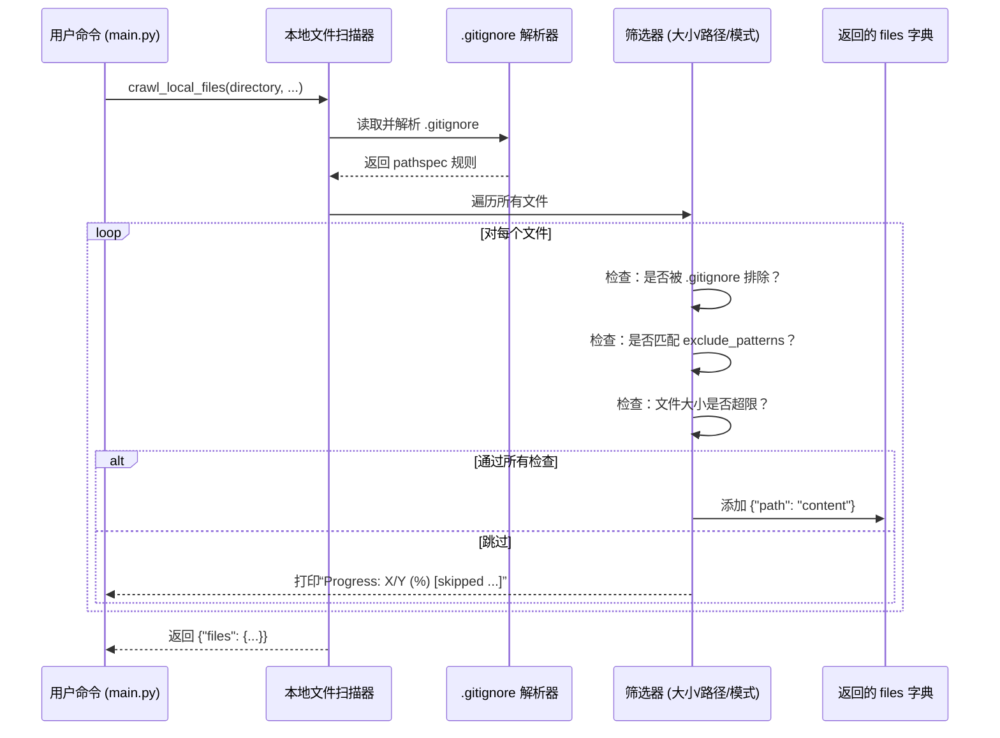

# Chapter 4: 本地文件扫描器


上一章我们认识了系统的“图书管理员”——[代码仓库抓取引擎](03_代码仓库抓取引擎_.md)。它像一位勤快的搬运工，把远程 GitHub 仓库里的文件**拉到本地**，为后续分析打下基础。  
但你有没有想过：  
> 🤔 *如果我正在本地反复调试一个项目，难道每次都要重新下载一遍 GitHub？太浪费时间了！*

别急！  
这位“**本地文件扫描器**”正是为解决这个问题而生——它像一位**高效、智能的本地勘探员**，快速扫描你电脑里已缓存的代码文件，并**跳过无关内容**（比如 `.gitignore` 忽略项、大文件），输出与远程抓取**完全一致的结构化数据**，让后续流程“无缝衔接”。

---

## 为什么需要“本地文件扫描器”？

想象你正在开发一个新功能，反复修改本地代码：  
```bash
# 你本地有缓存好的项目副本（比如上一次用抓取引擎拉下来的）
your-project/
├── src/
│   ├── main.py
│   └── handler.py
├── tests/
│   └── test_main.py   # ← 测试文件，不该被分析！
├── .gitignore         # ← 包含 "tests/*" 规则
└── large_model.bin    # ← 50MB，太大了！跳过！
```

如果每次重新分析都：
1. ❌ 重新联网下载所有文件（慢！）
2. ❌ 手动过滤测试文件和大文件（累！）
3. ❌ 忘记 `.gitignore` 规则（出错！）

——那体验太痛苦了！

> 💡 **一句话使命**：  
> **本地文件扫描器 = 一位熟悉 `.gitignore` 的本地勘探员 + 一位懂得尺寸限制的安检员**  
> 它**秒级扫描本地目录**，智能跳过无关项，输出干净、结构化的文件数据，供后续“抽象提炼”直接使用。

---

## 举个栗子 🌰：你想分析本地代码，系统该怎么做？

你运行了这条命令（还记得吧？）：

```bash
python main.py --dir ./your-project --language chinese
```

**本地文件扫描器**立刻行动：

| 步骤 | 它做了什么？ | 类比 |
|------|-------------|------|
| 🚪 出发 | 扫描 `./your-project` 目录 | 🧭 探险家打开地图 |
| 📜 读取 `.gitignore` | 自动加载并应用忽略规则 | 📜 快速查阅项目约定 |
| ✂️ 筛选 | 跳过 `tests/*`、`large_model.bin` 等 | 🔍 用筛子过滤沙石 |
| 📦 打包 | 把每个文件变成 `路径 → 内容` 键值对 | 📁 把精选矿石编号装箱 |
| 📤 上交 | 返回给主流程控制器：`{"files": {"src/main.py": "#!/usr/bin/env python\n...", ...}}` | 📬 把矿石清单交给下一位 |

> ✅ **最终交付物**：一个字典，键是**文件相对路径**，值是**文件完整文本内容**  
> （例如：`"src/handler.py": "def login(user): ..."`）

---

## 核心功能：它能做什么？

本地文件扫描器（即 [`crawl_local_files()`](utils/crawl_local_files.py)）就像一位**多面手**：

| 功能 | 说明 | 为什么重要？ |
|------|------|-------------|
| 📂 快速扫描本地目录 | 直接读磁盘，无需网络请求 | ⚡ 比 GitHub 抓取快 10 倍+ |
| 📜 智能读取 `.gitignore` | 自动跳过版本控制忽略项 | 🧠 更懂项目习惯 |
| 🚫 智能过滤 | 排除 `tests/*`、`__pycache__/` 等无关内容 | 🧹 聚焦核心逻辑 |
| 📏 文件大小限制 | 默认跳过 >1MB 的文件（可配置） | 🛡️ 防止内存溢出 |
| 📁 路径归一化 | 支持相对路径（`use_relative_paths=True`） | 🗺️ 便于后续处理 |
| 📊 实时反馈进度 | 显示“已处理 X/Y (Z%)” | 📈 心中有数不焦虑 |

> 💡 **关键理念**：  
> 它**不关心代码含义**——只负责**安全、高效、干净地把本地代码“扫描”成可读数据**。  
> 后续的 [抽象概念识别器](05_抽象概念识别器_.md)、[关系图谱构建器](07_关系图谱构建器_.md) 都依赖它提供的**干净、结构化的文件集合**。

---

## 怎么用它？——3 分钟上手

我们用一个**极简示例**演示它的用法（完整实现在 [`utils/crawl_local_files.py`](utils/crawl_local_files.py)）：

### ✅ 示例：扫描当前目录，忽略测试文件和大文件

```python
from utils.crawl_local_files import crawl_local_files

result = crawl_local_files(
    directory=".",  # 当前目录
    exclude_patterns={"tests/*", "*.pyc", "__pycache__/*"},
    max_file_size=100_000  # 100KB
)
```

#### 输出结果（简化版）：

```python
{
  "files": {
    "main.py": "#!/usr/bin/env python\n...",
    "flow.py": "from pocketflow import Flow\n...",
    "README.md": "# PocketFlow Tutorial..."
  },
  # 注意：stats 字段未返回，但内部已统计
}
```

> 📝 **重点看 `files` 字典**：  
> - 键：**文件相对路径**（`"main.py"` 而非完整绝对路径）  
> - 值：**纯文本内容**（UTF-8 编码，已自动解码）  
> - 顺序：无要求（字典是无序的，但后续处理不依赖顺序）

> 🔍 **对比 GitHub 版本**：  
> - 本地版**不依赖网络**（直接读磁盘）  
> - 本地版**自动支持 `.gitignore` 规则**（更智能！）  
> - 两者返回**完全一致的数据结构** → 后续模块**无需区分来源**！

---

## 内部工作流：它怎么运作的？

我们用一个极简流程图，看它如何“扫描 → 读 `.gitignore` → 筛选 → 打包”：



### 📌 关键细节（新手必读）

| 问题 | 解决方案 |
|------|---------|
| **`.gitignore` 里写 `logs/`，但实际是 `log/` 会匹配吗？** | `pathspec` 模块支持通配符（`*`、`**`），自动匹配路径段 |
| **中文文件名会乱码吗？** | 全程使用 `utf-8-sig` 编码（自动跳过 BOM） |
| **为什么比 GitHub 抓取快？** | 直接 `os.walk()` 读磁盘，**无需网络请求** |
| **进度条怎么来的？** | 用 ANSI 转义码 `\033[92m` 打印绿色进度（终端友好） |

---

## 代码拆解：只看最关键的几行！

我们聚焦 [`crawl_local_files()`](utils/crawl_local_files.py) 中的**核心逻辑**（简化版）：

### ✅ 步骤 1：加载 `.gitignore`（5 行）

```python
gitignore_path = os.path.join(directory, ".gitignore")
gitignore_spec = None
if os.path.exists(gitignore_path):
    with open(gitignore_path, "r", encoding="utf-8-sig") as f:
        gitignore_patterns = f.readlines()
    gitignore_spec = pathspec.PathSpec.from_lines("gitwildmatch", gitignore_patterns)
```

> 📝 **注释已翻译**：  
> - `os.path.exists()` 检查 `.gitignore` 是否存在  
> - `pathspec` 是 Python 库，专为解析 `.gitignore` 格式设计  
> - `"gitwildmatch"` 是它的内置模式语言（支持 `*`、`**`、`/` 等）

---

### ✅ 步骤 2：遍历文件 + 筛选（核心！6 行）

```python
for filepath in all_files:
    relpath = os.path.relpath(filepath, directory)  # 转为相对路径

    # 检查 .gitignore 和 exclude_patterns
    excluded = gitignore_spec.match_file(relpath) or any(fnmatch.fnmatch(relpath, p) for p in exclude_patterns)
    if excluded:
        continue  # 跳过被排除的文件

    # 检查文件大小
    if os.path.getsize(filepath) > max_file_size:
        continue  # 跳过超大文件
```

> 🌟 **核心技巧**：  
> - `gitignore_spec.match_file("tests/test_main.py")` → 若 `.gitignore` 含 `tests/*`，返回 `True`  
> - `fnmatch.fnmatch("main.pyc", "*.pyc")` → 匹配通配符  
> - 先 `.gitignore` 再 `exclude_patterns`，双重保险！

---

### ✅ 步骤 3：读取文件内容（3 行）

```python
with open(filepath, "r", encoding="utf-8-sig") as f:
    content = f.read()
files_dict[relpath] = content
```

> 💡 **关键点**：  
> - `utf-8-sig` 自动处理 Windows 的 BOM 头（避免乱码）  
> - `content` 是**纯文本字符串**（非字节流）

---

### ✅ 步骤 4：实时打印进度（3 行）

```python
percentage = (processed_files / total_files) * 100
print(f"\033[92mProgress: {processed_files}/{total_files} ({int(percentage)}%) {relpath} [processed]\033[0m")
```

> 📊 **效果**：  
> 终端会显示绿色进度条：  
> `Progress: 12/50 (24%) src/main.py [processed]`  
> 让你知道系统没卡住！

---

## 它如何与系统其他部分协作？

本地文件扫描器是**整个流程的“本地加速器”**，它输出的数据直接喂给后续节点：


> 🌟 **关键设计原则**：  
> - **统一数据接口**：无论是 GitHub 还是本地，都返回 `{"files": {...}}`  
> - **零侵入**：后续模块**完全不知道**数据来自 GitHub 还是本地  
> - **可扩展**：未来新增“SVN 扫描器”？只需实现同样接口即可！

---

## 小结：你学到了什么？

✅ **本地文件扫描器 = 本地缓存的“高效勘探员”**  
✅ 它负责把本地混乱的文件系统，变成**干净、结构化、可读的文件集合**  
✅ 自动支持 `.gitignore` + 手动过滤规则，跳过测试/大文件  
✅ 返回 `{"files": {path: content}}`，供后续模块直接使用  

> 🚀 下一步：  
> 当代码文件被安全、干净地“扫描”到内存后——  
> **谁来从这些代码中“提炼出抽象概念”**？  
> 请看 [第 5 章：抽象概念识别器](05_抽象概念识别器_.md) —— 它负责**从代码中发现“用户登录”“权限校验”等业务概念**，是整个系统的“知识提炼机”！

现在，不妨打开 [`utils/crawl_local_files.py`](utils/crawl_local_files.py) 文件，试着运行：

```python
if __name__ == "__main__":
    result = crawl_local_files(
        ".",
        exclude_patterns={"tests/*", "*.pyc"}
    )
    print(f"扫描了 {len(result['files'])} 个文件")
```

你会看到它像一位安静的勘探员，默默把本地矿脉一铲一铲挖出来——  
**没有它，本地开发就只能反复联网拉取，效率低下！** 🗺️✨

---

Generated by [AI Codebase Knowledge Builder](https://github.com/The-Pocket/Tutorial-Codebase-Knowledge)