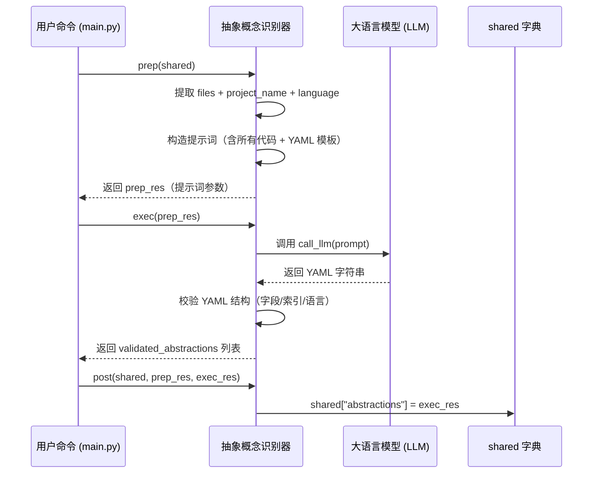

# Chapter 5: 抽象概念识别器

欢迎来到本教程的第五章！🎉  
在前面几章中，我们已经完成了“听懂用户需求”“调度整个流程”“拉取本地/远程代码”等准备工作。  
现在——终于到了最激动人心的一步：  
> 🧠 **从杂乱的代码中“提炼出人类能理解的核心概念”！**

这就是本章的主角：**抽象概念识别器** 🎯

---

## 为什么需要“抽象概念识别器”？

想象你要向朋友介绍一个开源项目，比如 `pocketflow-tutorial-codebase`。  
但你拿到的只有一堆 `.py` 文件——全是函数、类、变量名，根本看不出整体结构 😵：

```
src/
├── main.py          # 有 run(), parse_args()...
├── handler.py       # 有 login(), validate_user()...
├── scheduler.py     # 有 schedule_task(), retry_failed()...
├── validator.py     # 有 check_email(), check_password()...
└── ...
```

你该从哪里讲起？  
- 先讲 `main.py` 的启动流程？  
- 还是先讲 `handler.py` 的登录逻辑？  
- 或者从 `scheduler.py` 的任务调度说起？

新手会一脸茫然 ❓

而**抽象概念识别器**，就像一位**经验丰富的架构师 + 一位耐心的翻译官**，它通读全部源码后，提炼出 5–10 个最核心的**业务概念**，并用通俗语言解释：

| 抽象概念 | 通俗比喻 | 关联文件 |
|----------|----------|----------|
| **用户登录校验器** | 它就像机场安检口，先验身份证（用户名），再查健康码（密码哈希），最后放行（返回 token） | `handler.py`, `validator.py` |
| **任务调度中心** | 它就像快递分拣中心，自动把请求分发给对应部门（异步任务→`scheduler.py`，实时任务→主线程） | `scheduler.py` |
| **输入验证管道** | 它像流水线质检员，对每个输入字段做格式检查（邮箱？密码强度？） | `validator.py` |

> 💡 **一句话使命**：  
> **抽象概念识别器 = 代码语义的“解码器” + 新手引导的“地图”**  
> 它把机器视角（函数/类）翻译成人话视角（业务概念），并标注哪些代码支撑该概念——相当于为新手绘制了一份**概念地图的坐标索引**。

---

## 核心思想：LLM + 结构化提示 = 精准提炼

这个模块的“大脑”是**大语言模型（LLM）**，但它不是直接问：“这个项目里有什么概念？”  
而是——**用精心设计的提示词（prompt）引导 LLM 做三件事**：

1️⃣ **读透代码**：把所有 `.py` 文件内容打包成上下文  
2️⃣ **提炼概念**：按要求输出 YAML 格式的结果（见下方模板）  
3️⃣ **标注位置**：用**文件索引号**（如 `0 # src/main.py`）精确指向支撑代码  

我们来看一个真实场景 🌰：

假设你运行了这条命令（还记得吧？）：

```bash
python main.py --repo https://github.com/PocketFlow-Dev/pocketflow-tutorial-codebase --language chinese
```

**抽象概念识别器**立刻行动：

| 步骤 | 它做了什么？ | 类比 |
|------|-------------|------|
| 📚 通读代码 | 把所有 `.py` 文件内容拼成一个超长上下文 | 👨‍🎓 阅读整套百科全书 |
| 🧠 提炼概念 | 调用 LLM 分析代码结构，识别核心业务概念 | 🧠 从书中提炼“主题思想” |
| 📍 标注位置 | 为每个概念列出支撑它的文件索引（如 `1 # src/handler.py`） | 🗺️ 在概念旁标注“参考书第 X 页” |
| 📤 上交 | 返回给主流程控制器：`[{"name": "...", "description": "...", "files": [...]}, ...]` | 📬 把提炼出的概念清单交给下一环节 |

> ✅ **最终交付物**：一个**结构化列表**，每个元素是：  
> `{"name": "用户登录校验器", "description": "通俗比喻...", "files": [1, 3]}`  
> （其中 `files` 是**整数索引列表**，指向 `shared["files"]` 中的具体文件）

---

## 举个栗子 🌰：系统如何从代码中“挖出”概念？

我们用一个极简示例演示它的核心逻辑（完整实现在 [`nodes.py`](nodes.py) 的 `IdentifyAbstractions` 类）：

### ✅ 示例：输入代码 → 输出概念列表

假设 `shared["files"]` 包含 5 个文件（已按顺序编号）：

```python
files = [
  ("src/main.py", "def run(): ..."),
  ("src/handler.py", "def login(user, pwd): ..."),
  ("src/scheduler.py", "def schedule(task): ..."),
  ("src/validator.py", "def check_email(email): ..."),
  ("README.md", "# PocketFlow Tutorial")
]
```

抽象概念识别器会调用 LLM（通过 [`call_llm()`](utils/call_llm.py)），传入以下**结构化提示词**（已翻译为中文）：

```yaml
# LLM 提示词（简化版，重点看结构）
For the project `pocketflow-tutorial-codebase`:

Codebase Context:
--- File Index 0: src/main.py ---
def run():
    ...

--- File Index 1: src/handler.py ---
def login(user, pwd):
    # 验证用户名密码
    ...

--- File Index 2: src/scheduler.py ---
def schedule(task):
    # 分配任务到线程池
    ...

...（其他文件略）...

Analyze the codebase context.
Identify the top 5 core most important abstractions to help those new to the codebase.

For each abstraction, provide:
1. A concise `name`（中文）.
2. A beginner-friendly `description` explaining what it is with a simple analogy, in around 100 words（中文）.
3. A list of relevant `file_indices` (integers).

Format the output as a YAML list of dictionaries:

```yaml
- name: |
    用户登录校验器
  description: |
    它就像机场安检口，先验身份证（用户名），再查健康码（密码哈希），最后放行（返回 token）。
  file_indices:
    - 1 # src/handler.py
- name: |
    任务调度中心
  description: |
    它就像快递分拣中心，自动把请求分发给对应部门（异步任务→scheduler.py，实时任务→主线程）。
  file_indices:
    - 2 # src/scheduler.py
```
```

LLM 返回结果后，它会做**严格校验**：

| 校验项 | 说明 |
|--------|------|
| ✅ 结构合法性 | 确保返回的是 YAML 列表，每个元素有 `name`、`description`、`file_indices` 三个字段 |
| ✅ 索引有效性 | 检查 `file_indices` 中的数字是否在 `[0, len(files)-1]` 范围内（避免越界） |
| ✅ 类型正确性 | `name` 必须是字符串，`description` 必须是字符串，`file_indices` 必须是整数列表 |
| ✅ 语言合规性 | 如果用户指定 `--language chinese`，则 `name`/`description` 必须是中文（否则抛出异常） |

> 💡 **关键设计原则**：  
> - **不信任 LLM 输出**：所有结果必须经过严格校验  
> - **保留原始索引**：用 `0 # src/main.py` 而非文件路径字符串，避免路径变化导致失效  
> - **支持多语言**：自动根据 `--language` 参数切换提示词语言（中文/英文等）

---

## 核心功能：它能做什么？

抽象概念识别器（即 [`IdentifyAbstractions`](nodes.py) 类）就像一位**严谨的翻译官 + 精准的索引员**：

| 功能 | 说明 | 为什么重要？ |
|------|------|-------------|
| 🧠 语义提炼 | 从代码中识别出“用户登录校验器”“任务调度中心”等业务级概念 | 🧠 让新手理解“代码背后的故事” |
| 🌍 多语言支持 | 根据 `--language` 参数，自动用中文/英文等生成概念名称与描述 | 🌍 全球化项目必备 |
| 📏 智能限流 | 通过 `--max-abstractions` 参数控制最多提取 5–10 个核心概念 | 📏 避免概念过多导致新手 overwhelmed |
| 📂 精准定位 | 为每个概念标注支撑它的文件索引列表（如 `[1, 3]`） | 🗺️ 新手可一键跳转到相关代码 |
| 🛡️ 安全校验 | 严格校验 LLM 输出格式，确保后续流程不报错 | 🛡️ 系统稳定性的第一道防线 |

> 💡 **关键理念**：  
> 它**不修改代码**——只负责**从代码中“发现”并“翻译”出人类可理解的概念结构**。  
> 后续的 [关系图谱构建器](07_关系图谱构建器_.md)、[教程章节编排师](08_教程章节编排师_.md) 都依赖它提供的**清晰、结构化的概念列表**。

---

## 怎么用它？——3 分钟上手

虽然你**不需要直接调用**抽象概念识别器（它已集成在 [`create_tutorial_flow()`](flow.py) 的主流程中），但我们可以用一个极简示例演示它的核心逻辑：

### ✅ 示例：模拟抽象概念识别流程（无需真实 LLM）

```python
from nodes import IdentifyAbstractions

# 假设 shared["files"] 已由上一环节填充
shared = {
    "files": [
        ("src/main.py", "def run(): ..."),
        ("src/handler.py", "def login(user): ..."),
        ("src/scheduler.py", "def schedule(task): ..."),
    ],
    "project_name": "pocketflow-demo",
    "language": "chinese",
    "use_cache": True,
    "max_abstraction_num": 3
}

# 创建节点实例（自动绑定到主流程）
node = IdentifyAbstractions()

# 模拟 prep → exec → post 三阶段（实际由 Pocket Flow 自动调用）
prep_res = node.prep(shared)  # 准备上下文
exec_res = node.exec(prep_res)  # 调用 LLM 提炼概念
node.post(shared, prep_res, exec_res)  # 保存结果

# 最终结果在 shared["abstractions"]
print(shared["abstractions"])
```

#### 输出结果（简化版）：

```python
[
  {
    "name": "用户登录校验器",
    "description": "它就像机场安检口，先验身份证（用户名），再查健康码（密码哈希），最后放行（返回 token）。",
    "files": [1]  # 指向 "src/handler.py"
  },
  {
    "name": "任务调度中心",
    "description": "它就像快递分拣中心，自动把请求分发给对应部门（异步任务→scheduler.py，实时任务→主线程）。",
    "files": [2]  # 指向 "src/scheduler.py"
  }
]
```

> 📝 **重点看 `files` 字段**：  
> - 它是**整数索引列表**，直接对应 `shared["files"][index]`  
> - 例如 `files: [1]` 表示该概念由 `src/handler.py` 支撑  
> - 后续章节会用这些索引生成**带代码链接的教程**！

---

## 内部工作流：它怎么运作的？

我们用一个极简流程图，看它如何“准备上下文 → 调用 LLM → 校验结果”：



### 📌 关键细节（新手必读）

| 问题 | 解决方案 |
|------|---------|
| **LLM 输出格式错误怎么办？** | 用 `yaml.safe_load()` 解析失败时抛出异常（如 `ValueError("LLM Output is not a list")`） |
| **索引越界怎么办？** | 检查 `0 <= idx < file_count`，否则抛出异常（如 `Invalid file index 99 found`） |
| **语言不匹配怎么办？** | 如果用户指定中文，但 LLM 返回英文 `name`，抛出异常（校验逻辑中强制检查） |
| **如何加速重复任务？** | `use_cache=True` 时，首次调用结果会缓存到 `~/.pocketflow/cache/`，后续直接复用 |

---

## 代码拆解：只看最关键的几行！

我们聚焦 [`IdentifyAbstractions`](nodes.py) 中的**核心逻辑**（简化版）：

### ✅ 步骤 1：准备上下文（10 行）

```python
def prep(self, shared):
    files_data = shared["files"]  # [(path, content), ...]
    project_name = shared["project_name"]
    language = shared.get("language", "english")
    max_abstraction_num = shared.get("max_abstraction_num", 10)

    # 构造提示词中的代码上下文
    context = ""
    file_info = []  # [(index, path), ...]
    for i, (path, content) in enumerate(files_data):
        context += f"--- File Index {i}: {path} ---\n{content}\n\n"
        file_info.append((i, path))

    # 构造文件索引列表（供 LLM 引用）
    file_listing = "\n".join([f"- {idx} # {path}" for idx, path in file_info])
    
    return context, file_listing, len(files_data), project_name, language, max_abstraction_num
```

> 💡 **关键点**：  
> - `context` 是**所有代码的拼接**（LLM 的“阅读材料”）  
> - `file_listing` 是**文件索引列表**（告诉 LLM：“这些是可用的文件，请用索引引用”）

---

### ✅ 步骤 2：构建提示词（核心！20 行）

```python
def exec(self, prep_res):
    context, file_listing, file_count, project_name, language, max_num = prep_res

    # 根据语言定制提示词（中文/英文等）
    lang_instruction = ""
    if language.lower() != "english":
        lang_instruction = f"IMPORTANT: Generate the `name` and `description` in **{language.capitalize()}**.\n\n"

    prompt = f"""
For the project `{project_name}`:

Codebase Context:
{context}

{lang_instruction}Identify the top 5-{max_num} core abstractions.

For each abstraction, provide:
1. A concise `name` (in {language.capitalize()}).
2. A beginner-friendly `description` with a simple analogy (in {language.capitalize()}).
3. A list of relevant `file_indices` (integers).

List of file indices:
{file_listing}

Format as YAML:
```yaml
- name: |
    User Login Validator
  description: |
    It's like an airport security checkpoint...
  file_indices:
    - 1 # src/handler.py
```
"""
    response = call_llm(prompt, use_cache=(use_cache and self.cur_retry == 0))
    # ... 后续校验逻辑（见下方）
```

> 🌟 **核心技巧**：  
> - 用 `lang_instruction` 动态插入语言指令（如 `IMPORTANT: Generate in **Chinese**.`）  
> - YAML 模板明确要求 `name`/`description`/`file_indices`，确保结构化输出  
> - `file_listing` 用 `idx # path` 格式，让 LLM 明白“索引怎么写”

---

### ✅ 步骤 3：校验 LLM 输出（核心！30 行）

```python
# 解析 YAML 字符串
yaml_str = response.strip().split("```yaml")[1].split("```")[0].strip()
abstractions = yaml.safe_load(yaml_str)

# 校验结构
if not isinstance(abstractions, list):
    raise ValueError("LLM Output is not a list")

validated = []
for item in abstractions:
    # 检查必要字段
    if not all(k in item for k in ["name", "description", "file_indices"]):
        raise ValueError(f"Missing keys in: {item}")

    # 校验 file_indices 类型 & 范围
    validated_indices = []
    for idx_entry in item["file_indices"]:
        try:
            # 支持两种格式：整数 `1` 或字符串 `"1 # src/handler.py"`
            if isinstance(idx_entry, int):
                idx = idx_entry
            elif isinstance(idx_entry, str) and "#" in idx_entry:
                idx = int(idx_entry.split("#")[0].strip())
            else:
                idx = int(str(idx_entry).strip())

            if not (0 <= idx < file_count):
                raise ValueError(f"Invalid index {idx} (max={file_count-1})")
            validated_indices.append(idx)
        except (ValueError, TypeError):
            raise ValueError(f"Could not parse index: {idx_entry}")

    # 保存校验后的结果
    validated.append({
        "name": item["name"],  # 可能是中文
        "description": item["description"],  # 可能是中文
        "files": sorted(list(set(validated_indices)))
    })

return validated
```

> 💡 **关键点**：  
> - 同时支持整数 `1` 和字符串 `"1 # src/handler.py"` 格式（兼容不同 LLM 行为）  
> - 用 `sorted(set(...))` 去重并排序，确保 `files` 字段干净整洁  
> - 所有错误都会抛出 `ValueError`，触发主流程的重试机制

---

### ✅ 步骤 4：保存结果（2 行）

```python
def post(self, shared, prep_res, exec_res):
    shared["abstractions"] = exec_res  # List of {"name": str, "description": str, "files": [int]}
```

> ✅ **这就是后续模块的“输入”**！  
> 比如 [关系图谱构建器](07_关系图谱构建器_.md) 会读取 `shared["abstractions"]` 来分析概念间的依赖关系。

---

## 它如何与系统其他部分协作？

抽象概念识别器是**整个流程的“知识提炼机”**，它输出的数据直接喂给后续节点：


> 🌟 **关键设计原则**：  
> - **统一数据接口**：`abstractions` 始终是 `[{name, description, files}]` 结构  
> - **零侵入**：后续模块**完全不知道**概念来自哪个 LLM 调用  
> - **可扩展**：未来可替换为更小的本地模型？只需实现同样接口即可！

---

## 小结：你学到了什么？

✅ **抽象概念识别器 = 代码语义的“解码器” + 新手引导的“地图”**  
✅ 它负责把机器视角（函数/类），翻译成人话视角（业务概念）  
✅ 支持多语言（中文/英文等），自动标注支撑代码的文件索引  
✅ 返回 `[{name, description, files}]`，供后续章节编排、关系分析直接使用  

> 🚀 下一步：  
> 当核心概念被清晰提炼后——  
> **谁来分析这些概念之间的依赖关系**？  
> 请看 [第 6 章：LLM 调用中枢](06_llm_调用中枢_.md) —— 它负责**高效、可靠地调用 LLM API**，是整个系统的“智能引擎”！  
> （提示：它会复用抽象概念识别器的缓存结果，避免重复调用）

现在，不妨打开 [`nodes.py`](nodes.py) 文件，找到 `IdentifyAbstractions` 类——  
试着运行它的 `prep()` 和 `exec()` 方法，你会看到它像一位专注的架构师，默默从代码中“挖出”业务概念——  
**没有它，后续所有“知识编排”都无从谈起！** 🧠✨

---

Generated by [AI Codebase Knowledge Builder](https://github.com/The-Pocket/Tutorial-Codebase-Knowledge)