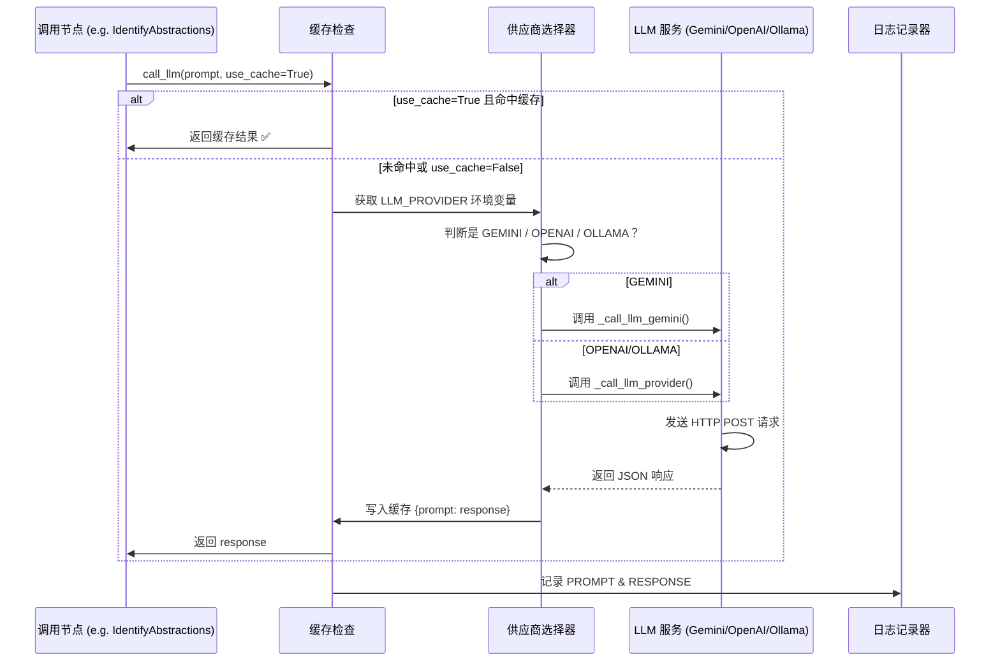

# Chapter 6: LLM 调用中枢


欢迎来到本教程的第六章！🎉  
在上一章中，我们学会了如何从代码中**提炼出核心业务概念**（比如“用户登录校验器”“任务调度中心”），并标注它们对应的代码位置。  
现在——我们终于要接触整个系统的“**智能引擎**”了：  
> 💡 **LLM 调用中枢 = 系统与 AI 大脑的“通信接口”**  
> 它像一位可靠的翻译官，负责将复杂提示工程（prompt）安全、高效地发送给 Gemini 或兼容 OpenAI 的模型，并内置缓存、日志、多供应商支持，确保整个流程既智能又可控。

---

## 为什么需要“LLM 调用中枢”？

想象你要向一位**外国专家**请教一个专业问题：

- ❌ 如果直接用机器翻译软件发消息：可能词不达意、术语错误  
- ❌ 如果每次都手动打开网页、粘贴问题、复制答案：效率极低  
- ❌ 如果问题重复了：还得重新问一遍（浪费 token！）  

而你的系统里，**抽象概念识别器**、**关系图谱构建器**、**章节生成器**……都在反复调用 LLM。  
如果没有一个统一的“中枢”，就会出现：

| 问题 | 后果 |
|------|------|
| 每个节点自己拼 prompt + 发请求 | 代码重复、风格混乱、调试困难 |
| 没有缓存机制 | 重复请求相同 prompt → **浪费钱！**（LLM API 按次收费） |
| 错误处理分散 | 某次请求失败，不知道是网络问题还是 API 限流 |
| 切换模型麻烦 | 想从 Gemini 换到 Ollama？每个节点都要改代码 |

> 💡 **一句话使命**：  
> **LLM 调用中枢 = 统一调用入口 + 智能缓存 + 多供应商支持 + 全流程日志**  
> 它让所有模块“只管提需求，不管怎么问”，专注业务逻辑，而非通信细节。

---

## 举个栗子 🌰：系统如何调用 LLM？

假设你在运行这段代码（来自 [`nodes.py`](nodes.py) 的 `IdentifyAbstractions.exec()`）：

```python
response = call_llm(prompt, use_cache=(use_cache and self.cur_retry == 0))
```

**LLM 调用中枢**立刻行动：

| 步骤 | 它做了什么？ | 类比 |
|------|-------------|------|
| 📝 检查缓存 | 先查 `llm_cache.json`：这个 prompt 之前问过吗？ | 🗂️ 图书馆员翻查借阅记录 |
| ✅ 命中缓存 | 直接返回缓存结果，跳过网络请求！ | 🎉 “这本书上次借走了，不用再订！” |
| 🌐 未命中缓存 | 1️⃣ 读取 `LLM_PROVIDER` 环境变量（如 `GEMINI`）<br>2️⃣ 加载对应 API Key 和 Base URL<br>3️⃣ 构造请求体（model + messages + temperature） | 📡 卫星信号同步：不同国家用不同频率 |
| 📤 发送请求 | 通过 HTTP POST 发送 JSON 请求到 LLM 服务 | 📩 寄出一封加密信件 |
| 📥 解析响应 | 提取 `choices[0].message.content` 字段 | 🔑 打开信封，取出核心内容 |
| 📝 写入缓存 | 将 `prompt → response` 存入 `llm_cache.json` | 📚 把新书录入借阅系统，下次直接借 |
| 📊 记录日志 | 写入 `logs/llm_calls_*.log`：时间、prompt、response、耗时 | 📓 详细日志本：方便回溯和调试 |

> ✅ **最终交付物**：纯文本字符串（LLM 的回答），**无需任何额外解析**  
> （例如：`response = "- name: 用户登录校验器\\n  description: 它就像机场安检口...\\n"`）

---

## 核心功能：它能做什么？

LLM 调用中枢（即 [`call_llm()`](utils/call_llm.py)）就像一位**全能的信使 + 智能管家**：

| 功能 | 说明 | 为什么重要？ |
|------|------|-------------|
| 🔄 统一入口 | 所有节点都调用 `call_llm(prompt, use_cache)`，无需关心底层协议 | 🎯 降低耦合，后续可无缝切换模型 |
| 💾 智能缓存 | 相同 prompt → 直接复用结果，避免重复收费 | 💰 节省成本（尤其调试阶段） |
| 🌍 多供应商支持 | 自动识别 `GEMINI` / `OPENAI` / `OLLAMA` 等（通过环境变量） | 🌐 本地开发用 Ollama，生产用 Gemini，灵活切换 |
| 📊 全流程日志 | 记录每次请求的 prompt/response/时间，支持按日期归档 | 🔍 快速定位问题（“昨天下午 3 点的调用失败了？”） |
| ⚠️ 详细错误提示 | 区分 HTTP 错误、网络错误、超时、JSON 解析错误 | 🛡️ 调试时不再“瞎猜” |
| 🧪 测试友好 | 支持 `use_cache=False` 强制跳过缓存，方便实时调试 | 🧪 单元测试时保证结果实时性 |

> 💡 **关键理念**：  
> 它**不修改 prompt 内容**——只负责**安全、高效、可追溯地把 prompt 发给 LLM，并把结果送回来**。  
> 后续的 [关系图谱构建器](07_关系图谱构建器_.md)、[教程章节编排师](08_教程章节编排师_.md) 都依赖它提供的**稳定、可靠、低成本的 LLM 调用能力**。

---

## 怎么用它？——3 分钟上手

虽然你**不需要直接调用** LLM 调用中枢（它已集成在各节点中），但我们可以用一个**极简示例**演示它的核心逻辑：

### ✅ 示例 1：基础调用（带缓存）

```python
from utils.call_llm import call_llm

# 第一次调用（未缓存）
result1 = call_llm("请用中文解释 '抽象概念' 是什么？", use_cache=True)
print(result1)
# 输出：抽象概念是指……（首次请求，耗时较长）

# 第二次调用（命中缓存）
result2 = call_llm("请用中文解释 '抽象概念' 是什么？", use_cache=True)
print(result2)
# 输出：同上！但瞬间返回（直接从 llm_cache.json 读取）
```

> 📝 **缓存文件位置**：项目根目录下的 `llm_cache.json`  
> ✅ **安全提示**：缓存中可能包含敏感 prompt（如代码片段），生产环境建议加密或删除！

---

### ✅ 示例 2：强制跳过缓存（实时调试）

```python
# 调试时确保拿到最新结果
result = call_llm("请用中文解释 '抽象概念' 是什么？", use_cache=False)
print(result)
# 即使缓存存在，也强制重新请求
```

---

### ✅ 示例 3：查看日志（排查问题）

```bash
# 查看今天的所有 LLM 调用日志
tail -f logs/llm_calls_20250405.log
```

日志内容示例：

```
2025-04-05 14:30:22,123 - INFO - PROMPT: 请用中文解释 '抽象概念' 是什么？
2025-04-05 14:30:23,456 - INFO - RESPONSE: 抽象概念是指……
```

> 🔍 **调试技巧**：当某个节点报错时，直接查日志就能看到**完整 prompt 和 LLM 原始响应**，快速定位问题！

---

## 内部工作流：它怎么运作的？

我们用一个极简流程图，看它如何“查缓存 → 选供应商 → 发请求 → 记日志”：



### 📌 关键细节（新手必读）

| 问题 | 解决方案 |
|------|---------|
| **缓存文件太大怎么办？** | 定期删除 `llm_cache.json`；生产环境建议用 Redis 等专业缓存 |
| **LLM 服务挂了怎么办？** | `requests` 库自动抛出 `ConnectionError`，节点层有 `max_retries=5` 重试机制 |
| **怎么切换到本地 Ollama？** | 设置环境变量：<br>`LLM_PROVIDER=OPENAI`<br>`OPENAI_BASE_URL=http://localhost:11434/v1`<br>`OPENAI_API_KEY=dummy`（Ollama 不需要真实 key） |
| **日志里有敏感信息？** | 生产环境建议：<br>1. 关闭缓存（`use_cache=False`）<br>2. 日志脱敏（替换 prompt 中的文件路径） |
| **Gemini 和 OpenAI 的 API 差异怎么处理？** | `_call_llm_gemini()` 和 `_call_llm_provider()` 各自处理协议差异，对上层统一返回 `str` |

---

## 代码拆解：只看最关键的几行！

我们聚焦 [`call_llm()`](utils/call_llm.py) 中的**核心逻辑**（简化版）：

### ✅ 步骤 1：检查缓存（核心！5 行）

```python
def call_llm(prompt: str, use_cache: bool = True) -> str:
    if use_cache:
        cache = load_cache()  # 读取 llm_cache.json
        if prompt in cache:
            return cache[prompt]  # 命中缓存！直接返回
    
    # ... 未命中缓存，进入真实调用 ...
```

> 💡 **关键点**：  
> - `load_cache()` 用 `json.load()` 读取缓存文件  
> - `if prompt in cache` → 字典键匹配，O(1) 时间复杂度  
> - **只缓存完全相同的 prompt**（字符串比较），避免语义误匹配

---

### ✅ 步骤 2：自动识别供应商（5 行）

```python
def get_llm_provider() -> str:
    provider = os.getenv("LLM_PROVIDER")
    if not provider and (os.getenv("GEMINI_PROJECT_ID") or os.getenv("GEMINI_API_KEY")):
        provider = "GEMINI"
    if not provider and (os.getenv("OPENAI_API_KEY") or os.getenv("OPENAI_BASE_URL")):
        provider = "OPENAI"
    if not provider:
        raise ValueError("LLM_PROVIDER environment variable is required...")
    return provider
```

> 🌟 **核心技巧**：  
> - 优先检查 `LLM_PROVIDER`（显式指定）  
> - 兜底检查 `GEMINI_*` 或 `OPENAI_*` 环境变量（兼容旧配置）  
> - 全部没有 → 抛出明确错误，提示用户配置

---

### ✅ 步骤 3：Gemini 专用调用（8 行）

```python
def _call_llm_gemini(prompt: str) -> str:
    if os.getenv("GEMINI_PROJECT_ID"):
        client = genai.Client(
            vertexai=True,
            project=os.getenv("GEMINI_PROJECT_ID"),
            location=os.getenv("GEMINI_LOCATION", "us-central1")
        )
    elif os.getenv("GEMINI_API_KEY"):
        client = genai.Client(api_key=os.getenv("GEMINI_API_KEY"))
    else:
        raise ValueError("Either GEMINI_PROJECT_ID or GEMINI_API_KEY must be set...")
    
    model = os.getenv("GEMINI_MODEL", "gemini-2.5-pro-exp-03-25")
    response = client.models.generate_content(model=model, contents=[prompt])
    return str(response.text)
```

> 💡 **关键点**：  
> - 支持两种 Gemini 认证方式：<br> ① Vertex AI（企业级）<br> ② API Key（开发者）  
> - `client.models.generate_content()` 是 Google 官方 SDK 的标准调用方式  
> - `response.text` 直接返回纯文本（无 JSON 解析）

---

### ✅ 步骤 4：OpenAI 兼容 API 调用（10 行）

```python
def _call_llm_provider(prompt: str) -> str:
    provider = os.environ.get("LLM_PROVIDER")  # e.g. "OPENAI"
    base_url = os.environ.get(f"{provider}_BASE_URL")  # e.g. "http://localhost:11434/v1"
    api_key = os.environ.get(f"{provider}_API_KEY", "")
    
    url = f"{base_url.rstrip('/')}/v1/chat/completions"
    headers = {"Content-Type": "application/json"}
    if api_key:
        headers["Authorization"] = f"Bearer {api_key}"
    
    payload = {
        "model": os.environ.get(f"{provider}_MODEL"),
        "messages": [{"role": "user", "content": prompt}],
        "temperature": 0.7,
    }
    
    response = requests.post(url, headers=headers, json=payload)
    response.raise_for_status()
    return str(response.json()["choices"][0]["message"]["content"])
```

> 🌟 **核心技巧**：  
> - 用 `f"{provider}_BASE_URL"` 动态构造 URL（兼容 Ollama、DeepSeek、LlamaCpp 等）  
> - `response.raise_for_status()` → 自动抛出 HTTP 错误（4xx/5xx）  
> - `response.json()["choices"][0]["message"]["content"]` → 提取标准 OpenAI 响应格式

---

### ✅ 步骤 5：写入缓存 + 记录日志（5 行）

```python
# 在 call_llm() 末尾
if use_cache:
    cache = load_cache()
    cache[prompt] = response_text
    save_cache(cache)

logger.info(f"PROMPT: {prompt}\nRESPONSE: {response_text}")
return response_text
```

> 📝 **日志格式**：  
> ```
> 2025-04-05 14:30:22,123 - INFO - PROMPT: 请用中文解释 '抽象概念' 是什么？
> 2025-04-05 14:30:23,456 - INFO - RESPONSE: 抽象概念是指……
> ```

---

## 它如何与系统其他部分协作？

LLM 调用中枢是**整个系统的“智能引擎”**，它被多个节点调用，形成统一的数据流：

```mermaid
flowchart LR
    A[抽象概念识别器] -->|调用 call_llm()| E[LLM 调用中枢]
    B[关系图谱构建器] -->|调用 call_llm()| E
    C[教程章节编排师] -->|调用 call_llm()| E
    D[分步教程生成器] -->|调用 call_llm()| E
    E -->|返回 response| A
    E -->|返回 response| B
    E -->|返回 response| C
    E -->|返回 response| D
```

> 🌟 **关键设计原则**：  
> - **统一协议**：所有节点都用 `call_llm(prompt, use_cache)`，无需关心底层实现  
> - **零侵入**：后续模块**完全不知道**调用的是 Gemini 还是 Ollama  
> - **可扩展**：未来新增 `ANTHROPIC` 供应商？只需在 `call_llm()` 中加一个 `elif` 分支即可！

---

## 小结：你学到了什么？

✅ **LLM 调用中枢 = 统一入口 + 智能缓存 + 多供应商支持 + 全流程日志**  
✅ 它让所有节点“只管提需求，不管怎么问”，专注业务逻辑  
✅ 支持 Gemini / OpenAI / Ollama 等多种 LLM，环境变量一键切换  
✅ 内置缓存机制避免重复请求，显著降低成本  
✅ 详细日志记录方便调试和问题回溯  

> 🚀 下一步：  
> 当 LLM 能稳定、高效地被调用后——  
> **谁来分析这些抽象概念之间的依赖关系**？  
> 请看 [第 7 章：关系图谱构建器](07_关系图谱构建器_.md) —— 它负责**从概念中挖掘“谁依赖谁”的结构**，为后续章节编排打下基础！  
> （提示：它也会调用 `call_llm()`，但 prompt 更复杂，依赖缓存机制节省成本）

现在，不妨打开 [`utils/call_llm.py`](utils/call_llm.py) 文件，试着运行：

```python
if __name__ == "__main__":
    response = call_llm("请用中文解释 '抽象概念' 是什么？", use_cache=True)
    print(f"LLM 回答：{response}")
```

你会看到它像一位沉默的信使，默默把你的问题发给 AI 大脑，并把答案送回来——  
**没有它，后续所有“智能生成”都无从谈起！** 🧠✨

---

Generated by [AI Codebase Knowledge Builder](https://github.com/The-Pocket/Tutorial-Codebase-Knowledge)