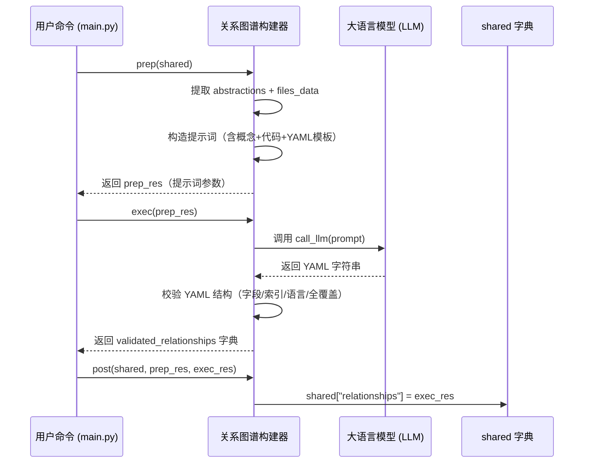

# Chapter 7: 关系图谱构建器

欢迎来到本教程的第七章！🎉  
在前面几章中，我们已经完成了“听懂用户需求”“调度整个流程”“拉取代码”“识别抽象概念”等准备工作，并且——**终于到了最关键的一环**：  
> 🧠 **谁来搞清这些抽象概念之间的“谁依赖谁”关系**？  
> 比如：“用户入口 → 查询处理器 → 数据库”，这种调用链路是怎么形成的？  

这就是本章的主角：**关系图谱构建器** 🗺️

---

## 为什么需要“关系图谱构建器”？

想象你要向朋友介绍一个开源项目，比如 `pocketflow-tutorial-codebase`。  
你已经提炼出了几个核心概念（来自上一章的抽象概念识别器）：

| 抽象概念 | 文件位置 |
|----------|----------|
| 用户入口 | `src/main.py` |
| 查询处理器 | `src/handler.py` |
| 数据库操作 | `src/db.py` |
| 权限校验 | `src/auth.py` |

但问题来了：  
- 🤔 **用户入口怎么找到查询处理器的？**  
- 🤔 **查询处理器又怎么调用数据库和权限校验的？**  
- 🤔 **整个系统是“谁指挥谁”的结构？新手从哪里开始理解最合适？**

如果你只列出概念，新手会像走进迷宫一样晕头转向 ❓

而**关系图谱构建器**，就像一位**经验丰富的架构师 + 一位耐心的交通规划师**，它通读所有概念和相关代码后，构建出一张清晰的**概念依赖关系网**，并生成两样关键产出：

1. ✅ **项目总览摘要**（用加粗/斜体突出重点，如：*“本系统采用分层架构：入口层 → 业务层 → 数据层”*）  
2. ✅ **结构化三元组列表**（源→目标→动作标签，如：`[用户入口 → 查询处理器: 调用]`）

> 💡 **一句话使命**：  
> **关系图谱构建器 = 概念依赖的“解码器” + 新手导航的“交通图”**  
> 它把零散的概念梳理成一张可读性强的网状结构，相当于为代码画了一张“概念流程图”，让新手一眼看懂整体脉络！

---

## 核心思想：LLM + 结构化提示 = 精准建图

这个模块的“大脑”同样是**大语言模型（LLM）**，但它不是简单问：“这些概念有什么关系？”  
而是——**用精心设计的提示词（prompt）引导 LLM 做三件事**：

1️⃣ **读透概念 + 关联代码**：把所有抽象概念 + 相关代码片段打包成上下文  
2️⃣ **挖掘关系**：按要求输出 YAML 格式的结果（见下方模板）  
3️⃣ **标注交互**：用**抽象索引号**（如 `0 # 用户入口`）精确指向源/目标概念  

我们来看一个真实场景 🌰：

假设你运行了这条命令（还记得吧？）：

```bash
python main.py --repo https://github.com/PocketFlow-Dev/pocketflow-tutorial-codebase --language chinese
```

**关系图谱构建器**立刻行动：

| 步骤 | 它做了什么？ | 类比 |
|------|-------------|------|
| 📚 通读概念 | 把抽象概念列表 + 相关代码片段拼成上下文 | 👨‍🎓 阅读“概念说明书 + 代码说明书” |
| 🧠 挖掘关系 | 调用 LLM 分析交互逻辑，识别关键依赖链 | 🧠 从说明书中提炼“调用关系图” |
| 📍 标注三元组 | 为每条关系标注：`[源索引 → 目标索引: 动作标签]` | 🗺️ 在流程图上标箭头 + 文字说明 |
| 📤 上交 | 返回给主流程控制器：`{"summary": "...", "details": [...]}` | 📬 把关系图谱交给下一环节 |

> ✅ **最终交付物**：一个**结构化字典**，包含：  
> - `"summary"`：项目总览摘要（字符串）  
> - `"details"`：三元组列表（列表），每项为 `{"from": int, "to": int, "label": str}`  
> （例如：`{"from": 0, "to": 1, "label": "调用"}`）

---

## 举个栗子 🌰：系统如何从概念中“挖出”关系？

我们用一个极简示例演示它的核心逻辑（完整实现在 [`nodes.py`](nodes.py) 的 `AnalyzeRelationships` 类）：

### ✅ 示例：输入概念 → 输出关系图谱

假设 `shared["abstractions"]` 包含 3 个概念（已按顺序编号）：

```python
abstractions = [
  {
    "name": "用户入口",
    "description": "它是系统的入口点，接收用户命令并启动流程。",
    "files": [0]  # 指向 "src/main.py"
  },
  {
    "name": "查询处理器",
    "description": "它负责解析用户输入，调用数据库和权限校验。",
    "files": [1, 3]  # 指向 "src/handler.py" 和 "src/auth.py"
  },
  {
    "name": "数据库操作",
    "description": "它负责执行 SQL 查询，返回原始数据。",
    "files": [2]  # 指向 "src/db.py"
  }
]
```

关系图谱构建器会调用 LLM（通过 [`call_llm()`](utils/call_llm.py)），传入以下**结构化提示词**（已翻译为中文）：

```yaml
# LLM 提示词（简化版，重点看结构）
Based on the following abstractions and relevant code snippets from the project `pocketflow-tutorial-codebase`:

List of Abstraction Indices and Names:
- 0 # 用户入口
- 1 # 查询处理器
- 2 # 数据库操作

Context (Abstractions, Descriptions, Code):
Identified Abstractions:
- Index 0: 用户入口 (Relevant file indices: [0])
  Description: 它是系统的入口点，接收用户命令并启动流程。
- Index 1: 查询处理器 (Relevant file indices: [1, 3])
  Description: 它负责解析用户输入，调用数据库和权限校验。
- Index 2: 数据库操作 (Relevant file indices: [2])
  Description: 它负责执行 SQL 查询，返回原始数据。

Relevant File Snippets (Referenced by Index and Path):
--- File: 0 # src/main.py ---
def run():
    # 解析命令行参数
    args = parse_args()
    # 启动主流程
    main_flow(args)

--- File: 1 # src/handler.py ---
def handle_query(user_input):
    # 权限校验
    if not validate(user_input):
        raise PermissionError()
    # 查询数据库
    return query_db(user_input)

--- File: 3 # src/auth.py ---
def validate(user_input):
    # 检查 token 或密码
    ...

--- File: 2 # src/db.py ---
def query_db(sql):
    # 执行 SQL
    ...

Please provide:
1. A high-level `summary` of the project's main purpose and functionality in a few beginner-friendly sentences. Use markdown formatting with **bold** and *italic* text to highlight important concepts.
2. A list (`relationships`) describing the key interactions between these abstractions. For each relationship, specify:
    - `from_abstraction`: Index of the source abstraction (e.g., `0 # 用户入口`)
    - `to_abstraction`: Index of the target abstraction (e.g., `1 # 查询处理器`)
    - `label`: A brief label for the interaction **in just a few words** (e.g., "Manages", "Inherits", "Uses").
    Ideally the relationship should be backed by one abstraction calling or passing parameters to another.
    Simplify the relationship and exclude those non-important ones.

IMPORTANT: Make sure EVERY abstraction is involved in at least ONE relationship (either as source or target). Each abstraction index must appear at least once across all relationships.

Format the output as YAML:

```yaml
summary: |
  本系统采用分层架构：*入口层* → *业务层* → *数据层*。**用户入口**是系统的唯一入口点，它启动**查询处理器**；**查询处理器**负责业务逻辑，它会调用**数据库操作**获取数据，并通过**权限校验**确保安全。
relationships:
  - from_abstraction: 0 # 用户入口
    to_abstraction: 1 # 查询处理器
    label: "启动"
  - from_abstraction: 1 # 查询处理器
    to_abstraction: 2 # 数据库操作
    label: "调用"
```

Now, provide the YAML output:
```

LLM 返回结果后，它会做**严格校验**：

| 校验项 | 说明 |
|--------|------|
| ✅ 结构合法性 | 确保返回的是 YAML 字典，包含 `summary` 和 `relationships` 两个字段 |
| ✅ 索引有效性 | 检查 `from`/`to` 索引是否在 `[0, len(abstractions)-1]` 范围内（避免越界） |
| ✅ 类型正确性 | `summary` 必须是字符串，`relationships` 必须是列表，`label` 必须是字符串 |
| ✅ 语言合规性 | 如果用户指定 `--language chinese`，则 `summary`/`label` 必须是中文（否则抛出异常） |
| ✅ 全覆盖检查 | 确保每个抽象概念至少出现在一条关系中（作为源或目标） |

> 💡 **关键设计原则**：  
> - **不信任 LLM 输出**：所有结果必须经过严格校验  
> - **保留原始索引**：用 `0 # 用户入口` 而非概念名称字符串，避免名称变化导致失效  
> - **支持多语言**：自动根据 `--language` 参数切换提示词语言（中文/英文等）

---

## 核心功能：它能做什么？

关系图谱构建器（即 [`AnalyzeRelationships`](nodes.py) 类）就像一位**严谨的交通规划师 + 精准的索引员**：

| 功能 | 说明 | 为什么重要？ |
|------|------|-------------|
| 🧠 依赖挖掘 | 从概念中识别出“谁调用谁”“谁依赖谁”的关键交互链 | 🧠 让新手理解“概念之间的逻辑关系” |
| 🌍 多语言支持 | 根据 `--language` 参数，自动用中文/英文等生成摘要与动作标签 | 🌍 全球化项目必备 |
| 📏 全覆盖检查 | 强制每个抽象概念至少参与一条关系（避免孤立节点） | 📏 防止概念“掉线”，确保图谱完整 |
| 🗺️ 结构化输出 | 输出 `{"summary": str, "details": [{from, to, label}]}` 标准格式 | 🗺️ 为后续章节编排提供清晰输入 |
| 🛡️ 安全校验 | 严格校验 LLM 输出格式，确保后续流程不报错 | 🛡️ 系统稳定性的第一道防线 |

> 💡 **关键理念**：  
> 它**不修改代码**——只负责**从概念中“发现”并“翻译”出人类可理解的依赖关系结构**。  
> 后续的 [教程章节编排师](08_教程章节编排师_.md)、[分步教程生成器](09_分步教程生成器_批处理__.md) 都依赖它提供的**清晰、结构化的依赖关系图谱**。

---

## 怎么用它？——3 分钟上手

虽然你**不需要直接调用**关系图谱构建器（它已集成在 [`create_tutorial_flow()`](flow.py) 的主流程中），但我们可以用一个极简示例演示它的核心逻辑：

### ✅ 示例：模拟关系图谱构建流程（无需真实 LLM）

```python
from nodes import AnalyzeRelationships

# 假设 shared["abstractions"] 已由上一环节填充
shared = {
    "abstractions": [
        {"name": "用户入口", "description": "系统入口点...", "files": [0]},
        {"name": "查询处理器", "description": "业务处理中心...", "files": [1, 3]},
        {"name": "数据库操作", "description": "数据访问层...", "files": [2]},
    ],
    "files": [
        ("src/main.py", "def run(): ..."),
        ("src/handler.py", "def handle_query(): ..."),
        ("src/db.py", "def query_db(): ..."),
        ("src/auth.py", "def validate(): ..."),
    ],
    "project_name": "pocketflow-demo",
    "language": "chinese",
    "use_cache": True,
}

# 创建节点实例（自动绑定到主流程）
node = AnalyzeRelationships()

# 模拟 prep → exec → post 三阶段（实际由 Pocket Flow 自动调用）
prep_res = node.prep(shared)  # 准备上下文
exec_res = node.exec(prep_res)  # 调用 LLM 挖掘关系
node.post(shared, prep_res, exec_res)  # 保存结果

# 最终结果在 shared["relationships"]
print(shared["relationships"])
```

#### 输出结果（简化版）：

```python
{
  "summary": "本系统采用分层架构：*入口层* → *业务层* → *数据层*。**用户入口**是系统的唯一入口点，它启动**查询处理器**；**查询处理器**负责业务逻辑，它会调用**数据库操作**获取数据。",
  "details": [
    {"from": 0, "to": 1, "label": "启动"},
    {"from": 1, "to": 2, "label": "调用"},
    {"from": 1, "to": 3, "label": "校验"}  # 注意：索引 3 对应 auth.py
  ]
}
```

> 📝 **重点看 `details` 字段**：  
> - `from: 0` 表示“用户入口”（索引 0）  
> - `to: 1` 表示“查询处理器”（索引 1）  
> - `label: "启动"` 表示交互动作是“启动”  
> - 后续章节会用这些三元组生成**带依赖说明的流程图**！

---

## 内部工作流：它怎么运作的？

我们用一个极简流程图，看它如何“准备上下文 → 调用 LLM → 校验结果”：



### 📌 关键细节（新手必读）

| 问题 | 解决方案 |
|------|---------|
| **LLM 输出格式错误怎么办？** | 用 `yaml.safe_load()` 解析失败时抛出异常（如 `ValueError("LLM Output is not a dict")`） |
| **索引越界怎么办？** | 检查 `0 <= from_idx < num_abstractions` 且 `0 <= to_idx < num_abstractions`，否则抛出异常 |
| **某个概念没参与关系怎么办？** | 在校验中遍历所有索引，若发现未覆盖则抛出 `ValueError("Abstraction X has no relationships")` |
| **语言不匹配怎么办？** | 如果用户指定中文，但 LLM 返回英文 `summary`，抛出异常（校验逻辑中强制检查） |
| **如何加速重复任务？** | `use_cache=True` 时，首次调用结果会缓存到 `~/.pocketflow/cache/`，后续直接复用 |

---

## 代码拆解：只看最关键的几行！

我们聚焦 [`AnalyzeRelationships`](nodes.py) 中的**核心逻辑**（简化版）：

### ✅ 步骤 1：准备上下文（15 行）

```python
def prep(self, shared):
    abstractions = shared["abstractions"]  # List of {"name", "description", "files"}
    files_data = shared["files"]  # List of (path, content)
    project_name = shared["project_name"]
    language = shared.get("language", "english")
    use_cache = shared.get("use_cache", True)

    # 构造提示词中的概念上下文
    context = "Identified Abstractions:\n"
    all_relevant_indices = set()
    abstraction_info_for_prompt = []
    for i, abstr in enumerate(abstractions):
        # 用 'files' 字段（索引列表）直接获取文件索引
        file_indices_str = ", ".join(map(str, abstr["files"]))
        info_line = f"- Index {i}: {abstr['name']} (Relevant file indices: [{file_indices_str}])\n  Description: {abstr['description']}"
        context += info_line + "\n"
        abstraction_info_for_prompt.append(f"{i} # {abstr['name']}")
        all_relevant_indices.update(abstr["files"])

    # 添加相关代码片段（只包含被引用的文件）
    context += "\nRelevant File Snippets (Referenced by Index and Path):\n"
    relevant_files_content_map = get_content_for_indices(
        files_data, sorted(list(all_relevant_indices))
    )
    file_context_str = "\n\n".join(
        f"--- File: {idx_path} ---\n{content}"
        for idx_path, content in relevant_files_content_map.items()
    )
    context += file_context_str

    return (
        context,
        "\n".join(abstraction_info_for_prompt),
        len(abstractions),
        project_name,
        language,
        use_cache,
    )
```

> 💡 **关键点**：  
> - `all_relevant_indices` 收集所有被抽象概念引用的文件索引（避免加载无关代码）  
> - `get_content_for_indices()` 是一个辅助函数，根据索引列表返回 `{idx_path: content}` 字典  
> - `abstraction_info_for_prompt` 用于生成 LLM 的索引列表（如 `0 # 用户入口`）

---

### ✅ 步骤 2：构建提示词（核心！25 行）

```python
def exec(self, prep_res):
    (
        context,
        abstraction_listing,
        num_abstractions,
        project_name,
        language,
        use_cache,
    ) = prep_res

    # 根据语言定制提示词（中文/英文等）
    language_instruction = ""
    lang_hint = ""
    list_lang_note = ""
    if language.lower() != "english":
        language_instruction = f"IMPORTANT: Generate the `summary` and relationship `label` fields in **{language.capitalize()}** language. Do NOT use English for these fields.\n\n"
        lang_hint = f" (in {language.capitalize()})"
        list_lang_note = f" (Names might be in {language.capitalize()})"

    prompt = f"""
Based on the following abstractions and relevant code snippets from the project `{project_name}`:

List of Abstraction Indices and Names{list_lang_note}:
{abstraction_listing}

Context (Abstractions, Descriptions, Code):
{context}

{language_instruction}Please provide:
1. A high-level `summary` of the project's main purpose and functionality in a few beginner-friendly sentences{lang_hint}. Use markdown formatting with **bold** and *italic* text to highlight important concepts.
2. A list (`relationships`) describing the key interactions between these abstractions. For each relationship, specify:
    - `from_abstraction`: Index of the source abstraction (e.g., `0 # AbstractionName1`)
    - `to_abstraction`: Index of the target abstraction (e.g., `1 # AbstractionName2`)
    - `label`: A brief label for the interaction **in just a few words**{lang_hint} (e.g., "Manages", "Inherits", "Uses").
    Ideally the relationship should be backed by one abstraction calling or passing parameters to another.
    Simplify the relationship and exclude those non-important ones.

IMPORTANT: Make sure EVERY abstraction is involved in at least ONE relationship (either as source or target). Each abstraction index must appear at least once across all relationships.

Format the output as YAML:
```yaml
summary: |
  A brief, simple explanation of the project{lang_hint}.
  Can span multiple lines with **bold** and *italic* for emphasis.
relationships:
  - from_abstraction: 0 # AbstractionName1
    to_abstraction: 1 # AbstractionName2
    label: "Manages"{lang_hint}
```

Now, provide the YAML output:
"""
    response = call_llm(prompt, use_cache=(use_cache and self.cur_retry == 0))
    # ... 后续校验逻辑（见下方）
```

> 🌟 **核心技巧**：  
> - 用 `lang_hint` 动态插入语言指令（如 `IMPORTANT: Generate in **Chinese**.`）  
> - YAML 模板明确要求 `summary`/`relationships`/`label`，确保结构化输出  
> - `list_lang_note` 提醒 LLM：“输入列表中的名称可能是中文”  
> - **关键约束**：`IMPORTANT: Make sure EVERY abstraction is involved...` 强制全覆盖

---

### ✅ 步骤 3：校验 LLM 输出（核心！40 行）

```python
# 解析 YAML 字符串
yaml_str = response.strip().split("```yaml")[1].split("```")[0].strip()
relationships_data = yaml.safe_load(yaml_str)

# 校验结构
if not isinstance(relationships_data, dict) or not all(
    k in relationships_data for k in ["summary", "relationships"]
):
    raise ValueError("LLM output is not a dict or missing keys ('summary', 'relationships')")
if not isinstance(relationships_data["summary"], str):
    raise ValueError("summary is not a string")
if not isinstance(relationships_data["relationships"], list):
    raise ValueError("relationships is not a list")

# 校验每条关系
validated_relationships = []
for rel in relationships_data["relationships"]:
    # 检查必要字段
    if not isinstance(rel, dict) or not all(
        k in rel for k in ["from_abstraction", "to_abstraction", "label"]
    ):
        raise ValueError(f"Missing keys in relationship item: {rel}")
    if not isinstance(rel["label"], str):
        raise ValueError(f"Relationship label is not a string: {rel}")

    # 校验 from/to 索引
    try:
        from_idx = int(str(rel["from_abstraction"]).split("#")[0].strip())
        to_idx = int(str(rel["to_abstraction"]).split("#")[0].strip())
        if not (0 <= from_idx < num_abstractions and 0 <= to_idx < num_abstractions):
            raise ValueError(
                f"Invalid index in relationship: from={from_idx}, to={to_idx}. Max index is {num_abstractions-1}."
            )
        validated_relationships.append(
            {"from": from_idx, "to": to_idx, "label": rel["label"]}
        )
    except (ValueError, TypeError):
        raise ValueError(f"Could not parse indices from relationship: {rel}")

# 校验全覆盖：确保每个抽象概念至少出现一次
covered_indices = set()
for rel in validated_relationships:
    covered_indices.add(rel["from"])
    covered_indices.add(rel["to"])
missing_indices = set(range(num_abstractions)) - covered_indices
if missing_indices:
    raise ValueError(f"Abstractions {missing_indices} have no relationships!")

print("Generated project summary and relationship details.")
return {
    "summary": relationships_data["summary"],
    "details": validated_relationships,
}
```

> 💡 **关键点**：  
> - 同时支持整数 `1` 和字符串 `"1 # src/handler.py"` 格式（兼容不同 LLM 行为）  
> - `covered_indices` 收集所有出现过的索引，与 `range(num_abstractions)` 对比  
> - 所有错误都会抛出 `ValueError`，触发主流程的重试机制  
> - **全覆盖检查**是核心创新点，避免出现“孤儿节点”

---

### ✅ 步骤 4：保存结果（2 行）

```python
def post(self, shared, prep_res, exec_res):
    shared["relationships"] = exec_res  # Dict: {"summary": str, "details": [{from, to, label}]}
```

> ✅ **这就是后续模块的“输入”**！  
> 比如 [教程章节编排师](08_教程章节编排师_.md) 会读取 `shared["relationships"]["summary"]` 来撰写总览，[分步教程生成器](09_分步教程生成器_批处理__.md) 会根据 `details` 生成“如何串联各概念”的过渡段落。

---

## 它如何与系统其他部分协作？

关系图谱构建器是**整个流程的“结构分析师”**，它输出的数据直接喂给后续节点：


> 🌟 **关键设计原则**：  
> - **统一数据接口**：`relationships` 始终是 `{"summary": str, "details": [...]}` 结构  
> - **零侵入**：后续模块**完全不知道**图谱来自哪个 LLM 调用  
> - **可扩展**：未来可替换为更小的本地模型？只需实现同样接口即可！

---

## 小结：你学到了什么？

✅ **关系图谱构建器 = 概念依赖的“解码器” + 新手导航的“交通图”**  
✅ 它负责把零散的概念梳理成一张可读性强的网状结构  
✅ 支持多语言（中文/英文等），自动标注交互动作与索引  
✅ 返回 `{"summary": str, "details": [{from, to, label}]}`，供后续章节编排、流程生成直接使用  
✅ **全覆盖检查**确保每个概念都有“位置”，避免孤立节点  

> 🚀 下一步：  
> 当概念依赖关系被清晰梳理后——  
> **谁来决定“先讲哪个概念，后讲哪个概念”**？  
> 请看 [第 8 章：教程章节编排师](08_教程章节编排师_.md) —— 它负责**根据依赖关系自动编排章节顺序**，是整个系统的“教学设计师”！  
> （提示：它会复用关系图谱构建器的缓存结果，避免重复调用）

现在，不妨打开 [`nodes.py`](nodes.py) 文件，找到 `AnalyzeRelationships` 类——  
试着运行它的 `prep()` 和 `exec()` 方法，你会看到它像一位专注的交通规划师，默默从概念中“挖出”依赖关系——  
**没有它，后续所有“知识编排”都无从谈起！** 🗺️✨

---

Generated by [AI Codebase Knowledge Builder](https://github.com/The-Pocket/Tutorial-Codebase-Knowledge)