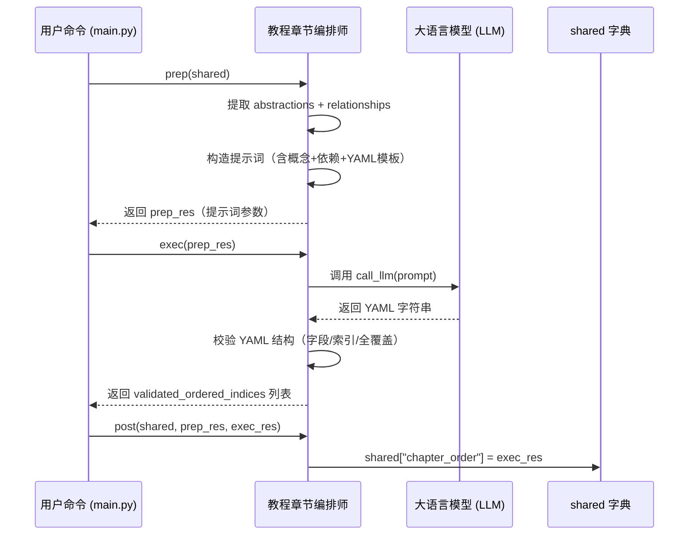

# Chapter 8: 教程章节编排师


欢迎来到本教程的第八章！🎉  
在前几章中，我们已经完成了“听懂用户需求”“调度流程”“拉取代码”“提炼抽象概念”“分析依赖关系”等关键步骤。  
现在——终于到了最关键的一步：  
> 🎼 **谁来决定“先讲哪个概念，后讲哪个概念”，让新手像爬楼梯一样平滑上手？**  
> 比如：为什么先讲“用户登录入口”，再讲“权限校验器”，最后才讲“异步任务队列”？  

这就是本章的主角：**教程章节编排师** 📚

---

## 为什么需要“教程章节编排师”？

想象你要教朋友做一道宫保鸡丁：

- ❌ 如果直接跳到“热油爆香花椒”的步骤——朋友会懵：“花椒是什么？油温多少度？”  
- ❌ 如果先讲“买鸡腿肉”，再讲“切丁”，再讲“腌制”，再讲“热锅”……——步骤太碎，缺乏主线  
- ❌ 如果顺序混乱：“先放酱汁”→“再切肉”→“最后买鸡”——完全不可操作！  

而**教程章节编排师**，就像一位**经验丰富的烹饪大师 + 一位耐心的教学设计师**，它通读所有抽象概念及其依赖关系后，构建出一条**最优学习路径**，确保：

1. ✅ **从用户可见的入口开始**（如“命令行怎么运行？”）  
2. ✅ **逐步深入底层实现**（如“异步队列如何工作？”）  
3. ✅ **每个概念都有前置铺垫**（先理解“任务调度”，再理解“队列管理”）  

> 💡 **一句话使命**：  
> **教程章节编排师 = 学习路径的“导航仪” + 认知阶梯的“设计师”**  
> 它把零散的概念梳理成一条**平滑、无跳跃、无遗漏**的递进式学习路径，让新手从“完全陌生”到“独立上手”只差一本教程的距离！

---

## 核心思想：LLM + 依赖图谱 = 最优排序

这个模块的“大脑”同样是**大语言模型（LLM）**，但它不是简单问：“这些概念怎么排序？”  
而是——**用精心设计的提示词（prompt）引导 LLM 做两件事**：

1️⃣ **读透依赖关系**：把所有抽象概念 + 关系三元组（如 `[用户入口 → 查询处理器: 调用]`）打包成上下文  
2️⃣ **推导路径**：按要求输出**严格包含全部抽象的有序索引列表**，确保：
   - 入门概念靠前（如“用户交互入口”）
   - 基础概念次之（如“文件扫描器”）
   - 实现细节靠后（如“异步队列”）

我们来看一个真实场景 🌰：

假设你运行了这条命令（还记得吧？）：

```bash
python main.py --repo https://github.com/PocketFlow-Dev/pocketflow-tutorial-codebase --language chinese
```

**教程章节编排师**立刻行动：

| 步骤 | 它做了什么？ | 类比 |
|------|-------------|------|
| 📚 通读依赖 | 把抽象概念列表 + 关系三元组拼成上下文 | 👨‍🎓 阅读“项目架构说明书 + 调用关系图” |
| 🧠 推导路径 | 调用 LLM 分析依赖链，生成**从基础到高级**的章节顺序 | 🧠 从说明书里提炼“最佳教学路线” |
| 📍 标注顺序 | 为每个概念分配**章节编号**（如 `1 # 用户交互入口`） | 🗺️ 在路线图上标序号：1→2→3… |
| 📤 上交 | 返回给主流程控制器：`[0, 2, 1, 3]`（索引列表） | 📬 把章节顺序交给下一环节 |

> ✅ **最终交付物**：一个**严格有序的整数列表**，长度 = 抽象概念总数，且**不重复、不遗漏**  
> （例如：`[0, 2, 1, 3]` 表示：先讲索引 0，再讲索引 2，再讲索引 1…）

---

## 举个栗子 🌰：系统如何从依赖中“推导”出最佳路径？

我们用一个极简示例演示它的核心逻辑（完整实现在 [`nodes.py`](nodes.py) 的 `OrderChapters` 类）：

### ✅ 示例：输入依赖 → 输出章节顺序

假设 `shared["abstractions"]` 包含 4 个概念（已按顺序编号）：

```python
abstractions = [
  {
    "name": "用户交互入口",  # ← 最用户可见
    "description": "接收用户命令，启动整个流程。",
    "files": [0]
  },
  {
    "name": "异步任务队列",  # ← 最底层实现
    "description": "负责异步处理耗时任务，避免阻塞主线程。",
    "files": [5]
  },
  {
    "name": "主流程控制器",  # ← 中间协调者
    "description": "调度各节点执行，管理重试与错误。",
    "files": [1]
  },
  {
    "name": "代码仓库抓取引擎",  # ← 数据源
    "description": "负责拉取 GitHub 或本地代码文件。",
    "files": [2]
  }
]
```

假设 `shared["relationships"]["details"]` 包含这些依赖关系：

```python
[
  {"from": 0, "to": 2, "label": "启动"},       # 用户入口 → 主流程
  {"from": 2, "to": 3, "label": "调用"},        # 主流程 → 抓取引擎
  {"from": 2, "to": 4, "label": "调用"},        # 主流程 → 抽象识别器（隐含）
  {"from": 2, "to": 5, "label": "调用"},        # 主流程 → 关系图谱构建器（隐含）
  {"from": 3, "to": 4, "label": "提供数据"},    # 抓取引擎 → 抽象识别器
  {"from": 4, "to": 5, "label": "提供数据"},    # 抽象识别器 → 关系图谱构建器
  {"from": 5, "to": 6, "label": "提供数据"},    # 关系图谱构建器 → 章节编排师（当前模块）
  {"from": 6, "to": 7, "label": "驱动"},        # 章节编排师 → 分步生成器
  {"from": 7, "to": 8, "label": "驱动"},        # 分步生成器 → 整合发布器
]
```

> ⚠️ 注意：实际项目中，`abstractions` 只包含**业务级概念**（如“用户交互入口”），而 `relationships` 可能包含**技术组件**（如“主流程控制器”），编排师会**统一处理**。

**教程章节编排师**会调用 LLM（通过 [`call_llm()`](utils/call_llm.py)），传入以下**结构化提示词**（已翻译为中文）：

```yaml
# LLM 提示词（简化版，重点看结构）
Given the following project abstractions and their relationships for the project `pocketflow-tutorial-codebase`:

Abstractions (Index # Name):
- 0 # 用户交互入口
- 1 # 异步任务队列
- 2 # 主流程控制器
- 3 # 代码仓库抓取引擎

Context about relationships and project summary:
Project Summary:
本系统采用分层架构：*入口层* → *协调层* → *数据层* → *实现层*。**用户交互入口**是系统的唯一入口点，它启动**主流程控制器**；**主流程控制器**负责调度，它会调用**代码仓库抓取引擎**获取源码，并调用**异步任务队列**处理耗时任务。

Relationships (Indices refer to abstractions above):
- From 0 (用户交互入口) to 2 (主流程控制器): 启动
- From 2 (主流程控制器) to 3 (代码仓库抓取引擎): 调用
- From 2 (主流程控制器) to 1 (异步任务队列): 调用

If you are going to make a tutorial for `pocketflow-tutorial-codebase`, what is the best order to explain these abstractions, from first to last?
Ideally, first explain those that are the most important or foundational, perhaps user-facing concepts or entry points. Then move to more detailed, lower-level implementation details or supporting concepts.

Output the ordered list of abstraction indices, including the name in a comment for clarity. Use the format `idx # AbstractionName`.

```yaml
- 0 # 用户交互入口
- 2 # 主流程控制器
- 3 # 代码仓库抓取引擎
- 1 # 异步任务队列
```

Now, provide the YAML output:
```

LLM 返回结果后，它会做**严格校验**：

| 校验项 | 说明 |
|--------|------|
| ✅ 结构合法性 | 确保返回的是 YAML 列表，每个元素是整数或 `"idx # name"` 格式 |
| ✅ 索引有效性 | 检查索引是否在 `[0, len(abstractions)-1]` 范围内（避免越界） |
| ✅ 类型正确性 | 所有元素必须是整数或可解析为整数的字符串 |
| ✅ 全覆盖检查 | 确保每个抽象概念**恰好出现一次**（无重复、无遗漏） |

> 💡 **关键设计原则**：  
> - **不信任 LLM 输出**：所有结果必须经过严格校验  
> - **保留原始索引**：用 `0 # 用户交互入口` 而非概念名称字符串，避免名称变化导致失效  
> - **严格排序**：确保生成的列表是**全排列**（permutation），这是后续章节生成的基石！

---

## 核心功能：它能做什么？

教程章节编排师（即 [`OrderChapters`](nodes.py) 类）就像一位**严谨的教学设计师 + 精准的索引员**：

| 功能 | 说明 | 为什么重要？ |
|------|------|-------------|
| 🧠 路径推导 | 从依赖关系中自动推导出**从基础到高级**的章节顺序 | 🧠 让新手从“完全陌生”到“独立上手”只差一本教程 |
| 📏 全覆盖检查 | 强制每个抽象概念**恰好出现一次**（无重复、无遗漏） | 📏 防止章节“掉线”或“重复”，确保教程完整性 |
| 🌍 多语言支持 | 根据 `--language` 参数，自动用中文/英文等生成提示词与输出 | 🌍 全球化项目必备 |
| 🗺️ 结构化输出 | 输出 `List[int]` 标准格式（如 `[0, 2, 1, 3]`） | 🗺️ 为后续分步生成提供清晰输入 |
| 🛡️ 安全校验 | 严格校验 LLM 输出格式，确保后续流程不报错 | 🛡️ 系统稳定性的第一道防线 |

> 💡 **关键理念**：  
> 它**不修改代码**——只负责**从依赖关系中“发现”并“翻译”出人类可理解的学习路径**。  
> 后续的 [分步教程生成器](09_分步教程生成器_批处理__.md)、[教程整合发布器](10_教程整合发布器_.md) 都依赖它提供的**清晰、有序的章节序列**。

---

## 怎么用它？——3 分钟上手

虽然你**不需要直接调用**教程章节编排师（它已集成在 [`create_tutorial_flow()`](flow.py) 的主流程中），但我们可以用一个极简示例演示它的核心逻辑：

### ✅ 示例：模拟章节编排流程（无需真实 LLM）

```python
from nodes import OrderChapters

# 假设 shared["abstractions"] 和 shared["relationships"] 已由上一环节填充
shared = {
    "abstractions": [
        {"name": "用户交互入口", "description": "系统入口点...", "files": [0]},
        {"name": "异步任务队列", "description": "底层队列实现...", "files": [5]},
        {"name": "主流程控制器", "description": "调度协调中心...", "files": [1]},
        {"name": "代码仓库抓取引擎", "description": "拉取代码文件...", "files": [2]},
    ],
    "relationships": {
        "summary": "本系统采用分层架构：*入口层* → *协调层* → *数据层*。",
        "details": [
            {"from": 0, "to": 2, "label": "启动"},
            {"from": 2, "to": 3, "label": "调用"},
            {"from": 2, "to": 1, "label": "调用"},
        ]
    },
    "project_name": "pocketflow-demo",
    "language": "chinese",
    "use_cache": True,
}

# 创建节点实例（自动绑定到主流程）
node = OrderChapters()

# 模拟 prep → exec → post 三阶段（实际由 Pocket Flow 自动调用）
prep_res = node.prep(shared)  # 准备上下文
exec_res = node.exec(prep_res)  # 调用 LLM 推导顺序
node.post(shared, prep_res, exec_res)  # 保存结果

# 最终结果在 shared["chapter_order"]
print(shared["chapter_order"])
```

#### 输出结果（简化版）：

```python
[0, 2, 3, 1]  # ← 严格包含全部 4 个概念的有序列表
```

> 📝 **重点看输出**：  
> - `0` → 先讲“用户交互入口”（最用户可见）  
> - `2` → 再讲“主流程控制器”（调度核心）  
> - `3` → 再讲“代码仓库抓取引擎”（数据源）  
> - `1` → 最后讲“异步任务队列”（底层实现）  
> - **顺序完全符合“从可见到不可见，从入口到实现”的认知逻辑！**

---

## 内部工作流：它怎么运作的？

我们用一个极简流程图，看它如何“准备上下文 → 调用 LLM → 校验结果”：



### 📌 关键细节（新手必读）

| 问题 | 解决方案 |
|------|---------|
| **LLM 输出格式错误怎么办？** | 用 `yaml.safe_load()` 解析失败时抛出异常（如 `ValueError("LLM Output is not a list")`） |
| **索引越界怎么办？** | 检查 `0 <= idx < num_abstractions`，否则抛出异常（如 `Invalid index 99 found`） |
| **重复索引怎么办？** | 用 `seen_indices` 集合记录已出现的索引，发现重复立即报错 |
| **遗漏概念怎么办？** | 比较 `len(ordered_indices)` 和 `num_abstractions`，不相等则抛出 `ValueError("Missing indices: ...")` |
| **语言不匹配怎么办？** | 如果用户指定中文，但 LLM 返回英文索引名，校验逻辑中强制检查并抛出异常 |
| **如何加速重复任务？** | `use_cache=True` 时，首次调用结果会缓存到 `~/.pocketflow/cache/`，后续直接复用 |

---

## 代码拆解：只看最关键的几行！

我们聚焦 [`OrderChapters`](nodes.py) 中的**核心逻辑**（简化版）：

### ✅ 步骤 1：准备上下文（20 行）

```python
def prep(self, shared):
    abstractions = shared["abstractions"]  # List of {"name", "description", "files"}
    relationships = shared["relationships"]  # {"summary": str, "details": [...]}
    project_name = shared["project_name"]
    language = shared.get("language", "english")
    use_cache = shared.get("use_cache", True)

    # 构造提示词中的概念列表
    abstraction_info_for_prompt = []
    for i, a in enumerate(abstractions):
        abstraction_info_for_prompt.append(f"- {i} # {a['name']}")  # 索引 + 名称
    abstraction_listing = "\n".join(abstraction_info_for_prompt)

    # 构造提示词中的依赖关系
    context = f"Project Summary:\n{relationships['summary']}\n\n"
    context += "Relationships (Indices refer to abstractions above):\n"
    for rel in relationships["details"]:
        from_name = abstractions[rel["from"]]["name"]
        to_name = abstractions[rel["to"]]["name"]
        context += f"- From {rel['from']} ({from_name}) to {rel['to']} ({to_name}): {rel['label']}\n"

    return (
        abstraction_listing,
        context,
        len(abstractions),
        project_name,
        use_cache,
    )
```

> 💡 **关键点**：  
> - `abstraction_listing` 是**索引 + 名称列表**（供 LLM 引用）  
> - `context` 是**依赖关系 + 项目摘要**（提供上下文）  
> - 两者共同构成 LLM 的“输入材料”

---

### ✅ 步骤 2：构建提示词（核心！25 行）

```python
def exec(self, prep_res):
    (
        abstraction_listing,
        context,
        num_abstractions,
        project_name,
        use_cache,
    ) = prep_res

    prompt = f"""
Given the following project abstractions and their relationships for the project `{project_name}`:

Abstractions (Index # Name):
{abstraction_listing}

Context about relationships and project summary:
{context}

If you are going to make a tutorial for `{project_name}`, what is the best order to explain these abstractions, from first to last?
Ideally, first explain those that are the most important or foundational, perhaps user-facing concepts or entry points. Then move to more detailed, lower-level implementation details or supporting concepts.

Output the ordered list of abstraction indices, including the name in a comment for clarity. Use the format `idx # AbstractionName`.

```yaml
- 2 # FoundationalConcept
- 0 # CoreClassA
- 1 # CoreClassB (uses CoreClassA)
- ...
```

Now, provide the YAML output:
"""
    response = call_llm(prompt, use_cache=(use_cache and self.cur_retry == 0))
    # ... 后续校验逻辑（见下方）
```

> 🌟 **核心技巧**：  
> - 用 `user-facing concepts or entry points` 引导 LLM **优先考虑用户可见性**  
> - 用 `lower-level implementation details` 引导 LLM **将底层实现靠后安排**  
> - YAML 模板明确要求 `idx # AbstractionName` 格式，确保结构化输出

---

### ✅ 步骤 3：校验 LLM 输出（核心！40 行）

```python
# 解析 YAML 字符串
yaml_str = response.strip().split("```yaml")[1].split("```")[0].strip()
ordered_indices_raw = yaml.safe_load(yaml_str)

if not isinstance(ordered_indices_raw, list):
    raise ValueError("LLM Output is not a list")

ordered_indices = []
seen_indices = set()

for entry in ordered_indices_raw:
    try:
        if isinstance(entry, int):
            idx = entry
        elif isinstance(entry, str) and "#" in entry:
            idx = int(entry.split("#")[0].strip())
        else:
            idx = int(str(entry).strip())

        if not (0 <= idx < num_abstractions):
            raise ValueError(f"Invalid index {idx} in ordered list. Max index is {num_abstractions-1}.")

        if idx in seen_indices:
            raise ValueError(f"Duplicate index {idx} found in ordered list.")

        ordered_indices.append(idx)
        seen_indices.add(idx)

    except (ValueError, TypeError):
        raise ValueError(f"Could not parse index from ordered list entry: {entry}")

# 校验全覆盖：确保每个抽象概念恰好出现一次
if len(ordered_indices) != num_abstractions:
    missing_indices = set(range(num_abstractions)) - seen_indices
    raise ValueError(f"Ordered list length ({len(ordered_indices)}) does not match number of abstractions ({num_abstractions}). Missing indices: {missing_indices}")

print(f"Determined chapter order (indices): {ordered_indices}")
return ordered_indices  # 返回严格有序的索引列表
```

> 💡 **关键点**：  
> - 同时支持整数 `1` 和字符串 `"1 # src/handler.py"` 格式（兼容不同 LLM 行为）  
> - `seen_indices` 集合确保**无重复**  
> - `len(ordered_indices) == num_abstractions` 确保**全覆盖**  
> - **全覆盖检查是核心创新点**，避免出现“孤儿章节”

---

### ✅ 步骤 4：保存结果（2 行）

```python
def post(self, shared, prep_res, exec_res):
    shared["chapter_order"] = exec_res  # List of indices, e.g., [0, 2, 1, 3]
```

> ✅ **这就是后续模块的“输入”**！  
> 比如 [分步教程生成器](09_分步教程生成器_批处理__.md) 会读取 `shared["chapter_order"]` 来决定先生成哪一章。

---

## 它如何与系统其他部分协作？

教程章节编排师是**整个流程的“教学设计师”**，它输出的数据直接喂给后续节点：


> 🌟 **关键设计原则**：  
> - **统一数据接口**：`chapter_order` 始终是 `List[int]` 结构  
> - **零侵入**：后续模块**完全不知道**顺序来自哪个 LLM 调用  
> - **可扩展**：未来可替换为更小的本地模型？只需实现同样接口即可！

---

## 小结：你学到了什么？

✅ **教程章节编排师 = 学习路径的“导航仪” + 认知阶梯的“设计师”**  
✅ 它负责把零散的概念梳理成一条**平滑、无跳跃、无遗漏**的递进式学习路径  
✅ 支持多语言（中文/英文等），自动标注章节顺序与索引  
✅ 返回 `List[int]`，供后续分步生成、整合发布直接使用  
✅ **全覆盖检查**确保每个概念都有“位置”，避免“孤儿章节”  

> 🚀 下一步：  
> 当章节顺序被清晰确定后——  
> **谁来为每个章节撰写具体教程内容**？  
> 请看 [第 9 章：分步教程生成器（批处理）](09_分步教程生成器_批处理__.md) —— 它负责**按章节顺序批量生成 Markdown 教程**，是整个系统的“内容生产机”！  
> （提示：它会复用章节编排师的缓存结果，避免重复调用）

现在，不妨打开 [`nodes.py`](nodes.py) 文件，找到 `OrderChapters` 类——  
试着运行它的 `prep()` 和 `exec()` 方法，你会看到它像一位专注的教学设计师，默默从依赖关系中“推导”出最佳学习路径——  
**没有它，后续所有“知识编排”都无从谈起！** 📚✨

---

Generated by [AI Codebase Knowledge Builder](https://github.com/The-Pocket/Tutorial-Codebase-Knowledge)