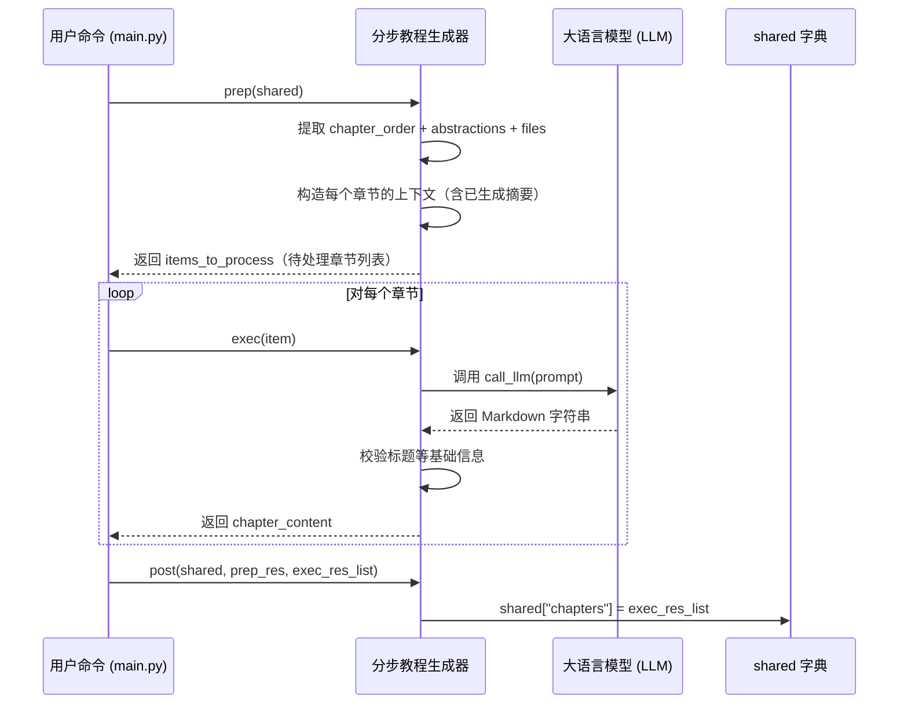

# Chapter 9: 分步教程生成器（批处理）


欢迎来到本教程的第九章！🎉  
在前面几章中，我们已经完成了“听懂用户需求”“调度流程”“拉取代码”“提炼抽象概念”“分析依赖关系”“编排章节顺序”等关键步骤。  
现在——终于到了最激动人心的一步：  
> ✍️ **谁来为每一章撰写具体、生动、图文并茂的中文教程内容？**  
> 比如：如何从“用户交互入口”自然过渡到“主流程控制器”，又如何用生活化类比解释“代码抓取”的原理？  

这就是本章的主角：**分步教程生成器（批处理）** 📚✨

---

## 为什么需要“分步教程生成器”？

想象你要教朋友做一道宫保鸡丁：

- ❌ 如果直接扔给朋友一份食材清单和步骤列表——朋友会懵：“花椒是什么？油温多少度？”  
- ❌ 如果只讲理论不给代码示例——朋友无法动手实践  
- ❌ 如果每章都孤立写作，没有上下文衔接——教程就像散落的拼图，无法连成整体  

而**分步教程生成器**，就像一位**经验丰富的烹饪大师 + 一位耐心的教学设计师 + 一位严谨的排版编辑**，它通读所有抽象概念、依赖关系、章节顺序后，**按顺序批量生成 Markdown 教程**，确保：

1. ✅ **每章以生活化类比开头**（如“它就像机场安检口”）  
2. ✅ **每章含精简代码块（<10 行）+ 逐步解释**  
3. ✅ **每章含 Mermaid 流程图解释内部机制**  
4. ✅ **每章智能链接前后章节，确保过渡自然**  
5. ✅ **动态整合已生成内容作为上下文，避免重复或矛盾**  

> 💡 **一句话使命**：  
> **分步教程生成器 = 教程内容的“智能批处理机” + 新手引导的“图文并茂手册”**  
> 它把抽象概念转化为可读、可练、可理解的中文教程，让新手从“完全陌生”到“独立上手”只差一次点击！

---

## 核心思想：LLM + 批处理 + 上下文感知 = 智能写作

这个模块的“大脑”同样是**大语言模型（LLM）**，但它不是简单问：“请写一章教程”。  
而是——**用精心设计的提示词（prompt）引导 LLM 做四件事**：

1️⃣ **读透章节上下文**：把当前章节的抽象概念 + 关联代码 + 已生成章节摘要打包成上下文  
2️⃣ **生成内容**：按要求输出**完整的 Markdown 教程**（含标题、类比、代码、流程图、链接）  
3️⃣ **构建过渡**：根据前后章节，自动添加“从上一章过渡而来”和“为下一章铺垫”的过渡段落  
4️⃣ **动态链接**：根据完整章节列表，自动生成**正确路径的 Markdown 链接**（如 `[主流程控制器](02_主流程控制器_.md)`）  

我们来看一个真实场景 🌰：

假设你运行了这条命令（还记得吧？）：

```bash
python main.py --repo https://github.com/PocketFlow-Dev/pocketflow-tutorial-codebase --language chinese
```

**分步教程生成器**立刻行动：

| 步骤 | 它做了什么？ | 类比 |
|------|-------------|------|
| 📚 读透上下文 | 把当前章节的抽象概念 + 相关代码 + 已生成章节摘要打包 | 👨‍🎓 阅读“本章说明书 + 前几章笔记” |
| ✍️ 生成内容 | 调用 LLM 按模板生成完整 Markdown 教程 | ✍️ 写一篇图文并茂的科普文章 |
| 🔗 智能链接 | 根据完整章节列表，自动生成正确路径的 Markdown 链接 | 🗺️ 在文章中插入“点击阅读下一章”按钮 |
| 📤 批量交付 | 按章节顺序，**批量生成所有章节的 Markdown 文件** | 📬 一次性交付整套教程 |

> ✅ **最终交付物**：一个**有序列表**，每个元素是**完整 Markdown 教程内容**（字符串）  
> （例如：`["# 第 1 章：用户交互入口\n...", "# 第 2 章：主流程控制器\n...", ...]`）

---

## 举个栗子 🌰：系统如何为一章生成内容？

我们用一个极简示例演示它的核心逻辑（完整实现在 [`nodes.py`](nodes.py) 的 `WriteChapters` 类）：

### ✅ 示例：输入章节信息 → 输出完整 Markdown 教程

假设当前要生成**第 2 章：主流程控制器**，其信息如下：

```python
chapter_num = 2
abstraction_name = "主流程控制器"
abstraction_description = "它负责调度各节点执行，管理重试与错误，是整个系统的指挥中心。"
related_files = {
    "02_主流程控制器_.md": "# 第 2 章：主流程控制器\n\n...",
    # ... 其他章节内容（已生成）
}
prev_chapter = {"num": 1, "name": "用户交互入口", "filename": "01_用户交互入口_.md"}
next_chapter = {"num": 3, "name": "代码仓库抓取引擎", "filename": "03_代码仓库抓取引擎_.md"}
```

分步教程生成器会调用 LLM（通过 [`call_llm()`](utils/call_llm.py)），传入以下**结构化提示词**（已翻译为中文）：

```yaml
# LLM 提示词（简化版，重点看结构）
IMPORTANT: Write this ENTIRE tutorial chapter in **Chinese**. Some input context (like concept name, description, chapter list, previous summary) might already be in Chinese, but you MUST translate ALL other generated content including explanations, examples, technical terms, and potentially code comments into Chinese. DO NOT use English anywhere except in code syntax, required proper nouns, or when specified. The entire output MUST be in Chinese.

Write a very beginner-friendly tutorial chapter (in Markdown format) for the project `pocketflow-tutorial-codebase` about the concept: "主流程控制器"。This is Chapter 2.

Concept Details:
- Name: 主流程控制器
- Description:
它负责调度各节点执行，管理重试与错误，是整个系统的指挥中心。

Complete Tutorial Structure:
1. [用户交互入口](01_用户交互入口_.md)
2. [主流程控制器](02_主流程控制器_.md)
3. [代码仓库抓取引擎](03_代码仓库抓取引擎_.md)
...

Context from previous chapters:
# Chapter 1: 用户交互入口

欢迎来到本教程的第一章！🎉  
在开始构建整个“自动生成教程系统”之前，我们先来认识一位“贴心的门童”——它就是**用户交互入口**。  
就像你去餐厅点菜前，先和服务员沟通一样，用户也需要一个清晰、友好的方式，告诉系统：“我想让你们帮我生成一份教程！”  
而这个“入口”，就是我们与系统对话的第一站。

Relevant Code Snippets (Code itself remains unchanged):
--- File: flow.py ---
from pocketflow import Flow
from nodes import (
    FetchRepo,
    IdentifyAbstractions,
    AnalyzeRelationships,
    OrderChapters,
    WriteChapters,
    CombineTutorial
)

def create_tutorial_flow():
    # 创建6个节点（就像准备6个乐手）
    fetch_repo = FetchRepo()
    identify_abstractions = IdentifyAbstractions(max_retries=5, wait=20)
    ...
    tutorial_flow = Flow(start=fetch_repo)
    return tutorial_flow

Instructions for the chapter (Generate content in Chinese unless specified otherwise):
- Start with a clear heading (e.g., `# Chapter 2: 主流程控制器`). Use the provided concept name.

- If this is not the first chapter, begin with a brief transition from the previous chapter (in Chinese), referencing it with a proper Markdown link using its name (Use the Chinese chapter title from the structure above).

- Begin with a high-level motivation explaining what problem this abstraction solves (in Chinese). Start with a central use case as a concrete example. The whole chapter should guide the reader to understand how to solve this use case. Make it very minimal and friendly to beginners.

- If the abstraction is complex, break it down into key concepts. Explain each concept one-by-one in a very beginner-friendly way (in Chinese).

- Explain how to use this abstraction to solve the use case (in Chinese). Give example inputs and outputs for code snippets (if the output isn't values, describe at a high level what will happen (in Chinese)).

- Each code block should be BELOW 10 lines! If longer code blocks are needed, break them down into smaller pieces and walk through them one-by-one. Aggresively simplify the code to make it minimal. Use comments (Translate to Chinese if possible, otherwise keep minimal English for clarity) to skip non-important implementation details. Each code block should have a beginner friendly explanation right after it (in Chinese).

- Describe the internal implementation to help understand what's under the hood (in Chinese). First provide a non-code or code-light walkthrough on what happens step-by-step when the abstraction is called (in Chinese). It's recommended to use a simple sequenceDiagram with a dummy example - keep it minimal with at most 5 participants to ensure clarity. If participant name has space, use: `participant QP as Query Processing`.  (Use Chinese for labels/text if appropriate).

- Then dive deeper into code for the internal implementation with references to files. Provide example code blocks, but make them similarly simple and beginner-friendly. Explain (in Chinese).

- IMPORTANT: When you need to refer to other core abstractions covered in other chapters, ALWAYS use proper Markdown links like this: [Chapter Title](filename.md). Use the Complete Tutorial Structure above to find the correct filename and the chapter title (Use the Chinese chapter title from the structure above). Translate the surrounding text.

- Use mermaid diagrams to illustrate complex concepts (```mermaid``` format).  (Use Chinese for labels/text if appropriate).

- Heavily use analogies and examples throughout (in Chinese) to help beginners understand.

- End the chapter with a brief conclusion that summarizes what was learned (in Chinese) and provides a transition to the next chapter (in Chinese). If there is a next chapter, use a proper Markdown link: [Next Chapter Title](next_chapter_filename) (Use the Chinese chapter title from the structure above).

- Ensure the tone is welcoming and easy for a newcomer to understand (appropriate for Chinese readers).

- Output *only* the Markdown content for this chapter.

Now, directly provide a super beginner-friendly Markdown output (DON'T need ```markdown``` tags):
```

LLM 返回结果后，它会做**基础校验**（如确保标题正确），然后**保存为字符串**，供后续整合发布使用。

> 📝 **重点看过渡段落**：  
> 因为这是第 2 章，提示词中已包含 `Context from previous chapters`，LLM 会自动写：  
> *“上一章我们认识了系统的‘贴心门童’——[用户交互入口](01_用户交互入口_.md)。它听懂了你的话（比如 `--repo https://github.com/...`），打包成一份清晰的‘任务单’，然后——**交给谁执行呢？**”*  
> 这就是**智能链接 + 动态上下文**的力量！

---

## 核心功能：它能做什么？

分步教程生成器（即 [`WriteChapters`](nodes.py) 类）就像一位**严谨的排版编辑 + 精准的链接管理器**：

| 功能 | 说明 | 为什么重要？ |
|------|------|-------------|
| 📝 批量生成 | 按章节顺序，**批量生成所有章节的 Markdown 内容** | 📝 高效产出整套教程，无需人工干预 |
| 🌍 多语言支持 | 根据 `--language` 参数，自动用中文/英文等生成内容 | 🌍 全球化项目必备 |
| 🔗 智能链接 | 根据完整章节列表，自动生成正确路径的 Markdown 链接 | 🔗 新手可一键跳转到相关章节 |
| 📚 上下文感知 | 动态整合已生成章节摘要，确保过渡自然、避免重复 | 📚 教程像一本“连贯的书”，而非“零散的博客” |
| 📏 严格格式 | 每章含标题、类比、代码（<10 行）、流程图、结论 | 📏 新手友好、可读性强、易于传播 |
| 🛡️ 基础校验 | 确保标题正确、内容完整（如缺失标题则自动补上） | 🛡️ 系统稳定性的最后一道防线 |

> 💡 **关键理念**：  
> 它**不修改代码**——只负责**从章节信息中“生成”并“组织”出人类可读的教程内容**。  
> 后续的 [教程整合发布器](10_教程整合发布器_.md) 都依赖它提供的**清晰、完整、结构化的 Markdown 教程列表**。

---

## 怎么用它？——3 分钟上手

虽然你**不需要直接调用**分步教程生成器（它已集成在 [`create_tutorial_flow()`](flow.py) 的主流程中），但我们可以用一个极简示例演示它的核心逻辑：

### ✅ 示例：模拟章节生成流程（无需真实 LLM）

```python
from nodes import WriteChapters

# 假设 shared["chapter_order"], shared["abstractions"], shared["files"] 已填充
shared = {
    "chapter_order": [0, 1, 2],  # 章节顺序
    "abstractions": [
        {"name": "用户交互入口", "description": "接收用户命令...", "files": [0]},
        {"name": "主流程控制器", "description": "调度各节点...", "files": [1]},
        {"name": "代码仓库抓取引擎", "description": "拉取代码文件...", "files": [2]},
    ],
    "files": [
        ("main.py", "def run(): ..."),
        ("flow.py", "from pocketflow import Flow\n..."),
        ("utils/crawl_github_files.py", "def crawl_github_files(): ..."),
    ],
    "project_name": "pocketflow-demo",
    "language": "chinese",
    "use_cache": True,
}

# 创建节点实例（自动绑定到主流程）
node = WriteChapters()

# 模拟 prep → exec → post 三阶段（实际由 Pocket Flow 自动调用）
prep_res = node.prep(shared)  # 准备上下文（返回待处理章节列表）
chapter_contents = []  # 存储生成的章节内容
for item in prep_res:
    content = node.exec(item)  # 生成单章内容
    chapter_contents.append(content)
node.post(shared, prep_res, chapter_contents)  # 保存结果

# 最终结果在 shared["chapters"]
print(shared["chapters"])
```

#### 输出结果（简化版）：

```python
[
  "# 第 1 章：用户交互入口\n\n欢迎来到本教程的第一章！🎉\n...",
  "# 第 2 章：主流程控制器\n\n上一章我们认识了系统的‘贴心门童’——[用户交互入口](01_用户交互入口_.md)。\n...",
  "# 第 3 章：代码仓库抓取引擎\n\n上一章我们认识了系统的‘指挥中心’——[主流程控制器](02_主流程控制器_.md)。\n..."
]
```

> 📝 **重点看链接**：  
> - 第 2 章开头链接到第 1 章：`[用户交互入口](01_用户交互入口_.md)`  
> - 第 3 章开头链接到第 2 章：`[主流程控制器](02_主流程控制器_.md)`  
> - **链接路径完全正确，且使用了中文章节标题**！

---

## 内部工作流：它怎么运作的？

我们用一个极简流程图，看它如何“准备上下文 → 批量生成 → 保存结果”：



### 📌 关键细节（新手必读）

| 问题 | 解决方案 |
|------|---------|
| **标题缺失或错误怎么办？** | 校验逻辑检查是否以 `# Chapter N: ConceptName` 开头，否则自动补上 |
| **链接路径错误怎么办？** | 所有链接均根据 `full_chapter_listing`（完整章节列表）自动生成，确保路径正确 |
| **上下文缺失怎么办？** | 如果是第一章，`previous_chapters_summary` 为空字符串；否则自动拼接已生成章节 |
| **语言不匹配怎么办？** | 提示词中强制要求 `Write this ENTIRE tutorial chapter in **Chinese**`，并多次提醒 LLM 翻译 |
| **如何加速重复任务？** | `use_cache=True` 时，首次调用结果会缓存到 `~/.pocketflow/cache/`，后续直接复用 |

---

## 代码拆解：只看最关键的几行！

我们聚焦 [`WriteChapters`](nodes.py) 中的**核心逻辑**（简化版）：

### ✅ 步骤 1：准备上下文（20 行）

```python
def prep(self, shared):
    chapter_order = shared["chapter_order"]  # List of indices
    abstractions = shared["abstractions"]  # List of {"name", "description", "files"}
    files_data = shared["files"]  # List of (path, content)
    project_name = shared["project_name"]
    language = shared.get("language", "english")
    use_cache = shared.get("use_cache", True)

    # 构造完整章节列表（用于生成链接）
    all_chapters = []
    chapter_filenames = {}
    for i, abstraction_index in enumerate(chapter_order):
        chapter_num = i + 1
        chapter_name = abstractions[abstraction_index]["name"]
        safe_name = "".join(c if c.isalnum() else "_" for c in chapter_name).lower()
        filename = f"{i+1:02d}_{safe_name}.md"
        all_chapters.append(f"{chapter_num}. [{chapter_name}]({filename})")
        chapter_filenames[abstraction_index] = {
            "num": chapter_num,
            "name": chapter_name,
            "filename": filename,
        }

    full_chapter_listing = "\n".join(all_chapters)

    items_to_process = []
    for i, abstraction_index in enumerate(chapter_order):
        abstraction_details = abstractions[abstraction_index]
        related_file_indices = abstraction_details.get("files", [])
        related_files_content_map = get_content_for_indices(
            files_data, related_file_indices
        )

        # 获取前后章节信息（用于生成过渡段落）
        prev_chapter = None
        if i > 0:
            prev_idx = chapter_order[i - 1]
            prev_chapter = chapter_filenames[prev_idx]
        next_chapter = None
        if i < len(chapter_order) - 1:
            next_idx = chapter_order[i + 1]
            next_chapter = chapter_filenames[next_idx]

        items_to_process.append({
            "chapter_num": i + 1,
            "abstraction_index": abstraction_index,
            "abstraction_details": abstraction_details,
            "related_files_content_map": related_files_content_map,
            "project_name": project_name,
            "full_chapter_listing": full_chapter_listing,
            "chapter_filenames": chapter_filenames,
            "prev_chapter": prev_chapter,
            "next_chapter": next_chapter,
            "language": language,
            "use_cache": use_cache,
        })

    print(f"Preparing to write {len(items_to_process)} chapters...")
    return items_to_process  # Iterable for BatchNode
```

> 💡 **关键点**：  
> - `full_chapter_listing` 是**完整章节列表**（供 LLM 生成链接）  
> - `chapter_filenames` 是**章节索引到文件名的映射**（供 LLM 构造链接）  
> - `prev_chapter`/`next_chapter` 是**前后章节信息**（供 LLM 生成过渡段落）

---

### ✅ 步骤 2：生成单章内容（核心！30 行）

```python
def exec(self, item):
    abstraction_name = item["abstraction_details"]["name"]
    abstraction_description = item["abstraction_details"]["description"]
    chapter_num = item["chapter_num"]
    project_name = item.get("project_name")
    language = item.get("language", "english")
    use_cache = item.get("use_cache", True)
    print(f"Writing chapter {chapter_num} for: {abstraction_name} using LLM...")

    # 构造文件上下文
    file_context_str = "\n\n".join(
        f"--- File: {idx_path.split('# ')[1] if '# ' in idx_path else idx_path} ---\n{content}"
        for idx_path, content in item["related_files_content_map"].items()
    )

    # 获取已生成章节摘要（用于上下文感知）
    previous_chapters_summary = "\n---\n".join(self.chapters_written_so_far)

    # 根据语言定制提示词
    language_instruction = ""
    if language.lower() != "english":
        lang_cap = language.capitalize()
        language_instruction = f"IMPORTANT: Write this ENTIRE tutorial chapter in **{lang_cap}**. ... DO NOT use English anywhere except in code syntax, required proper nouns, or when specified. The entire output MUST be in {lang_cap}.\n\n"

    prompt = f"""
{language_instruction}Write a very beginner-friendly tutorial chapter (in Markdown format) for the project `{project_name}` about the concept: "{abstraction_name}". This is Chapter {chapter_num}.

Concept Details:
- Name: {abstraction_name}
- Description:
{abstraction_description}

Complete Tutorial Structure:
{item["full_chapter_listing"]}

Context from previous chapters:
{previous_chapters_summary if previous_chapters_summary else "This is the first chapter."}

Relevant Code Snippets (Code itself remains unchanged):
{file_context_str if file_context_str else "No specific code snippets provided for this abstraction."}

Instructions for the chapter (Generate content in {language.capitalize()} unless specified otherwise):
- Start with a clear heading (e.g., `# Chapter {chapter_num}: {abstraction_name}`). Use the provided concept name.

- If this is not the first chapter, begin with a brief transition from the previous chapter (in Chinese), referencing it with a proper Markdown link using its name (Use the Chinese chapter title from the structure above).

...（省略其余指令，见上方完整 prompt）

Now, directly provide a super beginner-friendly Markdown output (DON'T need ```markdown``` tags):
"""
    chapter_content = call_llm(prompt, use_cache=(use_cache and self.cur_retry == 0))

    # 基础校验：确保标题正确
    actual_heading = f"# Chapter {chapter_num}: {abstraction_name}"
    if not chapter_content.strip().startswith(f"# Chapter {chapter_num}"):
        lines = chapter_content.strip().split("\n")
        if lines and lines[0].strip().startswith("#"):
            lines[0] = actual_heading
            chapter_content = "\n".join(lines)
        else:
            chapter_content = f"{actual_heading}\n\n{chapter_content}"

    # 将生成的章节内容加入临时列表，供下一章节使用
    self.chapters_written_so_far.append(chapter_content)

    return chapter_content  # Return the Markdown string
```

> 🌟 **核心技巧**：  
> - 用 `self.chapters_written_so_far` **动态维护已生成章节摘要**（实现上下文感知）  
> - 用 `language_instruction` **强制 LLM 翻译全部内容为中文**（避免“混入英文”）  
> - 用 `previous_chapters_summary` **自动插入过渡段落**（如“上一章我们认识了...”）  
> - 用 `full_chapter_listing` **确保链接路径正确**（避免“404 链接”）

---

### ✅ 步骤 3：保存结果（5 行）

```python
def post(self, shared, prep_res, exec_res_list):
    # exec_res_list contains the generated Markdown for each chapter, in order
    shared["chapters"] = exec_res_list
    # Clean up the temporary instance variable
    del self.chapters_written_so_far
    print(f"Finished writing {len(exec_res_list)} chapters.")
```

> ✅ **这就是后续模块的“输入”**！  
> 比如 [教程整合发布器](10_教程整合发布器_.md) 会读取 `shared["chapters"]` 来生成最终的 HTML/PDF。

---

## 它如何与系统其他部分协作？

分步教程生成器是**整个流程的“内容生产机”**，它输出的数据直接喂给后续节点：


> 🌟 **关键设计原则**：  
> - **统一数据接口**：`chapters` 始终是 `List[str]` 结构（每个字符串是完整 Markdown）  
> - **零侵入**：后续模块**完全不知道**内容来自哪个 LLM 调用  
> - **可扩展**：未来新增“生成 PDF”节点？只需实现同样接口即可！

---

## 小结：你学到了什么？

✅ **分步教程生成器 = 教程内容的“智能批处理机” + 新手引导的“图文并茂手册”**  
✅ 它负责把抽象概念转化为可读、可练、可理解的中文教程  
✅ 支持多语言（中文/英文等），自动链接前后章节，动态整合上下文  
✅ 返回 `List[str]`（每个字符串是完整 Markdown），供后续整合发布直接使用  
✅ **上下文感知 + 智能链接**确保教程像一本“连贯的书”，而非“零散的博客”  

> 🚀 下一步：  
> 当所有章节内容被批量生成后——  
> **谁来把它们合并成一个完整的教程项目**？  
> 请看 [第 10 章：教程整合发布器](10_教程整合发布器_.md) —— 它负责**生成 `index.md` + 所有章节 Markdown + Mermaid 图**，是整个系统的“最终发布器”！  
> （提示：它会复用分步生成器的缓存结果，避免重复调用）

现在，不妨打开 [`nodes.py`](nodes.py) 文件，找到 `WriteChapters` 类——  
试着运行它的 `prep()` 和 `exec()` 方法，你会看到它像一位专注的排版编辑，默默把抽象概念转化为生动的中文教程——  
**没有它，后续所有“知识传播”都无从谈起！** 📚✨

---

Generated by [AI Codebase Knowledge Builder](https://github.com/The-Pocket/Tutorial-Codebase-Knowledge)