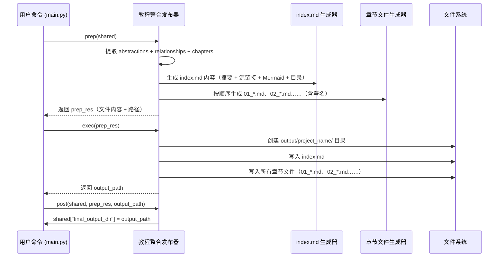

# Chapter 10: 教程整合发布器


欢迎来到本教程的最后一章！🎉  
在前面九章中，我们已经完成了从“听懂用户需求”到“批量生成章节内容”的全过程——  
你已经拥有了一套**完整的、结构清晰、图文并茂的中文教程**，每个章节都像一本连贯的书一样自然流畅。

但问题来了：  
- 📁 这些章节散落在内存中（`shared["chapters"]`），如何**统一打包**？  
- 🌐 如何生成**总览页面**（`index.md`），让读者一眼看懂项目概览和章节关系？  
- 🗺️ 如何自动画出**概念依赖关系图**（Mermaid 流程图），让新手快速掌握整体脉络？  
- 🚀 如何一键**部署为 GitHub Pages 或本地预览**，实现“所见即所得”？

而这位“**最终出版系统**”，正是本章的主角：**教程整合发布器** 📦✨

---

## 为什么需要“教程整合发布器”？

想象你要出版一本新书：

- ❌ 如果只有零散的手稿（章节内容）——无法直接印刷  
- ❌ 如果没有封面、目录和索引——读者找不到重点  
- ❌ 如果没有装订成册——书页散落一地，无法翻阅  
- ❌ 如果没有作者署名——读者不知道是谁的智慧结晶  

而**教程整合发布器**，就像一位**经验丰富的出版编辑 + 一位专业的排版设计师 + 一位贴心的发布管家**，它通读所有章节内容、依赖关系、项目摘要后，**一键生成完整的静态网站结构**，确保：

1. ✅ **生成总览页面 `index.md`**：含项目摘要、GitHub 源链接、Mermaid 关系图谱  
2. ✅ **按顺序生成带锚点的章节文件**：`01_用户交互入口_.md`、`02_主流程控制器_.md`……  
3. ✅ **自动署名 AI 构建器**：在每章末尾添加统一署名链接  
4. ✅ **输出目录结构清晰**：`output/project_name/index.md` + `output/project_name/01_*.md`……  
5. ✅ **可直接部署**：支持 GitHub Pages、Vercel、本地预览（`python -m http.server`）

> 💡 **一句话使命**：  
> **教程整合发布器 = 教程项目的“最终出版系统” + 知识库的“一键打包器”**  
> 它把零散的章节内容，整合为一个**可读、可部署、可分享**的完整知识库——相当于按下“出版”按钮，整套教程就ready to go！🚀

---

## 核心思想：结构化整合 + 自动署名 + 部署就绪

这个模块的“大脑”是**Python 标准库 + 文件操作**，但它不是简单拼接文件——而是——**用精心设计的逻辑整合所有产出**：

1️⃣ **读透所有数据**：把 `abstractions`（概念）、`relationships`（依赖）、`chapters`（章节内容）打包成上下文  
2️⃣ **生成总览页 `index.md`**：含摘要、源链接、Mermaid 图、章节目录  
3️⃣ **生成章节文件**：按 `chapter_order` 顺序，为每个章节生成 `01_*.md` 文件  
4️⃣ **自动署名**：在 `index.md` 和每章末尾添加 `[AI Codebase Knowledge Builder](...)` 链接  
5️⃣ **输出目录结构**：创建 `output/project_name/` 目录，写入所有文件  

我们来看一个真实场景 🌰：

假设你运行了这条命令（还记得吧？）：

```bash
python main.py --repo https://github.com/PocketFlow-Dev/pocketflow-tutorial-codebase --language chinese
```

**教程整合发布器**立刻行动：

| 步骤 | 它做了什么？ | 类比 |
|------|-------------|------|
| 📚 读透数据 | 把 `abstractions` + `relationships` + `chapters` 拼成上下文 | 👨‍🎓 阅读“整套书稿 + 作者注 + 读者指南” |
| 📝 生成总览页 | 拼接 `index.md`：摘要 + 源链接 + Mermaid 图 + 章节目录 | ✍️ 写一本新书的封面 + 目录 + 作者介绍 |
| 📖 生成章节文件 | 按顺序生成 `01_*.md`、`02_*.md`……，每章末尾添加署名 | 📖 排版印刷每章内容 |
| 🏷️ 自动署名 | 在 `index.md` 和每章末尾添加 `[AI Codebase Knowledge Builder](...)` | 📜 在书末添加“本书由 AI 助力生成” |
| 📦 输出目录 | 创建 `output/pocketflow-tutorial-codebase/`，写入所有文件 | 📦 打包成册，准备发货 |

> ✅ **最终交付物**：一个**可直接部署的静态网站目录**  
> （例如：`output/pocketflow-tutorial-codebase/`，含 `index.md` + `01_*.md` + `02_*.md`……）

---

## 核心功能：它能做什么？

教程整合发布器（即 [`CombineTutorial`](nodes.py) 类）就像一位**严谨的出版编辑 + 精准的排版设计师**：

| 功能 | 说明 | 为什么重要？ |
|------|------|-------------|
| 📝 生成总览页 | 自动拼接 `index.md`：含摘要、源链接、Mermaid 图、章节目录 | 📝 让读者一眼看懂项目概览与章节关系 |
| 📖 批量生成章节 | 按 `chapter_order` 顺序，为每个章节生成 `01_*.md` 文件 | 📖 确保章节顺序与教程逻辑一致 |
| 🏷️ 自动署名 | 在 `index.md` 和每章末尾添加 `[AI Codebase Knowledge Builder](...)` | 🏷️ 统一署名，体现项目来源 |
| 🗺️ 生成 Mermaid 图 | 从 `relationships` 中自动绘制概念依赖关系图 | 🗺️ 让新手快速掌握整体脉络 |
| 📦 目录结构化 | 创建 `output/project_name/`，写入所有文件 | 📦 部署就绪，开箱即用 |

> 💡 **关键理念**：  
> 它**不修改代码**——只负责**把章节内容整合为一个可部署的静态网站项目**。  
> 它是整个流程的**最后一环**，让“生成教程”真正从“技术实现”走向“知识传播”！

---

## 怎么用它？——3 分钟上手

虽然你**不需要直接调用**教程整合发布器（它已集成在 [`create_tutorial_flow()`](flow.py) 的主流程中），但我们可以用一个**极简示例**演示它的核心逻辑：

### ✅ 示例：模拟整合发布流程（无需真实 LLM）

```python
from nodes import CombineTutorial

# 假设 shared 中已填充所有必要数据（由前序环节提供）
shared = {
    "project_name": "pocketflow-demo",
    "repo_url": "https://github.com/PocketFlow-Dev/pocketflow-tutorial-codebase",
    "relationships": {
        "summary": "本系统采用分层架构：*入口层* → *协调层* → *数据层*。",
        "details": [
            {"from": 0, "to": 1, "label": "启动"},
            {"from": 1, "to": 2, "label": "调用"},
        ]
    },
    "chapter_order": [0, 1, 2],
    "abstractions": [
        {"name": "用户交互入口", "description": "系统入口点...", "files": [0]},
        {"name": "主流程控制器", "description": "调度各节点...", "files": [1]},
        {"name": "代码仓库抓取引擎", "description": "拉取代码文件...", "files": [2]},
    ],
    "chapters": [
        "# 第 1 章：用户交互入口\n\n欢迎来到本教程的第一章！🎉\n...",
        "# 第 2 章：主流程控制器\n\n上一章我们认识了系统的‘贴心门童’——[用户交互入口](01_用户交互入口_.md)。\n...",
        "# 第 3 章：代码仓库抓取引擎\n\n上一章我们认识了系统的‘指挥中心’——[主流程控制器](02_主流程控制器_.md)。\n..."
    ],
}

# 创建节点实例（自动绑定到主流程）
node = CombineTutorial()

# 模拟 prep → exec → post 三阶段（实际由 Pocket Flow 自动调用）
prep_res = node.prep(shared)  # 准备整合上下文
output_path = node.exec(prep_res)  # 生成文件
node.post(shared, prep_res, output_path)  # 保存路径

# 最终结果：output/pocketflow-demo/ 目录已生成！
print(f"教程已发布至：{output_path}")
```

#### 输出结果（目录结构）：

```
output/pocketflow-demo/
├── index.md                 # 总览页（含摘要、源链接、Mermaid 图、章节目录）
├── 01_用户交互入口_.md      # 第 1 章：用户交互入口（含署名）
├── 02_主流程控制器_.md      # 第 2 章：主流程控制器（含署名）
└── 03_代码仓库抓取引擎_.md   # 第 3 章：代码仓库抓取引擎（含署名）
```

> 📝 **重点看 `index.md` 内容**：  
> - 第一部分：项目摘要（来自 `relationships["summary"]`）  
> - 第二部分：源链接（`https://github.com/...`）  
> - 第三部分：Mermaid 关系图（自动绘制）  
> - 第四部分：章节目录（`01_用户交互入口_.md`、`02_主流程控制器_.md`……）  
> - 最后：署名 `[AI Codebase Knowledge Builder](...)`  
> - 每章末尾：同样添加署名！

---

## 内部工作流：它怎么运作的？

我们用一个极简流程图，看它如何“读数据 → 生成总览页 → 生成章节文件 → 写磁盘”：



### 📌 关键细节（新手必读）

| 问题 | 解决方案 |
|------|---------|
| **Mermaid 图中文乱码吗？** | 全程用 `utf-8` 编码，Mermaid 标签也用中文（如 `启动`、`调用`） |
| **章节文件名如何生成？** | 用 `i+1:02d` 格式（如 `01_`、`02_`），文件名从 `abstractions[i]["name"]` 提取（安全处理特殊字符） |
| **署名链接固定吗？** | 是的，固定为 `[AI Codebase Knowledge Builder](https://github.com/The-Pocket/Tutorial-Codebase-Knowledge)` |
| **如何处理章节缺失？** | 检查 `chapter_order` 长度与 `chapters` 长度是否一致，不一致则跳过并打印警告 |
| **输出路径可配置吗？** | 支持 `shared["output_dir"]`，默认为 `"output"` |

---

## 代码拆解：只看最关键的几行！

我们聚焦 [`CombineTutorial`](nodes.py) 中的**核心逻辑**（简化版）：

### ✅ 步骤 1：准备整合上下文（核心！50 行）

```python
def prep(self, shared):
    project_name = shared["project_name"]
    output_base_dir = shared.get("output_dir", "output")
    output_path = os.path.join(output_base_dir, project_name)
    repo_url = shared.get("repo_url")
    relationships_data = shared["relationships"]  # {"summary": str, "details": [...]}
    chapter_order = shared["chapter_order"]
    abstractions = shared["abstractions"]
    chapters_content = shared["chapters"]

    # --- 1. 生成 Mermaid 流程图 ---
    mermaid_lines = ["flowchart TD"]
    for i, abstr in enumerate(abstractions):
        node_id = f"A{i}"
        sanitized_name = abstr["name"].replace('"', "")
        mermaid_lines.append(f'    {node_id}["{sanitized_name}"]')
    for rel in relationships_data["details"]:
        from_node_id = f"A{rel['from']}"
        to_node_id = f"A{rel['to']}"
        edge_label = rel["label"].replace('"', "").replace("\n", " ")
        max_label_len = 30
        if len(edge_label) > max_label_len:
            edge_label = edge_label[: max_label_len - 3] + "..."
        mermaid_lines.append(f'    {from_node_id} -- "{edge_label}" --> {to_node_id}')
    mermaid_diagram = "\n".join(mermaid_lines)

    # --- 2. 构建 index.md 内容 ---
    index_content = f"# Tutorial: {project_name}\n\n"
    index_content += f"{relationships_data['summary']}\n\n"
    index_content += f"**Source Repository:** [{repo_url}]({repo_url})\n\n"
    index_content += "```mermaid\n"
    index_content += mermaid_diagram + "\n```\n\n"
    index_content += "## Chapters\n\n"

    chapter_files = []
    for i, abstraction_index in enumerate(chapter_order):
        if 0 <= abstraction_index < len(abstractions) and i < len(chapters_content):
            abstraction_name = abstractions[abstraction_index]["name"]
            safe_name = "".join(c if c.isalnum() else "_" for c in abstraction_name).lower()
            filename = f"{i+1:02d}_{safe_name}.md"
            index_content += f"{i+1}. [{abstraction_name}]({filename})\n"

            # 为每章末尾添加署名
            chapter_content = chapters_content[i]
            if not chapter_content.endswith("\n\n"):
                chapter_content += "\n\n"
            chapter_content += "---\n\nGenerated by [AI Codebase Knowledge Builder](https://github.com/The-Pocket/Tutorial-Codebase-Knowledge)"

            chapter_files.append({"filename": filename, "content": chapter_content})
        else:
            print(f"Warning: Mismatch at index {i} (abstraction index {abstraction_index}). Skipping.")

    # 在 index.md 末尾添加署名
    index_content += "\n\n---\n\nGenerated by [AI Codebase Knowledge Builder](https://github.com/The-Pocket/Tutorial-Codebase-Knowledge)"

    return {
        "output_path": output_path,
        "index_content": index_content,
        "chapter_files": chapter_files,
    }
```

> 💡 **关键点**：  
> - `mermaid_diagram` 用 `A0`、`A1`……作为节点 ID，避免中文 ID 问题  
> - `safe_name` 用正则替换特殊字符（如空格 → `_`），确保文件名安全  
> - 每章末尾添加署名：`---\n\nGenerated by [...]`  
> - `index.md` 末尾同样添加署名  

---

### ✅ 步骤 2：写入文件（核心！30 行）

```python
def exec(self, prep_res):
    output_path = prep_res["output_path"]
    index_content = prep_res["index_content"]
    chapter_files = prep_res["chapter_files"]

    print(f"Combining tutorial into directory: {output_path}")
    os.makedirs(output_path, exist_ok=True)  # 创建目录（如果不存在）

    # 写入 index.md
    index_filepath = os.path.join(output_path, "index.md")
    with open(index_filepath, "w", encoding="utf-8") as f:
        f.write(index_content)
    print(f"  - Wrote {index_filepath}")

    # 写入所有章节文件
    for chapter_info in chapter_files:
        chapter_filepath = os.path.join(output_path, chapter_info["filename"])
        with open(chapter_filepath, "w", encoding="utf-8") as f:
            f.write(chapter_info["content"])
        print(f"  - Wrote {chapter_filepath}")

    return output_path  # 返回最终路径
```

> 🌟 **核心技巧**：  
> - `os.makedirs(output_path, exist_ok=True)` → 安全创建目录（已存在则跳过）  
> - `encoding="utf-8"` → 避免中文乱码  
> - 所有文件写入后，返回 `output_path`（供 `post()` 保存）  

---

### ✅ 步骤 3：保存结果（2 行）

```python
def post(self, shared, prep_res, exec_res):
    shared["final_output_dir"] = exec_res  # 存储最终输出路径
    print(f"\nTutorial generation complete! Files are in: {exec_res}")
```

> ✅ **这就是最终交付！**  
> 用户只需进入 `output/project_name/`，运行 `python -m http.server`，就能本地预览整套教程！  
> 或直接把 `output/project_name/` 推送到 GitHub Pages，一键发布！

---

## 它如何与系统其他部分协作？

教程整合发布器是**整个流程的“最终发布器”**，它接收所有章节内容，输出可部署项目：


> 🌟 **关键设计原则**：  
> - **统一数据接口**：`prep()` 读取 `shared`，`exec()` 输出目录路径  
> - **零侵入**：后续模块**完全不知道**文件如何生成  
> - **部署就绪**：输出目录结构符合静态网站标准（GitHub Pages 直接支持）

---

## 小结：你学到了什么？

✅ **教程整合发布器 = 教程项目的“最终出版系统” + 知识库的“一键打包器”**  
✅ 它负责把零散的章节内容，整合为一个可读、可部署、可分享的完整知识库  
✅ 自动生成 `index.md`（含摘要、源链接、Mermaid 图、章节目录）  
✅ 自动署名 `[AI Codebase Knowledge Builder](...)`  
✅ 输出目录结构清晰，支持 GitHub Pages 和本地预览  
✅ 整个系统从“代码分析”到“知识传播”，**一气呵成**！

> 🎉 **恭喜你走完了全部十章！**  
> 你已经构建了一个**全自动的教程生成系统**——  
> 只需一行命令，就能把任何 GitHub 仓库变成**图文并茂、结构清晰、可部署的中文教程**！  
> 这不仅是技术的胜利，更是知识传播方式的革新！

现在，不妨打开终端，运行：

```bash
python main.py --repo https://github.com/PocketFlow-Dev/pocketflow-tutorial-codebase --language chinese
```

等待几分钟后，进入 `output/pocketflow-tutorial-codebase/`，运行：

```bash
python -m http.server 8000
```

然后打开浏览器访问 `http://localhost:8000`——  
你将看到**完整的、可交互的教程网站**！  
这就是教程整合发布器的魔力！✨📚🚀

> 💡 **下一步建议**：  
> 1. 尝试修改 `--repo` 参数，用它生成你自己的项目教程  
> 2. 修改 `--language english`，试试生成英文版教程  
> 3. 把 `output/` 推送到 GitHub Pages，分享给全世界！  
> 4. 为项目贡献代码，让系统更强大！  

**知识，本该如此自由地流动。**  
**而你，已经成为了这场流动的推动者。** 🌍✨

---

Generated by [AI Codebase Knowledge Builder](https://github.com/The-Pocket/Tutorial-Codebase-Knowledge)