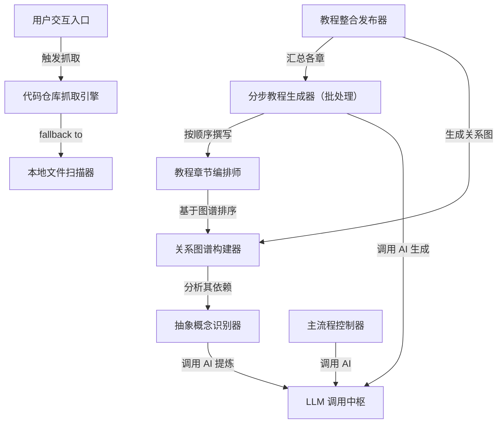

# Tutorial: PocketFlow-Tutorial-Codebase-Knowledge

这是一个**智能代码库知识生成系统**，能自动将任意开源项目（如 GitHub 仓库）转化为**通俗易懂的中文教程**。
它就像一位**耐心的导师**：先扫描代码、提炼核心概念（如“任务调度器”、“数据验证器”），再分析这些概念如何协作，最后按学习顺序生成带类比、代码示例和流程图的完整手册——让新手也能快速掌握复杂项目的整体架构与关键逻辑。

**Source Repository:** [None](None)

## Chapters

1. [用户交互入口
](01_用户交互入口_.md)
2. [主流程控制器
](02_主流程控制器_.md)
3. [代码仓库抓取引擎
](03_代码仓库抓取引擎_.md)
4. [本地文件扫描器
](04_本地文件扫描器_.md)
5. [抽象概念识别器
](05_抽象概念识别器_.md)
6. [LLM 调用中枢
](06_llm_调用中枢_.md)
7. [关系图谱构建器
](07_关系图谱构建器_.md)
8. [教程章节编排师
](08_教程章节编排师_.md)
9. [分步教程生成器（批处理）
](09_分步教程生成器_批处理__.md)
10. [教程整合发布器
](10_教程整合发布器_.md)

---

Generated by [AI Codebase Knowledge Builder](https://github.com/The-Pocket/Tutorial-Codebase-Knowledge)