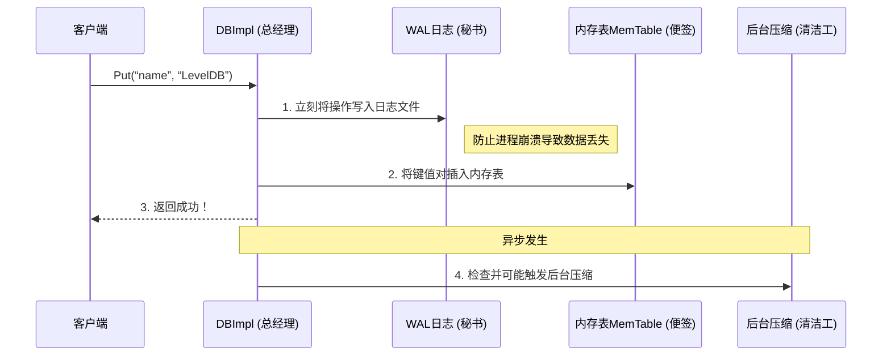

# Chapter 1: 数据库核心引擎（DBImpl）

欢迎来到 LevelDB 教程的第一章！今天我们要认识的是整个 LevelDB 的“大脑”——**数据库核心引擎（DBImpl）**。就像一家餐厅的总经理负责协调厨师、服务员、采购员一样，DBImpl 负责协调 LevelDB 中所有关键的组件，确保你的数据能安全、高效地被存储和读取。

## 我们为什么需要 DBImpl？

让我们从一个最简单的场景开始。假设你是一个开发者，想在应用程序中保存一些用户配置信息。你写下了这样的代码：

```cpp
#include “leveldb/db.h”
// 假设这是一个简单的配置管理器类
class ConfigManager {
private:
    leveldb::DB* db; // 我们将使用 LevelDB 来存储
public:
    // 打开（或创建）数据库
    bool Open(const std::string& path) {
        leveldb::Options options;
        options.create_if_missing = true;
        leveldb::Status status = leveldb::DB::Open(options, path, &db);
        return status.ok(); // 返回打开是否成功
    }
    // 保存一个配置项
    bool SaveConfig(const std::string& key, const std::string& value) {
        leveldb::Status s = db->Put(leveldb::WriteOptions(), key, value);
        return s.ok();
    }
};
```

运行这段代码后，你会发现磁盘上多了一个目录（比如 `/tmp/myconfig`），里面存放着你的数据。你有没有想过，一句简单的 `DB::Open` 和 `db->Put` 背后，到底发生了多少事情？
*   谁来创建这个目录和文件？
*   数据被立刻写到磁盘了吗？
*   如果同时有多个线程在读写怎么办？
*   数据越来越多，性能怎么保证？

解决所有这些问题的，正是 **DBImpl**。它不直接出现在你的代码里，却在幕后为你打理好一切。

## DBImpl 是谁？它在哪？

简单来说，`DB` 是一个对外公开的接口（就像餐厅的“总服务台”），而 **DBImpl 是这个接口的唯一标准实现**（就像站在服务台后的那位“总经理”）。

当你调用 `leveldb::DB::Open(...)` 时，LevelDB 内部实际创建的是一个 `DBImpl` 对象，但返回给你的是一个 `DB*` 指针。这是一种常见的软件设计模式，让你只关心“做什么”，而不用担心“怎么做”。

让我们看看它的“出生证明”（代码片段已大幅简化）：
```cpp
// 文件：db/db_impl.h
class DBImpl : public DB { // DBImpl 公开继承了 DB 接口
 public:
  DBImpl(const Options& options, const std::string& dbname);
  ~DBImpl() override;

  // 实现 DB 接口中定义的所有公共方法
  Status Put(const WriteOptions&, const Slice& key, const Slice& value) override;
  Status Get(const ReadOptions& options, const Slice& key, std::string* value) override;
  Status Write(const WriteOptions& options, WriteBatch* updates) override;
  // ... 以及其他如 Delete, NewIterator 等方法
};
```
**代码解释**：
*   `class DBImpl : public DB`：这行代码表明 `DBImpl` 是 `DB` 的“儿子”，它承诺会实现 `DB` 接口规定的所有功能（如 `Put`, `Get`）。
*   `override` 关键字：这是一个保证，说明这些函数确实是重写了父类 `DB` 的虚函数。如果父类没有这些函数，编译器会报错，防止我们写错函数名。

## DBImpl 的四大核心职责

作为 LevelDB 的总经理，DBImpl 的工作可以概括为四个方面：

1.  **请求调度与协调**：接收并处理所有来自外部的 `Put`、`Get`、`Delete` 请求，确保它们有序、正确地执行。
2.  **组件生命周期管理**：创建并管理其他核心“部门”，如 [内存表（MemTable）与跳表（SkipList）](04_内存表_memtable_与跳表_skiplist__.md)、[预写日志（WAL / Log）](03_预写日志_wal___log__.md)、[版本管理（VersionSet 与 Version）](06_版本管理_versionset_与_version__.md)等。
3.  **后台维护**：像一个永不停息的园丁，在后台线程中自动触发关键的 [压缩机制（Compaction）](07_压缩机制_compaction__.md)，清理过期数据，合并文件，以维持数据库的读取高性能和小体积。
4.  **错误恢复与持久化保证**：在数据库打开时，检查并利用 WAL 日志恢复未持久化的数据；确保即使在程序崩溃时，已确认的写入也不会丢失。

## 深入 DBImpl 内部：一次 `Put` 操作之旅

当我们调用 `db->Put(...)` 时，DBImpl 如何协调各方？让我们通过一个简化的序列图来理解：



**步骤详解**：
1.  **先写日志**：这是保证数据**持久性**的关键。操作会立刻被追加到 [预写日志（WAL / Log）](03_预写日志_wal___log__.md)文件中。即使后续步骤中程序崩溃，重启后也能根据日志恢复数据。
2.  **再写内存**：操作被插入到 [内存表（MemTable）与跳表（SkipList）](04_内存表_memtable_与跳表_skiplist__.md)中。这是一个在内存中的、有序的数据结构，所有读取都会优先查询这里，所以速度极快。
3.  **返回成功**：对于客户端来说，写入在步骤2完成后就“立刻”成功了。
4.  **后台处理**：DBImpl 会持续监控状态。当内存表满了，它会将其冻结并转换成一个不可变的只读内存表，同时创建一个新的内存表接收写入。然后，它会调度 [压缩机制（Compaction）](07_压缩机制_compaction__.md)将旧的内存表内容写入磁盘的 [SSTable（排序表）](05_sstable_排序表_与数据块_.md)文件，并最终由后台线程清理和合并这些文件。

## 看看 DBImpl 的“办公室”（关键成员变量）

总经理的办公室里有各种文件和工具。DBImpl 的内部状态也由一些关键的成员变量维护（代码极度简化）：
```cpp
// 文件: db/db_impl.h (概念性示意)
class DBImpl {
private:
    std::string const dbname_;          // 数据库目录名
    Env* const env_;                    // 环境抽象，用于文件操作等
    port::Mutex mutex_;                 // 互斥锁，保护内部状态并发安全

    MemTable* mem_;                     // 当前活跃的内存表（便签）
    MemTable* imm_ GUARDED_BY(mutex_);  // 不可变的内存表（等待整理的便签）
    std::atomic<bool> background_compaction_scheduled_; // 后台压缩任务标志

    WritableFile* logfile_;             // 当前的日志文件描述符
    log::Writer* log_;                  // 日志写入器（秘书）
    VersionSet* versions_ GUARDED_BY(mutex_); // 版本管理器（档案管理员）
};
```
**变量解释**：
*   `mem_` 和 `imm_`：这是 LevelDB 写入性能高的关键。写入只进入 `mem_`。当 `mem_` 满了，`imm_` 指向它并将其置为只读，然后新建一个 `mem_` 继续服务。后台线程则负责将 `imm_` 的内容安全地写入磁盘。
*   `mutex_`：保证多线程同时访问 DBImpl 内部状态时的安全。
*   `VersionSet* versions_`：这是数据库的“档案库”，记录了当前所有有效的 [SSTable（排序表）](05_sstable_排序表_与数据块_.md)文件及其层级关系，是读取和压缩的权威依据。

## 总结

在本章中，我们认识了 LevelDB 的核心枢纽——**DBImpl**。
*   它是所有公共 API（`Put`, `Get`, `Open`）的内部实现者。
*   它像一位总经理，**协调**日志、内存表、后台压缩等多个关键组件。
*   它保证了写入的**持久性**（先写日志）和**高性能**（先写内存）。
*   它通过管理内存表的切换和调度后台压缩，默默维持着数据库的长期健康。

理解 DBImpl 的协调者角色，是打通 LevelDB 任督二脉的第一步。它自己并不直接存储数据，而是让专业的组件去做专业的事。

在下一章，我们将了解 DBImpl 处理写入时的一个重要帮手：[WriteBatch（批量写入）](02_writebatch_批量写入__.md)。你将看到如何将多个操作打包，一次性交给这位“总经理”去高效处理。

---

Generated by [AI Codebase Knowledge Builder](https://github.com/The-Pocket/Tutorial-Codebase-Knowledge)