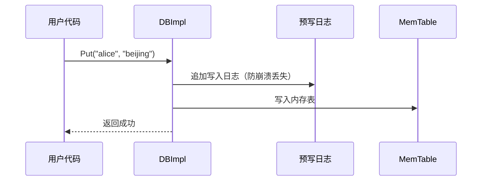
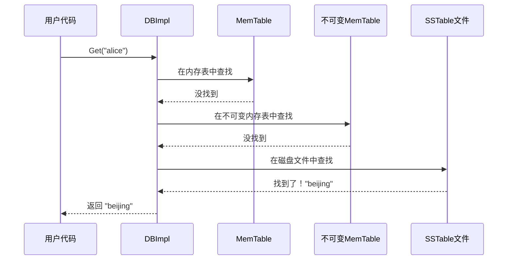
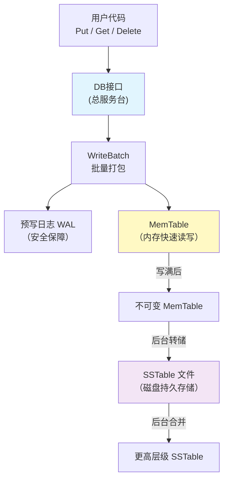
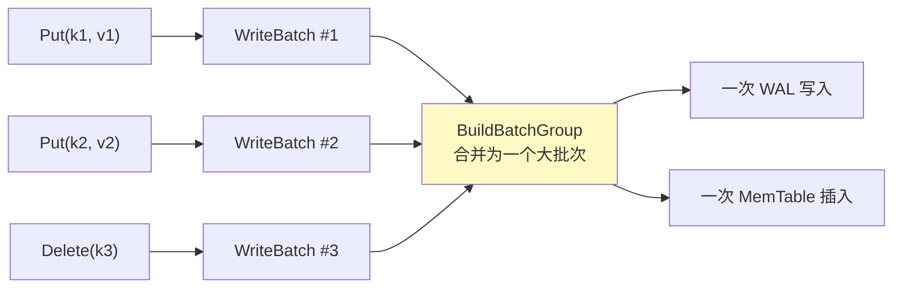
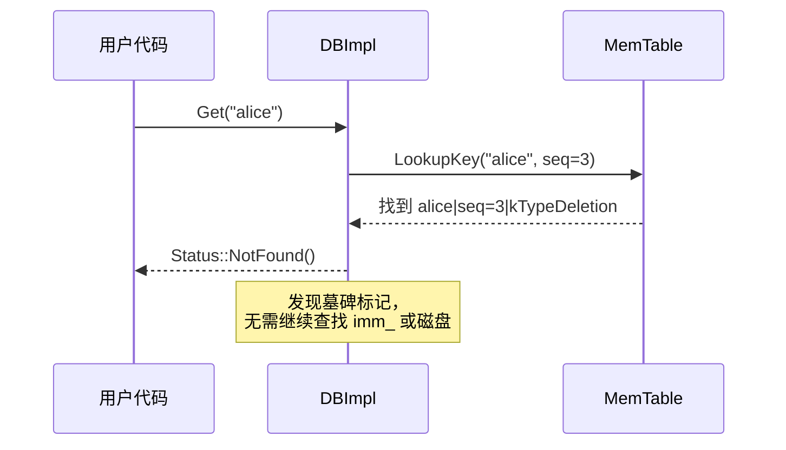

# Chapter 1: 数据库核心读写引擎

## 从一个简单的需求说起

假设你正在开发一个应用，需要保存用户的配置信息。比如，你想把用户名 `"alice"` 对应的城市 `"beijing"` 存起来，之后还能快速查出来。这就是最基本的**键值存储**需求——给一个"键"（key），存一个"值"（value），之后用键去查值。

LevelDB 就是这样一个键值存储引擎。而**数据库核心读写引擎**，就是你和 LevelDB 打交道的"总服务台"。你不需要知道数据具体存在哪里、怎么组织的——你只需要告诉总服务台："帮我存这个"、"帮我查那个"，它会帮你搞定一切。

## 核心职责：三个基本操作

数据库核心读写引擎（对应代码中的 `DB` 接口和 `DBImpl` 实现类）提供三个最基本的操作：

| 操作 | 作用 | 类比 |
|------|------|------|
| `Put(key, value)` | 存入一个键值对 | 在图书馆登记簿上记一条 |
| `Get(key)` | 根据键查找值 | 去服务台查一本书在哪 |
| `Delete(key)` | 删除一个键值对 | 把登记簿上的记录划掉 |

## 怎么使用？一个完整的例子

### 第一步：打开数据库

```c++
#include "leveldb/db.h"

leveldb::DB* db;
leveldb::Options options;
options.create_if_missing = true;
leveldb::Status s = leveldb::DB::Open(
    options, "/tmp/testdb", &db);
```

这就像走进一家图书馆——你告诉 LevelDB 数据库文件放在 `/tmp/testdb` 目录下。`create_if_missing = true` 表示"如果图书馆还不存在，就帮我建一个"。打开成功后，`db` 就是你手中的"服务台通行证"。

### 第二步：写入数据

```c++
// 存入键值对："alice" -> "beijing"
s = db->Put(leveldb::WriteOptions(), "alice", "beijing");
```

一行代码就搞定了！调用 `Put` 就像对服务台说："请帮我记下，alice 在 beijing。"

### 第三步：读取数据

```c++
std::string value;
s = db->Get(leveldb::ReadOptions(), "alice", &value);
// 此时 value == "beijing"
```

用 `Get` 读取数据，传入键 `"alice"`，LevelDB 会把对应的值放到 `value` 中。就像你问服务台："alice 在哪个城市？"服务台回答："beijing。"

### 第四步：删除数据

```c++
s = db->Delete(leveldb::WriteOptions(), "alice");
```

调用 `Delete` 会删除这条记录。之后再 `Get("alice")` 就会返回"找不到"的状态。

### 第五步：关闭数据库

```c++
delete db;
```

用完之后，直接删除 `db` 指针即可关闭数据库，就像离开图书馆。

## 关于 Status：操作结果的反馈

你注意到每个操作都返回一个 `Status` 对象。它告诉你操作是否成功：

```c++
if (!s.ok()) {
  std::cerr << s.ToString() << std::endl;
}
```

这就像服务台的回执——"操作成功"或者"出了什么问题"。养成检查 `Status` 的习惯是好的编程实践。

## 内部实现：数据到底是怎么流动的？

现在我们来看看"总服务台"背后到底发生了什么。LevelDB 的核心设计可以用一句话概括：**先写内存，再落磁盘**。

### 写入流程概览

当你调用 `Put("alice", "beijing")` 时，内部经历了这些步骤：



关键点：
1. 数据**先写日志**（[预写日志（WAL）](03_预写日志_wal.md)），确保即使断电也不丢数据
2. 然后**写入内存**（[MemTable内存表与跳表](04_memtable内存表与跳表.md)），速度非常快
3. 返回成功——此时并不会立刻写磁盘文件！

### 读取流程概览

当你调用 `Get("alice")` 时，LevelDB 会按照从快到慢的顺序依次查找：



这种"先内存，后磁盘"的分层查找策略就像：先翻桌上刚记的便条纸，再翻抽屉里的笔记本，最后才去翻书架上的档案。越新的数据越先被找到。

## 深入代码：写入路径

让我们看看 `DBImpl::Put` 的实际代码。它其实非常简单：

```c++
// db/db_impl.cc
Status DBImpl::Put(const WriteOptions& o,
                   const Slice& key, const Slice& val) {
  return DB::Put(o, key, val);
}
```

它只是调用了基类 `DB::Put`。基类的实现是把单次 `Put` 包装成一个 [WriteBatch原子批量写入](02_writebatch原子批量写入.md)：

```c++
// db/db_impl.cc
Status DB::Put(const WriteOptions& opt,
               const Slice& key, const Slice& value) {
  WriteBatch batch;
  batch.Put(key, value);
  return Write(opt, &batch);
}
```

这意味着**所有写操作最终都通过 `Write()` 方法执行**。这是一个非常巧妙的设计——无论你是单条写入还是批量写入，都走同一条路径。

### Write() 的核心逻辑

`Write()` 是写入的核心。它做了三件大事：

**1. 排队等候**

```c++
Writer w(&mutex_);
w.batch = updates;
w.sync = options.sync;
writers_.push_back(&w);
while (!w.done && &w != writers_.front()) {
  w.cv.Wait();  // 不是队首，就等着
}
```

多个线程可能同时写入，LevelDB 用一个队列来排队。只有排在队首的写入者才能执行写入，其他人等着。

**2. 确保有空间**

```c++
Status status = MakeRoomForWrite(updates == nullptr);
```

这一步检查内存表是否还有空间。如果满了，就把当前内存表变成"不可变"（imm_），创建一个新的内存表，并触发后台把旧数据写入磁盘。

**3. 写日志 + 写内存**

```c++
// 写入预写日志
status = log_->AddRecord(
    WriteBatchInternal::Contents(write_batch));
// 写入内存表
if (status.ok()) {
  status = WriteBatchInternal::InsertInto(
      write_batch, mem_);
}
```

先把数据追加到[预写日志（WAL）](03_预写日志_wal.md)，再插入到[MemTable内存表与跳表](04_memtable内存表与跳表.md)。日志是为了安全，内存表是为了速度。

### 写入者分组优化

LevelDB 有一个巧妙的优化：当多个写入者在排队时，队首会把大家的写入**合并成一批**一起执行：

```c++
WriteBatch* write_batch = BuildBatchGroup(&last_writer);
```

这就像邮递员不会一封信跑一趟，而是攒一批信一起送。这个分组机制大大提升了并发写入的吞吐量。

## 深入代码：读取路径

`Get()` 的实现体现了 LevelDB 的分层查找策略：

```c++
// db/db_impl.cc - DBImpl::Get() 核心逻辑
LookupKey lkey(key, snapshot);
if (mem->Get(lkey, value, &s)) {
  // 在当前内存表中找到了
} else if (imm != nullptr && imm->Get(lkey, value, &s)) {
  // 在不可变内存表中找到了
} else {
  s = current->Get(options, lkey, value, &stats);
  // 在磁盘SSTable文件中查找
}
```

三步查找，逐层递进：
1. **mem_**：当前正在写入的内存表，数据最新
2. **imm_**：正在被转储到磁盘的内存表
3. **current（Version）**：磁盘上的 [SSTable排序表文件格式](05_sstable排序表文件格式.md)，按层级组织

一旦在某一层找到了，就立刻返回，不再往下找。这保证了最新写入的数据总是被优先读取。

## 后台调度：自动整理数据

LevelDB 的总服务台不只是被动地等你来读写，它还有一个"后勤团队"在后台默默工作：

```c++
void DBImpl::MaybeScheduleCompaction() {
  // ...
  if (imm_ == nullptr &&
      manual_compaction_ == nullptr &&
      !versions_->NeedsCompaction()) {
    return;  // 没活干，收工
  }
  background_compaction_scheduled_ = true;
  env_->Schedule(&DBImpl::BGWork, this);
}
```

当内存表写满或者磁盘文件太多时，后台线程会自动启动[合并压缩（Compaction）](07_合并压缩_compaction.md)，把数据从内存整理到磁盘、把小文件合并成大文件。你完全不需要关心这些，总服务台会自动安排。

## 全景架构图

让我们用一张图把所有部件串起来：



数据的流动方向是：**用户 → 内存 → 磁盘**，写入是从左到右，读取则是从右到左逐层查找。

## 设计决策分析

在了解了读写引擎的整体架构之后，你可能会问：为什么 LevelDB 要这样设计？这些选择背后有什么深层考量？让我们逐一分析几个关键的设计决策。

### 为什么所有写操作都走 WriteBatch？

回顾一下写入路径，即使是单条 `Put("alice", "beijing")`，也会先包装成一个 `WriteBatch`，再调用 `Write()`。这看起来多此一举——直接写 MemTable 不是更简单吗？

让我们比较两种方案：

| 方案 | 优点 | 缺点 |
|------|------|------|
| 直接写 MemTable | 单条写入少一层包装 | 需要维护两套代码路径（单条 / 批量），原子性需要额外实现 |
| 统一走 WriteBatch | 代码路径统一，天然支持原子语义 | 单条 Put 有轻微的包装开销 |

LevelDB 选择了后者，理由有三：

**第一，代码路径统一。** 所有写入——不管是一条 `Put`、一条 `Delete`，还是包含 100 条操作的批量写入——都走同一个 `Write()` 函数。这意味着只需要在一个地方处理 WAL 写入、MemTable 插入、并发控制。代码更简洁，bug 更少。

**第二，原子语义"白送"。** 因为 `WriteBatch` 本身就是一个原子单元（要么全部写入成功，要么全部失败），所以单条 `Put` 自动获得了事务性保证。如果用直接写入的方案，要支持批量原子操作就得额外开发。

**第三，为分组优化铺路。** 还记得 `BuildBatchGroup` 吗？队首写入者可以把队列中多个 `WriteBatch` 合并成一个大批次，一次性写入 WAL。如果单条 `Put` 走了不同的代码路径，这个优化就无法统一实施。



所以，那一点点包装开销，换来的是代码简洁、天然原子性和批量优化能力——这是一笔非常划算的交易。

### 为什么用 leader-follower 写入模型？

多个线程同时写入时，LevelDB 没有让每个线程各自抢锁写入，而是采用了一种**队列排队、队首代劳**的模型。让我们比较三种并发写入方案：

| 方案 | 描述 | 问题 |
|------|------|------|
| 每线程加锁 | 每个线程抢全局锁，独立写 WAL 和 MemTable | WAL 写入无法合并，I/O 开销大 |
| 单写入线程 | 所有请求发送到专用写入线程 | 多了一次线程间通信开销，延迟增加 |
| leader-follower | 排队，队首合并大家的数据一起写 | 实现稍复杂，但性能最优 |

LevelDB 选择了 leader-follower 模型。它的工作方式是：

1. 所有写入者加入 `writers_` 队列
2. 队首成为 **leader**，其他人成为 **follower** 并等待
3. leader 把队列中所有人的 `WriteBatch` 合并成一个大批次
4. leader 执行一次 WAL 写入 + 一次 MemTable 插入
5. leader 通知所有 follower："你们的活我都干完了"

这个模型的核心优势在于**摊销 I/O 成本**。假设有 10 个线程同时写入，每个写 1KB 数据。用"每线程加锁"方案，需要 10 次 WAL 磁盘写入；而用 leader-follower 方案，只需要 1 次 10KB 的 WAL 写入。磁盘 I/O 的开销主要在"次数"而不是"大小"，所以合并后性能提升非常显著。

这种思想在传统数据库中叫做 **group commit**（组提交），是一种经过长期验证的高性能技术。

### 为什么读取时用快照（snapshot）而不是直接读最新？

你可能注意到，`Get()` 在构造查找键时传入了一个 `snapshot` 序列号：

```c++
LookupKey lkey(key, snapshot);
```

为什么不直接读 MemTable 中最新的数据呢？因为 LevelDB 需要支持**一致性读取**。

想象这样一个场景：

```
时间线：
t1: 线程A 开始 Get("alice")，此时 alice="beijing" (seq=5)
t2: 线程B 执行 Put("alice", "shanghai") (seq=6)
t3: 线程A 在磁盘上查找...
```

如果没有快照机制，线程A可能在 MemTable 中看到 `seq=5` 的旧值，但在磁盘上看到被 `seq=6` 覆盖后的效果，导致数据不一致。

有了快照，线程A的 `LookupKey` 锁定在 `seq=5`，它只会看到序列号 ≤ 5 的数据，完全不受线程B写入的影响。这就是**时间点一致性读取**（point-in-time consistent read）。

每个 `Get` 操作在开始时会获取当前最新的序列号作为隐式快照：

```c++
// Get() 内部
SequenceNumber snapshot;
if (options.snapshot != nullptr) {
  snapshot = /* 用户指定的快照 */;
} else {
  snapshot = versions_->LastSequence();  // 使用当前最新序列号
}
```

这意味着即使不显式创建快照，每次 `Get` 也都能看到一个一致的数据视图——就像给数据库拍了一张快照照片，查找在这张照片上进行，不会被其他并发写入干扰。

## 核心数据结构：DBImpl

到目前为止，我们一直在说"总服务台"，现在让我们看看这个总服务台的内部到底长什么样。`DBImpl` 是 `DB` 接口的具体实现类，它持有数据库运行所需的所有关键状态：

```c++
// db/db_impl.h — DBImpl 的关键成员
class DBImpl : public DB {
  Env* const env_;           // 操作系统抽象层
  const Options options_;    // 数据库配置
  const std::string dbname_; // 数据库目录路径

  port::Mutex mutex_;        // 全局互斥锁
  MemTable* mem_;            // 当前活跃内存表
  MemTable* imm_;            // 不可变内存表（等待刷盘）
  log::Writer* log_;         // 预写日志写入器

  VersionSet* const versions_; // 版本管理器
  std::deque<Writer*> writers_; // 写入者队列
};
```

让我们逐一认识这些成员，看看它们在读写路径中各自扮演什么角色：

| 成员 | 类型 | 在写入路径中的角色 | 在读取路径中的角色 |
|------|------|---------|---------|
| `env_` | `Env*` | 创建日志文件、调度后台线程 | 读取 SSTable 文件 |
| `options_` | `Options` | 控制写入缓冲区大小等参数 | 控制缓存、过滤器等配置 |
| `mutex_` | `Mutex` | 保护 `writers_` 队列和内存表切换 | 保护快照获取和引用计数 |
| `mem_` | `MemTable*` | 新数据写入的目标 | 读取时第一个查找的地方 |
| `imm_` | `MemTable*` | `mem_` 写满后变成 `imm_`，等待刷盘 | 读取时第二个查找的地方 |
| `log_` | `log::Writer*` | WAL 日志写入器，保证持久性 | 读取时不涉及 |
| `versions_` | `VersionSet*` | 管理文件元信息，决定 Compaction | 提供当前 `Version` 用于磁盘查找 |
| `writers_` | `deque<Writer*>` | 写入者排队，支持 leader-follower 模型 | 读取时不涉及 |

现在你可以把前面学到的所有概念和这些字段对应起来了：

- 写入时，数据流经 `writers_` → `log_` → `mem_`
- 读取时，数据查找经过 `mem_` → `imm_` → `versions_`（磁盘文件）
- 后台整理由 `env_` 调度，整理结果由 `versions_` 记录

`mutex_` 就像总服务台的大门锁——关键操作（如切换 `mem_` 和 `imm_`、修改 `writers_` 队列）都需要持有这把锁。但注意，实际的 WAL 写入和 MemTable 插入过程中，锁是被**临时释放**的，这样读取操作就不会被写入阻塞。

## 端到端示例

让我们用一个完整的具体例子，追踪数据从写入到读取的全过程。假设我们依次执行以下操作：

```c++
db->Put(WriteOptions(), "alice", "beijing");    // 操作1
db->Put(WriteOptions(), "bob", "shanghai");     // 操作2
db->Get(ReadOptions(), "alice", &value);        // 操作3
db->Delete(WriteOptions(), "alice");            // 操作4
db->Get(ReadOptions(), "alice", &value);        // 操作5
```

### 操作1：Put("alice", "beijing")

数据库为这次写入分配序列号 `seq=1`。写入过程如下：

1. 创建 `WriteBatch`，包含 `Put("alice", "beijing")`
2. 写入 WAL 日志：`[seq=1, count=1, kTypeValue, "alice", "beijing"]`
3. 插入 MemTable：键为 `alice | seq=1 | kTypeValue`，值为 `"beijing"`

此时 MemTable 的内容：

```
┌───────────────────────────────────┐
│           MemTable                │
├───────────────────────────────────┤
│  alice | seq=1 | kTypeValue → "beijing" │
└───────────────────────────────────┘
```

### 操作2：Put("bob", "shanghai")

分配 `seq=2`，同样的流程：

```
┌───────────────────────────────────────────┐
│              MemTable                     │
├───────────────────────────────────────────┤
│  alice | seq=1 | kTypeValue → "beijing"   │
│  bob   | seq=2 | kTypeValue → "shanghai"  │
└───────────────────────────────────────────┘
```

### 操作3：Get("alice") → "beijing"

读取流程：
1. 获取当前快照 `snapshot = 2`（最新序列号）
2. 构造 `LookupKey("alice", 2)`——意思是"查找键为 alice、序列号 ≤ 2 的最新记录"
3. 在 MemTable 中查找：找到 `alice | seq=1 | kTypeValue`，类型是 `kTypeValue`
4. 返回值 `"beijing"`，查找结束

### 操作4：Delete("alice")

这是一个关键点——**Delete 在 LevelDB 中并不会真的删除数据**，而是写入一条类型为 `kTypeDeletion` 的特殊记录，也叫"墓碑标记"（tombstone）。

分配 `seq=3`，写入过程和 `Put` 完全一样，只是类型不同：

```c++
// db/db_impl.cc
Status DB::Delete(const WriteOptions& opt, const Slice& key) {
  WriteBatch batch;
  batch.Delete(key);       // 内部标记为 kTypeDeletion
  return Write(opt, &batch);
}
```

此时 MemTable 的内容：

```
┌─────────────────────────────────────────────┐
│                MemTable                      │
├─────────────────────────────────────────────┤
│  alice | seq=3 | kTypeDeletion → ""          │  ← 墓碑标记（最新）
│  alice | seq=1 | kTypeValue   → "beijing"    │
│  bob   | seq=2 | kTypeValue   → "shanghai"   │
└─────────────────────────────────────────────┘
```

注意 MemTable 中的键是按 `(user_key 升序, seq 降序)` 排列的，所以 `alice | seq=3` 排在 `alice | seq=1` 前面。

### 操作5：Get("alice") → NotFound

读取流程：
1. 获取当前快照 `snapshot = 3`
2. 构造 `LookupKey("alice", 3)`
3. 在 MemTable 中查找：找到 `alice | seq=3 | kTypeDeletion`
4. 类型是 `kTypeDeletion`——说明这个键已经被删除了
5. 返回 `Status::NotFound()`



这个例子揭示了 LevelDB 的一个核心设计原则：**删除即写入**。数据不是被"擦除"的，而是被新的墓碑标记"覆盖"的。真正的物理删除发生在后台 [合并压缩（Compaction）](07_合并压缩_compaction.md) 过程中，那时才会把墓碑标记和被删除的旧数据一起清理掉。

这种设计的好处是：删除操作和写入操作一样快（都是追加写入），不需要在数据结构中定位并移除旧记录。

## 总结

在本章中，我们学习了 LevelDB 的核心读写引擎——它就像一个图书馆的总服务台：

- **对外提供** `Put`、`Get`、`Delete` 三个基本操作
- **写入时**：先记日志保安全，再写内存求速度
- **读取时**：按"内存表 → 不可变内存表 → 磁盘文件"的顺序逐层查找
- **后台自动**调度整理工作，用户无需关心

理解了这个"总服务台"的工作方式，你就掌握了 LevelDB 数据流动的全貌。接下来，我们将深入了解写入操作中至关重要的打包机制——[WriteBatch原子批量写入](02_writebatch原子批量写入.md)，看看 LevelDB 是如何保证多个操作要么全部成功、要么全部失败的。

