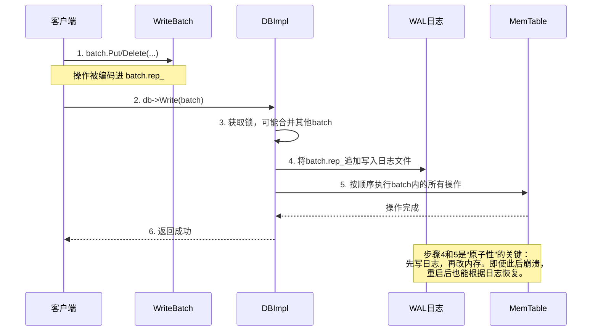

# Chapter 2: WriteBatch（批量写入）

在 [第一章：数据库核心引擎（DBImpl）](01_数据库核心引擎_dbimpl__.md) 中，我们认识了 LevelDB 的“总经理”——`DBImpl`。它负责调度所有的读写请求。现在，让我们从一个最常见的需求出发，来理解 `WriteBatch`（批量写入）。

想象一下，你正在开发一个博客系统。当用户发布一篇新文章时，你需要同时更新好几个地方：文章内容、作者的最新文章列表、文章总数统计……如果这些更新一个一个地执行，会有什么问题呢？

```cpp
// 一个一个地更新（伪代码）
db->Put(“article:1001”, “{title: ‘Hello’, content: ‘…’}”); // 更新文章内容
db->Put(“user:alice:latest_article”, “1001”); // 更新用户的最新文章
// 假设在更新文章总数前，程序崩溃了...
int count = GetTotalCount(); // 从数据库读出当前总数
db->Put(“global:article_count”, std::to_string(count + 1)); // 更新总数
```

**问题来了**：如果程序在更新文章总数前崩溃了，那么文章内容和用户信息已经更新，但总数没变。数据库就处于一个**不一致的状态**：数据对不上了。这就像你寄出三封信通知朋友聚会，结果只成功寄出两封，有的朋友知道，有的不知道，聚会就乱套了。

`WriteBatch` 就是为了解决这个问题而生的！它允许你将多个 `Put`（写入）和 `Delete`（删除）操作**打包**在一起，形成一个“原子操作”。这个“原子”的意思是：**要么打包内的所有操作全部成功，数据库变得一致；要么全部失败，数据库保持原样。绝不会出现一部分成功、一部分失败的中间状态。**

## 核心概念：什么是 WriteBatch？

你可以把 `WriteBatch` 想象成一个**待办事项清单**或者一个**快递打包箱**：
1.  **事务打包器**：你可以把多条“写入”或“删除”指令放进这个箱子。
2.  **原子性保证**：当你最终决定“寄出”这个箱子时，LevelDB 会确保箱子里的所有指令被一次性、完整地处理。
3.  **性能加速器**：一次性处理一个“大箱子”，比一个个处理“小包裹”要高效得多。

### 1. 如何使用 WriteBatch？解决我们的博客案例

让我们用 `WriteBatch` 重写上面有问题的博客发布逻辑：

```cpp
#include “leveldb/write_batch.h”
// ... 其他代码 ...

void PublishArticle(leveldb::DB* db, const std::string& article_id, const std::string& content) {
    leveldb::WriteBatch batch; // 1. 创建一个空的“打包箱”

    // 2. 把多个操作放入“打包箱”
    batch.Put(“article:” + article_id, content);
    batch.Put(“user:alice:latest_article”, article_id);

    // 注意：我们直接在批处理中处理计数更新，逻辑更清晰
    std::string old_count_str;
    leveldb::Status s = db->Get(leveldb::ReadOptions(), “global:article_count”, &old_count_str);
    int new_count = (s.ok() ? std::stoi(old_count_str) : 0) + 1;
    batch.Put(“global:article_count”, std::to_string(new_count));

    // 3. 一次性执行整个批处理（“寄出快递箱”）
    leveldb::Status write_status = db->Write(leveldb::WriteOptions(), &batch);

    if (write_status.ok()) {
        std::cout << “发布成功，所有更新已原子提交！” << std::endl;
    } else {
        std::cout << “发布失败，所有更新已回滚。” << std::endl;
    }
}
```

**代码解释**：
1.  `leveldb::WriteBatch batch;`：创建一个新的、空的 `WriteBatch` 对象，这就是我们的“打包箱”。
2.  `batch.Put(...)`：调用 `WriteBatch` 的 `Put` 方法，将操作加入到箱子中。它**不会立刻写入数据库**，只是记在清单上。
3.  `db->Write(..., &batch)`：这是最关键的一步！将整个 `WriteBatch` 交给 `DBImpl` 去执行。`DBImpl` 会确保这个箱子里的所有操作被原子地应用到数据库。

现在，无论程序在 `db->Write` 之前还是之后崩溃，都不会出现“文章发布了但计数没变”这种不一致的状态了。

### 2. 内部探秘：WriteBatch 里装了什么？

`WriteBatch` 内部使用一个叫 `rep_` 的字符串来紧凑地编码所有操作。它的格式就像一个简单的二进制电报：

```cpp
// 文件: db/write_batch.cc (头部注释)
// WriteBatch::rep_ 的格式:
//    sequence: fixed64    (8字节: 起始序列号)
//    count:    fixed32    (4字节: 操作数量)
//    data:     record[count] (操作记录列表)
// 操作记录 (record) 格式:
//    kTypeValue <变长字符串key> <变长字符串value>   |   // 代表一个Put操作
//    kTypeDeletion <变长字符串key>                 // 代表一个Delete操作
```

让我们写一小段代码来模拟这个结构：

```cpp
// 假设的、极度简化的内部表示
std::string rep_;
// 假设我们执行了: batch.Put(“key1”, “val1”); batch.Delete(“key2”);
// rep_ 内部可能看起来像这样（用文本示意二进制）:
// [12字节头][类型标记‘P’][key1长度][key1数据][val1长度][val1数据][类型标记‘D’][key2长度][key2数据]
```

这种紧凑的二进制格式使得 `WriteBatch` 本身非常轻量，在内存中传递和存储效率很高。

## 深入内部：WriteBatch 是如何被执行的？

当我们调用 `db->Write(&batch)` 时，幕后发生了一场精妙的协作。让我们跟随一个 `WriteBatch` 的旅程，看看它是如何被原子地持久化的。



**步骤详解**：
1.  **构建**：你通过 `batch.Put` 或 `batch.Delete` 添加操作。这些操作被编码进 `batch.rep_` 这个私有字符串中。
2.  **提交**：你调用 `db->Write(&batch)` 提交这个批次。
3.  **调度与合并（Group Commit）**：`DBImpl` 可能同时收到多个线程发来的 `WriteBatch`。为了极致性能，它会将这些小批次在内部**合并**成一个更大的批次（这被称为“组提交”），然后一次性处理。这大幅减少了磁盘 I/O 次数，提升了吞吐量。
4.  **写日志（关键！）**：合并后的大批次，其 `rep_` 内容会被**完整地、一次性地**追加到 [预写日志（WAL / Log）](03_预写日志_wal___log__.md) 文件中。这是持久化和崩溃恢复的保障。即使后面步骤失败，只要日志写成功了，重启后就能重放这些操作。
5.  **应用变更**：紧接着，`WriteBatch` 内的操作会按顺序被应用到 [内存表（MemTable）与跳表（SkipList）](04_内存表_memtable_与跳表_skiplist__.md) 中。这才是数据真正“生效”的地方。
6.  **返回成功**：只有当日志和内存表都更新成功后，`db->Write` 才会向你返回成功。至此，整个批量写入的原子操作才真正完成。

### 看看核心代码（简化版）

`WriteBatch` 的执行逻辑核心在 `WriteBatchInternal::InsertInto` 函数中。它负责将批次里的操作“播放”给 `MemTable`。

```cpp
// 文件: db/write_batch.cc (简化)
Status WriteBatchInternal::InsertInto(const WriteBatch* batch, MemTable* memtable) {
    // 创建一个“处理器”，它会将遇到的操作转发给memtable
    class MemTableInserter : public WriteBatch::Handler {
        MemTable* memtable_;
    public:
        explicit MemTableInserter(MemTable* memtable) : memtable_(memtable) {}
        // 当遇到Put操作时，调用memtable的Add方法
        void Put(const Slice& key, const Slice& value) override {
            memtable_->Add(/*序列号*/ , kTypeValue, key, value);
        }
        // 当遇到Delete操作时，也调用memtable的Add，但类型是删除
        void Delete(const Slice& key) override {
            memtable_->Add(/*序列号*/ , kTypeDeletion, key, Slice());
        }
    } inserter(memtable);

    // 关键调用：遍历batch.rep_，触发相应的Put/Delete回调
    return batch->Iterate(&inserter);
}
```

**代码解释**：
*   这段代码定义了一个 `MemTableInserter` 类，它继承了 `WriteBatch::Handler` 接口。
*   `batch->Iterate(&inserter)` 是神奇的一步：`WriteBatch` 会解析自己 `rep_` 中编码的二进制数据。每解析出一个 `Put` 操作，就调用 `inserter.Put(key, value)`；每解析出一个 `Delete`，就调用 `inserter.Delete(key)`。
*   而 `MemTableInserter` 的 `Put` 和 `Delete` 方法，则负责将这些调用转发给真正的 `MemTable` 对象。这就是“批处理”被逐一应用到内存表的过程。

## 总结与前瞻

恭喜你！你已经掌握了 LevelDB 中保证数据一致性的关键工具——**WriteBatch**。
*   **它是什么**：一个将多个 `Put`/`Delete` 操作打包的原子事务单元。
*   **为什么需要它**：防止程序在连续多次写操作中间崩溃导致的数据不一致。
*   **它如何工作**：内部将操作编码为紧凑二进制格式 (`rep_`)，并通过 `db->Write()` 一次性写入日志和应用到内存表。

`WriteBatch` 是 LevelDB 高性能写入的基石之一，其“组提交”机制将多个小操作合并，极大地提升了吞吐量。

在本章中，我们多次提到了一个关键角色：**预写日志（WAL）**。正是它，在数据写入内存表之前，先将操作日志落盘，才赋予了 `WriteBatch` “原子性”和“持久性”的超能力。这个默默无闻的“安全记录官”是如何工作的呢？让我们在 [下一章：预写日志（WAL / Log）](03_预写日志_wal___log__.md) 中一探究竟！

---

Generated by [AI Codebase Knowledge Builder](https://github.com/The-Pocket/Tutorial-Codebase-Knowledge)