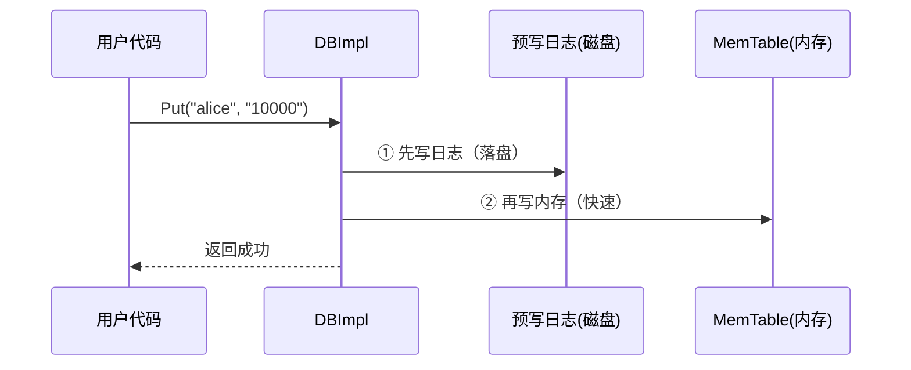
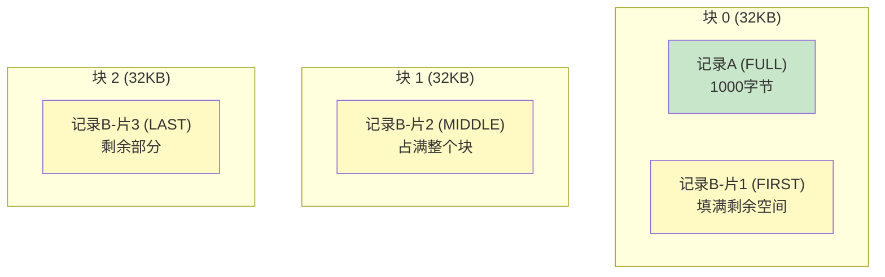
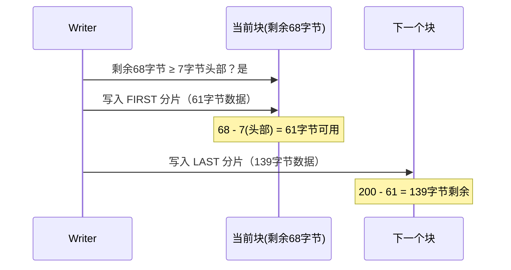
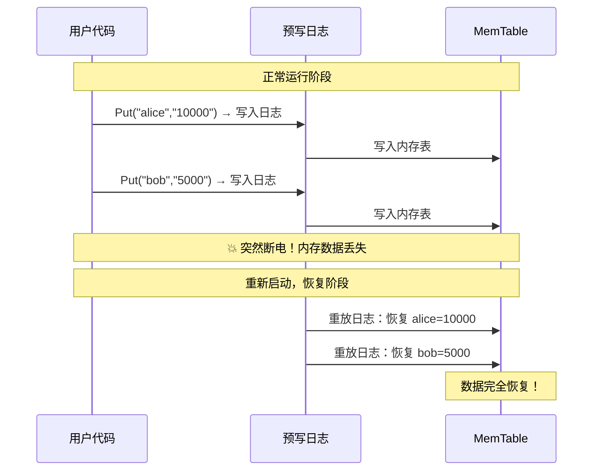

# Chapter 3: 预写日志（WAL）

在[上一章](02_writebatch原子批量写入.md)中，我们了解了 WriteBatch 如何把多个操作打包成一个原子单元。在章节末尾，我们看到 WriteBatch 在真正写入内存表之前，会先被写入一个"日志"中。这个日志就是我们本章的主角——**预写日志（Write-Ahead Log，简称 WAL）**。

## 从一个灾难场景说起

想象一下：你正在用 LevelDB 存储用户的账户余额。你刚刚执行了 `Put("alice", "10000")`，LevelDB 告诉你"写入成功"。但就在这一瞬间——**停电了！**

我们在[数据库核心读写引擎](01_数据库核心读写引擎.md)中学到，`Put` 成功返回时，数据只是写到了**内存**中（MemTable）。内存中的数据，断电就没了！

那 alice 的 10000 元岂不是凭空消失了？

**不会的。** 因为在写入内存之前，LevelDB 已经把这条记录写到了磁盘上的**预写日志**中。重启后，LevelDB 会重放日志，把 alice 的 10000 元恢复回来。

这就是预写日志的核心价值：**先写日志，再写内存，确保断电不丢数据。**

## 预写日志是什么？一句话解释

预写日志就像银行的**交易流水账**。每笔交易在真正入账之前，先在流水账上记一笔。即使银行系统崩溃了，重启后翻看流水账就能知道哪些交易已经发生，从而恢复到正确的状态。

| 概念 | 类比 | 说明 |
|------|------|------|
| WAL 日志文件 | 银行流水账 | 记录每一笔写操作 |
| 写入日志 | 在流水账上记一笔 | 数据持久化到磁盘 |
| 重放日志 | 翻看流水账恢复数据 | 崩溃恢复时使用 |

## 日志在写入流程中的位置

回顾一下[数据库核心读写引擎](01_数据库核心读写引擎.md)中的写入流程，预写日志处于关键位置：



注意顺序：**先日志，后内存**。日志写入磁盘后，即使断电，数据也是安全的。这就是"预写"（Write-Ahead）的含义——在真正生效之前先写日志。

## 怎么使用？从调用者角度看

作为 LevelDB 的使用者，你完全**不需要直接操作 WAL**——它是自动工作的。但了解它的存在有助于理解两个重要选项。

### sync 选项

```c++
leveldb::WriteOptions options;
options.sync = true;  // 每次写入都强制刷盘
db->Put(options, "alice", "10000");
```

`sync = true` 表示每次写入后都要确保日志真正落盘（调用 `fsync`）。这最安全，但稍慢。默认 `sync = false` 时，数据可能还在操作系统缓冲区——极端情况下可能丢失最后几次写入。

### 崩溃恢复：全自动

```c++
// 重新打开数据库时，LevelDB 自动重放日志
leveldb::DB::Open(options, "/tmp/testdb", &db);
// 之前写入的 "alice" -> "10000" 已恢复
```

你不需要做任何事情。`Open` 时 LevelDB 会自动检测是否有未完成的日志，如果有就重放恢复数据。

## 日志的物理格式：32KB 块的世界

现在我们来看看日志文件内部到底是什么样子的。理解格式有助于理解为什么 WAL 能可靠地工作。

### 块（Block）：日志的基本单位

日志文件被分成一个个 **32KB 的块**（Block）：

```
| 块0 (32KB) | 块1 (32KB) | 块2 (32KB) | ... |
```

为什么要用固定大小的块？这就像**笔记本的页**——每页大小固定，写满一页就翻到下一页。如果某一页损坏了，直接跳到下一页就行，不会影响后面的数据。

对应代码中的常量：

```c++
// db/log_format.h
static const int kBlockSize = 32768; // 32KB
```

### 记录（Record）：每条日志的格式

每个块中存放一条或多条**记录**。每条记录的结构是：

```
| 校验和 (4字节) | 长度 (2字节) | 类型 (1字节) | 数据 |
```

- **校验和**（CRC32）：用来检测数据是否损坏，就像快递单上的验证码
- **长度**：数据部分有多少字节
- **类型**：这条记录是完整的还是分片的（下面会解释）

头部一共 7 个字节：

```c++
// db/log_format.h
// 头部 = 校验和(4) + 长度(2) + 类型(1)
static const int kHeaderSize = 4 + 2 + 1;
```

### 四种记录类型

一条用户数据（比如一个 WriteBatch）在日志中叫一条**逻辑记录**。如果它小到能装进一个块的剩余空间里，就用一条 **FULL** 类型的记录存储。

但如果数据太大，一个块装不下怎么办？就像一封长信要分成好几页来写——LevelDB 把大记录**分片**：

```c++
// db/log_format.h
enum RecordType {
  kZeroType = 0,   // 保留
  kFullType = 1,   // 完整记录，一块装得下
  kFirstType = 2,  // 分片的第一部分
  kMiddleType = 3, // 分片的中间部分
  kLastType = 4    // 分片的最后部分
};
```

用一张图来理解分片：



- 记录 A 较小，完整放在块 0 中（FULL 类型）
- 记录 B 很大，被分成三片：FIRST → MIDDLE → LAST

读取时，Reader 会把这三片重新拼接成完整的记录 B。

## 深入代码：Writer 是怎么写入的？

让我们看看 `Writer::AddRecord` 是如何把一条记录写入日志的。

### 核心逻辑：判断是否需要分片

```c++
// db/log_writer.cc - AddRecord 的核心循环
Status Writer::AddRecord(const Slice& slice) {
  const char* ptr = slice.data();
  size_t left = slice.size();
  bool begin = true;
  do {
    const int leftover = kBlockSize - block_offset_;
    if (leftover < kHeaderSize) {
      // 块剩余空间不够放头部，切换到新块
      dest_->Append(Slice("\x00\x00\x00\x00\x00\x00",
                          leftover));
      block_offset_ = 0;
    }
    // ...写入一个分片...
  } while (s.ok() && left > 0);
  return s;
}
```

这段代码做了一个关键检查：当前块剩余空间是否连一个头部（7字节）都放不下？如果放不下，就用零字节填充剩余部分，然后切换到下一个块。

### 确定记录类型

```c++
// db/log_writer.cc - 确定分片类型
const size_t avail = kBlockSize - block_offset_
                     - kHeaderSize;
const size_t fragment_length =
    (left < avail) ? left : avail;

RecordType type;
const bool end = (left == fragment_length);
if (begin && end) {
  type = kFullType;    // 一片就够了
} else if (begin) {
  type = kFirstType;   // 第一片
} else if (end) {
  type = kLastType;    // 最后一片
} else {
  type = kMiddleType;  // 中间片段
}
```

逻辑很清晰：
- 如果是**开头也是结尾**（一片装得下）→ FULL
- 如果只是**开头** → FIRST
- 如果只是**结尾** → LAST
- 如果**两头都不是** → MIDDLE

### 写入物理记录：头部 + 数据

```c++
// db/log_writer.cc
Status Writer::EmitPhysicalRecord(
    RecordType t, const char* ptr, size_t length) {
  // 构造 7 字节头部
  char buf[kHeaderSize];
  buf[4] = static_cast<char>(length & 0xff);
  buf[5] = static_cast<char>(length >> 8);
  buf[6] = static_cast<char>(t);

  // 计算 CRC32 校验和
  uint32_t crc = crc32c::Extend(type_crc_[t],
                                ptr, length);
  crc = crc32c::Mask(crc);
  EncodeFixed32(buf, crc);

  // 写入头部，然后写入数据
  Status s = dest_->Append(Slice(buf, kHeaderSize));
  if (s.ok()) {
    s = dest_->Append(Slice(ptr, length));
    if (s.ok()) {
      s = dest_->Flush();
    }
  }
  block_offset_ += kHeaderSize + length;
  return s;
}
```

这段代码做了三件事：
1. **填充头部**：长度（2字节）+ 类型（1字节）+ CRC 校验和（4字节）
2. **写入头部和数据**：追加到文件
3. **刷新缓冲区**：确保数据到达操作系统

校验和的作用就像快递单上的防伪码——读取时可以验证数据是否在存储过程中损坏了。

### 写入全流程图

让我们用一个具体例子来看完整流程。假设当前块已经用了 32700 字节，我们要写入一条 200 字节的记录：



200 字节的记录被拆成两片：61 字节放在旧块尾部，139 字节放在新块开头。

## 深入代码：Reader 是怎么读取的？

写入是一半，读取是另一半。Reader 负责从日志文件中读取并重组完整记录。

### ReadRecord：核心读取循环

```c++
// db/log_reader.cc - 简化版
bool Reader::ReadRecord(Slice* record,
                        std::string* scratch) {
  scratch->clear();
  bool in_fragmented_record = false;
  Slice fragment;
  while (true) {
    const unsigned int record_type =
        ReadPhysicalRecord(&fragment);
    switch (record_type) {
      case kFullType:
        *record = fragment;
        return true;  // 完整记录，直接返回
      // ... 处理分片 ...
    }
  }
}
```

对于 FULL 类型的记录，直接返回——最简单的情况。

### 处理分片记录

```c++
// db/log_reader.cc - 分片处理
case kFirstType:
  scratch->assign(fragment.data(),
                  fragment.size());
  in_fragmented_record = true;
  break;

case kMiddleType:
  scratch->append(fragment.data(),
                  fragment.size());
  break;

case kLastType:
  scratch->append(fragment.data(),
                  fragment.size());
  *record = Slice(*scratch);
  return true;  // 拼接完成，返回
```

就像拼图一样：
1. **FIRST**：开始新拼图，把第一片放进 `scratch`
2. **MIDDLE**：继续拼，把中间片段追加到 `scratch`
3. **LAST**：最后一片拼上，完整的记录就拼好了！

### 读取物理记录：解析头部

```c++
// db/log_reader.cc - 解析头部
const char* header = buffer_.data();
const uint32_t a = static_cast<uint32_t>(
    header[4]) & 0xff;
const uint32_t b = static_cast<uint32_t>(
    header[5]) & 0xff;
const unsigned int type = header[6];
const uint32_t length = a | (b << 8);
```

从 7 字节头部中提取长度（字节 4-5）和类型（字节 6）。字节 0-3 是校验和，用于验证数据完整性。

### 校验和验证

```c++
// db/log_reader.cc - 验证校验和
if (checksum_) {
  uint32_t expected_crc =
      crc32c::Unmask(DecodeFixed32(header));
  uint32_t actual_crc =
      crc32c::Value(header + 6, 1 + length);
  if (actual_crc != expected_crc) {
    ReportCorruption(drop_size,
                     "checksum mismatch");
    return kBadRecord;
  }
}
```

读取时会重新计算数据的 CRC32，和头部中存储的校验和对比。如果不一致，说明数据损坏了，就报告错误并跳过这条记录。这就是日志的**自我修复**能力——坏数据不会被当成好数据使用。

## 容错机制：损坏了怎么办？

日志设计中一个很巧妙的地方是它的**容错策略**。

由于日志按 32KB 块组织，当检测到损坏时，Reader 可以直接跳到下一个块的边界重新开始读取。这就像一本书某一页被撕了——翻到下一页继续读就行，不会丢失整本书。


这比传统的"扫描整个文件找分界点"要简单可靠得多。

## 日志在崩溃恢复中的角色

让我们把整个流程串起来，看看从写入到崩溃恢复的完整生命周期：



整个恢复过程对用户透明——你只需要重新 `Open` 数据库，LevelDB 会自动完成恢复。

## 日志文件与数据库的关系

在 LevelDB 的[数据库核心读写引擎](01_数据库核心读写引擎.md)中，每当创建一个新的 MemTable 时，都会同时创建一个新的日志文件。当旧的 MemTable 被写入磁盘（变成 [SSTable排序表文件格式](05_sstable排序表文件格式.md)）后，对应的旧日志文件就可以安全删除了——因为数据已经持久化在 SSTable 中，不再需要日志来保护。

```
日志文件1 ←→ MemTable1（当前）
日志文件0 ←→ MemTable0（不可变，正在写入SSTable）
                ↓ 写入完成后
          日志文件0 被删除
```

这保证了日志文件不会无限增长。

## 设计决策分析

了解了 WAL 的实现细节后，让我们深入思考这些设计选择背后的**工程智慧**。

### 为什么用固定 32KB 块，而不是变长记录？

日志文件可以有很多组织方式。为什么 LevelDB 选择了固定大小的块？

| 方案 | 优点 | 缺点 |
|------|------|------|
| 变长记录 | 无空间浪费 | 损坏时无法确定下一条记录的边界 |
| 固定 32KB 块 | 损坏时跳到下一个块边界即可恢复 | 块尾部可能有填充浪费 |

固定块大小的核心价值是**容错恢复**。

想象一下变长记录的情况：每条记录只有一个"长度"字段告诉你它有多长。如果中间某条记录的数据损坏了——特别是长度字段被损坏——你就**完全不知道下一条记录从哪里开始**。后续所有的记录都可能无法解析，整个日志文件从损坏点之后全部作废。

固定 32KB 块则完全不同。即使某个块内的数据损坏了，你可以直接**跳到下一个 32KB 边界**重新开始解析。损坏的影响被限制在单个块内，不会扩散到整个文件。

块尾部的填充浪费看起来是个缺点，但实际上平均每个块浪费不到几十个字节（只有当剩余空间不足 7 字节头部时才会填充），相比 32KB 的块大小，开销微乎其微。

### 为什么 CRC 校验包含类型字节？

注意 `EmitPhysicalRecord` 中 CRC 的计算方式：

```c++
uint32_t crc = crc32c::Extend(type_crc_[t],
                              ptr, length);
```

校验和不仅覆盖数据内容，还覆盖了**类型字节**。这防止了一种微妙但危险的错误。

假设只校验数据内容：如果存储介质上类型字节被损坏（比如 `kFirstType` 变成了 `kFullType`），CRC 校验会通过（因为数据本身没变），但 Reader 会把本应是分片的第一部分当作完整记录来处理。结果是：你得到了一条被截断的数据，而且**没有任何错误提示**。

CRC 包含类型字节后，任何对类型的篡改都会导致校验和不匹配，从而被立即检测出来。这体现了一个防御性编程的原则：**校验和应该覆盖所有影响数据解释方式的元信息**。

### 为什么 Writer 预计算每种类型的 CRC？

在 Writer 的构造函数中，有这样一段初始化代码——为每种 `RecordType` 预计算 CRC 初始值并存储在 `type_crc_[t]` 中。

这样每次写记录时，CRC 计算可以直接从 `type_crc_[t]` 开始 `Extend`，省去了对类型字节的重复计算。

虽然单次节省极小（一个字节的 CRC 计算），但日志写入是**极高频操作**——数据库的每一次写入都要经过这里。在高负载下，每秒可能有数十万次日志写入，这些微小的优化累积起来就很可观了。

这也是 LevelDB 代码风格的一个缩影：在**热路径**（hot path）上，不放过任何优化机会，即使每次只省几个 CPU 周期。

## 总结

在本章中，我们深入了解了预写日志（WAL）——LevelDB 数据安全的守护神：

- **核心作用**：先写日志后写内存，确保断电不丢数据
- **物理格式**：日志由 32KB 的块组成，每条记录包含校验和、长度、类型和数据
- **分片机制**：大记录通过 FIRST/MIDDLE/LAST 类型跨越多个块存储
- **写入（Writer）**：`AddRecord` 自动处理分片，`EmitPhysicalRecord` 写入头部和数据
- **读取（Reader）**：`ReadRecord` 读取并重组分片记录，通过校验和检测数据损坏
- **容错设计**：按块对齐，损坏时可以跳到下一个块边界恢复

日志保障了数据的**持久性**，而数据最终会被写入内存中的高速数据结构中。下一章我们将深入了解这个内存数据结构——[MemTable内存表与跳表](04_memtable内存表与跳表.md)，看看 LevelDB 是如何在内存中高效地组织和查找数据的。

