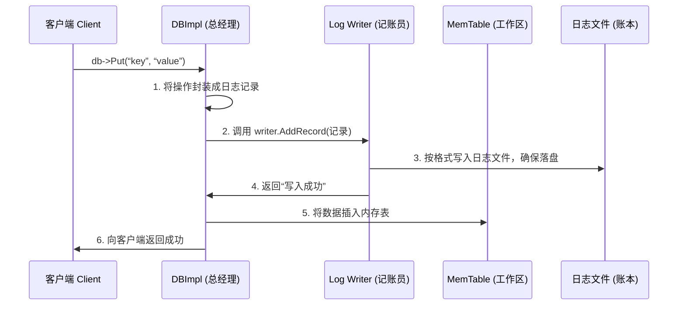

# Chapter 3: 预写日志（WAL / Log）

你好！欢迎来到 LevelDB 教程的第三章。在上一章[WriteBatch（批量写入）](02_writebatch_批量写入__.md)中，我们学习了如何将多个操作打包，让 LevelDB 更高效地处理。现在，我们要接触一个至关重要的安全机制，它就像飞机的**黑匣子**，默默记录着每一次飞行数据，以备不时之需。它就是 **预写日志（Write-Ahead Log, 简称 WAL 或 Log）**。

想象一下这个场景：你正在使用一个笔记应用写一篇非常重要的日记。你连续写了好几段话，按下了“保存”按钮，应用提示“保存成功”。就在这一瞬间，你的电脑突然断电了！当你重启电脑、再次打开应用时，你会期望看到什么？是刚才写的几段话全部消失，还是完整地保留了下来？

对于一个可靠的数据库来说，答案必须是后者——数据必须**持久化**。`预写日志`就是 LevelDB 实现这一承诺的关键保障。

## 为什么需要“黑匣子”？

让我们回到[数据库核心引擎（DBImpl）](01_数据库核心引擎_dbimpl__.md)的工作场景。当我们调用 `db->Put(...)` 写入数据时，数据首先会被放入一个速度快、但断电会丢失的“临时工作区”——[内存表（MemTable）](04_内存表_memtable_与跳表_skiplist__.md)。为了追求写入速度，系统不会立刻把数据写入慢速的磁盘 SSTable 文件。这就带来了风险：如果数据还在内存里，程序崩溃了，数据就丢失了。

为了解决这个问题，LevelDB 采用了一种被称为 **Write-Ahead Logging (WAL)** 的经典策略。其核心思想非常简单，却异常强大：

> **在将数据修改应用到内存中的“工作区”之前，必须先将其描述完整地记录到一份持久化的日志文件中。**

你可以把它想象成会计记账。在真正把钱从保险箱里拿出来花掉（修改内存）之前，会计必须先在**流水账本**（日志文件）上清清楚楚地记下一笔：“某年某月某日，支出XX元，用于...”。这样，即使后来出了什么差错，只要查流水账，就能知道钱应该怎么花、花到了哪里。

在 LevelDB 中，这个“流水账本”就是 WAL 文件（通常命名为 `LOG`）。每次写入请求（包括来自 [WriteBatch](02_writebatch_批量写入__.md) 的批量写入）都会先被转换成一段二进制记录，追加到这个 `LOG` 文件的末尾。**只有确保这条日志记录安全落盘后，数据才会被真正写入内存表（MemTable）**。

当数据库重新打开时，[DBImpl](01_数据库核心引擎_dbimpl__.md) 会检查是否存在 `LOG` 文件。如果存在，它就扮演起“审计员”的角色，**重放（Replay）** 日志文件中的所有记录，将那些还没来得及持久化到 SSTable 的数据重新构建到内存表中，从而完美恢复到崩溃前的状态。

简单来说，**预写日志是 LevelDB 保证 `持久性（Durability）` 的基石**。

## 深入“流水账本”：日志的格式

为了让“流水账”清晰、可校验，LevelDB 设计了一套精巧的日志格式。

首先，整个日志文件被切割成一个个 **32KB 大小的块（Block）**。就像一本账簿由很多页组成，每页大小固定。最后一个块可能是不满的。

```cpp
// 代码取自：db/log_format.h
static const int kBlockSize = 32768; // 32KB 的块大小
```

**为什么是 32KB 的块？**
这是一个经验值，是磁盘 I/O 效率、内存占用和日志记录大小之间的一个良好平衡。以块为单位读写，可以更高效地利用操作系统的 I/O 特性。

每一个块里，包含多条 **记录（Record）**。每一条记录对应一次我们写入的数据（或一个 WriteBatch）。记录的格式定义如下（我们将其比作“账本条目”）：

```cpp
// 这是一个概念性结构，帮助我们理解
struct Record {
    uint32_t checksum; // “防伪码”：校验和，确保记录没被篡改或损坏
    uint16_t length;   // “条目长度”：数据部分的字节数
    uint8_t  type;     // “条目类型”：标识这是完整记录还是分段记录
    uint8_t  data[length]; // “条目内容”：实际要存储的键值对数据
};
```

**记录头的大小是固定的 7 个字节**（4字节校验和 + 2字节长度 + 1字节类型）。

```cpp
// 代码取自：db/log_format.h
static const int kHeaderSize = 4 + 2 + 1; // 记录头大小 = 7 字节
```

数据部分（`data`）就是序列化后的用户数据。校验和则是根据类型（`type`）和数据（`data`）计算出来的 CRC 码，用于在读取时验证数据的完整性，就像一个防伪标签。

### 当一条记录跨块时

你可能会问：如果要写的数据很大，超过了当前块剩余的空间怎么办？比如，当前块只剩 5 个字节，但一条新记录需要 10 个字节，记录头就要占 7 个字节，根本放不下。

LevelDB 的解决办法非常聪明：**将一条大记录拆分成多个片段（Fragment）**。就像把一篇长文章分到几页纸上一样。

它定义了四种记录类型：
*   `kFullType (1)`：这是一个“完整条目”，数据全部放在这一条记录里。
*   `kFirstType (2)`：这是一个“长条目”的第一页。
*   `kMiddleType (3)`：这是“长条目”的中间页。
*   `kLastType (4)`：这是“长条目”的最后一页。

```cpp
// 代码取自：db/log_format.h
enum RecordType {
  kFullType = 1,
  kFirstType = 2,
  kMiddleType = 3,
  kLastType = 4
};
```

而且，为了保证至少能写下记录头，LevelDB 规定 **一条记录不能起始于一个块的最后 6 个字节内**。如果剩余空间小于 7（`kHeaderSize`），就把这些尾部字节全部填充为 0（称为“trailer”），然后新记录从下一个全新的块开始写。

## 谁是记账员和审计员？

在 LevelDB 中，负责写日志和读日志的组件被清晰地分离了。

*   **Writer (记账员)**：它的职责就是将数据按格式写入日志文件。核心方法是 `AddRecord`。
    ```cpp
    // 代码概念取自：db/log_writer.h
    namespace leveldb {
    namespace log {
    class Writer {
     public:
      Status AddRecord(const Slice& slice); // 核心方法：追加一条记录
     private:
      WritableFile* dest_;      // 指向日志文件
      int block_offset_;        // 当前在块内的偏移位置
    };
    } // namespace log
    } // namespace leveldb
    ```
    `Writer` 内部会跟踪当前写到了哪个块的哪个位置 (`block_offset_`)，并负责处理记录的分段和块的切换。

*   **Reader (审计员)**：它的职责就是在数据库恢复时，从日志文件中按顺序读取记录，并验证校验和。核心方法是 `ReadRecord`。
    ```cpp
    // 代码概念取自：db/log_reader.h
    namespace leveldb {
    namespace log {
    class Reader {
     public:
      // 读取下一条记录，成功返回 true，数据存入 `record`，类型存入 `type`
      bool ReadRecord(Slice* record, std::string* scratch);
    };
    } // namespace log
    } // namespace leveldb
    ```
    `Reader` 需要能处理记录分段的情况，将 `kFirstType`, `kMiddleType`, `kLastType` 的片段拼装成一个完整的用户记录。

## 工作流程：一次写入如何被记录？

让我们用一个简单的 `Mermaid` 序列图来看看，当你在代码中调用 `db->Put(“key”, “value”)` 时，预写日志是如何工作的。



**流程详解：**
1.  **客户端** 发起一个 `Put` 请求。
2.  **[DBImpl](01_数据库核心引擎_dbimpl__.md)** 作为协调者，首先准备好要写入的日志记录（包含键值对信息）。
3.  **DBImpl** 调用 **Log Writer** 的 `AddRecord` 方法。
4.  **Log Writer** 尽职地将记录追加到**日志文件**的末尾。关键一步是，它会调用 `sync` 或类似操作，确保数据从操作系统缓存真正写入物理磁盘。**只有这一步成功后，它才向上报告成功。**
5.  收到日志写入成功的确认后，**DBImpl** 才放心地将数据插入到 **MemTable**（内存工作区）。
6.  最后，**DBImpl** 向客户端返回操作成功。

## 核心代码一瞥

让我们看看 `Writer` 如何决定一条记录是否需要分段。这是 `AddRecord` 方法的核心逻辑（极度简化版）：

```cpp
// 简化自 db/log_writer.cc 的 AddRecord 方法
Status Writer::AddRecord(const Slice& slice) {
  const char* ptr = slice.data(); // 待写入数据的起始指针
  size_t left = slice.size();     // 剩余待写入的数据量
  bool begin = true;              // 是否是记录的开始

  do {
    // 计算当前块还剩多少空间
    const int leftover = kBlockSize - block_offset_;

    // 如果剩余空间连记录头（7字节）都放不下...
    if (leftover < kHeaderSize) {
      // ... 就把尾部填充0，然后移动到下一个新块。
      if (leftover > 0) {
        dest_->Append(Slice("\x00\x00\x00\x00\x00\x00", leftover));
      }
      block_offset_ = 0; // 新块，偏移归零
    }

    // 现在，计算这块还能放多少数据
    const size_t avail = kBlockSize - block_offset_ - kHeaderSize;
    const size_t fragment_length = (left < avail) ? left : avail;

    RecordType type;
    if (begin && fragment_length == left) {
      type = kFullType;        // 整条记录刚好能放入当前块
    } else if (begin) {
      type = kFirstType;       // 记录开始，但本块放不完
    } else if (fragment_length == left) {
      type = kLastType;        // 记录剩余部分刚好在本块结束
    } else {
      type = kMiddleType;      // 记录中间部分
    }

    // 调用内部方法，写入记录头和数据片段
    s = EmitPhysicalRecord(type, ptr, fragment_length);
    ptr += fragment_length;
    left -= fragment_length;
    begin = false; // 后续片段都不是“开始”了
  } while (s.ok() && left > 0); // 循环直到所有数据写完

  return s;
}
```

**代码解释：**
这个循环负责处理数据写入。它每次尝试在当前块写入一个**片段**。它首先检查块剩余空间是否足够放下记录头（7字节），如果不够就填充并换块。然后计算这个片段能写多少数据，并根据情况（是否是开始、是否是结束）确定记录类型，最后写入。整个过程会一直持续，直到用户的所有数据（`slice`）都被写入一个或多个日志记录片段。

## 总结与展望

恭喜你！你现在已经理解了 LevelDB 的“安全网”——**预写日志（WAL）**。我们知道了：
1.  **它的角色**：是保证数据持久性的关键机制，像黑匣子一样先于内存操作记录数据。
2.  **它的格式**：日志文件由 32KB 的块组成，块内包含带校验和、长度和类型的记录。
3.  **它的工作流程**：数据必须先成功写入日志文件并落盘，才能进入内存表。
4.  **它的组件**：`Writer` 负责写入，`Reader` 负责恢复时读取。

正是有了这套机制，LevelDB 才能在追求速度的同时，承诺数据的可靠性。下次当你的程序意外崩溃时，你可以对 LevelDB 的数据恢复能力充满信心。

那么，数据安全地写入日志并进入内存表之后，又去了哪里呢？这些在内存中快速读写的数据，最终如何变成磁盘上井然有序的永久文件？这就引出了我们下一个要探索的核心结构——**[内存表（MemTable）与跳表（SkipList）](04_内存表_memtable_与跳表_skiplist__.md)**。它不仅是数据的临时工作区，更是 LevelDB 高性能写入的秘密所在。让我们在下一章揭晓答案！

---

Generated by [AI Codebase Knowledge Builder](https://github.com/The-Pocket/Tutorial-Codebase-Knowledge)