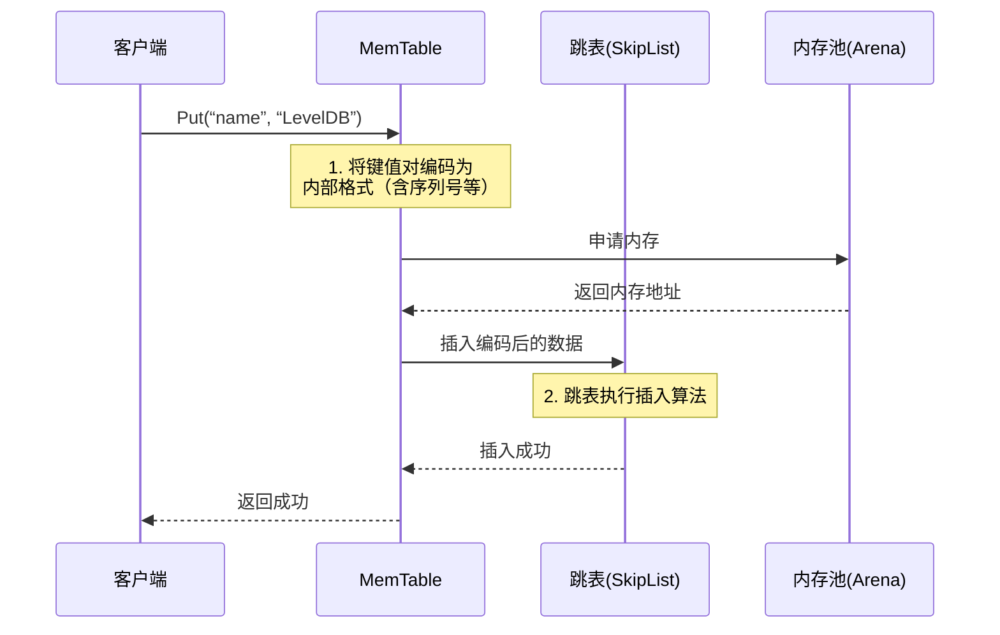

# Chapter 4: 内存表（MemTable）与跳表（SkipList）

在[上一章](03_预写日志_wal___log__.md)中，我们了解了`WriteBatch`和`WAL`如何确保数据在崩溃时不丢失。如果把WAL比作一个安全可靠的**账本**，那么当数据被记入“账本”之后，它实际被存放在哪里，才能让我们快速、方便地查询到呢？

答案就是本章的主角——**内存表（MemTable）**。它就像是你书桌上那个**快速记事本**，所有最新的待办事项、灵感火花都先记录在这里，查阅起来一目了然。而支撑这个“记事本”高效工作的秘密，就在于其内部精巧的**跳表（SkipList）** 数据结构。

## 为什么需要 MemTable？——一个快速查询的案例

假设你正在构建一个简单的键值（KV）缓存服务。用户每秒有成千上万次的`Put`和`Get`操作。

```cpp
#include “leveldb/db.h”

// 模拟一个用户会话管理器
class SessionManager {
    leveldb::DB* db;
public:
    // 用户登录，创建会话
    void UserLogin(const std::string& userId, const SessionData& data) {
        db->Put(leveldb::WriteOptions(), userId, data.Serialize());
    }
    // 检查用户会话是否有效
    bool CheckSession(const std::string& userId, SessionData* outData) {
        std::string value;
        leveldb::Status s = db->Get(leveldb::ReadOptions(), userId, &value);
        if (s.ok()) {
            outData->ParseFromString(value);
            return true;
        }
        return false; // 会话不存在或已过期
    }
};
```

如果每次`Get`请求都需要去缓慢的磁盘文件里查找，用户的登录验证就会变得极其缓慢，体验糟糕。`MemTable`就是为了解决这个**“读最新数据要快”**的核心问题而诞生的。所有新写入的数据，在安全地记录到 WAL 之后，会立刻被放入`MemTable`。后续的`Get`请求会优先在这里查找，因为它完全在内存中，速度极快。

**总结一下 MemTable 的角色：**
1.  **写入缓冲区**：接收并暂时保存所有新写入的数据。
2.  **最新数据索引**：提供对最新数据的毫秒级查询。
3.  **有序存储**：内部数据按键（Key）排序，为后续高效写入磁盘做准备。

## 核心概念一：跳表（SkipList）——多级快速通道

`MemTable`需要支持快速的**插入（Put）**和**查找（Get）**，同时还要保持数据**有序**。数组插入慢，普通链表查找慢，平衡树（如红黑树）实现复杂且并发控制麻烦。

LevelDB 选择了**跳表（SkipList）**。让我们用一个简单的比喻来理解它：

想象一个**只有“上行”扶梯的地铁站**。
*   **第一层（L0）**是地面层，是所有乘客（数据节点）都必须经过的通道。这是一个完整的、有序的链表。
*   **第二层（L1）**是快速通道，只有大约一半的节点在这里有入口，你可以跳过 L0 层的很多节点。
*   **第三层（L2）**是极速通道，节点更少，跳过的距离更远。
*   以此类推...

当你需要查找“王府井站”时，你会：
1.  从最高层（L2）开始，快速向前移动，直到下一个节点比“王府井”大。
2.  下降一层（到L1），继续移动和比较。
3.  再下降到L0层，精确定位到“王府井站”。

这个过程，避免了在L0层（最慢的链表）上一个一个节点的遍历，平均时间复杂度为 O(log n)。

```mermaid
graph TD
    subgraph “跳表示意图（查找 Key=9）”
        Head[头节点] --> |L2| N4[4]
        Head --> |L1| N4
        Head --> |L0| N1[1]
        N4 --> |L2| N12[12]
        N4 --> |L1| N9[9]
        N4 --> |L0| N6[6]
        N1 --> |L0| N4
        N6 --> |L0| N9
        N9 --> |L1| N12
        N9 --> |L0| N12
        N12 --> |L0| Tail[尾节点]

        style Head fill:#f9f,stroke:#333
        style N9 fill:#ccf,stroke:#333
    end
```
*上图中，蓝色节点9的查找路径为：Head(L2)->4(L2)->4(L1)->9(L1)->9(L0)，成功找到。*

## 核心概念二：内存表（MemTable）——跳表的“管理器”

`MemTable`不仅仅是一个跳表。它是一个完整的数据结构封装，主要职责包括：
1.  **提供键值操作接口**：将用户的`Put`，`Get`，`Delete`（在LevelDB中，删除也是一个特殊的写入）操作，翻译成对内部跳表的操作。
2.  **内存管理**：使用[内存池（Arena）](#)来高效分配跳表节点所需的内存，减少内存碎片和分配开销。
3.  **引用计数**：控制自身的生命周期，当它被刷入磁盘变成`Immutable MemTable`后，可能还有读取操作在进行，需要安全地释放内存。

## 内部实现分步走

让我们追踪一次 `Put(“name”, “LevelDB”)` 操作在`MemTable`内部发生的步骤：



**步骤详解：**
1.  **编码**：`MemTable`不会直接存储`”name”`和`”LevelDB”`。它会将用户键（User Key）、值（Value）、操作类型（Put/Delete）以及一个全局递增的**序列号（Sequence Number）** 打包编码成一个字符串。**序列号是实现MVCC（多版本并发控制）和解决覆盖写入的关键**，我们后续章节会详解。
2.  **申请内存**：编码后的数据需要存储在跳表节点中。`MemTable`向它内部的`Arena`内存池申请一块连续内存。
3.  **跳表插入**：跳表生成一个随机高度（层数）的新节点，从高层到底层，找到每层的前驱节点，然后将新节点插入链表中。

## 深入代码：看看它们如何合作

让我们看一些极度简化的代码片段，感受一下`MemTable`和`SkipList`的构造。

**1. MemTable 的构造与核心成员**
```cpp
// 文件: db/memtable.h (简化版)
namespace leveldb {
class MemTable {
 public:
  explicit MemTable(const InternalKeyComparator& comparator);
  void Add(SequenceNumber seq, ValueType type,
           const Slice& key, const Slice& value); // 内部写入方法
  bool Get(const LookupKey& key, std::string* value); // 查找方法

 private:
  typedef SkipList<const char*, KeyComparator> Table; // 核心：跳表
  Arena arena_;           // 内存池，负责分配节点内存
  KeyComparator comparator_; // 键比较器
  Table table_;          // 跳表实例
  int refs_;             // 引用计数
};
}
```
*   `Table` 类型定义：`MemTable`的核心是一个元素类型为`const char*`（指向编码后数据的指针）的跳表。
*   `arena_`：跳表所有节点的内存都从这里分配，`MemTable`析构时，`arena_`会统一释放所有内存，简单高效。
*   `refs_`：用于内存生命周期管理。当`MemTable`被刷盘变成`Immutable`后，可能还有读取操作依赖它，直到引用计数归零才真正删除。

**2. SkipList 节点的核心结构**
```cpp
// 文件: db/skiplist.h (简化版)
template <typename Key, class Comparator>
struct SkipList<Key, Comparator>::Node {
  Key const key; // 存储的数据，在MemTable中就是编码后的字符串指针
  // 柔性数组：一个长度不确定的数组，用于存储“层”
  struct Node* next_[1]; // 这是一个简化表示，实际实现更精妙
};
```
*   `key`：节点存储的数据。在`MemTable`的跳表中，它就是一个指向编码后键值字符串的指针。
*   `next_`：这是一个“柔性数组”的简化表示。每个节点的高度（层数）在创建时随机决定，`next_`数组的实际长度就等于这个高度。`next_[0]`指向第0层的下一个节点，`next_[1]`指向第1层的下一个节点，以此类推。这种设计节省了内存。

**3. 向 MemTable 添加一个键值对**
```cpp
// 文件: db/memtable.cc (简化版)
void MemTable::Add(SequenceNumber seq, ValueType type,
                   const Slice& key, const Slice& value) {
  // 1. 计算编码后需要多少内存
  size_t key_size = key.size();
  size_t val_size = value.size();
  size_t encoded_len = VarintLength(key_size) + key_size +
                       VarintLength(val_size) + val_size;

  // 2. 从 arena_ 内存池分配内存
  char* buf = arena_.Allocate(encoded_len);

  // 3. 将数据编码写入 buf
  char* p = EncodeVarint32(buf, key_size);
  memcpy(p, key.data(), key_size);
  p += key_size;
  // ... 编码 value, seq, type 等

  // 4. 将编码后的数据指针插入跳表
  table_.Insert(buf);
}
```
*   这个`Add`方法会被`DBImpl::Write`调用。
*   关键步骤：**计算长度 -> 分配内存 -> 编码数据 -> 插入跳表**。
*   插入跳表后，数据就**以键的顺序**被组织在内存中了，等待被查询或刷盘。

## 从 MemTable 到 Immutable MemTable

`MemTable`不能无限长大，否则会耗尽内存。LevelDB 设置了一个阈值（如 4MB）。当`MemTable`的大小超过这个阈值时，它会经历一个华丽转身：

1.  **变为只读**：当前的`MemTable`被标记为 **`Immutable MemTable`**（不可变内存表）。它不再接受任何新的写入。
2.  **创建新的**：`DBImpl`立刻创建一个全新的、空的`MemTable`，后续的写入都导向这里。
3.  **后台刷盘**：一个后台线程会悄悄地将这个`Immutable MemTable`中的所有数据，按键的顺序**写入磁盘，形成一个有序的 [SSTable 文件](05_sstable_排序表_与数据块_.md)**。
4.  **内存回收**：刷盘完成后，`Immutable MemTable`的使命结束，其内存（通过`Arena`）被安全释放。

这个过程确保了：
*   **写入不阻塞**：前台写入永远有一个可用的、快速的`MemTable`。
*   **数据持久化**：内存中的数据最终会安全落到磁盘。
*   **读最新数据**：读取时，系统会同时查询当前的`MemTable`和`Immutable MemTable`，确保不错过任何已提交的数据。

## 本章总结

恭喜你！你已经理解了 LevelDB 的“内存心脏”：
*   **MemTable** 是高速的写入缓冲区和最新数据查询入口，解决了“读最新数据要快”的问题。
*   **跳表（SkipList）** 是其内部实现，通过多级索引实现了 O(log n) 时间复杂度的有序插入和查找，且实现简单，易于进行无锁读并发优化。
*   **Arena 内存池** 负责高效、批量地管理跳表节点的内存分配与释放。
*   当`MemTable`写满，它会变成`Immutable`并被后台线程**刷入磁盘，形成有序的 [SSTable](05_sstable_排序表_与数据块_.md)**，这正是我们下一章要探索的核心磁盘数据结构。

从内存到磁盘，数据完成了它的第一次“沉淀”。在[下一章：SSTable（排序表）与数据块](05_sstable_排序表_与数据块_.md)中，我们将揭开 LevelDB 如何在磁盘上高效、紧凑地组织这些有序的数据，并实现快速的区间查找。

---

Generated by [AI Codebase Knowledge Builder](https://github.com/The-Pocket/Tutorial-Codebase-Knowledge)