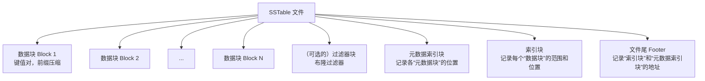
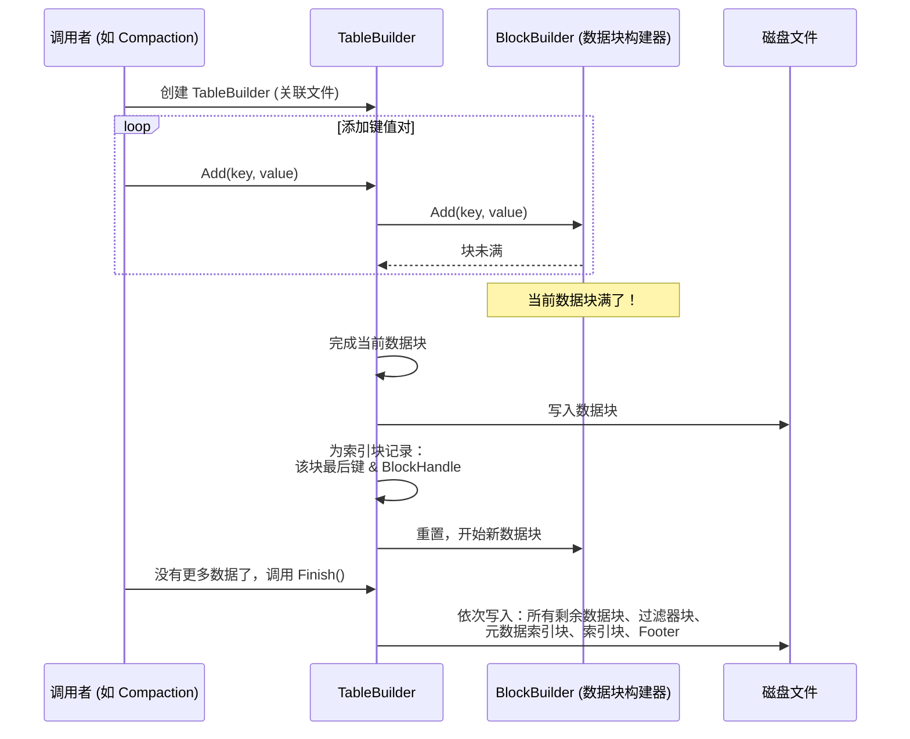
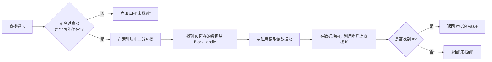

# Chapter 5: SSTable（排序表）与数据块

欢迎回来！在上一章，我们探索了 LevelDB 在内存中的快速暂存区——[内存表（MemTable）与跳表（SkipList）](04_内存表_memtable_与跳表_skiplist__.md)。我们知道了新写入的数据会先到这里。但当这个“内存笔记本”写满了，该怎么办呢？答案就是：把它转换成一个格式精良、持久化的“文件书籍”，存放进“文件柜”（磁盘）。这本章书，就是 **SSTable**。

## 从笔记本到文件柜：为什么需要 SSTable？

让我们回到 `ConfigManager` 的例子。随着你保存的配置越来越多，内存表（MemTable）终会达到预设的大小上限。此时，`DBImpl` 这位“总经理”会执行一个关键操作：
1.  将当前的“内存笔记本”标记为只读（变为 Immutable MemTable）。
2.  开启一个新的空白“笔记本”接收新写入。
3.  将那个写满的旧笔记本，**转换并保存成一个名为 `xxx.sst` 的文件**。

这个 `.sst` 文件就是 **SSTable (Sorted String Table)**。它的核心使命是：
*   **持久化**：将数据安全地写入磁盘，即使断电也不会丢失。
*   **高效读取**：因为数据是**按主键排序后存储**的，所以支持快速的二分查找和范围查询。
*   **不可变性**：一旦生成，文件内容就不再改变。这极大地简化了并发读取的控制，不需要复杂的锁机制。

可以把 SSTable 想象成一本按字母顺序（键的顺序）排好版的字典。想查一个单词（键），你可以根据字母顺序快速翻到大概位置，这比在一堆乱序的纸条里找要快得多！

## SSTable 的组成：像一本精心编排的书

一本字典不仅有单词和解释，还有目录、索引页。SSTable 的设计同样精巧。让我们看看它的文件结构（简化版）：



我们来逐一认识这些部分：

### 1. 数据块（Data Block）：存放数据的主体仓库

数据块是 SSTable 中实际存储键值对（Key-Value Pairs）的地方。一个 SSTable 通常包含多个数据块（例如，每个块 4KB）。为什么分块？因为一次从磁盘读取一整块数据，比分散读取许多小数据更高效。

**块内魔法：前缀压缩**
在一个数据块内部，键是**按序存储**的。LevelDB 利用了一个聪明的技巧来节省空间：**前缀压缩**。

假设我们要存储三个键：
1.  `"user:1001:name"`
2.  `"user:1001:email"`
3.  `"user:1002:name"`

存储时，它们是这样记录的：
*   完整存储 `"user:1001:name"` 及其值。
*   存储第二个键时，发现它和前一个键共享前缀 `"user:1001:"`（共11个字符）。所以只存储**差异部分** `":email"` 和值。
*   存储第三个键时，它和前一个键 `"user:1001:email"` 共享 `"user:1001:"`（共11个字符）。所以存储差异部分 `"2:name"` 和值。

这样，大量重复的前缀被省去了，文件尺寸显著减小。数据块的构建由 `BlockBuilder` 类完成。

--- File: table/block_builder.cc (核心思想注释) ---
// BlockBuilder 构建数据块，其中的键使用前缀压缩。
// 每隔一定数量（如16个）键，就设置一个“重启点”。
// “重启点”处会完整存储该键（不应用前缀压缩）。
// 重启点及其偏移量存储在块末尾，用于块内二分查找。
class BlockBuilder {
 public:
  // 将键值对添加到当前正在构建的块中。
  void Add(const Slice& key, const Slice& value);
  // 完成当前块的构建，返回指向块数据的指针。
  Slice Finish();
};
```

**“重启点”是什么？**
想象一下，如果你一直在做“找不同”游戏（前缀压缩），时间久了可能会忘记最开始完整的图片是什么样子。为了解决这个问题，`BlockBuilder` 每隔 `K` 个键（例如16个），就会完整地存储一个键（不进行压缩），这称为一个“重启点”。块尾部会存储所有重启点的位置。
这样，当我们要在块内查找某个键时，可以先在重启点数组上进行二分查找，定位到某个重启点附近，再线性地“找不同”向后查找，平衡了查找效率和压缩率。

### 2. 索引块（Index Block）：全书的目录

数据块有很多，我们如何快速知道要找的键在哪个数据块里？这就要靠**索引块**。
索引块本身也是一个“块”（也经过前缀压缩），它存储了每个数据块的“索引条目”。每个条目包含：
*   **键（Key）**：该数据块中**最后一个键**。
*   **值（Value）**：一个 `BlockHandle`，它编码了这个数据块在文件中的**起始偏移量（offset）** 和**大小（size）**。

通过索引块，我们可以进行高效的二分查找。比如我们要找键 `"user:1005"`，通过比较，发现它大于索引条目1的键 `“user:1003”` 但小于索引条目2的键 `“user:1008”`，那么我们就知道，`“user:1005”` 很可能在条目2指向的数据块里。

--- File: table/format.h (节选) ---
// BlockHandle 就像一个书签，记录了文件内某一块内容的“页码”（偏移量）和“页数”（大小）。
class BlockHandle {
 public:
  uint64_t offset() const { return offset_; } // 起始位置
  uint64_t size() const { return size_; }     // 块的大小
  void set_offset(uint64_t offset) { offset_ = offset; }
  void set_size(uint64_t size) { size_ = size; }
 private:
  uint64_t offset_;
  uint64_t size_;
};
```

### 3. 过滤器块（Filter Block）：快速查找向导（可选）

假设你要找键 `“user:9999”`，但遍历所有索引后发现它根本不存在。这个“遍历所有索引”的过程仍然是耗时的。
为了加速“键不存在”的判断，LevelDB 可以在 SSTable 中加入一个**布隆过滤器块**。布隆过滤器是一种概率型数据结构，它可以快速告诉你 **“这个键肯定不存在”** 或 **“这个键可能存在”**。
- **“肯定不存在”**：你可以立即返回“未找到”，节省了后续的磁盘读取。
- **“可能存在”**：你仍需去实际的数据块中查找确认。

这就像一个高级向导，能立刻排除掉大部分无用的搜索路径。

### 4. 文件尾（Footer）：整本书的版权页和总目录位置

Footer 固定在 SSTable 文件的最后几个字节。它是读取 SSTable 的**起点**，包含两个最重要的 `BlockHandle`：
1.  指向 **索引块（Index Block）** 的 `BlockHandle`。
2.  指向 **元数据索引块（Metaindex Block）** 的 `BlockHandle`（元数据索引块又指向过滤器块等其他元数据块）。

打开 SSTable 文件时，LevelDB 首先读取文件末尾的 Footer，然后根据它提供的位置信息，加载索引块，从而建立起整个文件的“地图”。

--- File: table/format.h (节选) ---
// Footer 位于每个 SSTable 文件的末尾，是文件的“根目录”。
class Footer {
 public:
  // 编码 Footer 到字符串 dst
  void EncodeTo(std::string* dst) const;
  // 从输入 input 解码 Footer
  Status DecodeFrom(Slice* input);
 private:
  BlockHandle metaindex_handle_; // 指向“元数据索引块”
  BlockHandle index_handle_;     // 指向“索引块”
};
```

## 创建与读取：两个关键角色

理解了结构，我们看看谁来负责创建和读取这本“书”。

### TableBuilder：书的作者

`TableBuilder` 负责将一系列有序的键值对流（通常来自 Immutable MemTable）写入磁盘，构建成一个完整的 SSTable 文件。它的工作流程如下：



--- File: include/leveldb/table_builder.h (节选) ---
class TableBuilder {
 public:
  // 创建一个构建器，将表格内容写入 *file。
  TableBuilder(const Options& options, WritableFile* file);
  // 添加一个键值对。
  void Add(const Slice& key, const Slice& value);
  // 完成 SSTable 的构建，写入所有尾部信息。
  Status Finish();
  // ... 其他方法
};
```

### Table：书的读者

`Table` 类代表一个已打开的 SSTable 文件在内存中的只读视图。它不直接保存数据，而是保存了如何从文件中读取数据的“地图”（索引、过滤器等）。当我们需要从 SSTable 中查找一个键时：



--- File: include/leveldb/table.h (节选) ---
// Table 是一个从字符串到字符串的**不可变的、持久的**排序映射。
// 可以从多个线程安全地访问，无需外部同步。
class Table {
 public:
  // 打开存储在文件[0..file_size)字节中的表。
  static Status Open(const Options& options,
                     RandomAccessFile* file,
                     uint64_t file_size,
                     Table** table);
  // 从表中查找一个键。
  Status Get(const ReadOptions& options,
             const Slice& key,
             void* arg,
             void (*handle_result)(void* arg,
                                   const Slice& k,
                                   const Slice& v));
  // 创建一个遍历表的迭代器。
  Iterator* NewIterator(const ReadOptions& options) const;
};
```

**内部读取者：Block 类**
当 `Table` 类根据索引块定位到一个数据块后，会使用 `Block` 类来解析这个块的内容。`Block` 类封装了数据块的格式，知道如何解析前缀压缩，并能根据重启点创建迭代器，在块内进行高效的查找。

--- File: table/block.h (节选) ---
class Block {
 public:
  // 使用指定内容初始化块。
  explicit Block(const BlockContents& contents);
  // 为该块创建一个迭代器，用于顺序或查找访问。
  Iterator* NewIterator(const Comparator* comparator);
};
```

## 总结与前瞻

恭喜！你现在已经理解了 LevelDB 在磁盘上存储数据的核心格式——**SSTable**。

*   **它是什么？** 一个**不可变的、按键排序**的持久化文件，是 LSM-Tree 架构的基石。
*   **它如何工作？** 数据被切分成多个**数据块（Block）**，块内使用**前缀压缩**节省空间。通过**索引块**快速定位数据块，通过可选的**过滤器块**加速“键不存在”的判断。**文件尾（Footer）** 是读取整个文件的入口。
*   **关键角色：** `TableBuilder` 负责写（构建），`Table` 和 `Block` 负责读（解析）。

随着程序运行，磁盘上会生成越来越多的 SSTable 文件。想象一下，你的“文件柜”里塞满了成百上千本“字典”。虽然每本书内部有序，但书与书之间的键范围可能有重叠。此时，要找一个键可能就得翻很多本书，性能会下降。

这引出了 LevelDB 下一个至关重要的维护机制：**[压缩机制（Compaction）](07_压缩机制_compaction__.md)**。它就像一个图书管理员，定期将多本内容有重叠的小字典，合并整理成几本更大、更整洁的新字典，从而保持高效的读取性能。让我们在下一章一探究竟！

---

Generated by [AI Codebase Knowledge Builder](https://github.com/The-Pocket/Tutorial-Codebase-Knowledge)