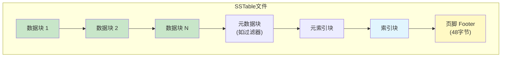
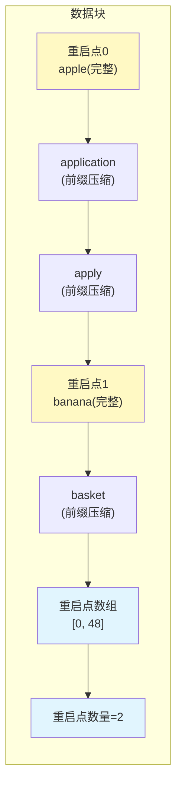
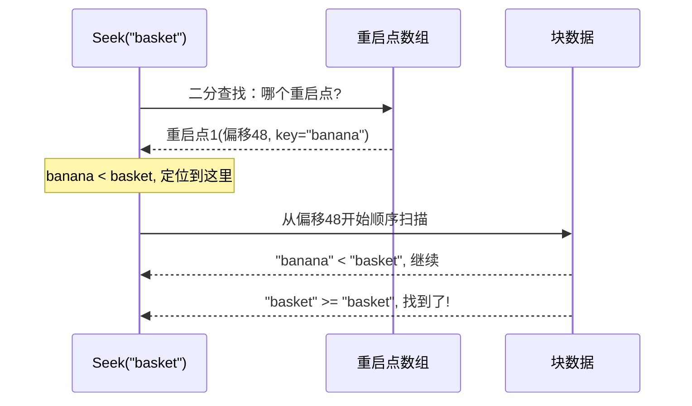
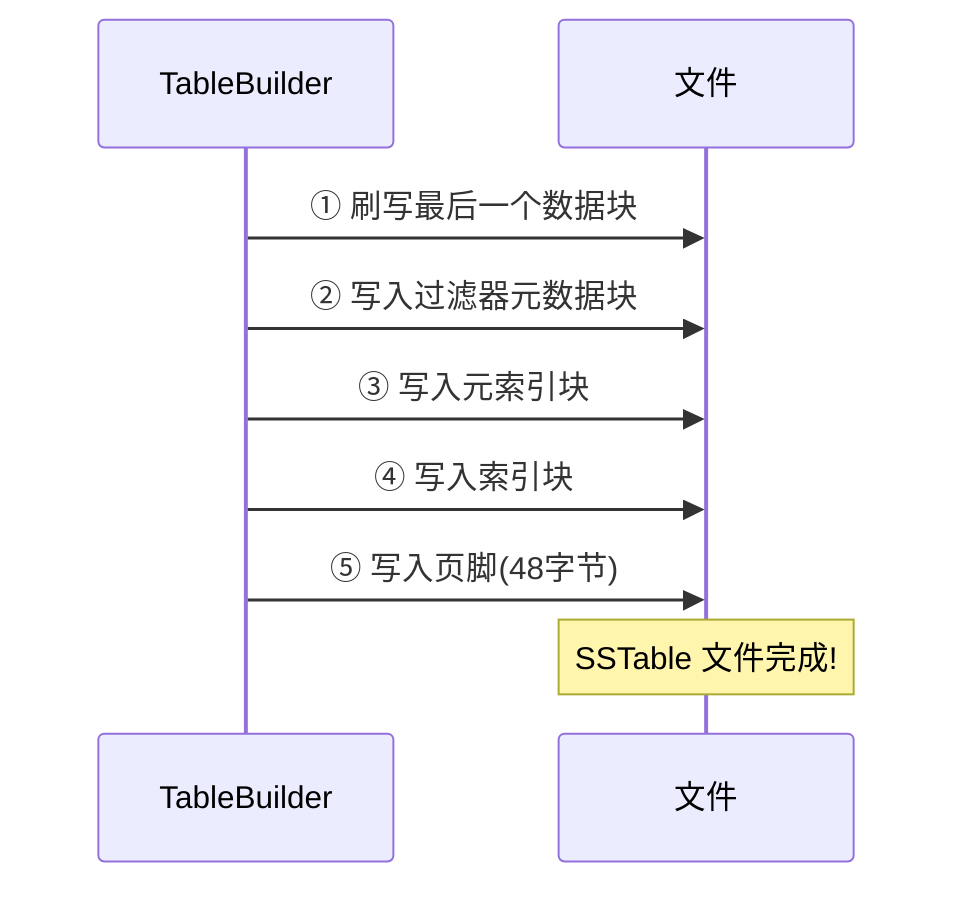
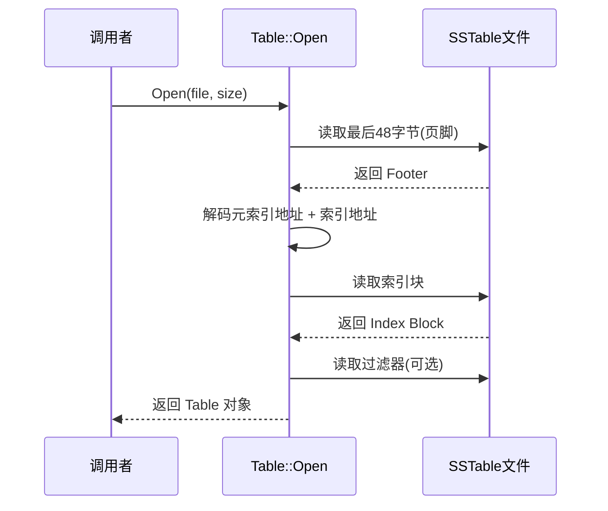
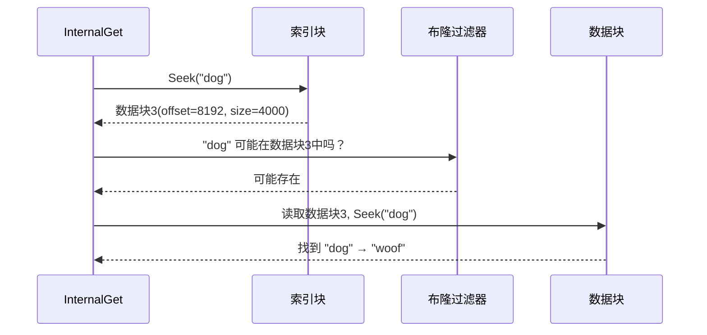
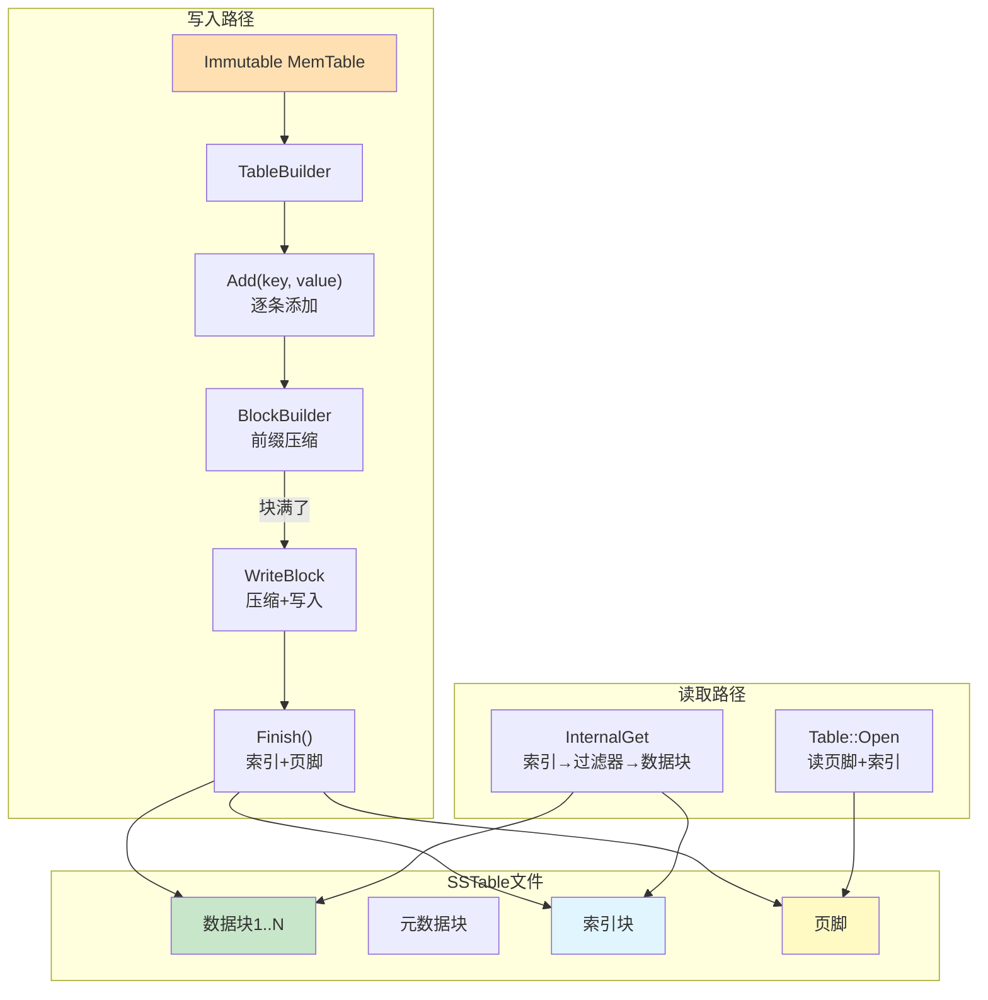

# Chapter 5: SSTable排序表文件格式

在[上一章](04_memtable内存表与跳表.md)中，我们学习了 MemTable——LevelDB 的内存写入缓冲区。当 MemTable 写满后，它会被冻结，然后由后台线程**刷写到磁盘**上，变成一个 SSTable 文件。那么，这个磁盘文件内部到底长什么样？数据是怎么组织的？怎么才能在一个可能几十 MB 的文件中快速找到某个键？本章就来揭开 SSTable 的神秘面纱。

## 从一个实际问题说起

假设你有一本 **500 页的英文词典**，你想查找单词 "python"。你会怎么做？

你当然不会从第 1 页一直翻到第 500 页。你会：
1. 先翻到词典**最后几页的索引**，找到 "P" 开头的单词在第 380 页附近
2. 直接翻到第 380 页，然后在附近几页中找到 "python"

SSTable 的设计思路和这本词典**一模一样**：
- 数据按键的顺序排列（就像词典按字母排序）
- 文件末尾有一个**索引**，记录每一"段"数据的起始位置
- 查找时先查索引，再精确定位到具体数据

这就是 SSTable 要解决的核心问题：**如何在磁盘上高效地存储和查找有序的键值对。**

## SSTable 是什么？一句话解释

SSTable（Sorted String Table，排序字符串表）是 LevelDB 在磁盘上的核心存储格式。它是一个**不可变**的文件——一旦写入就不会修改，只会被整体删除或被[合并压缩（Compaction）](07_合并压缩_compaction.md)合并成新文件。

| 概念 | 类比 | 说明 |
|------|------|------|
| SSTable 文件 | 一本排好序的词典 | 磁盘上有序存储键值对 |
| 数据块（Data Block） | 词典中的一页 | 存放一批键值对 |
| 索引块（Index Block） | 词典末尾的索引 | 快速定位数据块 |
| 页脚（Footer） | 书的封底标识 | 记录索引的位置 |

## SSTable 文件的整体结构

让我们先从宏观上看看一个 SSTable 文件由哪些部分组成：



从上到下一共五类组成部分：

1. **数据块**（Data Block）：存放实际的键值对，按键排序
2. **元数据块**（Meta Block）：存放辅助信息，如[布隆过滤器与过滤策略](09_布隆过滤器与过滤策略.md)
3. **元索引块**（Metaindex Block）：记录每个元数据块的位置
4. **索引块**（Index Block）：记录每个数据块的位置和最大键
5. **页脚**（Footer）：固定 48 字节，记录索引块和元索引块的位置

读取文件时的策略是**从后往前**：先读页脚 → 找到索引块 → 通过索引定位数据块。就像先看书的目录，再翻到具体页。

## 关键概念一：BlockHandle——块的"地址"

在 SSTable 中，需要经常表达"某个块在文件中的位置"。`BlockHandle` 就是一个块的"地址"，包含两个信息：

```c++
// table/format.h — BlockHandle 的核心字段
uint64_t offset_;  // 块在文件中的起始偏移
uint64_t size_;    // 块的大小（字节数）
```

就像你说"索引在第 380 页，占 5 页"——offset 是页码，size 是页数。BlockHandle 用 varint 编码，最多占 20 字节。

## 关键概念二：数据块的内部结构

数据块是 SSTable 的核心——真正存放键值对的地方。每个数据块默认约 4KB 大小。块内部使用了两个巧妙的优化：**前缀压缩**和**重启点**。

### 前缀压缩：省空间的秘诀

想象你要存储这些键：

```
"apple"
"application"
"apply"
"banana"
```

前三个键都以 "appl" 开头。每次都存完整的键太浪费了！前缀压缩的做法是：只存和前一个键**不同的部分**。

```
"apple"        → 共享0字节, 非共享="apple"
"application"  → 共享4字节("appl"), 非共享="ication"
"apply"        → 共享4字节("appl"), 非共享="y"
"banana"       → 共享0字节, 非共享="banana"
```

每条记录的格式是：

```
[共享长度] [非共享长度] [value长度] [非共享的key部分] [value]
```

这样就大大减少了重复前缀的存储开销。

### 重启点：让二分查找成为可能

但前缀压缩有一个问题——要恢复一个键，必须从前面某个完整键开始逐步恢复。如果要查找靠后的键，是不是得从头开始解码？

**重启点**（Restart Point）解决了这个问题。每隔 N 个键（默认16个），强制存储一个**完整的键**（共享长度=0），这就是一个重启点。



块的末尾存放了一个**重启点数组**——记录每个重启点在块内的偏移量。查找时，先在重启点数组上做**二分查找**，快速跳到大致位置，然后在一小段区间内顺序扫描。

这就像一本字典中每个字母开头的页面会标注"A"、"B"、"C"——你不需要从第一页开始找。

## 深入代码：BlockBuilder 怎么构建数据块？

让我们看看 `BlockBuilder::Add` 方法是如何一条一条地添加键值对的。

### 判断是否需要重启点

```c++
// table/block_builder.cc — Add() 前半部分
size_t shared = 0;
if (counter_ < options_->block_restart_interval) {
  // 计算和前一个键的共同前缀长度
  const size_t min_length =
      std::min(last_key_piece.size(), key.size());
  while (shared < min_length
         && last_key_piece[shared] == key[shared]) {
    shared++;
  }
} else {
  // 到了重启间隔，创建新的重启点
  restarts_.push_back(buffer_.size());
  counter_ = 0;  // 重新计数
}
```

`counter_` 记录自上一个重启点以来添加了多少条。当达到 `block_restart_interval`（默认16）时，就创建一个新的重启点，此时 `shared = 0`，意味着存完整的键。

### 写入前缀压缩后的数据

```c++
// table/block_builder.cc — Add() 后半部分
const size_t non_shared = key.size() - shared;
PutVarint32(&buffer_, shared);      // 共享长度
PutVarint32(&buffer_, non_shared);  // 非共享长度
PutVarint32(&buffer_, value.size());// value长度
buffer_.append(key.data() + shared, non_shared);
buffer_.append(value.data(), value.size());
```

三个 varint32 头部 + 非共享的 key 部分 + value 内容。非常紧凑。

### 完成块：写入重启点数组

```c++
// table/block_builder.cc — Finish()
Slice BlockBuilder::Finish() {
  for (size_t i = 0; i < restarts_.size(); i++) {
    PutFixed32(&buffer_, restarts_[i]);
  }
  PutFixed32(&buffer_, restarts_.size());
  finished_ = true;
  return Slice(buffer_);
}
```

块结束时，把所有重启点的偏移量追加到末尾，再追加重启点总数。这些信息让读取时能快速定位重启点。

## 深入代码：数据块中的查找

理解了构建，再来看读取。`Block::Iter::Seek` 展示了如何在块内查找一个键。

### 第一步：在重启点上二分查找

```c++
// table/block.cc — Seek() 的二分查找部分
uint32_t left = 0;
uint32_t right = num_restarts_ - 1;
while (left < right) {
  uint32_t mid = (left + right + 1) / 2;
  // 读取 mid 重启点的键
  uint32_t region_offset = GetRestartPoint(mid);
  // ... 解码键并比较 ...
  if (Compare(mid_key, target) < 0) {
    left = mid;    // 目标在右半边
  } else {
    right = mid - 1; // 目标在左半边
  }
}
```

通过重启点数组做二分查找，找到目标键可能所在的重启点区间。

### 第二步：在区间内顺序扫描

```c++
// table/block.cc — Seek() 的顺序扫描部分
SeekToRestartPoint(left); // 跳到找到的重启点
while (true) {
  if (!ParseNextKey()) return;
  if (Compare(key_, target) >= 0) return;
  // 继续扫描直到找到 >= target 的键
}
```

从重启点开始，逐条解码键值对（恢复前缀压缩），直到找到第一个 ≥ 目标的键。

### 查找过程图解

假设我们在一个块中查找键 "basket"：



二分查找 + 短距离顺序扫描，效率非常高。

## 关键概念三：TableBuilder 构建完整文件

了解了数据块的结构，现在来看 `TableBuilder` 如何把多个块组装成一个完整的 SSTable 文件。

### 添加键值对

```c++
// table/table_builder.cc — Add() 核心逻辑
void TableBuilder::Add(const Slice& key,
                       const Slice& value) {
  // ...省略检查...
  r->data_block.Add(key, value);  // 加入当前数据块
  if (r->data_block.CurrentSizeEstimate()
      >= r->options.block_size) {
    Flush();  // 块满了，刷出去
  }
}
```

每次调用 `Add` 就往当前数据块里塞一条。当块大小达到阈值（默认 4KB），就调用 `Flush` 把这个块写到文件里，然后开始一个新的数据块。

### 刷写一个数据块

```c++
// table/table_builder.cc — Flush()
void TableBuilder::Flush() {
  WriteBlock(&r->data_block, &r->pending_handle);
  if (ok()) {
    r->pending_index_entry = true;
    r->status = r->file->Flush();
  }
}
```

`WriteBlock` 负责把块数据压缩后写入文件。`pending_handle` 记录了这个块的地址（offset + size），留着后面加入索引。

### 压缩：Snappy 或 Zstd

写入块时，可以选择是否压缩。

```c++
// table/table_builder.cc — WriteBlock() 压缩逻辑
case kSnappyCompression: {
  if (port::Snappy_Compress(raw.data(),
      raw.size(), compressed)
      && compressed->size()
         < raw.size() - (raw.size() / 8u)) {
    block_contents = *compressed;
  } else {
    block_contents = raw;    // 压缩效果差，不压缩
    type = kNoCompression;
  }
  break;
}
```

只有当压缩后的大小**至少减少 12.5%** 时才使用压缩，否则直接存原始数据。这避免了对不可压缩数据的无效开销。

### 写入物理块：数据 + 尾部

每个物理块在写入文件时，还会追加一个 5 字节的**尾部**：

```c++
// table/table_builder.cc — WriteRawBlock()
char trailer[kBlockTrailerSize]; // 5字节
trailer[0] = type;  // 压缩类型(1字节)
uint32_t crc = crc32c::Value(
    block_contents.data(), block_contents.size());
crc = crc32c::Extend(crc, trailer, 1);
EncodeFixed32(trailer + 1, crc32c::Mask(crc));
// 写入: [块数据] [类型1字节] [CRC校验4字节]
```

尾部包含压缩类型（未压缩/Snappy/Zstd）和 CRC32 校验和。读取时会验证校验和，确保数据没有损坏。

## 关键概念四：Finish() 收尾工作

当所有键值对都写完后，调用 `Finish()` 完成文件的收尾。这是最关键的步骤——写入索引和页脚。



### 索引块的构建

索引块为每个数据块记录一条索引项。索引项的 key 是什么呢？

```c++
// table/table_builder.cc — 构建索引项
r->options.comparator->FindShortestSeparator(
    &r->last_key, key);
r->index_block.Add(r->last_key,
    Slice(handle_encoding));
```

LevelDB 用了一个巧妙的优化：索引的键不是数据块中的最后一个键，而是一个**介于两个相邻数据块之间的最短分隔键**。比如，如果一个块的最后一个键是 `"the quick brown fox"`，下一个块的第一个键是 `"the who"`，索引键可以用 `"the r"`——它比第一个块的所有键大，比第二个块的所有键小。

这节省了索引空间，同时不影响查找的正确性。

### 页脚的结构

```c++
// table/format.cc — Footer::EncodeTo()
void Footer::EncodeTo(std::string* dst) const {
  metaindex_handle_.EncodeTo(dst);  // 元索引块地址
  index_handle_.EncodeTo(dst);      // 索引块地址
  dst->resize(2 * BlockHandle::kMaxEncodedLength);
  // 写入魔数 0xdb4775248b80fb57
  PutFixed32(dst, static_cast<uint32_t>(
      kTableMagicNumber & 0xffffffffu));
  PutFixed32(dst, static_cast<uint32_t>(
      kTableMagicNumber >> 32));
}
```

页脚固定 48 字节，包含：
- 元索引块的 BlockHandle
- 索引块的 BlockHandle
- 填充零字节（补齐到固定长度）
- 8 字节魔数（用于验证这确实是一个 SSTable 文件）

页脚就像书的封底——通过它可以找到目录（索引块）的位置。

## 深入代码：Table::Open 怎么打开文件？

写入理解了，再来看读取。`Table::Open` 是打开 SSTable 文件的入口。

### 第一步：读取页脚

```c++
// table/table.cc — Open() 读页脚
char footer_space[Footer::kEncodedLength];
Status s = file->Read(
    size - Footer::kEncodedLength,
    Footer::kEncodedLength,
    &footer_input, footer_space);
Footer footer;
s = footer.DecodeFrom(&footer_input);
```

从文件最后 48 字节读取页脚，解码出元索引块和索引块的位置。验证魔数确保文件是有效的 SSTable。

### 第二步：读取索引块

```c++
// table/table.cc — Open() 读索引块
BlockContents index_block_contents;
s = ReadBlock(file, opt,
    footer.index_handle(),
    &index_block_contents);
Block* index_block =
    new Block(index_block_contents);
```

根据页脚中记录的地址，读取并解析索引块。索引块常驻内存，因为每次查找都需要它。

### 第三步（可选）：读取过滤器

```c++
// table/table.cc — ReadMeta()
Iterator* iter = meta->NewIterator(
    BytewiseComparator());
iter->Seek("filter." + filter_policy_name);
if (iter->Valid() && iter->key() == key) {
  ReadFilter(iter->value());
}
```

如果配置了[布隆过滤器与过滤策略](09_布隆过滤器与过滤策略.md)，还会读取过滤器数据，用于快速判断一个键是否可能存在。

### 打开文件完整流程



打开后，Table 对象在内存中持有索引块，随时准备接受查询。

## 深入代码：InternalGet 查找一个键

现在来看最关键的操作——在 SSTable 中查找一个键。

```c++
// table/table.cc — InternalGet() 核心逻辑
Iterator* iiter = rep_->index_block
    ->NewIterator(rep_->options.comparator);
iiter->Seek(k);  // 在索引块中定位
```

第一步：在索引块中查找。索引块本身也是一个 Block，支持二分查找。找到之后，`iiter->value()` 就是目标数据块的 BlockHandle。

### 布隆过滤器快速排除

```c++
// table/table.cc — 过滤器检查
if (filter != nullptr
    && handle.DecodeFrom(&handle_value).ok()
    && !filter->KeyMayMatch(handle.offset(), k)) {
  // 过滤器说不存在，直接跳过！
} else {
  // 需要读取数据块进一步查找
}
```

如果布隆过滤器判断键**一定不存在**，就不需要读取数据块了——省下一次磁盘 IO！

### 读取数据块并查找

```c++
// table/table.cc — 在数据块中查找
Iterator* block_iter = BlockReader(
    this, options, iiter->value());
block_iter->Seek(k);
if (block_iter->Valid()) {
  (*handle_result)(arg,
      block_iter->key(), block_iter->value());
}
```

通过 `BlockReader` 读取数据块（可能从[LRU缓存与TableCache](10_lru缓存与tablecache.md)中获取），然后在数据块内用重启点二分查找定位具体的键值对。

### 完整查找流程

让我们用一个例子串起来。假设要在 SSTable 中查找 key = `"dog"`：



三层查找：索引定位 → 过滤器初筛 → 数据块精确查找。

## 读取数据块：ReadBlock 和解压缩

`ReadBlock` 负责从文件中读取一个块并解压缩。

```c++
// table/format.cc — ReadBlock() 读取部分
size_t n = static_cast<size_t>(handle.size());
char* buf = new char[n + kBlockTrailerSize];
Status s = file->Read(
    handle.offset(), n + kBlockTrailerSize,
    &contents, buf);
```

读取 `块数据 + 5字节尾部`。然后检查 CRC 校验和：

```c++
// table/format.cc — CRC 校验
if (options.verify_checksums) {
  const uint32_t crc =
      crc32c::Unmask(DecodeFixed32(data + n + 1));
  const uint32_t actual =
      crc32c::Value(data, n + 1);
  if (actual != crc) {
    return Status::Corruption(
        "block checksum mismatch");
  }
}
```

校验通过后，根据尾部的压缩类型进行解压缩（如果有压缩的话），最终返回原始数据。

## 全景架构图

让我们用一张图把 SSTable 的构建和读取串起来：



写入是从上到下：MemTable → TableBuilder → 文件。读取是从下到上：页脚 → 索引 → 数据块。

## 设计决策分析

理解 SSTable 的结构之后，让我们退后一步，思考几个关键的设计决策——为什么 LevelDB 要**这样**设计，而不是用更简单的方案？

### 为什么用前缀压缩+重启点，而不是完整存储每个键？

前缀压缩在相邻键共享长前缀时（如 `user:alice:email`, `user:alice:name`, `user:bob:email`）可以节省大量空间。在实际场景中，键通常具有层次化结构，前缀重复率非常高。

但前缀压缩有一个代价：要读取某条记录，必须从最近的一个完整键开始逐步恢复。如果整个块都做前缀压缩，查找最后一条记录就要从头解码整个块。

**重启点**（默认每 16 个键一个）就是压缩率和查找效率的折中：

| 重启间隔 | 压缩率 | 查找效率 |
|----------|--------|----------|
| 每 1 个键（无压缩） | 最差 | 最好（纯二分查找） |
| 每 16 个键（默认） | 较好 | 较好（二分 + 短扫描） |
| 每 256 个键 | 最好 | 较差（二分后长距离扫描） |

默认值 16 意味着：二分查找定位到重启点后，最多再顺序扫描 15 条记录。对于 4KB 的块来说，这只需要扫描几百字节的数据，几乎不影响查找速度。

### 为什么索引键用 FindShortestSeparator 而不是数据块的最后一个键？

索引键只需满足一个条件：**大于等于前一个数据块的所有键，且小于后一个数据块的所有键。** 它不需要是实际存在的键。

用**最短分隔键**可以显著减小索引块的大小。比如前一个数据块的最后一个键是 `"the quick brown fox"`，下一个数据块的第一个键是 `"the who"`，索引键可以用 `"the r"` 而不是完整的 `"the quick brown fox"`——节省了 15 个字节。

索引块越小，就有越大的概率完整驻留在内存或缓存中。对于一个包含上千个数据块的 SSTable 来说，索引键的节省累积起来非常可观。这是一个**用计算换空间**的经典优化——多做一点比较运算，换来更紧凑的索引。

### 为什么从文件尾部开始读取（Footer → Index → Data）？

SSTable 是**一次写入、多次读取**的不可变文件。写入时，数据按照键的顺序流式追加——先写数据块，再写元数据块，最后写索引块和页脚。这是最自然的写法，因为写入时还不知道索引块的最终位置和大小。

读取时反过来：先读固定大小的页脚（48 字节），就能定位到索引块，再通过索引定位到任意数据块。这比在文件头部预留元信息空间更灵活——文件头方案要么需要预估索引大小（可能估错），要么需要写完数据后回头修改文件头（需要额外的 seek 操作）。

尾部方案还有一个好处：页脚是**固定大小**的（48 字节）。读取时只需要 `文件大小 - 48` 就知道页脚的偏移量，不需要任何额外的定位逻辑。

## 总结

在本章中，我们深入了解了 SSTable——LevelDB 在磁盘上的核心存储格式：

- **文件结构**：由数据块、元数据块、索引块和页脚组成，像一本有目录的词典
- **数据块内部**：使用前缀压缩减少空间，通过重启点支持二分查找
- **构建过程**（TableBuilder）：逐条添加键值对，块满了就写入文件，最后写索引和页脚
- **打开过程**（Table::Open）：从文件末尾读页脚，找到索引块，加载到内存
- **查找过程**（InternalGet）：索引定位 → 布隆过滤器初筛 → 数据块精确查找
- **压缩和校验**：支持 Snappy/Zstd 压缩，CRC32 校验和保证数据完整性

SSTable 文件一旦创建就不可修改。但随着数据不断写入，磁盘上会积累越来越多的 SSTable 文件。LevelDB 需要一种机制来追踪这些文件——哪些文件是有效的？哪些可以删除？这就是下一章的主题——[版本管理与MANIFEST](06_版本管理与manifest.md)，看看 LevelDB 是如何管理文件的"版本"的。

