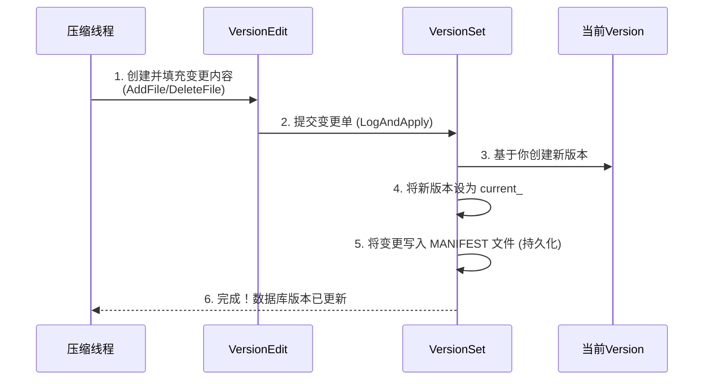

# Chapter 6: 版本管理（VersionSet 与 Version）

在上一章[《SSTable（排序表）与数据块》](05_sstable_排序表_与数据块_.md)中，我们了解了数据是如何最终以有序的 SSTable 文件形式安静地躺在磁盘上的。但故事到这里并没有结束。想象一下，随着数据库不断写入和[压缩](07_压缩机制_compaction__.md)，磁盘上的 SSTable 文件会越来越多，新的文件产生，旧的文件被合并、删除。**LevelDB 是如何知道“当前”的数据库到底由哪些文件组成的？** 更重要的是，当一个读取请求到来时，它如何确保看到的是一个**一致的、不混乱的**数据视图，即使后台压缩线程正在移动文件？

这就引出了我们本章的主角：**版本管理**。你可以把它想象成一个**极其严谨的图书管理员**。

## 从一个图书馆说起

想象一个不断扩建和整理的大型图书馆（你的 LevelDB 数据库）：
*   **书（SSTable文件）**：每一本“书”都是一个 SSTable 文件，里面装着按序排列的键值对。
*   **书架（层级）**：图书馆有很多层（Level 0, Level 1...），每层放着很多书架。新书（刚从[内存表 MemTable](04_内存表_memtable_与跳表_skiplist__.md) 刷出）先堆在入口处（Level 0），比较杂乱。定期会有图书管理员进行“压缩整理”，把一些书归类、合并，然后搬到更高层更有序的书架上。
*   **问题**：图书馆每天都在整理，有书被搬走，有新书上架。一个读者（读取请求）进来想找一本书，他拿到的**藏书清单**必须是一份**某个确定时刻的完整快照**，而不能在他查找的过程中，清单上的书突然被管理员搬走了，这会导致他找不到书或者找到错误的信息。

**版本管理**，就是解决这个问题的系统。它负责生成和管理这些“**藏书清单**”。

## 核心概念拆解

LevelDB 的版本管理主要由三个角色构成，让我们一一认识它们：

### 1. Version：某个时刻的“藏书清单”

`Version` 是版本的核心。它精确地记录了**在某个瞬间**，数据库每一层（Level）分别由哪些 SSTable 文件组成。

```cpp
// 文件: db/version_set.h (概念示意，非完整代码)
class Version {
  // ...
  // 核心数据结构：一个二维列表，存储每层有哪些文件
  // 例如：files_[0] 是 Level 0 的所有文件列表
  //      files_[1] 是 Level 1 的所有文件列表
  std::vector<FileMetaData*> files_[config::kNumLevels];
};
```
**解释**：`Version` 对象就像一张静态的快照照片，定格了数据库在某个时刻的文件布局。只要持有这张“照片”（一个 `Version` 对象的引用），你的读取操作就能基于一个**永远不会改变**的文件集合进行，从而保证一致性。

### 2. VersionEdit：“整理变更记录单”

图书馆每次整理，并不是重写整个清单，而是记录下**变更**：新增了哪些书，移除了哪些书。`VersionEdit` 就是这份“变更记录单”。

```cpp
// 文件: db/version_edit.h (概念示意)
class VersionEdit {
 public:
  void Clear();
  // 记录要新增的文件：文件编号、在哪一层、文件大小、最小/最大键
  void AddFile(int level, uint64_t file_number, /*...其他文件信息...*/);
  // 记录要删除的文件：在哪一层，文件编号是多少
  void DeleteFile(int level, uint64_t file_number);
  // ... 还有其他全局信息的变更，如下一个可用文件编号等
 private:
  std::vector< std::pair<int, FileMetaData> > new_files_;
  std::set< std::pair<int, uint64_t> > deleted_files_;
};
```
**解释**：每次[压缩](07_压缩机制_compaction__.md)完成后，LevelDB 都会生成一个 `VersionEdit` 对象，详细描述这次操作导致了哪些文件变化。它非常轻量，只记录差异。

### 3. VersionSet：“总管理员与清单历史册”

`VersionSet` 是总管。它主要有三个职责：
1.  **管理当前版本**：它持有一个指向**当前** `Version`（即最新“藏书清单”）的指针。
2.  **应用变更，生成新版本**：它接收一个 `VersionEdit`（变更记录单），将其应用到当前的 `Version` 上，从而**创建出一个新的、更新后的 `Version`**，并立即将其设为“当前版本”。
3.  **维护版本历史**：它用一个双向链表保存所有还在被使用的 `Version`（例如，被[快照](db/snapshot.h)或[迭代器](08_迭代器体系_iterator__.md)引用的旧版本），确保它们不会被误删。当没有任何引用时，旧版本才会被安全回收。

```cpp
// 文件: db/version_set.h (概念示意)
class VersionSet {
  // ...
  Version* current_; // 指向当前版本的指针
  // 所有活跃的 Version 通过双向链表连接，便于管理和引用计数
  Version dummy_versions_; // 链表头

  // 核心方法：应用一个 VersionEdit，生成新版本
  Status Apply(VersionEdit* edit);
  Status LogAndApply(VersionEdit* edit, port::Mutex* mu);
};
```

## 它们如何协同工作？——一次压缩的视角

让我们跟随一次压缩操作，看看版本管理是如何运转的。



**流程详解**：
1.  压缩线程挑选好需要合并的文件，执行合并，生成新的 SSTable 文件，并知道哪些旧文件可以删除。
2.  压缩线程创建一个 `VersionEdit` 对象，调用 `AddFile` 记录新生成的文件，调用 `DeleteFile` 记录要删除的文件。
3.  压缩线程调用 `VersionSet::LogAndApply()`，提交这个 `VersionEdit`。
4.  `VersionSet` 内部：
    *   基于 `current_` 指向的旧 `Version`，创建一个新的 `Version` 对象。
    *   将 `VersionEdit` 中的变更（新增/删除文件）应用到新 `Version` 上。
    *   更新 `current_` 指针，使其指向这个全新的 `Version`。**这一刻，数据库的“当前版本”发生了原子性切换**。
    *   将这个 `VersionEdit` 编码后，追加写入到 `MANIFEST` 文件。这是一个日志文件，记录了所有版本变更历史，用于数据库重启时恢复状态。
5.  如果旧 `Version` 还有被引用（比如有活跃的快照），它会被保留在链表中，否则稍后会被删除。

## 关键作用：实现快照（Snapshot）

快照是版本管理能力的直接体现。还记得第一章[《数据库核心引擎（DBImpl）》](01_数据库核心引擎_dbimpl__.md)中提到的快照读取吗？

```cpp
leveldb::ReadOptions options;
options.snapshot = db->GetSnapshot(); // 获取当前时刻的快照
// ... 使用 options 进行读取 ...
db->ReleaseSnapshot(options.snapshot); // 释放快照
```

**内部发生了什么？**
*   `GetSnapshot()` 本质上就是**捕获当前 `VersionSet` 中 `current_` 指针指向的那个 `Version`**，并记录下当前的序列号（Sequence Number）。
*   当你用这个快照去读取时，LevelDB 的读取路径会固定使用这个旧的 `Version` 所记录的文件集合来查找数据。
*   即使之后压缩发生，`current_` 指向了更新的 `Version`，你的快照仍然引用着那个旧的 `Version`，因此它看到的文件世界是静止不变的，从而实现了“时间旅行”般的读取一致性。
*   `ReleaseSnapshot()` 则减少了对那个旧 `Version` 的引用。当引用降为0时，`VersionSet` 就可以安全地回收那个版本的资源了。

## 总结与预告

恭喜你！你现在理解了 LevelDB 这位“图书管理员”的工作方式。**版本管理（VersionSet 与 Version）是 LevelDB 一致性和持久性的基石**。它通过巧妙的 `Version` 快照和增量 `VersionEdit` 机制，在数据库文件动态变化的过程中，为读写操作提供了稳定、一致的视图，并优雅地支持了快照功能。

`VersionSet` 还有另一个重要职责：**决定下一次该压缩哪些文件**。它需要分析当前 `Version` 中每层文件的数量和大小，找出“最需要整理的那块区域”。这直接引出了我们下一个要探讨的核心机制。

在下一章[《压缩机制（Compaction）》](07_压缩机制_compaction__.md)中，我们将深入 LevelDB 的“整理车间”，看看这位图书管理员是如何判断何时整理、以及如何高效执行整理任务的。让我们继续探索！

---

Generated by [AI Codebase Knowledge Builder](https://github.com/The-Pocket/Tutorial-Codebase-Knowledge)