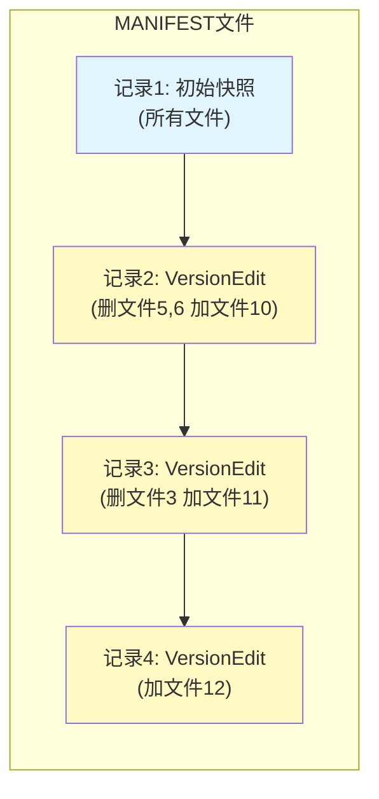
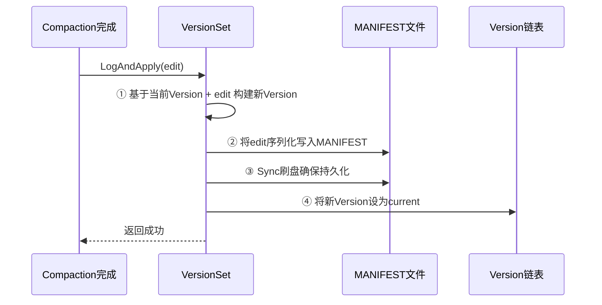
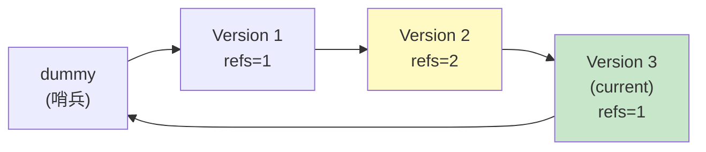
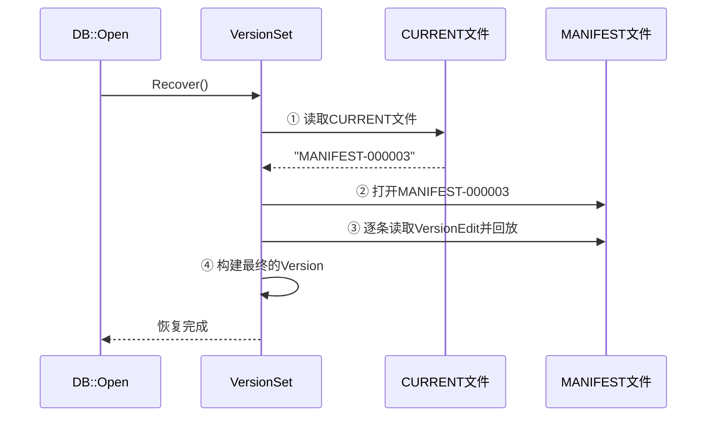
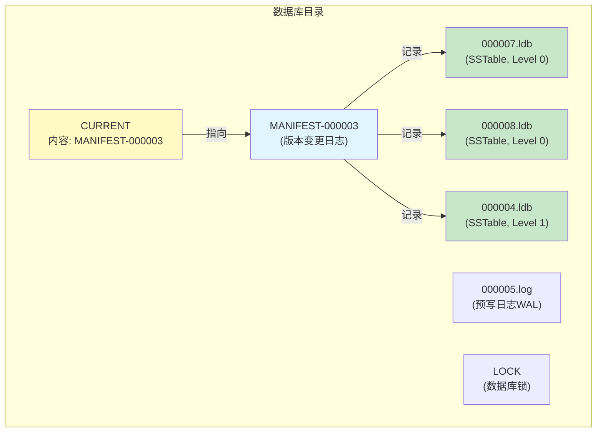
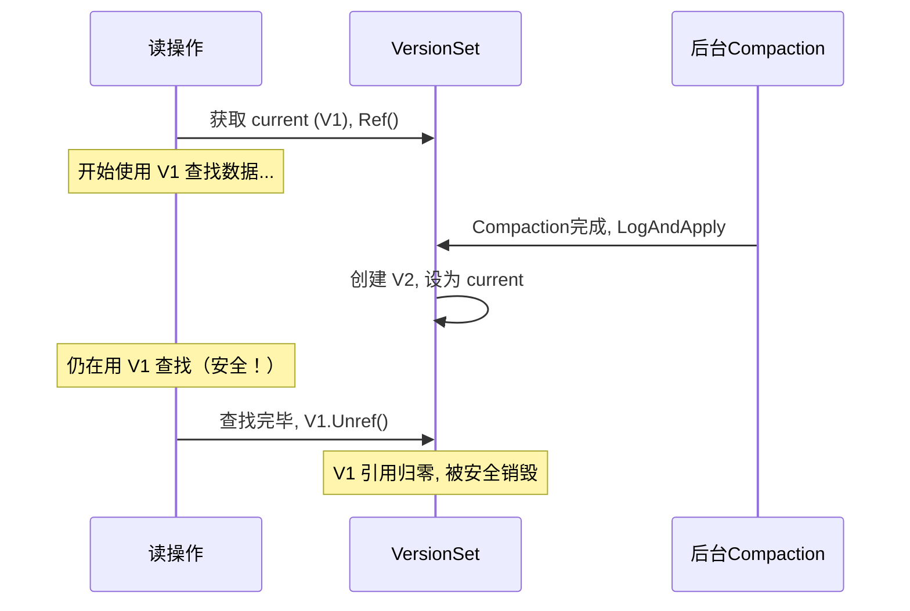
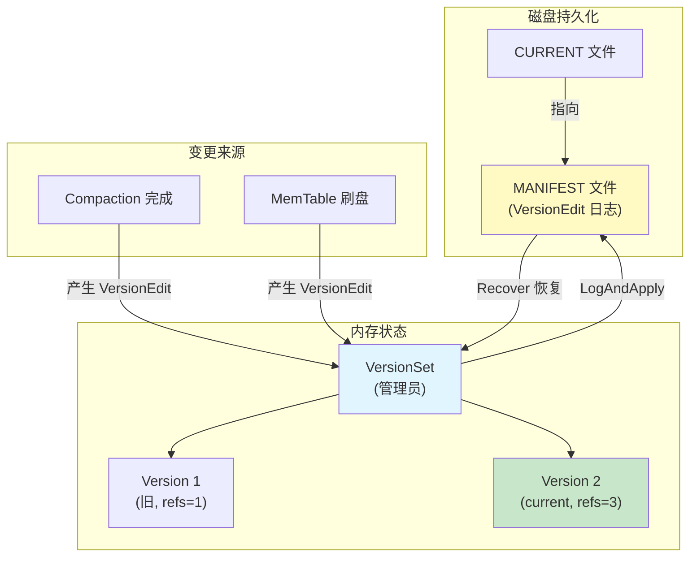

# Chapter 6: 版本管理与MANIFEST

在[上一章](05_sstable排序表文件格式.md)中，我们学习了 SSTable——LevelDB 在磁盘上存储键值对的文件格式。我们知道，随着数据不断写入，磁盘上会积累越来越多的 SSTable 文件。有些是新写入的，有些可能已经被[合并压缩（Compaction）](07_合并压缩_compaction.md)取代了。那么问题来了——LevelDB 怎么知道哪些文件是有效的、哪些可以删除、每个文件在哪一层？

这就是本章要解决的问题：**版本管理与 MANIFEST**。

## 从一个实际问题说起

想象你经营一个**仓库管理系统**。仓库里有很多货架（层级），每个货架上放着很多箱子（SSTable 文件）。每天都有新箱子送来，也有旧箱子被整理合并或清走。

你需要一本**库存登记簿**，精确记录：
- 每个货架上有哪些箱子
- 每个箱子里装的货物范围（最小键到最大键）
- 每个箱子有多大

而且，每次仓库发生变动（新箱子到了、旧箱子清走了），你不需要重写整本登记簿——只需要在登记簿上追加一条**变更记录**："2号货架新增了7号箱子"、"3号货架移走了4号箱子"。

这本登记簿就是 **MANIFEST 文件**，每条变更记录就是 **VersionEdit**，而某一时刻仓库的完整库存快照就是一个 **Version**。

## 三个核心概念

版本管理系统由三个核心组件构成：

| 概念 | 类比 | 说明 |
|------|------|------|
| Version | 某一时刻的库存清单 | 记录当前每一层有哪些 SSTable 文件 |
| VersionEdit | 一条变更记录 | 描述"新增了哪些文件、删除了哪些文件" |
| VersionSet | 仓库管理员 | 管理所有 Version，负责应用变更、写入 MANIFEST |

再加上两个磁盘文件：

| 文件 | 类比 | 说明 |
|------|------|------|
| MANIFEST | 库存变更日志本 | 持久化记录所有 VersionEdit |
| CURRENT | 一张便条 | 指向当前正在使用的 MANIFEST 文件名 |

## 关键概念一：Version——某一时刻的文件快照

一个 **Version** 就是数据库在某个时刻的"完整照片"——它记录了每一层各有哪些 SSTable 文件。

```c++
// db/version_set.h — Version 的核心数据
std::vector<FileMetaData*>
    files_[config::kNumLevels];
// kNumLevels = 7，即 Level 0 ~ Level 6
```

`files_` 是一个数组，每个元素是一个文件列表。`files_[0]` 是 Level 0 的所有文件，`files_[1]` 是 Level 1 的所有文件，以此类推。

每个文件的元信息由 `FileMetaData` 描述：

```c++
// db/version_edit.h
struct FileMetaData {
  int refs;             // 引用计数
  uint64_t number;      // 文件编号（如 000007.ldb）
  uint64_t file_size;   // 文件大小（字节）
  InternalKey smallest; // 文件中最小的键
  InternalKey largest;  // 文件中最大的键
};
```

每个文件有编号、大小、以及它包含的**键范围**（最小键到最大键）。有了键范围，查找某个键时就能快速判断——"这个文件里可能有我要的数据吗？"

### Version 的引用计数

Version 使用引用计数管理生命周期：

```c++
void Version::Ref() { ++refs_; }
void Version::Unref() {
  --refs_;
  if (refs_ == 0) { delete this; }
}
```

为什么需要引用计数？因为多个操作可能同时使用同一个 Version。比如一个读操作正在用旧版本查数据，同时后台 Compaction 已经创建了新版本。旧版本不能立刻删除，要等所有使用者都释放后才能安全销毁。

这就像图书馆的书——有人在看的时候不能下架，等所有借阅者都还了书才能处理。

## 关键概念二：VersionEdit——变更的"差异描述"

每次 Compaction 或 MemTable 刷盘后，文件集合会发生变化。LevelDB 不会重新记录所有文件，而是用一个 **VersionEdit** 来描述"变了什么"。

VersionEdit 的核心操作很简单——只有"增"和"删"两种：

```c++
// db/version_edit.h — 添加一个新文件
edit.AddFile(level, file_number, file_size,
             smallest_key, largest_key);
```

```c++
// db/version_edit.h — 删除一个旧文件
edit.RemoveFile(level, file_number);
```

比如，一次 Compaction 把 Level 0 的文件 5、6 合并成 Level 1 的文件 10，对应的 VersionEdit 就是：

```
删除: Level 0, 文件 5
删除: Level 0, 文件 6
新增: Level 1, 文件 10, 大小=xxx, 键范围=[aaa..zzz]
```

### VersionEdit 的额外信息

除了文件增删，VersionEdit 还记录一些数据库全局状态：

```c++
edit.SetLogNumber(log_num);      // 当前日志文件编号
edit.SetNextFile(next_num);      // 下一个可用文件编号
edit.SetLastSequence(seq);       // 最新序列号
```

这些信息在崩溃恢复时至关重要——它们告诉 LevelDB"恢复到哪个日志、从哪个编号继续分配文件"。

### VersionEdit 的序列化

VersionEdit 需要被写入 MANIFEST 文件，所以它支持序列化：

```c++
// 编码为字节串
std::string record;
edit.EncodeTo(&record);

// 从字节串解码
VersionEdit edit;
edit.DecodeFrom(record);
```

编码格式使用 **tag + value** 的方式，每个字段都有一个标签号：

```c++
// db/version_edit.cc
enum Tag {
  kComparator = 1,    // 比较器名称
  kLogNumber = 2,     // 日志编号
  kNextFileNumber = 3,// 下一文件编号
  kLastSequence = 4,  // 最新序列号
  kDeletedFile = 6,   // 删除的文件
  kNewFile = 7,       // 新增的文件
};
```

这种设计的好处是**向前兼容**——新版本添加了新的 tag，旧版本读到不认识的 tag 可以跳过。

## 关键概念三：MANIFEST 文件——持久化的变更日志

MANIFEST 文件就是把所有 VersionEdit 按顺序持久化到磁盘的日志文件。它的格式和[预写日志（WAL）](03_预写日志_wal.md)完全一样——都使用 32KB 块 + 校验和 + 分片机制。



MANIFEST 的第一条记录通常是一个**完整快照**——记录当前所有文件。后续每条记录都是增量的 VersionEdit。恢复时，先加载快照，再依次回放每条 VersionEdit，就能重建出最新的 Version。

### CURRENT 文件：找到 MANIFEST 的指针

MANIFEST 文件的命名格式是 `MANIFEST-000001`、`MANIFEST-000002` 等。数据库可能有多个 MANIFEST 文件（旧的和新的），怎么知道当前用哪一个？

答案是 **CURRENT 文件**——它就是一个纯文本文件，内容只有一行：

```
MANIFEST-000003
```

告诉 LevelDB："当前的 MANIFEST 是这个文件。"

对应代码：

```c++
// db/filename.cc
std::string CurrentFileName(
    const std::string& dbname) {
  return dbname + "/CURRENT";
}
```

更新 CURRENT 文件时，LevelDB 采用了**先写临时文件再重命名**的安全策略：

```c++
// db/filename.cc — SetCurrentFile() 核心逻辑
std::string tmp = TempFileName(dbname, number);
// 写入临时文件
WriteStringToFileSync(env, manifest_name, tmp);
// 原子重命名
env->RenameFile(tmp, CurrentFileName(dbname));
```

文件重命名在大多数文件系统上是**原子操作**——要么成功，要么失败，不会出现写了一半的情况。这确保了 CURRENT 文件始终指向一个有效的 MANIFEST。

## 核心流程：LogAndApply——版本更新的总入口

当 Compaction 完成或 MemTable 刷盘后，LevelDB 需要把文件变更"落地"。这个过程通过 `VersionSet::LogAndApply` 方法完成，它是版本管理的**核心入口**。

让我们用一个简单的例子来理解整个流程。假设一次 Compaction 完成了，产生了一个 VersionEdit（删文件 5、加文件 10）。



四个步骤，我们逐一展开。

### 步骤一：构建新 Version

```c++
// db/version_set.cc — LogAndApply() 核心
Version* v = new Version(this);
{
  Builder builder(this, current_);
  builder.Apply(edit);  // 应用变更
  builder.SaveTo(v);    // 保存到新Version
}
Finalize(v);  // 计算压缩分数
```

`Builder` 是一个辅助类，它的工作是：
1. **Apply**：记录 edit 中要新增和删除的文件
2. **SaveTo**：把当前 Version 的文件和 edit 的变更**合并**，生成新 Version 的文件列表

这就像在旧的库存清单上应用变更记录，得到一份新的库存清单。

### Builder::Apply 的内部逻辑

```c++
// db/version_set.cc — Builder::Apply()
// 记录要删除的文件
for (auto& kvp : edit->deleted_files_) {
  levels_[kvp.first].deleted_files
      .insert(kvp.second);
}
// 记录要新增的文件
for (auto& kvp : edit->new_files_) {
  FileMetaData* f = new FileMetaData(kvp.second);
  levels_[kvp.first].added_files->insert(f);
}
```

Apply 只是**记录**变更，还没有真正合并。

### Builder::SaveTo 的合并逻辑

```c++
// db/version_set.cc — SaveTo() 简化
for (int level = 0; level < kNumLevels; level++) {
  // 合并：旧文件 + 新增文件 - 删除文件
  // 按 smallest key 排序
  for (auto& f : *added_files) {
    MaybeAddFile(v, level, f);
  }
  for (auto& f : base_files) {
    MaybeAddFile(v, level, f);
  }
}
```

`MaybeAddFile` 会检查文件是否在删除列表中——如果是，就跳过；如果不是，就加入新 Version。

```c++
void MaybeAddFile(Version* v, int level,
                  FileMetaData* f) {
  if (deleted_files.count(f->number) > 0) {
    // 文件已被删除，跳过
  } else {
    f->refs++;
    v->files_[level].push_back(f);
  }
}
```

注意 `f->refs++`——新 Version 引用了这个文件元信息，引用计数加一。这确保文件元信息不会被提前释放。

### 步骤二：写入 MANIFEST

```c++
// db/version_set.cc — 写入MANIFEST（解锁期间执行）
std::string record;
edit->EncodeTo(&record);
s = descriptor_log_->AddRecord(record);
if (s.ok()) {
  s = descriptor_file_->Sync();
}
```

把 VersionEdit 序列化为字节串，通过 `log::Writer` 写入 MANIFEST 文件，然后 `Sync()` 确保数据真正落盘。这和[预写日志（WAL）](03_预写日志_wal.md)的写入方式完全相同。

注意一个巧妙的性能优化：写 MANIFEST 时会**释放互斥锁**，这样其他读操作可以继续使用旧的 Version 而不被阻塞。

### 步骤三：安装新 Version

```c++
// db/version_set.cc — AppendVersion()
void VersionSet::AppendVersion(Version* v) {
  if (current_ != nullptr) {
    current_->Unref();  // 旧的引用减一
  }
  current_ = v;
  v->Ref();  // 新的引用加一
  // 插入双向链表
  v->prev_ = dummy_versions_.prev_;
  v->next_ = &dummy_versions_;
  v->prev_->next_ = v;
  v->next_->prev_ = v;
}
```

新 Version 被设为 `current_`，同时加入一个**双向循环链表**。所有活跃的 Version 都在这个链表中。



Version 2 的 `refs=2` 说明有某个读操作或迭代器还在使用它。当使用者释放后，refs 降为 0，Version 2 会从链表中移除并被销毁。

## 核心流程：Recover——从 MANIFEST 恢复

数据库打开时，需要从 MANIFEST 文件恢复版本信息。这个过程由 `VersionSet::Recover` 完成。



### 读取 CURRENT 文件

```c++
// db/version_set.cc — Recover() 开头
std::string current;
ReadFileToString(env_, CurrentFileName(dbname_),
                 &current);
// current == "MANIFEST-000003\n"
```

读取 CURRENT 文件，得到当前 MANIFEST 的文件名。

### 逐条回放 VersionEdit

```c++
// db/version_set.cc — Recover() 核心循环
Builder builder(this, current_);
while (reader.ReadRecord(&record, &scratch)) {
  VersionEdit edit;
  edit.DecodeFrom(record);   // 解码
  builder.Apply(&edit);      // 应用变更
  // 更新全局状态
  if (edit.has_log_number_)
    log_number = edit.log_number_;
  if (edit.has_next_file_number_)
    next_file = edit.next_file_number_;
  if (edit.has_last_sequence_)
    last_sequence = edit.last_sequence_;
}
```

用日志 Reader 逐条读取 MANIFEST 中的记录，每条解码为一个 VersionEdit，然后通过 Builder 应用。循环结束后，Builder 中就积累了所有文件变更的完整状态。

### 生成最终 Version

```c++
// db/version_set.cc — Recover() 最后
Version* v = new Version(this);
builder.SaveTo(v);    // 合并生成最终文件列表
Finalize(v);          // 计算压缩分数
AppendVersion(v);     // 设为 current
```

和 LogAndApply 中一样，SaveTo 合并所有变更，Finalize 计算是否需要 Compaction，然后安装为当前版本。

## Finalize：决定下一次 Compaction

每次生成新 Version 后，`Finalize` 会评估每一层是否"太满了"，决定下一次应该压缩哪一层：

```c++
// db/version_set.cc — Finalize()
for (int level = 0; level < kNumLevels - 1;
     level++) {
  double score;
  if (level == 0) {
    // Level 0 按文件数量计算
    score = files.size() / 4.0;
  } else {
    // 其他层按总大小计算
    score = level_bytes / MaxBytesForLevel(level);
  }
  if (score > best_score) {
    best_level = level;
    best_score = score;
  }
}
v->compaction_score_ = best_score;
v->compaction_level_ = best_level;
```

- **Level 0**：文件数超过 4 个就触发压缩（因为 Level 0 文件可能重叠，太多会影响读取性能）
- **其他层**：总大小超过阈值就触发（Level 1 是 10MB，Level 2 是 100MB，每层扩大 10 倍）

当 `compaction_score_ >= 1` 时，后台线程就会启动[合并压缩（Compaction）](07_合并压缩_compaction.md)。

## Version::Get——利用版本信息查找数据

在[数据库核心读写引擎](01_数据库核心读写引擎.md)中，我们看到磁盘查找最终会调用 `current->Get()`。现在来看它是如何利用版本信息高效查找的。

```c++
// db/version_set.cc — Version::Get() 简化
ForEachOverlapping(user_key, internal_key,
                   &state, &State::Match);
```

`ForEachOverlapping` 按照从新到旧的顺序，找出所有可能包含目标键的文件：

```c++
// Level 0: 文件可能重叠，按新旧排序逐个检查
for (auto f : files_[0]) {
  if (key 在 f 的范围内) tmp.push_back(f);
}
sort(tmp, NewestFirst);  // 最新的文件排前面

// Level 1+: 文件不重叠，二分查找定位
uint32_t index = FindFile(icmp, files_[level],
                          internal_key);
```

Level 0 的文件可能有键范围重叠（因为它们是直接从 MemTable 刷出来的），所以需要逐个检查并按时间排序。而 Level 1 及以上的文件保证互不重叠，可以用**二分查找**快速定位到目标文件。

找到候选文件后，通过 [LRU缓存与TableCache](10_lru缓存与tablecache.md) 去实际读取 SSTable 文件内容。一旦找到就立即返回，不再继续搜索更低层级。

## 磁盘上的文件全景

让我们用一张图展示一个运行中的 LevelDB 数据库目录中的关键文件：



- **CURRENT** 指向当前 MANIFEST
- **MANIFEST** 记录了所有 SSTable 文件的层级和键范围
- **.ldb 文件** 是实际的 SSTable 数据文件
- **.log 文件** 是预写日志

## WriteSnapshot：写入完整快照

当创建新的 MANIFEST 文件时，需要先把当前所有文件信息写进去作为基准：

```c++
// db/version_set.cc — WriteSnapshot()
VersionEdit edit;
edit.SetComparatorName(comparator_name);
// 记录当前所有文件
for (int level = 0; level < kNumLevels; level++) {
  for (auto f : current_->files_[level]) {
    edit.AddFile(level, f->number, f->file_size,
                 f->smallest, f->largest);
  }
}
std::string record;
edit.EncodeTo(&record);
log->AddRecord(record);
```

这个快照就是 MANIFEST 的第一条记录，后续的增量 VersionEdit 都基于它。这就像一本新的库存簿，第一页写了当前的全部库存，后面的页面只记变化。

## 并发安全：多个 Version 并存

版本管理系统的一个精妙之处在于**多个 Version 可以同时存在**。考虑这个场景：



读操作在开始时"抓拍"了 V1，即使后台创建了 V2，读操作依然使用 V1——V1 中引用的 SSTable 文件不会被删除。这就是通过引用计数实现的**多版本并发控制（MVCC）**。

`AddLiveFiles` 方法用于收集所有活跃 Version 引用的文件，防止被误删：

```c++
// db/version_set.cc
void VersionSet::AddLiveFiles(
    std::set<uint64_t>* live) {
  for (Version* v = dummy_versions_.next_;
       v != &dummy_versions_; v = v->next_) {
    for (int level = 0; level < kNumLevels; level++)
      for (auto f : v->files_[level])
        live->insert(f->number);
  }
}
```

遍历链表中所有 Version，收集它们引用的所有文件编号。只有不在这个集合中的文件才能被安全删除。

## 全景架构图

让我们把版本管理的所有组件串起来：



数据流动方向：变更来源（Compaction/刷盘）→ VersionEdit → VersionSet 应用并写入 MANIFEST → 生成新 Version。恢复时反向：读 CURRENT → 读 MANIFEST → 回放 VersionEdit → 重建 Version。

## 设计决策分析

理解了版本管理的机制之后，让我们思考两个关键的设计决策——为什么 LevelDB 要**这样**做，而不是用看起来更简单的方案？

### 为什么用增量 VersionEdit 而不是每次写完整快照？

两种方案的对比：

| 方案 | 写入开销 | 恢复开销 |
|------|----------|----------|
| 每次完整快照 | O(文件总数) | O(1)，读最后一条 |
| 增量 VersionEdit | O(变更文件数) | O(所有edit数)，需回放 |

LevelDB 选择增量方案，因为大多数 Compaction 只涉及少量文件变更（几个到几十个），而整个数据库可能有几千个文件。写入增量的开销远小于写入完整快照。

举个具体例子：一个数据库有 2000 个 SSTable 文件，一次 Compaction 合并了 3 个文件产生 2 个新文件。增量方案只需写 5 条记录（3 删 + 2 增），而完整快照方案需要写 1999 条记录——差了将近 400 倍。

恢复时的回放开销通过一个简单的策略来控制：定期创建新的 MANIFEST 文件，第一条记录写入当前的完整快照。这样回放只需要处理自上次快照以来的增量记录。在 `LogAndApply` 中，当 MANIFEST 文件过大时会触发这个"快照重置"：

```c++
// 如果MANIFEST太大，创建新的MANIFEST（内含完整快照）
if (s.ok() && descriptor_log_ == nullptr) {
  // 写入完整快照作为第一条记录
  WriteSnapshot(descriptor_log_);
}
```

这是**写入优化**和**恢复优化**之间的平衡——日常操作中写入极快（增量），恢复时通过定期快照控制回放量。

### 为什么 Version 用引用计数而不是读写锁？

引用计数实现了一种轻量级的 **MVCC（多版本并发控制）**：

- 读操作开始时，对当前 Version 调用 `Ref()`，持有引用
- Compaction 完成后，创建新 Version 成为 `current_`
- 读操作继续使用旧 Version，完全不受影响
- 读操作结束时调用 `Unref()`，旧 Version 引用归零后自动销毁

两者互不干扰，**没有任何锁竞争**。

如果改用读写锁会怎样？

| 场景 | 引用计数方案 | 读写锁方案 |
|------|-------------|-----------|
| 读操作进行中 | 不阻塞任何人 | 持有读锁，阻塞写方 |
| Compaction 更新版本 | 不阻塞任何人 | 需要写锁，阻塞所有读 |
| 多个读操作并发 | 完全并行 | 共享读锁，但获取/释放有开销 |

读写锁的最大问题是：Compaction 更新版本时需要获取写锁，这会**阻塞所有正在进行的读操作**。而 Compaction 可能涉及大量的文件 I/O，持锁时间不短。引用计数方案则完全消除了这种阻塞——旧 Version 和新 Version 各自独立存在，读写双方完全解耦。

代价是什么？旧 Version 引用的 SSTable 文件在有读操作持有引用期间不能被删除，会短暂占用额外的磁盘空间。但这个代价很小——读操作通常很快完成，旧文件很快就能被回收。

## 总结

在本章中，我们深入了解了 LevelDB 的版本管理系统——数据库的"文件目录"：

- **Version**：某一时刻所有 SSTable 文件的快照，记录每一层有哪些文件及其键范围
- **VersionEdit**：描述文件增删的变更记录，是版本之间的"差异"
- **VersionSet**：版本管理员，通过 `LogAndApply` 应用变更并持久化到 MANIFEST
- **MANIFEST 文件**：所有 VersionEdit 的持久化日志，用于崩溃恢复
- **CURRENT 文件**：指向当前 MANIFEST 的简单指针文件
- **多版本并存**：通过引用计数实现并发安全，旧 Version 在使用者释放后才销毁
- **Finalize**：评估每一层的"满度"，决定下一次应该压缩哪一层

版本管理系统是 Compaction 和崩溃恢复的基石。它记录着数据库文件的完整历史，确保了并发读取的安全性和重启后的正确性。

了解了版本管理后，我们就能理解——当某一层文件"太满"时，LevelDB 是如何触发并执行文件整理的。下一章我们将深入了解——[合并压缩（Compaction）](07_合并压缩_compaction.md)，看看 LevelDB 如何在后台默默地优化数据组织。

