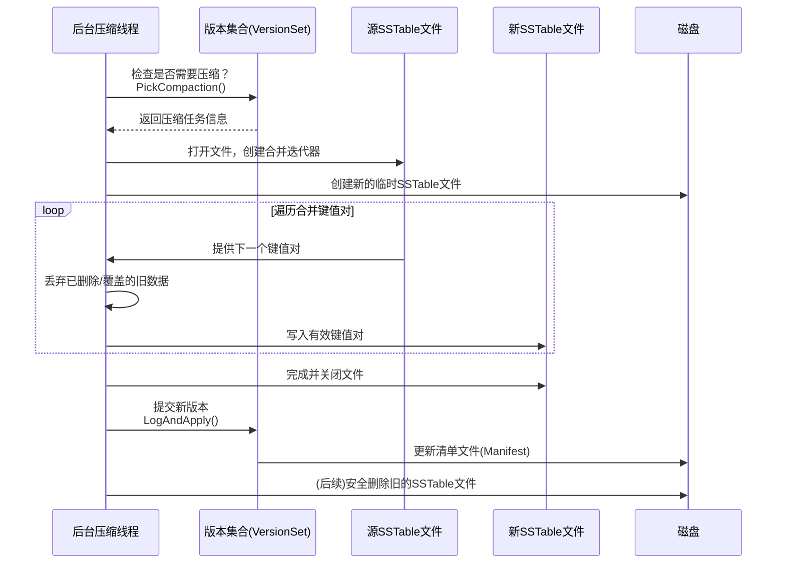

# Chapter 7: 压缩机制（Compaction）

欢迎回来！在上一章，我们认识了负责管理数据库“快照”的 [版本管理（VersionSet 与 Version）](06_版本管理_versionset_与_version__.md)。你可以把它想象成一个图书馆的“书架管理员”，记录着哪些书（SSTable文件）放在哪个书架的哪一层。

今天，我们要认识这个图书馆里一位非常勤劳的“整理员”——**压缩机制（Compaction）**。你有没有想过，当书架上旧书越来越多，新书不断进来，有些书还被标记为“废弃”时，找书会不会越来越慢？压缩要解决的就是这个问题。

## 为什么需要“整理书架”？

让我们想象一个使用场景。假设你有一个键值存储，用来记录用户的状态：

```cpp
// 用户小明很活跃，状态频繁更新
db->Put(“user:xiaoming”, “在线”);
db->Put(“user:xiaoming”, “忙碌”);
db->Put(“user:xiaoming”, “离线”);
// 后来，小明注销了账户
db->Delete(“user:xiaoming”);
```

看起来很简单，对吧？但LevelDB在后台是怎么做的呢？
1.  这些“写操作”首先进入[内存表（MemTable）](04_内存表_memtable_与跳表_skiplist__.md)，写满后变成磁盘上的一个小SSTable文件（Level 0）。
2.  很快，磁盘上就会有多个小SSTable文件。`“user:xiaoming”` 这个键在多个文件中都有记录：`“在线”`、`“忙碌”`、`“离线”`，以及一个“删除标记”。
3.  当你读取 `“user:xiaoming”` 时，系统需要从最新的文件一直找到最旧的文件，才能确定它已经被删除，最终返回“未找到”。这太慢了！
4.  磁盘空间也被这些无效的旧数据浪费了。

**压缩（Compaction）** 就是为了解决这个问题而生的。它会：
*   **合并**多个小文件，生成一个更大的、排序更有序的新文件。
*   **丢弃**那些已经被新值覆盖的旧值，以及被标记为删除的键。
*   **维护**数据的层次结构，让读取速度始终保持高效。

这个过程完全是**自动**在后台进行的，你写你的数据，LevelDB默默帮你“打扫战场”。

## 图书馆的楼层：LevelDB的分层设计

为了更好地组织数据，LevelDB采用了**分层（Leveled）** 结构。你可以把它想象成一个有7层（Level 0 - Level 6）的图书馆：

```mermaid
graph TD
    A[新书到达<br/>MemTable满] --> B[临时展台<br/>Level 0]
    B --“整理员”压缩--> C[一楼<br/>Level 1]
    C --“整理员”压缩--> D[二楼<br/>Level 2]
    D -- ... --> E[顶楼<br/>Level 6]
    
    subgraph “容量逐层放大”
    B
    C[容量: 10MB]
    D[容量: 100MB]
    E[容量: 1TB]
    end
```

*   **Level 0**：就像图书馆的“新书临时展台”。这里存放着刚从内存表（MemTable）转储过来的SSTable文件。这些文件内部按键排序，但文件之间键的范围可能**重叠**。所以找一本书可能需要翻遍所有展台。
*   **Level 1 - Level 6**：就像图书馆正式的、分好类的书架。从Level 1开始，**同一层内的不同文件，其键的范围是不重叠的**。这大大加快了查找速度！同时，越往下层（Level编号越大），容量就越大（通常是上一层的10倍），存放着更旧、更稳定的数据。

**压缩的核心任务，就是把数据从高层（Level n）整理、合并到下层（Level n+1）。**

## 关键概念拆解

让我们看看“整理员”是怎么工作的。

### 1. 触发条件：什么时候开始整理？
“整理员”不是一刻不停地工作，它很聪明，只在需要时出动：
*   **Level 0文件太多**：默认超过4个文件时，就需要合并到Level 1，否则读操作会因为要检查太多重叠文件而变慢。
*   **下层需要“瘦身”**：当某一层（Level n）的总大小超过了它的“预算”，就需要选取一部分文件合并到更下层（Level n+1）。

### 2. 压缩过程：一次整理的具体步骤
假设要整理一部分Level 1的文件到Level 2，一次典型的压缩就像这样：
```cpp
// 伪代码示意：压缩过程的核心逻辑
void DoCompaction(Compaction* c) {
  // 1. 创建一个迭代器，按顺序读取所有待合并文件中的键值对
  Iterator* input = CreateMergingIterator(c->input_files);

  // 2. 创建一个新的SSTable文件构建器
  WritableFile* new_file;
  TableBuilder* builder = new TableBuilder(options, new_file);

  // 3. 遍历所有键值对
  for (input->SeekToFirst(); input->Valid(); input->Next()) {
    Slice key = input->key();
    // 关键：如果键已被删除或已覆盖，则跳过（丢弃）！
    if (IsDeletedOrObsolete(key)) {
      continue;
    }
    // 否则，将有效的键值对写入新文件
    builder->Add(key, input->value());
  }

  // 4. 完成新SSTable文件的构建
  builder->Finish();
  // 5. 更新版本：用新文件替换掉旧文件
  version_set->LogAndApply(new_file, c->input_files);
}
```
**代码解释**：
- `CreateMergingIterator`：它把多个输入文件的迭代器合并成一个，能按全局顺序依次吐出键值对。
- `IsDeletedOrObsolete`：这是压缩的“垃圾识别”环节。如果一个键有删除标记，或者同一个键出现了更新的值，旧的数据就会被安全丢弃。
- `LogAndApply`：压缩完成后，通过[版本管理](06_版本管理_versionset_与_version__.md)系统，原子性地用新文件替换旧文件，生成一个新的数据库“快照”。

### 3. 选择策略：整理哪些文件？
LevelDB的“整理员”追求公平和效率。它会记录哪些文件很久没有被整理过，优先整理它们。同时，它会选择那些与下层文件重叠范围最小的文件进行压缩，以减少合并时的I/O操作量。

## 从使用者的角度看压缩

作为使用者，你几乎感知不到压缩的存在。但了解它可以帮助你调优数据库。主要的控制参数在 `Options` 里：

```cpp
leveldb::Options options;
options.create_if_missing = true;

// 控制整个数据库的写入速度与空间放大
options.write_buffer_size = 64 * 1024 * 1024; // 内存表大小，默认64MB
options.max_file_size = 2 * 1024 * 1024;      // Level 0 SSTable文件大小，默认2MB

// 更高级的控制（通常用默认值即可）
options.level0_file_num_compaction_trigger = 4; // Level 0触发压缩的文件数阈值
options.level0_slowdown_writes_trigger = 8;     // Level 0文件数过多时开始减慢写入
options.level0_stop_writes_trigger = 12;        // Level 0文件数过多时停止写入

// 打开数据库，然后正常使用...
leveldb::DB* db;
leveldb::DB::Open(options, “/tmp/testdb”, &db);
db->Put(...); // 放心写，压缩在后台默默工作
```

**输出影响**：在压缩发生时，你可能会观察到短暂的磁盘I/O增加（因为要读写文件），但前台的用户读写请求通常不会被阻塞（有时极端情况会稍有延迟）。长期来看，数据库的读取速度会保持稳定，磁盘空间使用也更高效。

## 内部实现揭秘：一步步跟着“整理员”

让我们深入后台，看看当条件满足时，一次压缩是如何从计划到执行的。



这个流程完全由DBImpl的后台线程驱动。在第1章我们提到DBImpl像“总经理”，那么压缩线程就是它手下最重要的“后勤主管”。

在代码中，这个过程分散在几个关键文件里：
*   **计划压缩 (`db/version_set.cc`)**：`VersionSet::PickCompaction()` 函数负责根据当前各层状态，挑选出需要被压缩的文件。
*   **执行压缩 (`db/db_impl.cc`)**：`DBImpl::BackgroundCompaction()` 和 `DBImpl::DoCompactionWork()` 是后台压缩的入口和核心工作函数。
*   **构建SSTable (`db/builder.cc`)**：`BuildTable()` 函数负责将排序后的键值流写入磁盘，生成新的SSTable文件，如我们前面看到的伪代码。

来看一段极度简化的 `DoCompactionWork` 核心循环：

```cpp
// 摘自 db/db_impl.cc (极度简化版)
Status DBImpl::DoCompactionWork(CompactionState* compact) {
  // 创建合并所有输入文件的迭代器
  Iterator* input = versions_->MakeInputIterator(compact->compaction);

  input->SeekToFirst();
  while (input->Valid()) {
    // 暂停判断，让位于紧急的MemTable转储（Minor Compaction）
    if (HasImmutableMemTable()) {
      break;
    }
    
    Slice key = input->key();
    // 关键决策：这个键需要输出吗？
    // 如果它在更深的层有更新记录，或者被标记删除，则跳过
    if (compact->compaction->ShouldStopBefore(key) ||
        key_has_been_outputted_to_deeper_level) {
      // 丢弃这个键（及其值）
    } else {
      // 写入到新的输出文件
      current_output_builder->Add(key, input->value());
    }
    input->Next();
  }
  delete input;
  return Status::OK();
}
```
**代码解释**：
- `MakeInputIterator`：这就是那个强大的“多路归并迭代器”，能有序地遍历所有待压缩文件。
- `ShouldStopBefore`：一个有趣的优化。它会判断当前键如果再继续写入当前输出文件，是否会导致该文件与“祖父层”（Level+2）有太多重叠，如果会，就结束当前文件，开一个新文件，以保证后续查询效率。
- `HasImmutableMemTable`：压缩是后台工作，必须给前台紧急任务（如MemTable满后必须立即转储到Level 0）让路。这体现了LevelDB优秀的并发协调能力。

## 总结

恭喜你！现在你认识了LevelDB勤劳的“整理员”——**压缩机制（Compaction）**。我们了解到：

1.  **它的角色**：自动在后台合并SSTable文件，丢弃无效数据，是保持LSM-Tree高性能和节省空间的核心。
2.  **它的地盘**：一个分层（Level 0-6）的数据组织架构，压缩负责将数据逐层向下整理。
3.  **它的工作**：通过**多路归并**和**垃圾识别**，生成更紧凑、更有序的新文件，并通过[版本管理](06_版本管理_versionset_与_version__.md)系统原子性地更新数据库视图。
4.  **你的视角**：作为用户，你几乎无感知，但可以通过选项参数对压缩行为进行宏观调优。

正是有了压缩机制默默地“整理书架”，LevelDB才能在海量写入下，依然提供稳定的读取性能。数据的“存”和“取”在这里达成了美妙的平衡。

在下一章，我们将探索LevelDB如何让你灵活地遍历这些整理好的“书架”——我们将深入 [迭代器体系（Iterator）](08_迭代器体系_iterator__.md)，了解这个强大而统一的遍历抽象是如何设计的。准备好揭开数据访问的最后一层面纱了吗？我们下一章见！

---

Generated by [AI Codebase Knowledge Builder](https://github.com/The-Pocket/Tutorial-Codebase-Knowledge)