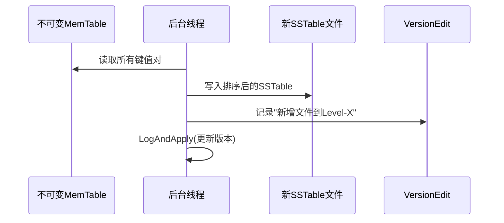
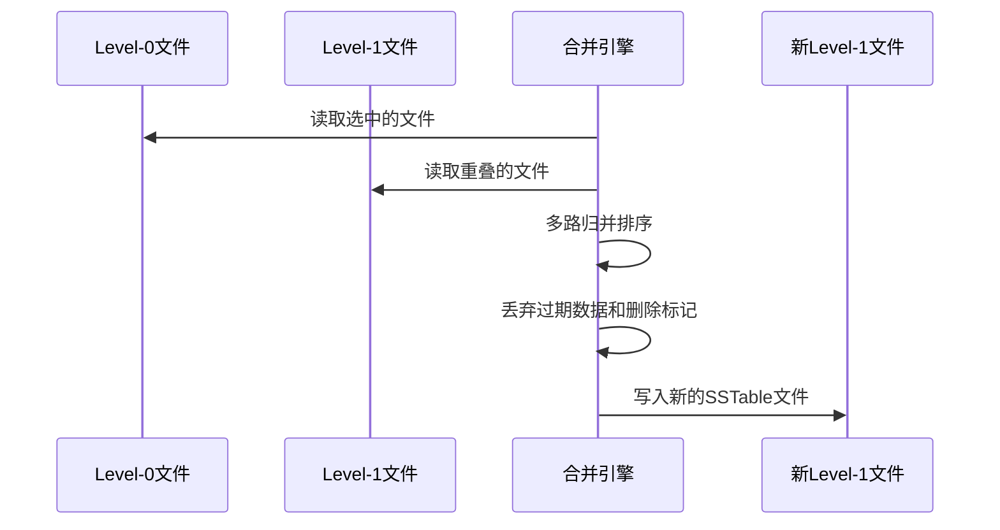
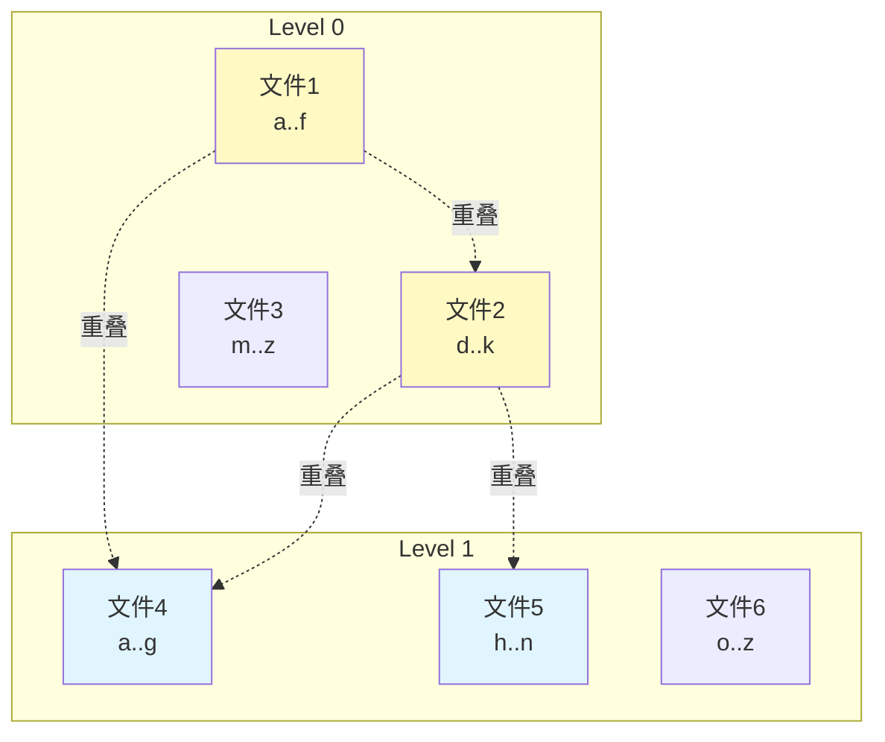
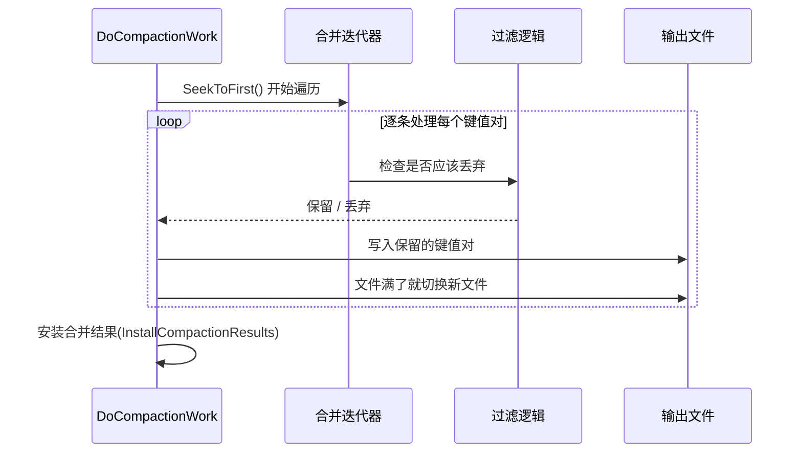
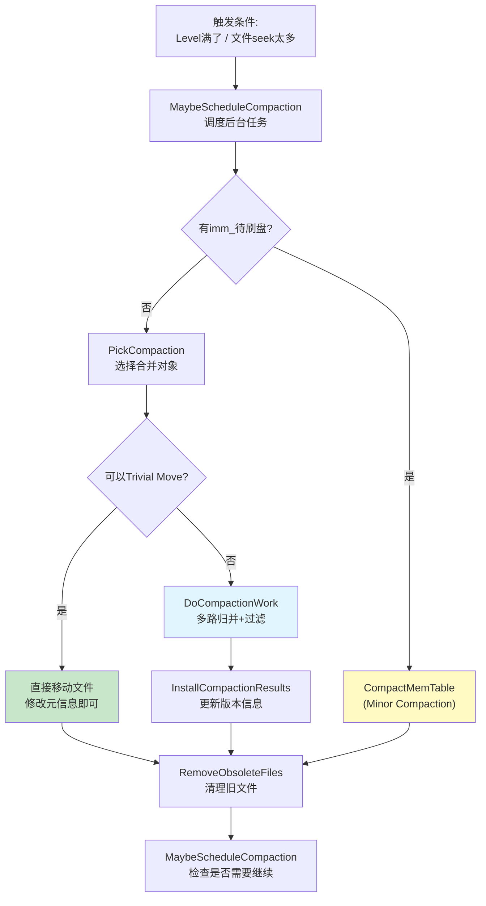
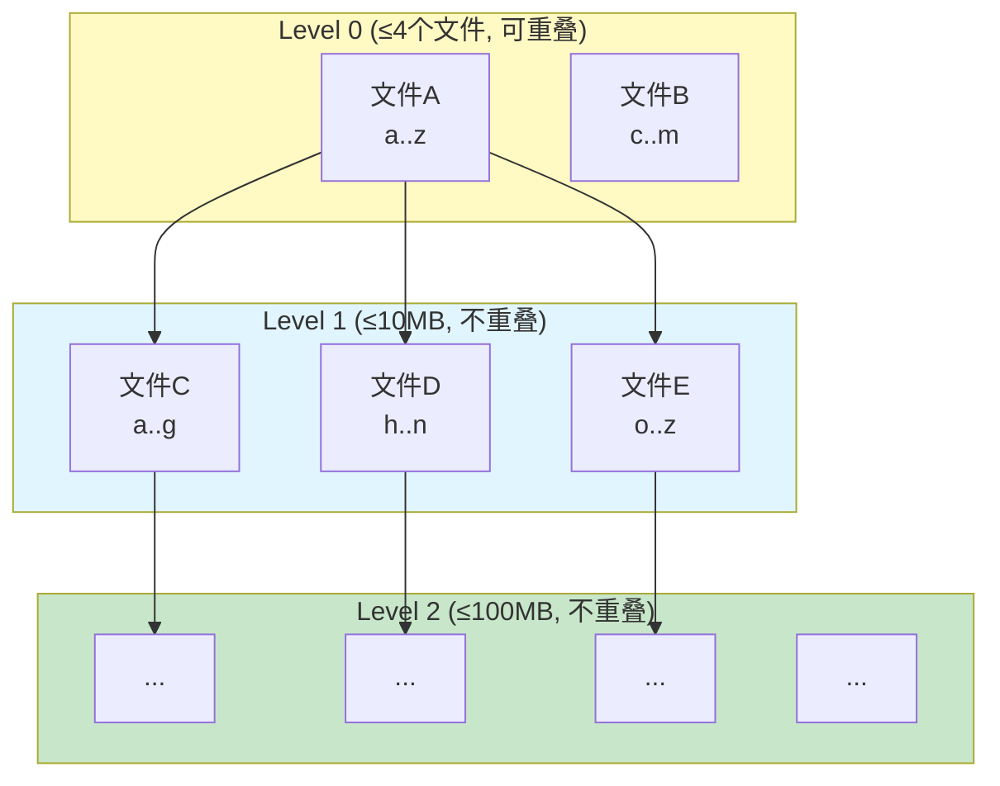

# Chapter 7: 合并压缩（Compaction）

在[上一章](06_版本管理与manifest.md)中，我们学习了版本管理与 MANIFEST——LevelDB 用来追踪所有 SSTable 文件的"库存管理系统"。我们在章末看到，`Finalize` 函数会为每一层计算一个"压缩分数"，当分数 ≥ 1 时就意味着这一层"太满了"，需要整理。那么整理的具体过程是什么？这就是本章的主角——**合并压缩（Compaction）**。

## 从一个实际问题说起

假设你有一个**书桌**，工作时你会不断往桌上放纸条（写入数据）。纸条越来越多，有些纸条记的是同一件事的不同版本（重复键），有些纸条上写着"作废"（删除标记）。如果不整理，你的桌子很快就堆满了，而且每次找一张纸条都要翻遍整个桌面。

你需要定期做两件事：
1. **把桌上的纸条归档到抽屉里**（MemTable 刷盘，也叫 Minor Compaction）
2. **整理抽屉——合并重复的、丢弃作废的**（SSTable 文件合并，也叫 Major Compaction）

这就是 Compaction 要做的事：**定期整理数据，丢弃垃圾，控制每层数据量，保证读取性能。**

## Compaction 是什么？一句话解释

Compaction 是 LevelDB 的**后台清洁工**——它在后台默默工作，把多个小文件合并成少数大文件，丢弃过期数据和删除标记，保持数据库的高效运转。

| 概念 | 类比 | 说明 |
|------|------|------|
| Minor Compaction | 桌上纸条归档到抽屉 | 把内存中的 MemTable 写成 SSTable 文件 |
| Major Compaction | 整理抽屉、合并同类 | 把多个 SSTable 文件合并成新文件 |
| Trivial Move | 直接换个抽屉 | 文件无重叠时，直接移到下一层 |

## 为什么需要 Compaction？

没有 Compaction 的 LevelDB 会面临三个严重问题：

**问题一：Level 0 文件越来越多，读取越来越慢**

在[SSTable排序表文件格式](05_sstable排序表文件格式.md)中我们学到，Level 0 的文件之间**可能有键范围重叠**。读取一个键时，必须检查 Level 0 的**每一个文件**。文件越多，读取越慢。

**问题二：过期数据和删除标记堆积，浪费空间**

对同一个键多次写入，旧值就成了垃圾。删除一个键只是写入一个"删除标记"（[MemTable内存表与跳表](04_memtable内存表与跳表.md)中提到），并不会真正释放空间。

**问题三：数据层级不平衡**

如果数据全堆在前几层，查找时需要翻更多文件。理想状态是数据从 Level 0 逐层下推到更深的层级，每层都控制在合理范围内。

## Compaction 的两种类型

### 类型一：Minor Compaction（MemTable 刷盘）

当 [MemTable内存表与跳表](04_memtable内存表与跳表.md) 写满后（默认 4MB），它会被冻结为不可变 MemTable（`imm_`），然后后台线程将它写成一个 SSTable 文件。



这个过程相对简单——就是把内存数据序列化到磁盘。

### 类型二：Major Compaction（SSTable 文件合并）

这才是 Compaction 的主战场。它从某一层选取文件，和下一层的重叠文件**合并排序**，产生新的下一层文件。



## 触发条件：什么时候需要 Compaction？

在[版本管理与MANIFEST](06_版本管理与manifest.md)中我们看过 `Finalize` 函数。它为每一层计算一个**压缩分数**：

```c++
// db/version_set.cc — Finalize()
if (level == 0) {
  // Level 0: 按文件数量
  score = files.size() /
      static_cast<double>(kL0_CompactionTrigger);
} else {
  // 其他层: 按总数据量
  score = level_bytes / MaxBytesForLevel(options, level);
}
```

- **Level 0**：文件数超过 4 个（`kL0_CompactionTrigger = 4`），分数就 ≥ 1
- **其他层**：总数据量超过阈值（Level 1 = 10MB，Level 2 = 100MB，每层 ×10）

还有一种触发方式——**seek compaction**：当某个文件被读取操作"空跑"了太多次（查了这个文件但没命中），说明这个文件该被合并优化了。

## 后台调度：谁来执行 Compaction？

Compaction 由后台线程自动执行。调度入口是 `MaybeScheduleCompaction`：

```c++
// db/db_impl.cc
void DBImpl::MaybeScheduleCompaction() {
  if (imm_ == nullptr &&
      manual_compaction_ == nullptr &&
      !versions_->NeedsCompaction()) {
    return;  // 没活干
  }
  background_compaction_scheduled_ = true;
  env_->Schedule(&DBImpl::BGWork, this);
}
```

三个条件满足任一就会触发：有不可变 MemTable 待刷盘、有手动压缩请求、或版本管理器认为需要压缩。`env_->Schedule` 会把任务提交到后台线程池。

后台线程执行 `BackgroundCompaction`，它是整个 Compaction 的**调度中心**：

```c++
// db/db_impl.cc — BackgroundCompaction() 简化
void DBImpl::BackgroundCompaction() {
  // 优先处理 MemTable 刷盘
  if (imm_ != nullptr) {
    CompactMemTable();
    return;
  }
  // 否则，选择一次 SSTable 合并
  Compaction* c = versions_->PickCompaction();
  // ...执行合并...
}
```

优先级很清楚：**先刷 MemTable，再合并 SSTable。** 因为 MemTable 刷盘直接影响写入——如果 `imm_` 一直不刷完，新的写入就会被阻塞。

## 关键步骤一：PickCompaction——选择合并对象

`PickCompaction` 决定"从哪一层选哪些文件来合并"。这是 Compaction 中最关键的决策。

### 选择层级和初始文件

```c++
// db/version_set.cc — PickCompaction() 简化
const bool size_compaction =
    (current_->compaction_score_ >= 1);
const bool seek_compaction =
    (current_->file_to_compact_ != nullptr);
```

优先处理**大小触发**的压缩（某层太满），其次处理**seek 触发**的压缩。

对于大小触发的情况：

```c++
// db/version_set.cc — 选择文件（轮转策略）
for (size_t i = 0; i < files.size(); i++) {
  FileMetaData* f = files[i];
  if (compact_pointer_[level].empty() ||
      icmp_.Compare(f->largest.Encode(),
                    compact_pointer_[level]) > 0) {
    c->inputs_[0].push_back(f);
    break;
  }
}
```

这里有一个巧妙的**轮转策略**：每次压缩记住上次处理到哪个键（`compact_pointer_`），下次从那个键之后的文件开始。这保证了每层的所有文件都会被均匀地轮到，而不是总是压缩同一个文件。

就像值日打扫卫生——今天从 A 同学开始，明天从 B 同学开始，轮着来。

### Level 0 的特殊处理

Level 0 的文件可能互相重叠。选了一个文件后，还要把所有和它重叠的 Level 0 文件也拉进来：

```c++
// db/version_set.cc
if (level == 0) {
  InternalKey smallest, largest;
  GetRange(c->inputs_[0], &smallest, &largest);
  current_->GetOverlappingInputs(
      0, &smallest, &largest, &c->inputs_[0]);
}
```

先算出选中文件的键范围，然后找出 Level 0 中所有和这个范围重叠的文件。这可能会让输入文件越来越多——有点像"滚雪球"。

### 选择下一层的重叠文件

选好本层（Level L）的文件后，还要找出下一层（Level L+1）中所有重叠的文件：

```c++
// db/version_set.cc — SetupOtherInputs() 简化
current_->GetOverlappingInputs(
    level + 1, &smallest, &largest, &c->inputs_[1]);
```

`inputs_[0]` 是 Level L 的输入文件，`inputs_[1]` 是 Level L+1 的输入文件。合并后的结果会写入 Level L+1。

用一个具体的例子来说明整个选择过程：



假设初始选中文件 1（a..f）：
1. 文件 2（d..k）与文件 1 重叠 → 也拉入 → 范围扩大到 a..k
2. Level 1 中文件 4（a..g）和文件 5（h..n）与 a..k 重叠 → 拉入
3. 最终：inputs[0] = {文件1, 文件2}，inputs[1] = {文件4, 文件5}

### 扩展优化

LevelDB 还会尝试在不增加 Level L+1 文件数量的前提下，扩大 Level L 的输入范围：

```c++
// db/version_set.cc — SetupOtherInputs() 扩展尝试
if (expanded0.size() > c->inputs_[0].size() &&
    inputs1_size + expanded0_size <
        ExpandedCompactionByteSizeLimit(options_)) {
  // 可以安全扩展
  c->inputs_[0] = expanded0;
}
```

如果扩展后 Level L+1 的文件集合没变，而且总数据量不超限（默认 50MB），就扩展 Level L 的输入——一次多压缩一些，效率更高。

### Grandparent 重叠限制

还要收集**祖父层**（Level L+2）的重叠文件信息：

```c++
// db/version_set.cc
if (level + 2 < config::kNumLevels) {
  current_->GetOverlappingInputs(
      level + 2, &all_start, &all_limit,
      &c->grandparents_);
}
```

这个信息在后面写入输出文件时会用到——防止单个输出文件和太多 Level L+2 文件重叠，否则将来压缩 Level L+1 时会读取过多数据。

## 关键步骤二：Trivial Move——最简单的情况

选好合并对象后，有一种特殊情况可以**跳过真正的合并**：

```c++
// db/db_impl.cc — BackgroundCompaction()
if (!is_manual && c->IsTrivialMove()) {
  FileMetaData* f = c->input(0, 0);
  c->edit()->RemoveFile(c->level(), f->number);
  c->edit()->AddFile(c->level() + 1, f->number,
      f->file_size, f->smallest, f->largest);
  status = versions_->LogAndApply(c->edit(), &mutex_);
}
```

什么时候可以 Trivial Move？

```c++
// db/version_set.cc
bool Compaction::IsTrivialMove() const {
  return (num_input_files(0) == 1 &&
          num_input_files(1) == 0 &&
          TotalFileSize(grandparents_) <=
              MaxGrandParentOverlapBytes(vset->options_));
}
```

三个条件同时满足：
1. Level L 只有**1个**文件参与
2. Level L+1 没有重叠文件（**0个**）
3. 和 Level L+2 的重叠不超限

满足时，直接把文件从 Level L "移动"到 Level L+1——只修改元信息，不需要读写任何数据！就像把一本书从上层书架直接放到下层书架，不用拆开重新装订。

## 关键步骤三：DoCompactionWork——真正的合并

如果不能 Trivial Move，就需要执行真正的合并。这是 Compaction 中最核心、也是最复杂的部分。

### 整体流程



### 第一步：创建合并迭代器

```c++
// db/db_impl.cc — DoCompactionWork()
Iterator* input =
    versions_->MakeInputIterator(compact->compaction);
input->SeekToFirst();
```

`MakeInputIterator` 创建一个[迭代器层次体系](08_迭代器层次体系.md)中的**合并迭代器**，它会把所有输入文件的内容按键的顺序**多路归并**。不管有多少个输入文件，对外看起来就像一个排好序的序列。

```c++
// db/version_set.cc — MakeInputIterator() 简化
// Level 0: 每个文件单独一个迭代器（因为可能重叠）
// 其他层: 用拼接迭代器（文件互不重叠）
Iterator* result =
    NewMergingIterator(&icmp_, list, num);
```

### 第二步：确定最小快照

```c++
// db/db_impl.cc
if (snapshots_.empty()) {
  compact->smallest_snapshot =
      versions_->LastSequence();
} else {
  compact->smallest_snapshot =
      snapshots_.oldest()->sequence_number();
}
```

快照是 LevelDB 提供的"时间旅行"功能。如果有活跃的快照，那些快照需要看到的旧数据就**不能被丢弃**。`smallest_snapshot` 记录了最老的快照序列号——只有序列号小于它的重复数据才能被安全丢弃。

### 第三步：遍历并过滤

这是合并的核心循环。对每个键值对，决定是保留还是丢弃：

```c++
// db/db_impl.cc — DoCompactionWork() 过滤逻辑
bool drop = false;
if (last_sequence_for_key <= compact->smallest_snapshot) {
  drop = true;  // 被更新的数据遮盖了
} else if (ikey.type == kTypeDeletion &&
    ikey.sequence <= compact->smallest_snapshot &&
    compact->compaction->IsBaseLevelForKey(
        ikey.user_key)) {
  drop = true;  // 删除标记可以安全移除
}
```

两种情况会丢弃数据：

**情况一：被新版本遮盖的旧数据**

如果同一个用户键有多条记录，只需保留最新的那条。比如 `alice=beijing`（seq=5）和 `alice=shanghai`（seq=10），序列号 5 的记录可以丢弃。

**情况二：可以安全移除的删除标记**

删除标记的作用是"遮盖"更低层级中的旧数据。如果更低层级**没有**该键的数据了（`IsBaseLevelForKey` 返回 true），删除标记就可以安全移除了——它已经没有什么可遮盖的了。

```c++
// db/version_set.cc — IsBaseLevelForKey()
for (int lvl = level_ + 2; lvl < kNumLevels; lvl++) {
  // 检查更深层级是否存在该键
  if (该键在 files[lvl] 的范围内) {
    return false;  // 更深层还有，不能删
  }
}
return true;  // 更深层没有了，可以删
```

### 第四步：写入输出文件

对于保留的键值对，写入新的输出文件：

```c++
// db/db_impl.cc — 写入部分
if (compact->builder == nullptr) {
  status = OpenCompactionOutputFile(compact);
}
compact->builder->Add(key, input->value());

// 文件满了就换一个新文件
if (compact->builder->FileSize() >=
    compact->compaction->MaxOutputFileSize()) {
  status = FinishCompactionOutputFile(compact, input);
}
```

输出文件的大小有上限（默认 2MB）。写满一个就关闭它，开始写下一个。

### 第五步：Grandparent 切换

除了大小限制，还有一个切换新文件的条件——和祖父层的重叠：

```c++
// db/version_set.cc — ShouldStopBefore()
if (overlapped_bytes_ >
    MaxGrandParentOverlapBytes(vset->options_)) {
  overlapped_bytes_ = 0;
  return true;  // 该换新文件了
}
```

如果当前输出文件的键范围和 Level L+2 的文件重叠超过 20MB（`10 * max_file_size`），就切换到新的输出文件。这避免了将来合并 Level L+1 时需要读取太多 Level L+2 的数据。

就像整理一叠文件时，不要把涉及太多不同部门的内容塞在同一个文件夹里——否则下次那个部门整理时就麻烦了。

### 第六步：优先处理 MemTable

合并过程中，如果有新的 MemTable 需要刷盘，会**暂停合并**，先处理刷盘：

```c++
// db/db_impl.cc — DoCompactionWork() 循环中
if (has_imm_.load(std::memory_order_relaxed)) {
  mutex_.Lock();
  if (imm_ != nullptr) {
    CompactMemTable();  // 先刷盘
  }
  mutex_.Unlock();
}
```

这保证了写入不会因为长时间的合并操作而被阻塞。

## 关键步骤四：InstallCompactionResults——安装结果

合并完成后，需要更新[版本管理与MANIFEST](06_版本管理与manifest.md)：

```c++
// db/db_impl.cc — InstallCompactionResults()
// 删除所有输入文件
compact->compaction->AddInputDeletions(
    compact->compaction->edit());
// 新增所有输出文件
for (auto& out : compact->outputs) {
  compact->compaction->edit()->AddFile(
      level + 1, out.number, out.file_size,
      out.smallest, out.largest);
}
// 应用到版本管理
return versions_->LogAndApply(
    compact->compaction->edit(), &mutex_);
```

三步操作：
1. 在 VersionEdit 中标记所有输入文件为"删除"
2. 在 VersionEdit 中添加所有输出文件
3. 通过 `LogAndApply` 持久化到 MANIFEST 并生成新 Version

之后调用 `RemoveObsoleteFiles()` 清理磁盘上不再被任何 Version 引用的旧文件。

## Minor Compaction：CompactMemTable

让我们也看看 Minor Compaction 的代码。它相对简单：

```c++
// db/db_impl.cc — CompactMemTable() 简化
void DBImpl::CompactMemTable() {
  VersionEdit edit;
  Version* base = versions_->current();
  base->Ref();
  Status s = WriteLevel0Table(imm_, &edit, base);
  base->Unref();
  if (s.ok()) {
    s = versions_->LogAndApply(&edit, &mutex_);
  }
  if (s.ok()) {
    imm_->Unref();
    imm_ = nullptr;
    RemoveObsoleteFiles();
  }
}
```

调用 `WriteLevel0Table` 将 `imm_` 写成 SSTable，然后通过 `LogAndApply` 更新版本信息。

### WriteLevel0Table 中的层级选择

一个有趣的优化——新的 SSTable 不一定总是放在 Level 0：

```c++
// db/db_impl.cc — WriteLevel0Table() 中
if (base != nullptr) {
  level = base->PickLevelForMemTableOutput(
      min_user_key, max_user_key);
}
edit->AddFile(level, meta.number, ...);
```

`PickLevelForMemTableOutput` 会检查：如果新文件和 Level 0 没有重叠，而且和更深层级的重叠也不太多，就可以直接放到 Level 1 甚至 Level 2。这减少了不必要的合并次数。

## 写入限流：防止压缩跟不上

如果写入速度太快，Compaction 来不及处理，Level 0 文件会越来越多。LevelDB 在 `MakeRoomForWrite` 中实现了写入限流：

```c++
// db/db_impl.cc — MakeRoomForWrite() 简化
if (versions_->NumLevelFiles(0) >=
    kL0_SlowdownWritesTrigger) {
  // Level 0 文件数 ≥ 8: 每次写入延迟1ms
  env_->SleepForMicroseconds(1000);
} else if (versions_->NumLevelFiles(0) >=
    kL0_StopWritesTrigger) {
  // Level 0 文件数 ≥ 12: 停止写入，等待压缩
  background_work_finished_signal_.Wait();
}
```

两级限流策略：
- **8 个文件**：开始减速——每次写入等 1ms，给后台线程喘口气
- **12 个文件**：完全停止——直到 Compaction 把文件数降下来

这就像高速公路的匝道信号灯——车太多时先限速放行，拥堵严重时直接拦住等一等。

## 完整的 Compaction 生命周期

让我们用一张流程图把整个 Compaction 过程串起来：



注意最后一步——Compaction 完成后会**再次检查**是否需要继续压缩。因为一次压缩可能导致下一层也超标了，需要级联处理。

## 数据层级结构全景

最后，让我们看看经过 Compaction 维护后，数据库的理想层级结构：



- Level 0：最多 4 个文件，文件之间可能重叠
- Level 1：总大小 ≤ 10MB，文件之间不重叠
- Level 2：总大小 ≤ 100MB，文件之间不重叠
- 以此类推，每层容量扩大 10 倍

数据从 Level 0 开始，像瀑布一样逐层下流。越深层的数据越"冷"（越少被访问），也越"大"（能容纳更多数据）。Compaction 保证了每层都不超标，数据都有序排列，过期数据被及时清理。

## 设计决策分析

理解了 Compaction 的机制之后，让我们思考两个关键的设计决策——为什么 LevelDB 要**这样**做，而不是用其他流行的方案？

### 为什么用 Leveled Compaction 而不是 Size-Tiered Compaction？

LSM-Tree 家族有两种主流的 Compaction 策略。LevelDB 使用的是 Leveled Compaction，而另一种常见策略是 Size-Tiered Compaction（例如早期的 Cassandra 采用）。两者的核心区别：

| 特性 | Leveled (LevelDB) | Size-Tiered (Cassandra) |
|------|-------------------|------------------------|
| 写放大 | 较高（~10x） | 较低（~3x） |
| 读放大 | 低（每层最多查1个文件） | 高（可能查多个同层文件） |
| 空间放大 | 低（~10%） | 高（可能 2x） |

**Size-Tiered** 的做法是：同层的文件大小相近时，把它们合并成一个更大的文件放到下一层。这意味着同一层可能有多个键范围重叠的文件——读取时需要检查同层的所有文件。

**Leveled** 的做法是：保证 Level 1 及以上每层的文件**互不重叠**。这意味着读取某个键时，每层最多只需查一个文件。代价是每次 Compaction 需要把本层文件和下一层的重叠文件一起合并重写——写放大更高。

LevelDB 作为嵌入式数据库，优先保证**读取性能**和**空间效率**。Leveled Compaction 保证 Level 1+ 的文件互不重叠，读取时每层最多查一个文件，总共最多查 7 个文件（Level 0 ~ Level 6）。空间放大也很低——每层只有一份有效数据，没有冗余副本。代价是写放大较高（每条数据平均被重写约 10 次），但对大多数**读多写少**的场景来说这是值得的。

### 为什么用轮转策略（compact_pointer_）选择压缩文件？

在 `PickCompaction` 中，LevelDB 用 `compact_pointer_` 记录每层上次压缩到的位置，下次从该位置之后继续选择文件：

```c++
// 每次压缩完成后更新指针
compact_pointer_[level] = largest_key_in_output;
// 下次从这个位置之后开始选择
```

如果不用轮转策略，而是每次都从最小键开始选文件，会发生什么？

数据库前部（键空间开头）的数据会被**反复压缩**，而尾部（键空间末尾）的数据很少被触及。这导致两个问题：

1. **热点不均**：前部数据的写放大远高于尾部，磁盘 I/O 分布不均衡
2. **过期数据堆积**：尾部的过期数据和删除标记长期得不到清理，浪费空间并影响读取性能

轮转策略确保每层的所有文件都有**均等的被压缩机会**。就像值日轮换——今天从张三开始，明天从李四开始，保证每个人都轮到。这使得整个键空间的数据都能被均匀地整理和清理，避免了冷热不均的问题。

`compact_pointer_` 还会被持久化到 MANIFEST 中（通过 VersionEdit），这样即使数据库重启，轮转位置也不会丢失。

## 总结

在本章中，我们深入了解了合并压缩（Compaction）——LevelDB 的后台清洁工：

- **两种类型**：Minor Compaction 把 MemTable 刷盘，Major Compaction 合并 SSTable 文件
- **触发条件**：Level 0 文件数超标、某层总数据量超标、或文件被空读太多次
- **PickCompaction**：选择要合并的层级和文件，使用轮转策略保证均匀处理
- **Trivial Move**：无重叠时直接移动文件到下一层，无需读写数据
- **DoCompactionWork**：多路归并排序 + 过滤过期数据和删除标记，输出新文件
- **写入限流**：Level 0 文件过多时减速或暂停写入，防止压缩跟不上
- **Grandparent 限制**：控制输出文件和祖父层的重叠量，避免级联压缩代价过高

Compaction 是保持 LevelDB 长期高效运行的关键机制。它在后台默默工作，让用户无需关心数据组织的细节。

在 Compaction 的合并过程中，我们多次提到了"合并迭代器"——它能把多个有序数据源合并成一个。这背后是 LevelDB 精心设计的迭代器体系。下一章我们将深入了解——[迭代器层次体系](08_迭代器层次体系.md)，看看 LevelDB 如何用统一的迭代器接口贯穿从内存到磁盘的所有数据访问。

