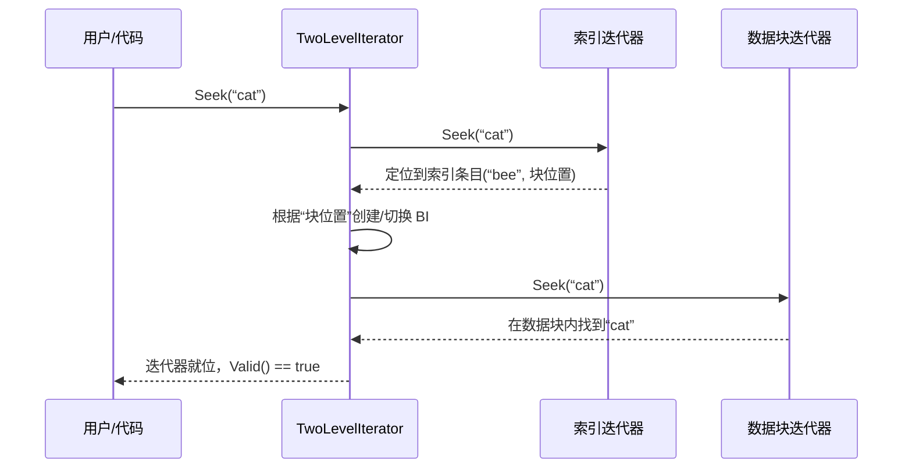

# Chapter 8: 迭代器体系（Iterator）

在上一章，我们学习了 [压缩机制（Compaction）](07_压缩机制_compaction__.md)，它像一位辛勤的园丁，不断地整理和合并磁盘上的数据文件（SSTable）。现在，我们的数据库里数据井然有序，但有一个新问题浮现了：**用户想从头到尾遍历一遍所有数据，该怎么办？**

数据可能分散在内存中的 [MemTable](04_内存表_memtable_与跳表_skiplist__.md) 里，也可能存储在磁盘上多个不同层级的 [SSTable](05_sstable_排序表_与数据块_.md) 文件中。难道要用户自己去 MemTable 里找一遍，再一个个打开 SSTable 文件查找吗？这太繁琐了！

这时，LevelDB 的“瑞士军刀”——**迭代器（Iterator）** 便闪亮登场了。它提供了一个简单、统一的接口，让你无论数据在哪，都能像翻书一样一页页地读下去。

## 迭代器是什么？我们为什么需要它？

想象一下，你有一本非常厚的百科全书（数据库），书的内容被分成了很多个小册子（MemTable 和 SSTable），并且按照字母顺序排列好。你想查找所有关于“猫科动物”的词条。

如果没有迭代器，你需要：
1.  先翻完当前正在使用的小册子（MemTable）。
2.  再找出所有相关的老册子（SSTable），一册一册地翻。
3.  因为不同册子间可能有重复或更新的词条，你还需要自己比较和筛选。

这个过程复杂且容易出错。

而迭代器就像一个**智能的、统一的书签**。你告诉它“从‘猫’开始找”，它就会自动在所有相关的小册子（数据源）间协调，每次只给你看下一个正确的、最新的词条。你完全不用关心数据具体来自哪里。

在代码中，使用迭代器非常简单：

```cpp
leveldb::Iterator* it = db->NewIterator(leveldb::ReadOptions());
for (it->SeekToFirst(); it->Valid(); it->Next()) {
    std::cout << it->key().ToString() << ": " << it->value().ToString() << std::endl;
}
delete it;
```

**这段代码做了什么？**
1.  `db->NewIterator()`：向数据库申请一个“总书签”（迭代器）。
2.  `it->SeekToFirst()`：让书签跳到第一页（第一条数据）。
3.  `it->Valid()`：检查当前书签指的位置是否有效（有没有指到内容）。
4.  `it->Next()`：让书签翻到下一页（下一条数据）。
5.  循环结束后，`delete it`：合上书，收回书签。

看，你完全不用管数据在哪！这就是迭代器的魔力。

## 核心蓝图：统一的接口

所有迭代器都遵循同一个“使用说明书”，即 `leveldb/iterator.h` 中定义的 `Iterator` 基类接口。这个接口规定了一个迭代器必须能做的几件事：

```cpp
class LEVELDB_EXPORT Iterator {
 public:
  virtual ~Iterator();
  // 1. 有效性检查：当前“书签”是否指在一条有效数据上？
  virtual bool Valid() const = 0;
  // 2. 跳转：跳到第一条、最后一条，或跳转到>=指定key的位置。
  virtual void SeekToFirst() = 0;
  virtual void SeekToLast() = 0;
  virtual void Seek(const Slice& target) = 0;
  // 3. 移动：翻到下一页（下一条）或上一页（上一条）。
  virtual void Next() = 0;
  virtual void Prev() = 0;
  // 4. 获取数据：拿到当前“书签”所指位置的键和值。
  virtual Slice key() const = 0;
  virtual Slice value() const = 0;
  // 5. 状态：检查操作过程中有没有出错。
  virtual Status status() const = 0;
  // ... 其他辅助函数
};
```

**接口解读**：
- `Valid()`，`key()`，`value()` 这些是“查看”操作，你可以安全地同时用多个“书签”看书。
- `Seek()`, `Next()`, `Prev()` 这些是“移动书签”的操作，如果你和别人共用同一个书签（多个线程操作同一个迭代器），就需要自己协调好，避免书签乱飞。

有了这个统一的接口，无论底层是遍历内存跳表、读取SSTable文件块，还是合并多个数据源，上层用户代码都无需改变。

## 巧妙的魔法：迭代器的组合模式

LevelDB 数据来源复杂，它是如何用一个迭代器屏蔽所有细节的呢？答案是：**组合模式**。把简单的迭代器组合起来，形成一个更强大的迭代器。

这就像俄罗斯套娃，或者多功能瑞士军刀：
- **最基础的迭代器**：只能做一件事，比如从一块内存（`MemTableIterator`）或一个磁盘数据块（`Block::Iter`）里顺序读数据。
- **组合迭代器**：把多个基础迭代器“管理”起来，让它们协同工作。

让我们看两个最重要的组合迭代器。

### 1. MergingIterator：多路归并的指挥官

当用户请求遍历全部数据时，数据库当前可能有一个 MemTable 和多个 SSTable 文件需要查询。`MergingIterator` 就是负责指挥这场“多路归并”的指挥官。

它的工作原理如下（我们用一个极简的例子说明）：
假设我们有三个有序的数据源，每个源都有一个迭代器指向当前最小的元素：
```
源1 (MemTable): -> [“apple”, ...]
源2 (SSTable 1): -> [“banana”, ...]
源3 (SSTable 2): -> [“apricot”, ...]
```
`MergingIterator` 的工作是：
1.  **查看**所有子迭代器当前指向的键（`key`）。
2.  **比较**，选出最小的那个键（这里是 `“apricot”`）。
3.  **返回**这个最小键及其对应的值给用户。
4.  当用户调用 `Next()` 时，它只推动那个刚刚返回了数据的子迭代器（源3）前进一步，然后重复步骤1-3。

这个过程保证了所有数据源被有序地、无缝地合并输出。

```cpp
// 这是一个概念性的简化代码，用于说明逻辑
class MergingIterator : public Iterator {
 private:
  // 它持有一组子迭代器
  std::vector<Iterator*> children_;
  const Comparator* comparator_;
 public:
  // 当用户调用 key() 时，它返回的是当前所有子迭代器中最小的key
  Slice key() const override {
    // 内部逻辑：比较所有 children_[i]->key()，返回最小的
    return current_min_key_;
  }
  void Next() override {
    // 只推动那个刚刚提供了 current_min_key_ 的子迭代器前进
    current_child_->Next();
    // 然后重新比较所有子迭代器，找出新的最小key
    FindSmallest();
  }
  // ... 其他方法
};
```

### 2. TwoLevelIterator：处理SSTable的两级导航员

一个 [SSTable文件](05_sstable_排序表_与数据块_.md) 内部是分块的（索引块和数据块）。`TwoLevelIterator` 就是为了高效遍历这种“两层结构”而生的。

你可以把它想象成一个**带章节目录的书签**：
- **第一级（索引迭代器）**：相当于书的目录，每个条目告诉你一个章节（数据块）的起始关键词和它在书中的位置（偏移量）。
- **第二级（数据块迭代器）**：相当于具体章节的内容。当你通过目录定位到某一章后，就可以在这一章里逐行阅读。

`TwoLevelIterator` 的工作流程：
1.  用户想找 `“cat”`。
2.  它先用第一级的“目录”（索引迭代器）快速定位到包含 `“cat”` 的那个章节（数据块）。目录条目可能是 `[“bee”, 块位置]`, `[“dog”, 块位置]`，它会找到 `“bee”`（因为 `“cat”` >= `“bee”` 且 < `“dog”`）。
3.  然后，它根据目录记录的位置，打开对应的章节（创建数据块迭代器）。
4.  最后，在这个章节（数据块）内部细细查找，找到 `“cat”`。



## 把一切组装起来：从用户调用到数据返回

现在，让我们看看当你在最开始的例子中调用 `db->NewIterator()` 时，LevelDB 内部是如何为你组装这个“终极书签”的。

这个过程涉及到我们之前学过的多个组件：
1.  **获取当前版本**：首先，从 [VersionSet](06_版本管理_versionset_与_version__.md) 获取当前的 `Version`。这个版本快照里记录了此刻所有有效的 SSTable 文件。
2.  **收集子迭代器**：
    - 为当前的 `MemTable` 创建一个迭代器。
    - 为每个 `Immutable MemTable`（如果有的话）创建一个迭代器。
    - 为 `Version` 中每一层的每个 SSTable 文件创建一个 `TwoLevelIterator`（因为SSTable是两层结构）。
3.  **创建 MergingIterator**：将上面收集到的所有迭代器（可能多达数十个）传入，创建一个 `MergingIterator`。它负责归并所有这些数据源。
4.  **封装成 DBIter**：最后，在 `MergingIterator` 外面再包一层 `DBIter`。这个迭代器是最终返回给用户的，它负责一些“收尾”工作：
    - **处理删除标记**：LevelDB 的删除操作是写入一个特殊的标记（`tombstone`）。`DBIter` 在遍历时看到这个标记，就知道这个键已被删除，会自动跳过。
    - **快照一致性**：如果你使用了读快照（`ReadOptions::snapshot`），`DBIter` 会过滤掉那些版本号比快照新的数据，确保你看到的是快照那一刻的数据视图。

最终，你拿到的迭代器结构就像一个精心组装的望远镜：
```
用户手持的 DBIter
        |
        v
  MergingIterator  (协调员)
    /    |    \
   /     |     \
MemIter ImMemIter TwoLevelIterator (for SSTable 1)
                          |
                   TwoLevelIterator (for SSTable 2)
                          ...
```
你通过 `DBIter` 的目镜观察，`MergingIterator` 帮你调焦并对齐多个镜片（子迭代器），而每个 `TwoLevelIterator` 则负责清晰呈现某一特定数据源（如一个SSTable文件）的细节。

## 核心代码一瞥

让我们看看关键代码是如何体现这些设计的。首先是迭代器包装器 `IteratorWrapper`，它用于优化性能，缓存子迭代器的状态，避免频繁的虚函数调用。

```cpp
// 文件: table/iterator_wrapper.h (简化)
class IteratorWrapper {
 public:
  Slice key() const {
    assert(Valid());
    return key_; // 返回缓存起来的key，而不是调用 iter_->key()
  }
  void Next() {
    assert(iter_ != nullptr);
    iter_->Next(); // 调用底层迭代器的Next
    Update();      // 然后立即更新缓存的状态
  }
 private:
  void Update() {
    valid_ = iter_->Valid();
    if (valid_) {
      key_ = iter_->key(); // 缓存key和value
    }
  }
  Iterator* iter_;
  bool valid_;
  Slice key_;
};
```
**代码解释**：`IteratorWrapper` 把迭代器 `iter_` 包装起来。每次移动迭代器（`Next`/`Prev`/`Seek`）后，它立刻调用 `Update()` 把 `iter_` 的当前状态（是否有效、当前的键）缓存到自己的成员变量里。这样，后续多次调用 `key()` 或 `Valid()` 时，就直接返回缓存值，速度更快。

再看看 `TwoLevelIterator` 如何初始化数据块迭代器：

```cpp
// 文件: table/two_level_iterator.cc (简化)
void TwoLevelIterator::InitDataBlock() {
    if (!index_iter_.Valid()) {
        SetDataIterator(nullptr); // 没有索引了，数据迭代器置空
    } else {
        // 1. 从索引迭代器获取一个“块句柄”（记录位置和大小）
        Slice handle = index_iter_.value();
        // 2. 调用创建函数，根据“句柄”创建出具体的数据块迭代器
        Iterator* iter = (*block_function_)(arg_, options_, handle);
        // 3. 设置当前的数据迭代器
        SetDataIterator(iter);
    }
}
```
**代码解释**：`InitDataBlock` 是 `TwoLevelIterator` 的核心。当它在索引中移动到一个新位置后，就调用这个函数。`block_function_` 是一个函数指针，就像一套“标准操作指南”，它知道如何根据一个编码后的位置信息（`handle`）去磁盘上读取对应的数据块，并创建一个可以遍历该块内键值对的迭代器。

## 总结

恭喜你！你已经揭开了 LevelDB 迭代器体系的神秘面纱。我们学习了：

1.  **迭代器是什么**：一个提供统一遍历接口的“智能书签”，是 LevelDB 的“统一阅读器”。
2.  **为什么需要它**：为了以一致、简单的方式访问分散在内存和磁盘多个文件中的数据。
3.  **核心设计模式**：**组合模式**。通过将简单的、针对特定数据源的迭代器（如 `MemTableIterator`, `Block::Iter`）组合起来，形成能处理复杂场景的强大迭代器（如 `MergingIterator`, `TwoLevelIterator`）。
4.  **关键组件**：
    - `MergingIterator`：像指挥官，归并多个有序数据源。
    - `TwoLevelIterator`：像导航员，高效遍历 SSTable 的索引+数据两层结构。
    - `DBIter`：最终呈现给用户的迭代器，处理删除标记和快照，提供正确的用户视图。
5.  **组装过程**：从用户调用 `NewIterator()` 开始，LevelDB 会收集所有数据源的迭代器，层层组装，最终形成一个功能完整的迭代器返回。

迭代器体系是 LevelDB 简洁性和强大功能的基石之一。它优雅地隐藏了底层数据存储的复杂性，让用户能够专注于业务逻辑。

在下一章 [缓存与布隆过滤器](09_缓存与布隆过滤器_.md) 中，我们将探索 LevelDB 为了进一步提升读取性能而引入的两种关键技术：用缓存（Cache）来避免重复的磁盘IO，以及用布隆过滤器（Bloom Filter）来快速判断“某个数据肯定不存在”，从而节省大量无谓的查找开销。敬请期待！

---

Generated by [AI Codebase Knowledge Builder](https://github.com/The-Pocket/Tutorial-Codebase-Knowledge)