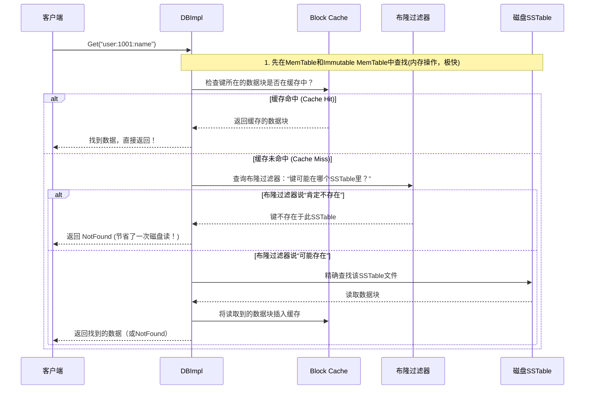

# Chapter 9: 缓存与布隆过滤器

在上一章，我们学习了LevelDB中强大的[迭代器体系（Iterator）](08_迭代器体系_iterator__.md)，它能让我们用一种统一的方式遍历不同层级的数据。这为我们深入理解数据访问打下了基础。今天，我们就要走进LevelDB性能优化的核心——看看它如何利用“缓存”和“布隆过滤器”这两大利器，将数据库的读取速度提升数倍！

## 一个令人头疼的场景

想象一下，你管理着一个巨大的图书馆（数据库），里面有成千上万本书（SSTable文件）。每次有读者（查询请求）来找一本特定的书（某个键 `key`），你都需要遍历多个书库（不同层级）去寻找。

最糟糕的情况是：读者要找的是一本**根本不存在**的书！但为了确认这一点，你不得不跑遍所有相关的书库，一本一本地排查，做了大量的无用功。这个过程在计算机里对应的就是昂贵的**磁盘I/O操作**，它会严重拖慢数据库的响应速度。

那么，如何能快速判断一本书“一定不在图书馆”或“很可能在”，从而避免大部分无意义的查找呢？

这就是 **缓存 (Cache)** 和 **布隆过滤器 (Bloom Filter)** 要解决的问题。它们是LevelDB的“加速引擎”。

## 核心概念一：缓存——记住常用的东西

### 什么是缓存？
缓存的思想非常简单：把最常用、最近使用的数据放在一个访问速度极快的地方（通常是内存），下次需要时直接从这里获取，而不用去慢速存储（如磁盘）里重新读取。

**类比**：就像你的手机通讯录。你不会每次都去翻纸质电话簿找常用联系人的号码，而是把它们保存在手机的“快速拨号”或“收藏夹”里。缓存就是数据库的“收藏夹”。

### LevelDB 中的两种缓存
LevelDB主要使用了两种缓存来加速读取操作：

1.  **Block Cache (数据块缓存)**： 这是 **LRU (最近最少使用) 缓存**。它缓存的是从SSTable文件中读取出来的“数据块（Block）”。如果你反复查询同一个或邻近的键，对应的数据块很可能已经在缓存里了，无需再次读盘。
2.  **Table Cache (表缓存)**： 它缓存的是已打开的SSTable文件的“文件句柄”及其内部的“索引块”。打开一个文件本身也有开销，TableCache避免了反复打开、关闭同一个文件。

让我们看看TableCache是如何被定义和初始化的（来自 `db/table_cache.h` 和 `.cc`）：

```cpp
// 文件：db/table_cache.h
class TableCache {
 public:
  TableCache(const std::string& dbname, const Options& options, int entries);
  // ... 其他方法
 private:
  Cache* cache_; // 核心：一个LRU缓存
};
```
**代码解释**：`TableCache` 类内部持有一个 `Cache*` 指针，这个缓存就是LRU缓存的具体实现。构造函数中的 `entries` 参数决定了缓存可以容纳多少个条目。

```cpp
// 文件：db/table_cache.cc
TableCache::TableCache(const std::string& dbname, const Options& options,
                       int entries)
    : env_(options.env),
      dbname_(dbname),
      options_(options),
      cache_(NewLRUCache(entries)) {} // 创建一个指定大小的LRU缓存
```
**代码解释**：在构造函数中，通过 `NewLRUCache(entries)` 创建了一个LRU缓存对象。这个缓存是 `TableCache` 工作的基础。

## 核心概念二：布隆过滤器——聪明的“可能不存在”检测器

### 什么是布隆过滤器？
布隆过滤器是一种**概率型数据结构**。它最大的特点是：**能非常快速地判断一个元素“绝对不存在”于一个集合中，或者“可能存在”**。

**关键点**：
- **“绝对不存在”**： 如果布隆过滤器说某个键不存在，那么它**100%不存在**。这个判断非常可靠，可以让我们立即停止查找，节省大量时间。
- **“可能存在”**： 如果布隆过滤器说某个键存在，它**只是有可能存在**，存在一定的误判率（False Positive）。这时我们才需要去磁盘上进行精确查找。

**类比**： 回到图书馆的例子。布隆过滤器就像是图书馆入口处的一个**超级精简的“藏书目录”**。它不记录每本书的具体位置，只用几行摘要（通过哈希函数计算出的几个比特位）来标记“哪一类书我们可能有”。
- 读者来找一本《如何养猫》。这个精简目录上完全没有相关标记 -> **书肯定不在图书馆**，读者可以立刻离开。
- 读者来找一本《C++ Primer》。目录上有相关标记 -> **图书馆里可能有这本书**，读者需要进去到具体的书架区域寻找。

### 如何使用布隆过滤器？
在创建LevelDB数据库时，你可以在 `Options` 中指定使用布隆过滤器。

```cpp
#include “leveldb/db.h”
#include “leveldb/filter_policy.h”

leveldb::Options options;
options.create_if_missing = true;
// 启用布隆过滤器，这里设置为每个键使用10个比特位来生成过滤器
options.filter_policy = leveldb::NewBloomFilterPolicy(10);

leveldb::DB* db;
leveldb::Status status = leveldb::DB::Open(options, “/tmp/testdb”, &db);
// ... 使用数据库
```
**发生了什么**： 当你这样配置并写入数据时，LevelDB在构建SSTable文件时，会为其中的每个数据块（约2KB数据）生成一个布隆过滤器比特串，并将所有块的过滤器集中存储在SSTable文件的末尾（称为“过滤器块”）。当执行 `Get()` 操作时，会先查这个过滤器，如果判断键“肯定不存在”，就直接返回 `NotFound`。

## 协同工作：一次Get请求的加速之旅

现在，让我们把缓存和布隆过滤器结合起来，看看它们如何协同工作，将一次普通的 `Get()` 操作从多次磁盘访问优化到可能**只需一次或零次**。

假设我们要查找键 `"user:1001:name"`。



**流程解读**：
1.  首先在内存中的MemTable里查找（最快）。
2.  如果内存中没有，则检查 **Block Cache**。如果缓存命中，直接返回数据，流程结束。这是**性能提升的第一道关卡**。
3.  如果缓存未命中，就需要查询磁盘上的SSTable。但在真正读盘前，会先咨询 **布隆过滤器**。
4.  布隆过滤器分析后，如果断定该键**不可能**在这个SSTable中，则立即返回“未找到”。这**完全避免了一次昂贵的磁盘I/O**，是**性能提升的第二道也是最重要的关卡**。
5.  只有当布隆过滤器认为“可能存在”时，才真正执行磁盘读取，找到对应数据块，并将其**放入Block Cache** 供后续查询使用，然后返回结果。

## 深入内部：看看它们是如何实现的

### Block Cache 的实现
LevelDB的LRU缓存 (`util/lru_cache.cc`) 维护了一个双向链表和一个哈希表。链表按照访问时间排序，最近访问的放在头部，最久未访问的放在尾部。当缓存满时，就淘汰尾部的条目。这确保了最常用的数据总是容易被访问到。

### 布隆过滤器的实现
布隆过滤器的核心是多个哈希函数。LevelDB内置的实现（`util/bloom.cc`）巧妙地使用一个哈希函数来模拟多个哈希函数的行为，以降低计算成本。

```cpp
// 文件：util/bloom.cc (简化版)
void BloomFilterPolicy::CreateFilter(const Slice* keys, int n, std::string* dst) const {
    // 1. 根据键的数量(n)和bits_per_key_计算需要的比特数组大小
    size_t bits = n * bits_per_key_;
    if (bits < 64) bits = 64; // 最小长度，保证过滤效果
    size_t bytes = (bits + 7) / 8; // 比特转字节

    // 2. 分配并清零一块位数组
    dst->resize(bytes, 0);

    // 3. 对每个键，用k_个哈希函数计算出k_个位位置，并将这些位置置为1
    for (int i = 0; i < n; i++) {
        uint32_t h = BloomHash(keys[i]); // 计算一个初始哈希值
        const uint32_t delta = (h >> 17) | (h << 15); // 用高位和低位组合产生新值
        for (size_t j = 0; j < k_; j++) {
            uint32_t bitpos = h % bits; // 计算出位的位置
            (*dst)[bitpos/8] |= (1 << (bitpos % 8)); // 将对应位置1
            h += delta; // 通过加法得到下一个“哈希值”
        }
    }
}
```
**代码解释**：
- `CreateFilter` 方法接收一组键 (`keys`)，为它们生成一个紧凑的比特数组（过滤器）。
- 它遍历每个键，对每个键计算 `k_` 次“哈希”（实际上是由一个基础哈希值通过累加 `delta` 衍生出来的），每次计算对应比特数组中的一个位，并将其设置为1。
- 最终，所有键的信息都被“叠加”编码到了这个比特数组里。查询时，用同样的方法计算待查键的 `k_` 个位，如果这些位在过滤器里**全部**是1，则返回“可能存在”；如果**有任何一位**是0，则返回“肯定不存在”。

## 总结

恭喜你！在本章中，你揭开了LevelDB两大“加速引擎”的神秘面纱：

- **缓存（Cache）**： 特别是LRU Block Cache，它像一个记忆高手，把最近用过的数据块留在内存中，让你下次访问时快如闪电。
- **布隆过滤器（Bloom Filter）**： 它像一位聪明的守门人，能用极小的空间代价，快速拦住那些“肯定不存在”的查询请求，为你省下最耗时的磁盘寻道操作。

它们协同工作，使得LevelDB的随机读取性能产生了质的飞跃。通过合理的配置（如设置 `options.block_cache` 的大小和 `options.filter_policy`），你可以根据自己应用的数据访问模式，进一步优化数据库的表现。

我们已经探索了LevelDB从写入到读取，从内存到磁盘，从数据组织到性能优化的几乎所有核心机制。在下一章，也是本教程的最后一章，我们将把目光投向一个支撑起所有这些模块的基石——[环境抽象层（Env）](10_环境抽象层_env__.md)。它将告诉我们LevelDB是如何做到与具体的操作系统环境解耦，实现跨平台运行的。

---

Generated by [AI Codebase Knowledge Builder](https://github.com/The-Pocket/Tutorial-Codebase-Knowledge)