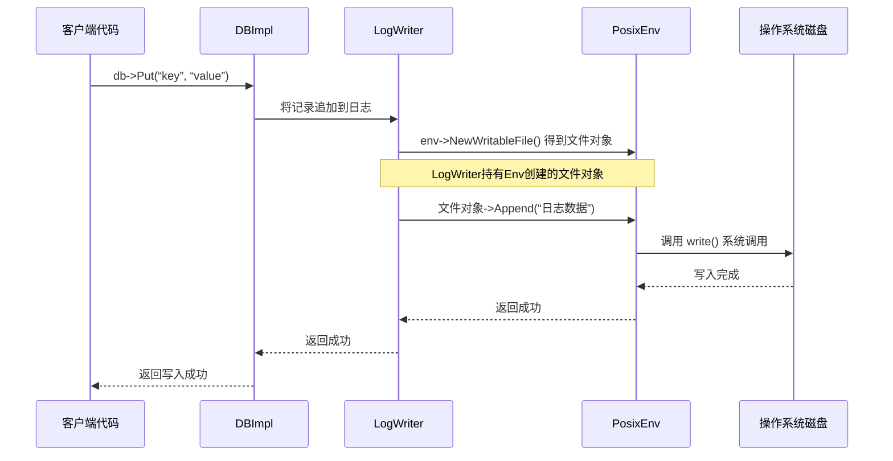

# Chapter 10: 环境抽象层（Env）

在上一章，我们探讨了[缓存与布隆过滤器](09_缓存与布隆过滤器_.md)，它们是LevelDB提升性能的秘密武器。现在，让我们思考一个更根本的问题：LevelDB是如何做到在Linux、Windows甚至没有文件系统的环境中都能运行的呢？这就要归功于我们本章的主角——**环境抽象层（Env）**。

## 我们为什么需要 Env？

想象一下，你开发了一个非常棒的跨平台笔记应用。为了存储笔记，你决定使用LevelDB。一切都很顺利，直到你需要为应用编写单元测试。

**问题来了**：在运行成千上万次的自动化测试时，如果每次测试都创建真实的磁盘文件，速度会非常慢，而且会产生大量垃圾文件。如果能用一个“虚拟的”、“内存中的”文件系统来运行测试，那该多好！

另一个场景是，你发现LevelDB在某些云服务器的磁盘上表现不佳，希望限制它的IO速度，或者监控它到底进行了多少次文件读写操作。

**这些需求的核心**，就是希望LevelDB的“操作系统相关操作”（如创建文件、写入数据、创建线程、获取当前时间等）能够被灵活地定制和替换。这就是Env要解决的终极问题。

**简单来说，Env是LevelDB的“操作系统适配器”**。就像你的笔记本电脑的电源适配器，无论插到美国、中国还是欧洲的插座上，它都能为电脑提供稳定的电力。Env也一样，它把LevelDB核心代码与具体的操作系统（如Linux的POSIX API、Windows API）隔离开，让LevelDB可以“一次编写，到处运行”，并且允许我们“定制行为”。

## Env：统一的操作系统接口

`leveldb::Env` 是一个**抽象类**（或称为接口）。你可以把它理解为一套“标准操作手册”。这本手册规定了所有与平台交互的动作该怎么做，比如：
*   **文件操作**：新建文件、读文件、写文件、删除文件。
*   **目录操作**：创建目录、列出目录内容。
*   **线程与同步**：启动新线程、使用互斥锁和条件变量。
*   **时间与调度**：获取当前时间、让当前线程睡眠一段时间。
*   **调试支持**：写入日志文件。

LevelDB的核心代码，比如负责读写SSTable的模块，从来不会直接调用 `open()`、`write()` 这样的系统函数。它只会调用 `env->NewWritableFile()`、`env->GetCurrentTime()` 这样的方法。至于这些方法底层是在写真实硬盘，还是在操作内存，核心代码并不关心。

让我们看看Env接口长什么样（极度简化的视图）：

```cpp
// 文件：include/leveldb/env.h (简化版)
namespace leveldb {
class LEVELDB_EXPORT Env {
 public:
  Env();
  virtual ~Env();

  // 获取一个默认的、适合当前平台的Env实例（例如，在Linux上返回PosixEnv）
  static Env* Default();

  // --- 文件操作接口 ---
  // 创建一个新的、可顺序写入的文件
  virtual Status NewWritableFile(const std::string& fname,
                                 WritableFile** result) = 0;
  // 打开一个文件用于顺序读取
  virtual Status NewSequentialFile(const std::string& fname,
                                   SequentialFile** result) = 0;

  // --- 文件系统操作 ---
  virtual Status CreateDir(const std::string& dirname) = 0; // 创建目录
  virtual Status DeleteFile(const std::string& fname) = 0; // 删除文件
  virtual Status GetFileSize(const std::string& fname, uint64_t* size) = 0;

  // --- 线程与时间 ---
  virtual void Schedule(void (*function)(void* arg), void* arg) = 0; // 调度后台任务
  virtual uint64_t NowMicros() = 0; // 获取当前微秒时间戳

  // ... 还有许多其他方法
};
}  // namespace leveldb
```
**代码解释**：
*   `virtual ... = 0`：这表示这些是“纯虚函数”。`Env`类本身只定义接口（“手册目录”），不提供具体实现。具体的活由它的“子类”们去干。
*   `static Env* Default()`：这是一个非常重要的静态方法。在LevelDB的绝大部分使用场景中，我们通过它来获得一个为当前操作系统**量身定制**的Env实例，完全不需要自己操心。

## 主要实现：PosixEnv, WindowsEnv 与 MemEnv

既然有了接口“手册”，就必须有人来按照手册干活。LevelDB提供了几个重要的实现：

1.  **PosixEnv** (`util/env_posix.cc`)：这是针对Linux、macOS、BSD等类Unix系统的实现。它底层调用的是 `open`， `read`， `write`， `pthread_create` 等POSIX标准API。

2.  **WindowsEnv** (`util/env_windows.cc`)：这是针对Windows系统的实现。它底层调用的是 `CreateFileW`， `ReadFile`， `WriteFile`， `CreateThread` 等Windows API。

3.  **MemEnv** (`helpers/memenv/memenv.h/.cc`)：这是最有趣的一个实现！它提供了一个**完全在内存中模拟的文件系统**。文件、目录都是数据结构模拟的，不涉及任何真实磁盘IO。这正是我们单元测试梦寐以求的工具！

如何得到一个MemEnv来玩呢？非常简单：

```cpp
#include “leveldb/db.h”
#include “helpers/memenv/memenv.h”

// 创建一个基于默认Env（如PosixEnv）的内存环境
leveldb::Env* mem_env = leveldb::NewMemEnv(leveldb::Env::Default());

leveldb::Options options;
options.env = mem_env; // 关键一步：告诉DB使用我们的内存环境
options.create_if_missing = true;

leveldb::DB* db;
leveldb::Status status = leveldb::DB::Open(options, “/any/path/here”, &db);
// 即使路径是“/any/path/here”，数据也不会写到磁盘，而是存在于mem_env的内存中！

// ... 使用db进行各种操作

delete db;    // 关闭数据库
delete mem_env; // 最后记得清理内存环境
```
**发生了什么？**：
我们创建了一个内存环境 `mem_env`，并在打开数据库的选项 `options` 中指定使用它。接下来，所有在这个数据库内部发生的文件操作（写日志、写SSTable），都会被 `mem_env` 拦截并转换成对内存数据结构的操作。测试结束后，数据随 `mem_env` 的销毁而消失，干净又快速。

## 深入内部：一次写入如何流经Env

让我们以一次简单的 `db->Put` 操作为例，看看Env是如何参与其中的。假设我们使用的是默认的 `PosixEnv`。



**步骤解读**：
1.  `DBImpl` 在写入数据前，需要先写[预写日志（WAL）](03_预写日志_wal___log__.md)。
2.  `LogWriter` 需要写文件，但它不直接操作，而是向 `Env` 请求一个 `WritableFile` 对象。对于 `PosixEnv`，这个对象内部封装了一个Linux的文件描述符（fd）。
3.  `LogWriter` 调用 `WritableFile->Append()` 方法写入数据。
4.  在 `PosixEnv` 的实现里，`Append()` 方法最终调用了操作系统的 `write(fd, data, size)` 函数，将数据真正写入磁盘。
5.  如果我们将 `Env` 替换为 `MemEnv`，那么第4步就变成了向一个内存中的 `std::string` 或 `vector` 追加数据，完全跳过了操作系统。

## 扩展与定制：EnvWrapper

LevelDB还提供了一个强大的工具 `EnvWrapper`。顾名思义，它是一个Env的“包装器”。你可以继承 `EnvWrapper`，并只重写你感兴趣的方法，从而实现功能的定制，而不用重新实现整个 `Env` 接口。

**经典用途**：
*   **注入故障**：在测试中，随机让 `NewWritableFile` 失败，以验证LevelDB的容错能力。
*   **速率限制**：在 `WritableFile->Append()` 中加入延迟，模拟慢速磁盘或进行IO限流。
*   **操作记录与统计**：记录调用了哪些文件操作、调用次数，用于性能分析。

一个最简单的例子，我们创建一个“日志记录Env”：

```cpp
class LoggingEnv : public leveldb::EnvWrapper {
 public:
  // 构造函数，传入一个被包装的底层Env（如Default()）
  explicit LoggingEnv(Env* base_env) : EnvWrapper(base_env) {}

  Status NewWritableFile(const std::string& fname,
                         WritableFile** result) override {
    fprintf(stderr, “[Env Log] 尝试创建可写文件：%s\n”, fname.c_str());
    // 调用底层Env的真正实现
    return target()->NewWritableFile(fname, result);
  }
  // 可以重写其他任何方法...
};

// 使用方式
leveldb::Options options;
Env* base_env = Env::Default();
LoggingEnv* logging_env = new LoggingEnv(base_env);
options.env = logging_env;
// 现在，所有文件创建操作都会被打印到标准错误输出
```

## 总结与展望

恭喜你！至此，你已经探索了LevelDB最核心的十大组件。**环境抽象层（Env）** 作为基石，完美地体现了软件工程中“依赖抽象，而非具体实现”的原则。它让LevelDB的核心逻辑保持纯净和高可移植性，同时为我们打开了定制、测试和监控的大门。

通过Env，我们看到了LevelDB如何优雅地处理平台差异：`PosixEnv` 和 `WindowsEnv` 负责与真实世界打交道，而 `MemEnv` 为我们构建了一个高效的测试沙盒。`EnvWrapper` 则像一把多功能瑞士军刀，允许我们以最小成本扩展其行为。

本教程的核心之旅到此告一段落。从管理一切的[数据库核心引擎（DBImpl）](01_数据库核心引擎_dbimpl__.md)，到保障数据安全的[预写日志（WAL）](03_预写日志_wal___log__.md)，再到高效组织数据的[SSTable](05_sstable_排序表_与数据块_.md)、[内存表](04_内存表_memtable_与跳表_skiplist__.md)和[版本管理](06_版本管理_versionset_与_version__.md)，以及负责空间回收的[压缩机制](07_压缩机制_compaction__.md)、统一访问方式的[迭代器体系](08_迭代器体系_iterator__.md)，和提升性能的[缓存与布隆过滤器](09_缓存与布隆过滤器_.md)，最后到这个打通任督二脉的Env——它们共同构成了LevelDB这个精巧、健壮且高性能的存储引擎。

希望这次探索之旅，不仅让你理解了LevelDB“是什么”和“怎么用”，更让你领略到优秀系统设计背后的思想与美感。现在，带上这些知识，去构建更可靠、更高效的应用程序吧！

---

Generated by [AI Codebase Knowledge Builder](https://github.com/The-Pocket/Tutorial-Codebase-Knowledge)