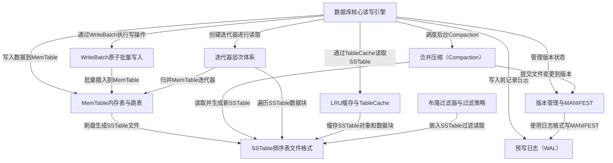

# Tutorial: leveldb

**LevelDB** 是 Google 开发的一个高性能 *嵌入式键值存储引擎*，它将数据以 **有序的键值对** 形式持久化到磁盘上。
整个系统的核心思想是：写入时先将数据暂存到内存中的 **MemTable**，同时记录 *预写日志（WAL）* 防止崩溃丢失数据；
当内存写满后，数据被刷写为磁盘上的 **SSTable** 文件。随着文件越来越多，后台的 **Compaction（合并压缩）** 机制
会自动整理和归并这些文件，删除过期数据，保持读取性能。**版本管理系统** 通过 MANIFEST 文件精确追踪每一层有哪些文件，
支持并发读取和崩溃恢复。读取时通过 **多层迭代器** 归并内存和磁盘数据，**布隆过滤器** 减少不必要的磁盘读取，
**LRU 缓存** 则将热点数据保留在内存中加速访问。

**Source Directory:** `/home/tz/dev/leveldb`

## Chapters

1. [数据库核心读写引擎](01_数据库核心读写引擎.md)
2. [WriteBatch原子批量写入](02_writebatch原子批量写入.md)
3. [预写日志（WAL）](03_预写日志_wal.md)
4. [MemTable内存表与跳表](04_memtable内存表与跳表.md)
5. [SSTable排序表文件格式](05_sstable排序表文件格式.md)
6. [版本管理与MANIFEST](06_版本管理与manifest.md)
7. [合并压缩（Compaction）](07_合并压缩_compaction.md)
8. [迭代器层次体系](08_迭代器层次体系.md)
9. [布隆过滤器与过滤策略](09_布隆过滤器与过滤策略.md)
10. [LRU缓存与TableCache](10_lru缓存与tablecache.md)

