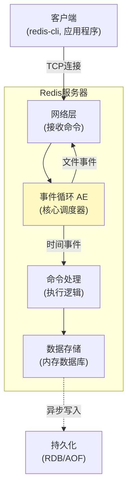
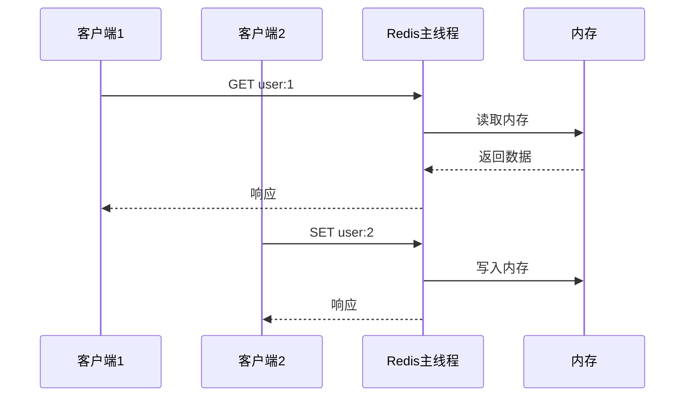
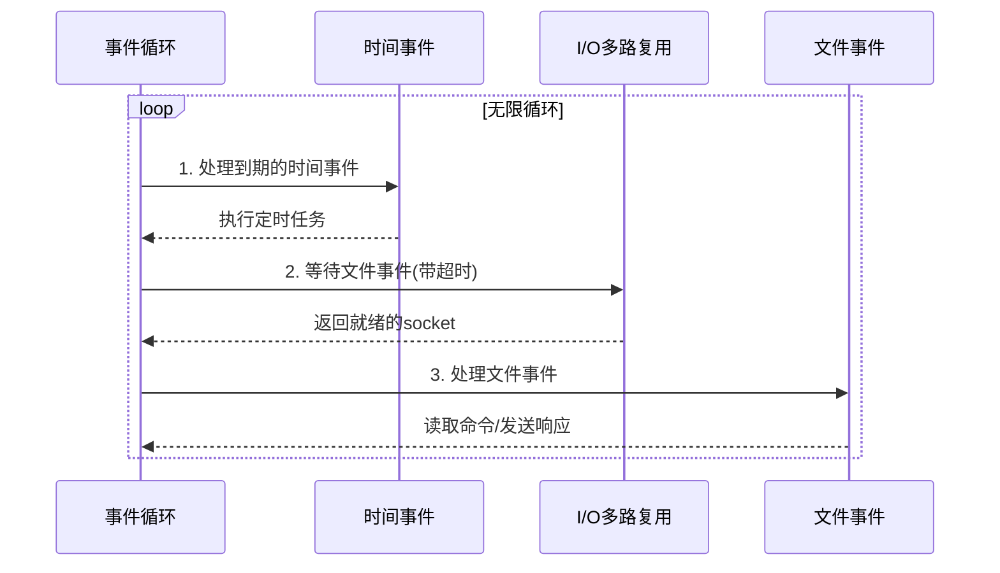
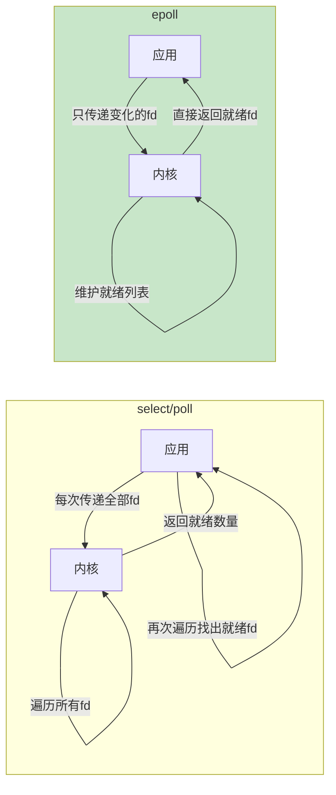
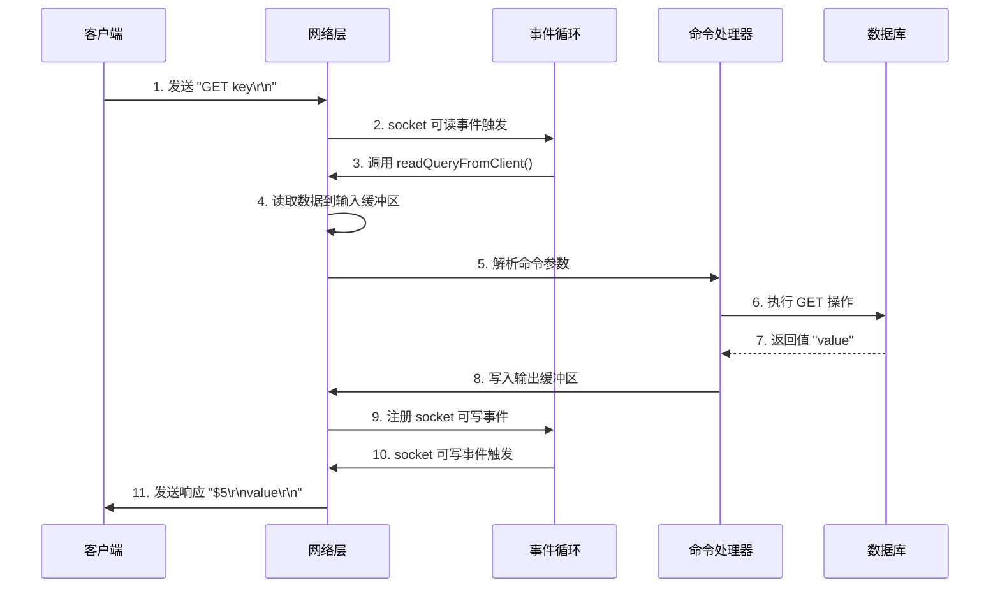
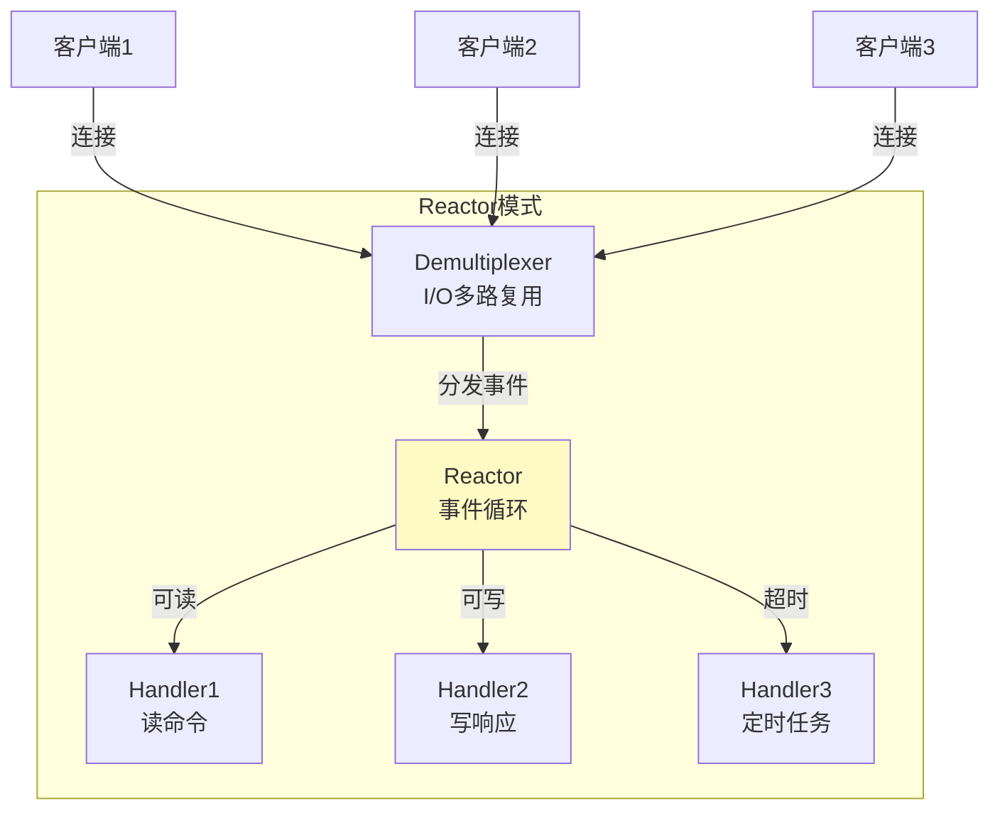

# Chapter 1: Redis 核心架构与事件循环

在开始深入 Redis 源码之前，让我们先从一个实际问题说起。

## 从一个实际问题说起

假设你正在开发一个高并发的在线聊天系统。每秒有成千上万的用户发送消息、查询在线状态、获取历史记录。你需要一个存储系统能够：

- **极快的读写速度**：用户发送消息后，接收方要立即看到
- **处理海量并发**：同时服务数万个客户端连接
- **数据不能丢**：聊天记录要持久化保存
- **支持多种操作**：字符串、列表、集合、排序等

传统的关系型数据库（MySQL、PostgreSQL）虽然可靠，但面对这种高并发场景，性能会成为瓶颈。磁盘 I/O 太慢，每次查询都要经过复杂的 SQL 解析和优化。

这就是 **Redis** 要解决的问题：一个**基于内存**的数据存储系统，用**简单的键值操作**替代复杂的 SQL，用**事件驱动**的架构处理海量并发。

## Redis 是什么？一句话解释

Redis 是一个**单线程、事件驱动、基于内存**的键值存储系统。

| 概念 | 类比 | 说明 |
|------|------|------|
| 单线程 | 一个厨师的餐厅 | 避免多线程锁竞争，简化实现 |
| 事件驱动 | 服务员接单系统 | 高效处理大量并发连接 |
| 基于内存 | 把菜单记在脑子里 | 读写速度极快（微秒级） |
| 键值存储 | 快递柜 | 简单直接的存取方式 |

**核心设计哲学**：用简单换性能，用内存换速度。

## Redis 在整体架构中的位置

Redis 的架构可以分为四个层次：



**数据流向**：
1. 客户端通过 TCP 连接发送命令
2. 网络层接收数据，触发**文件事件**
3. 事件循环调度，将命令交给命令处理器
4. 命令处理器操作内存数据库
5. 结果返回客户端
6. 后台异步持久化到磁盘

## 核心概念一：单线程模型

### 为什么单线程？

Redis 选择单线程处理命令，这听起来很反直觉——单线程怎么能处理高并发？

**答案**：因为瓶颈不在 CPU，而在网络 I/O。



**单线程的优势**：
- **无锁设计**：不需要考虑线程安全，代码简单
- **原子操作**：命令执行不会被打断
- **CPU 缓存友好**：数据局部性好

**性能数据**：
- 内存操作：纳秒级（1-10ns）
- 网络 I/O：微秒到毫秒级（100μs-10ms）
- 单线程每秒可处理 10 万+ QPS

## 核心概念二：事件循环（Event Loop）

### 什么是事件循环？

把 Redis 想象成一个餐厅的服务员。他不会傻傻地站在一桌客人旁边等菜上完，而是：

1. 看看哪桌客人在招手（**检查事件**）
2. 去那桌服务（**处理事件**）
3. 处理完继续巡视（**循环**）

```c
// src/ae.c - 事件循环核心伪代码
void aeMain(aeEventLoop *eventLoop) {
    while (!eventLoop->stop) {
        // 1. 处理到期的时间事件
        processTimeEvents(eventLoop);

        // 2. 等待文件事件（带超时）
        numevents = aeApiPoll(eventLoop, tvp);

        // 3. 处理文件事件
        for (j = 0; j < numevents; j++) {
            processFileEvents(eventLoop, j);
        }
    }
}
```

### 两种事件类型

Redis 的事件循环处理两种事件：

| 事件类型 | 触发条件 | 示例 | 处理方式 |
|---------|---------|------|---------|
| 文件事件 | Socket 可读/可写 | 客户端发送命令 | I/O 多路复用 |
| 时间事件 | 定时器到期 | 过期键清理 | 定时检查 |

**文件事件**：
```c
// 客户端连接可读 → 读取命令 → 执行 → 返回结果
typedef struct aeFileEvent {
    int mask;  // AE_READABLE | AE_WRITABLE
    aeFileProc *rfileProc;  // 读事件处理函数
    aeFileProc *wfileProc;  // 写事件处理函数
    void *clientData;
} aeFileEvent;
```

**时间事件**：
```c
// 每 100ms 执行一次服务器定时任务
typedef struct aeTimeEvent {
    long long id;
    long when_sec;   // 触发时间（秒）
    long when_ms;    // 触发时间（毫秒）
    aeTimeProc *timeProc;  // 时间事件处理函数
    struct aeTimeEvent *next;
} aeTimeEvent;
```

### 事件循环的完整流程



**关键点**：
- 时间事件优先处理（保证定时任务准时）
- I/O 多路复用等待时会设置超时（避免错过时间事件）
- 文件事件批量处理（一次处理所有就绪的连接）

## 核心概念三：I/O 多路复用

### 为什么需要 I/O 多路复用？

假设 Redis 同时服务 10000 个客户端连接。如果用传统方式：

**方案 A：为每个连接创建一个线程**
- 10000 个线程 → 内存占用巨大（每个线程 1MB 栈空间 = 10GB）
- 线程切换开销大
- 需要复杂的锁机制

**方案 B：单线程轮询所有连接**
```c
// 伪代码
for (int i = 0; i < 10000; i++) {
    if (has_data(socket[i])) {
        read_and_process(socket[i]);
    }
}
```
- 大部分时间在检查空闲连接
- CPU 空转浪费

**Redis 的方案：I/O 多路复用**
```c
// 一次系统调用，获取所有就绪的连接
int ready_count = epoll_wait(epfd, events, MAX_EVENTS, timeout);
for (int i = 0; i < ready_count; i++) {
    process_event(events[i]);
}
```

### I/O 多路复用的三种实现

Redis 根据操作系统选择最优实现：

| 实现 | 操作系统 | 性能 | 特点 |
|------|---------|------|------|
| epoll | Linux | 最优 | O(1) 复杂度，支持百万连接 |
| kqueue | BSD/macOS | 最优 | 类似 epoll |
| select | 所有平台 | 较差 | O(n) 复杂度，最多 1024 连接 |

**编译时自动选择**：
```c
// src/ae.c
#ifdef HAVE_EVPORT
#include "ae_evport.c"
#else
    #ifdef HAVE_EPOLL
    #include "ae_epoll.c"
    #else
        #ifdef HAVE_KQUEUE
        #include "ae_kqueue.c"
        #else
        #include "ae_select.c"
        #endif
    #endif
#endif
```

### epoll 实现深入

以 Linux 的 epoll 为例，看看 Redis 如何封装：

```c
// src/ae_epoll.c - epoll 的三个核心操作

// 1. 创建 epoll 实例
static int aeApiCreate(aeEventLoop *eventLoop) {
    aeApiState *state = zmalloc(sizeof(aeApiState));

    state->events = zmalloc(sizeof(struct epoll_event) * eventLoop->setsize);
    state->epfd = epoll_create(1024);  // 创建 epoll 文件描述符

    eventLoop->apidata = state;
    return 0;
}

// 2. 添加/修改监听的文件描述符
static int aeApiAddEvent(aeEventLoop *eventLoop, int fd, int mask) {
    aeApiState *state = eventLoop->apidata;
    struct epoll_event ee = {0};

    int op = eventLoop->events[fd].mask == AE_NONE ?
            EPOLL_CTL_ADD : EPOLL_CTL_MOD;

    ee.events = 0;
    mask |= eventLoop->events[fd].mask;  // 合并旧的 mask
    if (mask & AE_READABLE) ee.events |= EPOLLIN;
    if (mask & AE_WRITABLE) ee.events |= EPOLLOUT;
    ee.data.fd = fd;

    return epoll_ctl(state->epfd, op, fd, &ee);
}

// 3. 等待事件发生
static int aeApiPoll(aeEventLoop *eventLoop, struct timeval *tvp) {
    aeApiState *state = eventLoop->apidata;
    int numevents = 0;

    // 计算超时时间（毫秒）
    int timeout = tvp ? (tvp->tv_sec * 1000 + tvp->tv_usec / 1000) : -1;

    // 阻塞等待事件
    numevents = epoll_wait(state->epfd, state->events,
                          eventLoop->setsize, timeout);

    if (numevents > 0) {
        for (int j = 0; j < numevents; j++) {
            int mask = 0;
            struct epoll_event *e = state->events + j;

            if (e->events & EPOLLIN) mask |= AE_READABLE;
            if (e->events & EPOLLOUT) mask |= AE_WRITABLE;
            if (e->events & EPOLLERR) mask |= AE_WRITABLE | AE_READABLE;
            if (e->events & EPOLLHUP) mask |= AE_WRITABLE | AE_READABLE;

            eventLoop->fired[j].fd = e->data.fd;
            eventLoop->fired[j].mask = mask;
        }
    }
    return numevents;
}
```

**三步走**：
1. **epoll_create**：创建 epoll 实例（只需一次）
2. **epoll_ctl**：注册/修改要监听的 socket
3. **epoll_wait**：等待事件发生，返回就绪的 socket 列表

### epoll 的性能优势



**性能对比**：
- select/poll：O(n) - 每次都要遍历所有连接
- epoll：O(1) - 内核维护就绪队列，直接返回

## 实现细节深入：一个命令的完整生命周期

让我们跟踪一个 `GET key` 命令从发送到返回的完整过程：



### 步骤 1-3：接收命令

```c
// src/networking.c
void readQueryFromClient(aeEventLoop *el, int fd, void *privdata, int mask) {
    client *c = (client*) privdata;
    int nread;

    // 从 socket 读取数据到输入缓冲区
    nread = read(fd, c->querybuf + c->qb_pos, c->querybuf_peak - c->qb_pos);

    if (nread <= 0) {
        // 连接关闭或出错
        freeClient(c);
        return;
    }

    c->qb_pos += nread;
    c->lastinteraction = server.unixtime;

    // 解析并处理命令
    processInputBuffer(c);
}
```

### 步骤 4-6：解析和执行

```c
// src/networking.c
void processInputBuffer(client *c) {
    while (c->qb_pos > 0) {
        // 解析协议（RESP）
        if (c->reqtype == PROTO_REQ_INLINE) {
            if (processInlineBuffer(c) != C_OK) break;
        } else {
            if (processMultibulkBuffer(c) != C_OK) break;
        }

        // 执行命令
        if (c->argc > 0) {
            processCommand(c);
        }
    }
}

// src/server.c
int processCommand(client *c) {
    // 1. 查找命令
    c->cmd = lookupCommand(c->argv[0]->ptr);

    // 2. 权限检查、参数检查等

    // 3. 执行命令
    call(c, CMD_CALL_FULL);

    return C_OK;
}
```

### 步骤 7-11：返回响应

```c
// src/networking.c
void addReply(client *c, robj *obj) {
    // 将响应添加到输出缓冲区
    if (prepareClientToWrite(c) != C_OK) return;

    // 写入数据
    if (_addReplyToBuffer(c, obj->ptr, sdslen(obj->ptr)) != C_OK)
        _addReplyStringToList(c, obj->ptr, sdslen(obj->ptr));
}

int prepareClientToWrite(client *c) {
    // 如果输出缓冲区为空，注册可写事件
    if (c->bufpos == 0 && listLength(c->reply) == 0) {
        if (aeCreateFileEvent(server.el, c->fd, AE_WRITABLE,
            sendReplyToClient, c) == AE_ERR) return C_ERR;
    }
    return C_OK;
}

void sendReplyToClient(aeEventLoop *el, int fd, void *privdata, int mask) {
    client *c = privdata;

    // 发送输出缓冲区的数据
    while (c->bufpos > 0 || listLength(c->reply)) {
        int nwritten = write(fd, c->buf + c->sentlen, c->bufpos - c->sentlen);

        if (nwritten <= 0) break;

        c->sentlen += nwritten;
        if (c->sentlen == c->bufpos) {
            c->bufpos = 0;
            c->sentlen = 0;
        }
    }

    // 发送完毕，取消可写事件
    if (c->bufpos == 0 && listLength(c->reply) == 0) {
        aeDeleteFileEvent(server.el, c->fd, AE_WRITABLE);
    }
}
```

**关键设计**：
- **输入缓冲区**：接收客户端数据
- **输出缓冲区**：暂存响应数据
- **事件驱动写入**：只在 socket 可写时才发送数据，避免阻塞

## 核心概念四：Reactor 模式

Redis 的事件循环实现了经典的 **Reactor 模式**：



**Reactor 模式的三个角色**：

| 角色 | Redis 实现 | 职责 |
|------|-----------|------|
| Reactor | aeEventLoop | 事件循环主体 |
| Demultiplexer | epoll/kqueue | I/O 多路复用 |
| Handler | readQueryFromClient 等 | 具体事件处理函数 |

### Reactor 的优势

**对比传统多线程模型**：

```markdown
传统模型：
客户端1 → 线程1 → 阻塞读取 → 处理 → 阻塞写入
客户端2 → 线程2 → 阻塞读取 → 处理 → 阻塞写入
客户端3 → 线程3 → 阻塞读取 → 处理 → 阻塞写入

问题：
- 线程切换开销大
- 内存占用高（每线程 1MB 栈）
- 需要锁保护共享数据

Reactor 模型：
所有客户端 → 单线程事件循环 → 非阻塞 I/O → 高效处理

优势：
- 无线程切换
- 内存占用低
- 无需锁机制
```

## 时间事件的实现

除了文件事件，Redis 还需要处理定时任务：

```c
// src/ae.c
static int processTimeEvents(aeEventLoop *eventLoop) {
    int processed = 0;
    aeTimeEvent *te;
    long long maxId;

    te = eventLoop->timeEventHead;
    maxId = eventLoop->timeEventNextId - 1;

    while (te) {
        long now_sec, now_ms;
        long long id;

        // 获取当前时间
        aeGetTime(&now_sec, &now_ms);

        // 检查是否到期
        if (now_sec > te->when_sec ||
            (now_sec == te->when_sec && now_ms >= te->when_ms))
        {
            int retval;
            id = te->id;

            // 执行时间事件处理函数
            retval = te->timeProc(eventLoop, id, te->clientData);
            processed++;

            // retval != AE_NOMORE 表示需要继续执行
            if (retval != AE_NOMORE) {
                // 更新下次执行时间
                aeAddMillisecondsToNow(retval, &te->when_sec, &te->when_ms);
            } else {
                // 删除一次性时间事件
                te->id = AE_DELETED_EVENT_ID;
            }
        }
        te = te->next;
    }
    return processed;
}
```

**Redis 的主要时间事件**：

```c
// src/server.c - 每 100ms 执行一次
int serverCron(struct aeEventLoop *eventLoop, long long id, void *clientData) {
    // 1. 更新服务器统计信息
    updateCachedTime();

    // 2. 处理过期键
    activeExpireCycle(ACTIVE_EXPIRE_CYCLE_SLOW);

    // 3. 触发 BGSAVE/BGREWRITEAOF
    if (server.rdb_child_pid == -1 && server.aof_child_pid == -1) {
        // 检查是否需要持久化
    }

    // 4. 关闭超时客户端
    clientsCron();

    // 5. 主从复制检查
    replicationCron();

    return 100;  // 100ms 后再次执行
}
```

## 性能数据与实战

### Redis 事件循环的性能表现

**基准测试**（单实例）：
- **QPS**：10 万+ 读写操作/秒
- **延迟**：P99 < 1ms
- **并发连接**：支持 10000+ 客户端

**为什么这么快？**

| 优化点 | 说明 | 收益 |
|-------|------|------|
| 内存操作 | 所有数据在内存 | 纳秒级访问 |
| 单线程 | 无锁竞争 | 减少 CPU 开销 |
| epoll | O(1) 事件通知 | 高效处理海量连接 |
| 非阻塞 I/O | 避免等待 | 充分利用 CPU |
| 批量处理 | 一次处理多个事件 | 减少系统调用 |

### 实际应用场景

**场景 1：缓存系统**
```bash
# 客户端发送 10000 个 GET 请求
redis-benchmark -t get -n 10000 -q
# 输出：GET: 98765.43 requests per second
```

**场景 2：实时排行榜**
```bash
# 使用有序集合
ZADD leaderboard 100 "player1"
ZADD leaderboard 200 "player2"
ZREVRANGE leaderboard 0 9  # 获取前 10 名
```

## 总结

本章我们深入理解了 Redis 的核心架构：

**三大支柱**：
1. **单线程模型**：简化实现，避免锁竞争
2. **事件驱动**：高效处理海量并发
3. **I/O 多路复用**：用一个线程管理所有连接

**关键数据结构**：
- `aeEventLoop`：事件循环主体
- `aeFileEvent`：文件事件（socket 读写）
- `aeTimeEvent`：时间事件（定时任务）

**工作流程**：
```
客户端命令 → socket 可读 → 事件循环检测 → 读取命令 →
解析执行 → 写入缓冲区 → socket 可写 → 发送响应
```

**性能秘诀**：
- 内存操作 + 单线程 + epoll = 10 万+ QPS
- 非阻塞 I/O + 事件驱动 = 低延迟

下一章，我们将深入 Redis 的**基础数据结构**：SDS（简单动态字符串）、链表、字典，看看 Redis 如何在内存中高效存储数据。

---

**思考题**：
1. 为什么 Redis 选择单线程而不是多线程？
2. epoll 相比 select 的核心优势是什么？
3. 如果一个命令执行时间很长（比如 KEYS *），会发生什么？

[下一章：基础数据结构：SDS、链表、字典](02_基础数据结构_sds_链表_字典.md)
