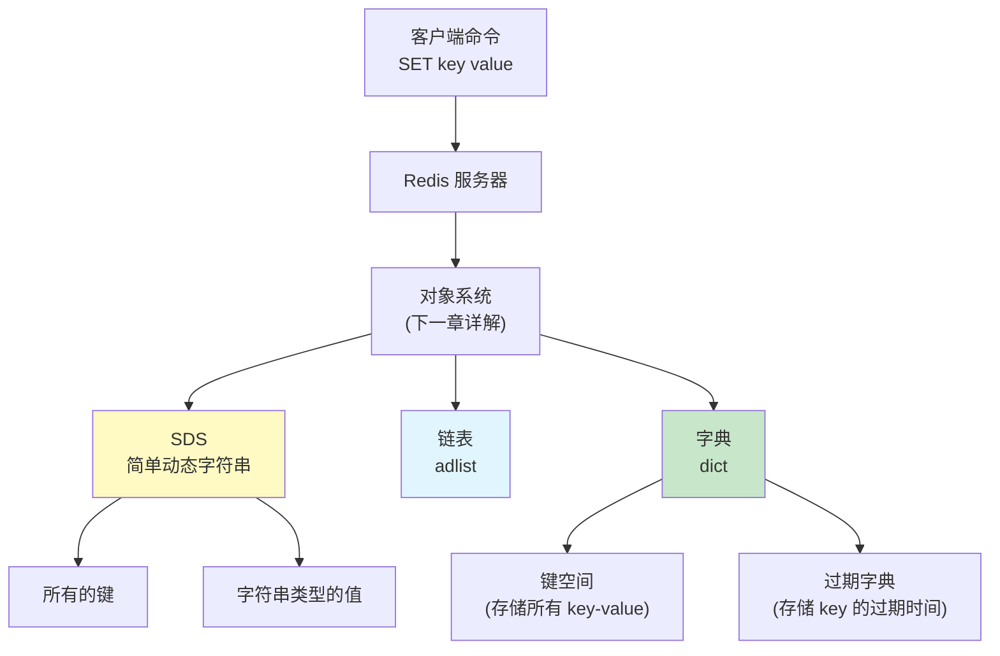
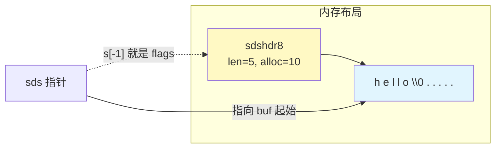
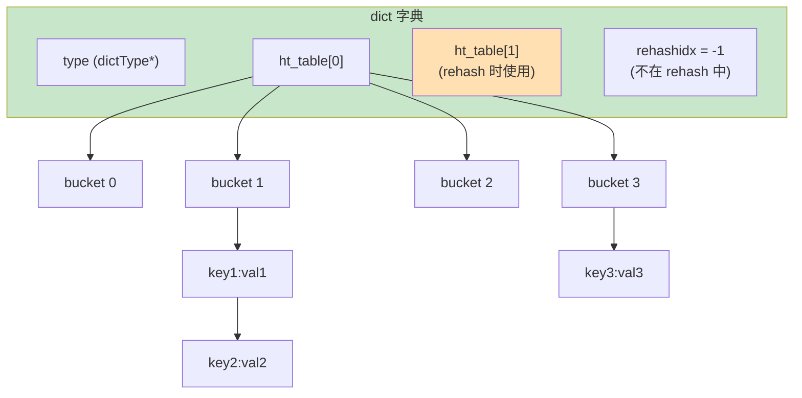
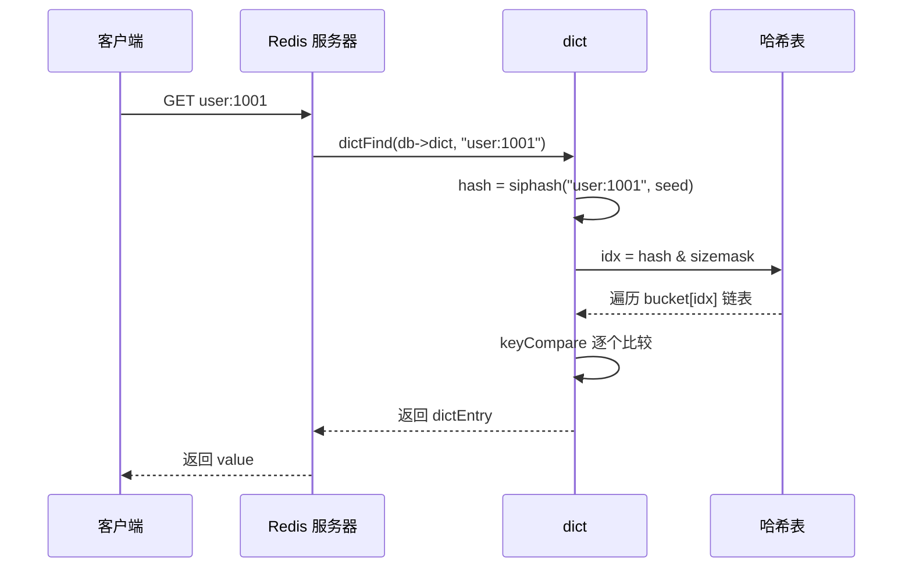
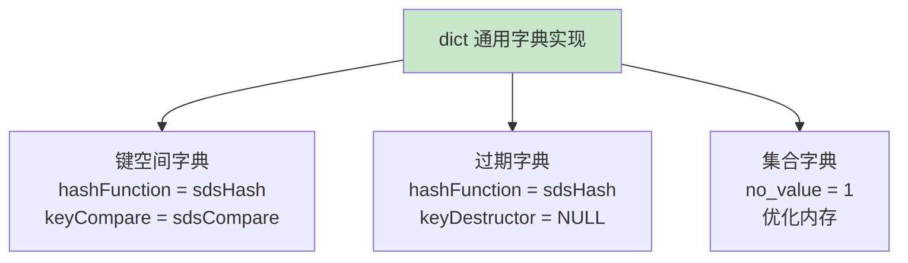
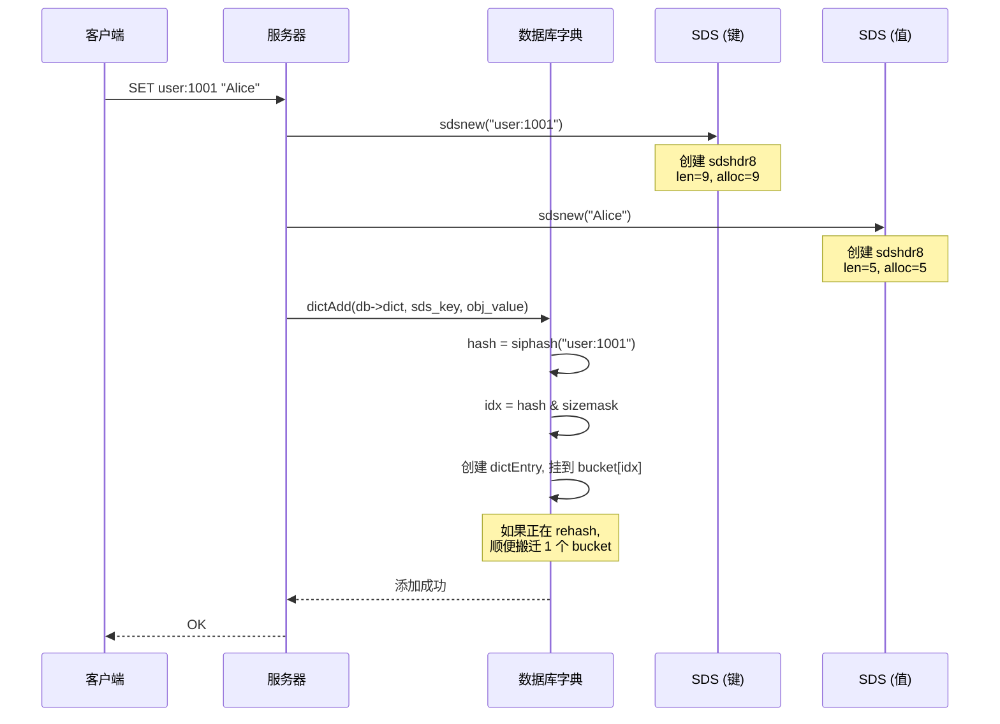

# Chapter 2: 基础数据结构：SDS、链表、字典

在[上一章：Redis 核心架构与事件循环](01_redis核心架构与事件循环.md)中，我们了解了 Redis 的整体架构和事件驱动模型。我们知道，Redis 把所有数据都存放在内存中，靠的是一套高效的底层数据结构。那么，这些数据结构到底长什么样？它们为什么比 C 语言标准库里的更好用？本章就来一探究竟。

## 从一个实际问题说起

假设你要用 C 语言写一个键值数据库。最自然的想法是用 C 语言原生的字符串（`char*`）来存储键和值。但你很快就会遇到一连串麻烦：

1. **获取长度太慢**：`strlen("hello")` 需要从头扫到 `\0`，时间复杂度 O(n)。如果一个字符串有 1MB，每次取长度都要扫 1MB。
2. **不能存二进制数据**：C 字符串以 `\0` 结尾，如果你的数据中间有 `\0`（比如图片、序列化后的 protobuf），字符串会被截断。
3. **拼接容易溢出**：`strcat()` 不会检查目标缓冲区是否够大，一个不小心就缓冲区溢出，程序崩溃。
4. **没有现成的哈希表**：C 标准库根本没提供哈希表，你得自己从零开始写。

这些问题对于一个高性能数据库来说，都是致命的。Redis 的解决方案是：**自己造轮子**——设计一套专门为数据库场景优化的基础数据结构。

本章要介绍的三个数据结构——SDS、链表、字典，就是 Redis 大厦的地基。

## 三大数据结构在架构中的位置



简单来说：Redis 中**每一个键**都是 SDS，**字符串类型的值**也是 SDS；整个数据库本身就是一个**字典**；**链表**则用于实现发布订阅、慢查询日志等内部功能。

## SDS（简单动态字符串）

### 一句话解释

SDS 就是 Redis 自己实现的字符串——在 C 字符串前面加了一个"头部"，记录了长度和容量信息，解决了 C 字符串的所有痛点。

| C 字符串的问题 | SDS 的解决方案 |
|---------------|---------------|
| 获取长度 O(n) | 头部直接存了 len，O(1) 获取 |
| 不能含 `\0` | 用 len 判断结束，二进制安全 |
| 拼接可能溢出 | 自动扩容，杜绝溢出 |
| 频繁拼接导致反复 realloc | 预分配 + 惰性释放 |

### SDS 的内存布局

SDS 的核心思想是：在字符串数据前面放一个结构体头部，后面仍然以 `\0` 结尾（兼容 C 函数）。

```
  sdshdr 头部              buf 数组
┌──────────────────┬──────────────────────────────┐
│ len │ alloc│flags│ 'h' 'e' 'l' 'l' 'o' '\0'     │
│  5  │  10  │ 01  │                     ↑        │
└──────────────────┴─────────────────────|────────┘
                   ↑                     实际结尾
                   sds 指针指向这里
                   （buf 的起始位置）
```

关键设计：**sds 指针指向 buf 的起始位置**，而不是结构体的起始位置。这样，sds 可以直接传给 `printf`、`strcmp` 等 C 函数使用，完全兼容。需要访问头部时，只需将指针向前移动即可。

来看源码中的结构体定义：

```c
// src/sds.h

// sds 本质上就是 char*，指向 buf 数组
typedef char *sds;

// 以 sdshdr8 为例（适用于长度 < 256 的字符串）
struct __attribute__ ((__packed__)) sdshdr8 {
    uint8_t len;    /* 已使用的长度 */
    uint8_t alloc;  /* 分配的总容量（不含头部和 \0） */
    unsigned char flags; /* 低 3 位表示类型，高 5 位保留 */
    char buf[];     /* 柔性数组，存放实际字符串数据 */
};
```

`__attribute__ ((__packed__))` 告诉编译器**不要填充对齐**，让头部尽可能紧凑。这在内存寸土寸金的 Redis 中非常重要。

### 五种头部类型：精打细算的内存优化

Redis 并不是一刀切地使用同一个头部。它根据字符串长度选择不同大小的头部，能省一个字节是一个字节：

| 类型 | 头部大小 | 能存储的最大长度 |
|------|----------|------------------|
| `sdshdr5` | 1 字节 | 31 字节（几乎不用） |
| `sdshdr8` | 3 字节 | 255 字节 |
| `sdshdr16` | 5 字节 | 65535 字节 |
| `sdshdr32` | 9 字节 | ~4GB |
| `sdshdr64` | 17 字节 | 无限大 |

大多数 Redis 的键都很短（比如 `"user:1001"`，9 个字节），只需要 3 字节的 sdshdr8 头部。如果统一使用 sdshdr64，每个字符串会浪费 14 字节——当你有几千万个键时，这就是几百 MB 的差距。

选择类型的逻辑在 `sdsReqType` 函数中：

```c
// src/sds.c — 根据字符串长度选择最省内存的头部类型
char sdsReqType(size_t string_size) {
    if (string_size < 1 << 5) return SDS_TYPE_5;   // < 32 字节
    if (string_size <= (1 << 8) - sizeof(struct sdshdr8) - 1)
        return SDS_TYPE_8;                           // < 252 字节
    if (string_size <= (1 << 16) - sizeof(struct sdshdr16) - 1)
        return SDS_TYPE_16;                          // < 65530 字节
    // ... 依次类推
}
```

### O(1) 获取长度：指针的小魔术

获取 SDS 长度是一个非常高频的操作。来看它是怎么做到 O(1) 的：

```c
// src/sds.h — sds 指针往前看一个字节就是 flags
static inline size_t sdslen(const sds s) {
    // s[-1] 就是 flags 字节——sds 指针的前一个字节
    switch (sdsType(s)) {
        case SDS_TYPE_5: return SDS_TYPE_5_LEN(s);
        case SDS_TYPE_8:
            return SDS_HDR(8,s)->len;   // 直接读取头部的 len 字段
        case SDS_TYPE_16:
            return SDS_HDR(16,s)->len;
        // ...
    }
    return 0;
}
```

`SDS_HDR(8,s)` 宏展开后就是 `(struct sdshdr8 *)((s) - sizeof(struct sdshdr8))`——把 sds 指针往前移动一个头部的大小，就拿到了头部结构体。不需要遍历字符串，直接读一个整数。



### 自动扩容：空间预分配策略

当你对 SDS 执行拼接操作时，SDS 会自动检查空间是否足够，不够就扩容。扩容策略非常聪明：

```c
// src/sds.c — 拼接字符串：先扩容，再拷贝
sds sdscatlen(sds s, const void *t, size_t len) {
    size_t curlen = sdslen(s);

    // 核心：确保有足够空间，不够就自动扩容
    s = sdsMakeRoomFor(s, len);
    if (s == NULL) return NULL;

    memcpy(s+curlen, t, len);    // 拷贝新数据到末尾
    sdssetlen(s, curlen+len);     // 更新长度
    s[curlen+len] = '\0';         // 保持 C 字符串兼容
    return s;
}
```

扩容的核心在 `_sdsMakeRoomFor` 中，它采用了**贪心预分配**策略：

```c
// src/sds.c — 扩容策略
sds _sdsMakeRoomFor(sds s, size_t addlen, int greedy) {
    size_t avail = sdsavail(s);

    // 空间够用，直接返回，零开销
    if (avail >= addlen) return s;

    size_t len = sdslen(s);
    size_t newlen = len + addlen;

    if (greedy) {
        if (newlen < SDS_MAX_PREALLOC)  // SDS_MAX_PREALLOC = 1MB
            newlen *= 2;    // 不到 1MB 时，翻倍分配
        else
            newlen += SDS_MAX_PREALLOC;  // 超过 1MB 时，每次多分配 1MB
    }
    // ... 执行 realloc 或 malloc + memcpy ...
}
```

为什么要预分配？想象一个场景：你不断往 SDS 后面追加数据（比如构造 AOF 日志）。如果每次追加都精确分配，追加 N 次就需要 N 次 `realloc`。有了预分配，追加 N 次可能只需要 log(N) 次 `realloc`。

```
第 1 次追加: "hello"       ->分配 10 字节 (5*2)
第 2 次追加: "hello world" ->空间够用，不需要 realloc！
第 3 次追加: "hello world!!!" ->还是够用！
第 4 次追加: 超出 10 字节  ->再翻倍分配 ...
```

## 链表（adlist）

### 一句话解释

adlist 是 Redis 的**双向链表**实现——结构极其简洁，但通过函数指针实现了"多态"，可以存储任意类型的数据。

### 数据结构一览

整个链表的定义只有三个结构体，加起来不到 20 行代码：

```c
// src/adlist.h

// 链表节点：前驱、后继、值
typedef struct listNode {
    struct listNode *prev;  // 前驱节点
    struct listNode *next;  // 后继节点
    void *value;            // 值指针（void* 可以指向任何类型）
} listNode;

// 链表本身：头尾指针 + 长度 + 三个函数指针
typedef struct list {
    listNode *head;          // 头节点
    listNode *tail;          // 尾节点
    void *(*dup)(void *ptr);         // 复制函数
    void (*free)(void *ptr);         // 释放函数
    int (*match)(void *ptr, void *key); // 比较函数
    unsigned long len;       // 节点数量
} list;
```

用一张图来表示它的内存结构：

```text
  list 结构体                    链表节点
┌───────────── ┐
│ head ────────┼──> ┌──────┐   ┌──────┐   ┌──────┐
│ tail ────────┼──┐ │ prev │<──│ prev │<──│ prev │
│ dup  = NULL  │  │ │ next │──>│ next │──>│ next │
│ free = NULL  │  │ │ value│   │ value│   │ value│
│ match= NULL  │  │ └──────┘   └──────┘   └──────┘
│ len  = 3     │  │                            |
└───────────── ┘  └────────────────────────────┘
```

### 函数指针：C 语言的"多态"

链表中的 `dup`、`free`、`match` 三个函数指针是一个精妙的设计。因为 `value` 是 `void*`，链表不知道里面存的是什么类型。有了这三个函数指针，使用者可以告诉链表"怎么复制一个值"、"怎么释放一个值"、"怎么比较两个值"。

这就像 Java 或 Go 中的接口（interface），只不过用 C 语言的函数指针实现了：

```c
// src/adlist.c — 删除节点时，用 free 函数释放值
void listDelNode(list *list, listNode *node) {
    listUnlinkNode(list, node);         // 从链表中摘除
    if (list->free) list->free(node->value);  // 如果设置了 free 函数，调用它
    zfree(node);                        // 释放节点本身
}

// src/adlist.c — 查找节点时，用 match 函数比较
listNode *listSearchKey(list *list, void *key) {
    listIter iter;
    listNode *node;
    listRewind(list, &iter);
    while ((node = listNext(&iter)) != NULL) {
        if (list->match) {
            if (list->match(node->value, key))  // 自定义比较
                return node;
        } else {
            if (key == node->value)  // 默认比较指针地址
                return node;
        }
    }
    return NULL;
}
```

### 核心操作：头插、尾插、遍历

链表的操作代码非常直观，这里展示尾插法：

```c
// src/adlist.c — 在链表尾部追加节点
list *listAddNodeTail(list *list, void *value) {
    listNode *node;
    if ((node = zmalloc(sizeof(*node))) == NULL) return NULL;
    node->value = value;
    listLinkNodeTail(list, node);   // 实际的链接操作
    return list;
}

void listLinkNodeTail(list *list, listNode *node) {
    if (list->len == 0) {
        // 空链表：新节点既是头也是尾
        list->head = list->tail = node;
        node->prev = node->next = NULL;
    } else {
        // 非空链表：接在尾部
        node->prev = list->tail;
        node->next = NULL;
        list->tail->next = node;
        list->tail = node;
    }
    list->len++;   // O(1) 更新长度
}
```

遍历链表使用迭代器模式：

```c
// 典型的遍历用法
listIter iter;
listNode *node;
listRewind(list, &iter);           // 初始化迭代器，从头开始
while ((node = listNext(&iter)) != NULL) {
    doSomething(listNodeValue(node));  // 处理每个节点的值
}
```

迭代器还支持反向遍历（`listRewindTail`），因为是双向链表，向前向后都是 O(1)。

## 字典（dict）

字典是 Redis 中**最重要**的数据结构。为什么这么说？因为 Redis 数据库本身就是一个字典——所有的键值对都存在字典里。

### 一句话解释

字典就是一个**哈希表**，支持 O(1) 的增删改查。它的核心创新是**渐进式 rehash**——在扩容时不会一次性搬迁所有数据，而是分批搬迁，避免长时间阻塞。

### 整体结构



来看核心数据结构：

```c
// src/dict.h — 字典结构体
struct dict {
    dictType *type;              // 类型特定函数（哈希、比较、释放等）

    dictEntry **ht_table[2];     // 两个哈希表！ht[0]是主表，ht[1]用于rehash
    unsigned long ht_used[2];    // 每个哈希表已使用的条目数

    long rehashidx;              // rehash 进度，-1 表示未在 rehash
    unsigned pauserehash;        // > 0 表示暂停 rehash
    signed char ht_size_exp[2];  // 哈希表大小的指数（size = 1 << exp）
    int16_t pauseAutoResize;     // > 0 表示暂停自动调整大小
};

// src/dict.c — 哈希表条目（链表法解决冲突）
struct dictEntry {
    struct dictEntry *next;  // 指向同一个 bucket 中的下一个条目
    void *key;               // 键
    union {                  // 值（联合体节省内存）
        void *val;
        uint64_t u64;
        int64_t s64;
        double d;
    } v;
};
```

注意几个精妙之处：

1. **两个哈希表**：`ht_table[2]`。平时只用 `ht_table[0]`，rehash 时把数据从 `[0]` 迁移到 `[1]`。
2. **大小用指数表示**：`ht_size_exp` 存的是指数（比如 3 表示大小为 8），而不是实际大小。这样一个 `signed char` 就够了，节省内存。
3. **值用联合体**：如果值是整数或浮点数，直接存在联合体里，不需要额外分配内存。

### 哈希函数：SipHash

Redis 使用 SipHash 作为默认哈希函数：

```c
// src/dict.c — 使用带随机种子的 SipHash
static uint8_t dict_hash_function_seed[16];  // 16 字节随机种子

uint64_t dictGenHashFunction(const void *key, size_t len) {
    return siphash(key, len, dict_hash_function_seed);
}
```

为什么选择 SipHash 而不是更快的哈希函数？因为 Redis 面向网络，攻击者可以构造特殊的键让所有键都哈希到同一个 bucket，把 O(1) 退化成 O(n)。SipHash 是一种**密码学安全的哈希函数**，配合随机种子（每次启动都不同），可以有效防御这种哈希碰撞攻击。

### 查找过程：从 key 到 value

当你执行 `GET user:1001` 时，内部的查找过程如下：



### 渐进式 Rehash：Redis 最精彩的设计之一

当哈希表中的元素太多（负载因子过高），或者太少（浪费内存），就需要调整大小。传统做法是一次性把所有元素搬到新表，但如果有上百万个键，这个操作可能要几百毫秒——对于 Redis 这种追求微秒级响应的系统，这是不可接受的。

Redis 的解决方案是**渐进式 rehash**：把搬迁工作分摊到每一次增删改查操作中，每次只搬一小部分。

#### Rehash 的触发

```c
// src/dict.c — 每次增删改查时，顺带做一步 rehash
static void _dictRehashStep(dict *d) {
    if (d->pauserehash == 0) dictRehash(d, 1);  // 只搬 1 个 bucket
}
```

#### Rehash 的核心逻辑

```c
// src/dict.c — 渐进式 rehash 的核心
int dictRehash(dict *d, int n) {
    int empty_visits = n * 10;  // 最多访问 n*10 个空 bucket，防止阻塞太久

    while (n-- && d->ht_used[0] != 0) {
        // 跳过空 bucket
        while (d->ht_table[0][d->rehashidx] == NULL) {
            d->rehashidx++;
            if (--empty_visits == 0) return 1;  // 空 bucket 太多，先返回
        }
        // 把这个 bucket 里的所有条目搬到 ht[1]
        rehashEntriesInBucketAtIndex(d, d->rehashidx);
        d->rehashidx++;
    }

    // 检查是否全部搬完
    return !dictCheckRehashingCompleted(d);
}
```

搬迁单个 bucket 的逻辑：

```c
// src/dict.c — 把一个 bucket 的所有条目从 ht[0] 搬到 ht[1]
static void rehashEntriesInBucketAtIndex(dict *d, uint64_t idx) {
    dictEntry *de = d->ht_table[0][idx];
    while (de) {
        dictEntry *nextde = dictGetNext(de);
        void *storedKey = dictGetKey(de);

        // 在新表中计算新的 bucket 位置
        uint64_t h;
        if (d->ht_size_exp[1] > d->ht_size_exp[0]) {
            // 扩容：重新计算哈希
            const void *key = dictStoredKey2Key(d, storedKey);
            h = dictGetHash(d, key) & DICTHT_SIZE_MASK(d->ht_size_exp[1]);
        } else {
            // 缩容：直接掩码截取
            h = idx & DICTHT_SIZE_MASK(d->ht_size_exp[1]);
        }

        // 头插法插入新表
        dictSetNext(de, d->ht_table[1][h]);
        d->ht_table[1][h] = de;
        d->ht_used[0]--;
        d->ht_used[1]++;
        de = nextde;
    }
    d->ht_table[0][idx] = NULL;  // 旧 bucket 清空
}
```

#### Rehash 过程的可视化

用一张图来展示渐进式 rehash 的过程：

```
初始状态（rehashidx = -1，只用 ht[0]）:

  ht[0] (size=4)              ht[1] = NULL
  ┌───┐
  │ 0 │ ->k1:v1
  │ 1 │ ->k2:v2 ->k5:v5
  │ 2 │ ->(空)
  │ 3 │ ->k3:v3
  └───┘

═══════════════════════════════════════════

开始 rehash（rehashidx = 0，ht[1] 大小翻倍为 8）:

  ht[0] (size=4)              ht[1] (size=8)
  ┌───┐                       ┌───┐
  │ 0 │ -> (空) ──搬完了──>    │ 0 │ ->(空)
  │ 1 │ -> k2:v2 ->k5:v5      │ 1 │ ->(空)
  │ 2 │ -> (空)               │ 2 │ ->(空)
  │ 3 │ ->k3:v3               │ 3 │ ->(空)
  └───┘                       │ 4 │ ->k1:v1  <- 搬过来了！
       rehashidx = 1          │ 5 │ ->(空)
       ↑ 下次从这里继续         │ 6 │ ->(空)
                              │ 7 │ ->(空)
                              └───┘

═══════════════════════════════════════════

全部搬完（rehashidx = -1）:

  ht[0] (原 ht[1])            ht[1] = NULL
  ┌───┐
  │ 0 │ ->(空)
  │ 1 │ ->k2:v2
  │ 2 │ ->(空)
  │ 3 │ ->k3:v3
  │ 4 │ ->k1:v1
  │ 5 │ ->k5:v5
  │ 6 │ ->(空)
  │ 7 │ ->(空)
  └───┘
```

#### Rehash 期间的读写

在 rehash 进行中，两个哈希表同时存在。这时候读写操作需要特殊处理：

- **查找**：先查 ht[0]，找不到再查 ht[1]
- **新增**：直接插入 ht[1]（不往旧表里插）
- **删除**：两个表都要查

而且，每次执行增删改查操作时，都会顺带调用 `_dictRehashStep` 搬迁一个 bucket。这样，rehash 的工作就均匀地分摊到了日常操作中，用户几乎感知不到。

### dictType：字典的"策略模式"

和链表的函数指针设计类似，字典通过 `dictType` 结构体实现了策略模式：

```c
// src/dict.h — 字典的类型定义
typedef struct dictType {
    uint64_t (*hashFunction)(const void *key);     // 哈希函数
    void *(*keyDup)(dict *d, const void *key);     // 键复制函数
    void *(*valDup)(dict *d, const void *obj);     // 值复制函数
    int (*keyCompare)(..., const void *key1, const void *key2); // 键比较
    void (*keyDestructor)(dict *d, void *key);     // 键析构函数
    void (*valDestructor)(dict *d, void *obj);     // 值析构函数
    int (*resizeAllowed)(size_t moreMem, double usedRatio); // 是否允许调整大小
    // ...
} dictType;
```

这意味着**同样的字典代码可以用于不同场景**：



## 设计决策分析

### 为什么自己实现字符串，而不用 C 标准库？

| 考虑因素 | C 字符串 | SDS |
|---------|---------|-----|
| 取长度 | O(n)，遍历到 `\0` | O(1)，直接读 len 字段 |
| 二进制安全 | 不安全，`\0` 截断 | 安全，用 len 判断边界 |
| 缓冲区溢出 | 需手动检查 | 自动扩容，不可能溢出 |
| 频繁修改 | 每次都 realloc | 预分配 + 惰性释放 |
| 兼容 C 函数 | 天然兼容 | 也兼容（末尾有 `\0`） |

Redis 的设计哲学是：**在不牺牲兼容性的前提下，解决所有痛点**。SDS 返回的指针就是 `char*`，可以直接传给 `printf`，但又有了长度信息和自动扩容。

### 为什么五种头部类型而不是一种？

一个字面上的计算：假设 Redis 里有 1 亿个键，平均键长 20 字节。

- 如果统一用 sdshdr64（17 字节头部）：1亿 * 17 = 1.7 GB 头部开销
- 如果用 sdshdr8（3 字节头部）：1亿 * 3 = 0.3 GB 头部开销
- **省了 1.4 GB 内存！**

Redis 作为内存数据库，这种精打细算是完全值得的。

### 为什么用 SipHash 而不是更快的哈希函数？

更快的哈希函数（如 MurmurHash）确实存在，但它们不是密码学安全的。在 2011 年，安全研究人员发现了针对 MurmurHash 的哈希碰撞攻击（HashDoS），攻击者可以构造特定输入让哈希表退化为链表，将 O(1) 查找变成 O(n)。

Redis 选择 SipHash 是安全和性能的平衡：
- 速度足够快（短字符串只需几十纳秒）
- 配合随机种子，可以抵御哈希碰撞攻击
- 每次启动 Redis 都生成新的种子，攻击者无法预测哈希值

### 为什么渐进式 rehash 而不是一次性 rehash？

Redis 是单线程模型，任何长时间阻塞的操作都会让所有客户端等待。假设一个字典有 100 万个键，一次性 rehash 可能需要几十毫秒。在渐进式方案中：

- 每次操作只搬 1 个 bucket（通常只有几个条目）
- 额外开销只有微秒级
- 用户完全感知不到 rehash 在进行

代价是什么？rehash 期间需要维护两个哈希表，内存占用暂时翻倍。但这是值得的——Redis 宁可多用一点内存，也不能让响应时间出现毛刺。

## 端到端示例：SET 命令的底层之旅

让我们追踪一个 `SET user:1001 "Alice"` 命令，看看这三个数据结构是怎么协同工作的：



在这个过程中：
1. 键 `"user:1001"` 被创建为一个 SDS（sdshdr8，因为长度只有 9）
2. 值 `"Alice"` 也被创建为一个 SDS（sdshdr8，长度 5）
3. 这对键值被插入到数据库的字典中
4. 字典在插入时，如果发现正在 rehash，会顺带搬迁一个旧 bucket

## 小结

本章深入探讨了 Redis 最底层的三个数据结构：

| 数据结构 | 核心优势 | 用在哪里 |
|---------|---------|---------|
| **SDS** | O(1) 取长度、二进制安全、自动扩容 | 所有键、字符串值 |
| **链表** | 简洁、函数指针多态 | 发布订阅、慢查询日志 |
| **字典** | O(1) 查找、渐进式 rehash | 数据库键空间、哈希对象 |

这三个数据结构各有侧重，但共享相同的设计哲学：

- **极致的内存优化**（SDS 的五种头部、dictEntry 的联合体）
- **绝不阻塞**（渐进式 rehash）
- **C 语言也能优雅**（函数指针实现多态、策略模式）

有了这些地基，Redis 在上层构建了它著名的五大数据类型（String、List、Hash、Set、Sorted Set）。但这些数据类型并不是直接使用 SDS/链表/字典——中间还有一层**对象系统**，负责类型检查、引用计数和编码优化。

下一章我们就来揭开对象系统的面纱——[下一章：对象系统与五大数据类型](03_对象系统_五大数据类型.md)。

[上一章：Redis 核心架构与事件循环](01_redis核心架构与事件循环.md) | [下一章：对象系统与五大数据类型](03_对象系统_五大数据类型.md)
