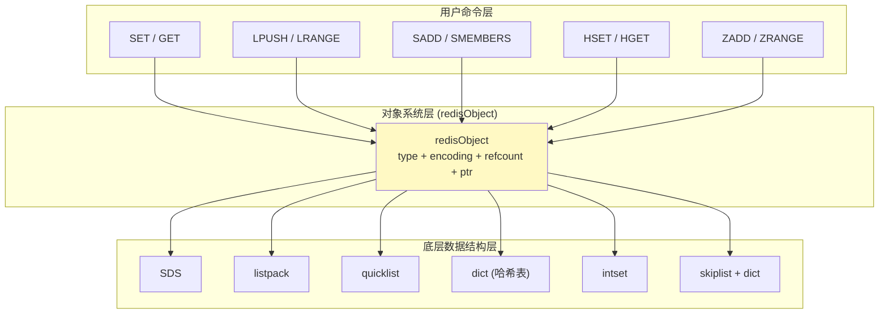
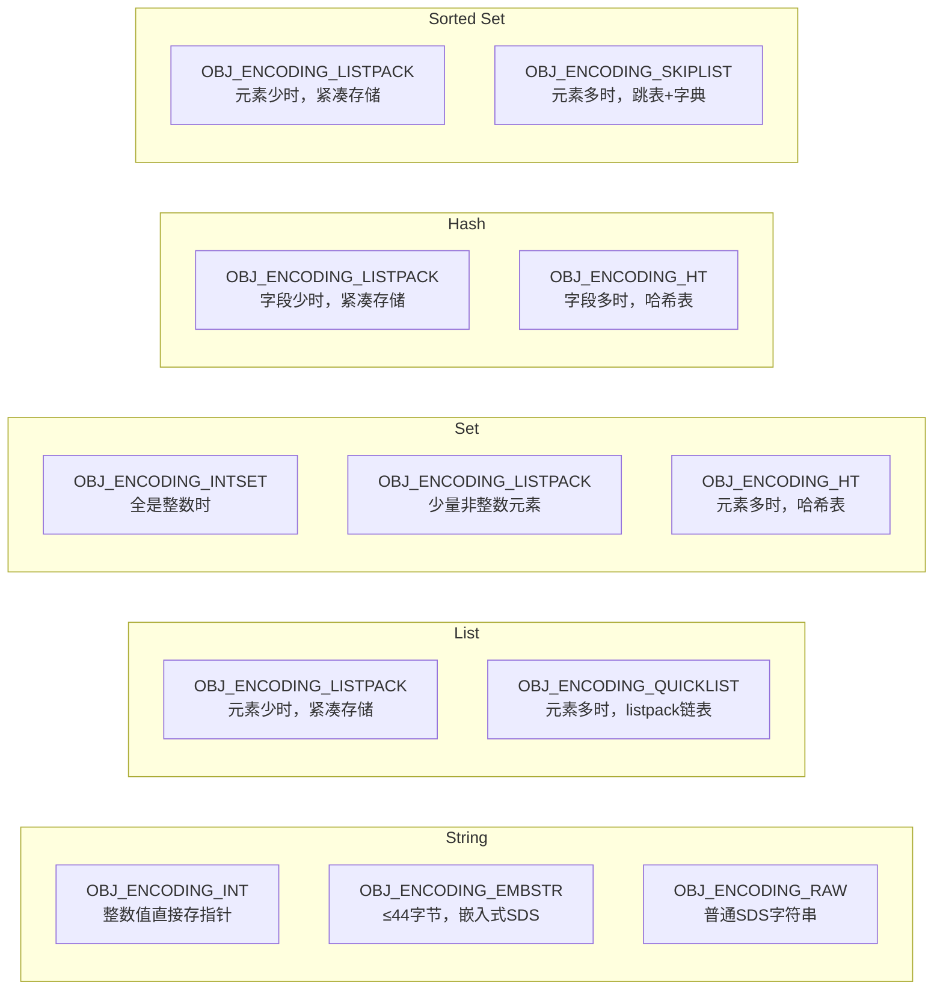
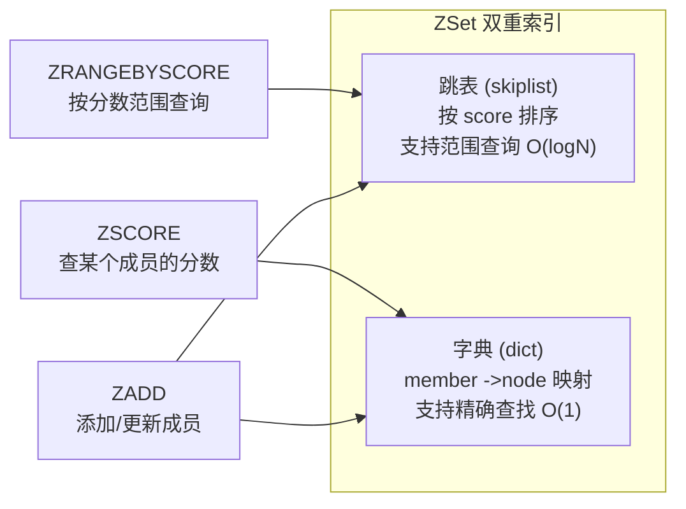

# Chapter 3: 对象系统与五大数据类型

在[上一章：基础数据结构：SDS、链表、字典](02_基础数据结构_sds_链表_字典.md)中，我们学习了 Redis 底层的基础数据结构：SDS、链表、字典等。这些结构就像建筑的砖块和钢筋，但用户直接打交道的并不是它们，而是 Redis 暴露给用户的五大数据类型：String、List、Set、Hash 和 ZSet。那么，Redis 是如何把底层结构和用户类型连接起来的？这就是本章要探讨的**对象系统**。

## 从一个实际问题说起

假设你在设计一个内存数据库，需要支持多种数据类型。一个最朴素的想法是：每种类型用一个独立的 C 结构体表示——字符串用 `char*`，列表用链表，集合用哈希表，等等。

但你很快会发现几个棘手的问题：

1. **如何统一管理？** 数据库的键空间是一个字典，value 部分需要指向各种不同类型的对象。如果每种类型都不一样，字典里存什么？`void*` 吗？那你怎么知道一个指针指向的是字符串还是列表？
2. **如何优化内存？** 一个只有 3 个整数的集合，真的需要用哈希表来存吗？一个只有 5 个字段的哈希表，真的需要一个完整的 dict 结构吗？
3. **如何管理生命周期？** 同一个对象可能被多个地方引用（比如命令参数和数据库存储），什么时候应该释放它？

Redis 的解决方案是引入一个统一的**对象层（redisObject）**，在底层数据结构和用户命令之间建立一个中间抽象。这就像是给每块砖头都套上一个标准化的"包装盒"——盒子上标注了内容物的类型、包装方式和使用计数。

## redisObject 在整体架构中的位置



对象系统扮演的是一个**转接器**的角色：向上为用户命令提供统一的类型检查和操作接口，向下根据数据特征选择最优的底层实现。

## redisObject 对象结构

让我们直接看 Redis 对象的核心定义（`object.h`）：

```c
// src/object.h
struct redisObject {
    unsigned type:4;        // 对象类型（String/List/Set/Hash/ZSet）
    unsigned encoding:4;    // 底层编码方式
    unsigned refcount:23;   // 引用计数
    unsigned iskvobj:1;     // 是否为键值对象（kvobj）
    unsigned metabits:8;    // 元数据位图（过期时间等）
    unsigned lru:24;        // LRU 时间戳或 LFU 计数器
    void *ptr;              // 指向实际数据的指针
};
```

这个结构巧妙地利用了 C 的位域（bitfield），把多个字段压缩在一起。我们逐个拆解：

### 类比理解：图书馆的藏书标签

把 `redisObject` 想象成图书馆每本书上贴的分类标签：

| 字段 | 类比 | 说明 |
|------|------|------|
| `type` | 图书分类（文学/科技/历史） | 标识对象属于哪种数据类型 |
| `encoding` | 装帧方式（平装/精装/电子版） | 同一类型可以有不同的内部表示 |
| `refcount` | 借阅人数 | 有人在借就不能销毁 |
| `lru` | 最近借阅日期 | 用于淘汰长期不用的对象 |
| `ptr` | 书架位置编号 | 指向真正存数据的地方 |

### type：五大类型

```c
// src/server.h
#define OBJ_STRING 0    /* String object. */
#define OBJ_LIST 1      /* List object. */
#define OBJ_SET 2       /* Set object. */
#define OBJ_ZSET 3      /* Sorted set object. */
#define OBJ_HASH 4      /* Hash object. */
```

只用 4 个比特，最多可以表示 16 种类型。目前五大基础类型加上 Stream 和 Module，一共使用了 7 个。

### encoding：底层编码

```c
// src/object.h - 每种类型可以有多种底层实现
#define OBJ_ENCODING_RAW 0        /* SDS 字符串 */
#define OBJ_ENCODING_INT 1        /* 整数直接存在 ptr 里 */
#define OBJ_ENCODING_HT 2         /* 哈希表 (dict) */
#define OBJ_ENCODING_INTSET 6     /* 整数集合 */
#define OBJ_ENCODING_SKIPLIST 7   /* 跳表 + 字典 */
#define OBJ_ENCODING_EMBSTR 8     /* 嵌入式 SDS 字符串 */
#define OBJ_ENCODING_QUICKLIST 9  /* quicklist（listpack 的链表）*/
#define OBJ_ENCODING_LISTPACK 11  /* listpack 紧凑列表 */
```

**这是 Redis 对象系统最精妙的设计之一**：type 和 encoding 的分离。同一种逻辑类型，可以根据数据规模和特征，自动选择不同的底层实现。就像同一本书，读者少的时候用简易平装（省成本），读者多了之后换成精装大字版（重体验）。

## 五大数据类型及其编码

下面这张图展示了每种类型与其可能的编码之间的映射关系：



### 1. String：三种编码

String 是 Redis 中最基础的类型，它有三种编码方式：

**INT 编码**：当字符串的内容是一个整数值（且在 long 范围内），Redis 不分配任何额外内存，直接把整数值存在 `ptr` 指针里！

```c
// src/object.c - 整数编码，ptr 不再是指针，而是整数值本身
o = createObject(OBJ_STRING, NULL);
o->encoding = OBJ_ENCODING_INT;
o->ptr = (void*)((long)value);  // 把整数"假装"成指针
```

这个技巧利用了一个事实：在 64 位系统上，`void*` 有 8 个字节，足够存放一个 `long` 整数。这样连一个字节的额外内存都不需要分配。

**EMBSTR 编码**：当字符串不超过 44 字节时，Redis 把 `redisObject` 和 SDS 字符串分配在同一块连续内存中：

```
EMBSTR 内存布局（单次分配，≤64字节，恰好一个 jemalloc 内存块）:
+------------------+-------------------+
| redisObject (16B)| sdshdr8 + data    |
| type=0 enc=8     | "hello world" \0  |
| refcount=1       |                   |
| ptr ───────────->| (紧挨着 robj)      |
+------------------+-------------------+
           一次 malloc，一块连续内存
```

为什么是 44 字节？来看源码中的注释：

```c
// src/object.c
/* The current limit of 44 is chosen so that the biggest string object
 * we allocate as EMBSTR will still fit into the 64 byte arena of jemalloc. */
#define OBJ_ENCODING_EMBSTR_SIZE_LIMIT 44
```

16（robj）+ 3（sdshdr8 头部）+ 44（数据）+ 1（null terminator）= 64 字节，刚好塞进 jemalloc 的 64 字节内存槽。这种对内存分配器的感知，是系统级编程的典型手法。

**RAW 编码**：超过 44 字节的字符串，`redisObject` 和 SDS 分别独立分配。

```c
// src/object.c - 根据长度自动选择编码
robj *createStringObject(const char *ptr, size_t len) {
    if (len <= OBJ_ENCODING_EMBSTR_SIZE_LIMIT)
        return createEmbeddedStringObject(ptr, len);  // EMBSTR
    else
        return createRawStringObject(ptr, len);        // RAW
}
```

三种编码的对比：

```
INT:     robj.ptr = 12345 (直接存值，零额外内存)
                    ↑ 不是指针！是整数本身

EMBSTR:  [  robj  |  sdshdr + "hello"  ]  (一次分配，一块内存)
              ptr ──->↑

RAW:     [  robj  ]    [  sdshdr + "a very long string..."  ]
              ptr ────->↑  (两次分配，两块内存)
```

### 2. List：listpack 与 quicklist

列表类型在元素较少时使用 listpack（紧凑列表），元素较多时升级为 quicklist。

```c
// src/object.c - 创建列表对象
robj *createListListpackObject(void) {
    unsigned char *lp = lpNew(0);
    robj *o = createObject(OBJ_LIST, lp);
    o->encoding = OBJ_ENCODING_LISTPACK;  // 初始用 listpack
    return o;
}
```

当列表增长超过阈值时，会自动从 listpack 转为 quicklist：

```c
// src/t_list.c - listpack ->quicklist 的转换
static void listTypeTryConvertListpack(robj *o, ...) {
    serverAssert(o->encoding == OBJ_ENCODING_LISTPACK);
    // 如果大小超过 list_max_listpack_size 限制...
    if (quicklistNodeExceedsLimit(server.list_max_listpack_size,
            lpBytes(o->ptr) + add_bytes,
            lpLength(o->ptr) + add_length))
    {
        // 创建 quicklist 并迁移数据
        quicklist *ql = quicklistNew(server.list_max_listpack_size,
                                     server.list_compress_depth);
        if (lpLength(o->ptr))
            quicklistAppendListpack(ql, o->ptr);  // 把 listpack 整体挂到 quicklist 上
        o->ptr = ql;
        o->encoding = OBJ_ENCODING_QUICKLIST;  // 切换编码
    }
}
```

有意思的是，缩小时也能反向转换——从 quicklist 退回到 listpack：

```c
// src/t_list.c - quicklist ->listpack 的转换（当缩小到只剩一个节点）
static void listTypeTryConvertQuicklist(robj *o, int shrinking, ...) {
    quicklist *ql = o->ptr;
    // 只有当 quicklist 只剩一个节点，且大小低于阈值的一半时，才降级
    if (ql->len != 1 || ql->head->container != QUICKLIST_NODE_CONTAINER_PACKED)
        return;
    // 缩小时用更严格的阈值（一半），避免在临界点反复转换
    if (shrinking) { sz_limit /= 2; count_limit /= 2; }
    // ...
    o->ptr = ql->head->entry;  // 直接取出 listpack
    o->encoding = OBJ_ENCODING_LISTPACK;
}
```

注意 `shrinking` 时阈值减半的设计——这是为了避免在临界点反复转换编码（一种称为"抖动"的问题）。

### 3. Set：intset、listpack 与 hashtable

集合类型有三种编码，是五大类型中编码最丰富的：

```c
// src/t_set.c - 根据数据特征选择初始编码
robj *setTypeCreate(sds value, size_t size_hint) {
    // 条件1：值是整数 + 预期元素数量少 ->intset
    if (isSdsRepresentableAsLongLong(value, NULL) == C_OK
        && size_hint <= server.set_max_intset_entries)
        return createIntsetObject();

    // 条件2：预期元素数量少 ->listpack
    if (size_hint <= server.set_max_listpack_entries)
        return createSetListpackObject();

    // 条件3：其他情况 ->哈希表
    robj *o = createSetObject();
    dictExpand(o->ptr, size_hint);
    return o;
}
```

集合的编码转换路径是：

```
intset ──->listpack ──->hashtable
  │                        ↑
  └────────────────────────┘
     (插入非整数元素或超过阈值时)
```

当 intset 中插入了一个非整数元素时，会先检查能否转为 listpack，不行再转为 hashtable：

```c
// src/t_set.c - intset 遇到非整数元素时的处理（简化）
} else if (set->encoding == OBJ_ENCODING_INTSET) {
    long long value;
    if (string2ll(str, len, &value)) {
        // 还是整数，继续用 intset
        set->ptr = intsetAdd(set->ptr, value, &success);
        if (success) maybeConvertIntset(set);  // 检查是否超过大小限制
    } else {
        // 非整数！需要转换编码
        if (intsetLen(set->ptr) < server.set_max_listpack_entries &&
            len <= server.set_max_listpack_value)
        {
            setTypeConvertAndExpand(set, OBJ_ENCODING_LISTPACK, ...);
        } else {
            setTypeConvertAndExpand(set, OBJ_ENCODING_HT, ...);
        }
    }
}
```

### 4. Hash：listpack 与 hashtable

哈希表类型默认使用 listpack 存储，当字段数量超过 `hash_max_listpack_entries`（默认 128）或单个值超过 `hash_max_listpack_value`（默认 64 字节）时，升级为 dict。

```c
// src/object.c - 创建哈希对象，默认 listpack
robj *createHashObject(void) {
    unsigned char *zl = lpNew(0);
    robj *o = createObject(OBJ_HASH, zl);
    o->encoding = OBJ_ENCODING_LISTPACK;  // 初始用 listpack
    return o;
}
```

listpack 中，哈希的字段和值是**交替存储**的：

```
Hash 在 listpack 中的存储方式：
+-------+--------+-------+--------+-------+--------+-----+
| field1 | value1 | field2 | value2 | field3 | value3 | END |
+-------+--------+-------+--------+-------+--------+-----+

例如 HSET user name "Alice" age "30"：
+------+-------+-----+----+-----+
| name | Alice | age | 30 | END |
+------+-------+-----+----+-----+
```

查找时需要线性扫描，但因为元素数量少，这比维护一个完整的哈希表更省内存、更快（缓存友好）。

### 5. ZSet：listpack 与 skiplist+dict

有序集合是最复杂的类型。小规模时用 listpack，大规模时用**跳表和字典的组合**。

```c
// src/object.c - 创建有序集合对象（大规模）
robj *createZsetObject(void) {
    zset *zs = zmalloc(sizeof(*zs));
    zs->dict = dictCreate(&zsetDictType);  // 字典：member ->score 的映射
    zs->zsl = zslCreate();                  // 跳表：按 score 排序
    // ...
    o->encoding = OBJ_ENCODING_SKIPLIST;
    return o;
}
```

为什么有序集合需要**同时**用跳表和字典两种结构？因为它需要同时支持两种操作模式：



- `ZSCORE key member`：需要根据 member 快速查找 score，用**字典** O(1)
- `ZRANGEBYSCORE key min max`：需要按 score 范围查询，用**跳表** O(logN + M)

看一下 `t_zset.c` 头部的注释，说得很清楚：

```c
// src/t_zset.c
/* ZSETs are ordered sets using two data structures to hold the same elements
 * in order to get O(log(N)) INSERT and REMOVE operations into a sorted
 * data structure.
 *
 * The elements are added to a hash table mapping Redis objects to scores.
 * At the same time the elements are added to a skip list mapping scores
 * to Redis objects (so objects are sorted by scores in this "view"). */
```

为了节省内存，跳表节点中的 SDS 字符串是**嵌入式**的——member 字符串直接存储在跳表节点的分配块里，字典不再独立存储 key，而是通过回调函数从跳表节点中提取：

```c
// src/t_zset.c - 字典从跳表节点中提取 key，避免重复存储
dictType zsetDictType = {
    dictSdsHash,
    // ...
    .no_value = 1,      // 字典不存储 value（只存跳表节点指针）
    .keyFromStoredKey = zslGetNodeElementForDict,  // 从节点提取 sds
};
```

## 编码转换机制

编码转换是 Redis 对象系统的核心智慧之一。基本原则是：**数据小的时候省内存，数据大了换速度**。

### 转换时机总览

```mermaid
graph TD
    subgraph String
        S1["INT"] -->|"追加操作<br/>不再是整数"| S2["RAW"]
        S3["EMBSTR"] -->|"修改操作<br/>(EMBSTR不可变)"| S2
        S2 -->|"tryObjectEncoding<br/>值能表示为整数"| S1
        S2 -->|"tryObjectEncoding<br/>值 ≤ 44字节"| S3
    end

    subgraph List
        L1["LISTPACK"] -->|"元素数/大小<br/>超过阈值"| L2["QUICKLIST"]
        L2 -->|"缩小到只剩<br/>一个节点"| L1
    end

    subgraph Set
        SE1["INTSET"] -->|"插入非整数<br/>元素"| SE2["LISTPACK"]
        SE1 -->|"元素数超过<br/>max_intset_entries"| SE3["HT"]
        SE2 -->|"元素数/大小<br/>超过阈值"| SE3
    end

    subgraph Hash
        H1["LISTPACK"] -->|"字段数/值大小<br/>超过阈值"| H2["HT"]
    end

    subgraph ZSet
        Z1["LISTPACK"] -->|"元素数/值大小<br/>超过阈值"| Z2["SKIPLIST+DICT"]
    end
```



### String 的编码优化：tryObjectEncoding

Redis 在存储字符串值时，会主动尝试优化编码：

```c
// src/object.c - 尝试将字符串转为更紧凑的编码
robj *tryObjectEncodingEx(robj *o, int try_trim) {
    long value;
    sds s = o->ptr;
    size_t len;

    // 只对 RAW 或 EMBSTR 编码的字符串尝试优化
    if (!sdsEncodedObject(o)) return o;
    // 共享对象不优化（可能在多处使用）
    if (o->refcount > 1) return o;

    len = sdslen(s);
    // 尝试 1：能否表示为整数？
    if (len <= 20 && string2l(s, len, &value)) {
        if (o->encoding == OBJ_ENCODING_RAW) {
            sdsfree(o->ptr);             // 释放 SDS
            o->encoding = OBJ_ENCODING_INT;
            o->ptr = (void*) value;      // 直接存整数
            return o;
        }
        // EMBSTR 的情况：创建新的 INT 对象
    }

    // 尝试 2：RAW 但长度 ≤ 44，可以降级为 EMBSTR
    if (len <= OBJ_ENCODING_EMBSTR_SIZE_LIMIT) {
        if (o->encoding == OBJ_ENCODING_EMBSTR) return o;
        robj *emb = createEmbeddedStringObject(s, sdslen(s));
        decrRefCount(o);
        return emb;
    }

    // 尝试 3：至少把 SDS 中多余的空间释放掉
    if (try_trim) trimStringObjectIfNeeded(o, 0);
    return o;
}
```

这个函数体现了 Redis 对内存的极致追求：能用整数就不用字符串，能嵌入就不独立分配，实在不行至少把尾巴的空闲空间裁掉。

### 共享整数对象池

对于 0 到 9999 的整数值，Redis 在启动时预创建了共享对象：

```c
// src/object.c
if (value >= 0 && value < OBJ_SHARED_INTEGERS && flag == LL2STROBJ_AUTO) {
    o = shared.integers[value];  // 直接返回预创建的共享对象
}
```

```
OBJ_SHARED_INTEGERS = 10000

shared.integers[0] ──->robj{type=STRING, encoding=INT, ptr=0, refcount=SHARED}
shared.integers[1] ──->robj{type=STRING, encoding=INT, ptr=1, refcount=SHARED}
...
shared.integers[9999] ──->robj{type=STRING, encoding=INT, ptr=9999, refcount=SHARED}
```

当你执行 `SET counter 42` 时，value 部分直接指向预分配的 `shared.integers[42]`，不需要任何新的内存分配。这对于计数器、标志位等场景极为高效。

## 引用计数与内存管理

Redis 使用引用计数来管理对象生命周期。来看核心实现：

```c
// src/object.c
void incrRefCount(robj *o) {
    if (o->refcount < OBJ_FIRST_SPECIAL_REFCOUNT - 1) {
        o->refcount++;  // 普通对象，简单 +1
    } else {
        // 共享对象（SHARED_REFCOUNT）不修改
        // 栈上对象（STATIC_REFCOUNT）不能增加引用
    }
}

void decrRefCount(robj *o) {
    if (o->refcount == OBJ_SHARED_REFCOUNT)
        return;  // 共享对象永不释放

    if (--(o->refcount) == 0) {
        // 引用归零，释放对象！
        // 根据 type 调用对应的释放函数
        switch(o->type) {
        case OBJ_STRING: freeStringObject(o); break;
        case OBJ_LIST:   freeListObject(o);   break;
        case OBJ_SET:    freeSetObject(o);     break;
        case OBJ_ZSET:   freeZsetObject(o);    break;
        case OBJ_HASH:   freeHashObject(o);    break;
        // ...
        }
        zfree(alloc);  // 最后释放 robj 本身
    }
}
```

三种特殊的引用计数值：

| 引用计数 | 含义 | 例子 |
|---------|------|------|
| 正常值（1~N） | 真实的引用数量 | 数据库中的普通对象 |
| `OBJ_SHARED_REFCOUNT` | 共享对象，永不释放 | `shared.integers[0..9999]` |
| `OBJ_STATIC_REFCOUNT` | 栈上分配，不参与引用计数 | 命令处理中的临时对象 |

### 释放时的分发机制

当引用归零时，`decrRefCount` 根据 `type` 字段分发到对应的释放函数。每个释放函数又根据 `encoding` 决定具体怎么释放：

```c
// src/object.c - 以 Set 为例
void freeSetObject(robj *o) {
    switch (o->encoding) {
    case OBJ_ENCODING_HT:
        dictRelease((dict*) o->ptr);      // 释放哈希表
        break;
    case OBJ_ENCODING_INTSET:
    case OBJ_ENCODING_LISTPACK:
        zfree(o->ptr);                     // intset/listpack 是连续内存，直接 free
        break;
    }
}
```

这是一个典型的**两级分发**模式：先按 type 选函数，再按 encoding 选路径。

## 一个端到端的例子

让我们跟踪一个具体场景，看对象系统如何运作。

**场景**：用户依次执行以下命令：

```
SET counter 100
INCR counter        ->101
SET name "Alice"
LPUSH mylist a b c
SADD myset 1 2 3
```

每条命令背后的对象变化：

```
1. SET counter 100
   ->创建 robj{type=STRING, encoding=INT, ptr=100}
   ->100 < 10000，直接使用 shared.integers[100]

2. INCR counter ->101
   ->需要独立的对象（不能修改共享对象）
   ->创建 robj{type=STRING, encoding=INT, ptr=101}

3. SET name "Alice"
   ->"Alice" 长度=5，≤ 44
   ->创建 EMBSTR 编码：robj 和 SDS 在一块连续内存中

4. LPUSH mylist a b c
   ->创建 robj{type=LIST, encoding=LISTPACK}
   ->3个元素，listpack 绰绰有余
   ->listpack 内存布局: [c][b][a][END]

5. SADD myset 1 2 3
   ->全是整数，创建 robj{type=SET, encoding=INTSET}
   ->intset 内存布局: {encoding=INT16, length=3, contents=[1,2,3]}
```

如果接下来执行 `SADD myset "hello"`：

```
6. SADD myset "hello"
   ->当前编码 INTSET，但 "hello" 不是整数！
   ->触发编码转换：INTSET ->LISTPACK（因为元素 ≤ set_max_listpack_entries）
   ->listpack 内存布局: [1][2][3][hello][END]
```

如果继续添加大量元素使其超过 `set_max_listpack_entries`：

```
7. SADD myset e1 e2 ... e200
   ->元素数量超过阈值（默认128）
   ->触发编码转换：LISTPACK ->HT
   ->数据迁移到哈希表中
```

## 设计决策分析

### 为什么要有 redisObject 抽象层？

直接让字典存储底层数据结构的指针不行吗？当然可以，但你会失去：

1. **类型安全**：没有 type 字段，`GET` 命令无法拒绝对列表执行字符串操作
2. **编码透明**：没有 encoding 字段，上层代码需要自己判断数据用的是哪种结构
3. **内存管理**：没有 refcount，你需要手动跟踪每个对象的生命周期
4. **淘汰策略**：没有 lru 字段，maxmemory 策略无法实现

16 字节的 overhead 换来了巨大的设计灵活性。

### 为什么同一类型要支持多种编码？

核心原因是**内存与速度的动态平衡**：

```
数据量小                              数据量大
  ←─────────────────────────────────────→
  省内存（紧凑编码）              重性能（标准编码）

  intset / listpack                dict / skiplist
  O(n) 查找但内存极小              O(1)/O(logN) 查找但内存大
  缓存友好（连续内存）              对缓存不友好（指针跳转）
```

以一个包含 5 个整数的集合为例：
- **intset**：大约 `4 + 4 + 5 * 8 = 48` 字节，一块连续内存
- **dict**：每个 dictEntry 需要 `key + next + metadata`，加上哈希表数组本身，轻松超过 200 字节

当数据量很小时，O(n) 线性扫描和 O(1) 哈希查找的实际差距微乎其微（几十个元素的遍历可能比一次哈希计算还快），但内存开销的差距是数倍的。

### 为什么 EMBSTR 是不可变的？

EMBSTR 编码把 `robj` 和 SDS 分配在一块连续内存中。如果修改 SDS 导致长度变化，可能需要 `realloc`，这会使整个内存块的地址改变，导致指向 `robj` 的指针失效。

因此，Redis 的策略是：对 EMBSTR 对象的任何修改操作，都先将其转为 RAW 编码，再执行修改。

### kvobj：键和值的一体化

在最新版 Redis 中，数据库键空间存储的不再是简单的 `robj`，而是 `kvobj`——一个把键名嵌入到对象自身的变体：

```c
// src/object.h
typedef struct redisObject kvobj;  // kvobj 和 robj 是同一个结构体

// kvobj 的内存布局：
// +------------+-----------+------------------+-------------------+
// | [metadata] | robj (16B)| key-hdr-size (1B)| sdshdr "mykey" \0 |
// +------------+-----------+------------------+-------------------+
//              ↑
//              kvobjCreate() 返回的指针
```

这种设计把键名和值对象放在一次分配中，减少了指针跳转和内存碎片。元数据（如过期时间）被放在对象前面，通过 `metabits` 位图来标识哪些元数据存在。

## 小结

本章我们深入了解了 Redis 对象系统——连接用户命令和底层数据结构的桥梁：

- **redisObject 结构**：用 type、encoding、refcount、lru、ptr 五个字段，统一管理所有数据类型
- **五大数据类型的多种编码**：String（INT/EMBSTR/RAW）、List（listpack/quicklist）、Set（intset/listpack/hashtable）、Hash（listpack/hashtable）、ZSet（listpack/skiplist+dict）
- **编码转换机制**：数据小时用紧凑编码省内存，数据大时自动升级到标准编码保性能；缩小时使用更严格的阈值避免抖动
- **引用计数**：通过 refcount 管理对象生命周期，共享对象和栈对象使用特殊标记
- **设计哲学**：16 字节的对象头开销，换来了类型安全、编码透明、自动优化和统一的内存管理

对象系统让 Redis 能在"数据量小时极致省内存"和"数据量大时极致追性能"之间自动切换，这是 Redis 能以单线程架构支撑高并发场景的关键设计之一。

当我们通过对象系统向 Redis 写入了数据，下一个关键问题就是：如果 Redis 进程崩溃了怎么办？内存中的数据不就全丢了吗？下一章我们将探讨 Redis 的持久化机制——[持久化：RDB 与 AOF](04_持久化_rdb与aof.md)，看看 Redis 如何把内存中的数据安全地保存到磁盘上。

[上一章：基础数据结构：SDS、链表、字典](02_基础数据结构_sds_链表_字典.md) | [下一章：持久化：RDB 与 AOF](04_持久化_rdb与aof.md)
