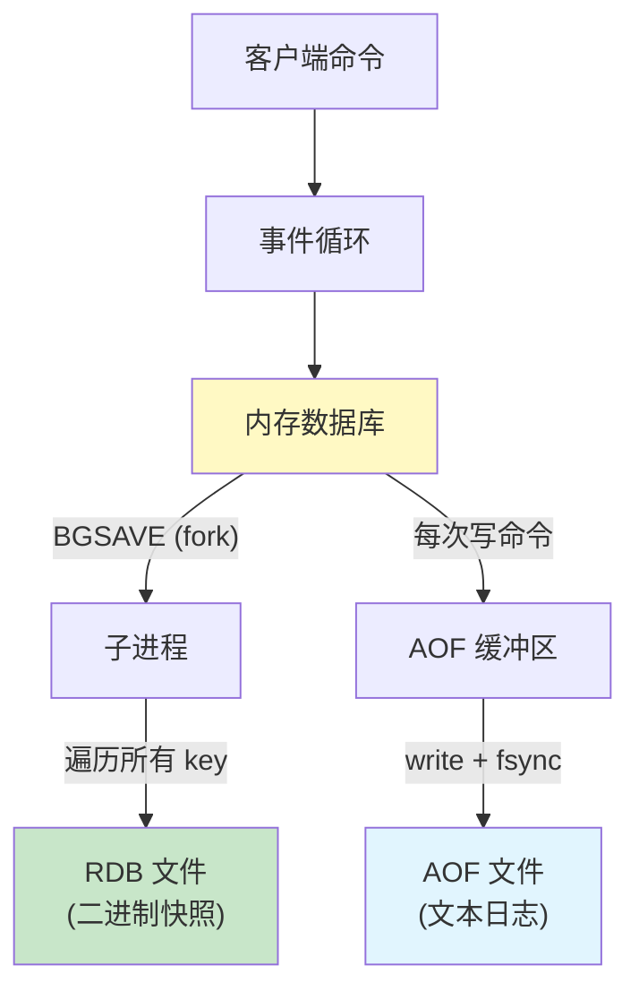
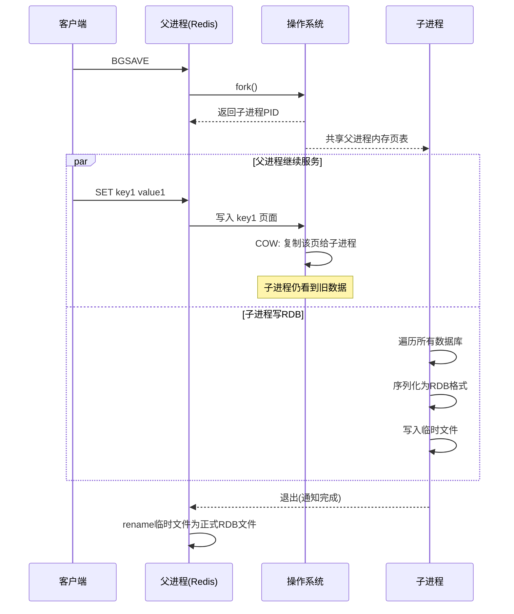
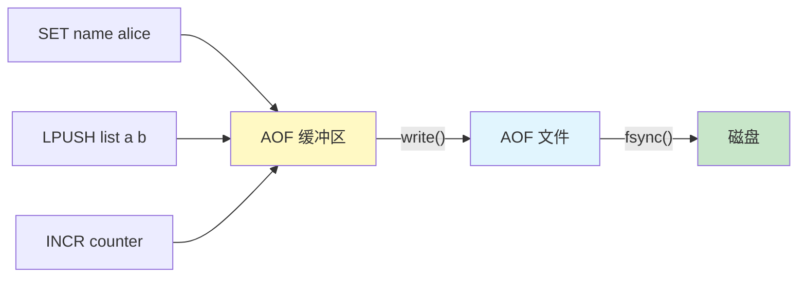
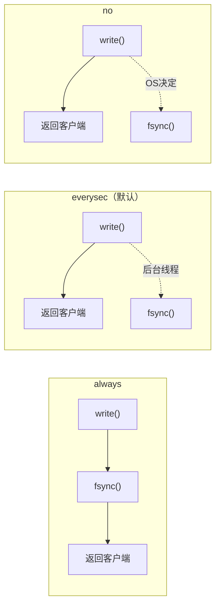
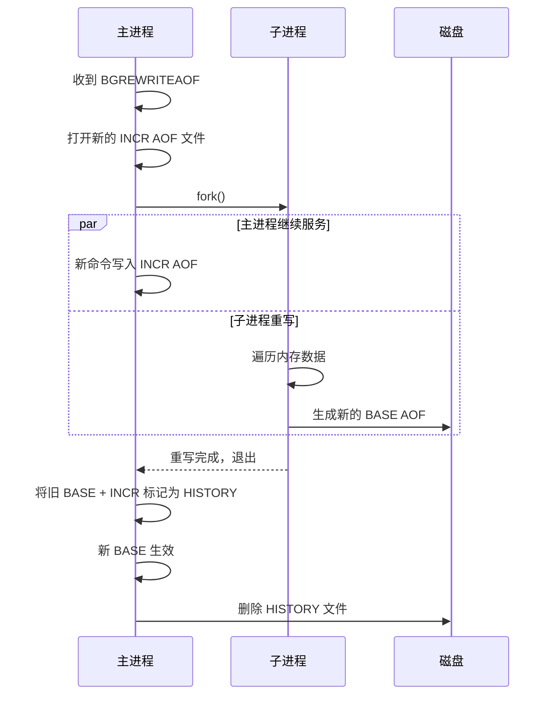
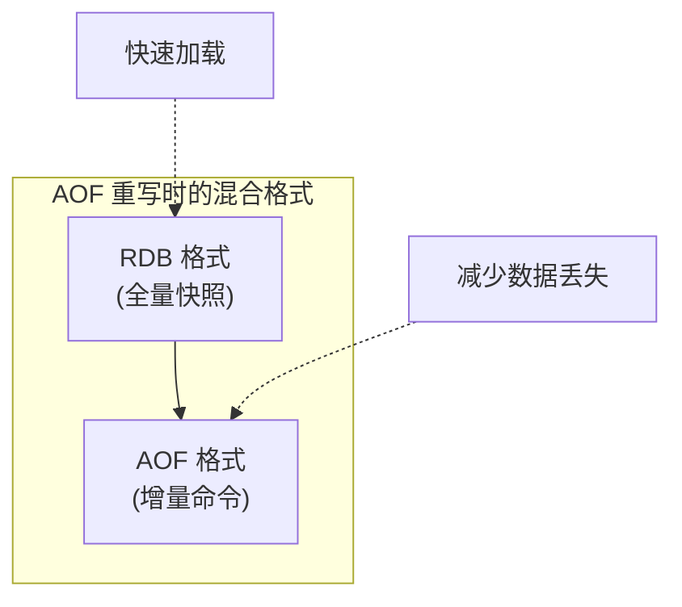

# Chapter 4: 持久化：RDB 与 AOF

在[上一章：对象系统与五大数据类型](03_对象系统_五大数据类型.md)中，我们了解了 Redis 如何在内存中组织丰富的数据结构。内存中的数据虽然快如闪电，但有一个致命弱点——断电即失。本章我们来探究 Redis 如何把内存中的数据安全地保存到磁盘上，同时尽量不影响正常服务。

## 从一个实际问题说起

假设你运营一个电商平台，用 Redis 存储购物车、库存缓存、秒杀计数器等关键数据。某天凌晨 3 点，服务器意外重启了。

如果 Redis 只是一个纯内存数据库，重启后所有数据将荡然无存——用户的购物车清空了，库存数据丢了，秒杀活动的状态全没了。这显然不可接受。

但如果每次写入都同步写磁盘，Redis 引以为傲的高性能就没了——每秒 10 万次操作变成每秒几百次，跟普通数据库没什么区别。

**核心矛盾：既要内存的速度，又要磁盘的安全。** 这就是持久化要解决的问题。

Redis 给出了两种截然不同的方案，以及它们的组合：

| 方案 | 类比 | 核心思路 |
|------|------|----------|
| RDB（快照） | 给房间拍照 | 某个时间点的完整快照 |
| AOF（追加日志） | 记流水账日记 | 记录每一次操作 |
| 混合持久化 | 拍照 + 之后记日记 | 先拍一张照，然后记录增量操作 |

## RDB 在整体架构中的位置



RDB 和 AOF 是两条独立的持久化路径。RDB 偶尔"拍一张全景照"，AOF 则实时"记录每一笔操作"。我们先从 RDB 说起。

## RDB 快照持久化

### 基本思路：给内存拍照

RDB 的思路很朴素：在某个时间点，把内存中的所有数据序列化成一个二进制文件。恢复时，直接把这个文件加载回内存即可。

就像搬家时给房间拍一张照片——照片记录了那一刻房间里所有物品的位置。之后即使房间被清空了，看着照片也能把东西原样摆回去。

### 触发方式

RDB 快照可以通过两种方式触发：

- **SAVE**：在主进程中直接执行，会阻塞所有客户端请求（生产环境几乎不用）
- **BGSAVE**：fork 出子进程在后台执行，主进程继续服务客户端（推荐方式）

此外，Redis 还支持自动触发。在配置文件中可以设置保存条件：

```c
// server.h - 自动保存的触发条件
struct saveparam {
    time_t seconds;   // 时间窗口（秒）
    int changes;      // 在此期间发生的修改次数
};
```

例如配置 `save 900 1` 表示"900 秒内如果至少有 1 次修改，就自动触发 BGSAVE"。Redis 在 `serverCron` 定时任务中检查这些条件。

### BGSAVE 的核心：fork() 与写时复制

BGSAVE 是 Redis 持久化的精髓所在。它的核心问题是：**如何在不阻塞服务的情况下，获取一份一致的内存快照？**

答案是利用操作系统的 `fork()` 系统调用和**写时复制（Copy-On-Write, COW）**机制。

```c
// rdb.c - rdbSaveBackground()
int rdbSaveBackground(int req, char *filename,
                      rdbSaveInfo *rsi, int rdbflags) {
    pid_t childpid;

    if (hasActiveChildProcess()) return C_ERR;  // 已有子进程在运行，拒绝
    server.dirty_before_bgsave = server.dirty;
    server.lastbgsave_try = time(NULL);

    // 关键：fork 创建子进程
    if ((childpid = redisFork(CHILD_TYPE_RDB)) == 0) {
        /* 子进程：执行实际的 RDB 保存 */
        redisSetProcTitle("redis-rdb-bgsave");
        retval = rdbSave(req, filename, rsi, rdbflags);
        if (retval == C_OK) {
            sendChildCowInfo(CHILD_INFO_TYPE_RDB_COW_SIZE, "RDB");
        }
        exitFromChild((retval == C_OK) ? 0 : 1, 0);
    } else {
        /* 父进程：记录状态，继续服务 */
        serverLog(LL_NOTICE,
            "Background saving started by pid %ld",
            (long) childpid);
        server.rdb_save_time_start = time(NULL);
        return C_OK;
    }
}
```

为什么 `fork()` 这么巧妙？让我们用一个比喻来理解：

> 想象你有一本很厚的相册（内存数据）。你需要把它复印一份（保存到磁盘），但你同时还在不断往相册里贴新照片（处理客户端写入）。
>
> `fork()` 相当于瞬间复制了一份相册的**目录索引**（页表），而不是复制所有照片。子进程拿着这份索引去慢慢复印，父进程继续贴新照片。
>
> 当父进程要修改某一页时，操作系统才会真正复制那一页（写时复制），确保子进程看到的仍然是 fork 那一刻的数据。



这就是 fork + COW 的精妙之处：

1. **fork 瞬间完成**：只复制页表，不复制实际数据，耗时极短
2. **子进程看到一致快照**：fork 那一刻的内存状态被"冻结"
3. **父进程不受影响**：继续处理客户端请求
4. **内存开销可控**：只有被修改的页面才会被复制

### rdbSaveRio：真正写入数据的地方

子进程调用 `rdbSave` -> `rdbSaveInternal` -> `rdbSaveRio` 来完成实际的序列化：

```c
// rdb.c - rdbSaveRio()
int rdbSaveRio(int req, rio *rdb, int *error,
               int rdbflags, rdbSaveInfo *rsi) {
    char magic[10];
    uint64_t cksum;
    int j;

    // 1. 写入魔数 "REDIS" + 版本号
    snprintf(magic, sizeof(magic), "REDIS%04d", RDB_VERSION);
    if (rdbWriteRaw(rdb, magic, 9) == -1) goto werr;

    // 2. 写入辅助信息（Redis版本、创建时间等）
    if (rdbSaveInfoAuxFields(rdb, rdbflags, rsi) == -1) goto werr;

    // 3. 逐个数据库写入数据
    for (j = 0; j < server.dbnum; j++) {
        if (rdbSaveDb(rdb, j, rdbflags, &key_counter, &skipped) == -1)
            goto werr;
    }

    // 4. 写入 EOF 标记
    if (rdbSaveType(rdb, RDB_OPCODE_EOF) == -1) goto werr;

    // 5. 写入 CRC64 校验和
    cksum = rdb->cksum;
    memrev64ifbe(&cksum);
    if (rioWrite(rdb, &cksum, 8) == 0) goto werr;

    return C_OK;
}
```

整个流程清晰明了：先写文件头，再逐库写入键值对，最后写入校验和。

## RDB 文件格式

RDB 是一种紧凑的二进制格式。我们用 ASCII 布局图来展示它的整体结构：

```text
+-------+-------------+-------+-------+-----+-------+-----------+
| REDIS | RDB-VERSION | AUX   | DB 0  | ... | DB N  | EOF | CRC |
| 0013  |   (4字节)   | FIELDS|       |     |       |     |     |
+-------+-------------+-------+-------+-----+-------+-----+-----+
   5B        4B         变长     变长          变长    1B     8B

每个 DB 的结构:
+----------+--------+---------+------+------+------+
| SELECTDB | DB-NUM | RESIZEDB| KV 1 | KV 2 | ...  |
+----------+--------+---------+------+------+------+
    1B       变长       变长

每个 KV 的结构:
+----------+------+-----+-------+
| [EXPIRE] | TYPE | KEY | VALUE |
+----------+------+-----+-------+
  可选9B     1B    变长   变长
```

`TYPE` 在 `rdb.h` 里定义，例如：

| 编码 | 含义 |
|------|------|
| `0` | `STRING` |
| `1` | `LIST` |
| `2` | `SET` |
| `3` | `ZSET` |
| `4` | `HASH` |
| `11` | `SET_INTSET` |
| `16` | `HASH_LISTPACK` |

RDB 文件格式的设计体现了几个原则：

**紧凑性**：Redis 使用变长编码来压缩长度字段。短的长度只需 1 字节，长的才需要更多：

```c
// rdb.h - 长度编码规则
// 00|XXXXXX          => 6位长度(0-63)，1字节
// 01|XXXXXX XXXXXXXX => 14位长度(64-16383)，2字节
// 10|000000 [32位]    => 32位长度，5字节
// 10|000001 [64位]    => 64位长度，9字节
// 11|XXXXXX          => 特殊编码（整数或压缩字符串）
```

```c
// rdb.c - 保存变长编码的长度
int rdbSaveLen(rio *rdb, uint64_t len) {
    unsigned char buf[2];

    if (len < (1<<6)) {
        // 最常见：6位够用，只占1字节
        buf[0] = (len & 0xFF) | (RDB_6BITLEN << 6);
        if (rdbWriteRaw(rdb, buf, 1) == -1) return -1;
    } else if (len < (1<<14)) {
        // 14位编码，2字节
        buf[0] = ((len >> 8) & 0xFF) | (RDB_14BITLEN << 6);
        buf[1] = len & 0xFF;
        if (rdbWriteRaw(rdb, buf, 2) == -1) return -1;
    }
    // ... 32位和64位的情况 ...
}
```

大多数 key 的名字长度都在 63 字节以内，所以只需 1 字节就能编码长度。这种"常见情况走快速路径"的设计在 Redis 中处处可见。

**压缩**：对于较长的字符串，Redis 会尝试 LZF 压缩：

```c
// rdb.c - 当字符串长度 > 4 字节时尝试压缩
ssize_t rdbSaveLzfStringObject(rio *rdb, unsigned char *s,
                                size_t len) {
    if (len <= 4) return 0;  // 太短不值得压缩
    outlen = len - 4;
    comprlen = lzf_compress(s, len, out, outlen);
    if (comprlen == 0) {     // 压缩后更大，放弃
        zfree(out);
        return 0;
    }
    // 写入压缩后的数据
    nwritten = rdbSaveLzfBlob(rdb, out, comprlen, len);
    return nwritten;
}
```

**整数优化**：能表示为整数的字符串会被编码为 1/2/4 字节的整数：

```c
// rdb.c - 整数编码
int rdbEncodeInteger(long long value, unsigned char *enc) {
    if (value >= -(1<<7) && value <= (1<<7)-1) {
        enc[0] = (RDB_ENCVAL<<6) | RDB_ENC_INT8;
        enc[1] = value & 0xFF;
        return 2;   // "100" 这样的字符串只需 2 字节
    } else if (value >= -(1<<15) && value <= (1<<15)-1) {
        // ... 16位整数编码，3字节
    } else if (value >= -((long long)1<<31)
               && value <= ((long long)1<<31)-1) {
        // ... 32位整数编码，5字节
    }
    return 0;  // 超出范围，不做整数编码
}
```

像 `SET counter 42` 中的值 "42"，在 RDB 文件中只占 2 字节（类型标记 + 1 字节整数），而不是字符串 "42" 的 2 字节加长度前缀。

## AOF 追加日志

### 基本思路：记流水账

如果说 RDB 是"拍照"，AOF 就是"记日记"——把每一条写命令都追加记录到日志文件中。恢复时，只要把日记从头到尾"重放"一遍，就能恢复到宕机前的状态。



### feedAppendOnlyFile：命令如何进入 AOF

当 Redis 执行一条写命令后，会调用 `feedAppendOnlyFile` 将命令追加到 AOF 缓冲区：

```c
// aof.c - feedAppendOnlyFile()
void feedAppendOnlyFile(int dictid, robj **argv, int argc) {
    sds buf = sdsempty();

    // 如果切换了数据库，先写一条 SELECT 命令
    if (dictid != -1 && dictid != server.aof_selected_db) {
        char seldb[64];
        snprintf(seldb, sizeof(seldb), "%d", dictid);
        buf = sdscatprintf(buf,
            "*2\r\n$6\r\nSELECT\r\n$%lu\r\n%s\r\n",
            (unsigned long)strlen(seldb), seldb);
        server.aof_selected_db = dictid;
    }

    // 将命令转换为 RESP 协议格式并追加
    buf = catAppendOnlyGenericCommand(buf, argc, argv);

    // 追加到 AOF 缓冲区（不是直接写文件）
    if (server.aof_state == AOF_ON) {
        server.aof_buf = sdscatlen(server.aof_buf,
                                    buf, sdslen(buf));
    }
    sdsfree(buf);
}
```

AOF 文件中存储的是 RESP 协议格式的文本。例如 `SET name alice` 在 AOF 中的样子：

```
*3\r\n         -- 3个参数
$3\r\n         -- 第1个参数长度为3
SET\r\n        -- 第1个参数
$4\r\n         -- 第2个参数长度为4
name\r\n       -- 第2个参数
$5\r\n         -- 第3个参数长度为5
alice\r\n      -- 第3个参数
```

这种文本格式的好处是：人类可读、便于调试，而且与 Redis 客户端协议完全一致。

### 三种 fsync 策略

命令被追加到缓冲区后，何时真正写入磁盘？这由 `aof_fsync` 配置决定。`flushAppendOnlyFile` 函数负责将缓冲区的内容写入文件并决定何时调用 `fsync`：

```c
// aof.c - flushAppendOnlyFile() 核心逻辑（简化）
void flushAppendOnlyFile(int force) {
    if (sdslen(server.aof_buf) == 0) return;  // 没数据要写

    // everysec 策略下，检查后台fsync是否还在进行
    if (server.aof_fsync == AOF_FSYNC_EVERYSEC && !force) {
        if (sync_in_progress) {
            // 后台fsync还没完，延迟写入（最多2秒）
            if (server.mstime - server.aof_flush_postponed_start < 2000)
                return;
            // 超过2秒，强制写入
            server.aof_delayed_fsync++;
        }
    }

    // write() 写入操作系统缓冲区
    nwritten = aofWrite(server.aof_fd, server.aof_buf,
                        sdslen(server.aof_buf));

    // 根据策略决定 fsync 行为
    if (server.aof_fsync == AOF_FSYNC_ALWAYS) {
        // always: 每次写入后立即 fsync，最安全
        redis_fsync(server.aof_fd);
    } else if (server.aof_fsync == AOF_FSYNC_EVERYSEC) {
        // everysec: 交给后台线程每秒 fsync 一次
        if (server.mstime - server.aof_last_fsync >= 1000)
            bioCreateFsyncJob(server.aof_fd, ...);
    }
    // no: 什么都不做，交给操作系统决定何时刷盘
}
```

三种策略的权衡一目了然：



| 策略 | 安全性 | 性能 | 最多丢失数据 |
|------|--------|------|-------------|
| always | 最高 | 最低 | 不丢失 |
| everysec（默认） | 较高 | 较高 | 约 1 秒 |
| no | 最低 | 最高 | 取决于 OS（通常 30 秒） |

### 后台 I/O 线程：bio

注意到 `everysec` 策略中的 `bioCreateFsyncJob` 了吗？Redis 不会在主线程中执行 `fsync`（那会阻塞），而是把 fsync 任务交给专门的后台线程。

```c
// bio.c - 后台IO线程设计
// Redis 有 3 个后台工作线程：
static char* bio_worker_title[] = {
    "bio_close_file",   // 关闭文件（unlink大文件很慢）
    "bio_aof",          // AOF fsync
    "bio_lazy_free",    // 异步释放内存
};

// 提交一个 fsync 任务给后台线程
void bioCreateFsyncJob(int fd, long long offset,
                       int need_reclaim_cache) {
    bio_job *job = zmalloc(sizeof(*job));
    job->fd_args.fd = fd;
    job->fd_args.offset = offset;
    bioSubmitJob(BIO_AOF_FSYNC, job);  // 放入队列
}
```

后台线程的处理非常简单——从队列取任务，执行 `fsync`，更新状态：

```c
// bio.c - bioProcessBackgroundJobs()（简化）
if (job_type == BIO_AOF_FSYNC || job_type == BIO_CLOSE_AOF) {
    if (redis_fsync(job->fd_args.fd) == -1 &&
        errno != EBADF && errno != EINVAL) {
        // fsync 失败，记录错误状态
        atomicSet(server.aof_bio_fsync_status, C_ERR);
    } else {
        atomicSet(server.aof_bio_fsync_status, C_OK);
        // 更新已同步的复制偏移量
        atomicSet(server.fsynced_reploff_pending,
                  job->fd_args.offset);
    }
}
```

这种设计保证了主线程永远不会被磁盘 I/O 阻塞（在 `everysec` 模式下）。

### AOF 重写：日记太厚了怎么办

AOF 有一个明显的问题：文件会越来越大。假设你对同一个 key 执行了 1000 次 `INCR`，AOF 文件中就会有 1000 条记录，但实际上只需要一条 `SET key 1000` 就够了。

AOF 重写就是解决这个问题的——**它不是分析旧 AOF 文件，而是直接读取内存中的数据**，生成一套最精简的命令来表达当前状态。



源码中的注释清晰地描述了这个流程：

```c
// aof.c - 重写流程注释
/* This is how rewriting of the append only file in background works:
 *
 * 1) The user calls BGREWRITEAOF
 * 2) Redis calls this function, that forks():
 *    2a) the child rewrite the append only file in a temp file.
 *    2b) the parent open a new INCR AOF file to continue writing.
 * 3) When the child finished '2a' exits.
 * 4) The parent will trap the exit code, if it's OK, it will:
 *    4a) get a new BASE file name and mark the previous as HISTORY
 *    4b) rename(2) the temp file in new BASE file name
 *    4c) mark the rewritten INCR AOFs as history type
 *    4d) persist AOF manifest file
 *    4e) Delete the history files use bio
 */
```

Redis 7.0 引入了 **Multi-Part AOF（多文件 AOF）** 机制。AOF 不再是单一文件，而是由一个 manifest 文件管理的多个文件：

```
appendonlydir/
  appendonly.aof.manifest        -- 清单文件
  appendonly.aof.2.base.rdb      -- BASE文件(RDB格式快照)
  appendonly.aof.4.incr.aof      -- INCR文件(增量命令)
  appendonly.aof.5.incr.aof      -- INCR文件(增量命令)

manifest 文件内容示例:
  file appendonly.aof.2.base.rdb seq 2 type b
  file appendonly.aof.4.incr.aof seq 4 type i
  file appendonly.aof.5.incr.aof seq 5 type i
```

这种设计解决了旧版 AOF 重写时需要在内存中维护重写缓冲区的问题——新的写入直接写到新的 INCR 文件中，子进程完成后只需要替换 manifest 即可。

## 混合持久化

Redis 4.0 引入了混合持久化模式（`aof-use-rdb-preamble yes`），它结合了 RDB 和 AOF 的优点：



在 AOF 重写时，子进程不再把数据转换为 AOF 命令格式，而是直接写成 RDB 二进制格式；重写期间的增量命令仍然以 AOF 格式追加在后面。

代码体现得非常直接：

```c
// aof.c - rewriteAppendOnlyFile()
int rewriteAppendOnlyFile(char *filename) {
    // ...
    if (server.aof_use_rdb_preamble) {
        // 混合模式：BASE 用 RDB 格式写入
        int error;
        if (rdbSaveRio(SLAVE_REQ_NONE, &aof, &error,
                       RDBFLAGS_AOF_PREAMBLE, NULL) == C_ERR) {
            errno = error;
            goto werr;
        }
    } else {
        // 纯 AOF 模式：用 AOF 命令格式写入
        if (rewriteAppendOnlyFileRio(&aof) == C_ERR) goto werr;
    }
    // ...
}
```

混合持久化的优势在于：

- **加载速度快**：RDB 部分是二进制格式，加载速度比逐条回放 AOF 命令快得多
- **数据安全**：增量部分仍然是 AOF 格式，保持了 AOF 最多丢失 1 秒数据的特性
- **文件更小**：RDB 二进制格式比等价的 AOF 命令序列小得多

这就像旅行时先用相机拍一张全景照（RDB），然后用笔记本记下之后发生的变化（AOF）。恢复时先看照片快速了解全局，再看笔记补上最新的变化。

## 设计决策分析

### RDB vs AOF：何时选择哪个？

| 维度 | RDB | AOF |
|------|-----|-----|
| 数据安全性 | 可能丢失数分钟数据 | 最多丢失 1 秒（everysec） |
| 文件大小 | 紧凑（二进制+压缩） | 较大（文本命令） |
| 恢复速度 | 快（直接加载二进制） | 慢（逐条回放命令） |
| 保存性能 | fork 有瞬时开销 | 持续小开销 |
| 可读性 | 二进制，不可直接阅读 | 文本，人类可读 |
| 适用场景 | 全量备份、灾难恢复 | 对数据安全要求高的场景 |

### fork() 的代价

`fork()` 虽然巧妙，但并非没有代价：

1. **内存方面**：虽然 COW 避免了完整复制，但如果父进程在快照期间大量修改数据，被修改的页面都会被复制，最坏情况下内存翻倍
2. **CPU 方面**：`fork()` 需要复制页表，在内存很大（比如 50GB）时，光是复制页表就可能耗时几百毫秒
3. **透明大页（THP）问题**：如果开启了透明大页，COW 的粒度从 4KB 变成 2MB，大大增加了内存复制的开销

所以 Redis 官方建议：
- 关闭透明大页（`echo never > /sys/kernel/mm/transparent_hugepage/enabled`）
- 预留足够的内存余量用于 COW

### 为什么 AOF 重写不分析旧文件？

你可能会好奇：AOF 重写为什么不直接压缩旧的 AOF 文件（去掉冗余命令），而是从内存重新生成？

原因有三：
1. **内存中的数据就是"最终状态"**——直接读内存比分析日志简单得多
2. **分析旧文件需要理解所有命令的语义**——每种数据类型的命令行为不同，实现复杂
3. **直接从内存生成可以利用更紧凑的命令**——比如把 1000 次 RPUSH 合并为一个 RPUSH 批量操作

### 一个完整的例子

让我们跟踪一组操作在 RDB 和 AOF 中的表现：

```
SET user:1 alice
SET user:2 bob
INCR counter     -> 1
INCR counter     -> 2
INCR counter     -> 3
DEL user:2
```

**AOF 文件**记录了全部 6 条命令：

```
*3\r\n$3\r\nSET\r\n$6\r\nuser:1\r\n$5\r\nalice\r\n
*3\r\n$3\r\nSET\r\n$6\r\nuser:2\r\n$3\r\nbob\r\n
*2\r\n$4\r\nINCR\r\n$7\r\ncounter\r\n
*2\r\n$4\r\nINCR\r\n$7\r\ncounter\r\n
*2\r\n$4\r\nINCR\r\n$7\r\ncounter\r\n
*2\r\n$3\r\nDEL\r\n$6\r\nuser:2\r\n
```

**AOF 重写后**只需要 2 条命令（user:2 已删除，counter 合并为 SET）：

```
*3\r\n$3\r\nSET\r\n$6\r\nuser:1\r\n$5\r\nalice\r\n
*3\r\n$3\r\nSET\r\n$7\r\ncounter\r\n$1\r\n3\r\n
```

**RDB 文件**则只保存最终状态的二进制表示：

```
REDIS0013 [辅助字段...]
  DB 0:
    STRING user:1 = "alice"
    STRING counter = 3      (整数编码，仅2字节)
  EOF [CRC64校验和]
```

可以看到，RDB 是最紧凑的，AOF 重写后比原始 AOF 精简了很多，而原始 AOF 保留了完整的操作历史。

## 小结

本章我们深入探究了 Redis 的两大持久化机制：

- **RDB 快照**：通过 `fork()` + 写时复制，在不阻塞服务的情况下生成内存快照。文件格式紧凑（变长编码、整数优化、LZF 压缩），加载速度快，适合全量备份
- **AOF 追加日志**：每条写命令都以 RESP 协议格式追加到日志文件。三种 fsync 策略（always/everysec/no）在安全性和性能之间提供灵活选择。后台 I/O 线程（bio）负责异步 fsync，避免阻塞主线程
- **AOF 重写**：通过 `fork()` 子进程直接从内存生成最精简的命令集，解决 AOF 文件无限增长的问题。Multi-Part AOF 机制进一步优化了重写流程
- **混合持久化**：AOF 重写时用 RDB 格式写入快照部分，结合了 RDB 的加载速度和 AOF 的数据安全性

这些持久化机制不仅保护了单机数据的安全，也是 Redis 主从复制的基础。当一个从节点第一次连接主节点时，主节点会通过 BGSAVE 生成 RDB 文件发送给从节点进行全量同步。在下一章中，我们将深入了解——[下一章：主从复制机制](05_主从复制机制.md)，看看 Redis 如何在多台机器之间保持数据一致。

[上一章：对象系统与五大数据类型](03_对象系统_五大数据类型.md) | [下一章：主从复制机制](05_主从复制机制.md)
