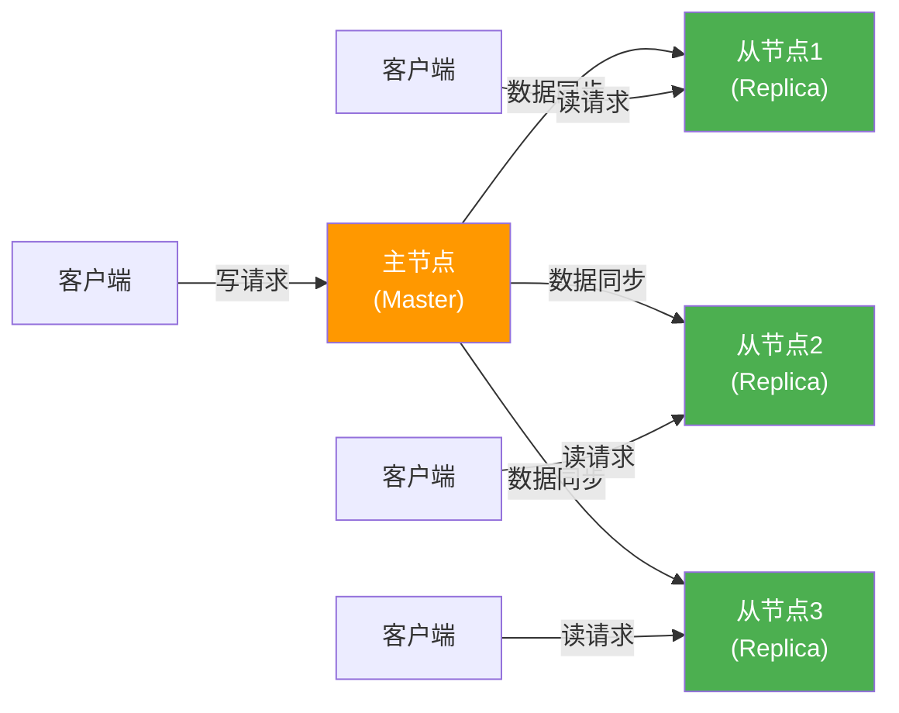
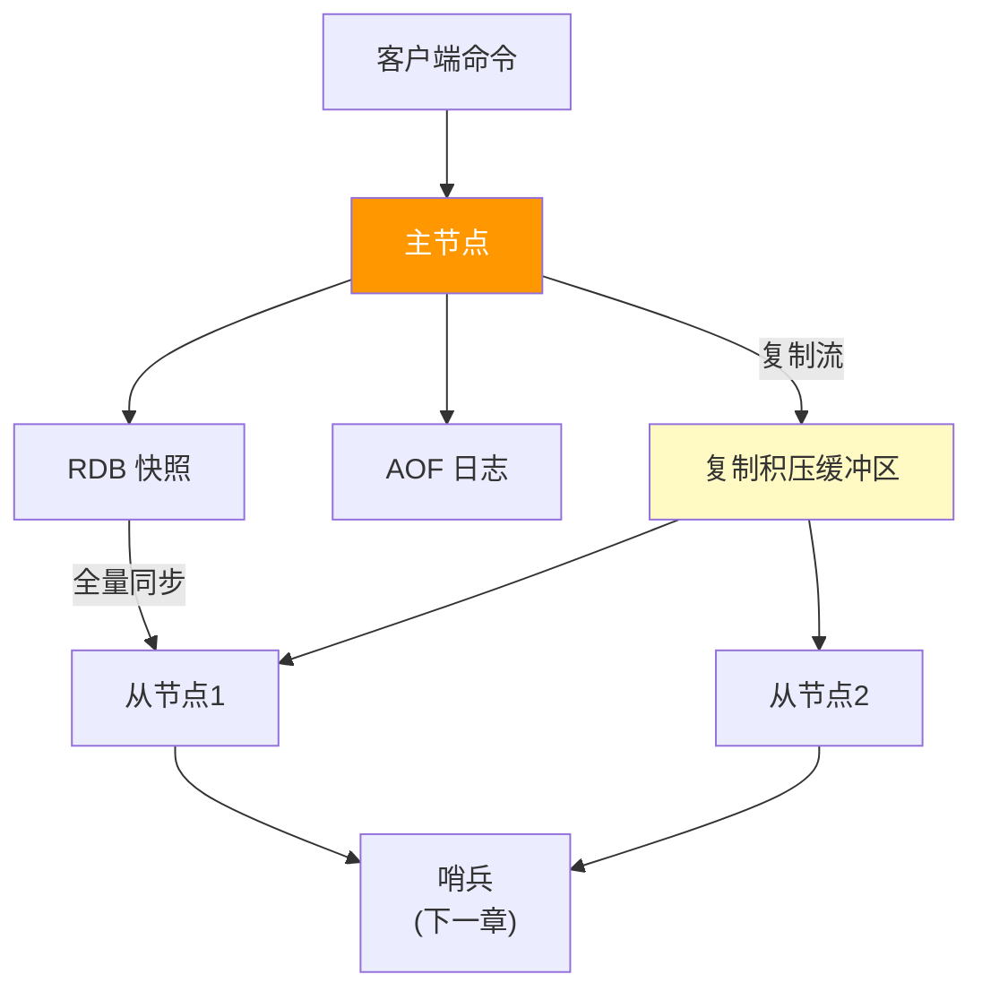
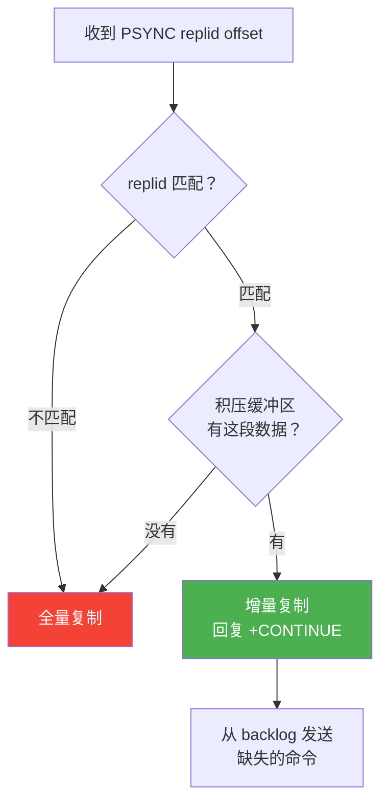
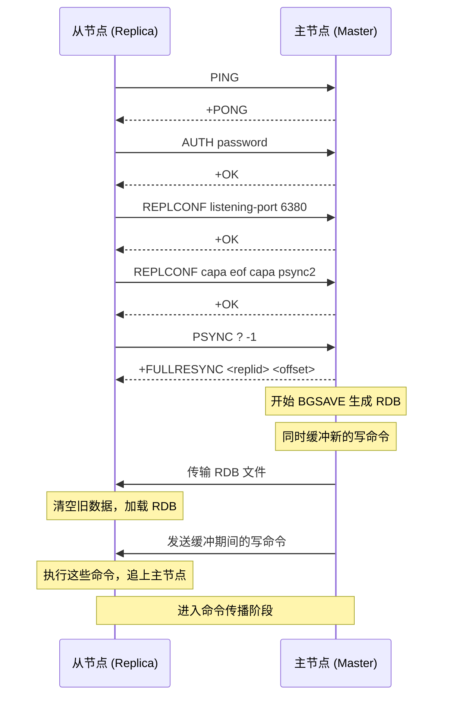
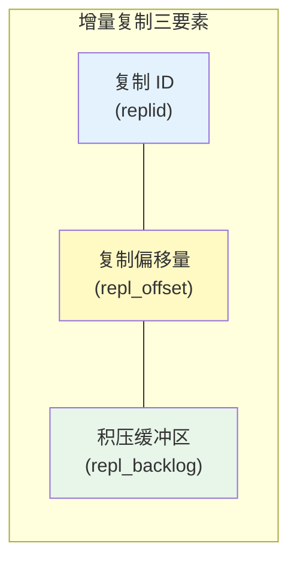
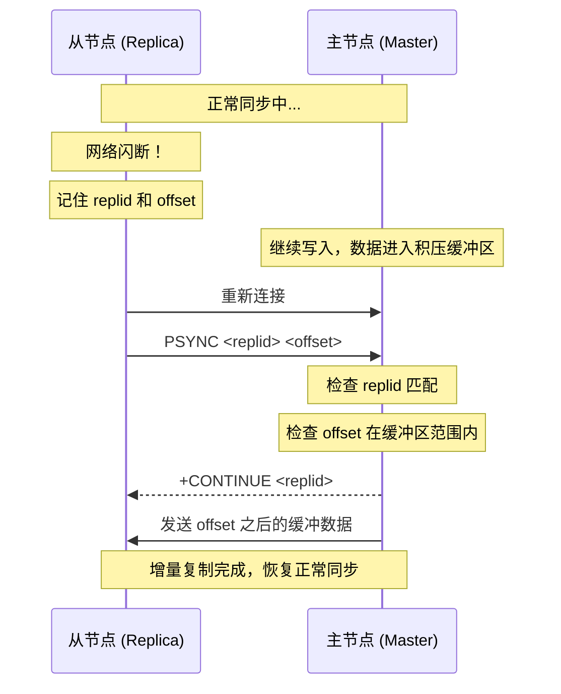
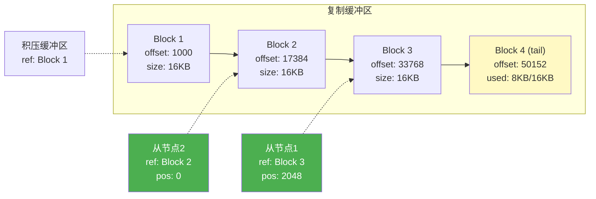
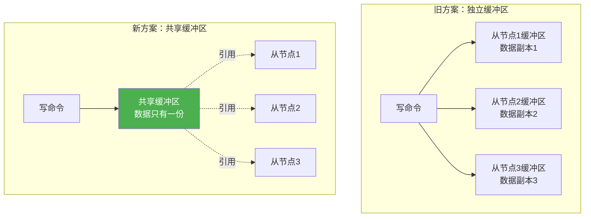
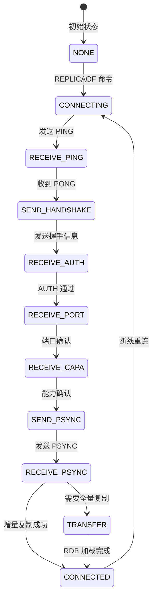

# Chapter 5: 主从复制机制

在[上一章：持久化：RDB 与 AOF](04_持久化_rdb与aof.md)中，我们学习了 RDB 快照和 AOF 日志如何把数据安全地持久化到磁盘。但即使数据不会丢失，如果 Redis 服务器本身挂了呢？用户的请求该发往哪里？本章我们来解决这个问题——通过**主从复制**实现高可用和读扩展。

## 从一个实际问题说起

假设你经营一家网上书店，所有用户的购物车、会话信息都存在一台 Redis 里。某天凌晨，这台服务器的硬盘突然坏了。虽然你有 RDB 备份，但恢复需要时间——在这段时间内，所有用户都无法访问网站。

这就是**单点故障（Single Point of Failure）**问题：整个系统依赖一台机器，一旦它出问题，全盘皆输。

另一个问题是**读性能瓶颈**。你的书店越来越火，每秒有 10 万次读请求涌入，但写入只有 1000 次。一台 Redis 处理不过来这么多读请求，但你又不能简单地"再开一台独立的 Redis"——因为数据不同步。

主从复制就是为了同时解决这两个问题：

| 问题 | 解决方案 | 效果 |
|------|----------|------|
| 单点故障 | 数据复制到从节点 | 主节点挂了，从节点还有完整数据 |
| 读性能瓶颈 | 读请求分散到多个从节点 | 一台变多台，读能力线性扩展 |

## 主从复制概述

Redis 的主从复制，说白了就是一句话：**让一台或多台从服务器（Replica）保持与主服务器（Master）完全相同的数据**。

把它想象成一个广播电台：主节点是电台，从节点是收音机。电台播什么，收音机就接收什么。所有"写入"都在电台完成，收音机只负责收听和回放。



核心概念对照表：

| 概念 | 类比 | 说明 |
|------|------|------|
| 主节点（Master） | 广播电台 | 接收所有写操作，是数据的权威来源 |
| 从节点（Replica） | 收音机 | 复制主节点数据，处理读请求 |
| 全量复制（Full Sync） | 把整个节目录音带寄过去 | 第一次同步，传输完整数据快照 |
| 增量复制（Partial Resync） | 只补听中间断掉的那段 | 短暂断线后，只补发遗漏的部分 |
| 复制积压缓冲区（Repl Backlog） | 电台的最近节目录音 | 缓存最近的写命令，用于增量复制 |
| 复制偏移量（Repl Offset） | 播放进度条 | 记录同步到了哪个位置 |

## 复制机制在架构中的位置

主从复制连接了持久化层和高可用层。它利用 RDB 做全量同步，同时为哨兵（Sentinel）提供故障转移的基础设施：



## 全量复制：从零开始同步

当一个从节点第一次连接到主节点，或者断线时间太久导致增量复制不可行时，就需要进行**全量复制**——主节点生成一份完整的 RDB 快照，发送给从节点。

### 握手阶段：建立信任

全量复制不是上来就传数据。从节点首先要经历一系列握手步骤，就像两个人初次见面，先自我介绍再谈正事。

让我们看看 `syncWithMaster` 函数中的握手状态机：

```c
// replication.c - syncWithMaster()
// 从节点连接主节点后的握手流程，是一个状态机

// 第一步：发送 PING 检查主节点是否在线
if (server.repl_state == REPL_STATE_CONNECTING) {
    server.repl_state = REPL_STATE_RECEIVE_PING_REPLY;
    err = sendCommand(conn,"PING",NULL);  // 先打个招呼
    return;
}

// 第二步：认证（如果主节点设了密码）
if (server.repl_state == REPL_STATE_SEND_HANDSHAKE) {
    if (server.masterauth) {
        err = sendCommandArgv(conn, argc, args, lens);  // AUTH 命令
    }
    // 告知主节点自己的端口号
    err = sendCommand(conn,"REPLCONF","listening-port",buf, NULL);
    // 告知主节点自己的能力（支持 EOF、PSYNC2 等）
    err = sendCommand(conn,"REPLCONF","capa","eof","capa","psync2", ...);
    server.repl_state = REPL_STATE_RECEIVE_AUTH_REPLY;
    return;
}
```

握手完成后，从节点发送 PSYNC 命令尝试同步。我们来看从节点端的 PSYNC 发起逻辑：

```c
// replication.c - slaveTryPartialResynchronization()
// 从节点尝试发起 PSYNC 命令

if (server.cached_master) {
    // 之前连接过主节点，有缓存信息——尝试增量复制
    psync_replid = server.cached_master->replid;    // 上次的复制 ID
    snprintf(psync_offset,..., server.cached_master->reploff+1);  // 上次的偏移量+1
    serverLog(LL_NOTICE,"Trying a partial resynchronization (request %s:%s).",
              psync_replid, psync_offset);
} else {
    // 第一次连接，没有缓存——只能全量复制
    psync_replid = "?";       // "?" 表示不知道主节点的 ID
    memcpy(psync_offset,"-1",3);  // -1 表示从头开始
}

// 发送 PSYNC <replid> <offset>
reply = sendCommand(conn,"PSYNC",psync_replid,psync_offset,NULL);
```

这里的设计非常精妙：**同一个 PSYNC 命令既能发起全量复制，又能发起增量复制**。主节点根据 replid 和 offset 来判断该走哪条路。

### 主节点端的决策：全量还是增量？

当主节点收到 PSYNC 命令后，在 `syncCommand` 中处理。核心判断逻辑在 `masterTryPartialResynchronization`：

```c
// replication.c - masterTryPartialResynchronization()
// 主节点判断能否进行增量复制

int masterTryPartialResynchronization(client *c, long long psync_offset) {
    char *master_replid = c->argv[1]->ptr;

    // 判断条件1：复制 ID 是否匹配？
    // Redis 维护两个 ID：当前的 replid 和上一任主节点的 replid2
    if (strcasecmp(master_replid, server.replid) &&
        (strcasecmp(master_replid, server.replid2) ||
         psync_offset > server.second_replid_offset))
    {
        // ID 不匹配 ->必须全量复制
        goto need_full_resync;
    }

    // 判断条件2：请求的数据是否还在积压缓冲区？
    if (!server.repl_backlog ||
        psync_offset < server.repl_backlog->offset ||
        psync_offset > (server.repl_backlog->offset + server.repl_backlog->histlen))
    {
        // 数据已被覆盖或偏移量超范围 ->必须全量复制
        serverLog(LL_NOTICE,
            "Unable to partial resync with replica %s for lack of backlog "
            "(Replica request was: %lld).", replicationGetSlaveName(c), psync_offset);
        goto need_full_resync;
    }

    // 两个条件都满足 ->可以增量复制！
    c->flags |= CLIENT_SLAVE;
    c->replstate = SLAVE_STATE_ONLINE;
    // 回复 +CONTINUE，告知从节点可以增量同步
    buflen = snprintf(buf,sizeof(buf),"+CONTINUE %s\r\n", server.replid);
    connWrite(c->conn,buf,buflen);
    // 从积压缓冲区发送缺失的数据
    psync_len = addReplyReplicationBacklog(c,psync_offset);
    return C_OK;

need_full_resync:
    return C_ERR;  // 告诉调用者需要全量复制
}
```

这段逻辑可以用一张决策流程图来理解：



### 全量复制的完整流程

如果增量复制不可行，就走全量复制路径。整个过程涉及 RDB 生成、传输、加载三个阶段：



让我们来看主节点如何处理全量复制请求。在 `syncCommand` 中，有三种 BGSAVE 的场景需要区分：

```c
// replication.c - syncCommand() 全量复制处理
// 从节点已标记为 SLAVE_STATE_WAIT_BGSAVE_START

// 场景1：已经有 BGSAVE 在运行（磁盘模式），可以共享
if (server.child_type == CHILD_TYPE_RDB &&
    server.rdb_child_type == RDB_CHILD_TYPE_DISK)
{
    // 找到一个正在等待 BGSAVE 结束的从节点
    // 新来的从节点可以"搭便车"，共用同一份 RDB
    if (ln && slave_capabilities_match) {
        copyReplicaOutputBuffer(c, slave);  // 复制输出缓冲区
        replicationSetupSlaveForFullResync(c, slave->psync_initial_offset);
        serverLog(LL_NOTICE,"Waiting for end of BGSAVE for SYNC");
    }
}

// 场景2：已有 BGSAVE 但是 socket 模式，无法共享
else if (server.rdb_child_type == RDB_CHILD_TYPE_SOCKET) {
    serverLog(LL_NOTICE,"Current BGSAVE has socket target. "
                         "Waiting for next BGSAVE for SYNC");
}

// 场景3：没有 BGSAVE 在运行，启动一个新的
else {
    startBgsaveForReplication(mincapa, req);
}
```

这里有一个巧妙的优化：**如果多个从节点几乎同时请求全量复制，它们可以共享同一次 BGSAVE 的结果**。避免了为每个从节点都生成一次 RDB 快照。

### 全量复制期间的数据一致性

你可能会问：BGSAVE 生成 RDB 需要时间，这期间主节点还在接受写入，新写的数据怎么办？

答案是：**主节点在传输 RDB 的同时，会把这段时间内的所有写命令缓冲到复制积压缓冲区和从节点的输出缓冲区**。当 RDB 传输完成后，紧接着把这些缓冲的命令也发送给从节点。这样从节点就能完整地追上主节点的状态。

```mermaid
gantt
    title 全量复制时间线
    dateFormat X
    axisFormat %s

    section 主节点
    接收写命令        :active, w1, 0, 10
    BGSAVE 生成 RDB   :crit, rdb, 1, 4
    传输 RDB 给从节点  :crit, transfer, 4, 7
    发送缓冲的命令     :done, buf, 7, 8

    section 从节点
    等待 RDB          :waiting, 1, 4
    接收并加载 RDB     :crit, load, 4, 7
    执行缓冲命令       :done, exec, 7, 8
    正常服务          :active, serve, 8, 10
```



## 增量复制：聪明地补差

全量复制虽然可靠，但代价很大——要传输整个数据集。如果只是网络闪断了几秒钟，只丢了几条命令，难道也要传输几个 GB 的 RDB 文件吗？

当然不需要。这就是**增量复制（Partial Resynchronization）**的用武之地。

### 增量复制的三大要素

增量复制的正确运作依赖三个关键组件：



**1. 复制 ID（Replication ID）**

每个 Redis 实例都有一个 40 字符的随机 ID，标识它的"数据血统"。从节点连接主节点时会记住这个 ID。下次重连时，如果 ID 匹配，说明数据来源没变，可以尝试增量复制。

Redis 实际上维护了**两个** replid：

```c
// server.h 中的字段
char replid[CONFIG_RUN_ID_SIZE+1];   // 当前复制 ID
char replid2[CONFIG_RUN_ID_SIZE+1];  // 上一任主节点的复制 ID
long long second_replid_offset;       // replid2 有效的最大偏移量
```

为什么要两个 ID？因为故障转移时，从节点晋升为新主节点，它的 replid 会变成自己的新 ID，但旧的 replid 要保存到 replid2。这样，其他从节点用旧 ID 来请求增量复制时，新主节点也能识别。

**2. 复制偏移量（Replication Offset）**

主节点和每个从节点各自维护一个偏移量，表示"复制流中已处理到的字节位置"。就像一本书的页码——主节点写到了第 1000 页，从节点读到了第 980 页，那就需要补第 981-1000 页的内容。

```c
// server.h
long long master_repl_offset;   // 主节点：已发送的总字节数

// client 结构中（代表一个从节点）
long long repl_ack_off;         // 从节点确认已接收的偏移量
```

**3. 复制积压缓冲区（Replication Backlog）**

这是主节点维护的一个**有限大小的缓冲区**，保存最近发送给从节点的写命令。它的存在使得增量复制成为可能——断线重连后，只要缺失的数据还在这个缓冲区里，就不需要全量复制。

```c
// replication.c - createReplicationBacklog()
void createReplicationBacklog(void) {
    server.repl_backlog = zmalloc(sizeof(replBacklog));
    server.repl_backlog->ref_repl_buf_node = NULL;
    server.repl_backlog->unindexed_count = 0;
    server.repl_backlog->blocks_index = raxNew();  // 基数树索引，加速偏移量查找
    server.repl_backlog->histlen = 0;
    // 第一个字节的逻辑偏移量 = 当前已发送的总偏移 + 1
    server.repl_backlog->offset = server.master_repl_offset + 1;
}
```

积压缓冲区有一个索引结构（基数树 rax），用来快速定位某个偏移量对应的缓冲块。这比线性扫描快得多：

```c
// replication.c - createReplicationBacklogIndex()
// 每 REPL_BACKLOG_INDEX_PER_BLOCKS 个块创建一个索引条目
void createReplicationBacklogIndex(listNode *ln) {
    server.repl_backlog->unindexed_count++;
    if (server.repl_backlog->unindexed_count >= REPL_BACKLOG_INDEX_PER_BLOCKS) {
        replBufBlock *o = listNodeValue(ln);
        uint64_t encoded_offset = htonu64(o->repl_offset);
        raxInsert(server.repl_backlog->blocks_index,
                  (unsigned char*)&encoded_offset, sizeof(uint64_t),
                  ln, NULL);  // 偏移量 -> 链表节点的映射
        server.repl_backlog->unindexed_count = 0;
    }
}
```

### 增量复制的完整流程



整个过程只需要传输断线期间积累的少量数据，而不是整个数据集。

### 积压缓冲区的大小权衡

积压缓冲区的默认大小是 1MB。这意味着如果断线期间主节点写入了超过 1MB 的命令，增量复制就不可行了，只能回退到全量复制。

如何估算合适的大小？公式是：

```
backlog_size = 断线秒数 * 每秒写入字节数 * 安全系数(2)
```

比如你的 Redis 每秒产生 10KB 的写命令，网络通常在 60 秒内恢复，那么：

```
backlog_size = 60 * 10KB * 2 = 1.2MB
```

在 Redis 配置中设置 `repl-backlog-size 2mb` 就足够了。

### 积压缓冲区的裁剪

积压缓冲区不能无限增长。当它超过设定大小时，旧的数据块会被裁剪掉：

```c
// replication.c - incrementalTrimReplicationBacklog()
// 增量式裁剪，避免一次性释放大量内存导致卡顿
void incrementalTrimReplicationBacklog(size_t max_blocks) {
    while (server.repl_backlog->histlen > server.repl_backlog_size &&
           trimmed_blocks < max_blocks)
    {
        // 不能裁剪到只剩一个块
        if (listLength(server.repl_buffer_blocks) <= 1) break;

        listNode *first = listFirst(server.repl_buffer_blocks);
        replBufBlock *fo = listNodeValue(first);
        // 如果还有从节点在引用这个块，不能删
        if (fo->refcount != 1) break;

        // 安全地移除第一个块
        fo->refcount--;
        server.repl_backlog->histlen -= fo->size;

        // 移到下一个块
        listNode *next = listNextNode(first);
        server.repl_backlog->ref_repl_buf_node = next;
        ((replBufBlock *)listNodeValue(next))->refcount++;

        // 从索引中移除
        raxRemove(server.repl_backlog->blocks_index, ...);
        // 删除链表节点
        listDelNode(server.repl_buffer_blocks, first);
    }
    // 更新 backlog 的起始偏移量
    server.repl_backlog->offset = server.master_repl_offset -
                                  server.repl_backlog->histlen + 1;
}
```

注意两个精妙的设计：

1. **增量裁剪**：每次最多裁剪 `max_blocks` 个块，分多次完成。避免了一次性释放大量内存导致 Redis 卡顿。
2. **引用计数保护**：如果某个块仍被从节点引用（refcount > 1），就不裁剪。这意味着实际的积压缓冲区可能比配置值大一些，但能让更多的增量复制成功。

## 命令传播：写操作如何到达从节点

全量复制和增量复制解决的是"如何让从节点追上主节点"的问题。一旦从节点追上了，后续的数据同步就靠**命令传播**——主节点每执行一条写命令，就把这条命令实时发送给所有从节点。

### replicationFeedSlaves：命令传播的入口

```c
// replication.c - replicationFeedSlaves()
void replicationFeedSlaves(list *slaves, int dictid, robj **argv, int argc) {
    // 如果当前实例不是顶层主节点（而是另一个主的从节点），直接返回
    // 因为它会转发从自己主节点收到的复制流，保持流的一致性
    if (server.masterhost != NULL) return;

    // 没有从节点也没有积压缓冲区？快速返回
    if (server.repl_backlog == NULL && listLength(slaves) == 0) {
        server.master_repl_offset += 1;
        return;
    }

    // 先准备所有从节点的写处理器
    prepareReplicasToWrite();

    // 如果需要，先发送 SELECT 命令切换数据库
    if (dictid != -1 && server.slaveseldb != dictid) {
        feedReplicationBufferWithObject(selectcmd);
        server.slaveseldb = dictid;
    }

    // 把命令编码为 RESP 协议格式，写入复制缓冲区
    // 格式：*<argc>\r\n$<len>\r\n<arg>\r\n...
    char aux[LONG_STR_SIZE+3];
    aux[0] = '*';
    len = ll2string(aux+1, sizeof(aux)-1, argc);
    aux[len+1] = '\r'; aux[len+2] = '\n';
    feedReplicationBuffer(aux, len+3);

    for (j = 0; j < argc; j++) {
        // 每个参数编码为 $<len>\r\n<data>\r\n
        feedReplicationBufferWithObject(argv[j]);
    }
}
```

这里的关键是 `feedReplicationBuffer`——它不是直接发给每个从节点，而是写入一个**共享的复制缓冲区**。所有从节点从同一个缓冲区读取数据，避免了数据的多次拷贝。

### feedReplicationBuffer：共享缓冲区的核心

```c
// replication.c - feedReplicationBuffer()
void feedReplicationBuffer(char *s, size_t len) {
    if (server.repl_backlog == NULL) return;

    while(len > 0) {
        listNode *ln = listLast(server.repl_buffer_blocks);
        replBufBlock *tail = ln ? listNodeValue(ln) : NULL;

        // 尽量往现有的尾部块追加
        if (tail && tail->size > tail->used) {
            size_t avail = tail->size - tail->used;
            size_t copy = (avail >= len) ? len : avail;
            memcpy(tail->buf + tail->used, s, copy);
            tail->used += copy;
            s += copy;
            len -= copy;
            server.master_repl_offset += copy;     // 更新全局偏移量
            server.repl_backlog->histlen += copy;   // 更新积压缓冲区长度
        }

        if (len) {
            // 当前块满了，创建新块
            size_t size = min(max(len, PROTO_REPLY_CHUNK_BYTES), limit);
            tail = zmalloc_usable(size + sizeof(replBufBlock), &usable_size);
            tail->repl_offset = server.master_repl_offset + 1;
            memcpy(tail->buf, s, copy);
            listAddNodeTail(server.repl_buffer_blocks, tail);
        }

        // 更新每个从节点的引用位置
        listRewind(server.slaves, &li);
        while((ln = listNext(&li))) {
            client *slave = ln->value;
            if (!canFeedReplicaReplBuffer(slave)) continue;
            if (slave->ref_repl_buf_node == NULL) {
                slave->ref_repl_buf_node = start_node;
                slave->ref_block_pos = start_pos;
                ((replBufBlock *)listNodeValue(start_node))->refcount++;
            }
        }
    }
}
```

可以用下图来理解共享缓冲区的结构：



每个从节点通过 `ref_repl_buf_node` 和 `ref_block_pos` 记录自己读到了哪个块的哪个位置。这种设计比为每个从节点维护独立的输出缓冲区高效得多——数据只存一份，所有从节点共享。

## 设计决策分析

### 决策一：异步复制 vs 同步复制

Redis 选择了**异步复制**：主节点执行完写命令后立即返回给客户端，不等从节点确认。

```
客户端 -> SET key value -> 主节点写入成功 -> 返回 OK
                                ↓ (异步)
                         发送给从节点...
```

| 复制方式 | 一致性 | 性能 | Redis 的选择 |
|----------|--------|------|-------------|
| 同步复制 | 强一致 | 慢（等所有从节点确认） | 不采用 |
| 半同步 | 较强 | 中等 | WAIT 命令可选 |
| 异步复制 | 最终一致 | 最快 | 默认行为 |

异步复制意味着**有丢数据的风险**：主节点刚写入的数据还没来得及发给从节点就挂了，那这部分数据就丢了。Redis 通过 `WAIT` 命令提供可选的半同步语义，让客户端等待指定数量的从节点确认。

### 决策二：为什么用 PSYNC 而不是总是全量复制？

全量复制的代价非常高：

1. 主节点要 fork 子进程生成 RDB（内存翻倍风险）
2. 网络传输几个 GB 的数据
3. 从节点要清空旧数据、加载新 RDB（期间无法服务）

而大多数断线都是短暂的——网络抖动几秒钟。PSYNC + 积压缓冲区的设计让这种常见场景的恢复成本降到最低。

### 决策三：共享复制缓冲区 vs 独立缓冲区

早期 Redis 为每个从节点维护独立的输出缓冲区。如果有 10 个从节点，同一份数据要复制 10 份。现在的设计改为共享缓冲区 + 引用计数：



内存节省非常可观。10 个从节点、积压缓冲区 100MB 的场景下，旧方案需要约 1GB 内存放缓冲区，新方案只需要约 100MB。

### 决策四：两个复制 ID 的妙用

为什么 Redis 要维护两个复制 ID（replid 和 replid2）？考虑以下故障转移场景：

```
时刻 T1: Master(replid=AAA) -> Replica1, Replica2
时刻 T2: Master 挂了
时刻 T3: Replica1 晋升为新 Master
         新 Master: replid=BBB, replid2=AAA
时刻 T4: Replica2 重连到新 Master
         发送 PSYNC AAA <offset>
```

如果只有一个 replid，Replica2 发来的 AAA 和新 Master 的 BBB 不匹配，只能全量复制。但有了 replid2，新 Master 发现 AAA == replid2，并且 offset 在有效范围内，就能做增量复制。

这个设计大大减少了故障转移后的全量复制次数，是 PSYNC2 协议的核心改进之一。

## 端到端实例：一次完整的复制过程

让我们用具体的数据来走一遍完整流程。假设：

- 主节点 Master，地址 192.168.1.1:6379
- 从节点 Replica，地址 192.168.1.2:6380
- 主节点已有 50MB 数据

### 阶段一：首次全量复制

```
Replica> REPLICAOF 192.168.1.1 6379

1. Replica 连接 Master
2. 握手：PING -> PONG -> AUTH -> REPLCONF -> REPLCONF capa
3. Replica 发送：PSYNC ? -1
   （"?" 表示不知道主节点 ID，"-1" 表示从头开始）
4. Master 回复：+FULLRESYNC abc123...def456 0
   （复制 ID = abc123...def456，起始偏移量 = 0）
5. Master 执行 BGSAVE，生成 50MB 的 RDB
6. Master 传输 RDB 给 Replica
7. 传输期间 Master 收到 SET user:1 "Alice"、SET user:2 "Bob"
   这些命令被缓冲到复制积压缓冲区
8. RDB 传输完成，Replica 加载 RDB
9. Master 把缓冲的 SET 命令发送给 Replica
10. Replica 执行这些命令，追上 Master

此时：
  Master  repl_offset = 186  (0 + RDB 后累计的命令字节数)
  Replica repl_offset = 186
```

### 阶段二：正常命令传播

```
客户端执行：SET product:100 "Redis实战" EX 3600

1. Master 执行命令，更新本地数据
2. Master 调用 replicationFeedSlaves()
3. 命令编码为 RESP 格式：
   *5\r\n$3\r\nSET\r\n$11\r\nproduct:100\r\n...
   共 62 字节
4. 写入共享复制缓冲区
5. master_repl_offset += 62，变为 248
6. Replica 收到这 62 字节的命令并执行
7. Replica 发送 REPLCONF ACK 248（确认已收到到 248）
```

### 阶段三：断线后增量复制

```
网络闪断 5 秒钟。这期间 Master 收到了若干写命令，
master_repl_offset 从 248 增长到 1520。

1. Replica 重新连接 Master
2. 握手完成后，Replica 发送：
   PSYNC abc123...def456 249
   （记住的 replid + 断线时的 offset+1）
3. Master 检查：
   - replid 匹配
   - offset 249 在积压缓冲区范围 [1, 1520] 内
4. Master 回复：+CONTINUE abc123...def456
5. Master 从积压缓冲区中取出 offset 249~1520 的数据
   发送给 Replica（共 1272 字节）
6. Replica 执行这些命令，追上 Master

比起重新传输 50MB 的 RDB，只传了 1272 字节！
```

## 复制状态机总览

从节点的复制过程是一个复杂的状态机。`repl_state` 字段记录了当前所处的阶段：



## 小结

本章深入了解了 Redis 主从复制机制的核心原理：

- **为什么需要复制**：解决单点故障和读性能瓶颈两大问题
- **全量复制**：通过 RDB 快照传输完整数据集，用于首次同步或积压缓冲区不足时
- **增量复制（PSYNC）**：通过复制 ID + 偏移量 + 积压缓冲区，只传输断线期间遗漏的命令
- **命令传播**：写命令通过共享复制缓冲区实时传递给所有从节点
- **设计权衡**：异步复制换取性能、两个 replid 支持故障转移后的增量复制、共享缓冲区节省内存

有了主从复制，数据不再是"孤本"。但新的问题来了：如果主节点挂了，谁来决定哪个从节点晋升为新主节点？客户端怎么知道该连接谁？这就是下一章的主题——[哨兵与高可用](06_哨兵与高可用.md)，Redis 的自动故障转移机制。

[上一章：持久化：RDB 与 AOF](04_持久化_rdb与aof.md) | [下一章：哨兵与高可用](06_哨兵与高可用.md)
