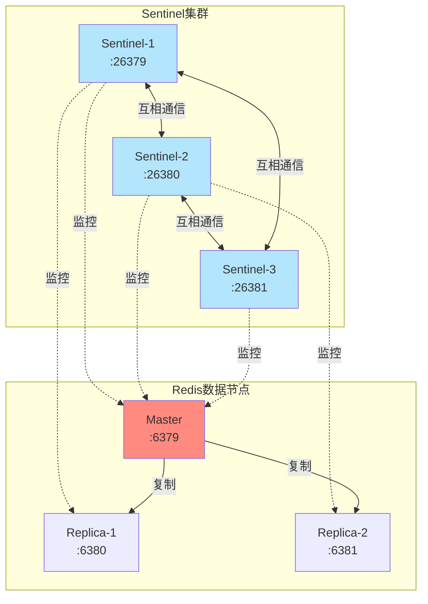
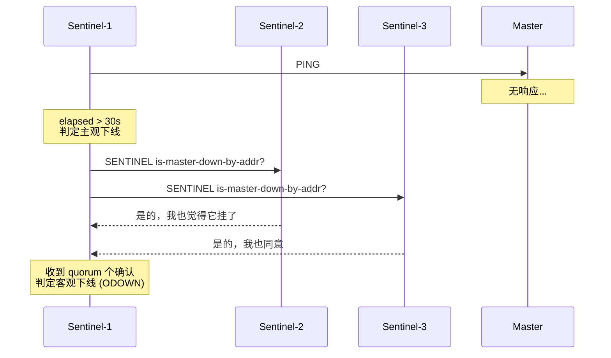
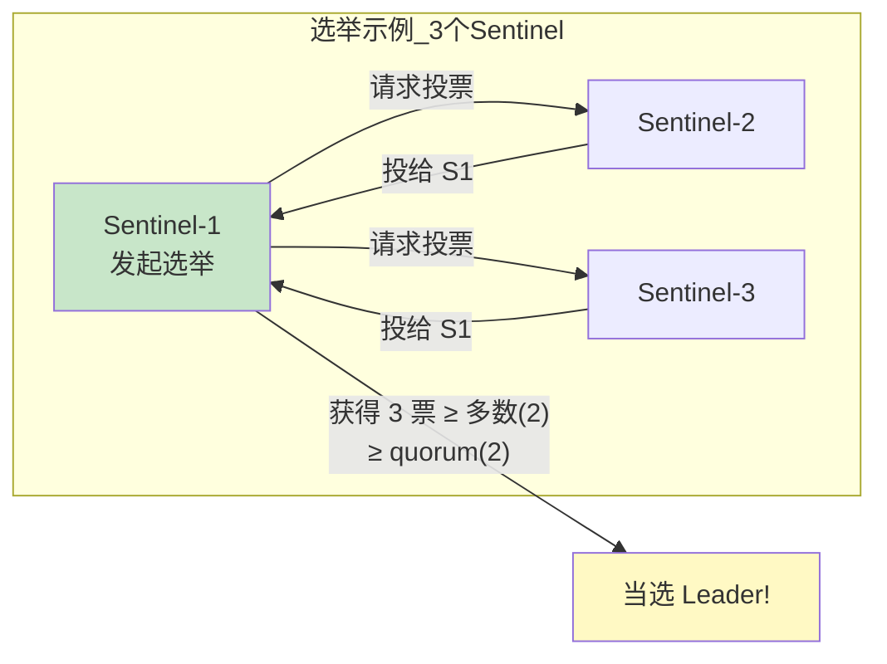
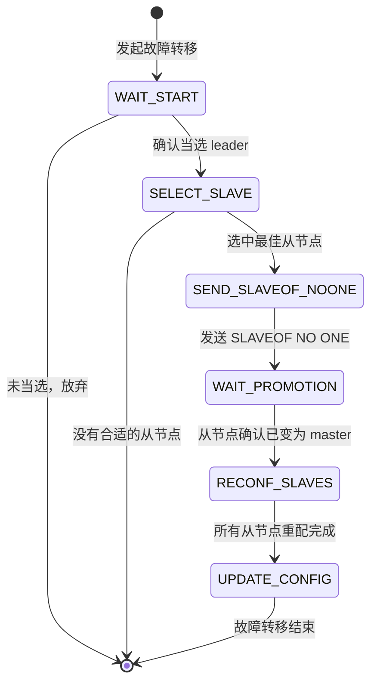
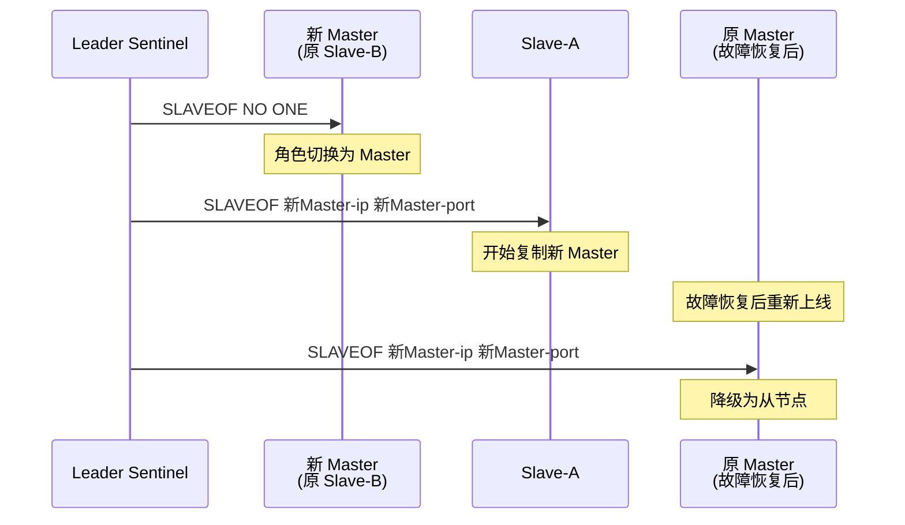
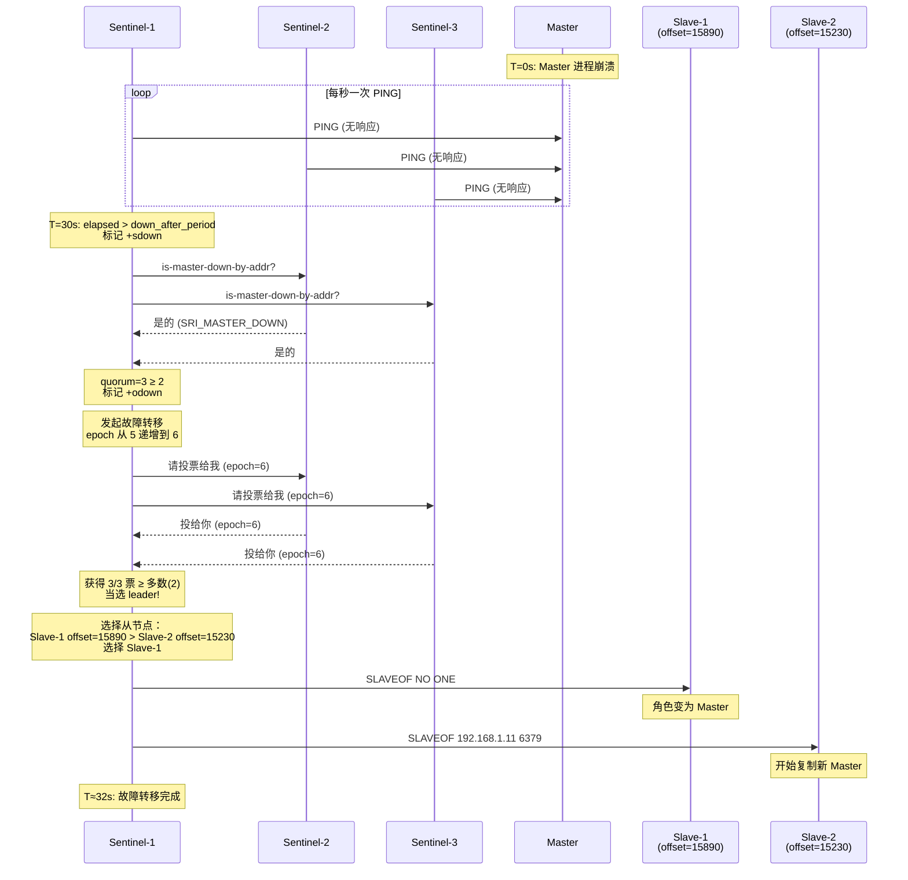
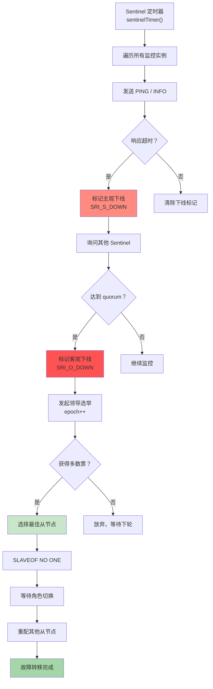

# Chapter 6: 哨兵与高可用

在上一章“主从复制机制”中，我们学习了 Redis 如何通过主从复制实现数据冗余：主节点负责写入，从节点保存数据副本。但我们留下了一个关键问题：**如果主节点突然宕机了，谁来接管？**

## 从一个实际问题说起

想象你是一家电商公司的运维工程师。你们的 Redis 架构是经典的一主两从：

```
Master (192.168.1.10:6379) ── 处理所有读写请求
  ├── Replica-1 (192.168.1.11:6379)
  └── Replica-2 (192.168.1.12:6379)
```

凌晨三点，你被电话吵醒——主节点挂了。你需要：

1. **判断**主节点是真挂了，还是只是网络抖动
2. **选择**一个数据最完整的从节点来接替
3. **执行**切换：让选中的从节点变成新主节点
4. **通知**其他从节点改为复制新主节点
5. **更新**所有客户端的连接配置

这五步全靠人工操作？太不靠谱了。且不说半夜三点反应慢容易出错，整个过程下来至少十几分钟——对高并发业务来说，这就是十几分钟的服务中断。

**Redis Sentinel（哨兵）就是来自动完成这一切的。** 它是 Redis 官方提供的高可用方案，能在主节点故障时自动完成故障检测、领导选举、故障转移，整个过程无需人工干预。

## Sentinel 是什么？一句话解释

Sentinel 就是 Redis 集群的**自动值班保安**——它 24 小时盯着主从节点，发现主节点出问题就自动组织换班。

| 概念 | 类比 | 说明 |
|------|------|------|
| Sentinel 节点 | 值班保安 | 独立进程，监控 Redis 实例的健康状态 |
| 主观下线（SDOWN） | 一个保安觉得有问题 | 单个 Sentinel 认为节点不可达 |
| 客观下线（ODOWN） | 多个保安都确认有问题 | quorum 个 Sentinel 达成共识 |
| 领导选举 | 保安们投票选出行动队长 | 选出一个 Sentinel 来执行故障转移 |
| 故障转移 | 队长指挥换岗 | 提升从节点为新主节点 |

## Sentinel 在整体架构中的位置

Sentinel 作为独立进程运行，不处理用户数据，专门负责监控和协调：



为什么需要多个 Sentinel？道理很简单——一个保安也可能打瞌睡。如果只有一个 Sentinel，它自己网络出问题时可能误判主节点宕机。多个 Sentinel 互相验证，才能做出可靠的判断。

## 核心数据结构

在深入流程之前，我们先看看 Sentinel 用什么数据结构来管理监控目标。打开 `sentinel.c`，最核心的就是这两个结构体：

### 全局状态：sentinelState

```c
// sentinel.c - Sentinel 的全局状态
struct sentinelState {
    char myid[CONFIG_RUN_ID_SIZE+1]; // 本 Sentinel 的唯一 ID
    uint64_t current_epoch;          // 当前纪元（类似 Raft 的 term）
    dict *masters;      // 监控的所有主节点，key=名字, value=实例信息
    int tilt;           // 是否处于 TILT 保护模式（时钟异常时暂停决策）
    // ...
} sentinel;
```

`current_epoch` 是理解后面领导选举的关键——每次发起新一轮选举，epoch 就会递增，确保每个 Sentinel 在同一个 epoch 内只投一次票。

### 监控实例：sentinelRedisInstance

```c
// sentinel.c - 描述一个被监控的 Redis 实例
typedef struct sentinelRedisInstance {
    int flags;          // 实例类型和状态标记（SRI_MASTER/SRI_SLAVE/SRI_SENTINEL 等）
    char *name;         // 实例名称
    char *runid;        // 运行 ID
    uint64_t config_epoch;  // 配置纪元

    sentinelAddr *addr;     // ip:port 地址
    instanceLink *link;     // 连接信息（命令连接 + Pub/Sub 连接）

    mstime_t down_after_period; // 超过此时间无响应则判定主观下线
    unsigned int quorum;        // 达成客观下线需要的票数

    // 故障转移相关
    char *leader;               // 本轮选举的领导者 ID
    uint64_t leader_epoch;      // 领导者所在的 epoch
    int failover_state;         // 故障转移状态机的当前状态
    struct sentinelRedisInstance *promoted_slave; // 被选中提升的从节点

    // 从节点信息
    dict *sentinels;    // 其他监控同一 master 的 Sentinel 节点
    dict *slaves;       // 该 master 的从节点
} sentinelRedisInstance;
```

注意 `flags` 字段，它用位掩码表示多种状态：

```c
#define SRI_MASTER  (1<<0)   // 这是一个主节点
#define SRI_SLAVE   (1<<1)   // 这是一个从节点
#define SRI_SENTINEL (1<<2)  // 这是一个 Sentinel 节点
#define SRI_S_DOWN (1<<3)    // 主观下线
#define SRI_O_DOWN (1<<4)    // 客观下线
#define SRI_FAILOVER_IN_PROGRESS (1<<6) // 故障转移进行中
#define SRI_PROMOTED (1<<7)  // 被选中提升为新 master
```

一个实例可以同时处于多种状态，比如 `SRI_MASTER | SRI_S_DOWN` 表示"这是一个主节点，且当前被判定为主观下线"。

## 故障检测：主观下线与客观下线

故障检测是整个高可用方案的第一步。Sentinel 采用两阶段确认机制——先让每个哨兵独立判断，再互相验证。

### 第一阶段：主观下线（Subjectively Down）

每个 Sentinel 独立地通过心跳检测来判断实例是否存活。核心逻辑在 `sentinelCheckSubjectivelyDown` 中：

```c
// sentinel.c - 检测主观下线
void sentinelCheckSubjectivelyDown(sentinelRedisInstance *ri) {
    mstime_t elapsed = 0;

    // 计算距离上次有效通信过了多久
    if (ri->link->act_ping_time)
        elapsed = mstime() - ri->link->act_ping_time;  // 有 PING 在等回复
    else if (ri->link->disconnected)
        elapsed = mstime() - ri->link->last_avail_time; // 连接已断开

    // 关键判断：超时则标记为主观下线
    if (elapsed > ri->down_after_period ||
        (ri->flags & SRI_MASTER &&
         ri->role_reported == SRI_SLAVE &&  // master 报告自己是 slave？出问题了
         mstime() - ri->role_reported_time >
          (ri->down_after_period + sentinel_info_period*2)))
    {
        if ((ri->flags & SRI_S_DOWN) == 0) {
            sentinelEvent(LL_WARNING,"+sdown",ri,"%@"); // 触发 +sdown 事件
            ri->s_down_since_time = mstime();
            ri->flags |= SRI_S_DOWN;  // 打上主观下线标记
        }
    } else {
        if (ri->flags & SRI_S_DOWN) {
            sentinelEvent(LL_WARNING,"-sdown",ri,"%@"); // 恢复，清除标记
            ri->flags &= ~(SRI_S_DOWN|SRI_SCRIPT_KILL_SENT);
        }
    }
}
```

默认 `down_after_period` 是 30 秒。也就是说，如果 30 秒没收到某个实例的有效回复，这个 Sentinel 就认为它"主观下线"了。

但一个人的判断不够可靠——也许只是这个 Sentinel 自己的网络有问题。

### 第二阶段：客观下线（Objectively Down）

当一个 Sentinel 发现主节点主观下线后，它会去问其他 Sentinel："你也觉得这个主节点挂了吗？"



询问的代码在 `sentinelAskMasterStateToOtherSentinels` 中：

```c
// sentinel.c - 向其他 Sentinel 询问 master 状态
void sentinelAskMasterStateToOtherSentinels(sentinelRedisInstance *master, int flags) {
    dictIterator di;
    dictEntry *de;

    dictInitIterator(&di, master->sentinels);
    while((de = dictNext(&di)) != NULL) {
        sentinelRedisInstance *ri = dictGetVal(de);
        // ... 跳过不符合条件的 ...

        // 发送 SENTINEL is-master-down-by-addr 命令
        // 如果已经在故障转移流程中，还会附带自己的 ID 请求投票
        retval = redisAsyncCommand(ri->link->cc,
                    sentinelReceiveIsMasterDownReply, ri,
                    "%s is-master-down-by-addr %s %s %llu %s",
                    sentinelInstanceMapCommand(ri,"SENTINEL"),
                    announceSentinelAddr(master->addr), port,
                    sentinel.current_epoch,
                    (master->failover_state > SENTINEL_FAILOVER_STATE_NONE) ?
                    sentinel.myid : "*");
    }
}
```

注意最后一个参数：如果故障转移已经开始（`failover_state > NONE`），就传自己的 `myid` 请求投票；否则传 `"*"` 只是询问状态。这个巧妙的复用让一条命令同时完成了"确认故障"和"请求投票"两件事。

收集完回复后，统计确认下线的 Sentinel 数量：

```c
// sentinel.c - 检测客观下线
void sentinelCheckObjectivelyDown(sentinelRedisInstance *master) {
    unsigned int quorum = 0, odown = 0;

    if (master->flags & SRI_S_DOWN) {
        quorum = 1; // 自己算一票
        // 统计其他 Sentinel 的投票
        dictInitIterator(&di, master->sentinels);
        while((de = dictNext(&di)) != NULL) {
            sentinelRedisInstance *ri = dictGetVal(de);
            if (ri->flags & SRI_MASTER_DOWN) quorum++;  // 它也认为 master 下线
        }
        if (quorum >= master->quorum) odown = 1;  // 达到法定人数
    }

    if (odown) {
        if ((master->flags & SRI_O_DOWN) == 0) {
            sentinelEvent(LL_WARNING,"+odown",master,
                          "%@ #quorum %d/%d", quorum, master->quorum);
            master->flags |= SRI_O_DOWN;  // 标记客观下线
        }
    }
}
```

`quorum` 是用户配置的，比如设为 2 就表示需要至少 2 个 Sentinel 都认为 master 下线，才能确认客观下线。

### 两阶段检测的意义

为什么要分两步？用一张表来对比：

| 场景 | 只有主观下线 | 加上客观下线 |
|------|------------|------------|
| Sentinel-1 网络抖动 | 误触发故障转移 | 其他 Sentinel 不同意，不会转移 |
| Master 真的宕机 | 正确检测 | 多方确认后才行动，更可靠 |
| 网络分区（脑裂） | 可能误判 | quorum 机制大幅降低误判概率 |

## 领导选举：谁来执行故障转移？

确认了 master 客观下线后，下一步是选出一个 Sentinel 来执行故障转移。不能所有 Sentinel 同时动手——那会乱套。

Redis Sentinel 的选举算法借鉴了 **Raft 协议**的思想，核心规则很简单：

1. 每个 Sentinel 在同一个 epoch 内只能投一票
2. 先到先得——谁先请求就投给谁
3. 获得**多数票**（voters/2 + 1）且不少于 quorum 的 Sentinel 当选为 leader

### 投票过程

```c
// sentinel.c - 为 leader 投票
char *sentinelVoteLeader(sentinelRedisInstance *master,
                         uint64_t req_epoch,
                         char *req_runid,
                         uint64_t *leader_epoch) {
    // 如果请求的 epoch 更大，更新自己的 epoch
    if (req_epoch > sentinel.current_epoch) {
        sentinel.current_epoch = req_epoch;
        sentinelFlushConfig();
    }

    // 关键条件：在当前 epoch 还没投过票 && 请求的 epoch 有效
    if (master->leader_epoch < req_epoch &&
        sentinel.current_epoch <= req_epoch)
    {
        sdsfree(master->leader);
        master->leader = sdsnew(req_runid);  // 投票给请求者
        master->leader_epoch = sentinel.current_epoch;
        sentinelFlushConfig();  // 持久化投票结果，防止重启后重复投票

        // 如果不是投给自己，加一个随机延迟
        // 目的：避免多个 Sentinel 同时发起选举导致票数分散
        if (strcasecmp(master->leader, sentinel.myid))
            master->failover_start_time = mstime() + rand() % SENTINEL_MAX_DESYNC;
    }

    *leader_epoch = master->leader_epoch;
    return master->leader ? sdsnew(master->leader) : NULL;
}
```

### 统计选票

```c
// sentinel.c - 统计谁获得了最多选票
char *sentinelGetLeader(sentinelRedisInstance *master, uint64_t epoch) {
    dict *counters;
    unsigned int voters = 0, voters_quorum;
    char *winner = NULL;
    uint64_t max_votes = 0;

    counters = dictCreate(&leaderVotesDictType);
    voters = dictSize(master->sentinels) + 1; // 所有 Sentinel（含自己）

    // 第一步：统计其他 Sentinel 的投票
    dictInitIterator(&di, master->sentinels);
    while((de = dictNext(&di)) != NULL) {
        sentinelRedisInstance *ri = dictGetVal(de);
        if (ri->leader != NULL && ri->leader_epoch == sentinel.current_epoch)
            sentinelLeaderIncr(counters, ri->leader);
    }

    // 第二步：自己也投一票（跟风或投自己）
    if (winner)
        myvote = sentinelVoteLeader(master, epoch, winner, &leader_epoch);
    else
        myvote = sentinelVoteLeader(master, epoch, sentinel.myid, &leader_epoch);

    // 第三步：检查是否满足当选条件
    voters_quorum = voters / 2 + 1;  // 绝对多数
    if (winner && (max_votes < voters_quorum || max_votes < master->quorum))
        winner = NULL;  // 票数不够，选举失败

    return winner;
}
```

当选条件有两个，缺一不可：
- 获得**绝对多数**票（超过半数 Sentinel）
- 票数不少于配置的 **quorum**



### 为什么不直接用 Raft？

Sentinel 的选举和 Raft 很像，但有一个关键区别：**Sentinel 不需要日志复制**。Raft 是一个完整的共识算法，需要保证所有节点的日志一致。Sentinel 只需要选出一个 leader 来执行一次性的故障转移操作，不需要持续的日志同步。所以 Sentinel 只借用了 Raft 中最简洁的部分——基于 epoch 的投票机制。

## 故障转移：状态机驱动的全自动流程

选出 leader 之后，真正的故障转移由一个精心设计的**状态机**驱动。状态机定义了 7 个状态，每个状态做一件明确的事：

```c
// sentinel.c - 故障转移状态定义
#define SENTINEL_FAILOVER_STATE_NONE 0          // 无故障转移
#define SENTINEL_FAILOVER_STATE_WAIT_START 1    // 等待选举结果
#define SENTINEL_FAILOVER_STATE_SELECT_SLAVE 2  // 选择最佳从节点
#define SENTINEL_FAILOVER_STATE_SEND_SLAVEOF_NOONE 3  // 发送提升命令
#define SENTINEL_FAILOVER_STATE_WAIT_PROMOTION 4      // 等待角色切换
#define SENTINEL_FAILOVER_STATE_RECONF_SLAVES 5       // 重配其他从节点
#define SENTINEL_FAILOVER_STATE_UPDATE_CONFIG 6       // 更新配置
```

状态机的驱动函数非常清晰：

```c
// sentinel.c - 故障转移状态机
void sentinelFailoverStateMachine(sentinelRedisInstance *ri) {
    serverAssert(ri->flags & SRI_MASTER);
    if (!(ri->flags & SRI_FAILOVER_IN_PROGRESS)) return;

    switch(ri->failover_state) {
        case SENTINEL_FAILOVER_STATE_WAIT_START:
            sentinelFailoverWaitStart(ri);       // 确认自己是 leader
            break;
        case SENTINEL_FAILOVER_STATE_SELECT_SLAVE:
            sentinelFailoverSelectSlave(ri);     // 选从节点
            break;
        case SENTINEL_FAILOVER_STATE_SEND_SLAVEOF_NOONE:
            sentinelFailoverSendSlaveOfNoOne(ri); // 提升为 master
            break;
        case SENTINEL_FAILOVER_STATE_WAIT_PROMOTION:
            sentinelFailoverWaitPromotion(ri);   // 等待确认
            break;
        case SENTINEL_FAILOVER_STATE_RECONF_SLAVES:
            sentinelFailoverReconfNextSlave(ri); // 重配从节点
            break;
    }
}
```



### 步骤一：选择最佳从节点

选择从节点的算法在 `sentinelSelectSlave` 中，它先过滤掉不合格的候选者，再按优先级排序：

```c
// sentinel.c - 选择最佳从节点
sentinelRedisInstance *sentinelSelectSlave(sentinelRedisInstance *master) {
    // ... 分配候选数组 ...

    while((de = dictNext(&di)) != NULL) {
        sentinelRedisInstance *slave = dictGetVal(de);

        // 过滤条件：排除不健康的从节点
        if (slave->flags & (SRI_S_DOWN|SRI_O_DOWN)) continue; // 已下线
        if (slave->link->disconnected) continue;               // 连接断开
        if (mstime() - slave->link->last_avail_time >
            sentinel_ping_period * 5) continue;                // 太久没响应
        if (slave->slave_priority == 0) continue;              // 优先级为 0 表示不参选

        // 检查数据新鲜度——和 master 断开太久的不要
        if (slave->master_link_down_time > max_master_down_time) continue;

        instance[instances++] = slave;  // 合格，加入候选
    }

    if (instances) {
        // 排序选出最佳候选
        qsort(instance, instances, sizeof(sentinelRedisInstance*),
              compareSlavesForPromotion);
        selected = instance[0];  // 排序后第一个就是最佳
    }
    return selected;
}
```

排序规则是什么？看比较函数：

```c
// sentinel.c - 从节点排序规则
int compareSlavesForPromotion(const void *a, const void *b) {
    // 规则1：优先级数值小的排前面（优先级高）
    if ((*sa)->slave_priority != (*sb)->slave_priority)
        return (*sa)->slave_priority - (*sb)->slave_priority;

    // 规则2：复制偏移量大的排前面（数据更完整）
    if ((*sa)->slave_repl_offset > (*sb)->slave_repl_offset)
        return -1;

    // 规则3：runid 字典序小的排前面（确定性兜底）
    return strcasecmp(sa_runid, sb_runid);
}
```

用一个具体例子来理解选择过程：

| 从节点 | 优先级 | 复制偏移量 | 状态 | 结果 |
|--------|--------|-----------|------|------|
| Slave-A | 100 | 15230 | 在线 | 候选 |
| Slave-B | 100 | 15890 | 在线 | **当选**（偏移量更大） |
| Slave-C | 0 | 15900 | 在线 | 排除（priority=0） |
| Slave-D | 50 | 12000 | 下线 | 排除（SRI_S_DOWN） |

Slave-B 虽然优先级和 Slave-A 相同，但复制偏移量更大（数据更完整），所以被选中。

### 步骤二：提升从节点为主节点

选中 Slave-B 后，leader Sentinel 向它发送 `SLAVEOF NO ONE` 命令：

```c
// sentinel.c - 发送提升命令
void sentinelFailoverSendSlaveOfNoOne(sentinelRedisInstance *ri) {
    // 被选中的从节点必须在线
    if (ri->promoted_slave->link->disconnected) {
        if (mstime() - ri->failover_state_change_time > ri->failover_timeout) {
            sentinelAbortFailover(ri);  // 超时则放弃
        }
        return;
    }

    // 发送 SLAVEOF NO ONE，让从节点停止复制，变为独立主节点
    retval = sentinelSendSlaveOf(ri->promoted_slave, NULL);
    // ...
}
```

`sentinelSendSlaveOf` 实际上用一个事务包装了多条命令：

```c
// sentinel.c - 实际发送的命令序列
int sentinelSendSlaveOf(sentinelRedisInstance *ri, const sentinelAddr *addr) {
    // MULTI        -- 开启事务
    // SLAVEOF NO ONE  (或 SLAVEOF <newmaster-ip> <port>)
    // CONFIG REWRITE  -- 持久化配置
    // CLIENT KILL TYPE normal   -- 断开旧客户端连接
    // CLIENT KILL TYPE pubsub   -- 断开旧 Pub/Sub 连接
    // EXEC          -- 执行事务
}
```

为什么要断开客户端连接？因为客户端连着旧 master 的地址，断开后它们会重新连接，通过 Sentinel 获取新 master 的地址。

### 步骤三：重配其他从节点

新 master 就位后，还需要让其他从节点改为复制新 master。对每个从节点发送 `SLAVEOF <新master-ip> <新master-port>`：



## Sentinel 定时器：一切的驱动力

所有这些检测、选举、转移操作并不是由外部事件直接触发的，而是由一个**定时器**周期性驱动的。这就是 `sentinelTimer`：

```c
// sentinel.c - Sentinel 的心脏
void sentinelTimer(void) {
    sentinelCheckTiltCondition();  // 检查时钟是否异常
    sentinelHandleDictOfRedisInstances(sentinel.masters); // 处理所有实例
    sentinelRunPendingScripts();   // 执行通知脚本
    sentinelCollectTerminatedScripts();
    sentinelKillTimedoutScripts();

    // 关键技巧：随机化定时器频率，避免多个 Sentinel 同步行动
    server.hz = CONFIG_DEFAULT_HZ + rand() % CONFIG_DEFAULT_HZ;
}
```

最后一行特别值得注意——通过随机化 `server.hz`，让每个 Sentinel 的执行频率略有不同。这避免了一个经典的分布式问题：**如果所有 Sentinel 在完全相同的时刻发起选举，很可能谁也拿不到多数票（票数分散），导致选举失败。** 这和 Raft 论文中的随机化选举超时是同样的思想。

`sentinelHandleRedisInstance` 是每个实例的处理核心，它把监控和行动分成两半：

```c
// sentinel.c - 处理单个实例
void sentinelHandleRedisInstance(sentinelRedisInstance *ri) {
    /* ========== 监控部分 ============ */
    sentinelReconnectInstance(ri);      // 重建断开的连接
    sentinelSendPeriodicCommands(ri);   // 发送 PING、INFO 等周期命令

    /* ========== 行动部分 ============ */
    if (sentinel.tilt) {
        // TILT 模式下只监控不行动——时钟异常时避免误判
        if (mstime() - sentinel.tilt_start_time < sentinel_tilt_period) return;
        sentinel.tilt = 0;
    }

    sentinelCheckSubjectivelyDown(ri);  // 检测主观下线

    if (ri->flags & SRI_MASTER) {
        sentinelCheckObjectivelyDown(ri);         // 检测客观下线
        if (sentinelStartFailoverIfNeeded(ri))    // 需要故障转移？
            sentinelAskMasterStateToOtherSentinels(ri, SENTINEL_ASK_FORCED);
        sentinelFailoverStateMachine(ri);         // 驱动状态机
        sentinelAskMasterStateToOtherSentinels(ri, SENTINEL_NO_FLAGS);
    }
}
```

## 端到端故障转移示例

让我们用一个完整的时间线来走一遍故障转移的全过程。假设配置：3 个 Sentinel，quorum=2，down-after-milliseconds=30000（30秒）。



从 master 宕机到新 master 就位，整个过程大约 30-32 秒（主要是 `down_after_period` 的等待时间）。如果把 `down_after_period` 调小，故障转移会更快，但误判的风险也更高。

## 设计决策分析

### 为什么选择 quorum + 多数票双重条件？

单独使用任何一个都不够：

| 条件 | 仅 quorum | 仅多数票 | 两者结合 |
|------|----------|---------|---------|
| 3 Sentinel, 1 网络分区 | quorum=2 可能误触发 | 需要 2/3 票，安全 | 两层保障 |
| 5 Sentinel, 灵活配置 | quorum=3 适中 | 需要 3/5 票 | 可以独立调节灵敏度和安全性 |

quorum 控制的是**故障检测的灵敏度**——需要多少个 Sentinel 同意"master 挂了"；多数票控制的是**故障转移的安全性**——需要多少个 Sentinel 同意"由你来执行转移"。

### TILT 模式：对时钟异常的防御

```c
// sentinel.c - TILT 模式检测
void sentinelCheckTiltCondition(void) {
    mstime_t now = mstime();
    mstime_t delta = now - sentinel.previous_time;

    // 时间倒退或跳跃超过 2 秒，进入 TILT 模式
    if (delta < 0 || delta > sentinel_tilt_trigger) {
        sentinel.tilt = 1;
        sentinel.tilt_start_time = mstime();
        sentinelEvent(LL_WARNING,"+tilt",NULL,"#tilt mode entered");
    }
    sentinel.previous_time = mstime();
}
```

Sentinel 的故障判断完全依赖时间——"30 秒没响应就认为下线"。如果系统时钟突然跳变（比如 NTP 校时、虚拟机迁移），所有基于时间的判断都会失效。TILT 模式就是 Sentinel 的"自我保护"——发现时钟异常时暂停所有决策 30 秒，只收集信息不采取行动。

### 随机延迟：分布式选举的关键技巧

代码中有两处随机化设计，都至关重要：

```c
// 1. 投票给别人后，给自己加一个随机延迟再发起选举
master->failover_start_time = mstime() + rand() % SENTINEL_MAX_DESYNC;

// 2. 定时器频率随机化
server.hz = CONFIG_DEFAULT_HZ + rand() % CONFIG_DEFAULT_HZ;
```

没有这些随机化，在一个典型的 3 Sentinel 部署中：三个 Sentinel 几乎同时检测到 master 下线，几乎同时发起选举，各自投票给自己——结果每人只有 1 票，谁也选不出来。加了随机延迟后，总有一个 Sentinel 先发起选举，其他的就会投票给它而不是自己。

### instanceLink 的共享设计

源码中有一个值得注意的优化——`instanceLink` 的引用计数共享：

```c
// sentinel.c 注释
// When we have the same set of Sentinels monitoring many masters,
// we have different instances representing the same Sentinels,
// one per master, and we need to share the hiredis connections
// among them. Otherwise if 5 Sentinels are monitoring 100 masters
// we create 500 outgoing connections instead of 5.
```

如果 5 个 Sentinel 监控 100 个 master，每个 Sentinel 对每个 master 都维护一个对其他 Sentinel 的连接，那就是 500 个连接。通过共享 `instanceLink`，实际只需要 5 个连接。这是资源使用上的一个精巧优化。

## 全景回顾

让我们把 Sentinel 高可用的整个流程串联起来：



## 小结

在本章中，我们深入剖析了 Redis Sentinel 的高可用机制：

- **故障检测**采用两阶段确认：主观下线（单个 Sentinel 判断）+ 客观下线（quorum 共识），避免误判
- **领导选举**借鉴 Raft 协议的 epoch 投票机制，确保每轮选举只有一个 leader，通过随机延迟避免选票分散
- **故障转移**由状态机驱动，经历选从节点、提升、重配三个阶段，每一步都有超时保护和异常处理
- **TILT 模式**在时钟异常时自动暂停决策，防止因时间跳变导致的误判
- **随机化设计**贯穿始终——随机延迟和随机定时频率是分布式选举正确工作的关键

Sentinel 解决了单个 Redis 实例的高可用问题，但它的架构有一个隐含假设：**所有数据都在一个主节点上**。当数据量大到单机装不下时怎么办？这就需要把数据分散到多台机器上，进入 [下一章：集群分片](07_集群分片.md) 要讨论的 Redis Cluster 架构。

[上一章：主从复制机制](05_主从复制机制.md) | [下一章：集群分片](07_集群分片.md)
