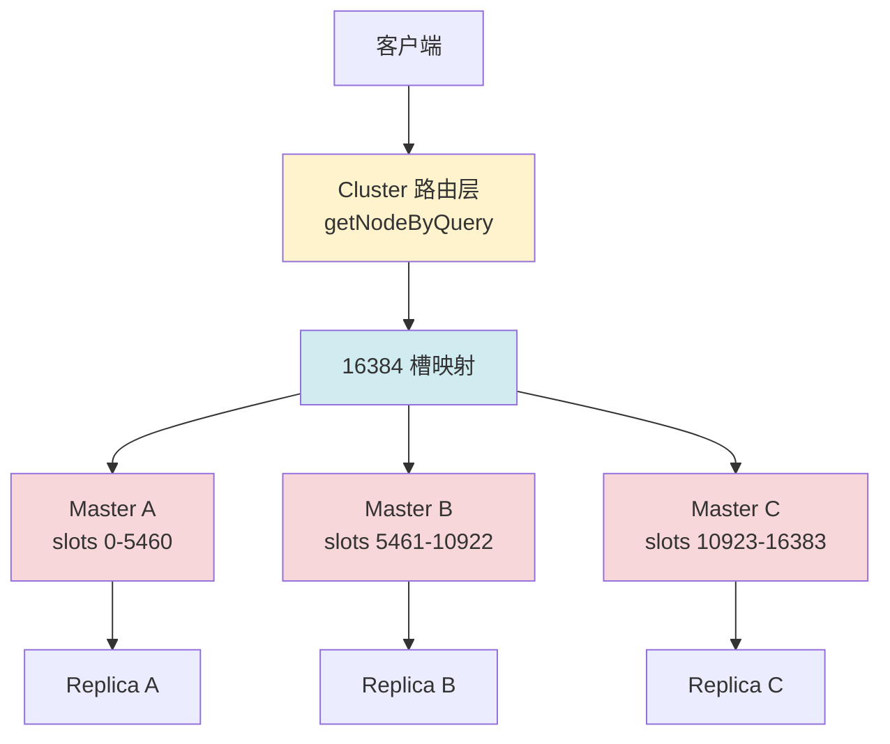
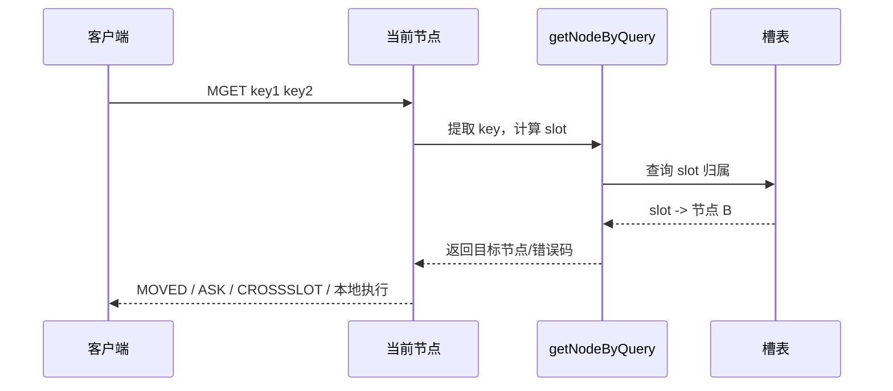

# Chapter 7: 集群分片

在上一章[哨兵与高可用](06_哨兵与高可用.md)中，我们解决了“主节点挂了怎么办”的问题。但 Sentinel 解决的是**同一份数据的高可用**，它并没有解决另一个更尖锐的问题：**当单机内存、单机 CPU、单机网络都到顶时，数据还能往哪里放？**

## 从一个实际问题说起

假设你在做一个大型电商平台，Redis 里存着用户会话、购物车、库存热点、排行榜缓存。最开始一台 64GB 的 Redis 足够用，但业务上涨后，很快就会遇到三类瓶颈：

1. **内存瓶颈**：热点数据量超过单机容量
2. **吞吐瓶颈**：所有请求都打到一台机器，单线程事件循环再高效也有上限
3. **运维瓶颈**：你不能再靠“换更大的机器”一直硬顶

最朴素的办法是自己做“分库分表式”拆分：比如用户 ID `% 4` 后路由到 4 台 Redis。这样看似能扩容，但很快会出问题：

- 客户端必须自己知道路由规则
- 扩容时要改客户端逻辑
- 数据迁移时客户端和服务端很难同步切换
- 多 key 命令很容易跨分片失效

Redis Cluster 的目标，就是把这套“数据分片 + 路由重定向 + 节点发现 + 在线迁移”的工作内建到服务端。

## Redis Cluster 是什么？一句话解释

Redis Cluster 就是一套把整个 key 空间切成 **16384 个哈希槽（hash slot）**，再把这些槽分配给多个主节点负责的机制。

| 概念 | 类比 | 说明 |
|------|------|------|
| 哈希槽 | 仓库货架编号 | 所有 key 先映射到 0..16383 中的某个槽 |
| 主节点 | 负责若干货架的仓库 | 每个主节点管理一部分槽 |
| 从节点 | 仓库备份员 | 复制主节点数据，用于故障切换 |
| `MOVED` | “去隔壁仓库拿” | 槽已稳定归属其他节点 |
| `ASK` | “这次先临时去那边拿” | 槽迁移中，临时重定向 |
| Hash Tag | 货物捆绑标签 | `{user:42}` 让多个 key 强制落到同一槽 |

一句话总结：**Redis Cluster 不是“随便分片”，而是把分片、路由和迁移都规范成统一的槽模型。**

## 在整体架构中的位置

Cluster 位于客户端请求入口和实际数据字典之间。它首先决定“这个命令应该在哪个节点执行”，然后才会真正进入数据库操作逻辑。



和前几章的关系是：

- 复制机制仍然存在，但现在是“每个主节点各自带自己的副本”
- Sentinel 的职责部分被 Cluster 自带的故障检测和 failover 接管
- 普通命令执行前，会先经过 Cluster 的槽校验与重定向逻辑

## 核心数据结构

### 1. 16384 个槽：整个设计的锚点

在 `src/cluster.h` 里，Redis 直接把槽空间定义死为 14 bit：

```c
// src/cluster.h
#define CLUSTER_SLOT_MASK_BITS 14
#define CLUSTER_SLOTS (1<<CLUSTER_SLOT_MASK_BITS)   // 16384
#define CLUSTER_SLOT_MASK ((unsigned long long)(CLUSTER_SLOTS - 1))
```

这意味着 Redis Cluster 的扩容单位不是“任意 key 范围”，而是固定的 16384 个离散槽。这样做的好处是：

1. 槽数固定，元数据规模稳定
2. 迁移时移动的是槽，不是重建全局哈希空间
3. 客户端缓存槽表后，可以 O(1) 决定目标节点

### 2. key 到槽的映射：`keyHashSlot`

Redis 用 CRC16 的低 14 位来决定 key 所属槽位：

```c
// src/cluster.h
static inline unsigned int keyHashSlot(const char *key, int keylen) {
    int s, e;

    for (s = 0; s < keylen; s++)
        if (key[s] == '{') break;

    if (likely(s == keylen)) return crc16(key,keylen) & 0x3FFF;

    for (e = s+1; e < keylen; e++)
        if (key[e] == '}') break;

    if (e == keylen || e == s+1) return crc16(key,keylen) & 0x3FFF;

    return crc16(key+s+1,e-s-1) & 0x3FFF;
}
```

这段代码里最关键的是 `{...}` 规则，也就是 **hash tag**：

- `user:1:name` 和 `user:1:cart` 默认大概率落在不同槽
- `{user:1}:name` 和 `{user:1}:cart` 会对 `user:1` 求槽，因此落在同一槽

这就是 Redis Cluster 支持多 key 命令的核心前提。

### 3. 重定向错误码：客户端协议的一部分

Cluster 不只是内部路由，还把路由结果编码成客户端可理解的协议错误：

```c
// src/cluster.h
#define CLUSTER_REDIR_NONE 0
#define CLUSTER_REDIR_CROSS_SLOT 1
#define CLUSTER_REDIR_UNSTABLE 2
#define CLUSTER_REDIR_ASK 3
#define CLUSTER_REDIR_MOVED 4
#define CLUSTER_REDIR_DOWN_STATE 5
#define CLUSTER_REDIR_DOWN_UNBOUND 6
#define CLUSTER_REDIR_DOWN_RO_STATE 7
#define CLUSTER_REDIR_TRIMMING 8
```

这些错误码不是“异常情况补丁”，而是 Cluster 正常工作流程的一部分。

## 关键操作实现

## 一次命令如何找到目标节点

大多数命令在真正执行前，都会经过 `src/cluster.c` 里的 `getNodeByQuery()` 做路由判定。



核心代码如下：

```c
// src/cluster.c - getNodeByQuery()
for (j = 0; j < result.numkeys; j++) {
    robj *thiskey = margv[keyindex[j].pos];
    int thisslot = pcmd->slot;
    if (thisslot == INVALID_CLUSTER_SLOT)
        thisslot = keyHashSlot((char*)thiskey->ptr, sdslen(thiskey->ptr));

    if (firstkey == NULL) {
        firstkey = thiskey;
        slot = thisslot;
        n = getNodeBySlot(slot);
        if (n == NULL) {
            if (error_code) *error_code = CLUSTER_REDIR_DOWN_UNBOUND;
            return NULL;
        }
    } else {
        if (slot != thisslot) {
            if (error_code) *error_code = CLUSTER_REDIR_CROSS_SLOT;
            return NULL;
        }
    }
}
```

这段逻辑实际上做了三件事：

1. **提取命令中的所有 key**
2. **把每个 key 映射到槽**
3. **确认所有 key 是否都在同一槽**

如果命令涉及多个槽，直接返回 `CROSSSLOT`。这就是 Redis Cluster 对多 key 命令的硬约束。

### 一个具体例子

假设当前槽分布如下：

| 槽 | 节点 |
|----|------|
| 1000 | Node A |
| 8000 | Node B |

命令：

```text
MGET {user:42}:name {user:42}:cart
```

两个 key 的 hash tag 都是 `user:42`，因此会进入同一槽，可以继续执行。

而：

```text
MGET user:42:name order:99
```

这两个 key 大概率落在不同槽，`getNodeByQuery()` 会直接返回 `CLUSTER_REDIR_CROSS_SLOT`。

## MOVED 和 ASK：稳定重定向 vs 临时重定向

当槽稳定归属其他节点时，Redis 返回 `MOVED`；当槽正处于迁移窗口中，则可能返回 `ASK` 或 `TRYAGAIN`。

```c
// src/cluster.c
if (migrating_slot && missing_keys) {
    if (existing_keys) {
        if (error_code) *error_code = CLUSTER_REDIR_UNSTABLE;
        return NULL;
    } else {
        if (error_code) *error_code = CLUSTER_REDIR_ASK;
        return getMigratingSlotDest(slot);
    }
}
```

设计意图很清楚：

- **`MOVED`**：槽已经完成归属切换，客户端应该更新本地槽表
- **`ASK`**：只是“这一次临时去目标节点试试”，客户端不能因此永久改槽表
- **`TRYAGAIN`**：迁移中当前请求包含多个 key，局面不稳定，先别执行

最终返回给客户端的协议由 `clusterRedirectClient()` 统一生成：

```c
// src/cluster.c - clusterRedirectClient()
if (error_code == CLUSTER_REDIR_CROSS_SLOT) {
    addReplyError(c,"-CROSSSLOT Keys in request don't hash to the same slot");
} else if (error_code == CLUSTER_REDIR_MOVED ||
           error_code == CLUSTER_REDIR_ASK)
{
    int port = clusterNodeClientPort(n, shouldReturnTlsInfo());
    addReplyErrorSds(c,sdscatprintf(sdsempty(),
                                    "-%s %d %s:%d",
                                    (error_code == CLUSTER_REDIR_ASK) ? "ASK" : "MOVED",
                                    hashslot, clusterNodePreferredEndpoint(n), port));
}
```

这也是为什么 Redis Cluster 客户端必须支持槽缓存和重试逻辑，否则根本无法正常工作。

## 集群模式下为什么脚本和事务也受槽约束

第 9 章会详细讲 Lua 和事务，但 Cluster 在这里已经提前把约束定死了：**一个命令批次里的 key 必须能被一个节点独立处理**。

在 `getNodeByQuery()` 中，`EXEC` 会被当成一个“命令容器”统一检查：

```c
// src/cluster.c
if (cmd->proc == execCommand) {
    if (!(c->flags & CLIENT_MULTI)) return myself;
    ms = &c->mstate;
} else {
    ms = &_ms;
    _ms.commands = &mcp;
    _ms.count = 1;
}
```

也就是说，事务不是“先排队，最后随便发给多个节点”，而是 **在执行前就必须证明整个事务只碰一个槽**。Lua 脚本也是同样的理由。

## 设计决策分析

### 为什么是 16384 个槽，而不是一致性哈希环？

| 方案 | 优点 | 代价 |
|------|------|------|
| 固定槽位 | 元数据稳定、客户端易缓存、迁移粒度统一 | 槽数固定 |
| 一致性哈希环 | 理论上更“弹性” | 客户端和服务端状态更复杂，迁移与统计更难规范 |

Redis 选择固定槽位，本质上是工程上的取舍：

- 它并不追求抽象上最优雅
- 它追求的是**协议简单、客户端实现稳定、运维行为可预期**

### 为什么 Redis 不支持任意跨槽多 key 操作？

因为 Redis 的命令执行模型是“单节点原子”，而不是分布式事务协调器。

如果允许任意跨槽 `MSET`、`SUNION`、Lua 脚本：

- 必须引入跨节点 RPC
- 要处理部分成功、回滚、超时和重试
- 单线程事件循环会被分布式协调拖复杂

Redis 直接选择另一条路：**把复杂性前移到 key 设计阶段，用 hash tag 保证相关 key 同槽。**

## 端到端示例

假设集群有三个主节点：

| 节点 | 负责槽 |
|------|--------|
| Node A | 0 - 5000 |
| Node B | 5001 - 10000 |
| Node C | 10001 - 16383 |

现在执行：

```text
GET {order:9001}:status
```

执行过程：

1. `keyHashSlot()` 对 `order:9001` 求 CRC16，得到例如槽 `7200`
2. `getNodeBySlot(7200)` 返回 Node B
3. 如果当前连的是 Node B，直接本地执行
4. 如果当前连的是 Node A，返回 `-MOVED 7200 <node-b-ip>:6379`
5. 客户端刷新槽表，下一次直接访问 Node B

如果此时槽 `7200` 正在从 Node B 迁往 Node C：

1. Node B 发现该槽处于 migrating 状态
2. 如果 key 不在本地，返回 `ASK`
3. 客户端先对 Node C 发送 `ASKING`
4. 再重放原始命令

这套流程保证了**在线迁移期间依然可读写，只是客户端需要配合一次临时重定向。**

## 小结

本章最重要的点有六个：

1. Redis Cluster 的核心抽象不是“节点”，而是 **16384 个槽**
2. `keyHashSlot()` 用 CRC16 低 14 位决定 key 归属，`{...}` 可以强制同槽
3. `getNodeByQuery()` 是命令执行前的统一路由关口
4. `CROSSSLOT` 不是限制实现不够，而是 Redis 明确拒绝分布式协调复杂度
5. `MOVED` 代表稳定归属变化，`ASK` 代表迁移中的临时重定向
6. 事务、脚本、分片 Pub/Sub 最终都要服从槽约束

下一章回到单节点内部：当 key 变多、内存吃紧时，Redis 如何决定“哪些 key 到期该删，哪些 key 该淘汰”？这就是[过期策略与内存淘汰](08_过期策略与内存淘汰.md)要回答的问题。

[上一章：哨兵与高可用](06_哨兵与高可用.md) | [下一章：过期策略与内存淘汰](08_过期策略与内存淘汰.md)
