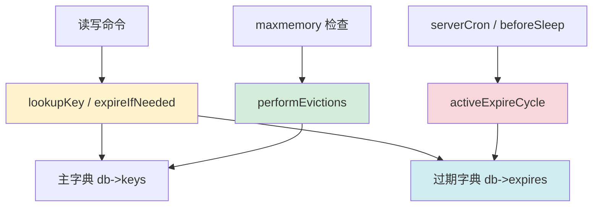

# Chapter 8: 过期策略与内存淘汰

在上一章[集群分片](07_集群分片.md)中，我们讨论的是“数据放到哪台机器上”。这一章要回答的是另一个同样现实的问题：**当数据太多、时间到了、内存不够了，Redis 该删什么？**

## 从一个实际问题说起

假设你在做一个秒杀系统：

- 登录态缓存 30 分钟失效
- 商品库存快照 5 秒失效
- 排行榜缓存 1 分钟失效
- 某些统计 key 根本不设 TTL，但机器内存有上限

这时系统面对的是两类“删除”问题：

1. **过期（expire）**：这个 key 的生命周期已经结束，逻辑上就该消失
2. **淘汰（eviction）**：这个 key 还没过期，但系统内存不够，必须让出空间

这两类问题表面都叫“删 key”，但本质完全不同：

- 过期是**时间驱动**
- 淘汰是**内存压力驱动**

Redis 把这两个子系统分开实现：过期主线在 `expire.c` / `db.c`，淘汰主线在 `evict.c`。

## 过期与淘汰是什么？一句话解释

Redis 的 key 删除机制可以理解成一个“双保安”系统：

| 机制 | 类比 | 触发条件 |
|------|------|----------|
| 惰性过期 | 查门禁时发现证件过期 | 访问 key 时顺手检查 TTL |
| 定期过期 | 巡逻保安定时清场 | 后台周期扫描 expires 字典 |
| 内存淘汰 | 仓库爆仓时主动扔货 | `used_memory > maxmemory` |

一句话总结：**Redis 不靠单一策略回收内存，而是把“访问时发现”和“后台主动清理”结合起来，再在必要时叠加 maxmemory 淘汰。**

## 在整体架构中的位置



可以把它理解成三条并行路径：

1. **命令路径**：读写 key 时顺便做惰性过期
2. **后台路径**：事件循环周期性触发主动过期扫描
3. **内存保护路径**：命令执行前判断是否需要淘汰 key

## 核心数据结构

### 1. 过期时间不放在对象里，而是单独维护

Redis 并不是把 TTL 强塞进每个对象头里，而是为每个 DB 单独维护一个 `expires` 结构。这样设计的好处是：**没有 TTL 的 key 不需要承担额外元数据成本**。

从源码职责可以看到：

- `db->keys` 保存真正的数据
- `db->expires` 保存“这个 key 什么时候过期”

所以一个 key 的 TTL 是“旁路元数据”，不是对象本体的一部分。

### 2. 惰性过期的状态返回值

在 `src/db.c` 中，`expireIfNeeded()` 不只是返回 true/false，而是区分更细的状态：

```c
// src/db.c - expireIfNeeded()
if ((flags & EXPIRE_ALLOW_ACCESS_EXPIRED) ||
    (!keyIsExpired(db,  key ? key->ptr : NULL, kv)))
    return KEY_VALID;

if (server.masterhost != NULL || server.cluster_enabled) {
    if (server.current_client && (server.current_client->flags & CLIENT_MASTER)) return KEY_VALID;
    if (server.masterhost != NULL && !(flags & EXPIRE_FORCE_DELETE_EXPIRED)) return KEY_EXPIRED;
}

if (flags & EXPIRE_AVOID_DELETE_EXPIRED)
    return KEY_EXPIRED;

deleteExpiredKeyAndPropagate(db, key);
return KEY_DELETED;
```

这说明 Redis 不是“看到过期就无脑删”：

- 有时候只返回“逻辑上过期”
- 有时候要真正删除并传播 DEL
- 在副本、集群迁移、暂停过期等场景下，行为还会不同

### 3. 淘汰池：近似 LRU/LFU 的候选缓存

在 `src/evict.c` 中，Redis 用一个固定大小的候选池来逼近最优淘汰对象：

```c
// src/evict.c
#define EVPOOL_SIZE 16

struct evictionPoolEntry {
    unsigned long long idle;    // LRU: 空闲时长；LFU: 逆频率
    sds key;                    // key 名
    sds cached;                 // 复用的小 SDS 缓冲
    int dbid;                   // 所属 DB
    int slot;                   // 所属 slot
};
```

这个池不是“真正缓存最老的 16 个 key”，而是**每轮采样后留下来的 16 个最像该淘汰的 key**。

## 关键操作实现

## 惰性过期：访问时顺手检查

最直接的过期路径发生在 key 被访问时。先判断逻辑是否过期，再决定要不要真正删除。

```c
// src/db.c - keyIsExpired()
int keyIsExpired(redisDb *db, sds key, kvobj *kv) {
    if (server.loading || server.allow_access_expired) return 0;
    mstime_t when = getExpire(db, key, kv);
    if (when < 0) return 0;
    const mstime_t now = commandTimeSnapshot();
    return now > when;
}
```

随后进入 `expireIfNeeded()`：

```c
// src/db.c - expireIfNeeded()
if ((flags & EXPIRE_ALLOW_ACCESS_EXPIRED) ||
    (!keyIsExpired(db, key ? key->ptr : NULL, kv)))
    return KEY_VALID;

if (flags & EXPIRE_AVOID_DELETE_EXPIRED)
    return KEY_EXPIRED;

deleteExpiredKeyAndPropagate(db, key);
return KEY_DELETED;
```

这条路径的优势是：

1. 实现简单
2. 不需要后台立刻扫描全量数据
3. 热 key 一旦过期，第一次访问就能被及时清掉

但它也有明显局限：**如果一个过期 key 再也没人访问，它会一直躺在内存里。**

所以 Redis 必须补上第二条路径。

## 主动过期：后台定期巡检

`activeExpireCycle()` 就是后台巡逻保安。它不会扫描所有 key，而是只扫描 `expires` 字典里的样本，并根据“过期比例”自适应决定要不要继续干活。

```c
// src/expire.c - activeExpireCycle()
if (num > config_keys_per_loop)
    num = config_keys_per_loop;

while (data.sampled < num && checked_buckets < max_buckets) {
    db->expires_cursor = kvstoreScan(db->expires, db->expires_cursor, -1,
                                     expireScanCallback,
                                     expirySamplingShouldSkipDict, &data);
    if (db->expires_cursor == 0) {
        db_done = 1;
        break;
    }
    checked_buckets++;
}

repeat = db_done ? 0 :
    (data.sampled == 0 ||
    (data.expired * 100 / data.sampled) > config_cycle_acceptable_stale);
```

这里有两个很重要的设计点：

1. **采样而不是全表扫描**
2. **如果样本中过期率很高，就继续扫；否则及时停手**

这让 Redis 能把主动过期做成一个“有预算的后台任务”，而不是不可控的停顿源。

真正删除单个过期 key 的动作在 `activeExpireCycleTryExpire()`：

```c
// src/expire.c
int activeExpireCycleTryExpire(redisDb *db, kvobj *kv, long long now) {
    if (now < kvobjGetExpire(kv))
        return 0;

    sds key = kvobjGetKey(kv);
    robj *keyobj = createStringObject(key,sdslen(key));
    deleteExpiredKeyAndPropagate(db,keyobj);
    server.stat_expiredkeys_active++;
    decrRefCount(keyobj);
    return 1;
}
```

### 一个具体例子

假设某个 DB 里有 100 万个设置了 TTL 的 key，其中 30 万已经逻辑过期。

如果只靠惰性过期：

- 只有再次访问到这 30 万个 key 时才会删除
- 那些永远不会再访问的 key 会白占内存

有了 `activeExpireCycle()`：

1. Redis 周期性抽样 `expires` 字典
2. 发现过期比例很高
3. 就加大扫描力度继续清理
4. 直到耗尽本轮时间预算，或者过期比例降下来

这就是它“自适应”的核心。

## 内存淘汰：maxmemory 的最后防线

当 `used_memory` 超过 `maxmemory`，问题就不再是“这个 key 是否到期”，而是“必须马上释放一些内存”。

`performEvictions()` 是整个淘汰流程的总调度器：

```c
// src/evict.c - performEvictions()
if (getMaxmemoryState(&mem_reported,NULL,&mem_tofree,NULL) == C_OK) {
    result = EVICT_OK;
    goto update_metrics;
}

if (server.maxmemory_policy == MAXMEMORY_NO_EVICTION) {
    result = EVICT_FAIL;
    goto update_metrics;
}

while (mem_freed < (long long)mem_tofree) {
    ...
    deleteEvictedKeyAndPropagate(db, keyobj, &key_mem_freed);
    mem_freed += key_mem_freed;
}
```

如果策略是 `noeviction`，Redis 直接拒绝可能增大内存的命令；否则就进入挑 key 流程。

### 近似 LRU/LFU 为什么不是精确排序

Redis 没有为所有 key 维护一个严格全局的 LRU 或 LFU 堆，而是采用“采样 + 候选池”的折中：

```c
// src/evict.c - evictionPoolPopulate()
if (server.maxmemory_policy & (MAXMEMORY_FLAG_LRU|MAXMEMORY_FLAG_LRM)) {
    idle = estimateObjectIdleTime(kv);
} else if (server.maxmemory_policy & MAXMEMORY_FLAG_LFU) {
    idle = 255-LFUDecrAndReturn(kv);
} else if (server.maxmemory_policy == MAXMEMORY_VOLATILE_TTL) {
    idle = ULLONG_MAX - kvobjGetExpire(kv);
}
```

然后把这些样本按“更值得淘汰”的顺序插进 `evictionPoolEntry[16]`。

设计理由很现实：

- 精确 LRU 需要维护全局链表或堆，写路径负担大
- Redis 是高吞吐内存数据库，不能为了淘汰精度牺牲常规命令开销
- 用少量采样换一个近似最优，性价比更高

## 设计决策分析

### 为什么既要惰性过期又要主动过期？

| 策略 | 优点 | 缺点 |
|------|------|------|
| 只做惰性过期 | 简单，访问路径自然 | 冷过期 key 会长期占内存 |
| 只做主动过期 | 理论上更“干净” | 后台扫描成本高，抖动更大 |
| 两者结合 | 及时性和成本平衡 | 逻辑更复杂 |

Redis 选择“双轨制”，本质上是在 **CPU 开销、内存回收及时性、实现复杂度** 之间取平衡。

### 为什么淘汰用近似算法而不是精确算法？

因为 Redis 的首要目标不是“淘汰决策绝对最优”，而是“普通命令路径尽量轻”。如果每次访问都去维护一个昂贵的全局排序结构，缓存系统本身就会被元数据拖慢。

## 端到端示例

假设系统配置：

- `maxmemory 1gb`
- `maxmemory-policy allkeys-lru`

同时有三类 key：

| key | 是否有 TTL | 最近访问情况 |
|-----|------------|--------------|
| `session:1` | 30 分钟 | 刚访问过 |
| `cart:2` | 10 分钟 | 20 分钟没访问 |
| `rank:global` | 无 TTL | 1 小时没访问 |

当执行一个新的 `SET big:key ...` 时：

1. Redis 先判断当前内存是否超限
2. 若超限，进入 `performEvictions()`
3. 因为是 `allkeys-lru`，所有 key 都可能成为候选
4. 采样多个 key，计算近似 idle time
5. 候选池右侧最“老”的 key 被优先淘汰
6. 如果释放内存仍不够，继续淘汰下一批

这里要注意：

- `session:1` 虽然有 TTL，但如果刚访问过，未必会先被淘汰
- `rank:global` 即使没有 TTL，也可能因为太久没访问而先被淘汰
- “过期”与“淘汰”是两套独立判定逻辑

## 小结

本章的核心点有七个：

1. 过期和淘汰不是一回事：一个是时间驱动，一个是内存驱动
2. 惰性过期依赖访问路径，及时但不全面
3. 主动过期依赖后台抽样扫描，补上冷 key 清理
4. `expireIfNeeded()` 在主从、集群、暂停、迁移等场景下有细粒度行为分支
5. `activeExpireCycle()` 通过采样比例和时间预算控制 CPU 开销
6. `performEvictions()` 是 maxmemory 保护机制的核心入口
7. LRU/LFU 淘汰使用的是近似策略，而不是精确全局排序

下一章进入 Redis 的“可编程事务层”：`MULTI/EXEC`、`WATCH`、Lua 脚本和 `FUNCTION/FCALL` 是如何在源码里统一约束和执行的？这就是[事务与 Lua 脚本](09_事务与lua脚本.md)要讲的内容。

[上一章：集群分片](07_集群分片.md) | [下一章：事务与 Lua 脚本](09_事务与lua脚本.md)
