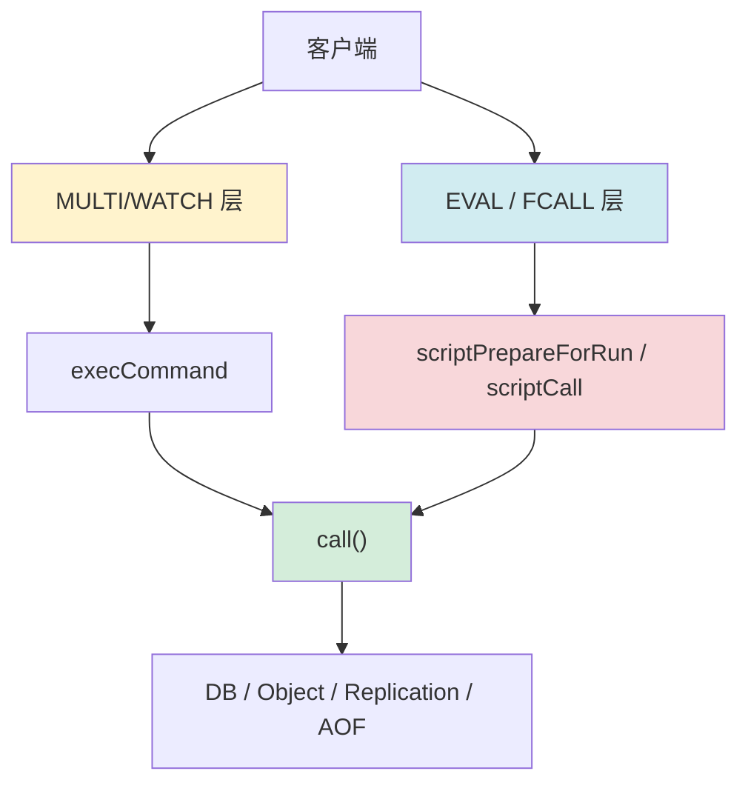

# Chapter 9: 事务与 Lua 脚本

在上一章[过期策略与内存淘汰](08_过期策略与内存淘汰.md)中，我们讨论的是 Redis 如何管理数据生命周期。接下来要讨论的是另一个问题：**当多个命令必须作为一个整体执行时，Redis 怎么保证行为可控？**

## 从一个实际问题说起

假设你在做一个余额扣减系统。用户下单时，你至少要做三步：

1. 检查余额
2. 扣减库存
3. 记录订单

如果这三步是三条独立命令，中间任何一步被其他客户端插队，就可能出现：

- 库存扣了，但订单没写
- 余额判断基于旧值
- 多个客户端同时看到“库存充足”

最直接的诉求通常是“给我事务”。但 Redis 的事务并不是传统关系数据库里那种支持任意回滚、隔离级别和锁管理的重事务模型。Redis 提供的是两条更贴合自身架构的路：

1. **`MULTI/EXEC` + `WATCH`**：把多条命令排队后串行执行，必要时做乐观并发控制
2. **Lua / Functions**：把一段逻辑整体送进服务器，在单线程里一次跑完

## Redis 事务与脚本是什么？一句话解释

可以把这两套机制理解成两种“打包执行”方式：

| 机制 | 类比 | 核心能力 |
|------|------|----------|
| `MULTI/EXEC` | 先把待办事项写进清单，再统一执行 | 多命令批量串行执行 |
| `WATCH` | 提交前检查“清单依赖的对象是否被别人动过” | 乐观锁 |
| `EVAL/EVALSHA` | 把整段业务规则交给服务器执行 | 逻辑级原子执行 |
| `FUNCTION/FCALL` | 把脚本升级成可复用、持久化的服务器函数 | 更工程化的脚本能力 |

一句话总结：**Redis 不做复杂的事务协调器，而是用单线程执行模型，把“命令批次”与“服务器端脚本”做成两种不同粒度的原子单元。**

## 在整体架构中的位置



这张图说明了一件事：不管是事务还是脚本，最后都会回到统一的命令执行入口 `call()`。区别只是：

- 事务是在客户端侧**先排队，再顺序调用**
- 脚本是在服务器侧**先建立运行上下文，再由脚本逐条调用命令**

## 核心数据结构

### 1. 事务队列：`multiState`

客户端进入 `MULTI` 后，命令不会立即执行，而是进入 `mstate.commands` 队列。

从 `src/multi.c` 能看出其初始化方式：

```c
// src/multi.c
void initClientMultiState(client *c) {
    c->mstate.commands = NULL;
    c->mstate.count = 0;
    c->mstate.cmd_flags = 0;
    c->mstate.cmd_inv_flags = 0;
    c->mstate.argv_len_sums = 0;
    c->mstate.alloc_count = 0;
    c->mstate.executing_cmd = -1;
}
```

这里的关键点是：Redis 事务不是“执行时记录日志”，而是**排队阶段就把命令参数整体保存下来**。

### 2. WATCH 结构：每个 key 知道谁在盯着它

Redis 的乐观锁不是靠版本号，而是靠双向引用的 watch 关系：

```c
// src/multi.c
typedef struct watchedKey {
    listNode node;
    robj *key;
    redisDb *db;
    client *client;
    unsigned expired:1;
} watchedKey;
```

配合源码注释，可以总结出两层索引：

- `client->watched_keys`：这个客户端在 watch 哪些 key
- `db->watched_keys`：某个 key 正被哪些客户端 watch

这样一来：

- `WATCH k1` 时能快速登记
- `SET k1 ...` 时也能快速把相关客户端打脏

### 3. 脚本运行上下文：`scriptRunCtx`

Lua 和 Function 共用统一的脚本执行上下文：

```c
// src/script.h
struct scriptRunCtx {
    const char *funcname;
    client *c;
    client *original_client;
    int flags;
    int repl_flags;
    monotime start_time;
    int slot;
    int cluster_compatibility_check_slot;
};
```

这说明 Redis 并没有把 Lua 执行器写成一个“旁路系统”，而是把它包装成一个特殊 client：

- `c` 是脚本引擎使用的“伪客户端”
- `original_client` 是真正发起命令的外部客户端
- `flags` 决定是否只读、是否允许 OOM、是否允许跨槽

## 关键操作实现

## `MULTI` 到 `EXEC`：先排队，再串行执行

进入事务非常简单：打一个 `CLIENT_MULTI` 标记即可。

```c
// src/multi.c
void multiCommand(client *c) {
    if (c->flags & CLIENT_MULTI) {
        addReplyError(c,"MULTI calls can not be nested");
        return;
    }
    c->flags |= CLIENT_MULTI;
    addReply(c,shared.ok);
}
```

后续每条命令被放入事务队列：

```c
// src/multi.c - queueMultiCommand()
pendingCommand *pcmd = popPendingCommandFromHead(&c->pending_cmds);
c->current_pending_cmd = NULL;
pendingCommand **mc = c->mstate.commands + c->mstate.count;
*mc = pcmd;

c->mstate.count++;
c->mstate.cmd_flags |= cmd_flags;
```

等到 `EXEC`，Redis 再把这些命令逐条取出来顺序执行：

```c
// src/multi.c - execCommand()
addReplyArrayLen(c,c->mstate.count);
for (j = 0; j < c->mstate.count; j++) {
    c->argc = c->mstate.commands[j]->argc;
    c->argv = c->mstate.commands[j]->argv;
    c->cmd = c->realcmd = c->mstate.commands[j]->cmd;

    c->mstate.executing_cmd = j;
    call(c,CMD_CALL_FULL);
}
```

这里要特别注意：Redis 事务的“原子性”来自**单线程顺序执行时不会被其他命令插入**，而不是靠数据库级回滚。

也因此：

- 某条命令执行时报错，前面已经执行过的命令不会自动回滚
- Redis 保证的是“这个队列按顺序整体执行”，不是“像 SQL 一样失败即撤销”

## `WATCH`：乐观锁是怎么实现的

`WATCH` 的实现思路很直接：只要事务依赖的 key 被改动，就给客户端打上 `CLIENT_DIRTY_CAS` 标志，`EXEC` 时直接失败。

登记 watch：

```c
// src/multi.c - watchForKey()
clients = dictFetchValue(c->db->watched_keys,key);
if (!clients) {
    clients = listCreate();
    dictAdd(c->db->watched_keys,key,clients);
    incrRefCount(key);
}

wk = zmalloc(sizeof(*wk));
wk->key = key;
wk->client = c;
wk->db = c->db;
wk->expired = keyIsExpired(c->db, key->ptr, NULL);
listAddNodeTail(c->watched_keys, wk);
```

提交前检查：

```c
// src/multi.c - execCommand()
if (isWatchedKeyExpired(c)) {
    c->flags |= (CLIENT_DIRTY_CAS);
}

if (c->flags & (CLIENT_DIRTY_CAS | CLIENT_DIRTY_EXEC)) {
    if (c->flags & CLIENT_DIRTY_EXEC) {
        addReplyErrorObject(c, shared.execaborterr);
    } else {
        addReply(c, shared.nullarray[c->resp]);
    }
    discardTransaction(c);
    return;
}
```

这就是 Redis 的 CAS 风格事务：

1. 先 `WATCH balance:42`
2. 读取余额
3. `MULTI`
4. 排队若干写命令
5. `EXEC`
6. 如果期间 key 被别人改过，`EXEC` 返回空数组，调用方重试

## Lua / EVAL：不是“批量命令”，而是“服务器端执行环境”

`EVAL` 在 `src/eval.c` 中最终会构造 Lua 函数并建立运行上下文：

```c
// src/eval.c
scriptRunCtx rctx;
if (scriptPrepareForRun(&rctx, lctx.lua_client, c, lua_cur_script, l->flags, ro) != C_OK) {
    lua_pop(lua,2);
    return;
}
rctx.flags |= SCRIPT_EVAL_MODE;

luaCallFunction(&rctx, lua, c->argv+3, numkeys, c->argv+3+numkeys, c->argc-3-numkeys, ldb.active);
scriptResetRun(&rctx);
```

关键点在 `scriptPrepareForRun()`，它会在真正执行前把各种限制一次性检查好：

```c
// src/script.c
if (!(script_flags & SCRIPT_FLAG_NO_WRITES)) {
    if (server.masterhost && server.repl_slave_ro && !obey_client) {
        addReplyError(caller, "-READONLY Can not run script with write flag on readonly replica");
        return C_ERR;
    }
}

if (!client_allow_oom && server.pre_command_oom_state && server.maxmemory &&
    !(script_flags & (SCRIPT_FLAG_ALLOW_OOM|SCRIPT_FLAG_NO_WRITES)))
{
    addReplyError(caller, "-OOM allow-oom flag is not set on the script...");
    return C_ERR;
}
```

也就是说，Redis 对脚本的态度不是“你既然能写代码，就无限放权”，而是：

- 只读/只写能力要受 flag 控制
- OOM、只读副本、持久化失败、最小副本数限制都照样检查
- 脚本只是更高层的执行包装，不是权限后门

## 脚本里执行 Redis 命令时，约束依然存在

脚本内部调用命令时，会进入统一的 `scriptCall()`：

```c
// src/script.c - scriptCall()
if (scriptVerifyACL(c, err) != C_OK) goto error;
if (scriptVerifyWriteCommandAllow(run_ctx, err) != C_OK) goto error;
if (scriptVerifyOOM(run_ctx, err) != C_OK) goto error;
if (scriptVerifyClusterState(run_ctx, c, run_ctx->original_client, err) != C_OK) goto error;

call(c, call_flags);
```

这四个检查非常关键：

1. **ACL**
2. **写命令是否合法**
3. **OOM 下是否允许**
4. **集群槽约束是否满足**

所以 Lua 脚本虽然“原子”，但绝不是“为所欲为”。

## `FUNCTION/FCALL`：把脚本从临时命令升级成服务端能力

相比传统 `EVAL`，`FUNCTION/FCALL` 更像“可部署的服务器函数”。

```c
// src/functions.c - fcallCommandGeneric()
functionInfo *fi = dictGetVal(de);
scriptRunCtx run_ctx;

if (scriptPrepareForRun(&run_ctx, fi->li->ei->c, c, fi->name, fi->f_flags, ro) != C_OK)
    return;

engine->call(&run_ctx, engine->engine_ctx, fi->function, c->argv + 3, numkeys,
             c->argv + 3 + numkeys, c->argc - 3 - numkeys);
scriptResetRun(&run_ctx);
```

可以看到它和 `EVAL` 的统一性非常强：

- 同样依赖 `scriptRunCtx`
- 同样走 `scriptPrepareForRun`
- 同样受只读、OOM、Cluster 等限制

差别主要在工程层面：

- `EVAL` 偏临时执行
- `FUNCTION` 偏持久化部署和复用

## 设计决策分析

### 为什么 Redis 事务不支持回滚？

| 方案 | 优点 | 代价 |
|------|------|------|
| 支持回滚 | 语义更接近传统数据库 | 需要维护 undo log，复杂度高 |
| 不支持回滚 | 模型简单，和单线程命令执行一致 | 出错后由业务方处理补偿 |

Redis 选择后者，是因为它本来就是一个以内存、速度、简单命令语义为核心的系统。引入复杂回滚机制，会显著提高实现负担，也和“命令立即生效”的整体设计相冲突。

### 为什么 Lua / Function 比事务更适合复杂逻辑？

因为 `MULTI/EXEC` 只能“排队命令”，而不能在服务器端做真正的条件分支、循环和中间计算。只要你的业务逻辑需要：

- 读值再判断
- 根据结果决定后续命令
- 把多步逻辑压成一次网络往返

Lua/Function 通常就是更合理的选择。

## 端到端示例

假设要实现“余额足够才扣款”的逻辑。

### 方案 1：`WATCH` + `MULTI/EXEC`

1. `WATCH balance:user42`
2. `GET balance:user42`
3. 客户端判断余额是否足够
4. `MULTI`
5. `DECRBY balance:user42 100`
6. `SET order:9001 paid`
7. `EXEC`

如果步骤 2 到步骤 7 之间有别人改动 `balance:user42`，`EXEC` 直接失败，客户端重试。

### 方案 2：Lua

把“检查 + 扣减 + 记账”全写进脚本：

1. 客户端发送一次 `EVAL`
2. Redis 在单线程里完整执行脚本
3. 中间不会被其他命令插入
4. 结果一次返回

对于这种“读后判断再写”的场景，Lua 往往比事务更直接。

## 小结

本章的关键点有八个：

1. Redis 事务的本质是“排队后串行执行”，不是传统数据库事务
2. `MULTI` 只做入队，不做即时执行
3. `EXEC` 会把事务队列逐条送进统一的 `call()` 路径
4. `WATCH` 用的是乐观并发控制，而不是锁
5. 事务失败时 Redis 不做回滚，业务方需要重试或补偿
6. `EVAL` 和 `FUNCTION` 都通过 `scriptRunCtx` 统一管理执行上下文
7. 脚本内部命令仍然受 ACL、OOM、Cluster、只读等规则限制
8. 需要条件逻辑时，Lua/Function 通常比 `MULTI/EXEC` 更适合

下一章我们回到消息模型，看 Redis 如何在不持久化、不建队列的前提下，实现频道式广播，这就是[发布订阅系统](10_发布订阅系统.md)。

[上一章：过期策略与内存淘汰](08_过期策略与内存淘汰.md) | [下一章：发布订阅系统](10_发布订阅系统.md)
