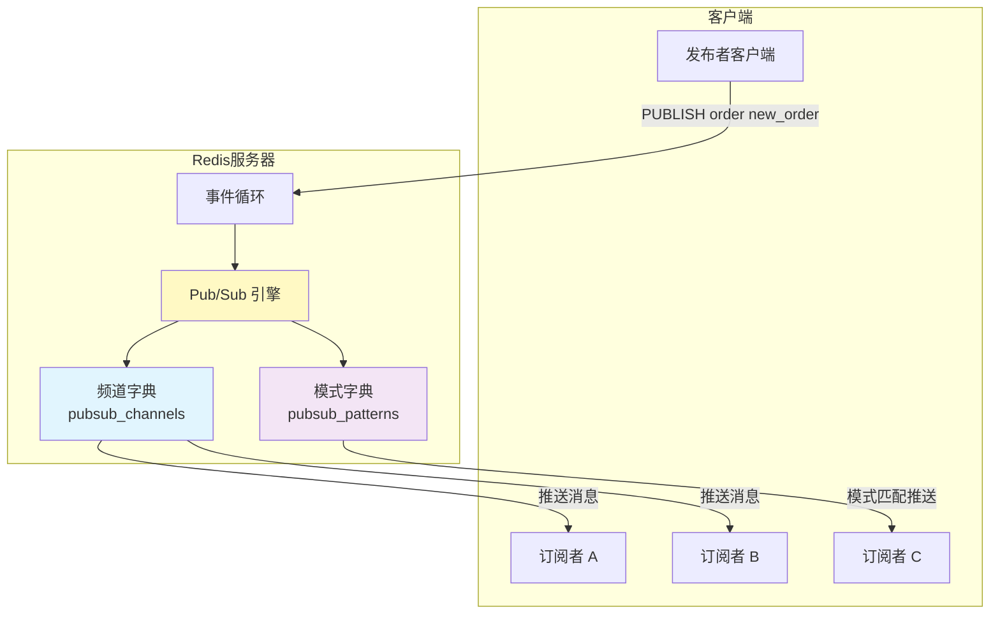
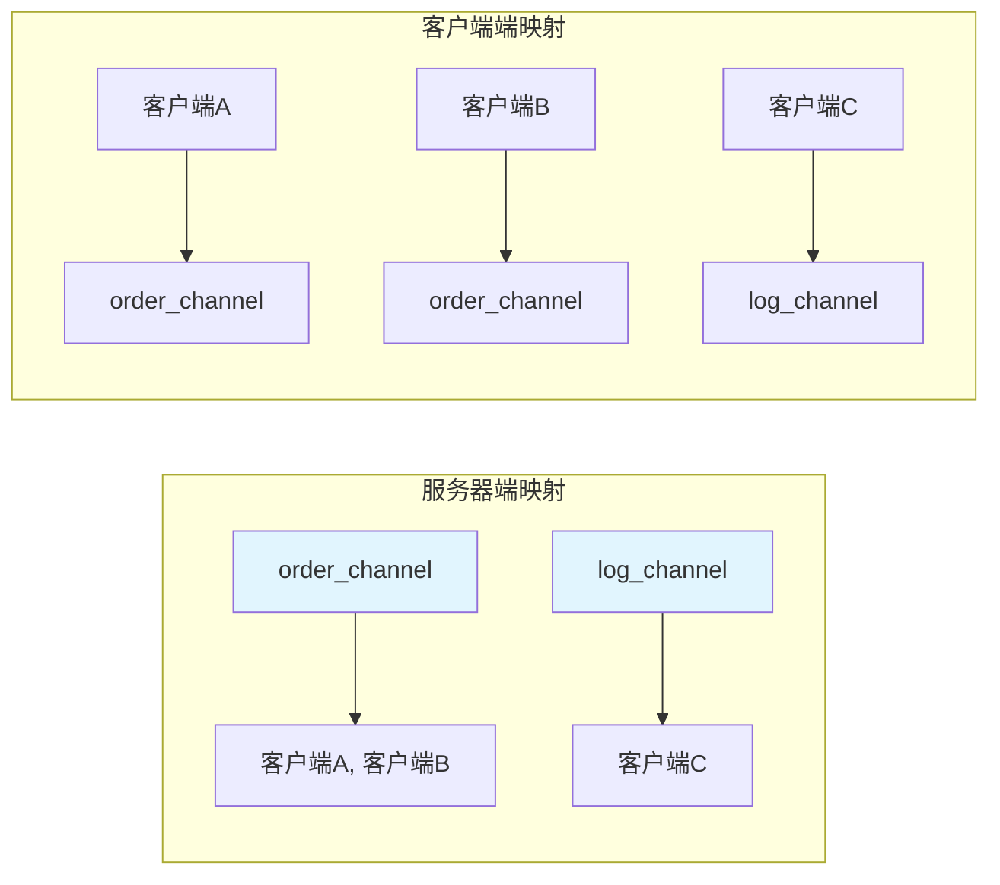
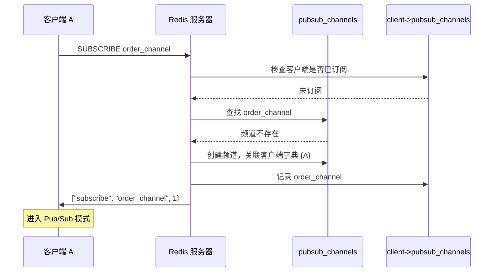
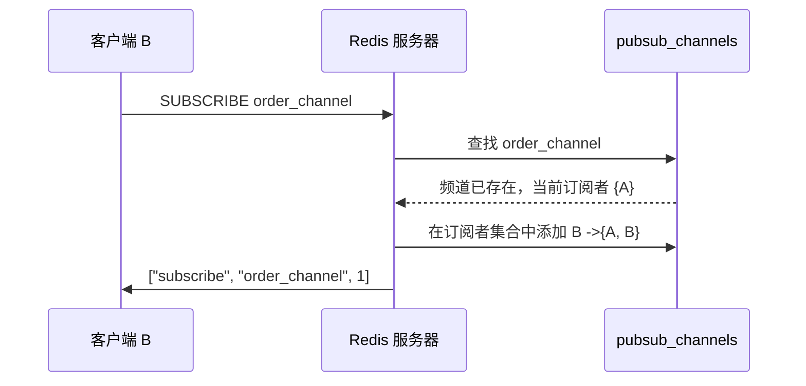
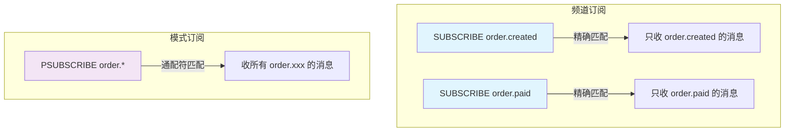
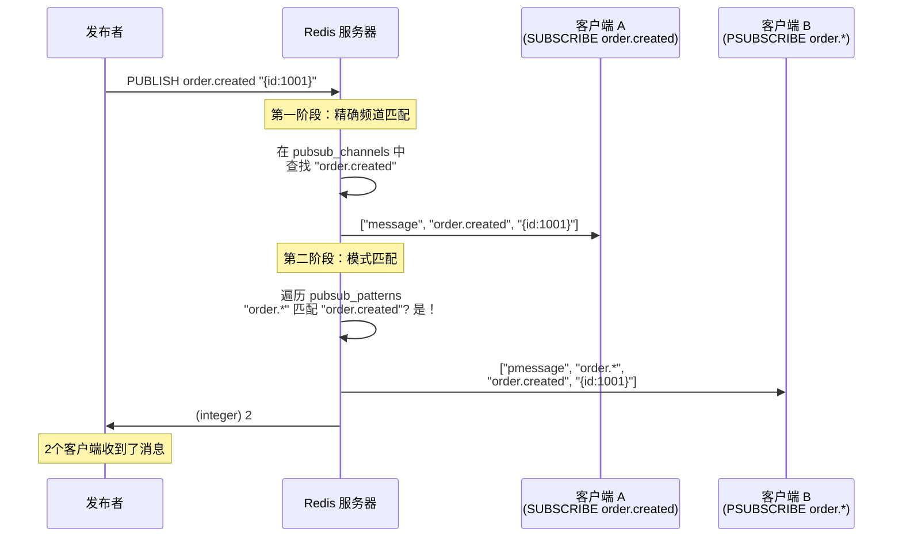
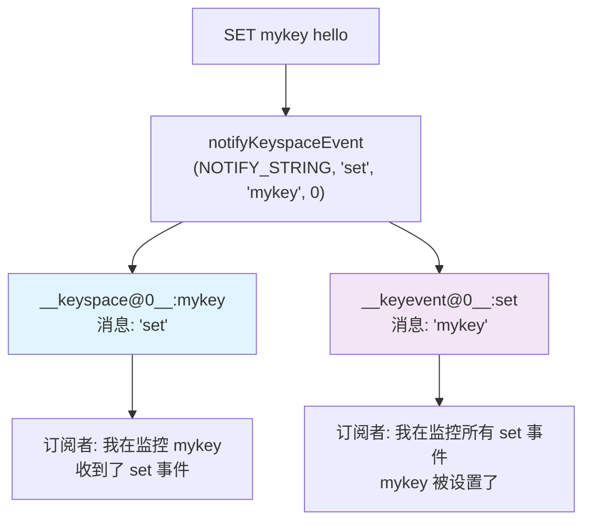
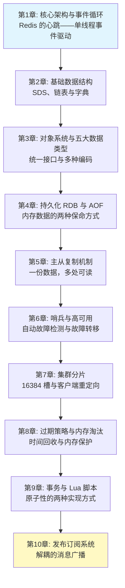

# Chapter 10: 发布订阅系统

在[上一章：事务与 Lua 脚本](09_事务与lua脚本.md)中，我们讨论了 Redis 如何把多条命令或一段逻辑打包成一个原子执行单元。但现实中还有另一类非常常见的需求：**消息的实时广播**。本章就来看看 Redis 是如何用发布订阅（Pub/Sub）系统解决这个问题的。

## 从一个实际问题说起

假设你正在开发一个电商平台，系统由多个微服务组成：订单服务、库存服务、通知服务、数据分析服务。当用户下了一笔订单，你需要：

1. **库存服务**扣减库存
2. **通知服务**给用户发短信
3. **数据分析服务**记录一笔交易

最直接的做法是订单服务挨个调用其他三个服务。但这有几个问题：订单服务需要知道所有下游服务的地址；每加一个消费方，就得改订单服务的代码；如果某个服务暂时挂了，整个链路就卡住了。

更优雅的做法是引入一个**消息广播机制**：订单服务只管往一个"频道"里喊一声"有新订单了！"，所有感兴趣的服务自己来听。服务之间完全解耦——发布者不需要知道谁在听，订阅者也不需要知道消息从哪来。

这就是发布订阅（Pub/Sub）模型，Redis 内建了对它的完整支持。

## 发布订阅系统是什么？一句话解释

在理解代码之前，我们先用一个日常生活的类比来建立直觉。

### 广播电台的类比

把 Redis 的 Pub/Sub 想象成一个**广播电台系统**：

| Pub/Sub 概念 | 广播类比 | 说明 |
|------|------|------|
| 频道（Channel） | 广播频率（FM 98.5） | 消息的"主题"标识 |
| 发布者（Publisher） | 电台主播 | 往频道里发送消息 |
| 订阅者（Subscriber） | 收音机听众 | 调到某个频率就能收到消息 |
| 模式订阅（Pattern） | "收听所有 FM 9x.x" | 用通配符匹配多个频道 |

关键特征和广播完全一样：
- 主播不知道有多少人在听（发布者不关心订阅者数量）
- 听众没调到频率就收不到（不订阅就没消息）
- 错过了就是错过了，不会重播（Fire-and-Forget）

## Pub/Sub 在整体架构中的位置



Pub/Sub 引擎是 Redis 服务器内部的一个独立子系统。它不涉及任何数据库的键值存储——频道不是 Redis 的 key，消息也不会被持久化。它纯粹是一个**内存中的消息路由器**。

## 核心数据结构

在 `server.h` 中，服务器和客户端各自维护着 Pub/Sub 相关的数据结构：

```c
// server.h - 服务器端（全局）
struct redisServer {
    kvstore *pubsub_channels;   // 频道 ->订阅该频道的客户端集合
    dict *pubsub_patterns;      // 模式 ->订阅该模式的客户端集合
    kvstore *pubsubshard_channels; // 分片级频道（Cluster模式）
    unsigned int pubsub_clients;   // 处于 Pub/Sub 模式的客户端数量
};

// server.h - 客户端端（每个连接）
typedef struct client {
    dict *pubsub_channels;       // 该客户端订阅的频道集合
    dict *pubsub_patterns;       // 该客户端订阅的模式集合
    dict *pubsubshard_channels;  // 该客户端订阅的分片频道
} client;
```

注意这里的**双向映射**设计：服务器端记录"每个频道有哪些客户端在听"，客户端端记录"我在听哪些频道"。为什么需要双向？因为发布消息时需要快速找到所有订阅者（服务器端映射），而客户端断开连接时需要快速清理所有订阅关系（客户端端映射）。



这种双向索引在数据库系统中非常常见——空间换时间，让两个方向的查找都是 O(1)。

## 频道订阅：SUBSCRIBE 与 UNSUBSCRIBE

### 订阅的完整流程

当客户端执行 `SUBSCRIBE order_channel` 时，Redis 内部发生了什么？我们来逐步跟踪。

首先是命令入口：

```c
// pubsub.c - SUBSCRIBE 命令处理
void subscribeCommand(client *c) {
    int j;
    // 逐个订阅参数中的每个频道
    for (j = 1; j < c->argc; j++)
        pubsubSubscribeChannel(c, c->argv[j], pubSubType);
    // 标记客户端进入 Pub/Sub 模式
    markClientAsPubSub(c);
}
```

`markClientAsPubSub` 很有意思——客户端一旦进入 Pub/Sub 模式，就像收音机打开了一样，只能接收消息和执行少数几个命令（SUBSCRIBE、UNSUBSCRIBE、PING 等），不能再执行普通的 GET/SET 命令了。

接下来看核心的 `pubsubSubscribeChannel`，这是整个订阅逻辑最关键的函数：

```c
// pubsub.c - 订阅频道的核心实现
int pubsubSubscribeChannel(client *c, robj *channel, pubsubtype type) {
    dictEntry *de, *existing;
    dict *clients = NULL;
    int retval = 0;

    /* 第一步：在客户端的频道字典中查找，看是否已经订阅过 */
    dictEntryLink bucket;
    dictEntryLink link = dictFindLink(
        type.clientPubSubChannels(c), channel, &bucket);

    if (link == NULL) {
        /* 还没订阅过这个频道 */
        retval = 1;

        /* 第二步：在服务器的频道字典中注册 */
        de = kvstoreDictAddRaw(
            *type.serverPubSubChannels, slot, channel, &existing);

        if (existing) {
            /* 频道已存在（有其他客户端在听），取出客户端列表 */
            clients = dictGetVal(existing);
            channel = dictGetKey(existing);  // 复用已有的channel对象，节省内存
        } else {
            /* 频道不存在，创建新的客户端字典 */
            clients = dictCreate(&clientDictType);
            kvstoreDictSetVal(*type.serverPubSubChannels, slot, de, clients);
            incrRefCount(channel);
        }

        /* 第三步：把当前客户端加入该频道的订阅者集合 */
        serverAssert(dictAdd(clients, c, NULL) != DICT_ERR);

        /* 第四步：在客户端自己的字典中记录这个频道 */
        dictSetKeyAtLink(
            type.clientPubSubChannels(c), channel, &bucket, 1);
        incrRefCount(channel);
    }

    /* 第五步：回复客户端订阅确认 */
    addReplyPubsubSubscribed(c, channel, type);
    return retval;
}
```

让我们用一个具体的例子来走完整个流程。假设客户端 A 执行 `SUBSCRIBE order_channel`：



如果随后客户端 B 也执行 `SUBSCRIBE order_channel`，流程稍有不同：



### 取消订阅

取消订阅是订阅的逆过程：

```c
// pubsub.c - 取消订阅频道
int pubsubUnsubscribeChannel(client *c, robj *channel,
                              int notify, pubsubtype type) {
    dictEntry *de;
    dict *clients;
    int retval = 0;

    /* 保护 channel 对象，因为它可能就是字典中的同一个对象 */
    incrRefCount(channel);

    /* 从客户端的频道字典中移除 */
    if (dictDelete(type.clientPubSubChannels(c), channel) == DICT_OK) {
        retval = 1;

        /* 从服务器端的频道字典中，移除该客户端 */
        de = kvstoreDictFind(*type.serverPubSubChannels, slot, channel);
        clients = dictGetVal(de);
        serverAssertWithInfo(c, NULL,
            dictDelete(clients, c) == DICT_OK);

        /* 如果这是频道的最后一个订阅者，删除整个频道 */
        if (dictSize(clients) == 0) {
            kvstoreDictDelete(*type.serverPubSubChannels, slot, channel);
        }
    }

    if (notify) {
        addReplyPubsubUnsubscribed(c, channel, type);
    }
    decrRefCount(channel);
    return retval;
}
```

注意一个细节：当频道的最后一个订阅者离开时，频道本身也被删除了。这意味着 Redis 的频道是**按需创建、自动清理**的——不需要预先声明频道，也不会有空频道占用内存。就像广播电台：没有听众时，频率就是空的，不消耗任何资源。

## 模式订阅：PSUBSCRIBE 与通配符匹配

频道订阅是精确匹配——你必须知道频道的确切名称。但有时候，你想监听一类频道。比如，监控服务想收到所有以 `order.` 开头的事件：`order.created`、`order.paid`、`order.shipped` 等等。

这就是模式订阅的用武之地。

### 模式订阅的实现

```c
// pubsub.c - 模式订阅
int pubsubSubscribePattern(client *c, robj *pattern) {
    dictEntry *de;
    dict *clients;
    int retval = 0;

    /* 在客户端的模式字典中添加 */
    if (dictAdd(c->pubsub_patterns, pattern, NULL) == DICT_OK) {
        retval = 1;
        incrRefCount(pattern);

        /* 在服务器的模式字典中查找或创建 */
        de = dictFind(server.pubsub_patterns, pattern);
        if (de == NULL) {
            /* 新模式，创建客户端集合 */
            clients = dictCreate(&clientDictType);
            dictAdd(server.pubsub_patterns, pattern, clients);
            incrRefCount(pattern);
        } else {
            clients = dictGetVal(de);
        }

        /* 把客户端加入该模式的订阅者集合 */
        serverAssert(dictAdd(clients, c, NULL) != DICT_ERR);
    }
    addReplyPubsubPatSubscribed(c, pattern);
    return retval;
}
```

结构和频道订阅几乎一样——同样是双向映射。区别在于：频道使用 `kvstore`（支持按 slot 分区，为 Cluster 模式优化），而模式使用普通的 `dict`。为什么模式不用 kvstore？因为模式匹配本身就需要遍历所有模式逐一比较，slot 分区无法提供加速。

### 频道订阅 vs 模式订阅



模式订阅支持 glob 风格的通配符：
- `*` 匹配任意字符串
- `?` 匹配单个字符
- `[abc]` 匹配字符集合

例如 `order.*` 能匹配 `order.created`、`order.paid`、`order.shipped`，但不匹配 `user.created`。

## 消息发布：PUBLISH 的完整旅程

现在来看最精彩的部分——当一条消息被发布时，它是如何找到所有接收者的。

### PUBLISH 命令入口

```c
// pubsub.c - PUBLISH 命令
void publishCommand(client *c) {
    if (server.sentinel_mode) {
        sentinelPublishCommand(c);  // Sentinel 模式有特殊处理
        return;
    }

    int receivers = pubsubPublishMessageAndPropagateToCluster(
        c->argv[1],   // 频道名
        c->argv[2],   // 消息内容
        0              // 非分片模式
    );

    if (!server.cluster_enabled)
        forceCommandPropagation(c, PROPAGATE_REPL);  // 同步到从节点

    addReplyLongLong(c, receivers);  // 返回收到消息的客户端数量
}
```

注意返回值——`PUBLISH` 返回的是**接收到消息的客户端数量**。发布者可以知道有多少人收到了消息，但这只是当前节点的数量。

### 消息路由的核心逻辑

```c
// pubsub.c - 消息发布核心
int pubsubPublishMessageInternal(robj *channel, robj *message,
                                  pubsubtype type) {
    int receivers = 0;
    dictEntry *de;
    dictIterator di;

    /* ===== 第一阶段：精确频道匹配 ===== */
    de = kvstoreDictFind(*type.serverPubSubChannels, slot, channel);
    if (de) {
        /* 找到了该频道，遍历所有订阅者 */
        dict *clients = dictGetVal(de);
        dictEntry *entry;
        dictIterator iter;

        dictInitIterator(&iter, clients);
        while ((entry = dictNext(&iter)) != NULL) {
            client *c = dictGetKey(entry);
            /* 直接往客户端的输出缓冲区写入消息 */
            addReplyPubsubMessage(c, channel, message,
                                  *type.messageBulk);
            updateClientMemUsageAndBucket(c);
            receivers++;
        }
        dictResetIterator(&iter);
    }

    /* 分片模式不支持模式匹配，到此结束 */
    if (type.shard) {
        return receivers;
    }

    /* ===== 第二阶段：模式匹配 ===== */
    if (dictSize(server.pubsub_patterns) > 0) {
        channel = getDecodedObject(channel);

        /* 遍历所有已注册的模式 */
        dictInitIterator(&di, server.pubsub_patterns);
        while ((de = dictNext(&di)) != NULL) {
            robj *pattern = dictGetKey(de);
            dict *clients = dictGetVal(de);

            /* 用 glob 算法检查频道名是否匹配该模式 */
            if (!stringmatchlen(
                    (char*)pattern->ptr, sdslen(pattern->ptr),
                    (char*)channel->ptr, sdslen(channel->ptr),
                    0))
                continue;  // 不匹配，跳过

            /* 匹配！遍历该模式的所有订阅者 */
            dictEntry *entry;
            dictIterator iter;
            dictInitIterator(&iter, clients);
            while ((entry = dictNext(&iter)) != NULL) {
                client *c = dictGetKey(entry);
                addReplyPubsubPatMessage(c, pattern,
                                          channel, message);
                updateClientMemUsageAndBucket(c);
                receivers++;
            }
            dictResetIterator(&iter);
        }

        decrRefCount(channel);
        dictResetIterator(&di);
    }
    return receivers;
}
```

这段代码清晰地分为两个阶段，体现了一个重要的设计决策：

**精确匹配走字典查找（O(1)），模式匹配走全量遍历（O(N)）。**

这就是为什么 Redis 文档建议：如果能用精确频道就不要用模式——模式订阅的数量直接影响 `PUBLISH` 的性能。

### 消息流转的完整路径

让我们用一个端到端的例子来展示完整流程。

场景设定：
- 客户端 A 执行了 `SUBSCRIBE order.created`
- 客户端 B 执行了 `PSUBSCRIBE order.*`
- 发布者执行 `PUBLISH order.created "{id:1001}"`



注意客户端 A 和 B 收到的消息格式不同：
- 频道订阅者收到 `message` 类型，包含频道名和消息
- 模式订阅者收到 `pmessage` 类型，额外包含匹配的模式名

这让客户端能够区分"这条消息是因为我订阅了具体频道还是因为模式匹配才收到的"。

### 消息回复的格式

来看消息是如何写入客户端输出缓冲区的：

```c
// pubsub.c - 发送频道消息
void addReplyPubsubMessage(client *c, robj *channel,
                            robj *msg, robj *message_bulk) {
    uint64_t old_flags = c->flags;
    c->flags |= CLIENT_PUSHING;  // 标记为服务器主动推送

    if (c->resp == 2)
        addReply(c, shared.mbulkhdr[3]);  // RESP2: *3\r\n
    else
        addReplyPushLen(c, 3);             // RESP3: >3\r\n

    addReply(c, message_bulk);  // "message" 字符串
    addReplyBulk(c, channel);   // 频道名
    if (msg) addReplyBulk(c, msg);  // 消息内容

    if (!(old_flags & CLIENT_PUSHING))
        c->flags &= ~CLIENT_PUSHING;
}
```

这里有个细节值得关注：`CLIENT_PUSHING` 标志。Pub/Sub 消息是服务器**主动推送**给客户端的，不是客户端请求的响应。这个标志让 Redis 的协议层能正确区分"推送消息"和"命令响应"。

## Pub/Sub 与 Keyspace Notifications

Redis 的 Pub/Sub 不仅仅用于用户之间的消息传递，它还被 Redis 自身用来实现一个非常有用的功能：**键空间通知（Keyspace Notifications）**。

### 什么是键空间通知？

当 Redis 中的键发生变化时（比如被修改、过期、删除），Redis 可以自动往特定的频道发布通知。这些通知走的就是 Pub/Sub 系统。

来看 `notify.c` 中的实现：

```c
// notify.c - 键空间事件通知
void notifyKeyspaceEvent(int type, const char *event,
                          robj *key, int dbid) {
    sds chan;
    robj *chanobj, *eventobj;

    /* 如果该类事件未开启，立即返回 */
    if (!(server.notify_keyspace_events & type)) return;

    eventobj = createStringObject(event, strlen(event));

    /* 类型一：__keyspace@<db>__:<key> 频道，消息是事件名 */
    if (server.notify_keyspace_events & NOTIFY_KEYSPACE) {
        chan = sdsnewlen("__keyspace@", 11);
        // 拼接: __keyspace@0__:mykey
        chan = sdscatlen(chan, buf, len);
        chan = sdscatlen(chan, "__:", 3);
        chan = sdscatsds(chan, key->ptr);
        chanobj = createObject(OBJ_STRING, chan);
        pubsubPublishMessage(chanobj, eventobj, 0);  // 复用 Pub/Sub！
        decrRefCount(chanobj);
    }

    /* 类型二：__keyevent@<db>__:<event> 频道，消息是键名 */
    if (server.notify_keyspace_events & NOTIFY_KEYEVENT) {
        chan = sdsnewlen("__keyevent@", 11);
        chan = sdscatlen(chan, buf, len);
        chan = sdscatlen(chan, "__:", 3);
        chan = sdscatsds(chan, eventobj->ptr);
        chanobj = createObject(OBJ_STRING, chan);
        pubsubPublishMessage(chanobj, key, 0);  // 复用 Pub/Sub！
        decrRefCount(chanobj);
    }
    decrRefCount(eventobj);
}
```

关键点在于：键空间通知直接调用 `pubsubPublishMessage`，复用了整个 Pub/Sub 基础设施。这是一个非常优雅的设计——一个通用的消息广播机制，被系统自身用来实现更高层的功能。

### 两种通知频道



两种频道提供了两种不同的监控视角：
- **keyspace**: "这个键发生了什么事？"——订阅 `__keyspace@0__:mykey`，你会收到所有 mykey 上的操作（set、del、expire 等）
- **keyevent**: "谁触发了这个事件？"——订阅 `__keyevent@0__:expired`，你会收到所有过期的键名

配合模式订阅特别强大。比如 `PSUBSCRIBE __keyevent@0__:expired` 可以监控所有键的过期事件，常用于实现延迟任务、会话超时检测等场景。

## 设计决策分析

理解了代码实现之后，让我们退一步，分析 Redis Pub/Sub 的几个重要设计决策。

### 决策一：Fire-and-Forget（发完即忘）

Redis Pub/Sub 最显著的特征是：**消息不持久化，不保证送达**。

```c
// 发布消息时，直接写入每个订阅者的输出缓冲区
addReplyPubsubMessage(c, channel, message, *type.messageBulk);
```

没有消息队列、没有确认机制、没有重试逻辑。消息从发布者直接"流"到订阅者的输出缓冲区。如果订阅者不在线，消息就丢了。

为什么这样设计？

1. **极致简单**：整个 Pub/Sub 实现只有 700 多行代码，没有复杂的存储和确认逻辑
2. **极低延迟**：消息从发布到送达，中间没有任何存储环节
3. **零内存开销**：不需要为每个频道维护消息缓冲区
4. **职责清晰**：Pub/Sub 专注于"实时广播"，如果你需要可靠消息队列，请用 Stream

### 决策二：频道按需创建、自动销毁

回顾取消订阅的代码：

```c
// 最后一个订阅者离开时，频道自动清理
if (dictSize(clients) == 0) {
    kvstoreDictDelete(*type.serverPubSubChannels, slot, channel);
}
```

频道不需要预先创建，第一个订阅者到来时自动创建；最后一个订阅者离开时自动销毁。这让系统的内存管理非常干净——不会有"僵尸频道"占用资源。

### 决策三：频道匹配 O(1) vs 模式匹配 O(N)

```c
// 频道匹配：字典查找，O(1)
de = kvstoreDictFind(*type.serverPubSubChannels, slot, channel);

// 模式匹配：遍历所有模式，O(N)
dictInitIterator(&di, server.pubsub_patterns);
while ((de = dictNext(&di)) != NULL) {
    // 对每个模式执行 glob 匹配
    if (!stringmatchlen(...)) continue;
}
```

这是一个有意识的性能权衡。如果你有 1000 个模式订阅，每次 PUBLISH 都需要执行 1000 次字符串匹配。在高频发布场景下，这可能成为瓶颈。Redis 的做法是：提供功能，但让用户了解代价。

### 决策四：Pub/Sub vs Streams

Redis 5.0 引入了 Stream 数据类型，它和 Pub/Sub 经常被拿来比较：

| 特性 | Pub/Sub | Stream |
|------|---------|--------|
| 消息持久化 | 不持久化 | 持久化到内存/磁盘 |
| 消息回溯 | 不支持 | 支持（可从历史读取） |
| 消费者组 | 不支持 | 支持（多组独立消费） |
| 消息确认 | 无 | 有（ACK 机制） |
| 延迟 | 极低 | 低 |
| 适用场景 | 实时通知、广播 | 可靠消息队列、事件溯源 |

两者不是替代关系而是互补关系。Pub/Sub 适合"此刻发生的事情通知一下就好"的场景（如实时聊天、配置变更广播），Stream 适合"每条消息都必须被处理"的场景（如订单处理、日志收集）。

### pubsubtype 的多态设计

最后值得一提的是代码中 `pubsubtype` 结构体的设计：

```c
// pubsub.c - 用结构体实现多态
typedef struct pubsubtype {
    int shard;
    dict *(*clientPubSubChannels)(client*);  // 函数指针
    int (*subscriptionCount)(client*);       // 函数指针
    kvstore **serverPubSubChannels;
    robj **subscribeMsg;
    robj **unsubscribeMsg;
    robj **messageBulk;
} pubsubtype;

// 全局频道类型
pubsubtype pubSubType = {
    .shard = 0,
    .clientPubSubChannels = getClientPubSubChannels,
    .serverPubSubChannels = &server.pubsub_channels,
    // ...
};

// 分片频道类型
pubsubtype pubSubShardType = {
    .shard = 1,
    .clientPubSubChannels = getClientPubSubShardChannels,
    .serverPubSubChannels = &server.pubsubshard_channels,
    // ...
};
```

这是 C 语言中经典的"穷人的多态"技巧。通过函数指针和不同的实例化参数，同一套订阅/取消/发布逻辑同时服务于全局频道和分片频道（Cluster 模式）。避免了代码重复，又保持了类型安全。

## 小结与全书回顾

到这里，我们走完了 Redis 源码阅读的整个旅程。让我们回顾一下每一章的核心脉络：



让我们提炼出贯穿全书的几个核心设计哲学：

**1. 简单即力量。** Redis 的每一个组件都追求实现的简洁。SDS 不过是给 char* 加了个头部；跳表用随机代替了平衡旋转；Pub/Sub 用字典加遍历就实现了完整的消息广播。代码行数少，意味着 bug 少、维护成本低。

**2. 单线程不是缺点，是设计选择。** 通过事件循环和 I/O 多路复用，Redis 在单线程中实现了极高的吞吐量。没有锁、没有竞态条件、没有死锁。简单的并发模型让所有操作天然原子化。

**3. 空间换时间，处处可见。** 字典的双哈希表支持渐进式 rehash；Pub/Sub 的双向映射让订阅和清理都是 O(1)；对象系统根据数据量自动切换紧凑编码和通用编码。

**4. 渐进式处理，避免长时间阻塞。** 渐进式 rehash 把大量迁移分摊到每次请求中；RDB 的 fork 让持久化不阻塞服务；AOF 重写在后台子进程完成。Redis 始终把延迟放在第一位。

**5. 够用就好的工程哲学。** Pub/Sub 不做消息持久化，因为那不是它的职责。RDB 不保证零丢失，但它足够快。Redis 从不试图成为"万能工具"，每个功能都有清晰的边界和取舍。

阅读 Redis 源码的价值，不仅在于了解一个数据库的实现细节，更在于学习如何在复杂需求面前做出简洁而有效的设计决策。每一行代码背后都有"为什么这样而不是那样"的思考，这些思考远比代码本身更有价值。

希望这本源码阅读指南能帮助你建立对 Redis 内部机制的系统理解，也为你自己的系统设计提供灵感。

[上一章：事务与 Lua 脚本](09_事务与lua脚本.md)
