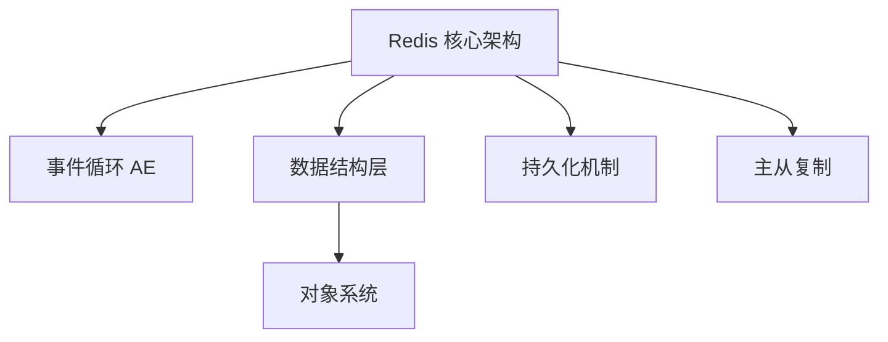

# Redis 源码教程

> 深入理解 Redis 的设计原理和实现细节，掌握这个高性能内存数据库的核心技术。

**Redis** 是一个开源的内存数据结构存储系统，可以用作数据库、缓存和消息代理。它支持多种数据结构，如字符串、哈希、列表、集合、有序集合等，并提供了丰富的功能特性。

**Source Directory:** `/home/tz/dev/redis`

## Chapters

1. [Redis 核心架构与事件循环](01_redis核心架构与事件循环.md)
2. [基础数据结构：SDS、链表、字典](02_基础数据结构_sds_链表_字典.md)
3. [对象系统：五大数据类型](03_对象系统_五大数据类型.md)
4. [持久化：RDB 与 AOF](04_持久化_rdb与aof.md)
5. [主从复制机制](05_主从复制机制.md)
6. [哨兵与高可用](06_哨兵与高可用.md)
7. [集群分片](07_集群分片.md)
8. [过期策略与内存淘汰](08_过期策略与内存淘汰.md)
9. [事务与 Lua 脚本](09_事务与lua脚本.md)
10. [发布订阅系统](10_发布订阅系统.md)

---

Generated by [AI Codebase Knowledge Builder](https://github.com/The-Pocket/Tutorial-Codebase-Knowledge)
