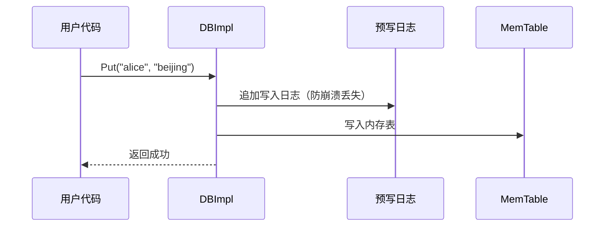
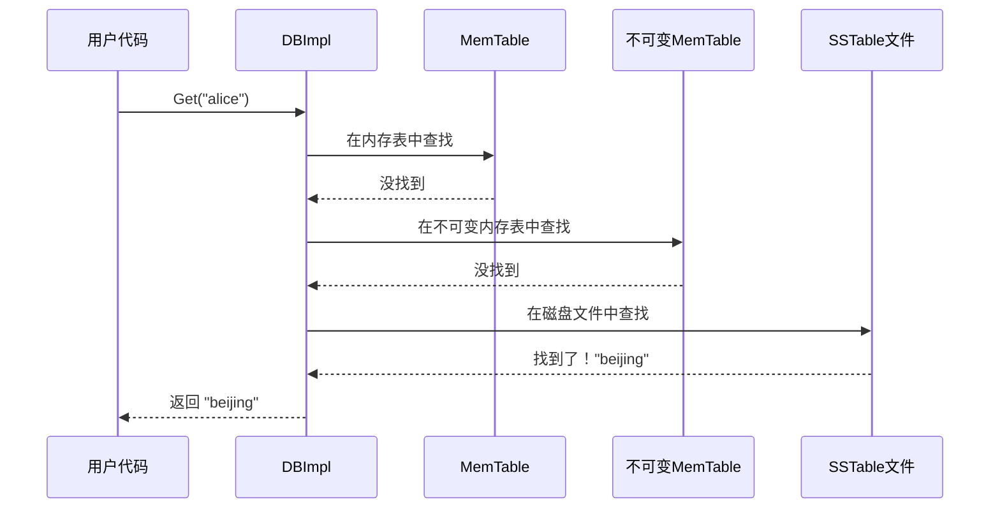
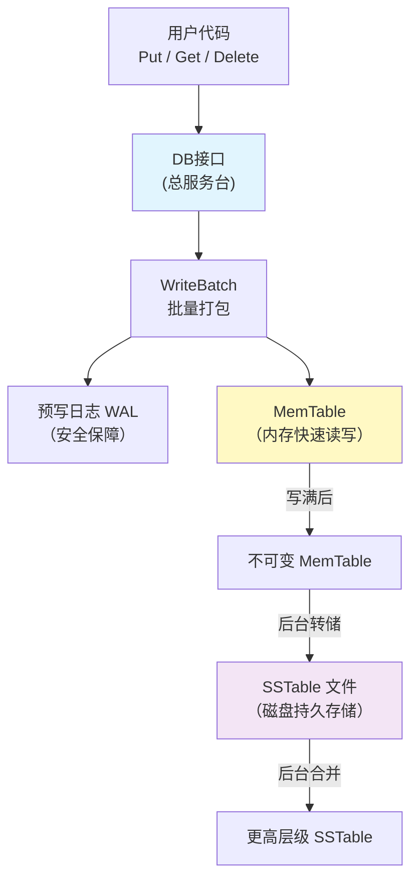

# Chapter 1: 数据库核心读写引擎

## 从一个简单的需求说起

假设你正在开发一个应用，需要保存用户的配置信息。比如，你想把用户名 `"alice"` 对应的城市 `"beijing"` 存起来，之后还能快速查出来。这就是最基本的**键值存储**需求——给一个"键"（key），存一个"值"（value），之后用键去查值。

LevelDB 就是这样一个键值存储引擎。而**数据库核心读写引擎**，就是你和 LevelDB 打交道的"总服务台"。你不需要知道数据具体存在哪里、怎么组织的——你只需要告诉总服务台："帮我存这个"、"帮我查那个"，它会帮你搞定一切。

## 核心职责：三个基本操作

数据库核心读写引擎（对应代码中的 `DB` 接口和 `DBImpl` 实现类）提供三个最基本的操作：

| 操作 | 作用 | 类比 |
|------|------|------|
| `Put(key, value)` | 存入一个键值对 | 在图书馆登记簿上记一条 |
| `Get(key)` | 根据键查找值 | 去服务台查一本书在哪 |
| `Delete(key)` | 删除一个键值对 | 把登记簿上的记录划掉 |

## 怎么使用？一个完整的例子

### 第一步：打开数据库

```c++
#include "leveldb/db.h"

leveldb::DB* db;
leveldb::Options options;
options.create_if_missing = true;
leveldb::Status s = leveldb::DB::Open(
    options, "/tmp/testdb", &db);
```

这就像走进一家图书馆——你告诉 LevelDB 数据库文件放在 `/tmp/testdb` 目录下。`create_if_missing = true` 表示"如果图书馆还不存在，就帮我建一个"。打开成功后，`db` 就是你手中的"服务台通行证"。

### 第二步：写入数据

```c++
// 存入键值对："alice" -> "beijing"
s = db->Put(leveldb::WriteOptions(), "alice", "beijing");
```

一行代码就搞定了！调用 `Put` 就像对服务台说："请帮我记下，alice 在 beijing。"

### 第三步：读取数据

```c++
std::string value;
s = db->Get(leveldb::ReadOptions(), "alice", &value);
// 此时 value == "beijing"
```

用 `Get` 读取数据，传入键 `"alice"`，LevelDB 会把对应的值放到 `value` 中。就像你问服务台："alice 在哪个城市？"服务台回答："beijing。"

### 第四步：删除数据

```c++
s = db->Delete(leveldb::WriteOptions(), "alice");
```

调用 `Delete` 会删除这条记录。之后再 `Get("alice")` 就会返回"找不到"的状态。

### 第五步：关闭数据库

```c++
delete db;
```

用完之后，直接删除 `db` 指针即可关闭数据库，就像离开图书馆。

## 关于 Status：操作结果的反馈

你注意到每个操作都返回一个 `Status` 对象。它告诉你操作是否成功：

```c++
if (!s.ok()) {
  std::cerr << s.ToString() << std::endl;
}
```

这就像服务台的回执——"操作成功"或者"出了什么问题"。养成检查 `Status` 的习惯是好的编程实践。

## 内部实现：数据到底是怎么流动的？

现在我们来看看"总服务台"背后到底发生了什么。LevelDB 的核心设计可以用一句话概括：**先写内存，再落磁盘**。

### 写入流程概览

当你调用 `Put("alice", "beijing")` 时，内部经历了这些步骤：



关键点：
1. 数据**先写日志**（[预写日志（WAL）](03_预写日志_wal.md)），确保即使断电也不丢数据
2. 然后**写入内存**（[MemTable内存表与跳表](04_memtable内存表与跳表.md)），速度非常快
3. 返回成功——此时并不会立刻写磁盘文件！

### 读取流程概览

当你调用 `Get("alice")` 时，LevelDB 会按照从快到慢的顺序依次查找：



这种"先内存，后磁盘"的分层查找策略就像：先翻桌上刚记的便条纸，再翻抽屉里的笔记本，最后才去翻书架上的档案。越新的数据越先被找到。

## 深入代码：写入路径

让我们看看 `DBImpl::Put` 的实际代码。它其实非常简单：

```c++
// db/db_impl.cc
Status DBImpl::Put(const WriteOptions& o,
                   const Slice& key, const Slice& val) {
  return DB::Put(o, key, val);
}
```

它只是调用了基类 `DB::Put`。基类的实现是把单次 `Put` 包装成一个 [WriteBatch原子批量写入](02_writebatch原子批量写入.md)：

```c++
// db/db_impl.cc
Status DB::Put(const WriteOptions& opt,
               const Slice& key, const Slice& value) {
  WriteBatch batch;
  batch.Put(key, value);
  return Write(opt, &batch);
}
```

这意味着**所有写操作最终都通过 `Write()` 方法执行**。这是一个非常巧妙的设计——无论你是单条写入还是批量写入，都走同一条路径。

### Write() 的核心逻辑

`Write()` 是写入的核心。它做了三件大事：

**1. 排队等候**

```c++
Writer w(&mutex_);
w.batch = updates;
w.sync = options.sync;
writers_.push_back(&w);
while (!w.done && &w != writers_.front()) {
  w.cv.Wait();  // 不是队首，就等着
}
```

多个线程可能同时写入，LevelDB 用一个队列来排队。只有排在队首的写入者才能执行写入，其他人等着。

**2. 确保有空间**

```c++
Status status = MakeRoomForWrite(updates == nullptr);
```

这一步检查内存表是否还有空间。如果满了，就把当前内存表变成"不可变"（imm_），创建一个新的内存表，并触发后台把旧数据写入磁盘。

**3. 写日志 + 写内存**

```c++
// 写入预写日志
status = log_->AddRecord(
    WriteBatchInternal::Contents(write_batch));
// 写入内存表
if (status.ok()) {
  status = WriteBatchInternal::InsertInto(
      write_batch, mem_);
}
```

先把数据追加到[预写日志（WAL）](03_预写日志_wal.md)，再插入到[MemTable内存表与跳表](04_memtable内存表与跳表.md)。日志是为了安全，内存表是为了速度。

### 写入者分组优化

LevelDB 有一个巧妙的优化：当多个写入者在排队时，队首会把大家的写入**合并成一批**一起执行：

```c++
WriteBatch* write_batch = BuildBatchGroup(&last_writer);
```

这就像邮递员不会一封信跑一趟，而是攒一批信一起送。这个分组机制大大提升了并发写入的吞吐量。

## 深入代码：读取路径

`Get()` 的实现体现了 LevelDB 的分层查找策略：

```c++
// db/db_impl.cc - DBImpl::Get() 核心逻辑
LookupKey lkey(key, snapshot);
if (mem->Get(lkey, value, &s)) {
  // 在当前内存表中找到了
} else if (imm != nullptr && imm->Get(lkey, value, &s)) {
  // 在不可变内存表中找到了
} else {
  s = current->Get(options, lkey, value, &stats);
  // 在磁盘SSTable文件中查找
}
```

三步查找，逐层递进：
1. **mem_**：当前正在写入的内存表，数据最新
2. **imm_**：正在被转储到磁盘的内存表
3. **current（Version）**：磁盘上的 [SSTable排序表文件格式](05_sstable排序表文件格式.md)，按层级组织

一旦在某一层找到了，就立刻返回，不再往下找。这保证了最新写入的数据总是被优先读取。

## 后台调度：自动整理数据

LevelDB 的总服务台不只是被动地等你来读写，它还有一个"后勤团队"在后台默默工作：

```c++
void DBImpl::MaybeScheduleCompaction() {
  // ...
  if (imm_ == nullptr &&
      manual_compaction_ == nullptr &&
      !versions_->NeedsCompaction()) {
    return;  // 没活干，收工
  }
  background_compaction_scheduled_ = true;
  env_->Schedule(&DBImpl::BGWork, this);
}
```

当内存表写满或者磁盘文件太多时，后台线程会自动启动[合并压缩（Compaction）](07_合并压缩_compaction.md)，把数据从内存整理到磁盘、把小文件合并成大文件。你完全不需要关心这些，总服务台会自动安排。

## 全景架构图

让我们用一张图把所有部件串起来：



数据的流动方向是：**用户 → 内存 → 磁盘**，写入是从左到右，读取则是从右到左逐层查找。

## 总结

在本章中，我们学习了 LevelDB 的核心读写引擎——它就像一个图书馆的总服务台：

- **对外提供** `Put`、`Get`、`Delete` 三个基本操作
- **写入时**：先记日志保安全，再写内存求速度
- **读取时**：按"内存表 → 不可变内存表 → 磁盘文件"的顺序逐层查找
- **后台自动**调度整理工作，用户无需关心

理解了这个"总服务台"的工作方式，你就掌握了 LevelDB 数据流动的全貌。接下来，我们将深入了解写入操作中至关重要的打包机制——[WriteBatch原子批量写入](02_writebatch原子批量写入.md)，看看 LevelDB 是如何保证多个操作要么全部成功、要么全部失败的。

---

Generated by [AI Codebase Knowledge Builder](https://github.com/The-Pocket/Tutorial-Codebase-Knowledge)