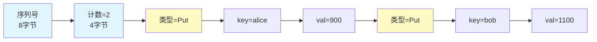
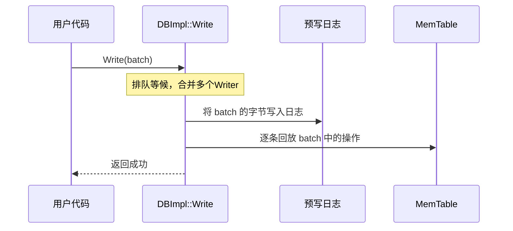
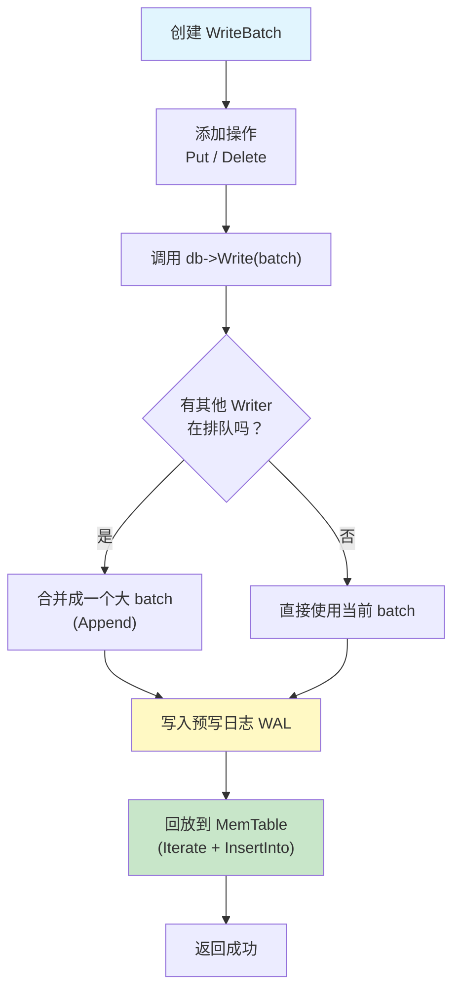

# Chapter 2: WriteBatch原子批量写入

The file write keeps being blocked. Let me output the chapter content directly:

# 第2章：WriteBatch原子批量写入

在[上一章](01_数据库核心读写引擎.md)中，我们认识了 LevelDB 的"总服务台"——数据库核心读写引擎。我们学到所有写操作最终都会被包装成一个 `WriteBatch`，然后统一通过 `Write()` 方法执行。那么，WriteBatch 到底是什么？为什么需要它？本章就来揭开它的面纱。

## 从一个实际问题说起

假设你在开发一个简单的转账系统。alice 要向 bob 转账 100 元：

1. 从 alice 的账户扣除 100 元
2. 给 bob 的账户增加 100 元

**这两步必须要么同时成功，要么同时失败。** 如果第一步成功了但第二步失败了，alice 的钱凭空消失了——这是不可接受的！

这就是 WriteBatch 要解决的问题：**把多个操作打包在一起，保证原子性（全部成功或全部失败）。**

## WriteBatch 是什么？一句话解释

WriteBatch 就像一个**购物车**——你可以往里面放多个"添加"或"删除"操作，最后一起"结账"。要么购物车里的东西全部买下，要么一个也不买。

| 概念 | 类比 | 说明 |
|------|------|------|
| WriteBatch | 购物车 | 存放多个操作的容器 |
| Put() | 往购物车放东西 | 添加一个"写入"操作 |
| Delete() | 标记退货 | 添加一个"删除"操作 |
| DB::Write() | 结账 | 一次性执行所有操作 |

## 怎么使用？解决转账问题

让我们用 WriteBatch 来实现上面的转账场景：

```c++
#include "leveldb/db.h"
#include "leveldb/write_batch.h"

leveldb::WriteBatch batch;
batch.Put("alice", "900");   // alice 余额改为 900
batch.Delete("transfer_temp"); // 清除临时记录
batch.Put("bob", "1100");    // bob 余额改为 1100
```

这三行代码只是**把操作放进购物车**，还没有真正执行。接下来一次性提交：

```c++
leveldb::Status s = db->Write(
    leveldb::WriteOptions(), &batch);
```

调用 `db->Write()` 就像"结账"——三个操作要么全部写入数据库，要么全部不写入。即使中途断电，也不会出现"alice 扣了钱，bob 没收到"的情况。

### 回顾上一章的秘密

在上一章中我们看到，即使你只写一条数据：

```c++
db->Put(options, "alice", "beijing");
```

LevelDB 内部也会**偷偷把它包装成 WriteBatch**：

```c++
// DB::Put 的内部实现
WriteBatch batch;
batch.Put(key, value);
return Write(opt, &batch);
```

所以 WriteBatch 是**所有写操作的必经之路**，理解它就理解了 LevelDB 写入的核心。

## WriteBatch 的内部格式：一串紧凑的字节

WriteBatch 的内部其实就是一个字符串 `rep_`，按照固定格式存放所有信息。可以把它想象成一张**快递单**：

```
| 序列号 (8字节) | 操作计数 (4字节) | 操作1 | 操作2 | ... |
```

我们把这三个部分逐个拆解。

### 第一部分：头部（Header）——12字节

```
[序列号: 8字节] [操作计数: 4字节]
```

- **序列号**：标识这批操作的"时间戳"，用于区分新旧数据
- **操作计数**：这个 batch 里一共有多少条操作

就像快递单上写着"寄件编号"和"共N件"。

### 第二部分：操作记录——逐条编码

每条操作的格式取决于操作类型：

```
Put 操作:  [类型=1] [key长度] [key内容] [value长度] [value内容]
Delete 操作: [类型=0] [key长度] [key内容]
```

Delete 操作不需要 value，所以更短一些。

### 一个具体的例子

假设我们执行：

```c++
WriteBatch batch;
batch.Put("alice", "900");
batch.Put("bob", "1100");
```

内存中 `rep_` 的逻辑结构如下：



所有数据紧凑地排在一起，没有任何浪费的空间。

## 深入代码：Put 和 Delete 怎么实现的？

让我们来看看代码，理解往"购物车"放东西的过程。

### Put 操作

```c++
// db/write_batch.cc
void WriteBatch::Put(const Slice& key,
                     const Slice& value) {
  WriteBatchInternal::SetCount(this,
      WriteBatchInternal::Count(this) + 1);
  rep_.push_back(static_cast<char>(kTypeValue));
  PutLengthPrefixedSlice(&rep_, key);
  PutLengthPrefixedSlice(&rep_, value);
}
```

做了三件事：
1. **计数加一**：头部的操作计数 +1（"购物车里多了一件"）
2. **写入类型标记**：`kTypeValue` 表示这是一个 Put 操作
3. **写入 key 和 value**：用"长度+内容"的方式编码

### Delete 操作

```c++
// db/write_batch.cc
void WriteBatch::Delete(const Slice& key) {
  WriteBatchInternal::SetCount(this,
      WriteBatchInternal::Count(this) + 1);
  rep_.push_back(static_cast<char>(kTypeDeletion));
  PutLengthPrefixedSlice(&rep_, key);
}
```

和 Put 几乎一样，只是类型标记变成了 `kTypeDeletion`，并且不需要写入 value。

### 读取计数和序列号

操作计数和序列号存储在 `rep_` 的头部 12 字节中：

```c++
// db/write_batch.cc
int WriteBatchInternal::Count(const WriteBatch* b) {
  return DecodeFixed32(b->rep_.data() + 8);
}
SequenceNumber WriteBatchInternal::Sequence(
    const WriteBatch* b) {
  return SequenceNumber(
      DecodeFixed64(b->rep_.data()));
}
```

前 8 字节是序列号，接着 4 字节是操作计数——加起来正好是 12 字节的头部。

## 内部流程：WriteBatch 是怎么被执行的？

当你调用 `db->Write(options, &batch)` 时，发生了什么？让我们用一个简单的流程图来说明：



关键的三个阶段：

### 阶段一：排队和合并

多个线程同时调用 `Write()` 时，LevelDB 会让它们排队。排在第一位的"领头人"会把后面几个人的 WriteBatch **合并成一个大 batch**，一次完成：

```c++
// db/db_impl.cc - Write() 中的分组合并
WriteBatch* write_batch =
    BuildBatchGroup(&last_writer);
```

这就像食堂打饭——不是每个人单独打一次，而是排队的人报好菜，打饭阿姨一次性全盛好。这个优化**大幅提升了并发写入的吞吐量**。

### 阶段二：写入预写日志

合并后的 batch 整体写入[预写日志（WAL）](03_预写日志_wal.md)：

```c++
// db/db_impl.cc
status = log_->AddRecord(
    WriteBatchInternal::Contents(write_batch));
```

`Contents()` 返回的就是 `rep_` 这个字节串。日志记录了完整的 batch 数据，这样即使断电，也能从日志中恢复。

### 阶段三：回放到 MemTable

日志写成功后，把 batch 中的操作逐条插入[MemTable内存表与跳表](04_memtable内存表与跳表.md)：

```c++
// db/db_impl.cc
status = WriteBatchInternal::InsertInto(
    write_batch, mem_);
```

`InsertInto` 怎么实现的？它用了一个巧妙的**迭代器模式**。

## Iterate 机制：回放操作的秘密

WriteBatch 提供了一个 `Iterate` 方法，可以把 batch 中的操作逐条"回放"给一个处理器（Handler）。就像播放录音带——依次取出每条操作，交给别人处理。

```c++
// db/write_batch.cc - 回放处理器
class MemTableInserter
    : public WriteBatch::Handler {
 public:
  SequenceNumber sequence_;
  MemTable* mem_;

  void Put(const Slice& key, const Slice& value) {
    mem_->Add(sequence_, kTypeValue, key, value);
    sequence_++;
  }
  void Delete(const Slice& key) {
    mem_->Add(sequence_, kTypeDeletion, key, Slice());
    sequence_++;
  }
};
```

`MemTableInserter` 是一个"听众"——每听到一个 Put，就往 MemTable 里插一条；每听到一个 Delete，也往 MemTable 里插一条删除标记。注意 `sequence_++`：每条操作都有递增的序列号，确保新旧数据可以区分。

然后 `InsertInto` 把它们连接起来：

```c++
// db/write_batch.cc
Status WriteBatchInternal::InsertInto(
    const WriteBatch* b, MemTable* memtable) {
  MemTableInserter inserter;
  inserter.sequence_ =
      WriteBatchInternal::Sequence(b);
  inserter.mem_ = memtable;
  return b->Iterate(&inserter);
}
```

先设置起始序列号，然后调用 `Iterate` 逐条回放。整个过程就像读快递单上的物品清单，一件一件交给仓库保管员。

## 合并多个 WriteBatch：Append 操作

当"领头人"合并多个 Writer 的 batch 时，用的是 `Append` 方法：

```c++
// db/write_batch.cc
void WriteBatchInternal::Append(
    WriteBatch* dst, const WriteBatch* src) {
  SetCount(dst, Count(dst) + Count(src));
  dst->rep_.append(src->rep_.data() + kHeader,
                   src->rep_.size() - kHeader);
}
```

做了两件事：
1. **更新计数**：目标 batch 的操作计数 = 自己的 + 源的
2. **拼接数据**：跳过源 batch 的 12 字节头部，把操作记录追加到目标 batch

为什么跳过头部？因为合并后只需要一份头部（一个序列号和一个总计数），不需要重复。

## 全流程总结图

让我们用一张图把 WriteBatch 从创建到执行的完整流程串起来：



## 总结

在本章中，我们深入了解了 WriteBatch——LevelDB 写入操作的核心载体：

- **它是什么**：一个"购物车"，把多个 Put/Delete 操作打包在一起
- **为什么需要它**：保证原子性——所有操作要么全部成功，要么全部失败
- **内部格式**：12 字节头部（序列号 + 计数）+ 逐条编码的操作记录
- **执行流程**：排队合并 → 写入预写日志 → 回放到内存表
- **性能优化**：多个并发 Writer 的 batch 会被合并，用一次日志写入完成

WriteBatch 写入日志后，数据就安全了。但这个"日志"到底是什么？它是怎么保证断电不丢数据的？下一章我们将深入了解——[预写日志（WAL）](03_预写日志_wal.md)。

---

Generated by [AI Codebase Knowledge Builder](https://github.com/The-Pocket/Tutorial-Codebase-Knowledge)