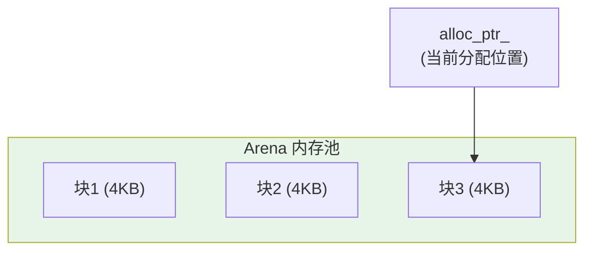
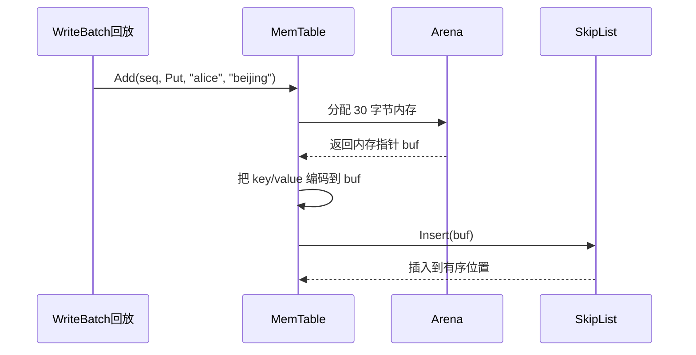
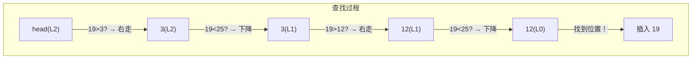
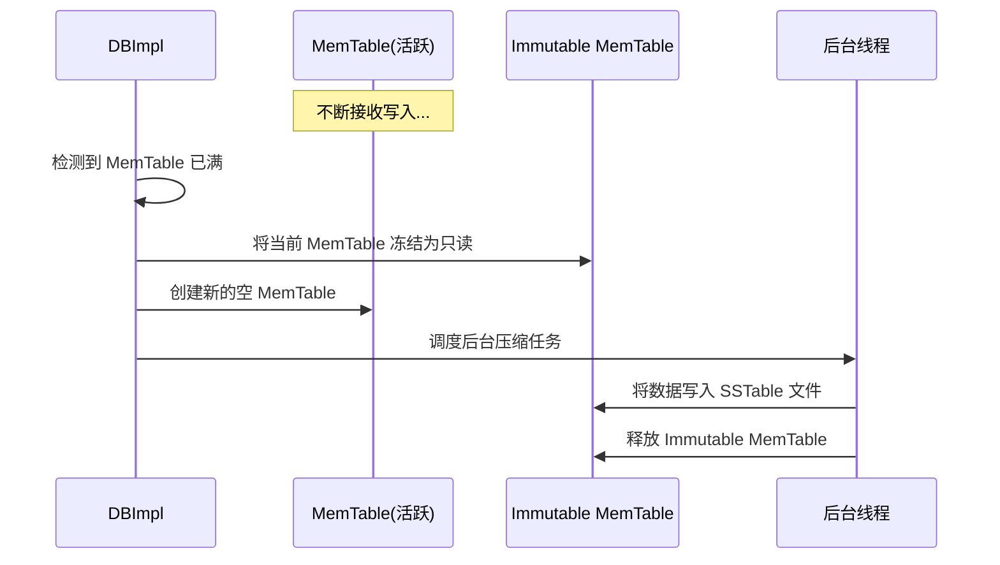
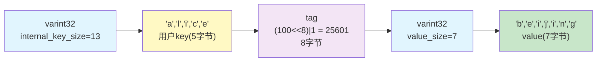
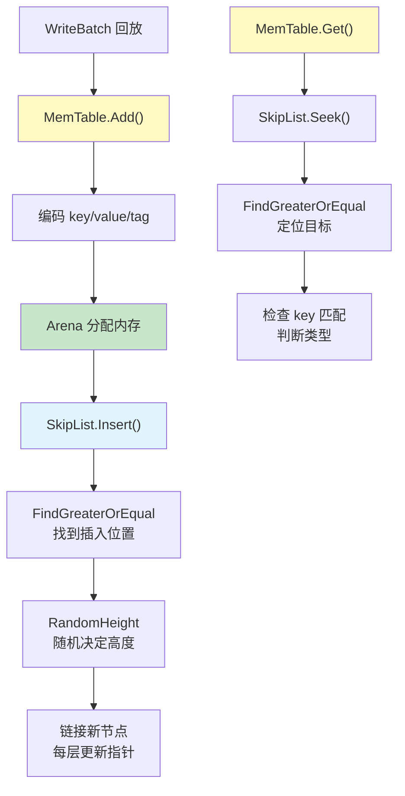

# Chapter 4: MemTable内存表与跳表

在[上一章](03_预写日志_wal.md)中，我们学习了预写日志（WAL）如何保证断电不丢数据。我们知道，数据写入日志后，紧接着就会被插入到一个叫做 **MemTable** 的内存数据结构中。那么，这个 MemTable 究竟是什么？它为什么能让读写变得飞快？本章就来一探究竟。

## 从一个实际问题说起

假设你经营一家快递站，每天都有大量包裹进出。你需要一种方式来快速**登记新包裹**，并且能随时**按名字查到某个人的包裹**。

最笨的办法是把包裹信息随便堆成一堆。登记很快——往纸上一写就行。但查找的时候就惨了，你得从头翻到尾，可能翻几百条才找到。

更聪明的办法是维护一本**按名字排好序**的登记簿。查找的时候可以用"翻字典"的方式（二分查找），快速定位到目标。但普通的有序列表，每次插入新记录都可能需要挪动大量已有记录。

有没有一种数据结构，既能**快速插入**，又能**快速查找**，还能保持**有序**？

这就是 LevelDB 中 MemTable 要解决的问题。它使用了一种叫做**跳表（SkipList）**的数据结构，同时实现了 O(log n) 的插入和查找。

## MemTable 是什么？一句话解释

MemTable 就是 LevelDB 的**写入缓冲区**——一个在内存中有序存放键值对的"便签簿"。所有新写入的数据先暂存在这里，等攒够了一批，再一次性刷写到磁盘。

| 概念 | 类比 | 说明 |
|------|------|------|
| MemTable | 快递站的有序登记簿 | 内存中存放最新数据 |
| 跳表（SkipList） | 登记簿的索引结构 | 让插入和查找都是 O(log n) |
| Arena | 大块草稿纸 | 高效的内存分配器 |
| Immutable MemTable | 写满后封存的登记簿 | 只读，等待写入磁盘 |

## MemTable 在整体架构中的位置

回顾[数据库核心读写引擎](01_数据库核心读写引擎.md)中的架构，MemTable 处于核心位置：


数据的旅程是：**日志 → MemTable → 冻结 → SSTable**。MemTable 是数据从"安全记录"到"高效存储"的中转站。

## 怎么使用 MemTable？

在 LevelDB 内部，MemTable 的用法非常简洁。我们来看它的两个核心操作。

### 写入数据：Add

```c++
// 创建 MemTable
MemTable* mem = new MemTable(comparator);
mem->Ref();  // 引用计数 +1

// 插入一条记录
mem->Add(sequence, kTypeValue,
         "alice", "beijing");
```

`Add` 方法接收四个参数：序列号、操作类型（写入/删除）、键和值。序列号就是在[WriteBatch原子批量写入](02_writebatch原子批量写入.md)中讲到的递增编号，用来区分新旧数据。

### 查找数据：Get

```c++
std::string value;
Status s;
LookupKey lkey("alice", sequence);
if (mem->Get(lkey, &value, &s)) {
  // 找到了！value == "beijing"
}
```

`Get` 方法根据键查找。如果找到了正常数据，返回 `true` 并填充 `value`；如果找到了删除标记，也返回 `true` 但设置 `s` 为 `NotFound`；如果完全没找到，返回 `false`。

### 引用计数管理

```c++
mem->Ref();   // 有人在用，引用 +1
mem->Unref(); // 用完了，引用 -1
// 当引用归零时自动销毁
```

MemTable 使用引用计数来管理生命周期。为什么不直接 `delete`？因为可能有多个地方同时在使用同一个 MemTable（比如读操作和后台刷盘），引用计数确保所有人都用完了才释放。

## 核心概念一：跳表——MemTable 的引擎

MemTable 内部真正干活的是**跳表（SkipList）**。要理解 MemTable，先得理解跳表。

### 从链表到跳表

想象一个**有序链表**——所有元素按从小到大排列：

```
head → 3 → 7 → 12 → 19 → 25 → 30 → null
```

如果你要查找 25，必须从头开始逐个比较，走 5 步才能到达。这是 O(n) 的时间复杂度，太慢了。

跳表的创意是：给某些节点加上**"快车道"**——高层级的指针，让你可以跳过很多节点。

```
第3层: head ─────────────────→ 19 ──────────→ null
第2层: head ──────→ 7 ───────→ 19 ──────────→ null
第1层: head → 3 → 7 → 12 → 19 → 25 → 30 → null
```

查找 25 时：
1. **第3层**：从 head 跳到 19，19 < 25，继续；下一个是 null，往下走
2. **第2层**：19 的下一个是 null，往下走
3. **第1层**：19 → 25，找到了！

只用了 **3 步**，比逐个遍历快得多。

### 跳表就像高速公路体系

把跳表想象成一个城市的道路系统：

- **第1层（底层）**：普通小路，连接每一个路口（节点），可以到达任何地方
- **第2层**：大马路，只连接主要路口，走得更快
- **第3层**：高速公路，只连接几个关键枢纽，速度最快

你导航时的策略：先走高速，找到最近的出口，下到大马路，再下到小路，精确到达目的地。

### 为什么跳表适合 MemTable？

| 特性 | 跳表 | 平衡树（如红黑树） |
|------|------|------|
| 插入复杂度 | O(log n) | O(log n) |
| 查找复杂度 | O(log n) | O(log n) |
| 实现复杂度 | 简单 | 复杂 |
| 并发友好 | 天然友好 | 需要复杂锁 |

跳表的性能和平衡树一样好，但实现简单得多，而且**对并发读写更友好**——这对数据库来说非常重要。

## 核心概念二：Arena——高效的内存管家

MemTable 会频繁分配小块内存（存储每条键值对）。如果每次都调用系统的 `malloc`，开销很大。Arena 是一个简单的**内存池**，一次申请一大块内存，然后从中一小块一小块地切给使用者。

### Arena 的工作原理



Arena 就像一本草稿纸：
- 每次要纸（分配内存），直接从当前页面撕一块下来
- 当前页面用完了，换一本新的草稿纸（分配新的 4KB 块）
- 所有草稿纸最后一起扔掉（MemTable 销毁时统一释放）

### Arena 的快速分配

```c++
// util/arena.h
inline char* Arena::Allocate(size_t bytes) {
  if (bytes <= alloc_bytes_remaining_) {
    char* result = alloc_ptr_;
    alloc_ptr_ += bytes;       // 指针前移
    alloc_bytes_remaining_ -= bytes;
    return result;
  }
  return AllocateFallback(bytes);
}
```

最常见的情况就是前4行：直接移动指针，把当前块的一小部分切出去。没有系统调用，没有锁，极其快速。

### 当前块不够时的处理

```c++
// util/arena.cc
char* Arena::AllocateFallback(size_t bytes) {
  if (bytes > kBlockSize / 4) {
    // 大对象，单独分配
    return AllocateNewBlock(bytes);
  }
  // 小对象，开一个新的 4KB 块
  alloc_ptr_ = AllocateNewBlock(kBlockSize);
  alloc_bytes_remaining_ = kBlockSize;
  // 从新块中分配
  char* result = alloc_ptr_;
  alloc_ptr_ += bytes;
  alloc_bytes_remaining_ -= bytes;
  return result;
}
```

两种策略：
- **大对象**（超过 1KB）：单独分配一块刚好够用的内存，避免浪费
- **小对象**：开一个新的 4KB 块，然后继续"切割"

这里有一个小小的空间浪费——旧块剩余的空间就不用了。但这种权衡是值得的：简单、快速，而且 MemTable 最终会被整体释放，不存在内存碎片问题。

## 深入内部：Add 是怎么工作的？

现在让我们看看当 WriteBatch 回放一条 `Put("alice", "beijing")` 到 MemTable 时，内部发生了什么。

### 数据编码格式

每条记录在 MemTable 中的存储格式如下：

```
[internal_key长度] [用户key] [tag(8字节)] [value长度] [value内容]
```

其中 `tag` 把序列号和操作类型压在一起：`(sequence << 8) | type`。

我们来看代码的关键部分。

### 第一步：计算需要的空间

```c++
// db/memtable.cc - Add() 开头
size_t key_size = key.size();     // "alice" = 5
size_t val_size = value.size();   // "beijing" = 7
size_t internal_key_size = key_size + 8; // 5+8=13
```

internal key = 用户 key + 8字节的 tag。tag 中包含了序列号和操作类型。

### 第二步：用 Arena 分配内存并编码

```c++
// db/memtable.cc - Add() 编码部分
char* buf = arena_.Allocate(encoded_len);
char* p = EncodeVarint32(buf, internal_key_size);
std::memcpy(p, key.data(), key_size);  // 写入 key
p += key_size;
EncodeFixed64(p, (s << 8) | type);     // 写入 tag
p += 8;
p = EncodeVarint32(p, val_size);
std::memcpy(p, value.data(), val_size); // 写入 value
```

通过 Arena 一次分配所有需要的空间，然后按格式依次填入：key 长度、key 内容、tag、value 长度、value 内容。

### 第三步：插入跳表

```c++
// db/memtable.cc - Add() 最后一行
table_.Insert(buf);
```

把编码好的数据指针插入跳表。跳表会根据 key 的比较结果，把它放在正确的有序位置。

### 完整流程图



整个过程非常紧凑：分配内存 → 编码数据 → 插入跳表，三步搞定。

## 深入内部：跳表的 Insert 是怎么工作的？

跳表的插入是 MemTable 性能的关键。让我们一步一步来看。

### 第一步：找到插入位置

```c++
// db/skiplist.h - Insert()
Node* prev[kMaxHeight]; // 记录每层的前驱节点
Node* x = FindGreaterOrEqual(key, prev);
```

`FindGreaterOrEqual` 从最高层开始，逐层下降，找到第一个 ≥ key 的节点。同时，它把每一层"要插在谁后面"记录在 `prev` 数组中。

### FindGreaterOrEqual 的查找过程

```c++
// db/skiplist.h
Node* x = head_;
int level = GetMaxHeight() - 1; // 从最高层开始
while (true) {
  Node* next = x->Next(level);
  if (KeyIsAfterNode(key, next)) {
    x = next;       // key 在后面，继续右走
  } else {
    if (prev) prev[level] = x;
    if (level == 0) return next; // 到底层了
    else level--;    // 下降一层
  }
}
```

策略就是前面说的"高速公路导航法"：从高层开始，能向右就向右，不能向右就下降。

用一个例子来理解。假设跳表中已有 3、12、25，我们要插入 19：



### 第二步：随机决定高度

```c++
// db/skiplist.h
int SkipList::RandomHeight() {
  static const unsigned int kBranching = 4;
  int height = 1;
  while (height < kMaxHeight
         && rnd_.OneIn(kBranching)) {
    height++;  // 1/4 的概率升高一层
  }
  return height;
}
```

每个新节点的高度是**随机决定**的：底层（高度1）概率最大；每多一层，概率变成上一层的 1/4。这就像抛硬币——大多数节点只在"小路"上，少数节点同时出现在"高速公路"上。

这种随机策略统计上保证了跳表的平衡性，无需像红黑树那样做复杂的旋转调整。

### 第三步：创建节点并链接

```c++
// db/skiplist.h - Insert() 下半部分
x = NewNode(key, height);
for (int i = 0; i < height; i++) {
  x->NoBarrier_SetNext(i, prev[i]->NoBarrier_Next(i));
  prev[i]->SetNext(i, x);
}
```

对于新节点的每一层：
1. 新节点指向前驱节点原来的下一个节点
2. 前驱节点指向新节点

这就像在链表中间插入一个节点——把前后的链接断开，把新节点接进去。只不过跳表在**每一层**都要做这个操作。

用图来表示插入 19（高度=2）：

```
插入前:
L1: head → 3 ────────→ 25 → null
L0: head → 3 → 12 → 25 → 30 → null

插入后:
L1: head → 3 ──→ 19 ──→ 25 → null
L0: head → 3 → 12 → 19 → 25 → 30 → null
```

19 被插入到正确的位置，保持了每一层的有序性。

## 深入内部：Get 是怎么查找的？

查找比插入更简单。让我们看 `MemTable::Get` 的核心逻辑。

### 第一步：定位到目标位置

```c++
// db/memtable.cc - Get()
Slice memkey = key.memtable_key();
Table::Iterator iter(&table_);
iter.Seek(memkey.data());
```

`Seek` 利用跳表的多层结构，快速定位到第一个 ≥ 目标 key 的节点。这就是前面讲过的 `FindGreaterOrEqual`。

### 第二步：检查是否匹配

```c++
// db/memtable.cc - Get() 匹配检查
if (iter.Valid()) {
  const char* entry = iter.key();
  // ... 解码 key_length ...
  if (comparator_.comparator.user_comparator()
      ->Compare(Slice(key_ptr, key_length - 8),
                key.user_key()) == 0) {
    // 用户 key 匹配！
  }
}
```

跳表找到的是 ≥ 目标的第一个节点，需要验证它的用户 key 是否**真的匹配**（因为可能跳表中没有这个 key，返回的是下一个更大的 key）。

### 第三步：区分写入和删除

```c++
// db/memtable.cc - Get() 判断类型
const uint64_t tag = DecodeFixed64(
    key_ptr + key_length - 8);
switch (static_cast<ValueType>(tag & 0xff)) {
  case kTypeValue:
    // 正常数据，取出 value 返回
    value->assign(v.data(), v.size());
    return true;
  case kTypeDeletion:
    // 删除标记
    *s = Status::NotFound(Slice());
    return true;
}
```

记住，LevelDB 的删除不是真正的删除，而是**插入一条删除标记**。所以查找时需要检查 tag 中的类型：
- `kTypeValue`：找到了正常值，返回它
- `kTypeDeletion`：数据已被删除，返回"未找到"

## MemTable 的生命周期：从活跃到冻结

MemTable 不会无限增长。当它的大小达到阈值（默认 4MB）时，会经历一次"身份转变"：



这个过程发生在[数据库核心读写引擎](01_数据库核心读写引擎.md)中提到的 `MakeRoomForWrite` 函数里：

```c++
// db/db_impl.cc 简化逻辑
imm_ = mem_;              // 当前表变为不可变
mem_ = new MemTable(...); // 创建新的活跃表
mem_->Ref();
// 触发后台将 imm_ 写入磁盘
MaybeScheduleCompaction();
```

旧的 MemTable 被"冻结"为 `imm_`（不可变 MemTable），不再接受写入，只能被读取和刷盘。同时创建一个全新的 MemTable 继续接受写入。

这就像快递站的登记簿写满了——把满了的那本封存起来交给同事去录入电脑（写入磁盘），自己换一本新的继续登记。

## 读取时的查找顺序

在[数据库核心读写引擎](01_数据库核心读写引擎.md)中我们学过，Get 操作会按以下顺序查找：

```c++
// db/db_impl.cc - Get() 查找顺序
if (mem->Get(lkey, value, &s)) {
  // 1. 先查活跃 MemTable（最新数据）
} else if (imm != nullptr
           && imm->Get(lkey, value, &s)) {
  // 2. 再查冻结的 Immutable MemTable
} else {
  // 3. 最后查磁盘上的 SSTable 文件
}
```

为什么活跃 MemTable 排第一？因为它里面的数据**最新**。如果用户先写了 `alice=beijing`，后来又写了 `alice=shanghai`，第二次写入一定在活跃 MemTable 中，应该返回 `shanghai`。

## MemTable 中条目的内存布局

让我们用一张图把一条记录的完整编码展示出来。假设写入 `Put("alice", "beijing")`，序列号为 100：



- `internal_key_size = 5(key) + 8(tag) = 13`
- `tag` 中的低 8 位是类型（1=Put），高位是序列号（100）
- 整条记录紧凑地存储在 Arena 分配的连续内存中

## 跳表节点的内存分配

跳表节点通过 Arena 的 `AllocateAligned` 分配：

```c++
// db/skiplist.h
Node* NewNode(const Key& key, int height) {
  char* mem = arena_->AllocateAligned(
      sizeof(Node)
      + sizeof(std::atomic<Node*>) * (height - 1));
  return new (mem) Node(key);
}
```

节点大小取决于高度——高度越高，需要的指针越多。高度为 1 的节点只有 1 个指针（底层链表），高度为 3 的节点有 3 个指针（每层一个）。使用 `AllocateAligned` 确保内存对齐，这对 `std::atomic` 操作的正确性和性能都很重要。

## 线程安全：读写如何并行？

跳表的一个精妙之处在于它的**并发设计**。代码中大量使用了原子操作：

```c++
// db/skiplist.h - Node 的指针操作
Node* Next(int n) {
  return next_[n].load(
      std::memory_order_acquire);  // 读取屏障
}
void SetNext(int n, Node* x) {
  next_[n].store(x,
      std::memory_order_release); // 写入屏障
}
```

- **写入**（Insert）需要外部加锁（一次只能有一个写者）
- **读取**（查找/遍历）不需要加锁，可以和写入并行进行

这就像一个图书管理员在整理书架（写入），同时多个读者可以自由浏览（读取）。只要管理员按照正确的顺序把新书放上去（先设好新书的指针，再把旧书的指针指向新书），读者看到的永远是一致的。

## 全景回顾

让我们把本章所有概念串联成一张完整的图：



## 总结

在本章中，我们深入了解了 MemTable——LevelDB 的内存写入缓冲区：

- **MemTable 是什么**：一个有序的内存数据结构，暂存最新写入的键值对
- **跳表（SkipList）**：MemTable 的核心引擎，通过多层索引实现 O(log n) 的插入和查找
- **Arena 内存池**：通过预分配大块内存、指针递增分配的方式，大幅减少内存分配开销
- **数据编码**：每条记录包含 key、序列号+类型的 tag、以及 value，紧凑地存储在 Arena 中
- **生命周期**：活跃 MemTable 写满后冻结为 Immutable MemTable，由后台线程刷写到磁盘
- **线程安全**：写入需要加锁，读取无需加锁，支持高效的并发访问

当 MemTable 被冻结并刷写到磁盘后，数据就变成了一个 **SSTable 文件**。SSTable 是一种精心设计的磁盘文件格式，支持高效的有序查找。下一章我们将深入了解——[SSTable排序表文件格式](05_sstable排序表文件格式.md)，看看数据落盘后的样子。

---

Generated by [AI Codebase Knowledge Builder](https://github.com/The-Pocket/Tutorial-Codebase-Knowledge)