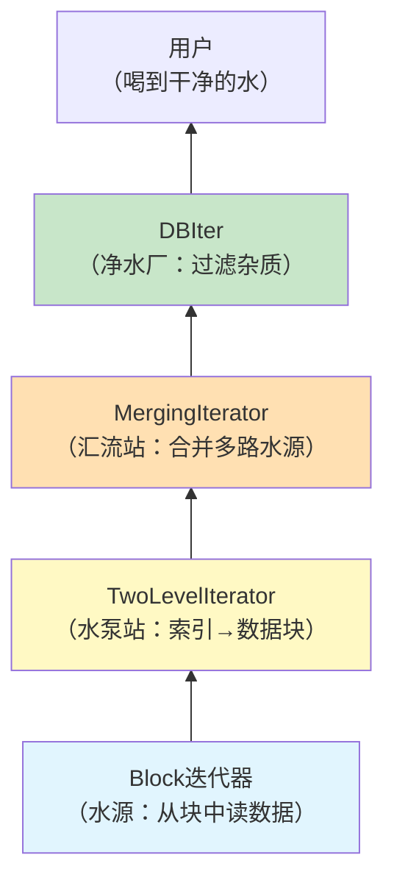
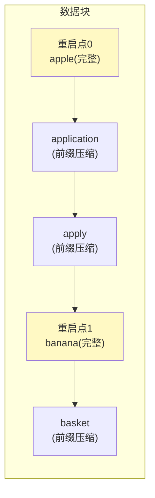
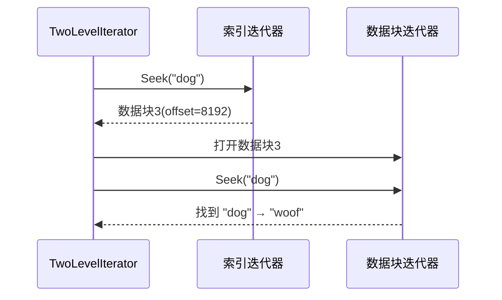
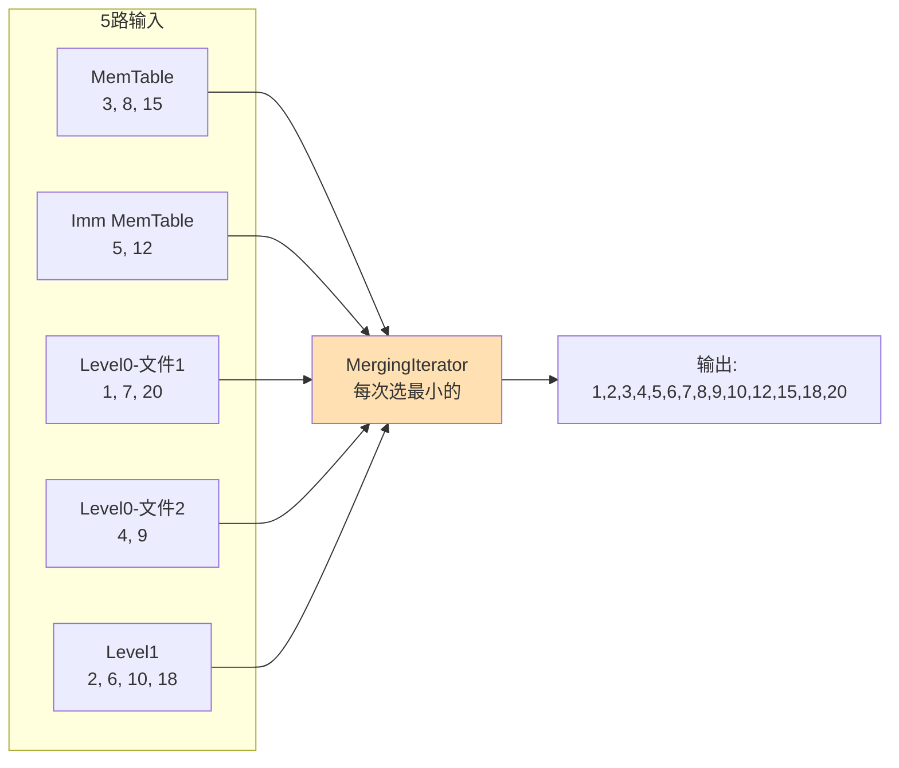
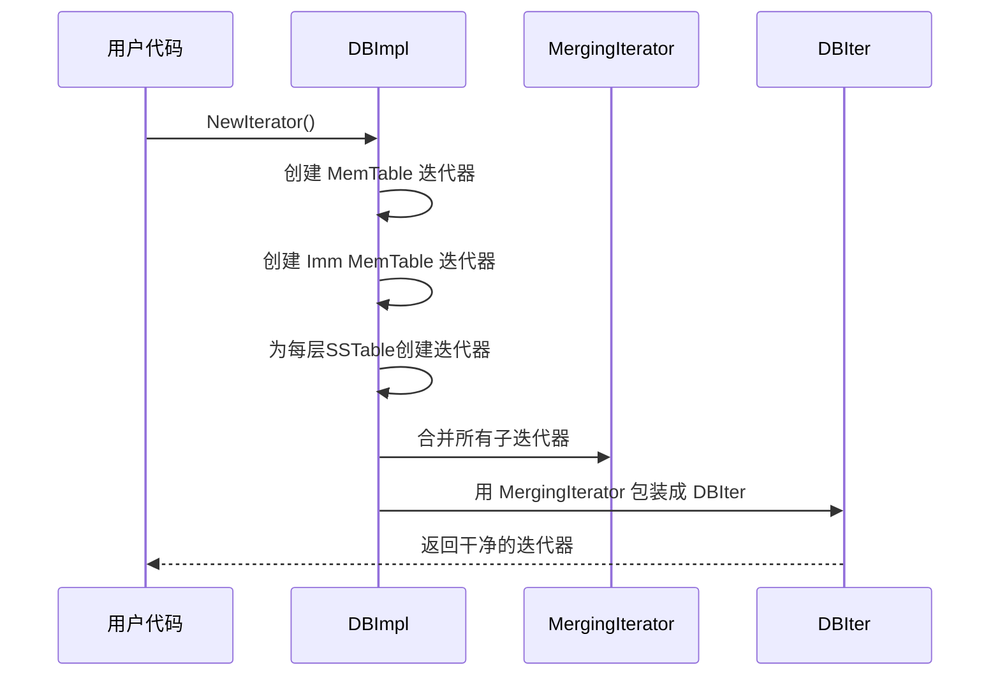
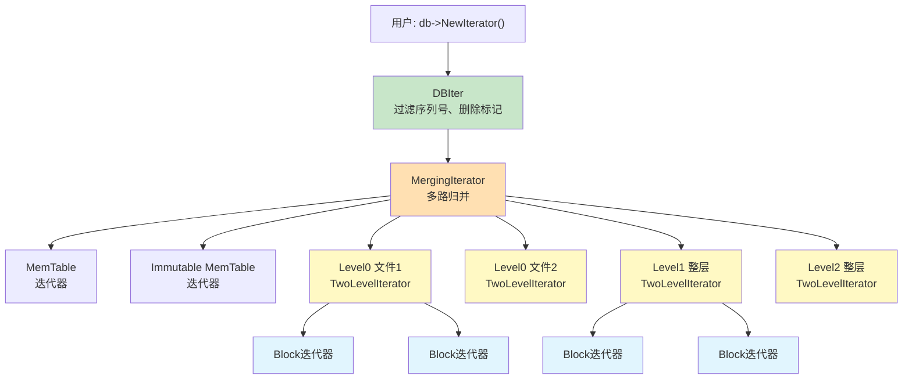
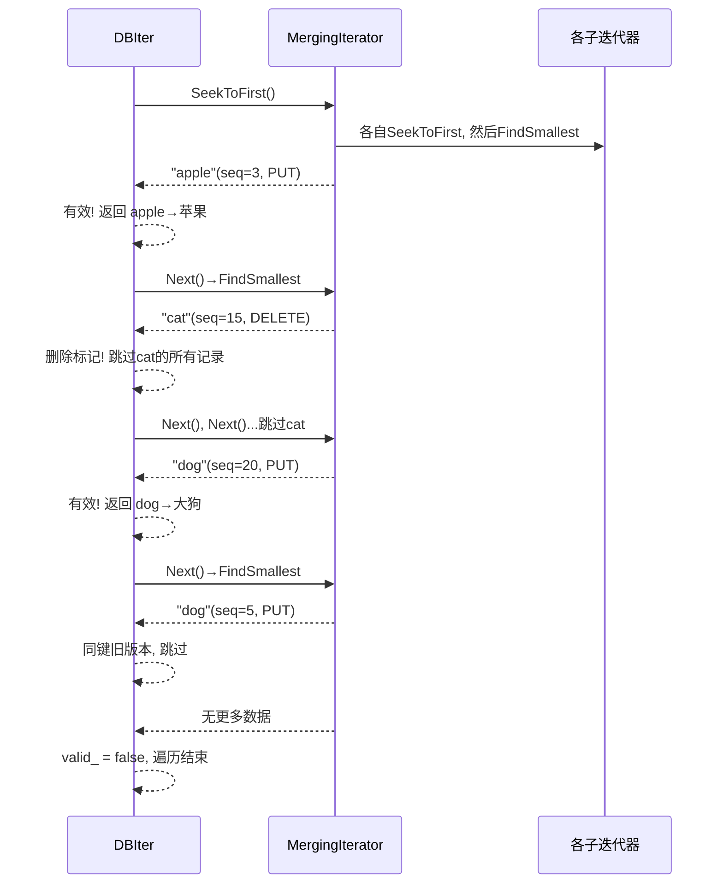

# Chapter 8: 迭代器层次体系

在[上一章](07_合并压缩_compaction.md)中，我们学习了合并压缩（Compaction）——LevelDB 的后台清洁工如何把多个 SSTable 文件合并成新文件。在合并过程中，我们多次看到"合并迭代器"这个概念——它能把多个有序数据源像拉链一样合成一个有序序列。那么，这个迭代器到底是怎么工作的？LevelDB 内部还有哪些不同类型的迭代器？它们是怎么配合的？本章就来揭开**迭代器层次体系**的面纱。

## 从一个实际需求说起

假设你用 LevelDB 存了一大批用户数据，现在想**按字母顺序遍历所有用户**：

```c++
leveldb::Iterator* it = db->NewIterator(
    leveldb::ReadOptions());
for (it->SeekToFirst(); it->Valid(); it->Next()) {
  std::cout << it->key().ToString() << ": "
            << it->value().ToString() << std::endl;
}
delete it;
```

看起来很简单，对吧？一个 `for` 循环就搞定了。但想想背后的复杂性：

- 数据可能在 **MemTable**（内存中）
- 也可能在**不可变 MemTable**（内存中，等待刷盘）
- 还可能散布在**多层 SSTable 文件**中（磁盘上，每层可能多个文件）
- 同一个键可能有**多个版本**（不同时间写入的）
- 有些键已经被**删除了**（只是标记删除，物理数据还在）

用户却只想看到一个**简洁、有序的键值对序列**——最新版本的数据，删除的不要出现。

这就是迭代器层次体系要解决的问题：**把散布在不同数据源中的数据，层层整合，最终呈现一个干净、有序的视图。**

## 迭代器层次体系是什么？一个比喻

把 LevelDB 的迭代器想象成一个**多级过滤的自来水系统**：



从底到上，每一层负责不同的职责：

| 层次 | 迭代器 | 职责 | 类比 |
|------|--------|------|------|
| 最底层 | Block 迭代器 | 在单个数据块内遍历键值对 | 水源 |
| 第二层 | TwoLevelIterator | 先查索引，再访问数据块 | 水泵站 |
| 第三层 | MergingIterator | 将多个有序源合并为一个 | 汇流站 |
| 最外层 | DBIter | 过滤删除标记、处理版本号 | 净水厂 |

用户拿到的迭代器是最外层的 DBIter——它隐藏了所有复杂性，只暴露干净的键值对。

## 关键概念零：统一的迭代器接口

所有迭代器都实现同一个**统一接口**，这是整个层次体系的基础：

```c++
// include/leveldb/iterator.h
class Iterator {
 public:
  virtual bool Valid() const = 0;       // 是否指向有效数据
  virtual void SeekToFirst() = 0;       // 跳到第一个
  virtual void SeekToLast() = 0;        // 跳到最后一个
  virtual void Seek(const Slice& target) = 0; // 跳到 ≥ target 的位置
  virtual void Next() = 0;              // 下一个
  virtual void Prev() = 0;             // 上一个
  virtual Slice key() const = 0;        // 当前键
  virtual Slice value() const = 0;      // 当前值
};
```

无论是内存中的数据块迭代器，还是横跨多层文件的合并迭代器，对外都提供相同的 6 个操作：定位、前移、后移、读取。这就像所有遥控器都有"上下左右确认"按钮——外形不同，但操作方式一样。

有了统一接口，高层迭代器可以**把低层迭代器当成零件来组装**，就像乐高积木一样层层搭建。

## 关键概念一：Block 迭代器——最底层的数据读取

在[SSTable排序表文件格式](05_sstable排序表文件格式.md)中我们学过，SSTable 文件内部分成多个**数据块**（Block）。Block 迭代器负责在**单个块**内遍历键值对。

### 它怎么工作？

回忆一下数据块的结构：键值对使用了**前缀压缩**，每隔 16 个键有一个**重启点**（存完整键的位置）。



当你调用 `Seek("basket")` 时，Block 迭代器会：

1. **在重启点数组上二分查找**——快速跳到 "banana" 重启点
2. **从重启点开始顺序扫描**——逐条解码，直到找到 "basket"

调用 `Next()` 时，只需解码下一条记录。调用 `Prev()` 则需要回到前一个重启点重新扫描（因为前缀压缩是单向的）。

Block 迭代器是整个迭代器体系的**原子单元**——其他所有迭代器最终都依赖它来读取实际数据。

## 关键概念二：TwoLevelIterator——SSTable 的两级查找

一个 SSTable 文件包含**多个数据块**和一个**索引块**。要遍历整个文件，需要：先从索引块找到数据块的位置，再到数据块中读数据。这就是 TwoLevelIterator 的工作——**两级查找**。

### 类比：在词典中查单词

把 TwoLevelIterator 想象成你翻词典的过程：
- **索引迭代器**（index_iter）：词典的目录——"A 开头的单词在第 10 页"
- **数据迭代器**（data_iter）：翻到第 10 页后，在页面内逐行查找



### 核心代码：Seek 操作

```c++
// table/two_level_iterator.cc
void TwoLevelIterator::Seek(const Slice& target) {
  index_iter_.Seek(target);    // 在索引中定位
  InitDataBlock();             // 加载对应的数据块
  if (data_iter_.iter() != nullptr)
    data_iter_.Seek(target);   // 在数据块中精确定位
  SkipEmptyDataBlocksForward();
}
```

三步走：
1. 在**索引块**中找到目标键可能所在的数据块
2. **加载**那个数据块（创建 Block 迭代器）
3. 在**数据块内**精确查找目标键

### Next 跨块：无缝衔接

当数据迭代器走到当前块末尾时，TwoLevelIterator 会自动跳到下一个块：

```c++
// table/two_level_iterator.cc
void TwoLevelIterator::Next() {
  data_iter_.Next();
  SkipEmptyDataBlocksForward();
}
```

`SkipEmptyDataBlocksForward` 负责自动跳转：

```c++
void TwoLevelIterator::SkipEmptyDataBlocksForward() {
  while (data_iter_.iter() == nullptr
         || !data_iter_.Valid()) {
    if (!index_iter_.Valid()) {
      SetDataIterator(nullptr);
      return;  // 所有块都遍历完了
    }
    index_iter_.Next();    // 索引移到下一个块
    InitDataBlock();       // 加载新的数据块
    if (data_iter_.iter() != nullptr)
      data_iter_.SeekToFirst(); // 从新块开头开始
  }
}
```

当前块读完了→索引跳到下一块→加载→从头开始。用户完全感觉不到块的边界——就像翻书时自动翻页一样。

### InitDataBlock：智能加载数据块

```c++
// table/two_level_iterator.cc
void TwoLevelIterator::InitDataBlock() {
  if (!index_iter_.Valid()) {
    SetDataIterator(nullptr);
  } else {
    Slice handle = index_iter_.value();
    if (data_iter_.iter() != nullptr &&
        handle.compare(data_block_handle_) == 0) {
      // 已经加载了这个块，不需要重复加载
    } else {
      Iterator* iter = (*block_function_)(
          arg_, options_, handle);
      data_block_handle_.assign(
          handle.data(), handle.size());
      SetDataIterator(iter);
    }
  }
}
```

这里有个优化：如果当前数据块和要加载的是同一个块，就跳过加载——避免不必要的磁盘读取。

### TwoLevelIterator 的两种用途

TwoLevelIterator 不仅用于**单个 SSTable 内**（索引块→数据块），还用于**遍历一整层的文件**（文件列表→单个文件内容）。这种设计复用非常优雅——同一个两级迭代器框架，换一下"索引"和"数据"的含义就能服务不同场景。

| 场景 | 索引层 | 数据层 |
|------|--------|--------|
| 单个 SSTable | 索引块 | 数据块 |
| 一层 SSTable 文件 | 文件列表 | 每个文件的迭代器 |

## 关键概念三：MergingIterator——多路归并的魔法

现在我们手上有多个有序的迭代器——MemTable 一个、Immutable MemTable 一个、每层 SSTable 各一个。如何把它们**合并成一个有序序列**？

这就是 MergingIterator 的工作，也叫**多路归并**。

### 类比：多条排好序的队伍合并成一条

想象你在学校食堂。有 5 个窗口，每个窗口前的同学都按学号排好了队。现在要把所有人按学号合并成**一条队伍**。

策略很简单：**每次看看各队伍的队首，找学号最小的那个人出列。** 然后那个窗口的下一个人顶上，继续比较。



### 核心代码：FindSmallest

`SeekToFirst()` 先让每个子迭代器都定位到各自的起始位置，然后找最小的：

```c++
// table/merger.cc
void MergingIterator::SeekToFirst() {
  for (int i = 0; i < n_; i++) {
    children_[i].SeekToFirst();
  }
  FindSmallest();
  direction_ = kForward;
}
```

`FindSmallest` 遍历所有子迭代器，找到当前键最小的那个：

```c++
// table/merger.cc
void MergingIterator::FindSmallest() {
  IteratorWrapper* smallest = nullptr;
  for (int i = 0; i < n_; i++) {
    IteratorWrapper* child = &children_[i];
    if (child->Valid()) {
      if (smallest == nullptr) {
        smallest = child;
      } else if (comparator_->Compare(
          child->key(), smallest->key()) < 0) {
        smallest = child;
      }
    }
  }
  current_ = smallest;
}
```

逻辑非常直白：遍历所有孩子，找键最小的那个设为 `current_`。`key()` 和 `value()` 就返回 `current_` 的内容。

### Next 操作

```c++
// table/merger.cc
void MergingIterator::Next() {
  current_->Next();     // 当前最小的前进一步
  FindSmallest();       // 重新找最小的
}
```

当前最小的子迭代器前进一步后，再重新在所有子迭代器中找最小的。这就像食堂排队——队首出列后，那个窗口的下一个人顶上，再比较。

### 方向切换的处理

MergingIterator 支持前后移动。从反向切换到正向时，需要把所有非当前子迭代器重新定位：

```c++
// table/merger.cc — Next() 中的方向切换
if (direction_ != kForward) {
  for (int i = 0; i < n_; i++) {
    IteratorWrapper* child = &children_[i];
    if (child != current_) {
      child->Seek(key());
      if (child->Valid() && comparator_->Compare(
          key(), child->key()) == 0) {
        child->Next();
      }
    }
  }
  direction_ = kForward;
}
```

把其他子迭代器都定位到当前键的位置之后，确保后续 `FindSmallest` 能正确工作。

### IteratorWrapper：性能优化

注意代码中使用了 `IteratorWrapper` 而非直接使用 `Iterator*`：

```c++
// table/iterator_wrapper.h
class IteratorWrapper {
  void Update() {
    valid_ = iter_->Valid();
    if (valid_) {
      key_ = iter_->key();  // 缓存key
    }
  }
  Iterator* iter_;
  bool valid_;  // 缓存 Valid() 结果
  Slice key_;   // 缓存 key() 结果
};
```

`IteratorWrapper` 缓存了 `Valid()` 和 `key()` 的结果。因为 `FindSmallest` 会频繁调用这两个方法来比较各子迭代器，缓存可以避免重复的**虚函数调用**开销。这是一个小而重要的性能优化。

## 关键概念四：DBIter——最外层的"净水厂"

MergingIterator 合并了所有数据源，但它输出的是**内部格式的数据**——包含序列号、类型标记，同一个用户键可能出现多条记录（不同版本、删除标记）。

DBIter 是最外层的迭代器，负责**清洗**这些原始数据，呈现给用户一个干净的视图：

- 过滤掉**序列号大于快照**的记录（只看到快照时刻之前的数据）
- 跳过**删除标记**和被删除标记覆盖的旧数据
- 同一个键的**多个版本**只返回最新的那个

### 类比：从原始数据到用户视图

想象原始数据是这样的（按内部排序）：

```
("alice", seq=10, PUT, "shanghai")   ← 最新
("alice", seq=5,  PUT, "beijing")    ← 旧版本
("bob",   seq=8,  DELETE)            ← 删除标记
("bob",   seq=3,  PUT, "hangzhou")   ← 被删除的数据
("carol", seq=7,  PUT, "shenzhen")
```

DBIter 处理后用户看到的是：

```
"alice" → "shanghai"     ← 只看到最新版本
"carol" → "shenzhen"     ← bob 被删了，不显示
```

### 核心代码：FindNextUserEntry

`Next()` 操作最终调用 `FindNextUserEntry`，它负责跳过不该展示的记录：

```c++
// db/db_iter.cc
void DBIter::FindNextUserEntry(
    bool skipping, std::string* skip) {
  do {
    ParsedInternalKey ikey;
    if (ParseKey(&ikey)
        && ikey.sequence <= sequence_) {
      switch (ikey.type) {
        case kTypeDeletion:
          // 遇到删除标记，跳过后续同键记录
          SaveKey(ikey.user_key, skip);
          skipping = true;
          break;
        case kTypeValue:
          if (skipping && user_comparator_->Compare(
              ikey.user_key, *skip) <= 0) {
            // 这条记录被删除标记遮盖了，跳过
          } else {
            valid_ = true;
            return;  // 找到有效记录！
          }
          break;
      }
    }
    iter_->Next();
  } while (iter_->Valid());
  valid_ = false;
}
```

逻辑分为几个要点：

1. **序列号过滤**：`ikey.sequence <= sequence_` 确保只看到快照之前的数据
2. **遇到删除标记**：记住这个键，后续同键记录都跳过
3. **遇到正常值**：如果没被删除标记遮盖，就返回给用户
4. **循环直到找到有效记录**或遍历结束

### Seek 操作

```c++
// db/db_iter.cc
void DBIter::Seek(const Slice& target) {
  direction_ = kForward;
  saved_key_.clear();
  // 构造内部键：(target, 快照序列号, 查找类型)
  AppendInternalKey(&saved_key_,
      ParsedInternalKey(target, sequence_,
                        kValueTypeForSeek));
  iter_->Seek(saved_key_);
  if (iter_->Valid()) {
    FindNextUserEntry(false, &saved_key_);
  } else {
    valid_ = false;
  }
}
```

先构造一个**内部格式的键**（用户键 + 快照序列号），交给内部迭代器定位，然后用 `FindNextUserEntry` 找到第一个有效记录。

### 反向遍历：Prev 的挑战

反向遍历比正向复杂，因为内部数据的排列方式是：**同一个用户键的不同版本按序列号从大到小排列**。正向时，先遇到的就是最新版本；反向时，需要扫过同一键的所有版本才能确定哪个是最新的。

```c++
// db/db_iter.cc — FindPrevUserEntry 核心逻辑
void DBIter::FindPrevUserEntry() {
  ValueType value_type = kTypeDeletion;
  if (iter_->Valid()) {
    do {
      ParsedInternalKey ikey;
      if (ParseKey(&ikey)
          && ikey.sequence <= sequence_) {
        if (value_type != kTypeDeletion &&
            user_comparator_->Compare(
                ikey.user_key, saved_key_) < 0) {
          break; // 遇到了新的用户键，停止
        }
        value_type = ikey.type;
        if (value_type == kTypeDeletion) {
          saved_key_.clear();
        } else {
          // 保存这个值（可能被后续覆盖）
          SaveKey(ExtractUserKey(iter_->key()),
                  &saved_key_);
          saved_value_.assign(/*...*/);
        }
      }
      iter_->Prev();
    } while (iter_->Valid());
  }
}
```

反向扫描会不断往前看，直到遇到不同的用户键。在扫描过程中，保留最后看到的非删除记录（即序列号最小但仍有效的记录——因为是反向扫描，所以最后保留的恰好是序列号最大的有效版本）。

## 完整的组装过程：NewIterator

现在让我们看看 `db->NewIterator()` 是如何把所有层次组装起来的。



在 `DBImpl` 中，组装过程大致如下：

```c++
// db/db_impl.cc — NewInternalIterator() 简化
// 1. MemTable 迭代器
list.push_back(mem_->NewIterator());
// 2. 不可变 MemTable 迭代器（如果有的话）
if (imm_ != nullptr)
  list.push_back(imm_->NewIterator());
// 3. 当前版本的所有 SSTable 迭代器
versions_->current()->AddIterators(options, &list);
// 4. 合并所有迭代器
Iterator* internal_iter = NewMergingIterator(
    &internal_comparator_, &list[0], list.size());
```

然后再包一层 DBIter：

```c++
// db/db_impl.cc — NewIterator()
Iterator* iter = NewDBIterator(
    this, user_comparator(), internal_iter,
    latest_snapshot, seed);
return iter;
```

### SSTable 迭代器的构建

`AddIterators` 为每层创建不同类型的迭代器：

```c++
// db/version_set.cc — AddIterators() 简化
// Level 0: 每个文件单独一个 TwoLevelIterator
for (auto f : files_[0]) {
  list->push_back(cache->NewIterator(
      options, f->number, f->file_size));
}
// Level 1+: 整层用一个 TwoLevelIterator
for (int level = 1; level < kNumLevels; level++) {
  if (!files_[level].empty()) {
    list->push_back(NewTwoLevelIterator(
        new LevelFileNumIterator(...),
        GetFileIterator, ...));
  }
}
```

**Level 0** 文件可能互相重叠，所以每个文件需要独立的迭代器参与合并。**Level 1 及以上**的文件保证互不重叠，可以用一个 TwoLevelIterator 把一整层当作一个连续的有序序列——索引层是文件列表，数据层是每个文件的内容。

## 全景层次图

让我们把完整的迭代器层次画出来：



自上而下四层：
1. **DBIter**：给用户的干净接口
2. **MergingIterator**：把所有数据源合并
3. **TwoLevelIterator**：两级查找（索引→数据）
4. **Block 迭代器**：实际读取数据块内容

## 一个完整的查找例子

假设数据库中的数据分布如下：

| 数据源 | 内容 |
|--------|------|
| MemTable | ("dog", seq=20, PUT, "大狗") |
| Imm MemTable | ("cat", seq=15, DELETE) |
| Level 0 文件 | ("cat", seq=10, PUT, "小猫"), ("dog", seq=5, PUT, "小狗") |
| Level 1 文件 | ("apple", seq=3, PUT, "苹果"), ("cat", seq=2, PUT, "猫咪") |

用户调用 `SeekToFirst()` 然后不断 `Next()`，整个过程如下：



最终用户看到的结果：

```
apple → 苹果
dog → 大狗
```

"cat" 因为有删除标记被过滤掉了。"dog" 的旧版本（seq=5）也被跳过了。整个过程对用户完全透明。

## 读采样：触发 Seek Compaction

DBIter 还有一个隐藏功能——**读采样**。每遍历一定量的数据，就记录一次"在哪个文件上读了数据"：

```c++
// db/db_iter.cc — ParseKey() 中
size_t bytes_read = k.size() + iter_->value().size();
while (bytes_until_read_sampling_ < bytes_read) {
  bytes_until_read_sampling_ += RandomCompactionPeriod();
  db_->RecordReadSample(k);
}
```

如果某个文件被频繁"空读"（查了但没命中），LevelDB 会触发一次 [合并压缩（Compaction）](07_合并压缩_compaction.md) 来优化数据组织。这就是在[上一章](07_合并压缩_compaction.md)中提到的 "seek compaction" 的来源。

## 迭代器在 Compaction 中的应用

MergingIterator 不仅服务于用户的遍历操作，还是 [合并压缩（Compaction）](07_合并压缩_compaction.md) 的核心引擎。在 `DoCompactionWork` 中：

```c++
// db/db_impl.cc — DoCompactionWork()
Iterator* input = versions_->MakeInputIterator(
    compact->compaction);
input->SeekToFirst();
// 遍历所有输入文件的数据，执行归并排序
while (input->Valid()) {
  // 过滤、写入新文件...
  input->Next();
}
```

`MakeInputIterator` 创建的就是一个 MergingIterator，它把所有参与合并的 SSTable 文件的内容统一排序输出。Compaction 只需要像读一个有序列表一样遍历，就能完成多路归并——这就是统一迭代器接口的威力。

## NewMergingIterator 的优化

创建合并迭代器时，有两个特殊情况被优化了：

```c++
// table/merger.cc
Iterator* NewMergingIterator(
    const Comparator* cmp,
    Iterator** children, int n) {
  if (n == 0) return NewEmptyIterator();
  if (n == 1) return children[0];
  return new MergingIterator(cmp, children, n);
}
```

- **0 个子迭代器**：直接返回空迭代器
- **1 个子迭代器**：直接返回它本身，不需要合并包装

这避免了不必要的包装开销。

## 清理机制：RegisterCleanup

迭代器还有一个重要的生命周期管理机制——**清理回调**：

```c++
// include/leveldb/iterator.h
void Iterator::RegisterCleanup(
    CleanupFunction func, void* arg1, void* arg2);
```

当迭代器被 `delete` 时，注册的清理函数会自动执行。这用于释放迭代器持有的资源（比如对 Version 的引用、缓存的数据块等）。

```c++
// table/iterator.cc — ~Iterator()
Iterator::~Iterator() {
  if (!cleanup_head_.IsEmpty()) {
    cleanup_head_.Run();
    for (CleanupNode* node = cleanup_head_.next;
         node != nullptr;) {
      node->Run();
      CleanupNode* next_node = node->next;
      delete node;
      node = next_node;
    }
  }
}
```

清理回调形成一个**链表**，销毁时依次执行。这确保了即使迭代器层层嵌套，资源也能被正确释放。

## 总结

在本章中，我们深入了解了 LevelDB 的迭代器层次体系——一个从底层到顶层层层包装的精妙设计：

- **统一接口**：所有迭代器实现相同的 `Iterator` 接口（Valid/Seek/Next/Prev/key/value），像乐高积木一样可以自由组装
- **Block 迭代器**（最底层）：在单个数据块内通过重启点二分查找 + 顺序扫描遍历
- **TwoLevelIterator**（第二层）：两级查找——先查索引定位数据块，再在数据块内查找，自动跨块衔接
- **MergingIterator**（第三层）：把多个有序子迭代器合并为一个有序序列，核心是每次选最小的（多路归并）
- **DBIter**（最外层）：过滤序列号、跳过删除标记、同键只返回最新版本，给用户一个干净的键值视图
- **复用于 Compaction**：同样的 MergingIterator 也是合并压缩的核心引擎

迭代器层次体系体现了 LevelDB "分层抽象、统一接口"的设计哲学。每一层只关心自己的职责，通过组合实现强大的功能。

在遍历和查找数据时，我们经常需要判断某个键是否"可能存在"于某个 SSTable 文件中。如果能在不读取数据块的情况下快速排除，就能省下宝贵的磁盘 IO。下一章我们将了解这个"快速筛选器"——[布隆过滤器与过滤策略](09_布隆过滤器与过滤策略.md)，看看 LevelDB 如何用概率数据结构加速查找。

---

Generated by [AI Codebase Knowledge Builder](https://github.com/The-Pocket/Tutorial-Codebase-Knowledge)