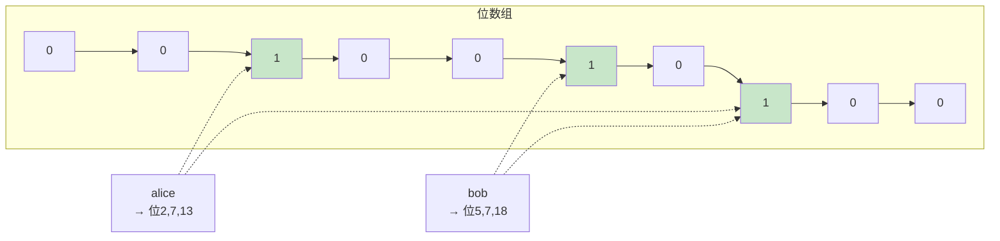
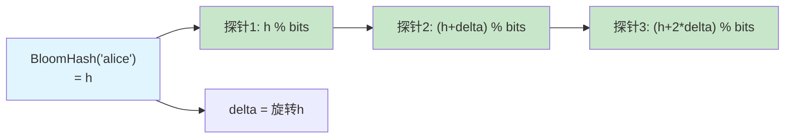
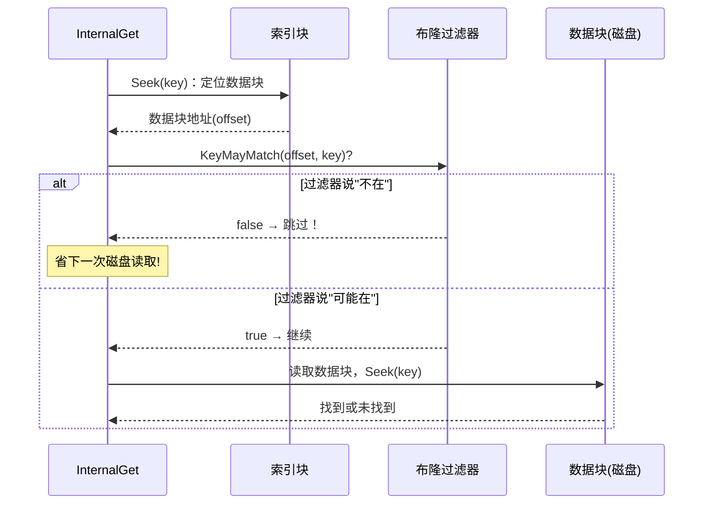
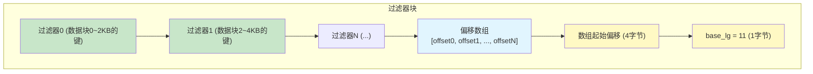
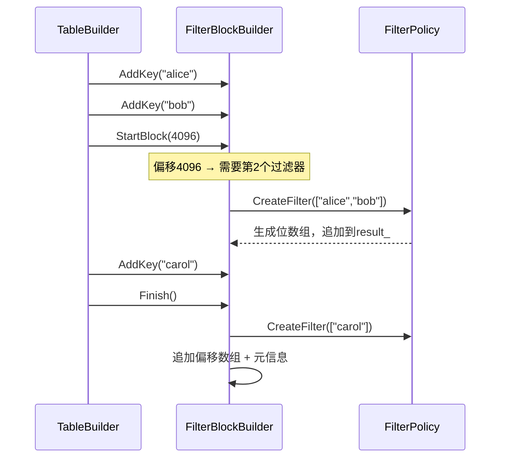
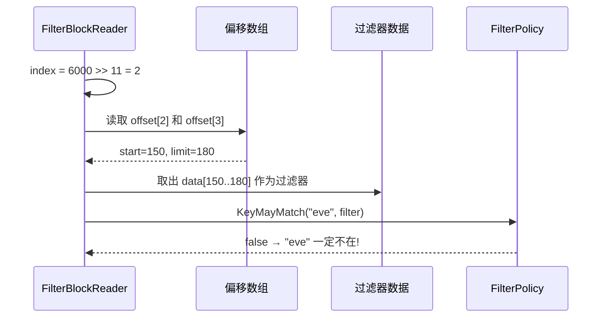
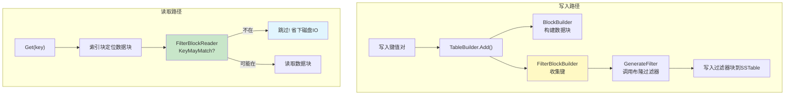

# Chapter 9: 布隆过滤器与过滤策略

在[上一章](08_迭代器层次体系.md)中，我们学习了 LevelDB 的迭代器层次体系——层层包装的迭代器如何把散布在内存和磁盘中的数据整合成一个干净、有序的视图。在遍历和查找过程中，我们常常需要去磁盘上的 SSTable 文件中查找某个键。但如果那个键根本不在某个文件里，岂不是白跑一趟？有没有办法**不读磁盘就知道"这个键肯定不在这里"**？

这就是本章的主角——**布隆过滤器与过滤策略**。

## 从一个实际问题说起

假设你在用 LevelDB 存储 100 万个用户的信息。现在你调用 `Get("eve")`，但 `eve` 这个用户**根本不存在**。

回顾[数据库核心读写引擎](01_数据库核心读写引擎.md)中的读取流程：LevelDB 会先查 MemTable，再查 Immutable MemTable，最后到磁盘上的 SSTable 文件中逐层查找。假设磁盘上有 7 层、几十个 SSTable 文件——对于一个不存在的键，LevelDB 可能要**读取好几个文件的数据块**才能确认"没有这个键"。每次读数据块都是一次磁盘 I/O，非常慢！

**能不能在真正读数据块之前，先快速问一句："这个键有没有可能在这个文件里？"**

如果答案是"肯定不在"，就直接跳过这个文件，省下一次磁盘读取。这正是布隆过滤器做的事情——一个快速的**"预检员"**，用极少的内存就能判断某个键是否**可能**存在。

| 场景 | 没有布隆过滤器 | 有布隆过滤器 |
|------|----------------|--------------|
| 查找不存在的键 | 读取多个数据块，多次磁盘 I/O | 过滤器说"不在"，直接跳过，零磁盘 I/O |
| 查找存在的键 | 正常读取 | 过滤器说"可能在"，正常读取 |

根据 LevelDB 的文档，布隆过滤器可以把随机读的磁盘 I/O 减少约 **100 倍**！

## 布隆过滤器是什么？一句话解释

布隆过滤器就像一个**快速签到表**。每个来过的人都在表上几个位置打了勾。查某人来没来过时，检查那几个位置是否都打了勾——如果**有一个没打勾**，那这个人**一定没来过**；如果**全打了勾**，那这个人**可能来过**（也可能是其他人恰好在这些位置打了勾，造成误判）。

关键特性：
- **说"不在"就一定不在**（零漏判）
- **说"可能在"不一定真在**（有小概率误判，叫"假阳性"）
- 只需要很少的内存（每个键约 10 比特）

## 类比：多位置签到表

让我们用一个具体例子来理解。假设签到表有 20 个格子（位），每人签到时在 3 个位置打勾：

```
签到表（20位）: [0][0][0][0][0][0][0][0][0][0][0][0][0][0][0][0][0][0][0][0]
```

alice 来了，哈希计算出位置 2、7、13：

```
签到表: [0][0][1][0][0][0][0][1][0][0][0][0][0][1][0][0][0][0][0][0]
              ^              ^                 ^
```

bob 来了，位置 5、7、18：

```
签到表: [0][0][1][0][0][1][0][1][0][0][0][0][0][1][0][0][0][0][1][0]
              ^        ^     ^                 ^              ^
```

现在查 carol（位置 2、9、13）：位置 9 是 0 → **carol 一定没来过！**

查 dave（位置 2、5、13）：位置 2、5、13 都是 1 → **dave 可能来过**（但实际上是 alice 和 bob 的组合恰好占了这些位置，这就是假阳性）。



## 怎么使用？从用户角度看

作为 LevelDB 的使用者，启用布隆过滤器非常简单——只需要在打开数据库时设置一个选项：

```c++
#include "leveldb/db.h"
#include "leveldb/filter_policy.h"

leveldb::Options options;
options.filter_policy =
    leveldb::NewBloomFilterPolicy(10);
options.create_if_missing = true;
leveldb::DB* db;
leveldb::DB::Open(options, "/tmp/testdb", &db);
```

`NewBloomFilterPolicy(10)` 表示每个键使用 **10 比特**的过滤空间。10 比特是一个很好的默认值，假阳性率约为 **1%**——也就是说，100 次"可能存在"的回答中，大约只有 1 次是误判。

设置完成后，**一切都是自动的**：
- 写入 SSTable 时自动构建过滤器
- 读取时自动查询过滤器
- 你不需要做任何额外操作

```c++
// 之后正常使用，布隆过滤器在幕后工作
db->Put(writeOptions, "alice", "beijing");
db->Get(readOptions, "eve", &value);
// 查找 "eve" 时，过滤器帮你跳过不相关的数据块
```

用完后记得释放过滤策略：

```c++
delete db;
delete options.filter_policy;
```

## 核心接口：FilterPolicy

布隆过滤器的"规范"由 `FilterPolicy` 接口定义。它是一个**策略接口**，允许用户自定义过滤算法（虽然绝大多数人会直接用内置的布隆过滤器）。

```c++
// include/leveldb/filter_policy.h
class FilterPolicy {
 public:
  virtual const char* Name() const = 0;
  virtual void CreateFilter(
      const Slice* keys, int n,
      std::string* dst) const = 0;
  virtual bool KeyMayMatch(
      const Slice& key,
      const Slice& filter) const = 0;
};
```

只有三个方法：

| 方法 | 作用 | 类比 |
|------|------|------|
| `Name()` | 返回策略名称 | 签到表的型号 |
| `CreateFilter()` | 根据一批键创建过滤器数据 | 让一批人签到 |
| `KeyMayMatch()` | 查询某个键是否可能存在 | 查某人是否来过 |

`CreateFilter` 在 SSTable 构建时调用，`KeyMayMatch` 在读取时调用。

## 深入代码：布隆过滤器的创建

让我们看看内置的 `BloomFilterPolicy` 是怎么实现的。

### 初始化：计算哈希探针数

```c++
// util/bloom.cc — 构造函数
explicit BloomFilterPolicy(int bits_per_key)
    : bits_per_key_(bits_per_key) {
  k_ = static_cast<size_t>(bits_per_key * 0.69);
  if (k_ < 1) k_ = 1;
  if (k_ > 30) k_ = 30;
}
```

`bits_per_key` 是每个键分配多少比特（比如 10）。`k_` 是**哈希探针数**——每个键要在位数组中标记多少个位置。公式 `bits_per_key * 0.69`（≈ ln(2)）是数学上使假阳性率最低的最优探针数。10 比特时，k = 6。

### CreateFilter：构建位数组

```c++
// util/bloom.cc — CreateFilter() 前半部分
size_t bits = n * bits_per_key_;
if (bits < 64) bits = 64;  // 最小64位
size_t bytes = (bits + 7) / 8;
bits = bytes * 8;
```

根据键的数量 `n` 计算位数组的大小。比如 100 个键、每键 10 比特 = 1000 比特 = 125 字节。

```c++
// util/bloom.cc — CreateFilter() 后半部分
dst->resize(init_size + bytes, 0);  // 分配空间
dst->push_back(static_cast<char>(k_)); // 记住探针数
char* array = &(*dst)[init_size];
```

位数组初始化为全 0，末尾追加一个字节记录探针数 `k_`。这样读取过滤器时就知道该用几个探针。

### 为每个键设置标记位

```c++
// util/bloom.cc — 为每个key设置位
for (int i = 0; i < n; i++) {
  uint32_t h = BloomHash(keys[i]);
  const uint32_t delta = (h >> 17) | (h << 15);
  for (size_t j = 0; j < k_; j++) {
    const uint32_t bitpos = h % bits;
    array[bitpos / 8] |= (1 << (bitpos % 8));
    h += delta;
  }
}
```

这是核心逻辑，对每个键：

1. **计算哈希值** `h`（使用 `BloomHash`）
2. **计算增量** `delta`（通过位旋转得到）
3. **设置 k 个位**：每次用 `h % bits` 算出位位置，设置该位为 1，然后 `h += delta` 得到下一个位置

这里用了一个巧妙的技术——**双重哈希**（Double Hashing）。只需要**一次**哈希计算，通过不断加 `delta` 就能生成 k 个不同的位置。这比调用 k 次哈希函数快得多，而且数学上证明效果一样好。

用图来说明。假设对键 "alice" 做 3 次探针：



## 深入代码：布隆过滤器的查询

查询时，用完全相同的方式计算探针位置，然后检查每个位是否为 1：

```c++
// util/bloom.cc — KeyMayMatch()
uint32_t h = BloomHash(key);
const uint32_t delta = (h >> 17) | (h << 15);
for (size_t j = 0; j < k; j++) {
  const uint32_t bitpos = h % bits;
  if ((array[bitpos/8] & (1 << (bitpos%8))) == 0)
    return false;  // 这一位是0，一定不存在！
  h += delta;
}
return true;  // 所有位都是1，可能存在
```

逻辑非常清晰：
- 和创建时一样计算 k 个位位置
- **只要有一个位是 0**，就返回 `false`——这个键**一定不存在**
- **所有位都是 1**，返回 `true`——这个键**可能存在**

注意查询时从过滤器数据中读取 `k` 值：

```c++
// util/bloom.cc — 从过滤器数据中读取探针数
const size_t k = array[len - 1];
if (k > 30) return true; // 未知编码，保守返回
```

这意味着即使未来改变了 `bits_per_key`，旧的过滤器数据仍然可以被正确读取——因为探针数是存储在过滤器数据本身中的。

## 查询流程：布隆过滤器在读取中的位置

让我们回顾[SSTable排序表文件格式](05_sstable排序表文件格式.md)中的查找流程，看看布隆过滤器在哪一步发挥作用：



关键点：布隆过滤器的检查发生在**读取索引之后、读取数据块之前**。索引块通常已经缓存在内存中，不需要磁盘 I/O；但读取数据块往往需要磁盘 I/O。布隆过滤器正是在这个"临门一脚"的位置拦截无效读取。

## 过滤器块的结构

在 SSTable 文件中，所有数据块的过滤器被集中存储在一个**过滤器元数据块**（Filter Meta Block）中。它不是为每个键单独存一个过滤器，而是为**每 2KB 的数据**生成一个过滤器。

### 为什么按 2KB 分组？

```c++
// table/filter_block.cc
static const size_t kFilterBaseLg = 11;
static const size_t kFilterBase = 1 << kFilterBaseLg;
// kFilterBase = 2048 = 2KB
```

每 2KB 的数据块范围对应一个过滤器。这是一个粒度的权衡——太粗则过滤效果差（一个过滤器覆盖太多键），太细则过滤器本身占用太多空间。

### 过滤器块的整体布局



从上到下依次是：
1. **多个过滤器数据**：每个对应一段数据块范围
2. **偏移数组**：记录每个过滤器在块中的起始位置
3. **数组起始偏移**：偏移数组本身在块中的位置（4 字节）
4. **base_lg**：分组粒度的对数值（1 字节，值为 11 表示 2KB）

## 深入代码：FilterBlockBuilder——构建过滤器块

`FilterBlockBuilder` 在 SSTable 构建过程中被使用。每当 [SSTable排序表文件格式](05_sstable排序表文件格式.md) 中的 `TableBuilder` 添加键值对时，它也会把键交给 `FilterBlockBuilder`。

### 添加键

```c++
// table/filter_block.cc
void FilterBlockBuilder::AddKey(const Slice& key) {
  Slice k = key;
  start_.push_back(keys_.size());
  keys_.append(k.data(), k.size());
}
```

把键**暂存**起来。`keys_` 是所有键拼接在一起的字符串，`start_` 记录每个键在 `keys_` 中的起始位置。这样只用一次内存分配就能存多个键。

### 数据块切换时生成过滤器

当 `TableBuilder` 切换到新的数据块时，会调用 `StartBlock`：

```c++
// table/filter_block.cc
void FilterBlockBuilder::StartBlock(
    uint64_t block_offset) {
  uint64_t filter_index = block_offset / kFilterBase;
  while (filter_index > filter_offsets_.size()) {
    GenerateFilter();
  }
}
```

根据数据块的偏移量计算应该有多少个过滤器。如果当前过滤器数量不够，就为之前积累的键生成过滤器。

### GenerateFilter：为一批键创建过滤器

```c++
// table/filter_block.cc — GenerateFilter() 核心
void FilterBlockBuilder::GenerateFilter() {
  const size_t num_keys = start_.size();
  if (num_keys == 0) {
    filter_offsets_.push_back(result_.size());
    return;  // 没有键，生成空过滤器
  }
  // 构造键的 Slice 数组
  tmp_keys_.resize(num_keys);
  for (size_t i = 0; i < num_keys; i++) {
    const char* base = keys_.data() + start_[i];
    size_t length = start_[i + 1] - start_[i];
    tmp_keys_[i] = Slice(base, length);
  }
```

先把扁平化存储的键还原成 Slice 数组。

```c++
  // 调用策略的 CreateFilter 生成过滤器
  filter_offsets_.push_back(result_.size());
  policy_->CreateFilter(
      &tmp_keys_[0], num_keys, &result_);
  // 清理暂存数据
  tmp_keys_.clear();
  keys_.clear();
  start_.clear();
}
```

记录当前过滤器的偏移量，然后调用 `FilterPolicy::CreateFilter` 生成过滤器数据并追加到 `result_` 中。最后清空暂存区，准备接收下一批键。

### Finish：完成过滤器块

```c++
// table/filter_block.cc
Slice FilterBlockBuilder::Finish() {
  if (!start_.empty()) GenerateFilter();
  // 追加偏移数组
  const uint32_t array_offset = result_.size();
  for (size_t i = 0; i < filter_offsets_.size(); i++)
    PutFixed32(&result_, filter_offsets_[i]);
  // 追加数组起始偏移和 base_lg
  PutFixed32(&result_, array_offset);
  result_.push_back(kFilterBaseLg);
  return Slice(result_);
}
```

收尾工作：把最后一批键生成过滤器，然后追加偏移数组、数组起始位置和 base_lg 参数。

### 构建流程图



## 深入代码：FilterBlockReader——查询过滤器

构建是一半，查询是另一半。`FilterBlockReader` 负责从已存储的过滤器块中读取数据并回答查询。

### 初始化：解析过滤器块结构

```c++
// table/filter_block.cc — 构造函数
FilterBlockReader::FilterBlockReader(
    const FilterPolicy* policy,
    const Slice& contents)
    : policy_(policy), data_(nullptr),
      offset_(nullptr), num_(0), base_lg_(0) {
  size_t n = contents.size();
  if (n < 5) return;  // 至少需要5字节
  base_lg_ = contents[n - 1];           // 最后1字节
  uint32_t last_word =
      DecodeFixed32(contents.data() + n - 5); // 倒数5字节
  data_ = contents.data();
  offset_ = data_ + last_word;           // 偏移数组起始
  num_ = (n - 5 - last_word) / 4;       // 过滤器数量
}
```

从过滤器块的末尾解析出关键信息：
- `base_lg_`：分组粒度（11 = 2KB）
- `offset_`：偏移数组的起始指针
- `num_`：过滤器的数量

### KeyMayMatch：核心查询

```c++
// table/filter_block.cc
bool FilterBlockReader::KeyMayMatch(
    uint64_t block_offset, const Slice& key) {
  uint64_t index = block_offset >> base_lg_;
  if (index < num_) {
    uint32_t start =
        DecodeFixed32(offset_ + index * 4);
    uint32_t limit =
        DecodeFixed32(offset_ + index * 4 + 4);
    if (start <= limit &&
        limit <= static_cast<size_t>(offset_ - data_)) {
      Slice filter = Slice(data_+start, limit-start);
      return policy_->KeyMayMatch(key, filter);
    } else if (start == limit) {
      return false;  // 空过滤器，不匹配
    }
  }
  return true;  // 出错时保守返回"可能匹配"
}
```

查询步骤：
1. **计算过滤器索引**：`block_offset >> base_lg_` 等于 `block_offset / 2048`，得到这个数据块对应第几个过滤器
2. **从偏移数组中取出过滤器的范围**：`[start, limit)`
3. **调用 FilterPolicy::KeyMayMatch**：用布隆过滤器算法检查键是否可能存在

注意最后的 `return true`——如果出了任何错误（索引越界、偏移非法等），都返回 `true`（可能匹配）。这是一种**保守策略**——宁可多读一次磁盘，也不能漏掉真正存在的数据。

### 查询过程图解

假设要查键 "eve"，数据块偏移是 6000：



6000 / 2048 ≈ 2，所以用第 2 个过滤器来检查。

## 过滤器在 SSTable 中的集成

让我们看看过滤器是如何被集成到 SSTable 的构建和读取流程中的。

### 构建时：TableBuilder 使用 FilterBlockBuilder

在[SSTable排序表文件格式](05_sstable排序表文件格式.md)的 `TableBuilder` 中，每添加一个键值对时：

```c++
// table/table_builder.cc — Add() 中
if (r->filter_block != nullptr) {
  r->filter_block->AddKey(key);
}
```

每次刷写数据块时：

```c++
// table/table_builder.cc — Flush() 中
if (r->filter_block != nullptr) {
  r->filter_block->StartBlock(r->offset);
}
```

最终在 `Finish()` 中写入过滤器块，并在元索引块中记录它的位置：

```c++
// 写入过滤器块
// key = "filter.leveldb.BuiltinBloomFilter2"
// value = 过滤器块的 BlockHandle
```

### 读取时：Table::Open 加载过滤器

打开 SSTable 时，从元索引块中查找过滤器：

```c++
// table/table.cc — ReadMeta() 简化
std::string key = "filter." + policy->Name();
iter->Seek(key);
if (iter->Valid() && iter->key() == Slice(key)) {
  ReadFilter(iter->value());
}
```

加载过滤器数据后创建 `FilterBlockReader`，之后的查询操作就可以使用它来快速排除不存在的键。

## 自定义过滤策略

虽然内置的布隆过滤器已经非常好用，但 `FilterPolicy` 接口允许你**自定义过滤策略**。这在某些特殊场景下很有用。

例如，如果你的键是固定格式的（比如都是 8 字节的整数），可以设计一种更高效的过滤器。或者如果你的比较器忽略了键的某些部分（比如忽略大小写），你需要确保过滤器也忽略同样的部分。

不过对于绝大多数使用场景，`NewBloomFilterPolicy(10)` 就是最佳选择。

## 假阳性率与参数选择

布隆过滤器的假阳性率取决于两个参数：每键比特数和探针数。内置布隆过滤器自动计算最优探针数，你只需要选择 `bits_per_key`：

| bits_per_key | 探针数 (k) | 假阳性率 |
|:---:|:---:|:---:|
| 5 | 3 | ~10% |
| 10 | 6 | ~1% |
| 15 | 10 | ~0.1% |
| 20 | 13 | ~0.01% |

`10` 是一个很好的默认值——每个键只占 1.25 字节的额外空间，就能把假阳性率降到约 1%。对于 100 万个键，过滤器只占约 1.2MB 内存。

## 完整数据流全景图

让我们把布隆过滤器从构建到使用的整个生命周期串起来：



写入时：键被收集 → 定期生成过滤器 → 存储在 SSTable 文件中。  
读取时：先查索引 → 用过滤器快速排除 → 只对"可能存在"的才真正读磁盘。

## 总结

在本章中，我们深入了解了布隆过滤器与过滤策略——LevelDB 的"快速预检员"：

- **核心作用**：在读取数据块之前快速判断键是否可能存在，省下不必要的磁盘 I/O
- **工作原理**：位数组 + 多次哈希探针。说"不在"就一定不在，说"可能在"有小概率误判
- **FilterPolicy 接口**：`CreateFilter` 构建过滤器，`KeyMayMatch` 查询过滤器，支持自定义策略
- **内置布隆过滤器**：使用双重哈希技术，只需一次哈希计算就能生成多个探针位置
- **过滤器块**：按每 2KB 数据块范围分组存储过滤器，集中存放在 SSTable 文件中
- **FilterBlockBuilder/Reader**：分别负责构建和查询过滤器块
- **参数选择**：`bits_per_key = 10` 是推荐默认值，假阳性率约 1%，每键只占 1.25 字节

布隆过滤器让 LevelDB 的随机读性能提升了约 100 倍，是以极小的空间代价换取巨大性能收益的经典案例。

数据被过滤器快速筛选后，真正需要读取的数据块还会被缓存起来——避免对同一个数据块反复读取磁盘。下一章我们将了解这个缓存机制——[LRU缓存与TableCache](10_lru缓存与tablecache.md)，看看 LevelDB 如何用有限的内存缓存热点数据，进一步加速读取性能。

---

Generated by [AI Codebase Knowledge Builder](https://github.com/The-Pocket/Tutorial-Codebase-Knowledge)