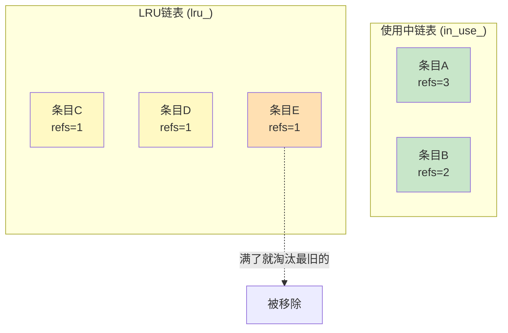
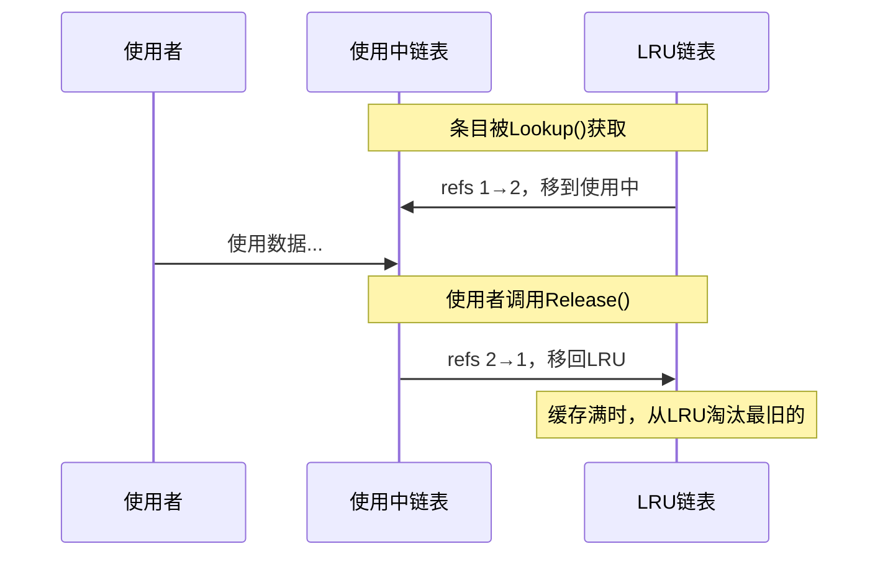
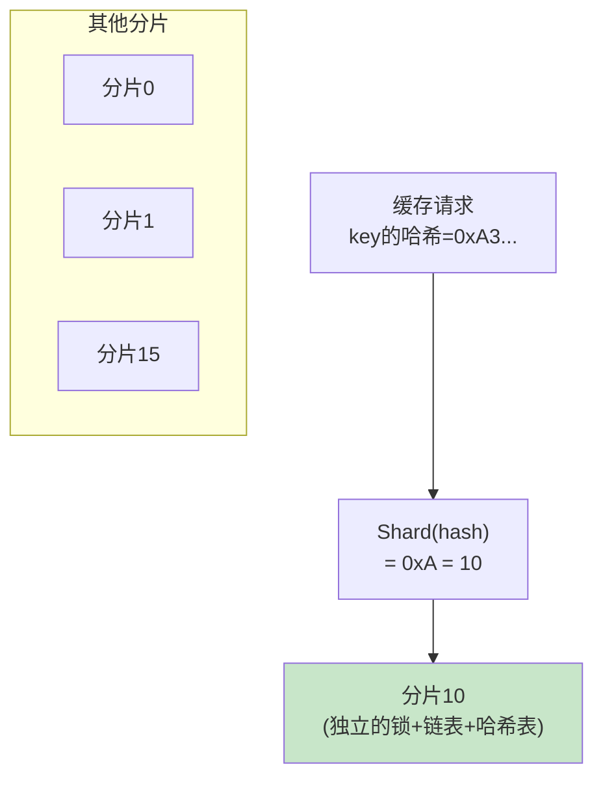
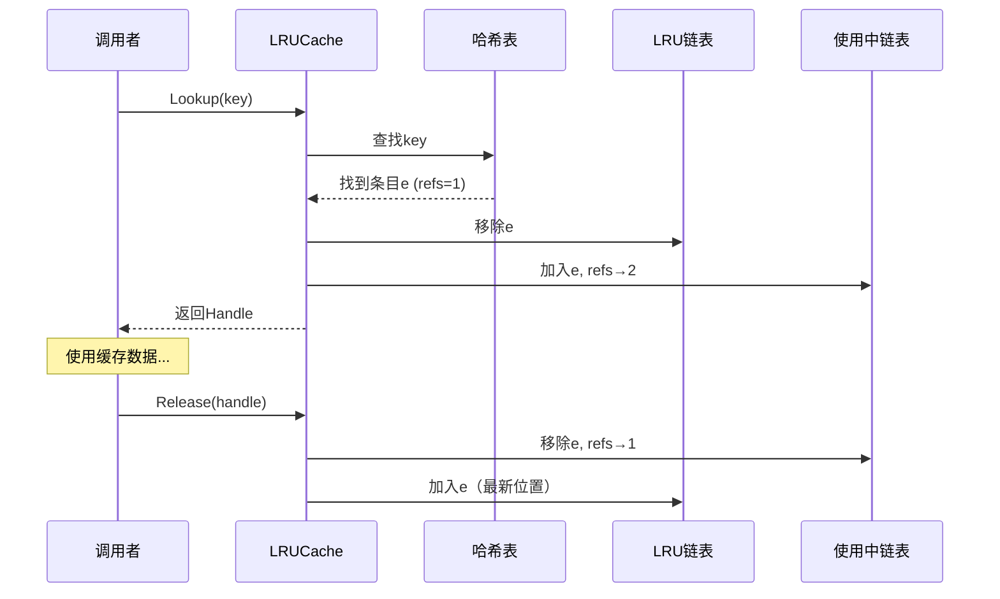
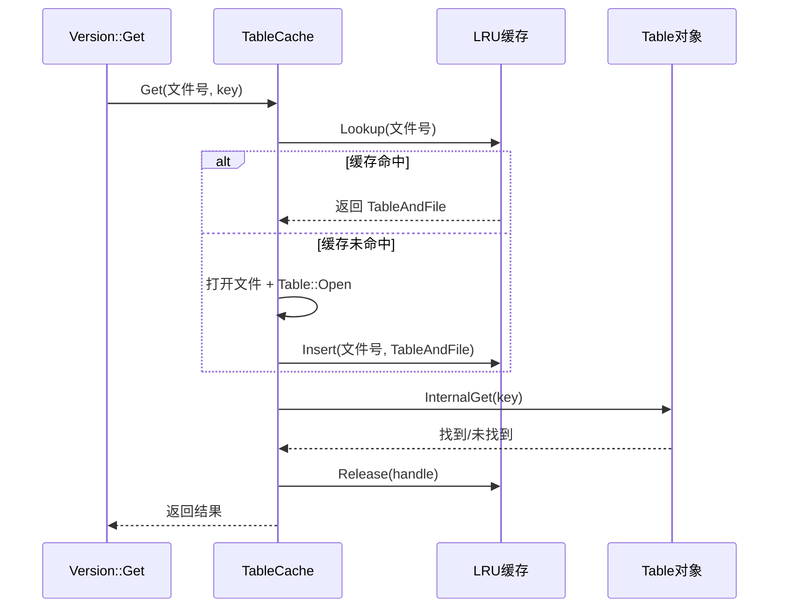
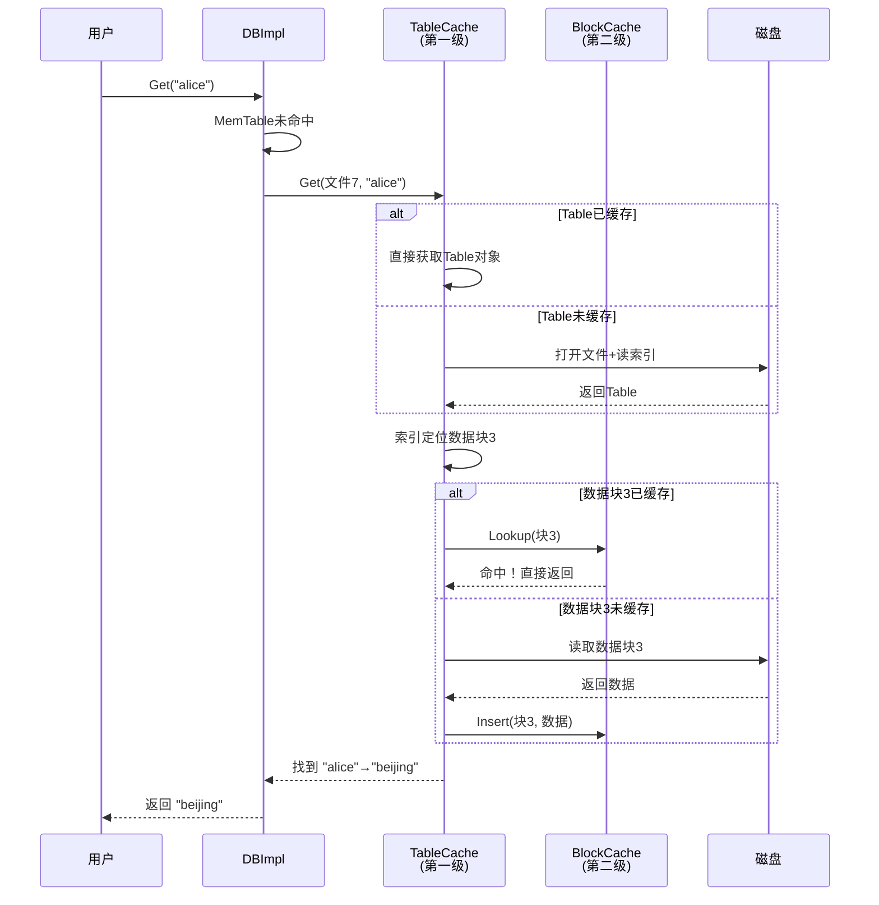
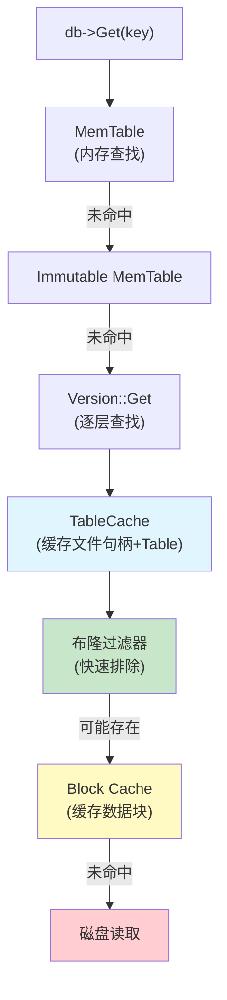

# Chapter 10: LRU缓存与TableCache

在[上一章](09_布隆过滤器与过滤策略.md)中，我们学习了布隆过滤器——一个"快速预检员"，能在不读取磁盘的情况下排除掉不存在的键，大幅减少无效的磁盘 I/O。但对于那些确实存在的键，每次读取都去磁盘上打开文件、读取数据块，还是太慢了。有没有办法把**最近用过的数据留在内存里**，下次再用的时候直接从内存取？

这就是本章的主角——**LRU 缓存与 TableCache**。

## 从一个实际问题说起

假设你经营一个图书馆，每天都有读者来借书。书架在地下室（磁盘），从地下室取一本书需要跑 10 分钟。你发现一个规律：**最近被借过的书，很快又会被借**。

于是你在前台摆了一个**小书架**（缓存），能放 100 本书。每次有人借书，你先看看小书架上有没有——有的话直接拿，几秒搞定；没有再去地下室。小书架满了怎么办？把**最久没人借的那本**放回去，腾出位置给新书。

这就是 LRU（Least Recently Used，最近最少使用）缓存的核心思想：**保留最近使用过的数据，淘汰最久未使用的数据。**

在 LevelDB 中，这个"小书架"有两层：

| 缓存层 | 缓存什么 | 类比 |
|--------|----------|------|
| **Block Cache** | SSTable 中的数据块 | 小书架上的书页 |
| **TableCache** | SSTable 的文件句柄和 Table 对象 | 小书架上已打开的书 |

两级缓存协同工作，使热点数据的读取几乎**不需要磁盘 I/O**。

## LRU 缓存解决了什么问题？

回顾[数据库核心读写引擎](01_数据库核心读写引擎.md)中的读取路径：当数据不在内存表中时，LevelDB 需要到磁盘上的 [SSTable排序表文件格式](05_sstable排序表文件格式.md) 文件中查找。每次查找涉及两个昂贵的操作：

1. **打开文件**：操作系统需要分配文件句柄，读取 SSTable 的页脚和索引块
2. **读取数据块**：从磁盘读取几 KB 的数据块，可能还需要解压缩

如果同一个文件或数据块被反复访问，每次都重复这些操作就太浪费了。LRU 缓存把这些中间结果保存在内存中，**用空间换时间**。

## 怎么使用？从用户角度看

作为 LevelDB 的使用者，你可以通过选项控制缓存大小：

```c++
#include "leveldb/cache.h"
#include "leveldb/options.h"

// 创建一个 8MB 的块缓存
leveldb::Options options;
options.block_cache = leveldb::NewLRUCache(8 << 20);
options.create_if_missing = true;
leveldb::DB* db;
leveldb::DB::Open(options, "/tmp/testdb", &db);
```

就这么简单！设置了 `block_cache` 之后，一切自动工作。读取过的数据块会被自动缓存，重复读取时直接从内存获取。

用完后记得释放：

```c++
delete db;
delete options.block_cache;
```

如果不设置 `block_cache`，LevelDB 会使用一个默认的 8MB 缓存。TableCache 的大小则由 `options.max_open_files` 控制（默认 1000 个文件）。

## 核心概念一：LRU 淘汰策略

LRU 的核心规则只有一条：**当缓存满了，淘汰最久没被使用过的那一条。**

### 直觉理解

假设缓存容量为 3，依次访问数据 A、B、C、D：

```
访问A: [A]          ← A 进入缓存
访问B: [B, A]       ← B 进入，A 变旧
访问C: [C, B, A]    ← 缓存满了
访问D: [D, C, B]    ← A 最久没用，被淘汰
访问B: [B, D, C]    ← B 被重新使用，移到最前面
```

每次访问一条数据，它就被"刷新"到最前面。最后面的就是最久没用的——缓存满了就从最后面淘汰。

### LevelDB 的两个链表设计

LevelDB 的 LRU 缓存把缓存条目分成**两个链表**：



| 链表 | 条件 | 说明 |
|------|------|------|
| **使用中链表** (in_use_) | refs ≥ 2 | 有外部使用者正在使用 |
| **LRU 链表** (lru_) | refs = 1 | 只有缓存自身持有引用，没人在用 |

为什么分成两个链表？因为**正在被使用的条目不能被淘汰**——如果有人正在读取数据块 A，突然把 A 从缓存中删掉，读取就会出错。只有 LRU 链表中的条目（没人在用的）才是淘汰的候选者。

### 条目在两个链表之间的流转



条目被查找（Lookup）时从 LRU 链表移到使用中链表；使用完毕（Release）后又移回 LRU 链表。这个设计既保证了正在使用的数据不被淘汰，又让不再使用的数据能被及时清理。

## 核心概念二：LRUHandle——缓存条目的结构

每个缓存条目用一个 `LRUHandle` 结构表示：

```c++
// util/cache.cc
struct LRUHandle {
  void* value;          // 缓存的值（如数据块指针）
  void (*deleter)(...); // 清理回调函数
  LRUHandle* next_hash; // 哈希表中的链表指针
  LRUHandle* next;      // 双向链表下一个
  LRUHandle* prev;      // 双向链表上一个
  uint32_t refs;        // 引用计数
  uint32_t hash;        // 键的哈希值
  bool in_cache;        // 是否在缓存中
  char key_data[1];     // 键的数据（变长）
};
```

一个 LRUHandle 同时出现在**两个数据结构**中：
- **哈希表**（通过 `next_hash` 链接）：用于 O(1) 的快速查找
- **双向链表**（通过 `next`/`prev` 链接）：用于 LRU 排序

这就像一个人同时在**花名册**（哈希表，按名字查找）和**排队队列**（链表，按使用时间排序）中都有记录。

## 核心概念三：HandleTable——自定义哈希表

为了快速查找缓存中的条目，LevelDB 实现了一个**自定义哈希表** `HandleTable`。为什么不用标准库的 `std::unordered_map`？因为自定义实现更快——测试显示随机读性能提升约 5%。

### 查找操作

```c++
// util/cache.cc — HandleTable
LRUHandle** FindPointer(const Slice& key,
                        uint32_t hash) {
  LRUHandle** ptr = &list_[hash & (length_ - 1)];
  while (*ptr != nullptr &&
         ((*ptr)->hash != hash || key != (*ptr)->key()))
    ptr = &(*ptr)->next_hash;
  return ptr;
}
```

标准的**拉链法哈希表**：用哈希值找到桶（bucket），然后在桶内的链表中逐个比较。`length_` 始终是 2 的幂，所以 `hash & (length_ - 1)` 就是取模运算，非常快。

### 自动扩容

```c++
// util/cache.cc — HandleTable::Resize()
// 当元素数量超过桶数量时扩容
if (elems_ > length_) { Resize(); }
```

当平均每个桶的链表长度超过 1 时就扩容，保证查找效率接近 O(1)。

## 核心概念四：分片设计——减少锁竞争

缓存需要支持**多线程并发访问**。最简单的做法是整个缓存加一把大锁，但这样并发性能差。LevelDB 采用了**分片**（Sharding）设计：

```c++
// util/cache.cc
static const int kNumShardBits = 4;
static const int kNumShards = 1 << kNumShardBits;
// kNumShards = 16

class ShardedLRUCache : public Cache {
  LRUCache shard_[kNumShards]; // 16个独立分片
  // ...
};
```

把一个大缓存分成 **16 个小缓存**（分片），每个分片有自己的锁。访问时根据键的哈希值决定去哪个分片：

```c++
// util/cache.cc — 确定分片
static uint32_t Shard(uint32_t hash) {
  return hash >> (32 - kNumShardBits);
  // 取哈希值的高4位，范围 0~15
}
```

这就像超市开了 16 个收银台，每个顾客按编号去不同的收银台结账——同时最多能有 16 个线程不互相等待。



每个分片的容量是总容量的 1/16：

```c++
// util/cache.cc — ShardedLRUCache 构造函数
const size_t per_shard =
    (capacity + (kNumShards - 1)) / kNumShards;
for (int s = 0; s < kNumShards; s++) {
  shard_[s].SetCapacity(per_shard);
}
```

## 深入代码：LRUCache 的核心操作

现在让我们看看单个分片（LRUCache）内部的核心操作。

### Lookup：查找一个条目

```c++
// util/cache.cc
Cache::Handle* LRUCache::Lookup(
    const Slice& key, uint32_t hash) {
  MutexLock l(&mutex_);
  LRUHandle* e = table_.Lookup(key, hash);
  if (e != nullptr) {
    Ref(e);  // 引用计数+1，可能从LRU移到in_use
  }
  return reinterpret_cast<Cache::Handle*>(e);
}
```

加锁 → 在哈希表中查找 → 找到则增加引用计数。`Ref` 会检查条目是否在 LRU 链表上（refs==1），如果是就移到使用中链表：

```c++
// util/cache.cc
void LRUCache::Ref(LRUHandle* e) {
  if (e->refs == 1 && e->in_cache) {
    LRU_Remove(e);
    LRU_Append(&in_use_, e);
  }
  e->refs++;
}
```

### Insert：插入一个条目

Insert 是最复杂的操作，做了四件事：

```c++
// util/cache.cc — Insert() 核心逻辑（简化）
// 1. 分配并初始化条目
LRUHandle* e = /* 分配内存 */;
e->refs = 2;       // 1给缓存 + 1给调用者
e->in_cache = true;

// 2. 加入使用中链表和哈希表
LRU_Append(&in_use_, e);
FinishErase(table_.Insert(e)); // 替换旧条目

// 3. 淘汰旧条目（如果超出容量）
while (usage_ > capacity_ && lru_.next != &lru_) {
  LRUHandle* old = lru_.next; // LRU链表最旧的
  FinishErase(table_.Remove(old->key(), old->hash));
}
```

注意淘汰逻辑：只从 **LRU 链表**中淘汰（`lru_.next` 是最旧的），使用中链表的条目不会被淘汰。

### Release：释放引用

```c++
// util/cache.cc
void LRUCache::Release(Cache::Handle* handle) {
  MutexLock l(&mutex_);
  Unref(reinterpret_cast<LRUHandle*>(handle));
}
```

`Unref` 减少引用计数。如果 refs 降到 1（只剩缓存自身的引用），条目从使用中链表移回 LRU 链表：

```c++
// util/cache.cc
void LRUCache::Unref(LRUHandle* e) {
  e->refs--;
  if (e->refs == 0) {
    (*e->deleter)(e->key(), e->value);
    free(e);
  } else if (e->in_cache && e->refs == 1) {
    LRU_Remove(e);
    LRU_Append(&lru_, e);
  }
}
```

如果 refs 降到 0（已从缓存中移除且没有使用者），就调用 deleter 释放值并释放条目内存。

### 完整的 Lookup-Use-Release 流程



条目在 LRU 链表和使用中链表之间流转，就像图书馆的书在"可借书架"和"阅读区"之间来回。

## 核心概念五：TableCache——文件级别的缓存

理解了底层的 LRU 缓存机制后，我们来看更上层的 **TableCache**。它缓存的不是数据块，而是**已打开的 SSTable 文件**。

### 为什么需要 TableCache？

打开一个 SSTable 文件需要：
1. 调用操作系统打开文件，获取文件句柄
2. 读取文件末尾 48 字节的页脚
3. 读取索引块并加载到内存
4. 可能还要读取过滤器块

如果每次查找都重复这些步骤，开销巨大。TableCache 把打开后的**文件句柄 + Table 对象**缓存起来，下次直接复用。

```c++
// db/table_cache.cc
struct TableAndFile {
  RandomAccessFile* file;  // 文件句柄
  Table* table;            // Table对象（含索引块）
};
```

### TableCache 的核心方法

TableCache 对外提供三个方法：

| 方法 | 作用 |
|------|------|
| `FindTable` | 查找或打开一个 SSTable |
| `Get` | 在某个 SSTable 中查找一个键 |
| `NewIterator` | 为某个 SSTable 创建迭代器 |

### FindTable：缓存的核心

```c++
// db/table_cache.cc — FindTable() 简化
Status TableCache::FindTable(uint64_t file_number,
    uint64_t file_size, Cache::Handle** handle) {
  // 用文件编号作为缓存键
  char buf[sizeof(file_number)];
  EncodeFixed64(buf, file_number);
  Slice key(buf, sizeof(buf));

  *handle = cache_->Lookup(key);
```

先在缓存中查找——如果找到了，直接返回，省下打开文件的开销。

```c++
  if (*handle == nullptr) {
    // 缓存未命中，需要打开文件
    std::string fname =
        TableFileName(dbname_, file_number);
    RandomAccessFile* file = nullptr;
    Table* table = nullptr;
    s = env_->NewRandomAccessFile(fname, &file);
    if (s.ok()) {
      s = Table::Open(options_, file, file_size,
                      &table);
    }
```

缓存未命中时，打开文件并调用 `Table::Open` 加载索引块和过滤器。

```c++
    if (s.ok()) {
      TableAndFile* tf = new TableAndFile;
      tf->file = file;
      tf->table = table;
      *handle = cache_->Insert(key, tf, 1,
                               &DeleteEntry);
    }
  }
  return s;
}
```

打开成功后，把 `TableAndFile` 存入缓存。`DeleteEntry` 是清理回调——当条目被淘汰时，关闭文件并释放 Table 对象：

```c++
static void DeleteEntry(const Slice& key,
                        void* value) {
  TableAndFile* tf =
      reinterpret_cast<TableAndFile*>(value);
  delete tf->table;
  delete tf->file;
  delete tf;
}
```

### 完整的查找流程

让我们看 `TableCache::Get` 是如何查找一个键的：



对应代码：

```c++
// db/table_cache.cc
Status TableCache::Get(const ReadOptions& options,
    uint64_t file_number, uint64_t file_size,
    const Slice& k, void* arg,
    void (*handle_result)(...)) {
  Cache::Handle* handle = nullptr;
  Status s = FindTable(file_number, file_size,
                       &handle);
  if (s.ok()) {
    Table* t = reinterpret_cast<TableAndFile*>(
        cache_->Value(handle))->table;
    s = t->InternalGet(options, k, arg,
                       handle_result);
    cache_->Release(handle);
  }
  return s;
}
```

三步走：FindTable（获取或打开文件） → InternalGet（在文件中查找） → Release（释放引用）。

### NewIterator：为迭代器服务

在[迭代器层次体系](08_迭代器层次体系.md)中，我们提到 Level 0 的每个文件需要一个独立的迭代器。这些迭代器也通过 TableCache 创建：

```c++
// db/table_cache.cc — NewIterator() 简化
Iterator* TableCache::NewIterator(
    const ReadOptions& options,
    uint64_t file_number, uint64_t file_size,
    Table** tableptr) {
  Cache::Handle* handle = nullptr;
  Status s = FindTable(file_number, file_size,
                       &handle);
  Table* table = reinterpret_cast<TableAndFile*>(
      cache_->Value(handle))->table;
  Iterator* result = table->NewIterator(options);
  result->RegisterCleanup(&UnrefEntry, cache_,
                           handle);
  return result;
}
```

注意 `RegisterCleanup`——迭代器在销毁时会自动释放对缓存条目的引用。这样只要迭代器还在使用，对应的 Table 对象就不会被淘汰。

### Evict：主动淘汰

当 [合并压缩（Compaction）](07_合并压缩_compaction.md) 删除了一个 SSTable 文件后，需要从缓存中移除它：

```c++
// db/table_cache.cc
void TableCache::Evict(uint64_t file_number) {
  char buf[sizeof(file_number)];
  EncodeFixed64(buf, file_number);
  cache_->Erase(Slice(buf, sizeof(buf)));
}
```

文件都删了，缓存当然也没有意义了。

## 两级缓存协同工作

现在让我们把 TableCache 和 Block Cache 串起来，看看一次完整的读取是怎么利用两级缓存的。

假设用户调用 `db->Get("alice")`，数据在 Level 1 的某个 SSTable 文件中：



两级缓存的分工：
- **TableCache** 缓存的是"书"——SSTable 的文件句柄和索引信息
- **Block Cache** 缓存的是"书页"——具体的数据块内容

大多数情况下，热点文件的 Table 对象常驻 TableCache，热点数据块常驻 Block Cache，读取操作**零磁盘 I/O** 就能完成。

## LRU 链表的双向链表操作

LRU 链表使用**带哨兵节点的循环双向链表**实现，这是一个经典的数据结构技巧。

### 移除操作

```c++
// util/cache.cc
void LRUCache::LRU_Remove(LRUHandle* e) {
  e->next->prev = e->prev;
  e->prev->next = e->next;
}
```

标准的双向链表删除——把前后节点直接连起来，跳过自己。O(1) 操作。

### 追加操作

```c++
// util/cache.cc
void LRUCache::LRU_Append(LRUHandle* list,
                           LRUHandle* e) {
  e->next = list;
  e->prev = list->prev;
  e->prev->next = e;
  e->next->prev = e;
}
```

把 `e` 插入到哨兵节点 `list` 的**前面**——即链表的最新位置。`lru_.next` 是最旧的（最先被淘汰），`lru_.prev` 是最新的。

用图来理解：

```
淘汰方向 ←                    → 最新
lru_(哨兵) → 条目E → 条目D → 条目C → lru_(哨兵)
  最旧                              最新
```

新条目总是插在哨兵前面（最新位置），淘汰时从 `lru_.next`（最旧位置）取。

## Cache 接口的设计

LevelDB 的缓存被设计为一个**通用接口**，不仅用于内部，用户也可以传入自己的缓存实现：

```c++
// include/leveldb/cache.h
class Cache {
 public:
  struct Handle {};
  virtual Handle* Insert(const Slice& key, 
      void* value, size_t charge,
      void (*deleter)(...)) = 0;
  virtual Handle* Lookup(const Slice& key) = 0;
  virtual void Release(Handle* handle) = 0;
  virtual void* Value(Handle* handle) = 0;
  virtual void Erase(const Slice& key) = 0;
};
```

核心是五个方法：Insert、Lookup、Release、Value、Erase。使用模式固定为：

```
handle = cache->Lookup(key)    // 查找
value = cache->Value(handle)   // 获取值
// ... 使用 value ...
cache->Release(handle)         // 用完释放
```

`Handle` 是一个不透明的句柄——调用者看不到它的内部结构，只能通过 Cache 的方法来操作。这种设计保证了缓存实现可以自由替换，而不影响使用者的代码。

## 全景架构图

让我们把两级缓存在整个 LevelDB 读取路径中的位置展示出来：



三层防线协同工作：
1. **布隆过滤器**：快速排除不存在的键（省下 99% 的无效读取）
2. **TableCache**：避免重复打开文件
3. **Block Cache**：避免重复读取数据块

只有三层都未命中时，才需要真正的磁盘 I/O。对于热点数据，几乎所有读取都能在内存中完成。

## 错误处理的智慧

TableCache 有一个聪明的错误处理策略——**不缓存错误**：

```c++
// db/table_cache.cc — FindTable() 中
if (!s.ok()) {
  // 不缓存错误结果。如果错误是暂时的，
  // 或者文件被修复了，我们能自动恢复。
  delete file;
}
```

如果打开文件失败了（比如磁盘暂时不可用），不会把失败结果存入缓存。下次再查时会重新尝试打开——如果磁盘恢复了，就能自动成功。这比缓存一个错误然后永远失败要聪明得多。

## 总结

在本章中，我们深入了解了 LRU 缓存与 TableCache——LevelDB 的"热门书架"系统：

- **LRU 策略**：保留最近使用过的数据，淘汰最久未使用的数据
- **两个链表**：使用中链表（in_use_）保护正在被使用的条目不被淘汰；LRU 链表存放候选淘汰条目
- **哈希表**：自定义 HandleTable 实现 O(1) 的快速查找
- **分片设计**：16 个独立分片，每片有独立的锁，大幅减少多线程锁竞争
- **TableCache**：缓存已打开的 SSTable 文件句柄和 Table 对象，避免重复打开文件
- **Block Cache**：缓存 SSTable 中的数据块，避免重复磁盘读取
- **两级协同**：TableCache 缓存"书"，Block Cache 缓存"书页"，配合布隆过滤器，使热点读取几乎零磁盘 I/O

至此，我们完成了 LevelDB 十个核心概念的学习之旅。让我们回顾一下全貌：

1. [数据库核心读写引擎](01_数据库核心读写引擎.md)——总服务台，提供 Put/Get/Delete 接口
2. [WriteBatch原子批量写入](02_writebatch原子批量写入.md)——购物车，保证多操作的原子性
3. [预写日志（WAL）](03_预写日志_wal.md)——银行流水账，断电不丢数据
4. [MemTable内存表与跳表](04_memtable内存表与跳表.md)——内存中的有序便签簿
5. [SSTable排序表文件格式](05_sstable排序表文件格式.md)——磁盘上的有序词典
6. [版本管理与MANIFEST](06_版本管理与manifest.md)——仓库库存登记簿
7. [合并压缩（Compaction）](07_合并压缩_compaction.md)——后台清洁工
8. [迭代器层次体系](08_迭代器层次体系.md)——层层过滤的自来水系统
9. [布隆过滤器与过滤策略](09_布隆过滤器与过滤策略.md)——快速预检员
10. **LRU缓存与TableCache**——热门书架，用内存换速度

这十个概念从写入到读取、从内存到磁盘、从前台到后台，构成了 LevelDB 这个精巧键值存储引擎的完整画卷。希望本教程能帮助你深入理解 LevelDB 的设计哲学——**简洁、分层、高效**。

---

Generated by [AI Codebase Knowledge Builder](https://github.com/The-Pocket/Tutorial-Codebase-Knowledge)