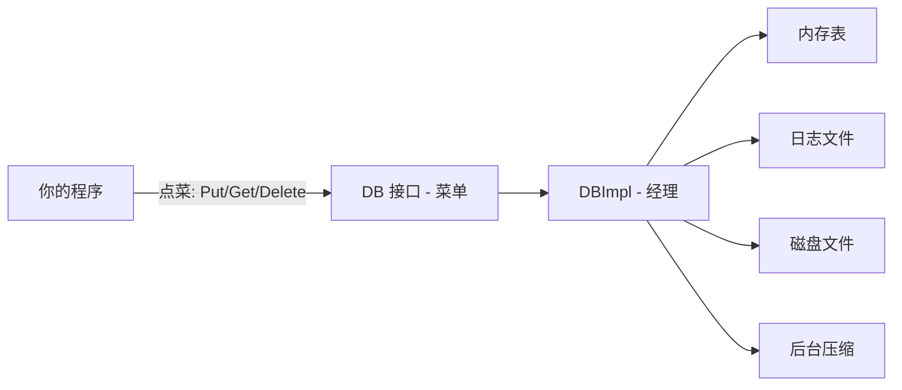
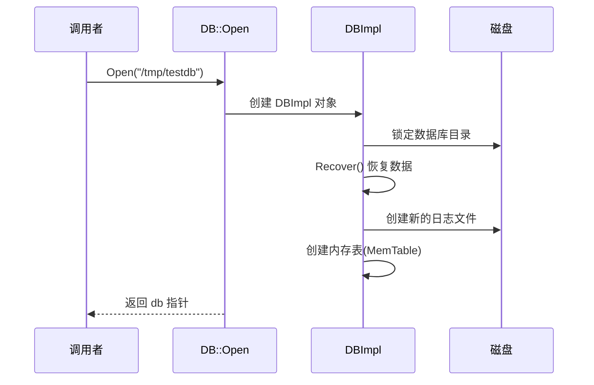
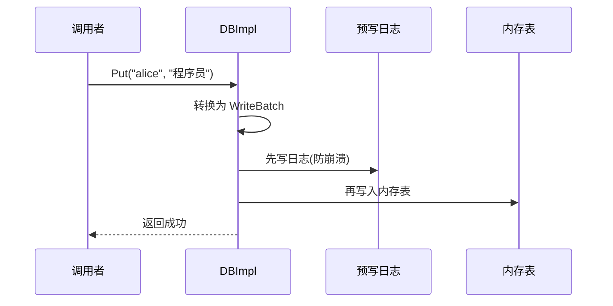
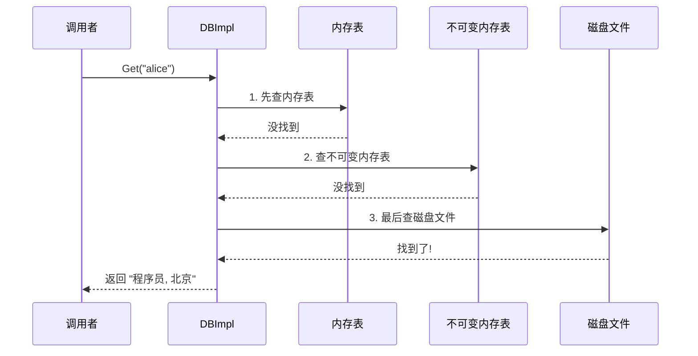

# Chapter 1: 数据库核心接口与实现 (DB / DBImpl)

## 你想存点东西？从这里开始！

想象一下，你正在开发一个应用程序，需要把用户的设置保存到磁盘上——比如用户名对应的个人信息。你希望能够**写入**、**读取**和**删除**这些数据，而且程序重启后数据还在。

这就是 LevelDB 要解决的问题：**一个快速、可靠的键值存储库**。

我们的核心用例非常简单：

```
写入：  "alice" → "程序员, 北京"
读取：  "alice" → 得到 "程序员, 北京"
删除：  "alice" → 数据被移除
```

而 `DB` 和 `DBImpl` 就是你和 LevelDB 打交道的**"大门"**。

## 餐厅经理的比喻

把 LevelDB 想象成一家餐厅：

- **`DB`** 是餐厅的**菜单**——它告诉你可以点什么菜（Put、Get、Delete 等操作）
- **`DBImpl`** 是餐厅的**经理**——你点完菜后，经理负责协调厨房里的所有人完成你的订单

作为顾客（调用者），你只需要看菜单点菜就行了，不用关心厨房里发生了什么。



## 两个关键概念

### 1. DB —— 抽象接口（菜单）

`DB` 是一个抽象类，定义了你能做的所有操作。打开 `include/leveldb/db.h`，你会看到：

```c++
class DB {
 public:
  static Status Open(const Options& options,
                     const std::string& name, DB** dbptr);
  virtual Status Put(...) = 0;
  virtual Status Get(...) = 0;
  virtual Status Delete(...) = 0;
  virtual Status Write(...) = 0;
  // ...其他方法
};
```

这里的 `= 0` 表示这些是**纯虚函数**——`DB` 本身不做任何事，它只是定义了"接口规范"。就像菜单只列出菜名，不负责做菜。

### 2. DBImpl —— 具体实现（经理）

`DBImpl` 继承自 `DB`，是**唯一**的实现。它真正干活——管理内存、磁盘文件和后台线程。

```c++
class DBImpl : public DB {
  // 实现了 DB 定义的所有操作
  Status Put(...) override;
  Status Get(...) override;
  Status Delete(...) override;
  // ...
};
```

`override` 关键字表示"我来实现菜单上的那道菜"。

## 实际使用：三步走

### 第一步：打开数据库

```c++
#include "leveldb/db.h"

leveldb::DB* db;
leveldb::Options options;
options.create_if_missing = true;  // 不存在就创建
leveldb::Status s = leveldb::DB::Open(
    options, "/tmp/testdb", &db);
```

这就像走进餐厅、找到座位。`DB::Open` 是一个静态方法，它会在内部创建一个 `DBImpl` 对象，然后通过 `db` 指针返回给你。

`Status` 是 LevelDB 的通用返回值，用来告诉你操作是否成功：

```c++
if (!s.ok()) {
  // 出错了！打印错误信息
  std::cerr << s.ToString() << std::endl;
}
```

### 第二步：读写数据

```c++
// 写入一条记录
s = db->Put(leveldb::WriteOptions(),
            "alice", "程序员, 北京");

// 读取一条记录
std::string value;
s = db->Get(leveldb::ReadOptions(), "alice", &value);
// value 现在是 "程序员, 北京"
```

写入就像点菜，读取就像问服务员"我的菜好了吗"。

```c++
// 删除一条记录
s = db->Delete(leveldb::WriteOptions(), "alice");
```

删除就像退菜。操作完成后，再次 Get 会返回 "NotFound" 状态。

### 第三步：关闭数据库

```c++
delete db;  // 关门打烊
```

简单地 `delete` 就行了。`DBImpl` 的析构函数会自动清理所有资源。

## 内部实现揭秘：打开数据库时发生了什么？

当你调用 `DB::Open()` 时，"经理"（DBImpl）需要完成一系列准备工作。让我们用一个序列图来展示：



让我们对照代码来看。在 `db/db_impl.cc` 中的 `DB::Open` 函数：

```c++
Status DB::Open(const Options& options,
                const std::string& dbname, DB** dbptr) {
  DBImpl* impl = new DBImpl(options, dbname);
  // ... 创建 DBImpl 实例
```

首先创建 `DBImpl` 实例。接着进行数据恢复：

```c++
  Status s = impl->Recover(&edit, &save_manifest);
```

`Recover` 会检查数据库目录是否存在，如果数据库是新的就创建初始文件，如果是旧的就从[预写日志 (Write-Ahead Log)](02_预写日志__write_ahead_log.md)中恢复未完成的数据。

然后创建新的日志文件和[内存表 (MemTable)](03_内存表__memtable.md)：

```c++
  if (s.ok() && impl->mem_ == nullptr) {
    // 创建新的日志文件和内存表
    impl->log_ = new log::Writer(lfile);
    impl->mem_ = new MemTable(...);
    impl->mem_->Ref();
  }
```

最后清理废弃文件并启动后台压缩任务：

```c++
  impl->RemoveObsoleteFiles();
  impl->MaybeScheduleCompaction();
```

## 内部实现揭秘：写入数据时发生了什么？

当你调用 `db->Put("alice", "程序员, 北京")` 时，实际上经历了以下步骤：



在 `db/db_impl.cc` 中，`Put` 实际上是对 `Write` 方法的封装：

```c++
Status DB::Put(const WriteOptions& opt,
               const Slice& key, const Slice& value) {
  WriteBatch batch;
  batch.Put(key, value);
  return Write(opt, &batch);
}
```

一条 `Put` 被包装成一个 `WriteBatch`，然后交给 `Write` 处理。这样设计的好处是：多个写入操作可以打包成一个批次，提高效率。

`Write` 方法中最核心的两步：

```c++
// 第一步：写入预写日志（保证数据不丢）
status = log_->AddRecord(...);
// 第二步：写入内存表（保证读取速度快）
status = WriteBatchInternal::InsertInto(write_batch, mem_);
```

先写日志再写内存，这个顺序非常重要！如果程序崩溃了，可以通过日志恢复数据。这就是[预写日志 (Write-Ahead Log)](02_预写日志__write_ahead_log.md)的作用。

## 内部实现揭秘：读取数据时发生了什么？

`Get` 操作会按优先级在三个地方查找数据：



对应的代码在 `db/db_impl.cc` 的 `DBImpl::Get` 中：

```c++
// 1. 先查活跃的内存表
if (mem->Get(lkey, value, &s)) {
  // 找到了！
} else if (imm != nullptr && imm->Get(lkey, value, &s)) {
  // 2. 查正在压缩的不可变内存表
} else {
  // 3. 最后查磁盘上的 SSTable 文件
  s = current->Get(options, lkey, value, &stats);
}
```

内存表是最新的数据，所以优先查找。这种分层查找的设计让读操作在大多数情况下都很快。

## DBImpl 的"管家清单"

DBImpl 内部维护了很多重要的成员变量，就像餐厅经理手中的管理清单：

| 成员变量 | 比喻 | 作用 |
|---------|------|------|
| `mem_` | 当前的记事本 | 活跃的[内存表 (MemTable)](03_内存表__memtable.md) |
| `imm_` | 写满的旧记事本 | 等待写入磁盘的不可变内存表 |
| `log_` | 安全日志 | [预写日志 (Write-Ahead Log)](02_预写日志__write_ahead_log.md)，防止数据丢失 |
| `versions_` | 档案管理员 | [版本管理 (Version / VersionSet)](08_版本管理__version___versionset.md)，追踪所有文件 |
| `table_cache_` | 常用菜谱缓存 | [LRU 缓存 (Cache)](07_lru_缓存__cache.md)，加速磁盘读取 |
| `mutex_` | 门锁 | 保证多线程安全 |

## 总结

在本章中，我们学习了：

1. **`DB`** 是 LevelDB 的抽象接口，定义了 `Open`、`Put`、`Get`、`Delete` 等操作
2. **`DBImpl`** 是 `DB` 的唯一实现，像一个"总调度中心"协调所有内部组件
3. **打开数据库**时，DBImpl 负责恢复数据、创建日志文件、初始化内存表
4. **写入数据**时，先写预写日志保安全，再写内存表保速度
5. **读取数据**时，按"内存表 → 不可变内存表 → 磁盘文件"的顺序逐层查找

你可能注意到了，写入时提到了"预写日志"——这是保证数据不丢失的关键机制。在下一章 [预写日志 (Write-Ahead Log)](02_预写日志__write_ahead_log.md) 中，我们将深入了解它是如何工作的！

---

Generated by [AI Codebase Knowledge Builder](https://github.com/The-Pocket/Tutorial-Codebase-Knowledge)