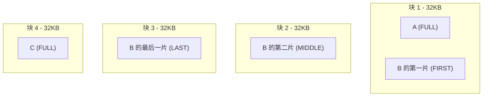
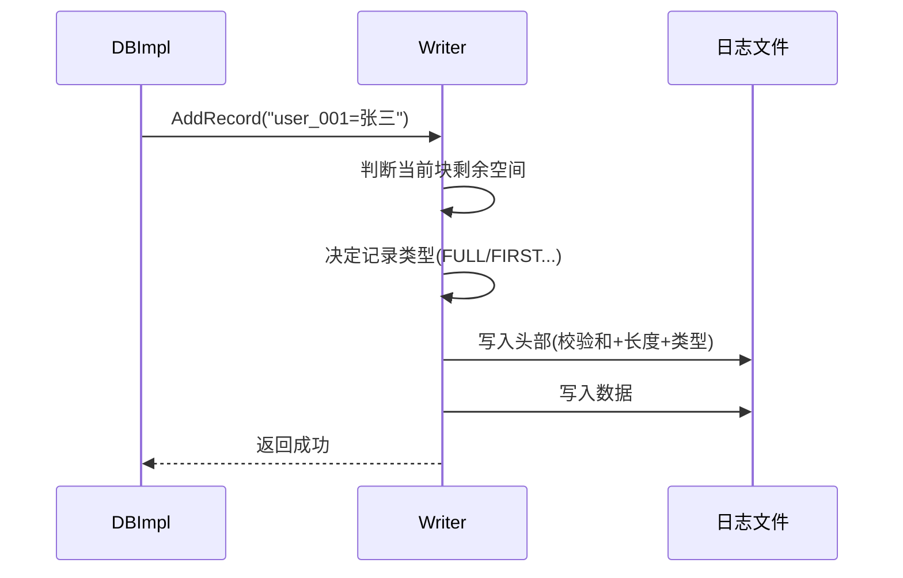
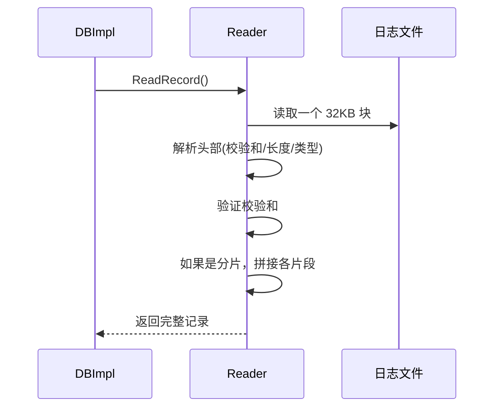
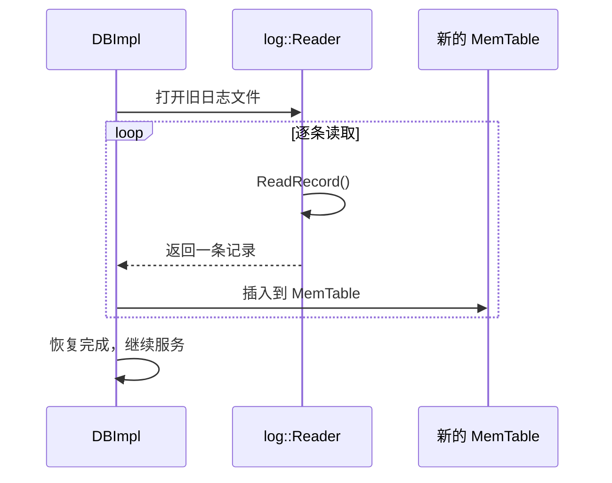

# Chapter 2: 预写日志 (Write-Ahead Log)

在上一章 [数据库核心接口与实现 (DB / DBImpl)](01_数据库核心接口与实现__db___dbimpl.md) 中，我们了解到写入数据时会**先写日志再写内存表**。你可能会好奇：为什么要多此一举先写一份日志呢？这一章，我们就来揭开预写日志（WAL）的神秘面纱。

## 为什么需要预写日志？

想象这样一个场景：

```
你正在往 LevelDB 中写入重要的用户数据：
  db->Put("user_001", "张三, VIP会员")
```

数据先写入了内存中的 [内存表 (MemTable)](03_内存表__memtable.md)——速度很快！但问题是：**内存中的数据断电就没了**。如果此时程序崩溃或机器断电，这条数据就永远丢失了。

这就像你在考试时只在草稿纸上写答案——老师收走了草稿纸（断电），你的答案就没了。

## 录音笔的比喻

预写日志就是你的**录音笔**：

- **草稿纸** = 内存表（MemTable）—— 写起来快，但容易丢
- **录音笔** = 预写日志（WAL）—— 同步记录在磁盘上，断电不丢

每次写数据时，LevelDB 的操作顺序是：

```
1. 先按下录音笔（写入磁盘上的日志文件）  ✅ 安全
2. 再在草稿纸上作答（写入内存表）          ✅ 快速
```

万一草稿纸丢了（程序崩溃），重启时只要**回放录音**（重放日志），就能恢复所有数据。这就是"预写"（Write-**Ahead**）的含义——**先写日志，后写内存**。


## 日志文件的物理结构

日志文件不是随意存放数据的——它有一套精心设计的格式。我们分两层来理解：**块（Block）** 和 **记录（Record）**。

### 第一层：块——32KB 的格子纸

日志文件被划分成一个个 **32KB 的块**，就像一本方格本，每页固定大小。

```c++
// db/log_format.h
static const int kBlockSize = 32768;  // 32KB
```

为什么要分块？因为分块后，如果文件中间损坏了，我们可以直接跳到下一个块的边界继续读取，不会丢失所有数据。就像书的某一页被撕了，翻到下一页还能继续读。

### 第二层：记录——块里的每条数据

每个块内存放若干条**记录**，每条记录的格式是：

```
| 校验和(4字节) | 长度(2字节) | 类型(1字节) | 数据(N字节) |
|--- 头部：共 7 字节 ---|                  |--- 实际数据 ---|
```

```c++
// db/log_format.h
// 头部 = 校验和(4) + 长度(2) + 类型(1) = 7 字节
static const int kHeaderSize = 4 + 2 + 1;
```

每个字段的作用：

| 字段 | 大小 | 作用 |
|------|------|------|
| 校验和 | 4 字节 | 验证数据是否损坏（类似快递包裹的验货码） |
| 长度 | 2 字节 | 这条记录的数据有多少字节 |
| 类型 | 1 字节 | 记录类型（完整的？还是片段？） |
| 数据 | N 字节 | 实际写入的内容 |

## 大记录怎么办？——分片机制

一条用户数据可能很大，大到一个 32KB 的块放不下。怎么办？**切片！**

就像搬家时一个大沙发过不了门，就把它拆成几部分分别搬进去。

```c++
// db/log_format.h
enum RecordType {
  kFullType = 1,    // 完整记录：一块就放下了
  kFirstType = 2,   // 第一个片段
  kMiddleType = 3,  // 中间片段
  kLastType = 4     // 最后一个片段
};
```

四种类型的含义：

- **FULL**：数据很小，一条记录就写完了（最常见）
- **FIRST**：大数据的开头部分
- **MIDDLE**：大数据的中间部分（可能有多个）
- **LAST**：大数据的最后部分

让我们用一个具体例子来说明。假设有三条用户数据要写入：

```
记录 A: 1000 字节（小）
记录 B: 97270 字节（很大！）
记录 C: 8000 字节（小）
```



记录 A 很小，直接用 FULL 类型存在块 1 中。记录 B 太大了，被切成三片分别放在块 1、2、3 中。记录 C 又用 FULL 类型存在块 4 中。

## 写入过程详解：Writer

现在让我们看看数据是如何一步步写入日志文件的。写入操作由 `log::Writer` 类完成。

### 整体流程

当 `DBImpl` 调用 `log_->AddRecord(data)` 时：



### AddRecord：核心写入方法

```c++
// db/log_writer.cc（简化版）
Status Writer::AddRecord(const Slice& slice) {
  const char* ptr = slice.data();
  size_t left = slice.size();  // 还剩多少没写
  bool begin = true;
```

首先获取要写入的数据指针和长度。`left` 记录还有多少字节没写完。

```c++
  do {
    const int leftover = kBlockSize - block_offset_;
    if (leftover < kHeaderSize) {
      // 当前块剩余空间连头部都放不下
      // 用零字节填充，切换到新块
      block_offset_ = 0;
    }
```

这里检查当前块还剩多少空间。如果剩下的空间连 7 字节的头部都放不下，就用零字节填满这个块的尾巴，然后跳到下一个新块。

```c++
    const size_t avail = kBlockSize - block_offset_ - kHeaderSize;
    const size_t fragment_length = (left < avail) ? left : avail;
```

`avail` 是当前块减去头部后的可用空间。如果数据量 `left` 小于可用空间，就全部写入；否则只写能放下的那部分。

```c++
    // 决定记录类型
    const bool end = (left == fragment_length);
    if (begin && end) type = kFullType;      // 一次写完
    else if (begin)   type = kFirstType;     // 第一片
    else if (end)     type = kLastType;      // 最后一片
    else              type = kMiddleType;    // 中间片段
```

通过 `begin`（是否是第一片）和 `end`（是否是最后一片）两个标志，巧妙地决定了记录类型。

```c++
    s = EmitPhysicalRecord(type, ptr, fragment_length);
    ptr += fragment_length;
    left -= fragment_length;
    begin = false;
  } while (s.ok() && left > 0);
```

写完一个片段后，移动指针，减少剩余量，继续循环直到所有数据写完。

### EmitPhysicalRecord：写入一条物理记录

```c++
// db/log_writer.cc（简化版）
Status Writer::EmitPhysicalRecord(RecordType t,
    const char* ptr, size_t length) {
  // 构造 7 字节的头部
  char buf[kHeaderSize];
  buf[4] = static_cast<char>(length & 0xff);   // 长度低位
  buf[5] = static_cast<char>(length >> 8);      // 长度高位
  buf[6] = static_cast<char>(t);                // 类型
```

先构造头部：把长度拆成两个字节存入，再存入记录类型。

```c++
  // 计算校验和（保护类型 + 数据）
  uint32_t crc = crc32c::Extend(type_crc_[t], ptr, length);
  crc = crc32c::Mask(crc);
  EncodeFixed32(buf, crc);  // 存入头部前4字节
```

计算 CRC32 校验和——这是数据的"指纹"。读取时可以用同样的算法重新计算，如果结果不一致，说明数据损坏了。

```c++
  // 写入：先写头部，再写数据
  Status s = dest_->Append(Slice(buf, kHeaderSize));
  if (s.ok()) {
    s = dest_->Append(Slice(ptr, length));
    if (s.ok()) s = dest_->Flush();
  }
  block_offset_ += kHeaderSize + length;
  return s;
}
```

最后依次写入头部和数据到文件，再调用 `Flush()` 确保数据真正落盘。`block_offset_` 记录当前块已写入了多少字节。

## 读取过程详解：Reader

写入是为了恢复。当 LevelDB 重启时，需要用 `log::Reader` 把日志中的记录一条条读出来。

### 整体流程



### ReadRecord：读取一条逻辑记录

`ReadRecord` 方法负责读取一条完整的用户记录。如果记录被切分成了多个片段，它会自动拼接。

```c++
// db/log_reader.cc（简化版）
bool Reader::ReadRecord(Slice* record, std::string* scratch) {
  scratch->clear();
  record->clear();
  bool in_fragmented_record = false;
```

`scratch` 是一个临时缓冲区，用于拼接分片的记录。`in_fragmented_record` 标记我们是否正在拼接一条大记录。

```c++
  while (true) {
    const unsigned int record_type = ReadPhysicalRecord(&fragment);
    switch (record_type) {
      case kFullType:
        // 完整记录，直接返回
        *record = fragment;
        return true;
```

如果读到的是 FULL 类型——太好了，一条完整的记录，直接返回！

```c++
      case kFirstType:
        // 大记录的开头，开始拼接
        scratch->assign(fragment.data(), fragment.size());
        in_fragmented_record = true;
        break;
      case kMiddleType:
        // 中间片段，追加到缓冲区
        scratch->append(fragment.data(), fragment.size());
        break;
```

遇到 FIRST 类型，说明一条大记录开始了，把这个片段存入 `scratch`。后续的 MIDDLE 片段则不断追加上去。

```c++
      case kLastType:
        // 最后一个片段，拼接完成，返回
        scratch->append(fragment.data(), fragment.size());
        *record = Slice(*scratch);
        return true;
    }
  }
}
```

当遇到 LAST 类型时，追加最后一个片段，整条记录就拼接完成了！

### ReadPhysicalRecord：读取一条物理记录

```c++
// db/log_reader.cc（简化版）
unsigned int Reader::ReadPhysicalRecord(Slice* result) {
  if (buffer_.size() < kHeaderSize) {
    // 缓冲区不够，读取新的 32KB 块
    file_->Read(kBlockSize, &buffer_, backing_store_);
  }
```

首先确保缓冲区里有足够的数据。如果不够，就从文件中读入新的一个 32KB 块。

```c++
  // 解析头部
  const char* header = buffer_.data();
  const uint32_t length = /* 从 header[4], header[5] 解码长度 */;
  const unsigned int type = header[6];
```

从缓冲区中取出头部的 7 个字节，解析出长度和类型。

```c++
  // 验证校验和
  if (checksum_) {
    uint32_t expected_crc = crc32c::Unmask(DecodeFixed32(header));
    uint32_t actual_crc = crc32c::Value(header + 6, 1 + length);
    if (actual_crc != expected_crc) {
      // 校验失败！数据损坏
      return kBadRecord;
    }
  }
```

这是最关键的安全检查——重新计算校验和，与存储的校验和对比。如果不一致，说明数据在磁盘上损坏了，这条记录会被跳过。

```c++
  // 提取数据，推进缓冲区位置
  *result = Slice(header + kHeaderSize, length);
  buffer_.remove_prefix(kHeaderSize + length);
  return type;
}
```

校验通过后，提取数据部分返回给调用者。

## 崩溃恢复：日志的使命

让我们回到最初的问题——日志是如何在崩溃后恢复数据的？

在 `DBImpl` 的 `Recover` 方法中（在 [数据库核心接口与实现 (DB / DBImpl)](01_数据库核心接口与实现__db___dbimpl.md) 中提到过），会执行如下流程：



简单来说就是：打开旧的日志文件 → 逐条读取记录 → 重新插入到新的内存表 → 数据恢复完毕！

这就是为什么 WAL 被称为 LevelDB 的"安全网"——无论什么时候崩溃，只要日志文件还在，数据就不会丢失。

## 总结

在本章中，我们学习了：

1. **为什么需要 WAL**：内存中的数据断电会丢，日志写在磁盘上保证安全
2. **日志文件的结构**：由 32KB 的块组成，每条记录包含校验和、长度、类型和数据
3. **分片机制**：大记录会被切分成 FIRST / MIDDLE / LAST 多个片段
4. **Writer 的写入流程**：判断剩余空间 → 决定记录类型 → 写入头部和数据
5. **Reader 的读取流程**：逐块读取 → 解析头部 → 验证校验和 → 拼接分片记录
6. **崩溃恢复**：重启时逐条重放日志，将数据恢复到内存表中

现在我们知道了数据是如何安全地写入日志的。但日志只是中转站——数据最终要进入内存表才能被快速查询。在下一章 [内存表 (MemTable)](03_内存表__memtable.md) 中，我们将了解数据在内存中是如何高效组织的！

---

Generated by [AI Codebase Knowledge Builder](https://github.com/The-Pocket/Tutorial-Codebase-Knowledge)