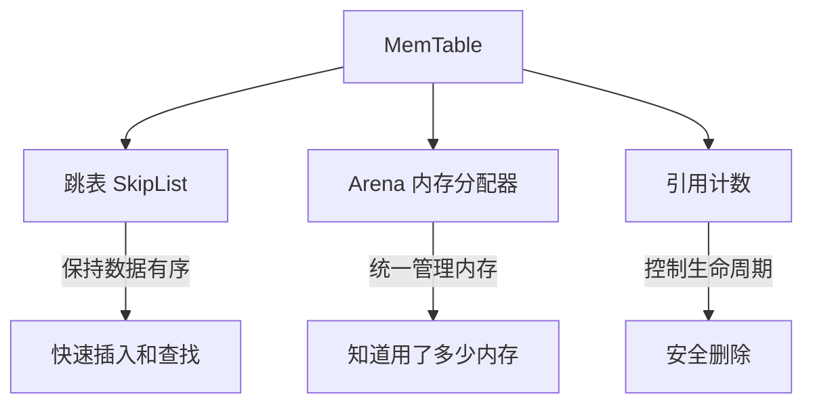
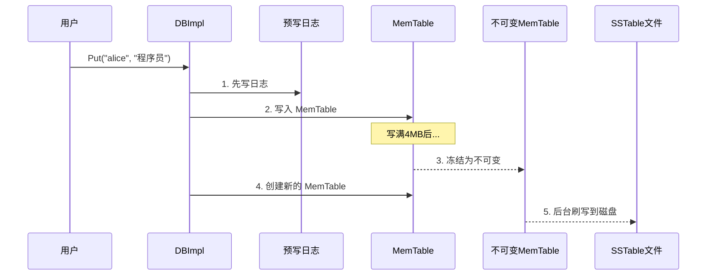
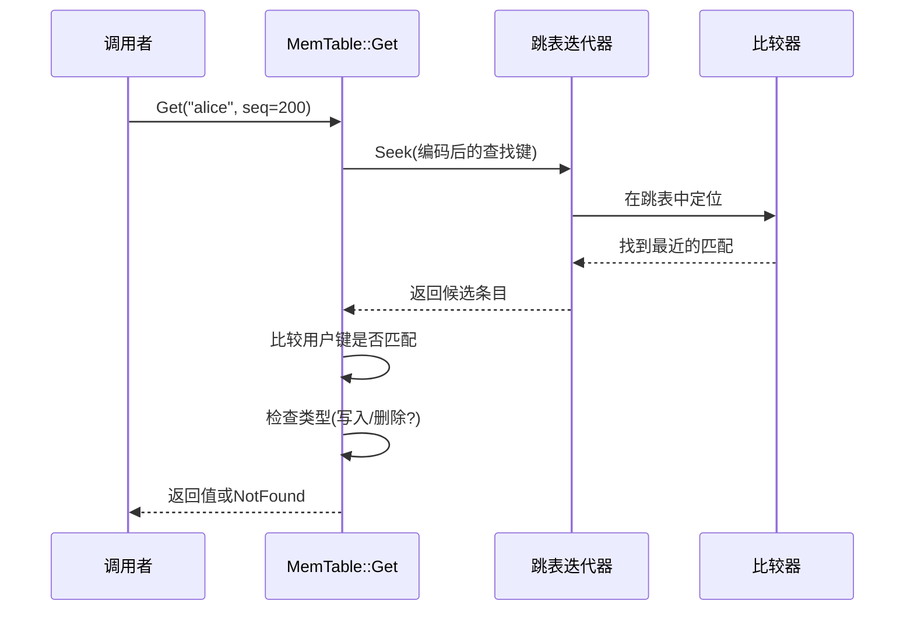
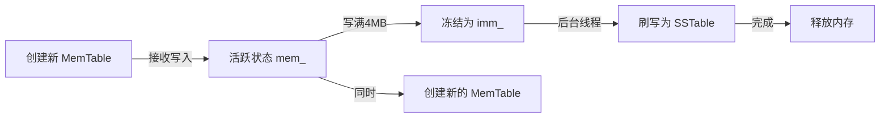

# Chapter 3: 内存表 (MemTable)

在上一章 [预写日志 (Write-Ahead Log)](02_预写日志__write_ahead_log.md) 中，我们了解到数据写入时会先记录到日志文件保证安全。但日志只是"录音"——真正让数据能被**快速查询**的，是本章的主角：**内存表（MemTable）**。

## 为什么需要内存表？

想象你正在运营一家快递站。每天会收到大量包裹，客户随时会来问："我的包裹到了吗？"

如果包裹一到就直接扔进仓库（磁盘），查找起来会很慢——你得翻遍整个仓库。更聪明的做法是：

```
1. 包裹到达后，先按编号顺序摆在前台货架上（内存表）
2. 客户来取件？在货架上按编号快速定位！
3. 货架满了？把货架上的包裹整理好搬进仓库（写入磁盘）
```

**MemTable 就是这个"前台货架"**——一个在内存中**有序存放**键值对的数据结构。

我们的核心用例：

```
写入：db->Put("alice", "程序员")   → 数据进入 MemTable
写入：db->Put("bob", "设计师")     → 数据进入 MemTable
查找：db->Get("alice")             → 从 MemTable 中快速找到！
```

## 三个关键概念

MemTable 虽然本质上就是"内存里的有序表"，但它有三个重要组成部分值得了解：



### 1. 跳表（SkipList）—— 数据的"有序书架"

跳表是 MemTable 内部存储数据的核心结构。你可以把它想象成**一本带索引的字典**。

普通链表查找一个单词需要从头到尾一个个翻，很慢（O(n)）。而跳表加了多层"快捷通道"，可以快速跳过大量节点。

```
第3层:  头 ---------> "dog" -----------------------> 尾
第2层:  头 ---------> "dog" ---------> "fox" ------> 尾
第1层:  头 -> "alice" -> "bob" -> "dog" -> "fox" --> 尾
```

查找 "fox" 时：从最高层开始，跳过 "alice"、"bob"，快速定位到附近，再往下层精确查找。平均时间复杂度是 **O(log n)**——跟二叉搜索树一样快！

### 2. Arena 内存分配器 —— 统一的"物资仓库"

MemTable 中的所有数据都通过 Arena 来分配内存。Arena 的好处是：
- **分配快**：预先申请大块内存，小分配直接从中切割
- **统计方便**：可以随时知道总共用了多少内存
- **释放简单**：MemTable 销毁时，Arena 一次性释放所有内存

### 3. 引用计数 —— "借书证"

MemTable 用引用计数管理生命周期。有人在用就不能删，所有人都用完了才删除。这在多线程环境下特别重要。

## 如何使用 MemTable？

虽然用户不会直接操作 MemTable（它是 DBImpl 内部使用的），但了解它的接口有助于理解整体流程。

### 创建和引用

```c++
// 创建 MemTable
MemTable* mem = new MemTable(comparator);
// 增加引用计数（"我要用了！"）
mem->Ref();
```

创建时需要传入一个比较器，用于决定键的排列顺序。`Ref()` 表示"我正在使用这个 MemTable"。

### 写入数据

```c++
// 添加一条记录
mem->Add(sequence_number,   // 序列号（版本号）
         kTypeValue,        // 类型：写入
         "alice",           // 键
         "程序员, 北京");    // 值
```

`Add` 方法接收四个参数：序列号（每次写操作递增）、操作类型（写入或删除）、键和值。数据会被自动插入到跳表中的正确位置。

### 查找数据

```c++
std::string value;
Status s;
// 构造查找键
LookupKey lkey("alice", sequence_number);
// 在 MemTable 中查找
if (mem->Get(lkey, &value, &s)) {
  // 找到了！value = "程序员, 北京"
}
```

`Get` 方法会在跳表中查找指定的键。如果找到了，返回 `true` 并把值写入 `value`。

### 检查内存使用量

```c++
size_t usage = mem->ApproximateMemoryUsage();
// 如果超过 4MB，该"搬家"了！
```

当使用量超过阈值（默认 4MB），DBImpl 就会把这个 MemTable 冻结，并创建一个新的。

### 释放

```c++
mem->Unref();  // "我用完了！"
// 如果没有其他人在用，MemTable 会自动删除
```

## MemTable 在整体写入流程中的位置

让我们回顾一下第一章的写入流程，看看 MemTable 扮演什么角色：



MemTable 就是写入流水线中的**核心中转站**——数据从这里进，积累到一定量后整理写出。

## 内部实现揭秘：数据是怎么编码的？

当你调用 `mem->Add(seq, type, key, value)` 时，数据并不是原样存储的。LevelDB 会把它们编码成一种紧凑的格式。

### 条目的编码格式

每条数据在内存中的布局如下：

```
| key长度 | 用户key | 序列号+类型(8字节) | value长度 | value数据 |
|varint32 | N字节   |       uint64       | varint32  |  M字节    |
```

这里有两个重要的细节：
- **varint32**：变长整数编码，小数字只用 1 字节，节省空间
- **序列号+类型**被打包成一个 8 字节整数：`(序列号 << 8) | 类型`

### Add 方法的实现

让我们逐步看 `Add` 方法是如何编码数据的。

```c++
// db/memtable.cc
size_t key_size = key.size();
size_t val_size = value.size();
size_t internal_key_size = key_size + 8; // 用户key + 8字节tag
```

首先计算各部分的大小。内部键 = 用户键 + 8 字节的序列号/类型标签。

```c++
// 计算总编码长度并分配内存
const size_t encoded_len = 
    VarintLength(internal_key_size) + internal_key_size +
    VarintLength(val_size) + val_size;
char* buf = arena_.Allocate(encoded_len);
```

通过 Arena 一次性分配所需的全部内存。

```c++
// 编码内部键长度 + 复制用户key
char* p = EncodeVarint32(buf, internal_key_size);
std::memcpy(p, key.data(), key_size);
p += key_size;
```

先写入内部键的长度（varint32 编码），再复制用户键的原始字节。

```c++
// 编码序列号和类型
EncodeFixed64(p, (s << 8) | type);
p += 8;
// 编码 value 长度 + 复制 value
p = EncodeVarint32(p, val_size);
std::memcpy(p, value.data(), val_size);
```

把序列号左移 8 位与类型合并成一个 64 位整数，再写入 value 的长度和数据。

```c++
// 插入跳表
table_.Insert(buf);
```

最后，把编码好的数据插入跳表。跳表会根据键的比较结果自动放到正确的位置。

### 一个具体的例子

假设我们插入 `Add(100, kTypeValue, "alice", "程序员")`，编码后的内存布局：

```
[0D]                    ← key长度: 13 (5+"alice" + 8)
[61 6C 69 63 65]        ← "alice" 的 ASCII
[00 00 00 00 00 64 01]  ← 序列号100 + 类型1(kTypeValue)
[09]                    ← value长度: 9 ("程序员"的UTF-8)
[E7 A8 8B E5 BA 8F E5 91 98]  ← "程序员" 的 UTF-8 字节
```

## 内部实现揭秘：查找是怎么工作的？

### Get 方法的流程



### Get 方法的代码实现

```c++
// db/memtable.cc
bool MemTable::Get(const LookupKey& key,
                   std::string* value, Status* s) {
  Slice memkey = key.memtable_key();
  Table::Iterator iter(&table_);
  iter.Seek(memkey.data());
```

首先构造一个跳表迭代器，用编码后的查找键去定位。`Seek` 会找到第一个**大于或等于**查找键的位置。

```c++
  if (iter.Valid()) {
    // 解析找到的条目
    const char* entry = iter.key();
    uint32_t key_length;
    const char* key_ptr = 
        GetVarint32Ptr(entry, entry + 5, &key_length);
```

如果迭代器有效（找到了候选条目），就开始解析它——先读出键的长度。

```c++
    // 比较用户键是否匹配
    if (comparator_.comparator.user_comparator()->Compare(
            Slice(key_ptr, key_length - 8),
            key.user_key()) == 0) {
```

这里取出用户键部分（总长度减去 8 字节的标签），与查找的键进行比较。注意这里只比较**用户键**，不比较序列号。

```c++
      // 键匹配！检查操作类型
      const uint64_t tag = 
          DecodeFixed64(key_ptr + key_length - 8);
      switch (static_cast<ValueType>(tag & 0xff)) {
        case kTypeValue:    // 是写入操作
          // 提取 value 并返回
          Slice v = GetLengthPrefixedSlice(
              key_ptr + key_length);
          value->assign(v.data(), v.size());
          return true;
        case kTypeDeletion: // 是删除操作
          *s = Status::NotFound(Slice());
          return true;
      }
```

从标签的低 8 位提取操作类型。如果是 `kTypeValue`（写入），就提取并返回 value；如果是 `kTypeDeletion`（删除），就返回 NotFound。

这是一个很巧妙的设计——**删除操作也是写入一条记录**，只是类型标记为"已删除"。

## MemTable 的生命周期：从活跃到冻结

MemTable 有一个有趣的"一生"：



在 `DBImpl` 中，这两个变量管理着 MemTable 的生命周期：

| 变量 | 角色 | 状态 |
|------|------|------|
| `mem_` | 当前活跃的 MemTable | 接收新的写入 |
| `imm_` | 不可变的 MemTable | 等待刷写到磁盘，只读 |

当 `mem_` 写满后，它会被"冻结"——赋值给 `imm_`，然后创建一个新的 `mem_`。被冻结的 `imm_` 不再接受写入，后台线程会把它的数据写成磁盘上的 [有序表文件 (SSTable / Table)](05_有序表文件__sstable___table.md)。

## 跳表的核心操作：插入

跳表是 MemTable 的"引擎"，让我们看看数据是如何被插入的。

### 随机高度

每个新节点插入时，跳表会用**随机函数**决定节点的层数：

```c++
// db/skiplist.h
int SkipList::RandomHeight() {
  static const unsigned int kBranching = 4;
  int height = 1;
  while (height < kMaxHeight && rnd_.OneIn(kBranching)) {
    height++;
  }
  return height;
}
```

每次有 1/4 的概率增加一层，最高 12 层。这意味着大多数节点只有 1 层，少数节点有多层——形成了"金字塔"般的层次结构。

### 插入过程

```c++
// db/skiplist.h（简化版）
void SkipList::Insert(const Key& key) {
  Node* prev[kMaxHeight]; // 每层的前驱节点
  // 找到插入位置，同时记录每层的前驱
  Node* x = FindGreaterOrEqual(key, prev);
```

先从最高层开始向下搜索，找到每一层中应该插在哪个节点后面。

```c++
  int height = RandomHeight();
  // 创建新节点
  x = NewNode(key, height);
  // 在每一层中链接新节点
  for (int i = 0; i < height; i++) {
    x->SetNext(i, prev[i]->Next(i));
    prev[i]->SetNext(i, x);
  }
}
```

创建新节点后，在每一层中把新节点"插入"到前驱和后继之间——就像在一串珠子中间穿入一颗新珠子。

用一个直观的例子来说明。插入 "cat" 到已有的跳表中（假设随机高度为 2）：

```
插入前：
第2层:  头 ---------> "dog" ---------> 尾
第1层:  头 -> "alice" -> "bob" -> "dog" -> "fox" -> 尾

插入后：
第2层:  头 ---------> "cat" -> "dog" ---------> 尾
第1层:  头 -> "alice" -> "bob" -> "cat" -> "dog" -> "fox" -> 尾
```

"cat" 按字母顺序被放在了 "bob" 和 "dog" 之间，同时在第 2 层也建立了快捷通道。

## Arena 内存分配器：幕后英雄

Arena 采用"预分配大块、小块从中切割"的策略：

```c++
// util/arena.cc
static const int kBlockSize = 4096; // 每次预分配 4KB
```

```c++
// util/arena.h（内联快速路径）
char* Arena::Allocate(size_t bytes) {
  if (bytes <= alloc_bytes_remaining_) {
    // 当前块还有空间，直接切一块
    char* result = alloc_ptr_;
    alloc_ptr_ += bytes;
    alloc_bytes_remaining_ -= bytes;
    return result;
  }
  return AllocateFallback(bytes);  // 不够了，申请新块
}
```

就像从一条长面包上切片——如果面包还够长就直接切，不够了就拿一条新面包。这比每次都单独 `new` 一块内存要**快得多**。

`ApproximateMemoryUsage()` 正是通过 Arena 的 `MemoryUsage()` 来报告内存使用量，这让 DBImpl 知道何时该冻结当前 MemTable。

## 总结

在本章中，我们学习了：

1. **MemTable 是什么**：LevelDB 的"写入缓冲区"，数据先写入这里，保持有序
2. **跳表（SkipList）**：MemTable 的核心数据结构，支持 O(log n) 的插入和查找
3. **数据编码**：每条记录被编码为 `key长度 + key + 序列号/类型 + value长度 + value`
4. **查找机制**：通过跳表定位，然后判断操作类型（写入返回值，删除返回 NotFound）
5. **生命周期**：活跃 → 写满冻结（变为不可变 MemTable）→ 后台刷写到磁盘 → 释放
6. **Arena 分配器**：高效管理内存，方便统计使用量和批量释放

MemTable 中的数据最终会被刷写成磁盘上的文件。这些文件由一个个**数据块**组成，而数据块是怎么构建和读取的呢？在下一章 [数据块与块构建器 (Block / BlockBuilder)](04_数据块与块构建器__block___blockbuilder.md) 中，我们将一探究竟！

---

Generated by [AI Codebase Knowledge Builder](https://github.com/The-Pocket/Tutorial-Codebase-Knowledge)