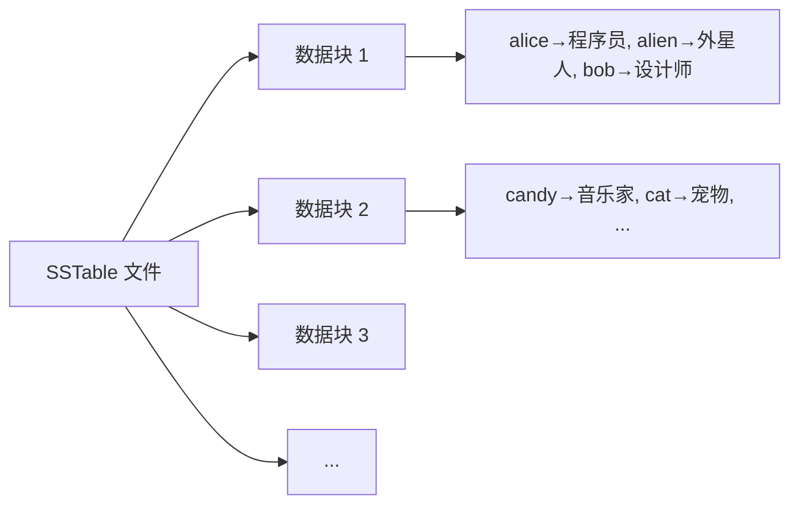
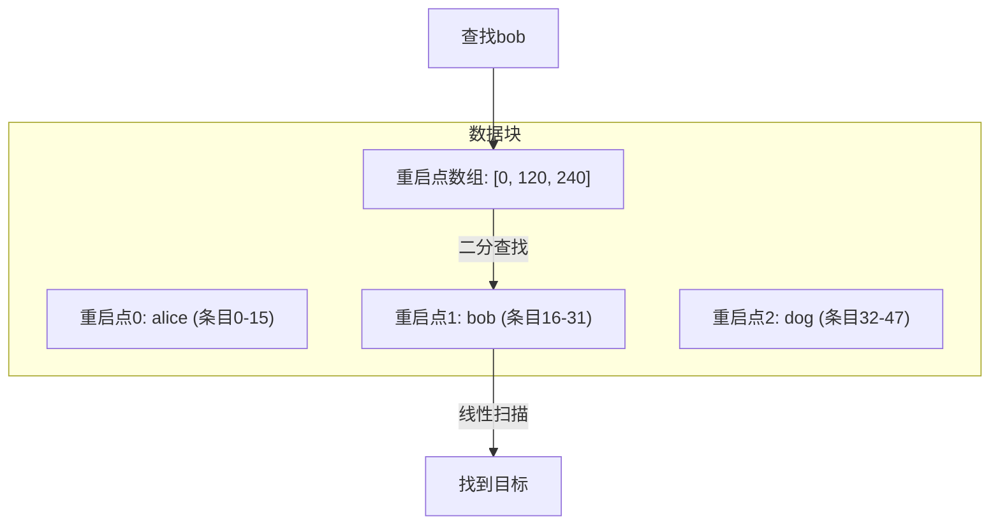
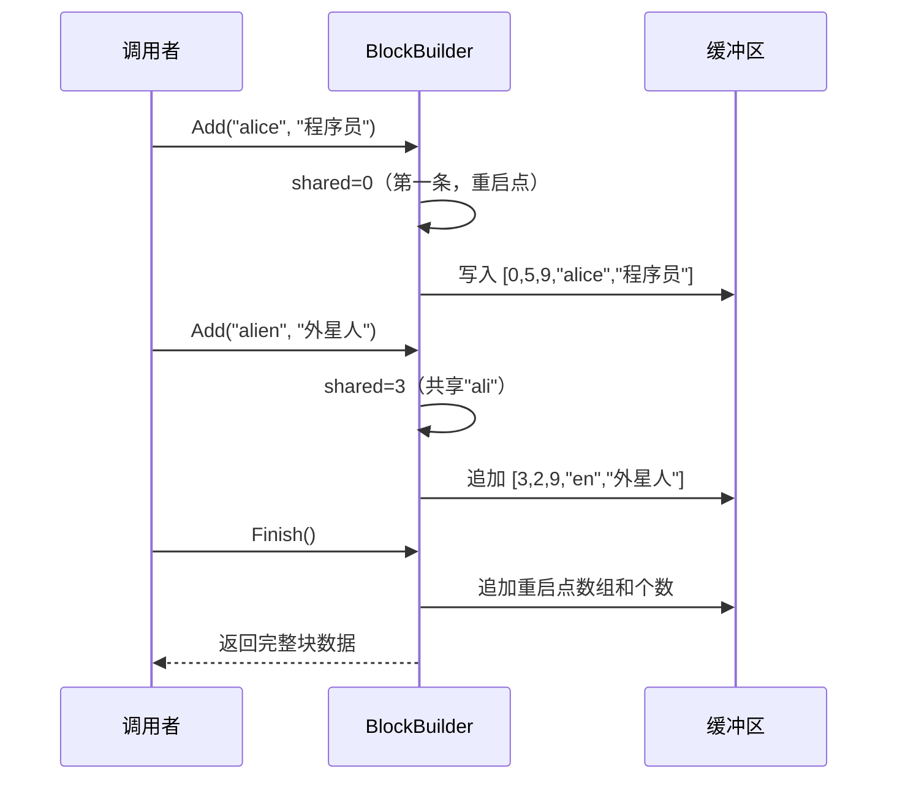
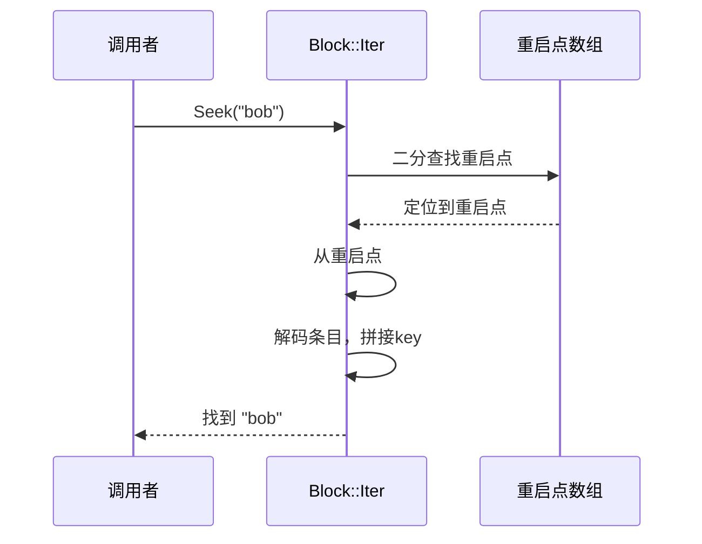
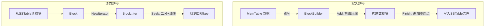

# Chapter 4: 数据块与块构建器 (Block / BlockBuilder)

在上一章 [内存表 (MemTable)](03_内存表__memtable.md) 中，我们了解到当 MemTable 写满后，数据会被刷写到磁盘上的 [有序表文件 (SSTable / Table)](05_有序表文件__sstable___table.md)。但一个 SSTable 文件可能有好几 MB——不可能每次查询都把整个文件读进内存。那怎么办呢？

答案是：**把文件切成一个个小块！**

## 解决什么问题？

假设 MemTable 中积累了以下数据，准备刷写到磁盘：

```
"alice"   → "程序员"
"alien"   → "外星人"
"bob"     → "设计师"
"candy"   → "音乐家"
```

如果把这些数据一股脑写成一大坨，查找 `"bob"` 时要从头读到尾——太慢了。

LevelDB 的解决方案是：将数据组织成一个个约 **4KB** 的**数据块（Block）**。每个块内部自带索引，可以快速定位到目标 key。

这就像一本厚厚的字典被分成很多"页"，每页内容紧凑排列，页头有标记方便快速翻阅。



## 两个核心角色

| 角色 | 职责 | 比喻 |
|------|------|------|
| **BlockBuilder** | 把 key-value 对打包成一个块 | 往箱子里装东西的"打包工" |
| **Block** | 从打包好的块中读取数据 | 从箱子里找东西的"查找员" |

写入时用 BlockBuilder 构建块，读取时用 Block 解析块。接下来我们分别了解。

## 关键概念一：前缀压缩

观察上面的数据，`"alice"` 和 `"alien"` 共享前缀 `"ali"`。如果每条记录都完整存储 key，会浪费不少空间。

**前缀压缩**的思想：只存与前一条记录**不同的部分**。

```
第1条: shared=0, key="alice"     → 完整存储
第2条: shared=3, key="en"        → 与"alice"共享前3字节"ali"，只存"en"
```

拼起来：`"ali"` + `"en"` = `"alien"` ✅

这就像记笔记时的省略写法：
- 第1条：北京市海淀区中关村
- 第2条：〃　　朝阳区三里屯（只写不同的部分）

## 关键概念二：重启点

前缀压缩有一个问题：如果要找第 100 条记录，必须从第 1 条开始逐条解码——因为每条都依赖前一条。

解决方案：每隔几条（默认 16 条），设置一个**重启点**。重启点处的 key 不做压缩，完整存储。

```
条目0:  shared=0, "alice"    ← 重启点 #0
条目1:  shared=3, "en"
...
条目16: shared=0, "bob"      ← 重启点 #1（完整key，重新开始）
条目17: shared=2, "nny"
...
```

块的尾部存储所有重启点的偏移位置，查找时可以**先对重启点二分查找**，再在小范围内线性扫描。



## 块的完整结构

一个数据块的内存布局如下：

```
| 条目1 | 条目2 | ... | 条目N | 重启点数组 | 重启点个数 |
|---------- 数据区 ----------|--- 索引区 ---|-- 4字节 --|
```

每条条目的格式：

```
| shared(varint) | non_shared(varint) | value_len(varint) | key差异部分 | value |
```

- `shared`: 与前一个 key 共享的字节数
- `non_shared`: 不共享的字节数
- `value_len`: value 的长度
- `key差异部分`: key 中不同于前一个 key 的部分
- `value`: 完整的 value 数据

## 使用 BlockBuilder 构建块

让我们看看"打包工"是怎么工作的。

### 创建并添加数据

```c++
Options options;
options.block_restart_interval = 2; // 每2条设一个重启点
BlockBuilder builder(&options);

builder.Add("alice", "程序员");
builder.Add("alien", "外星人");
builder.Add("bob",   "设计师");
```

`block_restart_interval` 设为 2，意味着每 2 条记录就设置一个新的重启点。

### 完成构建

```c++
Slice block_data = builder.Finish(); 
// block_data 现在包含了完整的块数据
// 可以写入文件了
```

`Finish()` 会把重启点数组追加到数据末尾，返回整块数据。

### 构建结果长什么样？

以上面三条数据为例，构建后的结果（概念图）：

```
[0,"alice","程序员"]  ← 重启点#0，shared=0
[3,"en","外星人"]     ← shared=3（与alice共享"ali"）
[0,"bob","设计师"]    ← 重启点#1，shared=0（新的重启点）
[偏移0, 偏移X]       ← 重启点数组（两个重启点的位置）
[2]                   ← 重启点个数
```

## BlockBuilder 内部实现

### Add 方法：添加一条记录

这是 BlockBuilder 的核心方法。让我们逐步拆解。

**第一步：决定是否设置重启点**

```c++
// table/block_builder.cc
size_t shared = 0;
if (counter_ < options_->block_restart_interval) {
  // 还没到重启间隔，计算共享前缀
  const size_t min_length = std::min(last_key_.size(), key.size());
  while (shared < min_length && last_key_[shared] == key[shared])
    shared++;
} else {
  // 到了！设置新的重启点
  restarts_.push_back(buffer_.size());
  counter_ = 0;
}
```

`counter_` 记录自上次重启点以来添加了多少条。达到间隔值（默认16）就设新重启点，此时 `shared = 0`，key 完整存储。

**第二步：写入编码数据**

```c++
PutVarint32(&buffer_, shared);       // 共享字节数
PutVarint32(&buffer_, non_shared);   // 非共享字节数
PutVarint32(&buffer_, value.size()); // value长度
buffer_.append(key.data() + shared, non_shared); // key差异部分
buffer_.append(value.data(), value.size());       // value
```

三个长度用 varint32 编码（省空间），然后追加 key 的差异部分和完整的 value。

**第三步：更新状态**

```c++
last_key_.resize(shared);
last_key_.append(key.data() + shared, non_shared);
counter_++;
```

保存当前 key 作为下一条的比较基准，计数器加一。

### Finish 方法：封装块

```c++
Slice BlockBuilder::Finish() {
  // 追加重启点数组
  for (size_t i = 0; i < restarts_.size(); i++) {
    PutFixed32(&buffer_, restarts_[i]);
  }
  // 追加重启点个数
  PutFixed32(&buffer_, restarts_.size());
  finished_ = true;
  return Slice(buffer_);
}
```

把所有重启点的偏移量（每个 4 字节）追加到缓冲区末尾，最后追加重启点的个数。整个块就完成了。

### 完整的构建流程



## 使用 Block 读取数据

块写入磁盘后，读取时需要用 Block 类来解析。

### 创建 Block 并获取迭代器

```c++
// 从文件中读取到的块内容
BlockContents contents;
contents.data = block_data;

Block block(contents);
Iterator* iter = block.NewIterator(comparator);
```

Block 构造时会解析块尾部，找到重启点数组的位置。然后通过 `NewIterator` 创建一个 [迭代器体系 (Iterator)](06_迭代器体系__iterator.md) 来遍历数据。

### 查找和遍历

```c++
// 查找 "alien"
iter->Seek("alien");
if (iter->Valid()) {
  // iter->key() == "alien"
  // iter->value() == "外星人"
}

// 遍历所有条目
for (iter->SeekToFirst(); iter->Valid(); iter->Next()) {
  // 依次访问 alice, alien, bob...
}
```

## Block 内部实现：构造函数

Block 构造时需要定位重启点数组的位置。

```c++
// table/block.cc
Block::Block(const BlockContents& contents)
    : data_(contents.data.data()),
      size_(contents.data.size()) {
  // 块的最后4字节 = 重启点个数
  uint32_t num_restarts = DecodeFixed32(
      data_ + size_ - sizeof(uint32_t));
  // 重启点数组的起始位置
  restart_offset_ = size_ - (1 + num_restarts) * sizeof(uint32_t);
}
```

从块尾部读出重启点个数，再向前推算出重启点数组的起始偏移。这样后续查找时就能直接访问重启点了。

## Block::Iter 内部实现：Seek 查找

Seek 是最重要的操作——它展示了"重启点 + 前缀压缩"如何配合实现高效查找。

### 整体流程



### 第一步：二分查找重启点

```c++
// table/block.cc - Seek 方法（简化）
uint32_t left = 0;
uint32_t right = num_restarts_ - 1;
while (left < right) {
  uint32_t mid = (left + right + 1) / 2;
  uint32_t region_offset = GetRestartPoint(mid);
  // 解码重启点处的key（shared必为0）
  const char* key_ptr = DecodeEntry(
      data_ + region_offset, ...);
  Slice mid_key(key_ptr, non_shared);
  if (Compare(mid_key, target) < 0) {
    left = mid;   // 目标在右边
  } else {
    right = mid - 1; // 目标在左边或就是这里
  }
}
```

这段代码在重启点数组上做标准的二分查找。因为重启点的 `shared = 0`，key 是完整的，可以直接比较——这就是重启点存在的意义！

### 第二步：线性扫描

```c++
// 定位到找到的重启点
SeekToRestartPoint(left);
// 从这个重启点开始逐条扫描
while (true) {
  if (!ParseNextKey()) return;
  if (Compare(key_, target) >= 0) return; // 找到了！
}
```

从二分查找确定的重启点开始，逐条解码，直到找到第一个 >= 目标的 key。

### ParseNextKey：解码一条记录

这是将前缀压缩还原为完整 key 的核心逻辑。

```c++
// table/block.cc（简化）
bool Block::Iter::ParseNextKey() {
  // 解码三个长度字段
  uint32_t shared, non_shared, value_length;
  p = DecodeEntry(p, limit, &shared, &non_shared, &value_length);
  
  // 还原完整key：保留前shared字节 + 追加新的non_shared字节
  key_.resize(shared);
  key_.append(p, non_shared);
  
  // 提取value
  value_ = Slice(p + non_shared, value_length);
  return true;
}
```

`key_.resize(shared)` 保留与前一条共享的前缀部分，`key_.append(p, non_shared)` 追加新的差异部分。这样就还原出了完整的 key。

让我们用一个例子走一遍：

```
存储的数据：
  条目0: shared=0, non_shared=5, "alice"
  条目1: shared=3, non_shared=2, "en"

解码条目0: key = "" + "alice" = "alice"  ✅
解码条目1: key = "ali"(保留前3字节) + "en" = "alien"  ✅
```

## DecodeEntry：快速解析的小技巧

LevelDB 在解析条目头部时有一个巧妙的优化。

```c++
// table/block.cc
static inline const char* DecodeEntry(const char* p, ...) {
  *shared = reinterpret_cast<const uint8_t*>(p)[0];
  *non_shared = reinterpret_cast<const uint8_t*>(p)[1];
  *value_length = reinterpret_cast<const uint8_t*>(p)[2];
  if ((*shared | *non_shared | *value_length) < 128) {
    // 快速路径：三个值都小于128，各只用1字节
    p += 3;
  } else {
    // 慢速路径：用varint解码
    // ...
  }
  return p;
}
```

大多数情况下，三个长度值都很小（< 128），每个只需 1 字节。通过位运算 `|` 一次性判断，避免了三次 varint 解码——这是一个典型的**快速路径**优化。

## 整体流程总结

让我们用一张图回顾 Block 和 BlockBuilder 在数据生命周期中的角色：



## 总结

在本章中，我们学习了：

1. **Block 是什么**：SSTable 文件中的基本 I/O 单元，通常约 4KB，像字典中的一"页"
2. **前缀压缩**：相邻 key 共享前缀，只存储差异部分，大幅减少存储空间
3. **重启点**：每隔若干条设置一个完整 key 的"锚点"，支持二分查找
4. **BlockBuilder**：负责构建块——添加 key-value 对，管理前缀压缩和重启点，最后封装成完整块
5. **Block::Iter**：读取时先二分查找重启点定位范围，再线性扫描找到目标 key
6. **快速路径优化**：利用位运算一次判断三个长度值是否都小于 128，加速解码

数据块是 SSTable 的"砖块"。那么这些砖块是如何被组装成一个完整的 SSTable 文件的呢？在下一章 [有序表文件 (SSTable / Table)](05_有序表文件__sstable___table.md) 中，我们将看到完整的文件结构！

---

Generated by [AI Codebase Knowledge Builder](https://github.com/The-Pocket/Tutorial-Codebase-Knowledge)