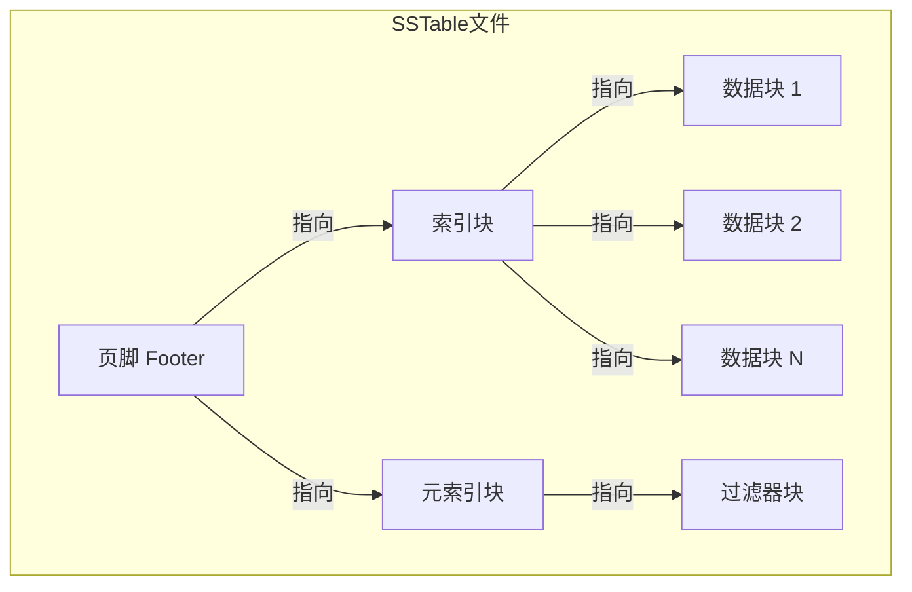
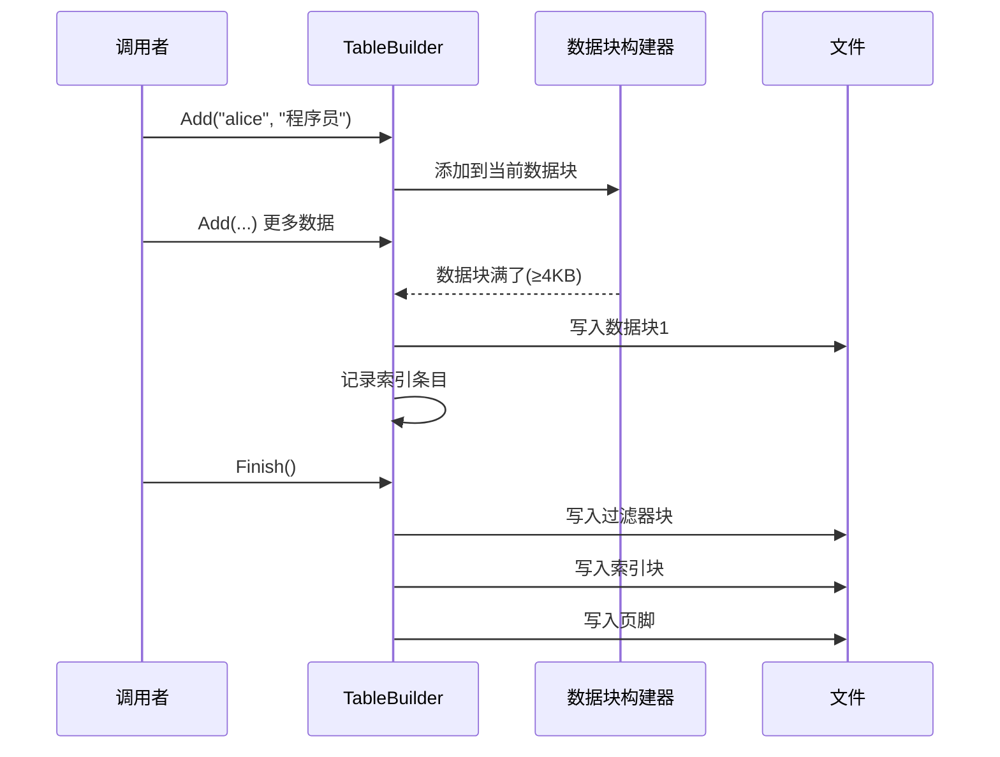
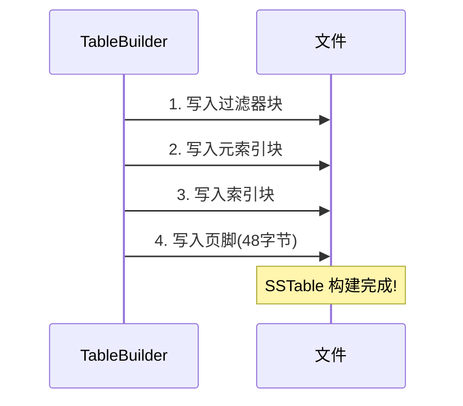
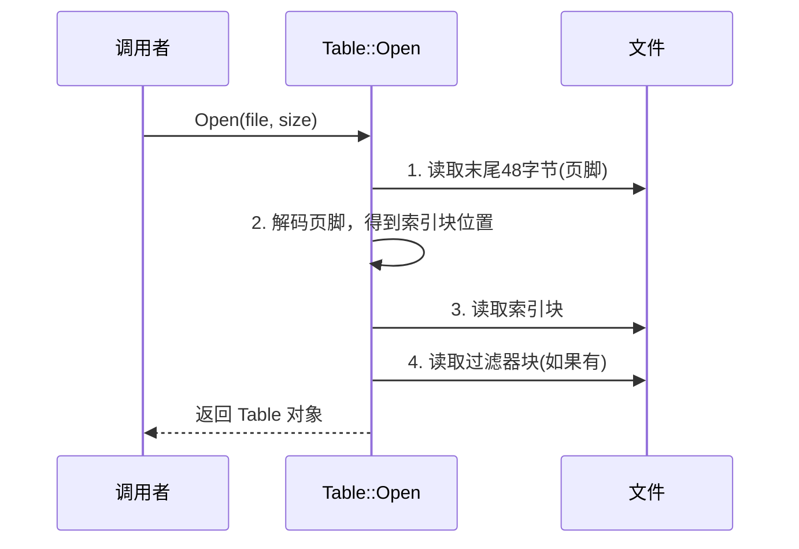
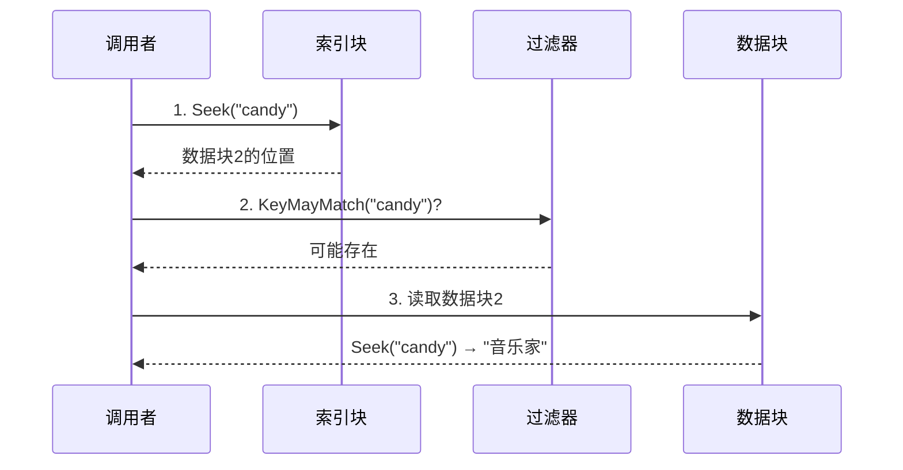
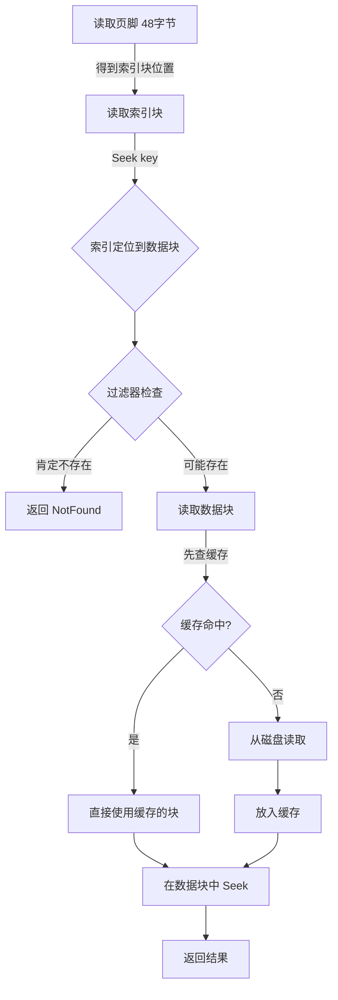

# Chapter 5: 有序表文件 (SSTable / Table)

在上一章 [数据块与块构建器 (Block / BlockBuilder)](04_数据块与块构建器__block___blockbuilder.md) 中，我们学习了 SSTable 文件中的"砖块"——数据块是如何构建和读取的。但一堆砖块还不是一栋房子。本章，我们就来看看这些砖块是如何被组装成一个完整的 **SSTable 文件**的。

## 解决什么问题？

回顾之前的章节：当 [内存表 (MemTable)](03_内存表__memtable.md) 写满 4MB 后，所有数据需要"搬家"到磁盘上。问题来了——**数据该以什么格式存到磁盘上？**

假设 MemTable 中有以下数据：

```
"alice"  → "程序员"
"bob"    → "设计师"
"candy"  → "音乐家"
"dave"   → "工程师"
...（成千上万条）
```

如果随便写成一个文件，查找 `"candy"` 时就得从头扫到尾——这太慢了。我们需要一种**高效的磁盘文件格式**，能做到：

1. **快速定位**——不用读取整个文件就能找到目标 key
2. **节省空间**——支持压缩，减少磁盘占用
3. **快速过滤**——能迅速判断某个 key 是否存在，避免无用的磁盘读取

SSTable（Sorted String Table，有序字符串表）就是 LevelDB 为此设计的磁盘存储格式。

## 字典的比喻

把 SSTable 想象成一本**精心编排的字典**：

| 字典的部分 | SSTable 的部分 | 作用 |
|-----------|---------------|------|
| 正文内容（一页页的词条） | **数据块**（Data Blocks） | 存放按 key 排序的键值对 |
| 目录页（"A 在第1页，B 在第50页..."） | **索引块**（Index Block） | 记录每个数据块在文件中的位置 |
| 关键词检索页 | **过滤器块**（Filter Block） | 快速判断某个 key 是否可能存在 |
| 封底的出版信息 | **页脚**（Footer） | 记录索引块和元数据的位置 |

查字典时你不会从第一页翻到最后一页——你会先看**目录**找到大概在哪页，翻过去再仔细找。SSTable 的查找过程也是一样的！



## SSTable 文件的完整布局

一个 SSTable 文件从头到尾的结构如下：

```
[数据块 1] [数据块 2] ... [数据块 N]
[过滤器块]
[元索引块]
[索引块]
[页脚 - 48字节固定大小]
```

我们逐一认识这些组成部分。

### 1. 数据块（Data Blocks）—— 正文内容

这就是上一章学习的 [数据块与块构建器 (Block / BlockBuilder)](04_数据块与块构建器__block___blockbuilder.md)。每个数据块约 4KB，内部用前缀压缩存储按 key 排序的键值对。

### 2. 过滤器块（Filter Block）—— 关键词检索页

过滤器块使用 **Bloom Filter**（布隆过滤器）技术。它的作用就像图书馆门口的"快速查询终端"：

```
问：图书馆里有《三体》吗？
答：可能有（去书架上确认一下）
答：肯定没有（别白跑了）
```

Bloom Filter 可能会"误报"（说有但其实没有），但**绝不会"漏报"**（说没有就一定没有）。这个特性非常有用——如果过滤器说 key 不存在，就可以跳过整个数据块，省去一次磁盘读取。

### 3. 索引块（Index Block）—— 目录页

索引块为每个数据块记录一条索引：

```
索引条目1: "bob"    → 数据块1的位置（偏移量+大小）
索引条目2: "fox"    → 数据块2的位置（偏移量+大小）
索引条目3: "zoo"    → 数据块3的位置（偏移量+大小）
```

索引 key 不一定是数据块的最后一个 key——它可以是任何**大于等于**当前数据块最后一个 key、且**小于**下一个数据块第一个 key 的值。这种"最短分隔符"策略让索引更紧凑。

### 4. 页脚（Footer）—— 文件的"入口"

页脚固定 48 字节，位于文件最末尾，包含：

```
| 元索引块的位置 | 索引块的位置 | 填充零 | 魔数(8字节) |
```

魔数是一个固定值 `0xdb4775248b80fb57`，用来验证"这确实是一个 SSTable 文件"。读取 SSTable 时，**总是从页脚开始**。

### 5. BlockHandle —— 文件中的"指路牌"

在 SSTable 文件中，各个块之间通过 `BlockHandle` 互相指引。每个 BlockHandle 包含两个信息：

```c++
class BlockHandle {
  uint64_t offset_;  // 块在文件中的偏移位置
  uint64_t size_;    // 块的大小
};
```

就像说"请翻到第 120 页，读取 5 页的内容"。

## 构建 SSTable：TableBuilder

现在让我们看看 SSTable 是怎么"造出来的"。`TableBuilder` 就是那位"建筑师"。

### 基本用法

```c++
// 1. 创建文件和构建器
WritableFile* file;
Env::Default()->NewWritableFile("test.sst", &file);
TableBuilder builder(options, file);
```

先打开一个磁盘文件，然后创建 `TableBuilder`。

```c++
// 2. 按 key 顺序添加数据（必须有序！）
builder.Add("alice", "程序员");
builder.Add("bob",   "设计师");
builder.Add("candy", "音乐家");
```

逐条添加键值对。**必须按 key 的升序添加**——因为 SSTable 是有序的。

```c++
// 3. 完成构建
builder.Finish();  // 写入索引块、过滤器块、页脚
```

调用 `Finish()` 后，一个完整的 SSTable 文件就生成了。

### 构建的完整流程



## TableBuilder 内部实现

### Add 方法：添加一条记录

当你调用 `builder.Add(key, value)` 时，内部发生了什么？

```c++
// table/table_builder.cc（简化）
void TableBuilder::Add(const Slice& key,
                       const Slice& value) {
  // 如果有待写入的索引条目，先处理
  if (r->pending_index_entry) {
    r->options.comparator->FindShortestSeparator(
        &r->last_key, key);
    r->index_block.Add(r->last_key, handle);
    r->pending_index_entry = false;
  }
```

这里有一个巧妙的设计：索引条目**不是在写完数据块时立即写入的**，而是等到下一个数据块的第一个 key 出来后才写。为什么？因为这样可以用 `FindShortestSeparator` 找到一个**最短的分隔键**，让索引更紧凑。

例如，上一个数据块最后一个 key 是 `"the quick brown fox"`，新数据块第一个 key 是 `"the who"`，那么索引 key 可以用 `"the r"` 而不是完整的 `"the quick brown fox"`。

```c++
  // 把 key 加入过滤器
  if (r->filter_block != nullptr) {
    r->filter_block->AddKey(key);
  }
```

同时把 key 添加到过滤器中，为后续的 Bloom Filter 积累数据。

```c++
  // 添加到当前数据块
  r->last_key.assign(key.data(), key.size());
  r->num_entries++;
  r->data_block.Add(key, value);
```

key-value 对被添加到当前正在构建的数据块中（就是上一章学的 BlockBuilder）。

```c++
  // 数据块满了？刷写到文件！
  if (r->data_block.CurrentSizeEstimate()
      >= r->options.block_size) {
    Flush();
  }
```

如果当前数据块的估算大小达到了阈值（默认 4KB），就调用 `Flush()` 把它写入文件。

### Flush 方法：写入一个数据块

```c++
// table/table_builder.cc（简化）
void TableBuilder::Flush() {
  WriteBlock(&r->data_block, &r->pending_handle);
  r->pending_index_entry = true; // 标记：等待写索引
  r->status = r->file->Flush();  // 刷盘
}
```

`Flush` 调用 `WriteBlock` 把数据块写入文件，然后设置 `pending_index_entry = true`，表示"下次 Add 时要先把这个块的索引条目写好"。

### WriteBlock 方法：压缩并写入

```c++
// table/table_builder.cc（简化）
void TableBuilder::WriteBlock(BlockBuilder* block,
                              BlockHandle* handle) {
  Slice raw = block->Finish(); // 获取块数据
  Slice block_contents;
  CompressionType type = r->options.compression;
```

先调用 BlockBuilder 的 `Finish()` 获取完整的块数据。

```c++
  // 尝试压缩
  if (type == kSnappyCompression) {
    if (Snappy_Compress(raw, compressed)
        && compressed.size() < raw.size() * 7/8) {
      block_contents = compressed; // 压缩效果好，用压缩版
    } else {
      block_contents = raw; // 效果不好，用原始版
      type = kNoCompression;
    }
  }
  WriteRawBlock(block_contents, type, handle);
}
```

如果压缩后体积减少不到 12.5%，就不压缩——因为解压的代价不值得。

### WriteRawBlock：写入原始数据到文件

每个块写入文件时，还会追加一个 5 字节的**尾部**：

```
| 块数据(N字节) | 压缩类型(1字节) | CRC校验和(4字节) |
```

```c++
// table/table_builder.cc（简化）
void TableBuilder::WriteRawBlock(
    const Slice& data, CompressionType type,
    BlockHandle* handle) {
  handle->set_offset(r->offset);   // 记录偏移
  handle->set_size(data.size());    // 记录大小
  r->file->Append(data);           // 写入块数据
```

首先把当前文件偏移量和块大小记录到 `handle` 中（这就是后面索引要用的 BlockHandle）。

```c++
  char trailer[5];
  trailer[0] = type;  // 压缩类型
  uint32_t crc = crc32c::Value(data.data(), data.size());
  crc = crc32c::Extend(crc, trailer, 1);
  EncodeFixed32(trailer + 1, crc32c::Mask(crc));
  r->file->Append(Slice(trailer, 5)); // 写入尾部
  r->offset += data.size() + 5;
}
```

计算 CRC 校验和（保护数据完整性），追加到块数据之后。`r->offset` 始终追踪文件当前写到了哪里。

### Finish 方法：封顶完工

当所有数据都添加完毕，调用 `Finish()` 完成整个文件的构建：



对应代码：

```c++
// table/table_builder.cc（简化）
Status TableBuilder::Finish() {
  Flush(); // 刷写最后一个数据块
  // 1. 写入过滤器块
  WriteRawBlock(r->filter_block->Finish(),
                kNoCompression, &filter_block_handle);
```

先把过滤器的数据写入文件。

```c++
  // 2. 写入元索引块（记录过滤器块的位置）
  BlockBuilder meta_index_block(&r->options);
  meta_index_block.Add("filter.leveldb.BuiltinBloomFilter2",
                       filter_handle_encoding);
  WriteBlock(&meta_index_block, &metaindex_block_handle);
```

元索引块记录了"过滤器块在哪里"，key 是过滤器的名字，value 是它的 BlockHandle。

```c++
  // 3. 写入索引块
  WriteBlock(&r->index_block, &index_block_handle);
```

索引块在前面 `Add` 的过程中已经逐步构建好了，这里直接写入。

```c++
  // 4. 写入页脚
  Footer footer;
  footer.set_metaindex_handle(metaindex_block_handle);
  footer.set_index_handle(index_block_handle);
  footer.EncodeTo(&footer_encoding);
  r->file->Append(footer_encoding);
  return r->status;
}
```

页脚记录了元索引块和索引块的位置，最后追加魔数。整个文件就完成了！

## 读取 SSTable：Table::Open

文件构建好了，接下来看怎么"打开"它来读数据。

### 基本用法

```c++
Table* table;
Status s = Table::Open(options, file, file_size, &table);
// 现在可以用 table 来查找数据了
```

### 打开流程：从页脚开始倒着读



这就像拿到一本陌生的字典——你会先翻到最后看**目录在哪里**，然后根据目录来找内容。

对应代码：

```c++
// table/table.cc（简化）
Status Table::Open(const Options& options,
    RandomAccessFile* file, uint64_t size,
    Table** table) {
  // 1. 读取页脚（文件末尾48字节）
  char footer_space[Footer::kEncodedLength];
  file->Read(size - Footer::kEncodedLength,
             Footer::kEncodedLength,
             &footer_input, footer_space);
```

页脚大小固定为 48 字节，从文件末尾直接读取。

```c++
  // 2. 解码页脚
  Footer footer;
  footer.DecodeFrom(&footer_input);
```

页脚解码后，我们就知道了索引块和元索引块在文件中的位置。

```c++
  // 3. 读取索引块
  ReadBlock(file, opt, footer.index_handle(),
            &index_block_contents);
  Block* index_block = new Block(index_block_contents);
```

用页脚中记录的 BlockHandle 读取索引块。索引块也是一个标准的 Block（上一章学过的格式），打开后就可以用迭代器在其中查找。

```c++
  // 4. 读取过滤器块
  (*table)->ReadMeta(footer);
```

`ReadMeta` 方法会读取元索引块，从中找到过滤器块的位置，然后读取过滤器块。

注意：**打开 SSTable 时只读取了页脚、索引块和过滤器块**——数据块是在真正查询时才按需读取的。这样"打开"操作非常轻量。

## 查找数据：InternalGet

现在到了最关键的部分——怎么在 SSTable 文件中查找一个 key？

### 查找用例

```
在一个 SSTable 文件中查找 key = "candy"
```

### 查找流程



三步走：**索引定位 → 过滤器检查 → 数据块查找**。

### InternalGet 的代码实现

```c++
// table/table.cc（简化）
Status Table::InternalGet(const ReadOptions& options,
    const Slice& k, void* arg,
    void (*handle_result)(...)) {
  // 第1步：在索引块中查找
  Iterator* iiter = rep_->index_block->NewIterator(
      rep_->options.comparator);
  iiter->Seek(k);
```

在索引块上创建迭代器，调用 `Seek(k)` 找到可能包含目标 key 的数据块。

```c++
  if (iiter->Valid()) {
    Slice handle_value = iiter->value();
    // 第2步：用过滤器快速判断
    FilterBlockReader* filter = rep_->filter;
    BlockHandle handle;
    if (filter != nullptr
        && handle.DecodeFrom(&handle_value).ok()
        && !filter->KeyMayMatch(handle.offset(), k)) {
      // 过滤器说"肯定不在"——跳过！
    }
```

如果过滤器说 key **肯定不存在**，直接跳过——省去了读取数据块的磁盘 I/O！这就是过滤器的价值。

```c++
    else {
      // 第3步：读取数据块并查找
      Iterator* block_iter = BlockReader(
          this, options, iiter->value());
      block_iter->Seek(k);
      if (block_iter->Valid()) {
        (*handle_result)(arg,
            block_iter->key(), block_iter->value());
      }
      delete block_iter;
    }
  }
  delete iiter;
}
```

过滤器没有否定，就需要真正读取数据块。`BlockReader` 方法负责读取数据块（会优先从 [LRU 缓存 (Cache)](07_lru_缓存__cache.md) 中查找），然后在数据块内部用 `Seek` 精确定位。

## BlockReader：智能的数据块读取

`BlockReader` 是一个重要的辅助方法——它不仅读取数据块，还集成了**缓存**功能。

```c++
// table/table.cc（简化）
Iterator* Table::BlockReader(void* arg,
    const ReadOptions& options,
    const Slice& index_value) {
  BlockHandle handle;
  handle.DecodeFrom(&index_value);
```

首先从索引条目中解码出数据块的 BlockHandle（位置和大小）。

```c++
  if (block_cache != nullptr) {
    // 先查缓存
    cache_handle = block_cache->Lookup(cache_key);
    if (cache_handle != nullptr) {
      // 缓存命中！直接用
      block = block_cache->Value(cache_handle);
    } else {
      // 缓存未命中，从文件读取
      ReadBlock(file, options, handle, &contents);
      block = new Block(contents);
      // 放入缓存，下次直接用
      block_cache->Insert(cache_key, block, ...);
    }
  }
```

这是一个典型的**缓存模式**：先查缓存，命中就直接用；未命中就从磁盘读取，然后放入缓存供下次使用。详细的缓存机制将在 [LRU 缓存 (Cache)](07_lru_缓存__cache.md) 中介绍。

```c++
  // 创建数据块的迭代器
  iter = block->NewIterator(table->rep_->options.comparator);
  return iter;
}
```

最后返回数据块的迭代器，调用者可以在其中 `Seek` 查找目标 key。

## 遍历 SSTable：两层迭代器

除了精确查找，有时我们需要遍历整个 SSTable 的所有数据。LevelDB 用一种叫**两层迭代器**的设计来实现：

```c++
// table/table.cc
Iterator* Table::NewIterator(
    const ReadOptions& options) const {
  return NewTwoLevelIterator(
      rep_->index_block->NewIterator(...),  // 第一层
      &Table::BlockReader, ...);            // 第二层
}
```

- **第一层迭代器**：遍历索引块，每一步指向一个数据块
- **第二层迭代器**：遍历当前数据块内的 key-value 对

就像翻字典时：先翻目录（第一层），选定某一章后，再在该章内逐条阅读（第二层）。更多细节将在 [迭代器体系 (Iterator)](06_迭代器体系__iterator.md) 中详细介绍。

## 完整的查找路径图

让我们把所有组件串联起来，看一次完整的 SSTable 查找：



这个流程中有多层优化：
1. **索引块**避免扫描整个文件
2. **过滤器**避免无效的磁盘读取
3. **缓存**避免重复的磁盘读取
4. **数据块内的二分查找**（通过重启点）避免线性扫描

## 页脚的编码与解码

页脚是读取 SSTable 的"入口"，它的编码格式值得了解。

```c++
// table/format.cc（简化）
void Footer::EncodeTo(std::string* dst) const {
  metaindex_handle_.EncodeTo(dst);  // 元索引位置
  index_handle_.EncodeTo(dst);      // 索引块位置
  dst->resize(2 * BlockHandle::kMaxEncodedLength); // 填充
  PutFixed32(dst, kTableMagicNumber & 0xffffffff); // 魔数低位
  PutFixed32(dst, kTableMagicNumber >> 32);         // 魔数高位
}
```

总共 48 字节 = 两个 BlockHandle（最多各 20 字节）+ 填充零 + 8 字节魔数。

解码时会**先验证魔数**：

```c++
// table/format.cc（简化）
Status Footer::DecodeFrom(Slice* input) {
  const uint64_t magic = /* 从末尾8字节读取 */;
  if (magic != kTableMagicNumber) {
    return Status::Corruption(
        "not an sstable (bad magic number)");
  }
  // 魔数正确，解码两个 BlockHandle
  metaindex_handle_.DecodeFrom(input);
  index_handle_.DecodeFrom(input);
}
```

如果魔数不对，说明这个文件不是合法的 SSTable——可能是文件损坏或者文件类型搞错了。

## TableBuilder 的内部状态

TableBuilder 内部用一个 `Rep` 结构体管理所有状态：

| 成员 | 作用 |
|------|------|
| `data_block` | 当前正在构建的数据块 |
| `index_block` | 索引块构建器 |
| `filter_block` | 过滤器块构建器 |
| `offset` | 当前文件写到了哪个位置 |
| `last_key` | 上一条添加的 key |
| `pending_index_entry` | 是否有待写入的索引条目 |
| `pending_handle` | 上一个已写入数据块的 BlockHandle |

`pending_index_entry` 这个设计很精妙——延迟写入索引条目，就能利用下一个数据块的第一个 key 来计算最短分隔键。

## 总结

在本章中，我们学习了：

1. **SSTable 的文件结构**：数据块 + 过滤器块 + 元索引块 + 索引块 + 页脚，像一本带目录和检索页的字典
2. **TableBuilder 的构建流程**：逐条 Add → 数据块满了就 Flush → 最后 Finish 写入索引和页脚
3. **Table::Open 的打开流程**：从页脚开始倒着读，先读索引块和过滤器块，数据块按需加载
4. **InternalGet 的查找流程**：索引定位 → 过滤器检查 → 数据块查找，层层优化减少磁盘 I/O
5. **BlockReader 的缓存机制**：先查缓存再读磁盘，避免重复读取
6. **两层迭代器**：第一层遍历索引块，第二层遍历数据块，实现全表遍历

SSTable 的查找和遍历都依赖于迭代器。实际上，LevelDB 内部到处都在用迭代器——从单个数据块，到 SSTable 文件，再到跨越所有层级的全局查找。在下一章 [迭代器体系 (Iterator)](06_迭代器体系__iterator.md) 中，我们将深入了解这套优雅的迭代器体系是如何工作的！

---

Generated by [AI Codebase Knowledge Builder](https://github.com/The-Pocket/Tutorial-Codebase-Knowledge)