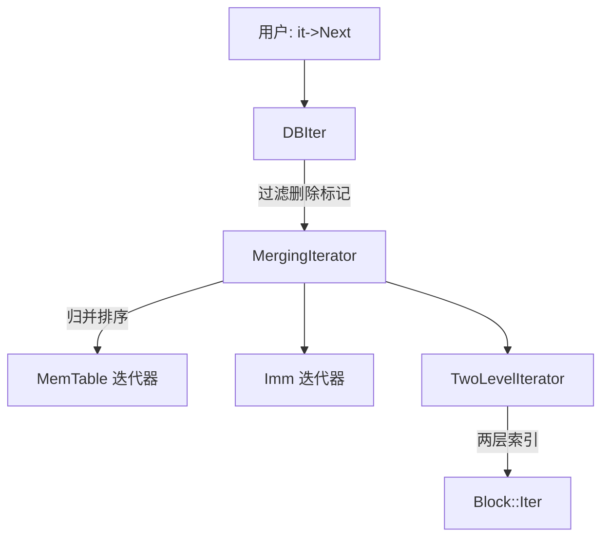
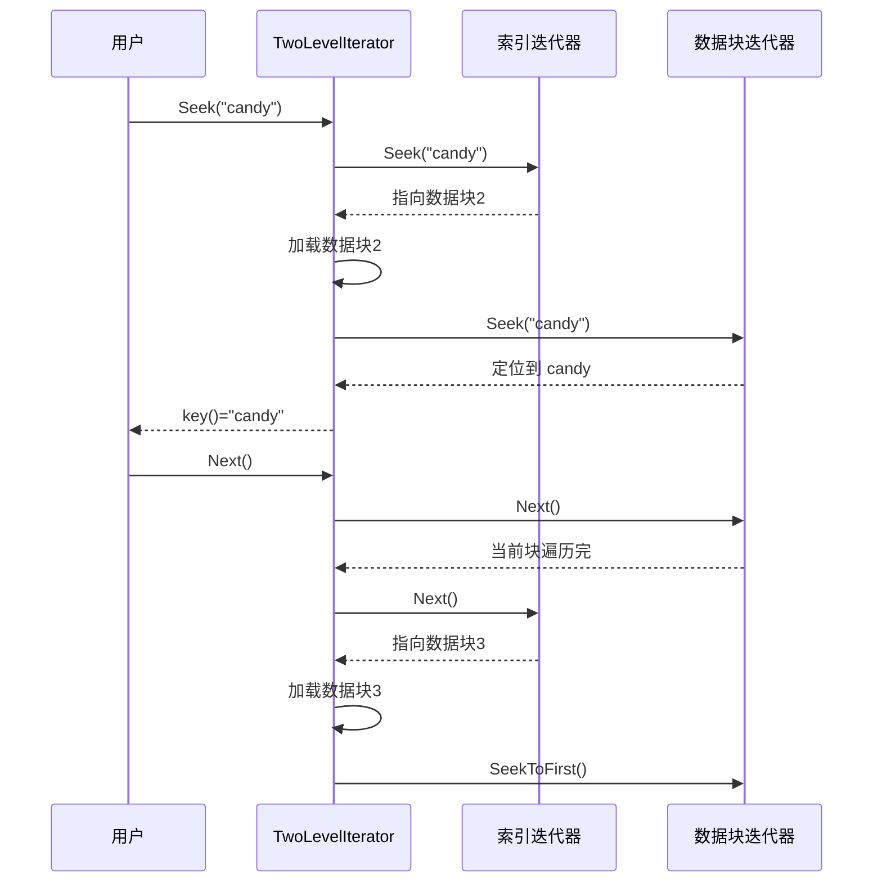
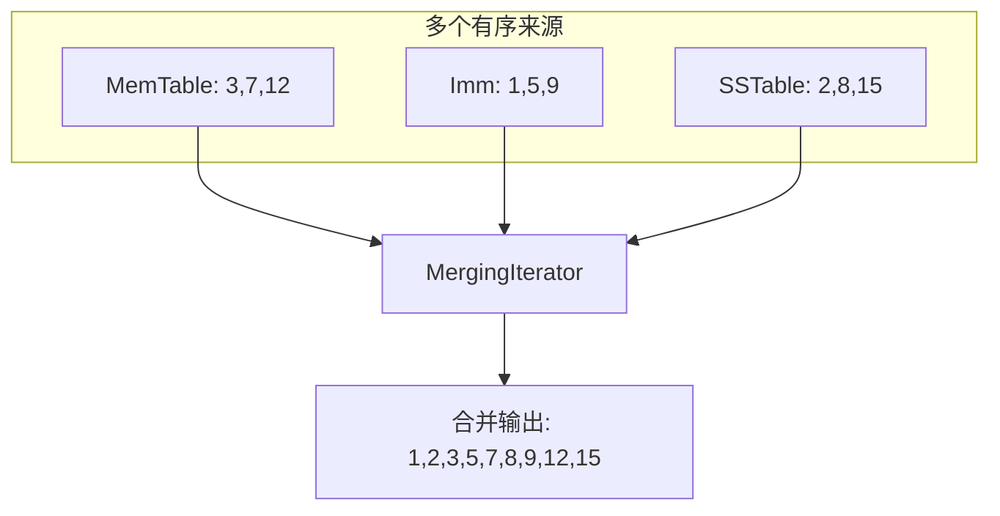
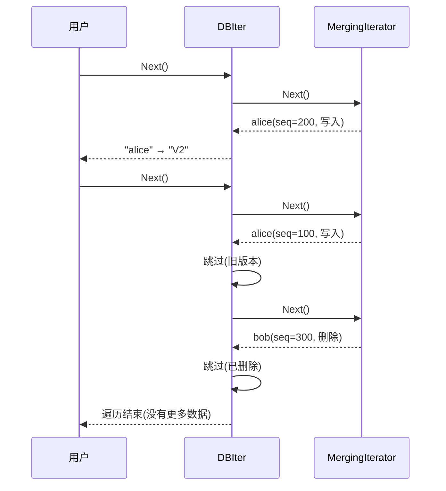
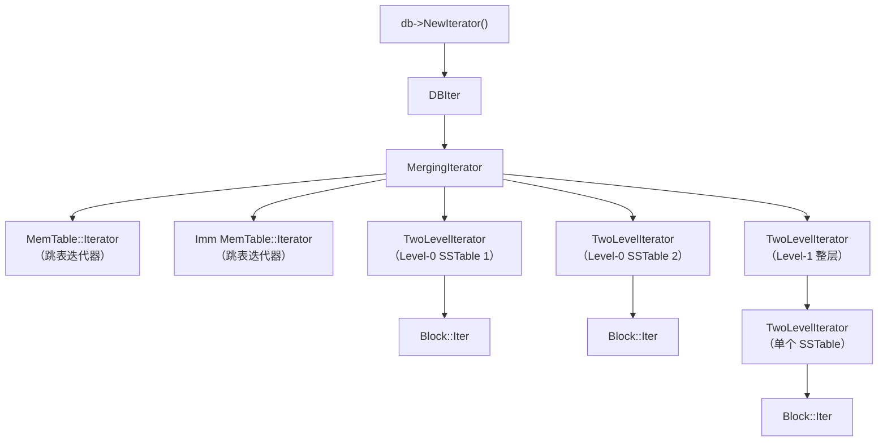
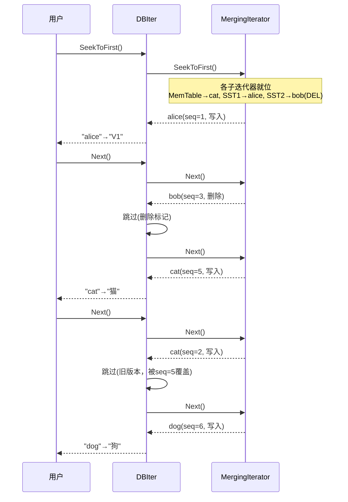

# Chapter 6: 迭代器体系 (Iterator)

在上一章 [有序表文件 (SSTable / Table)](05_有序表文件__sstable___table.md) 中，我们看到 SSTable 的查找和遍历都依赖于迭代器。实际上，LevelDB 中到处都在用迭代器——从单个数据块、到 SSTable 文件、再到整个数据库。本章，我们就来揭开这套精巧的**迭代器体系**是如何一层层嵌套工作的。

## 解决什么问题？

假设你现在要遍历整个数据库中的所有数据：

```cpp
leveldb::Iterator* it = db->NewIterator(readOptions);
for (it->SeekToFirst(); it->Valid(); it->Next()) {
  std::cout << it->key().ToString() << " = "
            << it->value().ToString() << std::endl;
}
delete it;
```

看起来很简单——就像翻阅一本通讯录，从头到尾逐条读出。但你想过没有，这背后发生了什么？

LevelDB 的数据**分散在多个地方**：

```
- 内存表 (MemTable)         → 最新的数据
- 不可变内存表 (Immutable)   → 等待刷盘的数据
- Level-0 的 SSTable 文件    → 可能有多个，范围可能重叠
- Level-1 的 SSTable 文件    → 有序，范围不重叠
- Level-2 的 SSTable 文件    → 更多...
```

每个地方的数据都是有序的，但**分布在不同的数据结构和文件中**。用户只想用一个简单的 `Next()` 就能按顺序读出所有数据——怎么做到？

答案就是：**迭代器套娃！**

## 俄罗斯套娃的比喻

LevelDB 的迭代器体系就像一组**俄罗斯套娃**：

```
最外层：DBIter（用户看到的）
  └─ MergingIterator（归并多个来源）
       ├─ MemTable 迭代器
       ├─ Immutable MemTable 迭代器
       ├─ TwoLevelIterator（Level-0 SSTable）
       ├─ TwoLevelIterator（Level-0 SSTable）
       └─ TwoLevelIterator（Level-1 整层）
            └─ Block::Iter（单个数据块）
```

每一层迭代器只负责一件事，层层包裹后，最终给用户呈现一个**简洁统一的"逐条读取"接口**。



## 统一接口：Iterator 基类

所有迭代器都实现同一个接口——就像所有电器都用同一种插头，不管冰箱、洗衣机还是电视机。

```cpp
// include/leveldb/iterator.h
class Iterator {
 public:
  virtual bool Valid() const = 0;       // 当前位置有效吗？
  virtual void SeekToFirst() = 0;       // 跳到第一条
  virtual void SeekToLast() = 0;        // 跳到最后一条
  virtual void Seek(const Slice& target) = 0; // 跳到目标位置
  virtual void Next() = 0;              // 下一条
  virtual void Prev() = 0;             // 上一条
  virtual Slice key() const = 0;        // 当前的 key
  virtual Slice value() const = 0;      // 当前的 value
  virtual Status status() const = 0;    // 有没有出错
};
```

只有 5 个核心移动操作 + 3 个查询操作。无论底层是内存中的跳表、磁盘上的数据块、还是多个文件的归并结果——对外的接口都一模一样。

这意味着：**写一段遍历代码，就能走遍 LevelDB 的所有角落。**

## 四种关键迭代器

我们按从底层到顶层的顺序，认识四种重要的迭代器：

| 迭代器 | 比喻 | 职责 |
|--------|------|------|
| **Block::Iter** | 翻一页字典 | 遍历单个数据块内的 key-value |
| **TwoLevelIterator** | 先查目录再翻正文 | 两层索引，懒加载数据块 |
| **MergingIterator** | 多路归并排序 | 将多个有序流合并为一个 |
| **DBIter** | 清洁工 | 过滤删除标记和旧版本，给用户看干净的数据 |

接下来我们一个一个拆解。

## 第一层：Block::Iter（翻一页字典）

这是最底层的迭代器，在上一章 [数据块与块构建器 (Block / BlockBuilder)](04_数据块与块构建器__block___blockbuilder.md) 中我们已经见过它了。它遍历**一个数据块内**的所有条目。

```
数据块（约4KB）：
  "alice" → "程序员"
  "alien" → "外星人"
  "bob"   → "设计师"
```

`Seek("alien")` 会利用重启点做二分查找，快速定位到 `"alien"`。`Next()` 则逐条往后走，自动处理前缀压缩的还原。

Block::Iter 就像在字典的**一页**上用手指逐行扫过——范围很小，速度很快。

## 第二层：TwoLevelIterator（先查目录再翻正文）

一个 SSTable 文件可能有几百个数据块。不可能把所有数据块都加载到内存。TwoLevelIterator 的巧妙之处是：**只在需要时才加载数据块**。

### 工作原理

```mermaid
graph LR
    subgraph 第一层：索引
        I1["索引条目1: → 数据块1"]
        I2["索引条目2: → 数据块2"]
        I3["索引条目3: → 数据块3"]
    end
    subgraph 第二层：数据
        D2["数据块2 的内容"]
    end
    I2 -->|按需加载| D2
```

就像查字典时：
1. **先翻目录**（索引迭代器）：找到 "candy" 可能在第 50 页
2. **再翻到第 50 页**（数据迭代器）：在该页中找到 "candy"

如果你接着要看 "cat"，还在同一页上，就不用再翻目录。直到翻完这一页，才去目录找下一页——这就是**懒加载**。

### Seek 的实现

```cpp
// table/two_level_iterator.cc
void TwoLevelIterator::Seek(const Slice& target) {
  index_iter_.Seek(target);     // 1. 先在索引中定位
  InitDataBlock();               // 2. 加载对应的数据块
  if (data_iter_.iter() != nullptr)
    data_iter_.Seek(target);     // 3. 在数据块中精确定位
  SkipEmptyDataBlocksForward();  // 4. 跳过空块
}
```

四步走：索引定位 → 加载数据块 → 块内查找 → 跳过空块。

### Next 的实现

```cpp
// table/two_level_iterator.cc
void TwoLevelIterator::Next() {
  assert(Valid());
  data_iter_.Next();              // 在当前数据块中前进一步
  SkipEmptyDataBlocksForward();   // 如果走到头了，跳到下一个块
}
```

正常情况下就是在当前数据块里 `Next()`。当前块遍历完了怎么办？

### 自动跳到下一个数据块

```cpp
// table/two_level_iterator.cc
void TwoLevelIterator::SkipEmptyDataBlocksForward() {
  while (data_iter_.iter() == nullptr || !data_iter_.Valid()) {
    if (!index_iter_.Valid()) {
      SetDataIterator(nullptr);  // 所有块都遍历完了
      return;
    }
    index_iter_.Next();           // 索引前进到下一个块
    InitDataBlock();              // 加载新的数据块
    if (data_iter_.iter() != nullptr)
      data_iter_.SeekToFirst();   // 从新块的第一条开始
  }
}
```

当前块遍历完后，索引迭代器前进一步，加载下一个数据块，从头开始继续。这一切对用户完全透明——用户只看到一个连续的有序序列。

### InitDataBlock：智能加载

```cpp
// table/two_level_iterator.cc（简化）
void TwoLevelIterator::InitDataBlock() {
  if (!index_iter_.Valid()) {
    SetDataIterator(nullptr);
  } else {
    Slice handle = index_iter_.value();
    if (handle.compare(data_block_handle_) == 0) {
      // 跟上次是同一个块，不用重新加载！
    } else {
      Iterator* iter = (*block_function_)(
          arg_, options_, handle);
      data_block_handle_.assign(handle.data(), handle.size());
      SetDataIterator(iter);
    }
  }
}
```

这里有个小优化：如果索引指向的还是同一个数据块（`handle` 没变），就不重新创建迭代器。这在连续遍历时避免了不必要的重复加载。

### TwoLevelIterator 的完整流程



## 第三层：MergingIterator（多路归并）

现在我们有了多个有序的迭代器——MemTable 一个、Immutable MemTable 一个、每个 SSTable 一个。怎么把它们合并成一个有序的流？

### 排队点餐的比喻

想象几个已排好队的窗口，每个窗口的客人手上都有一个号码牌（key）：

```
窗口A（MemTable）:    3, 7, 12
窗口B（Imm）:          1, 5, 9
窗口C（SSTable-1）:   2, 8, 15
```

MergingIterator 的工作：每次看一眼所有窗口**队首的号码**，取走最小的那个。

```
第1次：比较 3, 1, 2 → 取走 1（来自窗口B）
第2次：比较 3, 5, 2 → 取走 2（来自窗口C）
第3次：比较 3, 5, 8 → 取走 3（来自窗口A）
...
```

结果就是：1, 2, 3, 5, 7, 8, 9, 12, 15 —— **完美有序！**



### SeekToFirst：所有子迭代器就位

```cpp
// table/merger.cc
void MergingIterator::SeekToFirst() {
  for (int i = 0; i < n_; i++) {
    children_[i].SeekToFirst();  // 每个子迭代器跳到开头
  }
  FindSmallest();   // 找到最小的那个
  direction_ = kForward;
}
```

先让所有子迭代器定位到各自的第一条数据，然后从中找出 key 最小的那个作为当前位置。

### FindSmallest：找最小值

```cpp
// table/merger.cc
void MergingIterator::FindSmallest() {
  IteratorWrapper* smallest = nullptr;
  for (int i = 0; i < n_; i++) {
    IteratorWrapper* child = &children_[i];
    if (child->Valid()) {
      if (smallest == nullptr ||
          comparator_->Compare(child->key(),
                               smallest->key()) < 0) {
        smallest = child;
      }
    }
  }
  current_ = smallest;
}
```

遍历所有子迭代器，找出当前 key 最小的那个，记录为 `current_`。就像在几个排好队的窗口中找"号码最小的人"。

### Next：前进一步

```cpp
// table/merger.cc（简化）
void MergingIterator::Next() {
  assert(Valid());
  current_->Next();   // 当前最小的那个往前走一步
  FindSmallest();     // 重新比较，找出新的最小值
}
```

当前最小的子迭代器前进一步后，所有窗口的队首可能变了，所以重新比较找出新的最小值。非常直觉！

### Seek：所有子迭代器同时定位

```cpp
// table/merger.cc
void MergingIterator::Seek(const Slice& target) {
  for (int i = 0; i < n_; i++) {
    children_[i].Seek(target);  // 每个子迭代器定位到 target
  }
  FindSmallest();
  direction_ = kForward;
}
```

让每个子迭代器各自在自己的范围内 Seek 到 target（或 target 之后），然后找出最小的。

### 边界情况的优化

创建 MergingIterator 时有一个小优化：

```cpp
// table/merger.cc
Iterator* NewMergingIterator(const Comparator* cmp,
    Iterator** children, int n) {
  if (n == 0) return NewEmptyIterator();
  if (n == 1) return children[0];  // 只有1个，不用归并
  return new MergingIterator(cmp, children, n);
}
```

如果只有一个子迭代器，直接返回它就行了——根本不需要归并。这是一个**零开销抽象**的好例子。

## 第四层：DBIter（清洁工）

MergingIterator 合并后的数据流虽然有序，但里面包含了 LevelDB 内部的"脏数据"——**删除标记**和**旧版本**。用户不想看到这些。

### 为什么需要清理？

假设用户做了以下操作：

```
操作1: Put("alice", "V1")     序列号=100
操作2: Put("alice", "V2")     序列号=200
操作3: Delete("bob")          序列号=300
```

MergingIterator 看到的内部数据流是这样的：

```
("alice", seq=200, 写入) → "V2"
("alice", seq=100, 写入) → "V1"
("bob",   seq=300, 删除)
```

用户应该看到的是：

```
"alice" → "V2"   （只保留最新版本）
                  （bob 被删除了，不应该出现）
```

DBIter 就是那个**清洁工**——它包裹在 MergingIterator 外面，过滤掉删除标记和旧版本，给用户呈现干净的视图。



### Seek：定位并清理

```cpp
// db/db_iter.cc
void DBIter::Seek(const Slice& target) {
  direction_ = kForward;
  saved_key_.clear();
  // 构造内部查找键（附加序列号）
  AppendInternalKey(&saved_key_,
      ParsedInternalKey(target, sequence_,
                        kValueTypeForSeek));
  iter_->Seek(saved_key_);  // 内部迭代器定位
  if (iter_->Valid()) {
    FindNextUserEntry(false, &saved_key_);
  } else {
    valid_ = false;
  }
}
```

先用内部迭代器定位（附加了序列号信息），然后调用 `FindNextUserEntry` 跳过不该展示的条目。

### FindNextUserEntry：核心过滤逻辑

这是 DBIter 最重要的方法——**向前扫描，跳过删除和旧版本**。

```cpp
// db/db_iter.cc（简化）
void DBIter::FindNextUserEntry(bool skipping,
                                std::string* skip) {
  do {
    ParsedInternalKey ikey;
    if (ParseKey(&ikey) && ikey.sequence <= sequence_) {
      switch (ikey.type) {
        case kTypeDeletion:
          // 遇到删除标记：记住这个 key，后续跳过它
          SaveKey(ikey.user_key, skip);
          skipping = true;
          break;
        case kTypeValue:
          if (skipping && user_comparator_->Compare(
              ikey.user_key, *skip) <= 0) {
            // 这个 key 被删除了，跳过
          } else {
            valid_ = true;
            return;  // 找到了合法的条目！
          }
          break;
      }
    }
    iter_->Next();
  } while (iter_->Valid());
  valid_ = false;  // 遍历完了
}
```

核心逻辑很清晰：
1. 遇到**删除标记**→ 记住这个 key，后面遇到同名 key 就跳过
2. 遇到**写入操作**→ 检查是否被删除标记覆盖；没有就返回给用户
3. **序列号检查** (`ikey.sequence <= sequence_`)：只看用户启动迭代器时已存在的数据，保证一致性

### key() 和 value() 的实现

```cpp
// db/db_iter.cc
Slice key() const override {
  return (direction_ == kForward)
      ? ExtractUserKey(iter_->key()) // 去掉序列号等内部信息
      : saved_key_;
}
Slice value() const override {
  return (direction_ == kForward)
      ? iter_->value()
      : saved_value_;
}
```

DBIter 在返回 key 时会用 `ExtractUserKey` 去掉内部的序列号和类型标签——用户只看到干净的用户 key。

### 创建 DBIter

```cpp
// db/db_iter.cc
Iterator* NewDBIterator(DBImpl* db,
    const Comparator* user_key_comparator,
    Iterator* internal_iter,
    SequenceNumber sequence, uint32_t seed) {
  return new DBIter(db, user_key_comparator,
                    internal_iter, sequence, seed);
}
```

传入内部迭代器（MergingIterator）和当前序列号，DBIter 就负责包装出用户友好的视图。

## IteratorWrapper：小而巧的加速器

在上面的代码中，你会注意到 MergingIterator 和 TwoLevelIterator 内部使用的不是裸的 `Iterator*`，而是 `IteratorWrapper`。它是什么？

```cpp
// table/iterator_wrapper.h（简化）
class IteratorWrapper {
  Iterator* iter_;
  bool valid_;     // 缓存 iter_->Valid()
  Slice key_;      // 缓存 iter_->key()

  void Update() {
    valid_ = iter_->Valid();
    if (valid_) key_ = iter_->key();
  }
};
```

IteratorWrapper 的作用是**缓存** `Valid()` 和 `key()` 的结果。因为 `Iterator` 的方法是虚函数（virtual），每次调用都有间接跳转的开销。MergingIterator 的 `FindSmallest` 要反复调用 `Valid()` 和 `key()`——缓存后可以直接读取成员变量，快得多。

就像你频繁查看手表时间——与其每次都拿出手机亮屏，不如戴块手表，一抬手就看到了。

## 完整的套娃组装

现在让我们看看，当用户调用 `db->NewIterator()` 时，这些迭代器是怎么一层层组装起来的。



组装过程概览（在 `DBImpl` 中）：

1. 为当前 [内存表 (MemTable)](03_内存表__memtable.md) 创建跳表迭代器
2. 如果有不可变 MemTable，也创建一个迭代器
3. 为每个 Level-0 的 SSTable 创建 TwoLevelIterator
4. 为 Level-1 及以上的每层创建一个 TwoLevelIterator（层级内再嵌套一层）
5. 把以上所有迭代器交给 **MergingIterator** 归并
6. 最外面再包一层 **DBIter** 做清理

整个过程就像组装俄罗斯套娃——从最里面的 Block::Iter 开始，一层层往外包。

## 实际遍历示例

让我们用一个完整的例子，看看迭代器套娃是怎么协作的。

假设数据库中有：

```
MemTable:     "cat"→"猫"(seq=5), "dog"→"狗"(seq=6)
SSTable文件1: "alice"→"V1"(seq=1), "cat"→"猫old"(seq=2)
SSTable文件2: "bob"→"DEL"(seq=3, 删除标记)
```

用户调用 `SeekToFirst()` 并逐条 `Next()`：



用户看到的最终结果：`alice→V1`, `cat→猫`, `dog→狗`。干干净净！

- `bob` 因为有删除标记被 DBIter 过滤掉了
- `cat` 的旧版本（seq=2）被新版本（seq=5）覆盖，也被跳过了

## 反向遍历：Prev() 的特殊处理

迭代器不仅支持正向遍历，还支持反向。DBIter 的 `Prev()` 实现稍微复杂一些，因为内部数据的排列方式对正向更友好。

```cpp
// db/db_iter.cc（简化）
void DBIter::Prev() {
  if (direction_ == kForward) {
    // 正向转反向：需要先倒退到当前 key 之前
    SaveKey(ExtractUserKey(iter_->key()), &saved_key_);
    while (true) {
      iter_->Prev();
      if (!iter_->Valid()) { valid_ = false; return; }
      if (user_comparator_->Compare(
          ExtractUserKey(iter_->key()), saved_key_) < 0)
        break;
    }
    direction_ = kReverse;
  }
  FindPrevUserEntry();
}
```

切换方向时，需要先把内部迭代器退到当前 key 的所有版本**之前**，然后再用 `FindPrevUserEntry` 找到上一个有效的用户 key。

反向查找时，DBIter 需要把 key 和 value **存到** `saved_key_` 和 `saved_value_` 中，因为内部迭代器实际停在更早的位置。

## 清理回调：RegisterCleanup

迭代器还有一个实用的小功能——**清理回调**：

```cpp
// include/leveldb/iterator.h
void RegisterCleanup(CleanupFunction func,
                     void* arg1, void* arg2);
```

可以注册一些在迭代器销毁时自动执行的清理函数。比如释放缓存引用、归还内存等。析构函数中会自动调用所有已注册的清理函数：

```cpp
// table/iterator.cc
Iterator::~Iterator() {
  if (!cleanup_head_.IsEmpty()) {
    cleanup_head_.Run();
    for (CleanupNode* node = cleanup_head_.next;
         node != nullptr; ) {
      node->Run();
      CleanupNode* next_node = node->next;
      delete node;
      node = next_node;
    }
  }
}
```

用链表存储清理函数，析构时依次执行。这样迭代器的使用者只需要 `delete it;` 就能自动清理所有关联资源。

## 各层迭代器的完整对比

| 迭代器 | 输入 | 输出 | 核心操作 |
|--------|------|------|----------|
| Block::Iter | 一个数据块 | 块内的 key-value | 二分查找 + 前缀解码 |
| TwoLevelIterator | 索引迭代器 + 块加载函数 | SSTable 的所有 key-value | 懒加载数据块 |
| MergingIterator | N 个有序子迭代器 | 全局有序的 key-value 流 | 比较所有子迭代器取最小 |
| DBIter | 一个内部迭代器 + 序列号 | 干净的用户 key-value | 过滤删除和旧版本 |

## 总结

在本章中，我们学习了：

1. **统一的 Iterator 接口**：5 个移动操作 + 3 个查询操作，所有迭代器都实现同一接口
2. **TwoLevelIterator**：两层索引加懒加载，遍历 SSTable 时只在需要时加载数据块
3. **MergingIterator**：将多个有序子迭代器归并为一个全局有序的流，核心是 `FindSmallest`
4. **DBIter**：包裹在最外层的"清洁工"，过滤删除标记和旧版本，给用户干净的视图
5. **IteratorWrapper**：缓存 `Valid()` 和 `key()`，避免虚函数调用开销
6. **俄罗斯套娃**架构：从 Block::Iter → TwoLevelIterator → MergingIterator → DBIter，层层嵌套，各司其职

这套迭代器体系是 LevelDB 最优雅的设计之一——通过组合简单的组件，解决了"从分散在内存和磁盘各处的数据中，给用户呈现一个统一有序视图"这个复杂问题。

在遍历数据时，SSTable 的数据块会被频繁读取。为了避免反复从磁盘加载同一个数据块，LevelDB 使用了缓存机制。在下一章 [LRU 缓存 (Cache)](07_lru_缓存__cache.md) 中，我们将了解这个加速利器是如何工作的！

---

Generated by [AI Codebase Knowledge Builder](https://github.com/The-Pocket/Tutorial-Codebase-Knowledge)